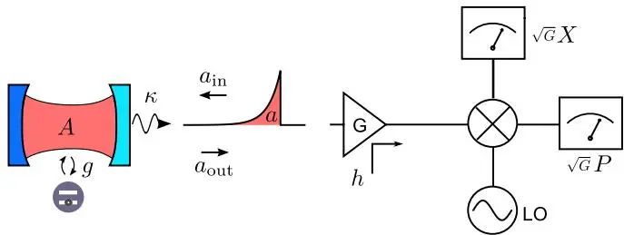
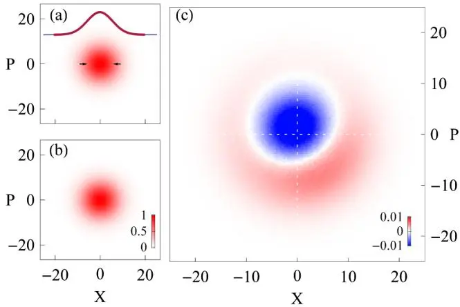
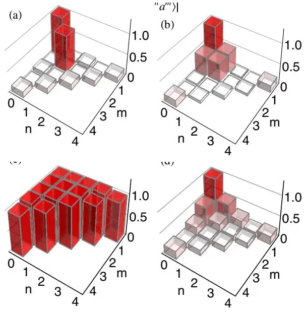
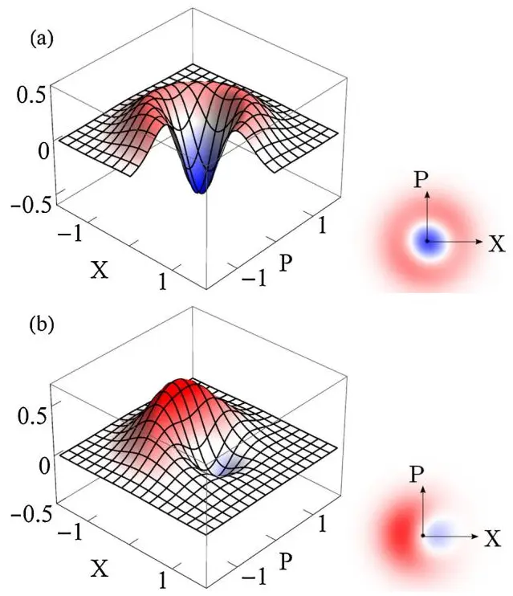

# Experimental State Tomography of Itinerant Single Microwave Photons
## 行进单个微波光子的实验态层析

**C. Eichler, D. Bozyigit, C. Lang, L. Steffen, J. Fink, A. Wallraff**

Department of Physics, ETH Zürich

*Phys. Rev. Lett.* **106**, 220503 (2011)

## 摘要

研究局域在超导腔中的微波光子的实验，对我们理解辐射的量子性质做出了重要贡献。但**行进（propagating / itinerant）微波光子**至今研究甚少。本文通过分析测量振幅分布最高到四阶的矩，重构了行进单光子 Fock 态及其与真空态叠加态的量子态。使用线性放大器与正交振幅检测器，我们发展了把检测到的单光子信号与放大器添加的噪声有效分离的方法。从测量数据中我们还重建了相应的 **Wigner 函数**。

---

## 背景与动机

微波频率光子的量子性质，通常在腔量子电动力学（QED）实验中研究——用 Rydberg 原子 [1,2] 或超导电路 [3–5]。行进的单个微波光子已被产生 [6]，但其量子性质远未被同等深入地研究，部分原因是该频段高效的**单光子计数器仍在发展中** [7]。然而近期表明，用线性放大器与正交振幅检测器在关联测量中可观测到行进微波光子的特征量子性质（如反聚束）[8,9]。


腔 QED 中光子被「困」在腔里，可反复测量；行进光子沿传输线飞走，**只能测一次**。光学频段有单光子计数器（雪崩二极管等），微波频段没有成熟等效器件——只能靠线性放大 + 正交检测，但放大器会加噪声。本文的核心贡献就是「如何在强放大器噪声中提取单光子的量子信号」。


任意场模 $a$ 的量子态由其密度矩阵 $\rho$ 或等价的准概率分布（Wigner、Husimi $Q$、Glauber-Sudarshan $P$）[13,14] 刻画。较少被意识到的是，场模 $a$ 也可等价地由其无穷矩集合 $\langle(a^\dagger)^n a^m\rangle$ [15] 唯一确定。本文正是用**最高到四阶的场矩测量**来刻画单光子态。

### 光学 vs 微波的层析方法

| | 光学（平方律探测器） | 微波（线性放大器） |
|---|---|---|
| 测量量 | 强度（光子数） | 振幅（场强） |
| 零差（homodyne） | 相敏放大，单正交分量，逆 Radon 变换重建 Wigner | 需相敏放大器（理想：单正交无噪声放大） |
| 外差（heterodyne） | 测量共轭正交的联合统计（Husimi $Q$） | 用相不敏放大器同时测两正交 [19,20] |
| 噪声 | 探测器效率为主 | 放大器**必须加至少真空噪声**，通常远多 |

光学领域有大量用平方律探测器重建光量子态的技术 [16]。微波频段用线性放大器测振幅，可实现零差（相敏放大器，理想下无噪声放大单正交、衰减另一正交）。但**最先进的常规线性放大器是相不敏的**——等量放大两个正交，且至少加入真空噪声，通常更多。本文用这类放大器实现外差检测：对固定本振相位同时测量共轭正交。

---

## 实验方案

### 单光子源：circuit QED + transmon

在 circuit QED 装置中实现单光子源：频率 $\nu_r \approx 6.77$ GHz 的传输线谐振器耦合到单个 transmon 量子比特，真空 Rabi 频率 $2g/2\pi \approx 146$ MHz [9]。把制备在叠加态 $\alpha|g\rangle + \beta|e\rangle$ 的量子比特调入与谐振器共振，精确保持半个真空 Rabi 周期，生成单光子态 $\alpha|0\rangle + \beta|1\rangle$ [9,22]。态制备时间远短于腔衰减时间 $\tau = 1/\kappa \approx 40$ ns。每 800 ns 重复一次光子生成，每小时可制备约 $4\times10^9$ 个单光子态。

### 从腔模到行进场模

腔中场经输出边界条件衰减进输出模 $a_{\mathrm{out}}$：

$$
a_{\mathrm{out}}(t) = \sqrt{\kappa}\,A(t) - a_{\mathrm{in}}(t),
$$

其中 $a_{\mathrm{in}}$ 处于真空态（图 1）。对输出信号在加权时间窗 $f(t)$ 上积分，定义单一时间无关模 $a = \int dt\,f(t)\,a_{\mathrm{out}}(t)$。考虑谐振器动力学 $A(t) = e^{-\kappa t/2}A(0) + \sqrt{\kappa}e^{-\kappa t/2}\int_0^t d\tau\,e^{\kappa\tau/2}a_{\mathrm{in}}(\tau)$ [24]，选择 $f(t) = \sqrt{\kappa}\,e^{-\kappa t/2}\Theta(t)$（$\Theta$ 为阶跃函数）导致恒等式 $a = A(0)$。


通过选择与腔衰减匹配的时间模式函数 $f(t) = \sqrt{\kappa}e^{-\kappa t/2}\Theta(t)$，行进场模 $a$ 与制备时刻 $t=0$ 的腔模 $A(0)$ 处于**同一量子态**。这把「行进光子层析」严格地归结为「腔模层析」——是本文方法的理论根基。


图 1：实验装置简化示意。用单面腔（一面高反射、一面部分透射）的光学类比表示光子源。把制备在激发态、与腔失谐的量子比特调入共振半个真空 Rabi 周期 $\pi/2g$，在腔中产生单光子。光子以速率 $\kappa$ 发射进输出模 $a_{\mathrm{out}}$，呈指数衰减包络，$a_{\mathrm{in}}$ 保持真空。信号经有效增益 $G$ 放大并加入模式 $h$ 的噪声 [8,19]。放大信号在微波正交混频器中与本振（LO）下变频，两个正交振幅 $X$、$P$ 由模数转换器记录，用 FPGA 实时存入二维直方图。

### 放大器链与噪声分离

信号通过有效增益 $G$ 的相不敏放大器链，引入附加噪声模 $h$。放大信号等分成两路，分别与同相、正交本振混频，同时检测共轭正交分量 $\hat{X}$、$\hat{P}$：

$$
\sqrt{G}(\hat{X} + i\hat{P}) = \sqrt{G}(a + h^\dagger) \equiv \hat{S}, \tag{1}
$$

定义复振幅算符 $\hat{S}$ [8]。

若放大器量子极限（$h$ 在真空态），放大器输出的量子态可用 Husimi $Q$ 函数表示 $Q_{\mathrm{out}}(\sqrt{G}\alpha) = Q_{\mathrm{in}}(\alpha)/G$ [25]——$Q$ 函数在放大下仅缩放、不变。因此 $\hat{S}$ 的测量结果按 $Q_{\mathrm{out}}(S)$ 分布。但 10 GHz 以下最好的商用放大器加入有效温度 $T_{\mathrm{noise}} \approx 2$ K 的热噪声，**远非量子极限**。噪声模 $h$ 近似处于热态（高斯相空间分布）。此时 $\hat{S}$ 在放大器输出的测量分布 [26]

$$
D^{[\rho]}(S) = \frac{1}{G}\int d^2\beta\,P_a(\beta)\,Q_h(S^*/\sqrt{G} - \beta^*) \tag{2}
$$

可解释为**模 $a$ 的 $P$ 函数与噪声模 $h$ 的 $Q$ 函数的卷积**。

### 双测量分离信号与噪声

把 $\hat{S}$ 的重复测量结果（$X$、$P$ 瞬时值）存入 $1024\times1024$ 二维直方图，对应概率分布 $D^{[\rho]}(S)$ 的离散化。为单独提取模 $a$ 的性质，做**两次测量**：

1. **真空参考**：模 $a$ 留在真空，$P_a(\beta) = \delta^{(2)}(\beta)$，分布
$$
D^{[|0\rangle\langle 0|]}(S) = \frac{1}{G}Q_h(S^*/\sqrt{G}). \tag{3}
$$
2. **目标态**：制备感兴趣的态 $|\psi\rangle$（如 Fock 态 $|1\rangle$）。

两次直方图**交错累积**（每 25 μs 切换），避免漂移导致的系统误差。

图 2：(a) 模 $a$ 在真空时测得的正交直方图 $D^{[|0\rangle\langle 0|]}(S)$，$\bar{S} = \sqrt{G}(X+iP)$。插图为水平截面（红粗线），可用 $\sigma = 5.7$ 的正态分布（蓝细线）描述，对应系统噪声温度 $T_{\mathrm{noise}} \approx 21$ K。(b) 制备单光子 Fock 态时的正交直方图 $D^{[|1\rangle\langle 1|]}(S)$。(c) $D^{[|1\rangle\langle 1|]}(S)$ 与 $D^{[|0\rangle\langle 0|]}(S)$ 之差。注意两种不同色标，均以 $D^{[|1\rangle\langle 1|]}(0)$ 为单位。

两个直方图（真空 $D^{[|0\rangle\langle 0|]}$、Fock 态 $D^{[|1\rangle\langle 1|]}$）都被放大器噪声主导（图 2a、b）。但两者数值之差（图 2c）已清晰显示单光子相空间分布的**圆对称特征**。轻微偏离理想圆对称，源于态制备误差导致的真空对单光子 Fock 态的小相干混入。

---

## 矩分析与 Wigner 函数重建

### 矩的提取

计算两个直方图最高到四阶（$n+m=4$）的矩

$$
\langle(\hat{S}^\dagger)^n\hat{S}^m\rangle_\rho = \int d^2S\,(S^*)^n S^m\,D^{[\rho]}(S). \tag{4}
$$

当噪声与信号不相关时，这些矩对应算符平均

$$
\langle(\hat{S}^\dagger)^n\hat{S}^m\rangle_\rho = G^{(n+m)/2}\sum_{i,j=0}^{n,m}\binom{m}{j}\binom{n}{i}\langle(a^\dagger)^i a^j\rangle\langle h^{n-i}(h^\dagger)^{m-j}\rangle. \tag{5}
$$

$a$ 在真空时退化为 $\langle(\hat{S}^\dagger)^n\hat{S}^m\rangle_{|0\rangle\langle 0|} = G^{(n+m)/2}\langle h^n(h^\dagger)^m\rangle$。式 (5) 可反演，从 $\langle(\hat{S}^\dagger)^n\hat{S}^m\rangle_\rho$ 与真空参考 $\langle(\hat{S}^\dagger)^n\hat{S}^m\rangle_{|0\rangle\langle 0|}$ 计算出模 $a$ 的矩 $\langle(a^\dagger)^n a^m\rangle$（图 3a）。

图 3：最高到四阶的正规序矩 $|\langle(a^\dagger)^n a^m\rangle|$。(a) 单光子 Fock 态；(b) 叠加态 $(|0\rangle - |1\rangle)/\sqrt{2}$；(c) 振幅 $\alpha=1$ 的相干态；(d) 振幅 $\alpha=0.5$ 的相干态。

### 单光子 Fock 态的矩

对 Fock 态 $|1\rangle$（图 3a）：

- 所有**非对角矩**接近零（圆对称相空间分布的特征，如纯 Fock 态或热态）。
- 四阶矩 $\langle(a^\dagger)^2 a^2\rangle \approx 0$，**指示反聚束** [9]——单光子态的标志。对比：相同平均光子数的热态非对角矩为零，但对角四阶矩有限。
- 残余真空混入导致小平均振幅 $|\langle a\rangle| = 0.044$、略低平均光子数 $\langle a^\dagger a\rangle = 0.91$。

对每种态积分 12 h，四阶矩误差约 0.1（矩的统计误差随阶数指数增长 [8]）；一、二、三阶矩误差分别约 $1.5\times10^{-3}$、$4.5\times10^{-3}$、$1.5\times10^{-2}$。

### 叠加态与相干态的验证

叠加态 $(|0\rangle + e^{i\phi}|1\rangle)/\sqrt{2}$（图 3b）：理想下平均振幅等于平均光子数 $|\langle a\rangle| = \langle a^\dagger a\rangle = 0.5$。利用一阶与二阶矩对增益 $G$ 的不同标度特性，**校准了放大器链的有效增益**，使 $X$、$P$ 轴对应 $a + h^\dagger$ 的实虚部。测得 $|\langle a\rangle| = 0.466$，接近预期。

为验证方案有效性，还生成了相干态：振幅 $\alpha = 1$（图 3c，所有矩接近 1，证明检测链系统误差如非线性可忽略）、$\alpha = 0.5$（图 3d，矩按 $0.5^{n+m}$ 指数衰减）。

### Wigner 函数重建

从测得矩重建 Wigner 函数（图 4）：

$$
W(\alpha) = \sum_{n,m}\int d^2\lambda\,\frac{\langle(a^\dagger)^n a^m\rangle(-\lambda^*)^m\lambda^n}{\pi^2 n! m!}\,e^{(-1/2)|\lambda|^2 + \alpha\lambda^* - \alpha^*\lambda}.
$$

只需展开到 $n+m=3$，因 $\langle(a^\dagger)^2 a^2\rangle \sim 0$（对 Fock 态 $|k\rangle$，对角矩 $\langle k|(a^\dagger)^n a^n|k\rangle$ 在 $n>k$ 时为零）。

图 4：Wigner 函数 $W(\alpha = X + iP)$。(a) 单光子 Fock 态——清晰显示**负值**，表明观测态的量子特性。(b) 叠加态 $(|0\rangle - |1\rangle)/\sqrt{2}$——有限平均振幅导致分布质心偏离原点，但负值仍存，展示 $|0\rangle$ 与 $|1\rangle$ 间的量子相干。


单光子 Fock 态的 Wigner 函数（图 4a）在原点附近显示**清晰的负值**——这是态非经典性的直接证据，经典概率分布不可能为负。叠加态（图 4b）虽有偏离原点的质心，仍保留负值，证明 $|0\rangle$ 与 $|1\rangle$ 间的量子相干。改变叠加态相对相位 $\phi$，Wigner 函数随之旋转（未示）。


---

## 结论

我们用线性放大、正交振幅检测与高效数据分析，测量了行进单微波光子与小幅相干场的最高到四阶矩。在仅一个检测通道的设置中，实现了把量子信号与放大器噪声分离的方法。行进微波场将在未来的量子光学与量子信息实验 [27] 中被更深入研究，其中低噪声参量放大器 [28–30] 有望显著提升检测效率。

---

## 参考文献


学术论文的参考文献条目按国际惯例保留原文，便于检索原文。以下为本文引用的主要文献。


1. Haroche, Raimond, *Exploring the Quantum: Atoms, Cavities, and Photons* (Oxford, 2006). — **CQED 经典教材。**
2. Raimond, Brune, Haroche, *Rev. Mod. Phys.* **73**, 565 (2001).
3. Blais et al., *Phys. Rev. A* **69**, 062320 (2004). — **circuit QED 理论奠基。**
4. Wallraff et al., *Nature* **431**, 162 (2004). — **circuit QED 实验奠基。**
5. Hofheinz et al., *Nature* **459**, 546 (2009). — 腔中 Fock 态合成。
6. Houck et al., *Nature* **449**, 328 (2007). — 行进单微波光子的产生。
7. Chen et al., arXiv:1011.4329 (2010). — 微波单光子计数器。
8. da Silva, Bozyigit, Wallraff, Blais, *Phys. Rev. A* **82**, 043804 (2010). — **本文矩分析方法的理论基础。**
9. Bozyigit et al., *Nature Phys.* **7**, 154 (2010). — **行进微波光子反聚束的观测，本文的前作。**
10. Chow et al., *Phys. Rev. A* **82**, 040305 (2010).
11. Palacios-Laloy et al., *Nature Phys.* **6**, 442 (2010).
12. Astafiev et al., *Science* **327**, 840 (2010). — 共振荧光。
13. Gerry, Knight, *Introductory Quantum Optics* (Cambridge, 2005).
14. Carmichael, *Statistical Methods in Quantum Optics 1* (Springer, 1999).
15. Bužek, Adam, Drobný, *Phys. Rev. A* **54**, 804 (1996). — **场模由其无穷矩集合唯一确定。**
16. Lvovsky, Raymer, *Rev. Mod. Phys.* **81**, 299 (2009). — 光学量子态层析综述。
17. Smithey, Beck, Raymer, *Phys. Rev. Lett.* **70**, 1244 (1993). — 光学层析的逆 Radon 变换。
18. Welsch, Vogel, Opatrný, arXiv:0907.1353 (2009).
19. Caves, *Phys. Rev. D* **26**, 1817 (1982). — **线性放大器的量子噪声极限。**
20. Clerk et al., *Rev. Mod. Phys.* **82**, 1155 (2010). — 量子测量与放大的权威综述。
21. Menzel et al., *Phys. Rev. Lett.* **105**, 100401 (2010). — 双通道分离信号与噪声。
22. Hofheinz et al., *Nature* **454**, 310 (2008). — 腔中任意光子态合成。
23. Gardiner, Collett, *Phys. Rev. A* **31**, 3761 (1985). — 输入输出理论。
24. Walls, Milburn, *Quantum Optics* (Springer, 1994).
25. Nha, Milburn, Carmichael, *New J. Phys.* **12**, 103010 (2010). — 放大下 $Q$ 函数不变性。
26. Kim, *Phys. Rev. A* **56**, 3175 (1997). — $P$ 函数与 $Q$ 函数卷积的测量分布。
27. Kok et al., *Rev. Mod. Phys.* **79**, 135 (2007). — 线性光学量子计算综述。
28. Castellanos-Beltran, Lehnert, *Appl. Phys. Lett.* **91**, 083509 (2007). — 微波参量放大器。
29. Bergeal et al., *Nature* **465**, 64 (2010). — 约瑟夫森参量放大器。
30. Yamamoto et al., *Appl. Phys. Lett.* **93**, 042510 (2008).
31. Mallet et al., *Phys. Rev. Lett.* **106**, 220502 (2011). — 同期用不同方法实现类似态重建。

---

## 阅读笔记

### 一句话概括

在 circuit QED 里用 transmon 量子比特把单光子「写」进腔、再让腔衰减成行进脉冲；用相不敏线性放大器同时测两个正交分量，做两次测量（真空参考 + 目标态）相减消掉放大器噪声，算出最高到四阶的场矩，重建出行进单光子 Fock 态的 **Wigner 函数**——它有负值，证明行进微波场是真正量子的。

### 核心论证链

1. **腔模 → 行进场模的严格映射**：选时间模式函数 $f(t) = \sqrt{\kappa}e^{-\kappa t/2}\Theta(t)$，行进模 $a = \int f(t)a_{\mathrm{out}}(t)dt$ 恒等于制备时刻的腔模 $A(0)$。这让「行进光子层析」有了严格的理论根基。
2. **放大器加噪声不可避免**：相不敏放大器至少加真空噪声，本文实际加 ~21 K 热噪声（$\sigma = 5.7$），信号被淹没。但测量分布 $D^{[\rho]}(S)$ 是信号 $P$ 函数与噪声 $Q$ 函数的**卷积**（式 2）。
3. **双测量消噪声**：真空参考给出纯噪声分布 $Q_h$，目标态分布减去它，差值里只剩信号的圆对称结构（图 2c）。交错采集（每 25 μs 切换）避免漂移。
4. **矩的反演**：式 (5) 把含噪声的测量矩 $\langle(\hat{S}^\dagger)^n\hat{S}^m\rangle$ 分解成信号矩 $\langle(a^\dagger)^i a^j\rangle$ 与噪声矩之积，用真空参考定出噪声矩后反解信号矩。
5. **Wigner 函数重建**：从信号矩按公式重建 Wigner 函数，单光子态的 Wigner 函数在原点为负——量子性的「冒烟检测」。

### 关键物理：为什么矩能完全刻画量子态？

任意场模 $a$ 的量子态可由密度矩阵 $\rho$ 或 Wigner/$Q$/$P$ 函数刻画。但 Bužek 等 [15] 指出一个较少被用的事实：**正规序矩 $\langle(a^\dagger)^n a^m\rangle$ 的无穷集合也唯一确定量子态**。本文只用最高到四阶矩，因为：

- 单光子 Fock 态 $|1\rangle$ 的对角矩 $\langle(a^\dagger)^n a^n\rangle$ 在 $n>1$ 时为零（$|1\rangle$ 最多有一个光子）。
- 一旦某个对角矩 $\langle(a^\dagger)^N a^N\rangle = 0$，所有 $n+m \geq 2N-1$ 的高阶矩也都为零。
- 对 $|1\rangle$，$\langle(a^\dagger)^2 a^2\rangle = 0$ 意味着 $n+m\geq 3$ 的矩都为零，所以测到四阶（$n+m=4$）已**冗余地覆盖**了全部非零矩。

这是「为什么四阶够用」的数学根基——单光子态的矩结构在低阶就闭合了。对比：热态或相干态的高阶矩不为零，需要更高阶测量，但本文只关心单光子 + 真空叠加这类低激发态。

### 信号-噪声分离的精妙

本文的方法学核心是「**单通道**分离信号与噪声」。关键洞察：

- 放大器输出分布 $D^{[\rho]}(S)$ = 信号 $P_a$ ⊛ 噪声 $Q_h$（卷积，式 2）。
- 真空参考时 $P_a = \delta^{(2)}$（二维 δ 函数），卷积退化为 $D^{[|0\rangle]} = Q_h/G$（式 3）——**直接测出噪声分布本身**。
- 目标态分布减去真空分布，差值里噪声的「平滑背景」被消掉，露出信号的圆对称结构（图 2c）。

这与同期 Menzel 等 [21] 的「双通道」方案不同——后者用两条独立放大器链做交叉关联。本文用单链 + 交错采集，硬件更简单，但要求两次测量的噪声统计稳定（25 μs 切换保证这一点）。代价是：相减会放大统计涨落，所以需要长时间积分（每种态 12 h）。

### 反聚束：单光子的指纹

四阶矩 $\langle(a^\dagger)^2 a^2\rangle \approx 0$ 是**反聚束**的标志 [9]：同时检测到两个光子的概率几乎为零。这是单光子态区别于相干态（泊松统计）、热态（超泊松/聚束统计）的关键。对比三种态的矩：

| 态 | 非对角矩 | $\langle(a^\dagger)^2 a^2\rangle$ | 物理含义 |
|----|----------|-----------------------------------|----------|
| 单光子 Fock $|1\rangle$ | $\approx 0$ | $\approx 0$ | 反聚束，量子非经典 |
| 相干态 $|\alpha\rangle$ | $\propto (\alpha^*)^n\alpha^m$（非零） | $|\alpha|^4$ | 泊松统计，最经典 |
| 热态 | $\approx 0$ | 有限 | 聚束（$g^{(2)}=2$），正 $P$ 函数 |

单光子态的 $\langle(a^\dagger)^2 a^2\rangle \approx 0$ 直接对应 $g^{(2)}(0) = 0$——这就是 Hanbury Brown-Twiss 意义下的反聚束。

### 批判性思考

**1. 21 K 噪声温度的代价。** 本文放大器链有效噪声温度 $T_{\mathrm{noise}} \approx 21$ K（$\sigma = 5.7$），远高于量子极限（$\hbar\omega/k_B \approx 0.3$ K @ 6.77 GHz）。这意味着信号被约 70 倍（$\sigma^2 \approx 32$ 个噪声量子）的噪声淹没。相减虽能提取信号，但统计误差随阶数**指数增长** [8]——四阶矩误差 0.1，而一阶只有 $1.5\times10^{-3}$，差了近两个数量级。这正是为什么要积分 12 h。如果用量子极限参量放大器 [28–30]（同年已成熟），噪声可降到 1 个量子以下，积分时间可缩短一两个数量级——作者在结论里也指出了这一点，但本文仍用商用 HEMT 放大器，是当时的硬件局限。

**2. 单通道方案的脆弱性。** 相减法假设两次测量（真空 + 目标态）的噪声统计完全相同。25 μs 的交错切换对此是合理的，但对**慢漂移**（放大器增益随温度、偏压变化）仍然敏感。文中提到要校正漂移。对比双通道方案 [21]，后者同时测两路、做交叉关联，对漂移天然免疫。本文的取舍是：硬件简单（单链）换来对稳定性的高要求。对想要复现该方法的后续工作，这是要小心的。

**3. 时间模式函数 $f(t)$ 的理想化。** 恒等式 $a = A(0)$ 依赖 $f(t) = \sqrt{\kappa}e^{-\kappa t/2}\Theta(t)$——一个从 $t=0$ 起的指数衰减窗。实际实现中，积分窗口有限长、起始时刻有抖动、$\kappa$ 本身有校准误差，都会偏离理想 $f(t)$。文中未量化这种偏离对态重建的影响。如果模式匹配不完美，测到的 $a$ 是 $A(0)$ 与真空的某种混合，会系统性地压低测得的矩（让 Fock 态看起来「更接近真空」）。这可能是 $\langle a^\dagger a\rangle = 0.91 < 1$ 的部分原因——文中归因于「残余真空混入」，但模式失配也可能是贡献者。

**4. 与腔内层析的关系。** 同期 Hofheinz 等 [5,22] 已在腔内做出任意 Fock 态叠加的 Wigner 函数重建（用腔-量子比特色散读出）。本文的价值在于**把这套技术搬到行进场**——这对量子通信（光子在传输线间飞行）至关重要，因为腔内态无法直接传输。但行进测量的信噪比天然劣于腔内测量（后者可反复读、前者只能读一次），所以本文的精度（四阶矩误差 0.1）远不及腔内工作的精度。这是行进场测量的内在限制。

**5. Wigner 负值的统计可信度。** 图 4a 的负值是论文的「招牌」，但要注意：四阶矩误差 0.1，而 Wigner 函数在原点的负值深度依赖高阶矩。负值是否在统计上显著（而非涨落）？文中未给置信区间。后续用参量放大器的工作（如 2013 年后）能给出更深的负值和更小的误差，本文的负值更接近「刚刚能分辨」的水平——是技术先驱性的体现，也意味着定量精度有限。

### 局限性

- **放大器噪声大**：$T_{\mathrm{noise}} \approx 21$ K，离量子极限远，导致长时间积分（12 h/态）。
- **单通道对漂移敏感**：相减法要求噪声统计稳定。
- **仅四阶矩**：高阶态（多光子）需要更高阶矩，误差指数增长，本文方法不直接可扩展。
- **模式匹配理想化**：$f(t)$ 的非理想性未量化。
- **Fock 态纯度有限**：$\langle a^\dagger a\rangle = 0.91$，有残余真空混入。

### 关键公式速查

| 公式 | 含义 | 出处 |
|------|------|------|
| $\sqrt{G}(\hat{X}+i\hat{P}) = \sqrt{G}(a+h^\dagger) \equiv \hat{S}$ | 复振幅算符（信号 + 噪声） | 式 (1) |
| $D^{[\rho]}(S) = \frac{1}{G}\int d^2\beta\,P_a(\beta)Q_h(S^*/\sqrt{G}-\beta^*)$ | 测量分布 = 信号 $P$ ⊛ 噪声 $Q$ | 式 (2) |
| $D^{[\|0\rangle]}(S) = \frac{1}{G}Q_h(S^*/\sqrt{G})$ | 真空参考直接测噪声分布 | 式 (3) |
| $\langle(\hat{S}^\dagger)^n\hat{S}^m\rangle = G^{(n+m)/2}\sum_{i,j}\binom{}{}\langle(a^\dagger)^i a^j\rangle\langle h^{n-i}(h^\dagger)^{m-j}\rangle$ | 矩的信号-噪声分解（可反演） | 式 (5) |
| $a = \int dt\,f(t)a_{\mathrm{out}}(t) = A(0)$（$f(t)=\sqrt{\kappa}e^{-\kappa t/2}\Theta(t)$） | 行进模 = 腔模（模式匹配恒等式） | 正文 |

### 延伸阅读

- **da Silva, Bozyigit, Wallraff, Blais (2010) [8]** — 本文矩分析方法的理论基础，理解信号-噪声分离的数学。
- **Bozyigit et al. (2010) [9]** — 行进微波光子反聚束的首次观测，本文的前作与直接对照。
- **Hofheinz et al. (2008/2009) [5,22]** — 腔内任意光子态合成与 Wigner 重建，本文的「腔内版」对照。
- **Caves (1982) [19]** — 线性放大器量子噪声极限的奠基论文，理解为什么放大必加噪声。
- **Clerk et al. (2010) [20]** — 量子测量与放大的权威综述（*Rev. Mod. Phys.*），本文方法的背景。
- **Mallet et al. (2011) [31]** — 同期用约瑟夫森参量放大器（近量子极限）实现类似态重建，对照本文的高噪声结果，可见参量放大器的改进幅度。
- **本图书馆相关笔记**：
  - **Leek et al. (2007)** — Berry 相位（berry-phase-solid-state-qubit），同一 Wallraff 组的 circuit QED 实验。
  - 后续 Mason 等 (2019) 用参量放大器实现连续力/位移测量低于标准量子极限，是本文「低噪声放大」路线的延续。

### 术语对照

| 中文 | 英文 | 含义 |
|------|------|------|
| 行进微波光子 | itinerant / propagating microwave photon | 沿传输线飞行的微波光子（非腔内局域） |
| 量子态层析 | quantum state tomography | 通过测量重构量子态的密度矩阵/相空间分布 |
| 正交分量 | quadrature $X$, $P$ | 场的两个共轭振幅分量 |
| 零差检测 | homodyne detection | 相敏检测单一正交分量 |
| 外差检测 | heterodyne detection | 同时检测两个共轭正交（本文用） |
| 线性放大器 | linear amplifier | 线性放大信号振幅的器件（HEMT/参量） |
| 相不敏放大器 | phase-insensitive amplifier | 等量放大两正交，必加噪声（本文用的 HEMT） |
| 相敏放大器 | phase-sensitive amplifier | 无噪声放大单正交、衰减另一正交（理想） |
| 量子极限 | quantum limit | 放大器最小噪声 = 半个量子（相不敏）/ 零（相敏） |
| Husimi $Q$ 函数 | Husimi $Q$ function | 相空间准概率分布，恒正 |
| Wigner 函数 | Wigner function | 相空间准概率分布，可负（量子性标志） |
| Glauber-Sudarshan $P$ 函数 | $P$ function | 相空间准概率分布，对相干态为 δ |
| 正规序矩 | normally ordered moment $\langle(a^\dagger)^n a^m\rangle$ | 场的矩，唯一确定量子态 |
| 反聚束 | antibunching | $g^{(2)}(0) < 1$，单光子标志 |
| Fock 态 | Fock state $|n\rangle$ | 确定光子数态 |
| 真空 Rabi 频率 | vacuum Rabi rate $2g$ | 量子比特-腔强耦合的标志频率 |
| 输入输出理论 | input-output theory | 腔与传输线边界的标准理论 [23] |
| 时间模式函数 | temporal mode function $f(t)$ | 定义行进场模的加权窗 |
| 参量放大器 | parametric amplifier | 近量子极限的微波放大器 |
| 输入输出边界条件 | input-output boundary condition | $a_{\mathrm{out}} = \sqrt{\kappa}A - a_{\mathrm{in}}$ |
