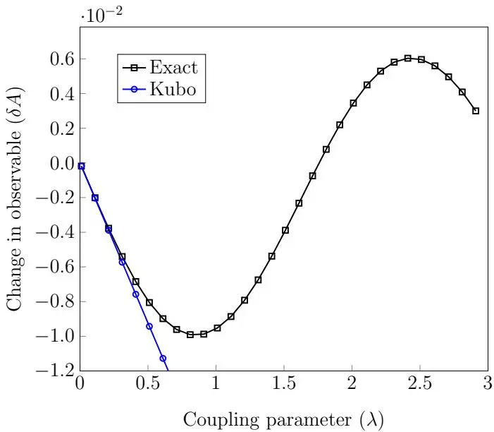

# The response of a quantum system to a collision: an autonomous derivation of Kubo's formula
## 量子系统对碰撞的响应：Kubo 公式的自治推导

**Samuel L. Jacob, John Goold**

Trinity College Dublin · Trinity Quantum Alliance · Algorithmiq Limited

*arXiv:2504.12385* (2025)

## 摘要

我们利用散射理论的**时间无关框架**研究量子系统在与一个量子粒子碰撞后产生的响应。在导出量子系统的动力学映射（dynamical map）之后，我们证明它编码了一个服从一般涨落-耗散关系的**非微扰响应函数**。我们进一步证明，Kubo 公式在 Born 近似下**自治涌现**——此时含时微扰由粒子穿过势区域的演化所确定。

---

## 1 引言

线性响应理论描述物理系统对弱外场微扰的响应 [1]，其核心是涨落-耗散关系——处于热平衡的系统的响应由热涨落决定 [2, 3]。线性响应的普适性和实验相关性使其在非平衡经典和量子系统的研究中至关重要。最近，线性响应与量子信息理论之间的联系还实现了对平衡态 [11–13] 和非平衡量子系统 [14] 中多体纠缠的量化。

尽管线性响应理论最初为封闭系统（哈密顿/幺正演化）而发展，已有若干工作将其推广到开放系统 [15–23]。然而，无论是封闭还是开放量子系统，线性响应理论都将微扰视为**含时函数或算子**。从热力学角度看，这一含时驱动源构成了一个理想功源（work source）。

**本文的核心创新**：从微观角度将驱动源描述为一个具有自身权利的量子系统，使用时间无关的散射理论框架。一个局域的大质量粒子穿过时间无关势时，会在散射体的内部自由度上诱导出**等效的含时相互作用**——这正是 Kubo 公式中"含时外场"的微观起源。


传统中子散射从实测关联函数出发，**事后**在线性响应框架下解释 [53, 57, 58]。本文反向而行：展示线性响应理论**如何从散射理论中涌现**。且：(i) 聚焦于量子系统（散射体）的动力学而非中子探针；(ii) 不假设探针离域化（不取平面波近似）；(iii) 非微扰——Born 近似仅在恢复 Kubo 公式时使用，而非出发点。


---

## 2 散射映射

### 2.1 设定

考虑系统 S 和粒子 P 之间的量子散射过程，总 Hilbert 空间 $\mathcal{H} = \mathcal{H}_S \otimes \mathcal{H}_P$，总哈密顿量为

$$
\hat{H} = \hat{H}_0 + \hat{V}(\hat{x}) = \hat{H}_S \otimes \hat{\mathbb{I}}_P + \hat{\mathbb{I}}_S \otimes \frac{\hat{p}^2}{2m} + \hat{V}(\hat{x}). \tag{1}
$$

$\hat{H}_S$ 具有离散谱 $\{e_j\}_{j=1}^N$，$\hat{p}^2/2m$ 具有连续谱 $E_p \ge 0$。相互作用 $\hat{V}(\hat{x})$ 在远离散射区域处 $(x \to \pm\infty)$ 为零。

定义 Møller 算子 $\hat{\Omega}_{\pm} \equiv \lim_{t \to \mp\infty} \hat{U}(t)^{\dagger} \hat{U}_0(t)$ 和散射算子 $\hat{S} \equiv \hat{\Omega}_{-}^{\dagger} \hat{\Omega}_{+}$（幺正且与 $\hat{H}_0$ 对易）。

### 2.2 散射振幅

将 $\hat{S}$ 分解为 $\hat{S} = \hat{\mathbb{I}} - i\hat{T}$，其中 $\hat{T}$ 是散射振幅算子。在动能本征基 $\{|E_p^{\alpha}, j\rangle\}$（$\alpha = \pm$ 表示方向）下：

$$
\langle E_{p'}^{\alpha'}, j' | \hat{T} | E_p^{\alpha}, j \rangle = \delta(E_{p'} + e_{j'} - E_p - e_j) \, t_{j'j}^{\alpha'\alpha}(E_p + e_j). \tag{5}
$$

散射矩阵与散射振幅之间的关系为 $s_{j'j}^{\alpha'\alpha} = \delta_{\alpha'\alpha}\delta_{j'j} - i t_{j'j}^{\alpha'\alpha}$。由于 $\hat{S}$ 的幺正性，有 $i(\hat{T} - \hat{T}^{\dagger}) = \hat{T}^{\dagger}\hat{T}$，这导出光学定理。

### 2.3 散射映射

碰撞前的态为 $\hat{\rho} = \hat{\rho}_S \otimes \hat{\rho}_P$（系统与粒子无关联），碰撞后为 $\hat{\rho}' = \hat{S}\hat{\rho}\hat{S}^{\dagger}$。对粒子自由度取偏迹，得到系统态的 CPTP 映射：

$$
\hat{\rho}_S' = \hat{\rho}_S - i[\hat{H}_{LS}, \hat{\rho}_S] + \mathcal{D}(\hat{\rho}_S), \tag{10}
$$

其中 **Lamb-Shift 哈密顿量**（一阶）为：

$$
\hat{H}_{LS} \equiv \frac{1}{2} \int dE_p \int dE_{p'} \sum_{\Delta} \delta(E_{p'} - E_p + \Delta) \sum_{\alpha',\alpha} \hat{T}_{\Delta}^{\alpha'\alpha}(E_p) \rho_P^{\alpha\alpha'}(E_p, E_{p'}) + \mathrm{c.c.} \tag{11}
$$

**耗散子**（二阶）$\mathcal{D}(\hat{\rho}_S)$ 如式 (12) 所示。


映射的核心特征是：**粒子的量子态通过系统能差的函数 $\delta(E_{p'} - E_p + \Delta)$ 与散射动力学耦合**。这意味着粒子的能量叠加（相干性）决定了 Lamb-Shift 和耗散的具体形式。

- **窄能态粒子**（离域，近似平面波）→ $[\hat{H}_S, \hat{H}_{LS}] = 0$，耗散子为 Lindblad 形式 → 耗散主导
- **宽能态粒子**（局域，大质量）→ $[\hat{H}_S, \hat{H}_{LS}] \neq 0$ → Lamb-Shift 可能主导动力学 → 等效为功源


---

## 3 量子系统对碰撞的响应

### 3.1 非微扰响应

Lamb-Shift 贡献的观测量变化为 $\delta A_{LS} = \Re[\chi_A]$，其中

$$
\chi_A \equiv \int dE_p \int dE_{p'} \sum_{\Delta} \delta(E_{p'} - E_p + \Delta) \sum_{\alpha',\alpha} \chi_{\Delta}^{\alpha'\alpha}(E_p) \rho_P^{\alpha\alpha'}(E_p, E_{p'}), \tag{18}
$$

$$
\chi_{\Delta}^{\alpha'\alpha}(E_p) \equiv -i \mathrm{Tr}_S [[\hat{A}, \hat{T}_{\Delta}^{\alpha'\alpha}(E_p)] \hat{\rho}_S]. \tag{19}
$$

利用 $\delta$ 函数的 Fourier 表示 $e^{i\Delta t/\hbar}$，可将响应转换到时域：

$$
\chi_A^{\alpha'\alpha}(E_p, t) = -\frac{i}{2\pi\hbar} \mathrm{Tr}_S [[\hat{A}, \hat{\mathcal{T}}^{\alpha'\alpha}(E_p, -t)] \hat{\rho}_S], \tag{23}
$$

其中 $\hat{\mathcal{T}}^{\alpha'\alpha}(E_p) \equiv \sum_{j',j} t_{j'j}^{\alpha'\alpha}(E_p + e_j) |j'\rangle\langle j|$ 是**非自伴**的散射振幅算子——这是与常规线性响应理论的关键区别。

当 $\hat{\rho}_S = \hat{\omega}_{\beta}$（热态）时，响应函数在时间上齐次：

$$
\chi_A^{\alpha'\alpha}(E_p, t) = -\frac{i}{2\pi\hbar} \mathrm{Tr}_S [[\hat{A}(t), \hat{\mathcal{T}}^{\alpha'\alpha}(E_p)] \hat{\omega}_{\beta}]. \tag{24}
$$

### 3.2 涨落-耗散关系

利用本征算子的性质 $\hat{\omega}_{\beta} \hat{T}_{\Delta}^{\alpha'\alpha} = e^{-\beta\Delta} \hat{T}_{\Delta}^{\alpha'\alpha} \hat{\omega}_{\beta}$，可以证明**非微扰涨落-耗散关系**：

$$
\chi_{\Delta}^{\alpha'\alpha}(E_p) = -2i \tanh\left(\frac{\beta\Delta}{2}\right) C_{\Delta}^{\alpha'\alpha}(E_p), \tag{26}
$$

其中 $C_{\Delta}^{\alpha'\alpha}(E_p) \equiv \frac{1}{2} \mathrm{Tr}_S [\{\hat{A}, \hat{T}_{\Delta}^{\alpha'\alpha}(E_p)\} \hat{\omega}_{\beta}]$ 是关联函数的离散 Fourier 变换。


由于 $\hat{\mathcal{T}}^{\alpha'\alpha}(E_p)$ 非自伴，这里的关联函数不是自关联函数——式 (26) 不能被约化为标准形式 $\Im[\chi_{AA}(\omega)] = -\hbar^{-1} \tanh(\beta\hbar\omega/2) C_{AA}(\omega)$。这是"非微扰"的本质体现：碰撞的全部效应不能简单地用系统自身算符的自关联来捕捉。


### 3.3 Born 近似

在 Born 近似下，散射振幅被散射势取代：

$$
t_{j'j}^{\alpha'\alpha}(E_p + e_j) \simeq 2\pi \langle E_p^{\alpha'} + e_j - e_{j'}, j' | \hat{V}(\hat{x}) | E_p^{\alpha}, j \rangle. \tag{30}
$$

假设 $\hat{V}(\hat{x}) = \sum_l \hat{V}_S^l \otimes \hat{V}_P^l(\hat{x})$，则响应函数分解为：

$$
\chi_A = \sum_l \int_{-\infty}^{+\infty} dt \, \chi_A^l(-t) f^l(t), \tag{36}
$$

其中：
- $\chi_A^l(t) = -\frac{i}{\hbar} \mathrm{Tr}_S [[\hat{A}, \hat{V}_S^l(-t)] \hat{\rho}_S]$ 是 **Born 近似下的响应函数**（实值，微扰为自伴算子）
- $f^l(t) = \mathrm{Tr}_P [\hat{V}_P^l(\hat{x}) \hat{\rho}_P(t)]$ 是**力函数**——粒子的时间演化通过散射势转化为等效含时力

### 3.4 Kubo 公式的涌现

最后一步：取粒子为**大质量且空间局域**的经典粒子 $\langle x | \hat{\rho}_P(t) | x \rangle = \delta(x - x_0 - v_0 t)$。则力函数变为 $f^l(t) = V^l(x_0 + v_0 t)$，经过时间原点平移，式 (36) 化为标准 Kubo 形式：

$$
\chi_A = \sum_l \int_{-\infty}^{t} d\tau \, \chi_A^l(t - \tau) \lambda^l(\tau). \tag{40}
$$

这正是因果的线性响应公式。上式中 $t$ 是碰撞结束后的任意时刻。

图 1：精确散射动力学（$\delta A = \delta A_{LS} + \delta A_{\mathcal{D}}$）与 Kubo 公式 (40) 的比较，作为耦合参数 $\lambda$ 的函数。对于小 $\lambda$（Born 近似有效），Kubo 公式与精确散射动力学吻合。模型：两能级系统 $\hat{H}_S = \Delta \hat{\sigma}_z/2$，势垒 $\hat{V}(\hat{x}) = V_0 [\hat{\sigma}_x \otimes \Theta(\hat{x}+a/2) \Theta(a/2-\hat{x})]$。

---

## 4 结论

我们展示了封闭量子系统的线性响应理论如何被视为量子散射理论的一个特定极限。核心发现：

1. **散射映射的一阶贡献（Lamb-Shift）编码了非微扰响应函数**——这一定常被开放量子系统文献忽略
2. **该响应函数服从非微扰版本的涨落-耗散定理**
3. **Born 近似 + 经典局域粒子 → Kubo 公式自治涌现**
4. 恢复 Kubo 公式的关键要素是：粒子足够大质量且空间局域，使其轨迹经典——与这些粒子充当功源的结论一致 [33, 34]
5. 动力学映射 (10) 的丰富结构可作为非微扰、全量子热力学和量子信息研究的起点

---

## 附录 A：线性响应理论自包含教程

附录 A 提供了封闭量子系统线性响应理论的**自包含概述**，从含时微扰的 Dyson 展开开始，推导 Kubo 公式、磁化率（susceptibility）和标准涨落-耗散定理 $\Im[\chi_{AA}(\omega)] = -\hbar^{-1} \tanh(\beta\hbar\omega/2) C_{AA}(\omega)$。这是本文承诺的"从散射理论推导 Kubo 公式"的对照基准。

---

## 参考文献

学术论文的参考文献条目按国际惯例保留原文。关键文献附加中文短评。

1. R. Kubo, J. Phys. Soc. Jpn. **12**, 570 (1957). — **Kubo 公式原始论文**
2. H. B. Callen and T. A. Welton, Phys. Rev. **83**, 34 (1951). — **涨落-耗散定理的首个形式**
3. R. Kubo, Rep. Prog. Phys. **29**, 255 (1966).
4-10. [线性响应理论的标准教材和应用]
11. P. Hauke et al., Nature Phys. **12**, 778 (2016). — **通过动力学磁化率测量多体纠缠**
12-14. [线性响应与量子信息交叉的后续工作]
15-16. [经典开放系统的涨落-耗散定理]
17. E. B. Davies and H. Spohn, J. Stat. Phys. **19**, 511 (1978).
18. L. Campos Venuti and P. Zanardi, Phys. Rev. A **93**, 032101 (2016).
19. M. Ban et al., Phys. Rev. A **95**, 022126 (2017). — **🟢 本图书馆已有笔记：开放系统线性响应的主方程方法**
20-23. [近期开放系统线性响应理论工作]
24-26. [开放量子系统标准教材]
27-32. [量子热力学视角]
33. S. L. Jacob et al., Quantum **6**, 750 (2022). — **🔴 量子散射作为功源——本文核心思想的直接前身**
34. N. Piccione et al., Phys. Rev. Lett. **132**, 220403 (2024).
35. S. L. Jacob et al., PRX Quantum **2**, 020312 (2021). — **散射诱导热化**
36-37. [碰撞热浴系列工作]
38-39. [散射理论标准教材]
40-41. [散射过程中的能量涨落]
42-52. [量子输运、超冷气体中的散射应用]
53. A. Furrer et al., *Neutron Scattering in Condensed Matter Physics* (2009). — **中子散射标准参考**
54-70. [其余应用和数学细节]

---

## 阅读笔记

### 一句话概括

这篇论文回答了一个基础性问题：**Kubo 公式中的"含时外场"从哪来？** 答案：来自一个量子粒子穿过静态散射势时的空间运动——散射理论的时间无关框架中自治地包含了时间依赖性的种子。粒子的位置-能量不确定性（即 $\rho_P^{\alpha\alpha'}(E_p, E_{p'})$ 中的非对角元）是连接"静态散射"和"含时响应"的桥梁。

### 核心论证链

1. **散射作为 CPTP 映射**：单次碰撞后系统态的变化 $\hat{\rho}_S \to \hat{\rho}_S'$ 可分解为 Lamb-Shift（一阶，相干）和耗散子（二阶，非相干）两部分
2. **Lamb-Shift = 非微扰响应**：$\hat{H}_{LS}$ 对观测量的贡献 $\delta A_{LS} = -i\mathrm{Tr}[[\hat{A}, \hat{H}_{LS}]\hat{\rho}_S]$ 天然具有"响应"的代数结构——涉及 $\hat{A}$ 与散射振幅的对易子
3. **涨落-耗散关系**：利用 $\hat{T}_{\Delta}^{\alpha'\alpha}$ 的本征算子性质，$\chi_{\Delta}$（响应）与 $C_{\Delta}$（关联）通过 $\tanh(\beta\Delta/2)$ 因子联系——这是标准涨落-耗散定理的非微扰推广
4. **Born 近似 → 因子化**：$\hat{T}_{\Delta}^{\alpha'\alpha} \propto \langle E_p^{\alpha'} | \hat{V}_P | E_p^{\alpha} \rangle \hat{V}_{\Delta}$ → 粒子部分和系统部分分离
5. **经典局域粒子 → Kubo**：$\langle x|\hat{\rho}_P(t)|x\rangle = \delta(x - x_0 - v_0 t)$ → $f^l(t) = V^l(x_0 + v_0 t)$ → 力函数仅是时间的函数 → 标准 Kubo 卷积形式

### 最精彩的洞察：能量-空间对偶

粒子态的非对角元 $\rho_P^{\alpha\alpha'}(E_p, E_{p'})$ 是整篇论文的核心：
- **窄能态**（$\rho_P^{\alpha\alpha'}(E_p, E_{p'}) \simeq \delta_{\alpha\alpha'} \rho_P^{\alpha}(E_p)$）→ 粒子离域（平面波）→ $[\hat{H}_S, \hat{H}_{LS}] = 0$ → **耗散主导** → 热化
- **宽能态**（$\rho_P^{\alpha\alpha'}(E_p, E_{p'})$ 在 $E_p - E_{p'}$ 方向宽）→ 粒子局域（波包）→ $[\hat{H}_S, \hat{H}_{LS}] \neq 0$ → **幺正动力学主导** → 功源

这精确刻画了"热源 vs 功源"的微观区分——不需要唯象地指定含时外场，而是从粒子态的量子特性中自然产生。

### 与其他论文的联系

- **Henheik2021-justifying-kubo**（本图书馆）— 关注 Kubo 公式的**严格数学论证**（"何时对"），本文关注 Kubo 公式的**微观起源**（"从哪来"）。两者的交汇点：都是对 Kubo 公式"第一性原理基础"的探究
- **Ban2017-linear-response-open-systems**（本图书馆）— 关注开放系统的**主方程进路**，本文的散射映射 (10) 在 Poisson 碰撞假设下恰好导出形如 Ban 等使用的主方程 (15)
- **DeNittis2016-linear-response**（本图书馆，进行中）— 算子代数框架下的严格处理，与本文的非微扰响应函数 (24) 有数学上的共鸣

### 批判性思考

1. **Born 近似的充分性**：图 1 显示 Kubo 公式在小 $\lambda$ 下吻合精确散射——但这是两能级系统的数值结果。对多体系统（连续谱），Born 近似可能遗漏重要的多散射效应
2. **"经典粒子"逼近的代价**：$\delta(x - x_0 - v_0 t)$ 的假设丢弃了粒子态的所有量子特性——包括能量-位置不确定性。这意味着 Kubo 公式本质上是**半经典**有效理论（系统量子，驱动经典）
3. **不可逆性从哪来？**：散射理论是时间反演不变的（$\hat{S}$ 幺正），但 Kubo 公式 (40) 含因果卷积 $\int_{-\infty}^{t}$。因果性是通过**选择初态**（$t \to -\infty$ 时粒子在无穷远，系统在热平衡）引入的——不是动力学的不对称，而是边界条件的不对称

### 局限性

- 一维散射（$\hat{p}$ 仅一个方向分量），推广到高维需要处理角度依赖
- 数值验证仅在两能级系统上（图 1），未涉及连续谱或多体效应
- 仅讨论了单次碰撞，重复碰撞的累积效应（量子主方程 (15)）仅在附录 C 简要推导
- 非微扰响应函数 (24) 的实际计算需要完整散射矩阵——除少数精确可解模型外一般不可得

### 关键公式速查

| 公式 | 含义 |
|------|------|
| $\hat{\rho}_S' = \hat{\rho}_S - i[\hat{H}_{LS}, \hat{\rho}_S] + \mathcal{D}(\hat{\rho}_S)$ | 散射映射：Lamb-Shift（一阶）+ 耗散（二阶） |
| $\chi_{\Delta}^{\alpha'\alpha} = -2i \tanh(\beta\Delta/2) C_{\Delta}^{\alpha'\alpha}$ | 非微扰涨落-耗散关系 |
| $\chi_A = \sum_l \int dt \, \chi_A^l(-t) f^l(t)$ | Born 近似下的响应（卷积前身） |
| $\chi_A = \sum_l \int_{-\infty}^{t} d\tau \, \chi_A^l(t-\tau) \lambda^l(\tau)$ | Kubo 公式（因果卷积） |
| $f^l(t) = \mathrm{Tr}_P [\hat{V}_P^l(\hat{x}) \hat{\rho}_P(t)]$ | 力函数：粒子的量子期望值 |

### 延伸阅读

- **Jacob, Esposito, Parrondo, Barra (2022) [33]** — 量子散射作为功源，本文的直接前身
- **Jacob, Esposito, Parrondo, Barra (2021) [35]** — 散射诱导热化：当粒子态为热分布时，散射映射以热态为不动点
- **Ban et al. (2017) [19]** — 本图书馆已有笔记，开放系统线性响应的主方程进路
- **Henheik & Teufel (2021)** — 本图书馆已有笔记，Kubo 公式的数学论证

### 术语对照

| 中文 | 英文 | 含义 |
|------|------|------|
| 散射映射 | scattering map | 单次碰撞后系统态的 CPTP 变换 |
| Lamb-Shift 哈密顿量 | Lamb-Shift Hamiltonian | 散射振幅一阶贡献的等效哈密顿量 |
| 非微扰响应函数 | non-perturbative response function | 用精确散射振幅（非 Born 近似）表达的响应 |
| 力函数 | force function | $f^l(t)$：粒子穿过势时的等效含时力 |
| 自治涌现 | autonomous emergence | Kubo 公式无需外加含时假设，从静态散射中自然得出 |
| 窄能态 / 宽能态 | narrow / broad energy states | 粒子在能量基下的局域程度，决定耗散 vs 幺正动力学 |
