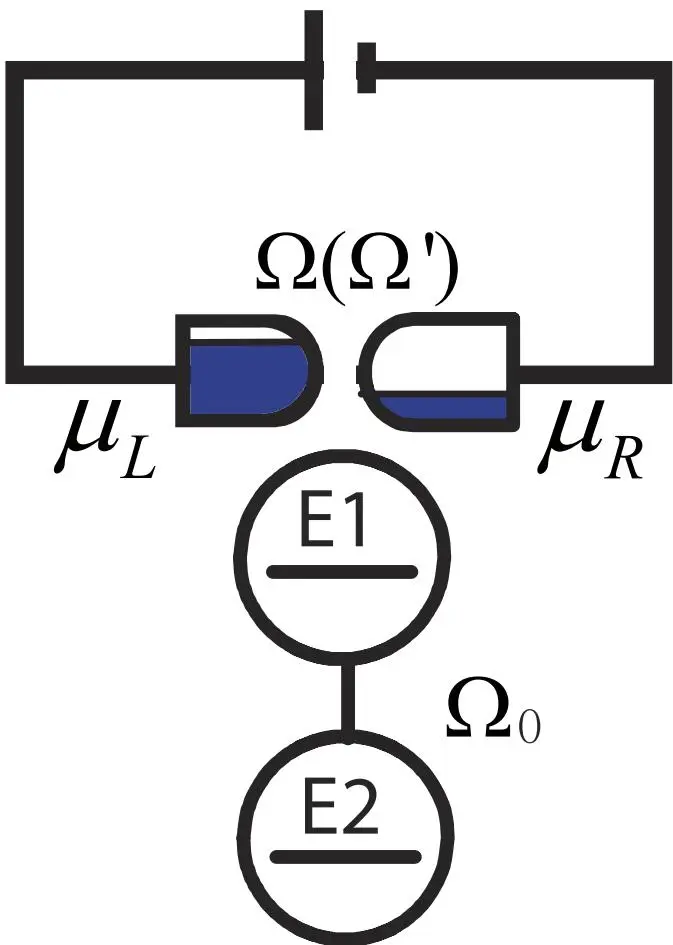

# Direct measurement on the geometric phase of a double quantum dot qubit via quantum point contact device
## 通过量子点接触直接测量双量子点量子比特的几何相位

**Bao Liu, Feng-Yang Zhang, Jie Song, He-Shan Song**

哈尔滨工业大学物理系

*Scientific Reports* **5**, 11726 (2015) | [理论方案]

## 摘要

提出了通过量子点接触（QPC）直接读取耦合双量子点系统几何相位的方案。导出了几何相位的有效表达式，将双量子点量子比特的几何相位与通过 QPC 器件的电流关联起来。表达式中所有参数在实验中均可测量或可调。该方案将几何相位的测量转化为电流测量，避免了直接对量子态做层析的复杂性。

---

## 核心方案

### QPC 测量原理

量子点接触是一种对电荷高度灵敏的探测器。双量子点系统的电荷态影响 QPC 的透射率，从而影响通过 QPC 的电流。几何相位的信息被编码在系统的量子态中，通过电流测量可以被解码。

图 1：QPC 测量双量子点几何相位的典型模型。QPC 放置在量子点附近，电流反映量子点的电荷态。

该方案的关键创新在于：提供了一个**实验上可行的测量方案**，将抽象的几何相位转化为可观测的电流信号。

---

## 阅读笔记

### 一句话概括

将双量子点量子比特的几何相位通过 QPC 电流读出，提供了一个在半导体量子点平台上实验测量几何相位的具体方案。

### 核心论证链

1. 双量子点系统的几何相位可以用 Bloch 球的立体角表示
2. QPC 电流对量子点电荷态敏感 → 可用于读取量子态
3. 导出几何相位与 QPC 电流的定量关系
4. 所有参数均可实验调控

### 平台对比

该方案针对**半导体量子点**平台（而非超导量子比特），是 Berry 相位实验在不同固态平台上的拓展。

### 延伸阅读

- **[Leek et al. 2007, Science](/papers/berry-phase-solid-state-qubit/)** — 超导平台首次 Berry 相位观测
