## 张量网络理论的多智能体自动形式化

Sirui Lu,<sup>1,</sup> Erickson Tjoa,<sup>1,</sup> 和 J. Ignacio Cirac<sup>1,</sup>马克斯·普朗克量子光学研究所（Max-Planck-Institut für Quantenoptik）, 汉斯-科普费尔曼大街1号, D-85748 加兴, 德国慕尼黑量子科学与技术中心（Munich Center for Quantum Science and Technology (MCQST)）, 谢林大街4号, D-80799 慕尼黑, 德国<sup>∗</sup>

我们构建了一个由专门的大语言模型智能体组成的团队，并提出了一种用于理论物理学研究级形式化的智能体驱动工作流，以矩阵乘积态基本定理的自动形式化作为演示。这些智能体通过结构化的数学蓝图和定期的人工审查进行协调，自主地策划并执行了完整的形式化过程。对于某些陈述，智能体能够探索出标准文献中不包含的新证明路径。在此过程中，智能体生成了大量以前在Mathlib（Lean的数学库）中不可用的张量网络和量子信息库。作为一个物理应用，该形式化也扩展到了一维对称保护拓扑相。我们发现大规模自动形式化的主要瓶颈在于强制数学意图的一致性，并对整个过程及其涉及的各种微妙之处进行了详细研究。我们将代码库以库名TNLean发布，同时附上一份包含12章的形式化工作蓝图。

**引言。**—证明辅助器是检查数学论证每一步逻辑正确性的软件系统。它们已验证了从四色定理[1]到开普勒猜想[2]的结果，而现在AI系统能够自动为许多数学目标找到Lean 4的证明[3–7]。然而，大多数自动化目标仍然是竞赛问题或孤立的引理，数学领域的研究级和教科书级形式化工作正在开始增加[8, 9]。研究级的理论物理学提出了不同的挑战：由于数学物理之外的物理学结果通常不像纯数学那样遵循相同的数学严谨性[10]，形式化需要将非形式化的部分填补为严谨的、Lean可检查的陈述。

迄今为止，大规模的形式化工作主要是由人类主导的，例如液态张量实验和费马大定理等项目的完成需要专家团队花费数月甚至数年时间[11–14]。AI系统已经开始减轻这一负担，从竞赛式证明[4, 15, 16]到自动形式化、局部证明辅助和短推理链[17–19]；最近，AI系统Gauss[8, 20]生成了一份蓝图引导下的强素数定理形式化。在物理学中，PhysLib提供了早期的Lean基础设施[21]，而在量子信息学中，广义量子Stein引理[22–25]已通过人类主导的努力部分形式化[26, 27]。这些进展促成了我们在此探讨的问题：一个智能体驱动系统能在理论物理学的研究级形式化中走多远？

在这项工作中，我们构建并应用了一个智能体驱动的工作流，其中一组专门的AI智能体（具有不同角色和工具的语言模型程序）通过一个共享的数学“蓝图”和不定时的人类监督进行协调，通过Lean 4证明辅助器自主地形式化了矩阵乘积态基本定理（FT-MPS）[28–30]。选择FT-MPS是因为它是张量网络理论[30]的核心结果之一，位于量子多体物理、量子信息学和凝聚态物理的交汇处。因此，这项任务要求我们开发一个远超FT-MPS本身的库。据我们所知，我们的工作是首个将多智能体协调、持久记忆和蓝图引导规划相结合，用于数学物理研究级定理的自主形式化。作为副产品，我们生成了一份关于这12个章节的150页形式化蓝图[31, 32]（一种人类可读的、与Lean代码关联的证明翻译），开发了几个与量子信息理论相邻的库，并将该基本定理应用于物理相关的问题，例如一维对称保护拓扑相的分类[33–36]。该代码库以Lean 4库TNLean的形式发布[37]。

---
⚠ 上次翻译有以下问题，正在修正：
- 1处裸代码行（需要```python围栏）
- 可能遗漏了约15个长英文词（>8个字符，可能未翻译完整段落）
- 可能漏译约20个块：§附录F：计算成本, §1. 智能体 leanOrchestrator：任务分解与调度, §委派

我们的工作表明，在研究级的理论物理领域，自主形式化的核心挑战已不再仅仅是单个引理的证明，还包括对大型论证的忠实管理：将一个已发表的证明分解为数百个形式化步骤，决定在何处偏离文献的路径，并追踪跨越量子力学、算子代数和谱理论的依赖关系。特别地，大语言模型有限的上下文窗口（模型一次性可以处理的固定文本量）以及智能体遵循指令的可靠性，限制了目前基于大语言模型的形式化所能达到的规模。我们通过编排、蓝图、自动审查和定期的人工审查来应对这些约束，如图1所示。

基本定理及其形式化。——一个平移不变的矩阵乘积态（下文简称为MPS）是一维链上的一族量子态[38]，由一个秩-3张量A参数化，其中 $\begin{array} {r} {A = \sum_{i = 0}^{d - 1} A^{i} \left| i \right.} \end{array}$ 且对于每个 $i = 0 , 1 , \ldots , d - 1$，有 $A^{i} \in M_{D} ( \mathbb{C} )$ 。这里 d 是局域希尔伯特空间维度，D 是键维度。周期边界条件下N个格点上的MPS表示为

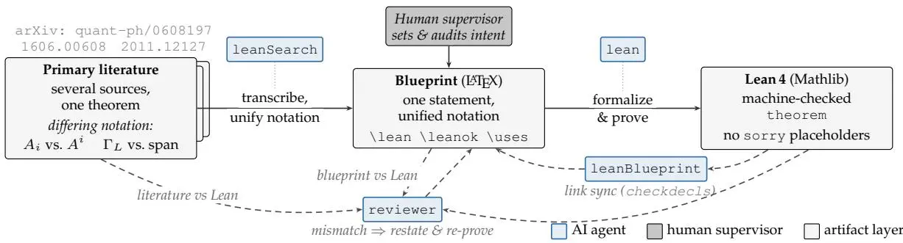

图1：在文献、Lean和蓝图之间保持一致性。一个用不同符号表述的定理（矩阵写作A$_{i}$ [28]或A<sup>i</sup> [29, 30]，单射性通过映射$\Gamma_{L}$ [28]或作为张成条件[29]表述）被统一转录到蓝图中，使用单一符号并附带指向Lean声明的机器可读链接，然后在Lean中证明（实线箭头；leanSearch搜索Mathlib，lean完成证明；虚线将每个智能体连接到它执行的步骤）。两个智能体保持各层之间的一致性（虚线箭头）。leanBlueprint通过checkdecls检查机械链接（每个\lean引用解析为一个声明，每个\leanok解析为一个完成的证明）。一个自动审查器检查两种语义对应关系：蓝图与Lean（Lean定理证明了所陈述的结果），以及文献与Lean（其假设不弱于引用来源的假设）。不匹配会将陈述返回重新陈述和重新证明。

$$
| \psi_{N} ( A ) \rangle = \sum_{i_{1} , . . . , i_{N} = 0}^{d - 1} \mathrm{tr} \big ( A^{i_{1}} A^{i_{2}} \cdot \cdot \cdot A^{i_{N}} \big ) \big | i_{1} \cdot \cdot \cdot i_{N} \big \rangle .\tag{1}
$$

式(1)未做归一化，因为它们也与研究矩阵乘积算子相关（例如，见[39, 40]），因此它们也被称为矩阵乘积向量[29]。对每个张量A，我们关联一个称为转移算子的完全正映射 $E_{A} \colon \hat{M}_{D} ( \mathbb{C} ) \ \ M_{D} ( \mathbb{C} )$ ，由 $E_{A} ( X ) =$ $\textstyle \sum_{i = 0}^{d - 1} A^{i} X ( A^{i} )^{\dagger}$ 定义，其谱信息决定了MPV族的性质。

由于 $| \psi_{N} ( A ) \rangle$ ⟩ 仅依赖于矩阵 $A^{i} ,$ 乘积的迹，映射 $A \mapsto{\dot{\left| {\psi_{N} ( A )} \right.}}$ 是多对一的。一个自然问题是，何时两个张量生成的MPV族彼此成比例或相等。MPS基本定理指出，在将张量置于规范形式后，可以完全刻画这种关系[28, 29]。如果一个张量A的转移算子 $E_{A}$ 的谱半径为1，且只有一个特征值 λ 满足 $| \lambda | = {\hat{1}}$（所有其他特征值满足 $| \lambda | < 1 )$ ，则称A是正规的。那么，如果 $A^{i} = \textstyle \bigoplus_{k = 1}^{r} \mu_{k} A_{k}^{i} .$ ，其中 $\mu_{k} \in \mathbb{C}$ 且 $A_{k}$ 是正规张量，则称A处于规范形式。我们形式化的核心定理之一是如下定理[28–30]：

定理1 (MPS基本定理，相等情形). 设A和B是两个处于规范形式的张量。那么，A和B生成相同的MPV族，即对于每个 $N \geq 1 .$ ，有 $| \psi_{N} ( A ) \rangle = | \psi_{N} ( B ) \rangle$ ⟩，当且仅当存在一个可逆矩阵X，使得对于所有 $i = 0 , \dot{1} , \dot{\ldots} , d - 1$，有

$$
B^{i} = X A^{i} X^{- 1} .\tag{2}
$$

注意到，对于任意生成MPV $| \psi_{N} ( A ) \rangle$ 的张量A，在阻塞足够多的格点以移除所谓的p-周期子空间[29, 41]后，总能将其化为规范形。因此，我们的出发点是张量处于CF中。

我们首先通过查询编排器智能体，在未指定任何文献的情况下尝试形式化FT-MPS。有趣的是，在早期阶段，系统通过Skolem-Noether定理（补充材料第G节）证明了定理1的一个特例（当A为单射时），该定理是关于中心单代数自同构的经典结论。这种方法并非文献中的标准做法，而是由智能体自主选择的，因为智能体可以直接利用Mathlib现有的环论库[42]。这表明自动形式化能够基于系统在不同领域间建立广泛联系的能力，容纳新颖的证明方法。

单射情形是FT-MPS中最简单的实例，因为正规张量只有在阻塞足够多格点后才变为单射[43]。为证明定理1，我们需先将张量在充分阻塞后化为CF（图2），然后找出一个"最小"的正规张量集合$A_{k}$，称为正规张量基（BNT）$\{A_{k}^{i} \}_{k = 1}^{g}$，它对任意张量都存在，并解释A中的重复块。全局规范变换X可通过证明如下结论构建：生成相同MPV的两个张量A、B必须具有相同数量的BNT元素，且经过置换后，BNT由规范变换$B_{k} = X_{k} A_{\pi ( k )} X_{k}^{- 1}$关联，其中π是某个置换。

我们最早尝试仅使用综述论文[30]，但发现这不足以完全自主地提供定理1的完整证明。因此，我们向智能体提供了主要参考文献[28, 29]的arXiv预印本LAT$_{E}$X源码（而非排版后的PDF），以及综述[30]和最重要的量子信息文献[44, 45]；系统重新生成了其证明策略。这一再生策略表明，该任务并非简单的线性代数形式化。FT-MPS依赖于围绕转移算子的庞大量子信息基础设施，如CP映射、量子Perron-Frobenius理论和量子Wielandt界[46]（后者本身构成了一篇单独论文[45]）。随着这些依赖关系的增长，开发工作必须拆分为更小的证明文件和受限的智能体任务，通过蓝图和持久化内存跟踪整体结构；详细的依赖关系图和工作流程在补充材料[42]中给出。

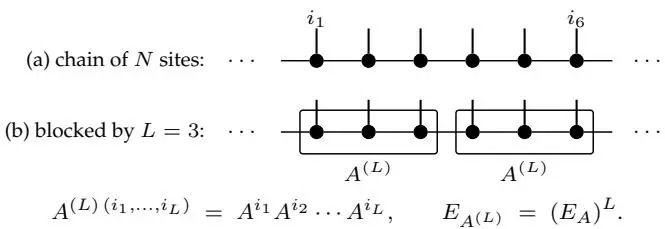

图2：张量网络中的Blocking。给定MPS张量A，将L个连续格点分组得到一个粗粒度张量$\overset{\smile} {A}^{( L )}$，其物理指标为复合指标$( i_{1} , \dots , i_{L} )$，转移算子为A的转移算子$E_{A}$的L次幂$\left( E_{A} \right)^{L}$。当L增大时，$\overset{\overline{{\mathbf{\sigma}}}} ( E_{A} )^{L}$的谱集中到其主导特征值上：经过有限阻塞长度后，所得规范形的每个块变为正规；根据量子Wielandt界，再经过${\cal L}^{'} = {\cal O} ( D^{4} )$个格点后变为单射（块k的矩阵张成完整代数$\breve{M}_{D_{k}} ( \mathbb{C} )$）。智能体池自主完成了单块单射共轭（式(2)）；此处所示的扩展到多块情形是在提供主要参考文献[28, 29]后才完成的。

这种拆分由一组专门智能体执行，由编排器协调，将任务分配给子智能体并整合其结果；智能体角色、工具和协调模式在"End Matter"中描述。随着项目规模增长，定期重构代码、提取可复用的证明策略并淘汰失败的尝试也变得重要，以防止智能体陷入困境；这由简化器智能体负责。

该项目生成了一份形式化代码库，并附带一份横跨150页、包含12章的蓝图（见补充材料[42]）。FT-MPS证明链的每一步都通过了验证，核心论证中不再有任何未完成的占位符（Lean中用于表示未完成步骤的`sorry`标记）。文献中仅需几行描述的陈述，在Lean中可能需要数百行代码[42]。交互会话的记录模型API总成本为20,206美元，用于构建整个库（仅FT-MPS部分按代码规模估算约为5,548美元），主要花费在证明编写与编排上（见"End Matter"）。

捕捉非预期的形式化。——自主Lean形式化过程至少有两个方面需要谨慎处理。首先，智能体可能形式化了一个能通过Lean内核验证、但偏离预期目标的陈述，例如：如下文所述，它可能弱化了定理，或者从永远无法满足的假设出发空洞地证明该定理。其次，物理学论证依赖于许多约定和隐含假设，在严格形式化下必须显式表达。虽然第二个问题很多时候可以自主处理，但目前第一个问题需要更多人类以审阅形式进行干预。

蓝图是一种人类可读的数学规范，它将定义、定理陈述和依赖结构链接到底层Lean代码，因为直接审计所有Lean证明对于人类审阅者而言不切实际。我们对FT-MPS形式化的蓝图进行了六轮审阅[32]，并生成了相应报告。这些报告被反馈给编排器智能体，由其分配合适的子智能体来纠正报告中指出的问题。我们强调，人类的干预是战略性的而非战术性的：人类监督者指出了被证明陈述的非预期版本，但并未说明智能体应如何形式化。随后，智能体在无进一步指导的情况下，自行重新推导出预期陈述，并移除了错误或过时的版本（尽管有些勉强）。下文将提及一些需要此类干预的实例。

弱化定理。最昂贵的修正来自那种情况：一个非预期的假设过早引入，导致许多后续引理建立在该假设之上。在首轮形式化中，智能体试图在它们所谓的双随机$\mathsf{\bar{\Pi}} ( D S ) \overset{\prime \prime} {gauge}^{\prime \prime}$假设下证明FT-MPS。在MPS理论中，可以对转移算子$E_{A}$进行归一化，使其谱半径为1。随后可以选择右规范形式（此时$E_{A}$是单射的幺正的）或左规范形式（此时$E_{A}$保持迹）。然而，对于一般的MPS张量，无法同时施加这两个条件。因此，DS假设给出了一个形式上正确但更易证明和形式化的定理，但该定理只适用于一个规模小得多的张量类。移除这一额外假设需要围绕单边规范形式重新组织许多早期论证。此例说明，Lean检查证明，但不对陈述的选择进行验证：被证明的定理虽然正确，但范围比预期更窄，并且无法支撑后续完整定理的证明。在指定修正后的陈述后，智能体自主完成了这项重构工作。

### 有限情形与渐近极限

第二类问题的产生，是因为自动形式化将原本的定义替换成了一个表面上相关的陈述，这个陈述不仅是一个弱化版本，甚至可能在所关注的设定中不成立。在我们的案例中，FT-MPS的有限陈述被替换成了一个渐近陈述。方程(1)中的向量是未经归一化的MPV：它们的系数是固定长度$N$下张量矩阵乘积的迹。该定理比较了这些向量对于每一个有限的$N$，要么相等，要么成非零比例。它既不比较归一化态，也不假设MPV的模在$N \to \infty$时具有任何极限行为。因此，早期基于渐近范数比较的形式化尝试所证明的陈述具有错误的前提，并且未能恢复所需的有限信息。当比较规范块的乘法重数时，同样的有限问题也会出现，因为有限长度下的系数可能振荡而非收敛。在此，团队无法直接修补证明，直到我们在阅读蓝图后指出，是底层的渐近定义（而非证明策略）存在错误时，才找到了正确的路径。最终的证明保持了对固定有限$N$的比较，从而与FT-MPS的陈述完全匹配。

### 边界情况

一些修正虽然在数学上微不足道，但代价依然高昂，因为证明助手要求每个边界情况都被显式陈述出来。物理上相关的MPS陈述总是具有正键维和非空链。如果这一点未包含在定理陈述中，Lean可能不得不考虑诸如$D = 0$或$N = 0$这样的人为情况。$D = 0$的情况不承载任何物理态，而对于$N = 0$，空词约定会产生系数$\mathbf{\sigma} \cdot ( \Im_{D} ) = D$，这并非通常FT-MPS比较的一部分。增加预期的假设$D \geq 1$和$\bar{N} \geq 1$后，我们去除了证明中大量无关的分支。

### Lean代码与蓝图的对齐

多次审查发现蓝图的散文描述与Lean声明之间存在差异：在某些情况下，Lean的陈述是正确的，而蓝图的散文描述在多次编辑中发生了偏离。随后，我们引入了明确的同步和审查步骤，以保持蓝图与形式化陈述的对齐（见图1）。我们还调整了提示词和审查标准，使得蓝图更紧密地遵循原始论文，并使用对读者友好的散文以方便审计[42]。

### 物理应用

FT-MPS为一维张量网络中的虚拟对称性作用以及一维玻色型SPT相分类中使用的上同调不变量提供了背后的机制[33–36, 47]（图3）。在完成FT-MPS的形式化后，我们向智能体提供了以下关于自旋链中弦序和对称性的文章[47]，它们自主地进行了形式化工作，并导出了以下结果。

**定理2（来自单射对称MPS的上同调不变量）**：设$A$是一个键维$D \geq 1$的单射MPS张量，设$U : \dot{G} \to GL_d(\mathbb{C})$是有限群$G$的格点线性表示。定义$\widetilde{A}_g^i := \sum_j U(g)_{ij} A^j$。假设$A$在$U$下是不变的，即对于每一个$g \in G$和每一个$N \geq 1$，都有$|\psi_N(A)\rangle = |\psi_N(\widetilde{A}_g)\rangle$。那么对于每一个$g \in G$，存在一个可逆矩阵

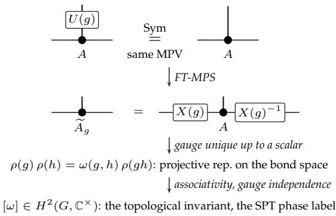

图3：从基本定理到对称保护拓扑相的分类。上图：作用于内射MPS张量$A$物理腿的位上对称性$\bar{U} ( \bar{g} )$定义了$\widetilde{A}_{g}$；物理层假设是$\widetilde{A}_{g}$生成与$A$本身相同的MPV族。中图：FT-MPS将此假设转化为虚拟层规范恒等式$\widetilde{A}_{g}^{i} = X ( g ) A^{i} X ( g )^{- 1}$（定理2；物理腿朝上，键腿水平，如图2）。下图：$\bar{X} ( g )$在标量意义下唯一，因此规范构成一个射影表示$\rho$，具有2-上循环$\omega$；其类$[ \omega ] \in H^{2} ( \dot{\bar{G}} , \dot{\mathbb{C}}^{\times} )$是标记对称保护拓扑（SPT）相的规范不变量，在幺正归一化后取$U(1)$值。

$X ( g ) \in{\mathrm{GL}}_{D} ( \mathbb{C} )$在非零标量意义下唯一，使得对所有物理指标i有

$$
\widetilde{A}_{g}^{i} = X ( g ) A^{i} X ( g )^{- 1}\tag{3}
$$

按照约定$\rho ( g ) : = $ $\dot{X} ( g^{- 1} \dot{)} .$，映射$\rho(g)$构成$G$的一个射影表示：$\rho ( g ) \rho ( h ) = \omega ( g , h ) \rho ( g h ) , \omega ( g , h ) \in \mathbb{C}^{\times}$。上同调类$[ \omega ] \in H^{2} ( \vec{G} , \vec{\mathbb{C}}^{\times} )$在重新缩放规范$X(g)$时保持不变，因此仅依赖于对称张量$A$以及位上作用$U$。

我们注意到，自形式化定理是针对线性表示$U : G \to G L_{d} ( \mathbb{C} )$证明的，因为形式论证仅使用了MPV族的相等性，并不要求幺正性。实际上，物理位上的对称性被视为幺正表示$U : G \stackrel{\cdot} {\to} \ U ( d )$，在这种情况下，虚拟规范可以选为相位意义下的幺正矩阵。因此，$\omega$可以取$U(1)$值，从而恢复标准不变量$[ \omega ] \in H^{2} ( G , U ( 1 ) )$。完整的SPT分类还涉及对称母哈密顿量和带隙路径；虽然本文未形式化完整分类，但TNLean库和现有的Mathlib为在此背景下完成自形式化提供了非常自然的起点。

讨论与展望。——在这项工作中，我们构建并提出了一个基于代理的工作流程，用于理论物理的研究级形式化，并通过FT-MPS的自形式化展示了该系统的能力。这些代理通过共享的数学“蓝图”和间歇性的人类审查进行协调。核心开发包括约62,000行代码、2,300个声明和233个文件，包含在约227,000行的更广泛Lean 4张量网络库中。基于Mathlib的基础[49, 50]，TNLean开发了张量网络理论以及FT-MPS所需的量子信息论（如完全正映射和量子佩龙-弗罗贝尼乌斯理论）中的可验证陈述。我们观察到，确保正确的数学意图是大规模自形式化的主要瓶颈，这需要我们处理若干技术复杂性。

这些观察结果阐明了为什么蓝图和审查步骤对证明搜索并非辅助性的。在如此规模的项目中，正确性不仅取决于证明引理，还取决于控制目标陈述的表述方式。单个代理会话无法同时可靠地承载源论文、当前的Lean库、证明状态以及预期的定理陈述（参见附录）。因此，有必要将项目拆分为单独的证明任务，并使用蓝图记录全局数学规范（例如，标准形式的假设、归一化约定以及与文献的一致性）。在会话之间，持久内存携带了修正后的约定和被拒绝的证明路径。在Lean内核检查证明之前，审查阶段检查形式化声明是否仍然忠实地表达了预期的定理。这就是Buzzard关于“定义比证明更危险”的警告最为具体的场景[51]。

我们随TNLean库一并发布蓝图、审阅报告，以及项目中产生的、或许最为重要的“技术笔记”[32, 37]。这些材料记录了仅从最终Lean文件中无法看出的选择，并便于审计：哪些假设是必需的，哪些看似合理的表述不得不被拒绝，以及形式化陈述与文献中非正式表述之间在哪些地方存在差异。我们还发布了项目期间使用的精选蒸馏记忆文件。需要指出的是，蒸馏记忆文件和智能体角色规范并不特定于张量网络形式化：它们记录了独立于项目的形式化技术和约定，并可用于其他自动化形式化目标。

我们期望，一个可复用的形式化库（如我们的库），连同我们开发的多智能体工作流，将有助于形式化现有现代成果，例如低个体度测试以及量子复杂性定理MIP<sup>∗</sup> = RE [57–59]，同时也有助于攻克量子多体物理及量子信息与计算中的猜想[26, 27, 60–62]。在张量网络理论本身范围内，当前的TNLean也支持更宽泛的形式化目标：带边界的FT-MPS [52]、高维张量网络态子类的FT [53]、父哈密顿量[54, 55]、矩阵乘积算符、重整化不动点[29]以及物质相的分类[33, 34, 36, 56]。我们将TNLean的这些进一步开发留待未来工作。

**数据可用性**  支持本研究的Lean 4源代码、形式化蓝图、审阅报告和技术笔记已在TNLean仓库中开放获取[32, 37]。多智能体系统基于TeXRA软件构建[63]，可通过该软件使用；五个交互智能体（参见结尾部分）的系统提示词已在补充材料中复现[42]，审阅者的提示词随TNLean一同发布。

**AI披露**  Lean 4代码和蓝图完全由我们开发的多智能体AI系统在我们监督下生成。我们使用基于LLM的工具编辑了部分稿件正文和图表；所有科学内容均已由作者检查，作者对其负责。

**致谢**  我们感谢X.-L. Qi的有益讨论。E.T.感谢亚历山大·冯·洪堡基金会的支持。本工作部分得到了德国研究基金会（DFG）在德国卓越战略——EXC-2111——390814868项目下的资助。本研究是慕尼黑量子谷的一部分，该量子谷由巴伐利亚州政府通过巴伐利亚高科技议程Plus提供资金支持。

<sirui.lu@mpq.mpg.de>

[1] G. Gonthier, Formal proof—the four-color theorem, Notices Amer. Math. Soc. 55, 1382 (2008).

[2] T. Hales, M. Adams, G. Bauer, T. D. Dang, J. Harrison, L. T. Hoang, C. Kaliszyk, V. Magron, S. Mclaughlin, T. T. Nguyen, Q. T. Nguyen, T. Nipkow, S. Obua, J. Pleso, J. Rute, A. Solovyev, T. H. A. Ta, N. T. Tran, T. D. Trieu, J. Urban, K. Vu, and R. Zumkeller, A formal proof of the Kepler conjecture, Forum Math. Pi 5, e2 (2017).

[3] L. D. Moura and S. Ullrich, The lean 4 theorem prover and programming language, in Automated Deduction – CADE 28, Vol. 12699, edited by A. Platzer and G. Sutcliffe (Springer International Publishing, Cham, 2021) pp. 625– 635.

[4] T. Hubert, R. Mehta, L. Sartran, M. Z. Horváth, G. Žuži´c, E. Wieser, A. Huang, J. Schrittwieser, Y. Schroecker, H. Masoom, O. Bertolli, T. Zahavy, A. Mandhane, J. Yung, I. Beloshapka, B. Ibarz, V. Veeriah, L. Yu, O. Nash, P. Lezeau, S. Mercuri, C. Sönne, B. Mehta, A. Davies, D. Zheng, F. Pedregosa, Y. Li, I. Von Glehn, M. Rowland, S. Albanie, A. Velingker, S. Schmitt, E. Lockhart, E. Hughes, H. Michalewski, N. Sonnerat, D. Hassabis, P. Kohli, and D. Silver, Olympiad-level formal mathematical reasoning with reinforcement learning, Nature 651, 607 (2026).

[5] Z. Ren, DeepSeek-prover-V2: Advancing formal mathematical reasoning via reinforcement learning for subgoal decomposition (2025), arXiv:2504.21801.

[6] H. Wang, Kimina-prover preview: Towards large formal reasoning models with reinforcement learning (2025), arXiv:2504.11354.

[8] Math Inc., 强素数定理：一个 Lean 形式化证明, Math Inc. (2025).

[9] A. Rammal, N. Patel, F. Gloeckle, A. Hayat, J. Kempe, R. Munos, C. Arnal, and V. Cabannes, 大规模数学形式化 (2026), arXiv:2605.29955 [cs.AI].

[10] S. Lu, Z. Jin, T. J. Zhang, P. Kos, J. I. Cirac, and B. Schölkopf, 立场论文：物理学研究的大语言模型需要领域专项训练与工具, 载于第四十三届国际机器学习大会立场论文赛道 (2026).

[11] J. Commelin and A. Topaz, 液态张量实验 (2023), arXiv:2309.14870.

[12] W. T. Gowers, B. Green, F. Manners, and T. Tao, 关于 marton 的一个猜想, Ann. Math. 201, 515 (2025), arXiv:2311.05762 [math.NT].

[13] A. Best, C. Birkbeck, R. Brasca, E. Rodriguez Boidi, R. V. D. Velde, and A. Yang, 在 Lean 中对正则素数费马大定理的完整形式化, Ann. Formaliz. Math. 卷 1, 14586 (2025).

[14] K. Buzzard and Flt Project Contributors, 迈向费马大定理的 Lean 证明, 帝国理工学院 (2024).

[15] Axiom, AxiomProver (2025).

[17] Y. Wu, A. Q. Jiang, W. Li, M. N. Rabe, C. Staats, M. Jamnik, and C. Szegedy, 使用大型语言模型进行自动形式化, 载于Adv. Neural Inf. Process. Syst. 35 (NeurIPS 2022) (2022) 第 32353–32368 页, arXiv:2205.12615 [cs.LG].

[18] R. Wang, R. Pan, Y. Li, J. Zhang, Y. Jia, S. Diao, R. Pi, J. Hu, and T. Zhang, MA-LoT: 基于模型协作的 Lean 长链式推理增强形式定理证明 (2025), arXiv:2503.03205.

[19] K. Yang, A. Swope, A. Gu, R. Chalamala, P. Song, S. Yu, S. Godil, R. Prenger, and A. Anandkumar, LeanDojo: 基于检索增强语言模型的定理证明, 载于Adv. Neural Inf. Process. Syst. (2023).

[20] 介绍 Gauss：一个用于自动形式化的智能体 (2025).

[21] Physlib Contributors, PhysLib：一个用于物理学的 Lean 4 库, leanprover-community (2024).

[22] F. G. S. L. Brandão and M. B. Plenio, 量子 Stein 引理的一个推广, Commun. Math. Phys. 295, 791 (2010).

[23] M. Berta, F. G. S. L. Brandão, G. Gour, L. Lami, M. B. Plenio, B. Regula, and M. Tomamichel, 关于广义量子 Stein 引理证明中的一个漏洞及其对量子资源可逆性的影响, Quantum 7, 1103 (2023).

[24] M. Hayashi and H. Yamasaki, 广义量子 Stein 引理与量子资源理论第二定律, Nat. Phys. 21, 1988 (2025).

[25] L. Lami, 广义量子 Stein 引理的一个解法, IEEE Trans. Inf. Theory 71, 4454 (2025).

[27] A. Meiburg, L. A. Lessa, and R. R. Soldati, 广义量子 Stein 引理在 Lean 中的形式化 (2025).

[28] D. Perez-Garcia, F. Verstraete, M. Wolf, and J. Cirac, 矩阵乘积态表示, Quantum Inf. Comput. 7, 401 (2007).

[29] J. Cirac, D. Pérez-García, N. Schuch, and F. Verstraete, 矩阵乘积密度算符：重整化不动点与边界理论, Ann. Phys. 378, 100 (2017).

[30] J. I. Cirac, D. Pérez-García, N. Schuch, and F. Verstraete, 矩阵乘积态与投影纠缠对态：概念、对称性与定理, Rev. Mod. Phys. 93, 045003 (2021).

[32] S. Lu, E. Tjoa, and J. I. Cirac, 矩阵乘积态基本定理的形式化蓝图, <https://lionsr.github.io/TNLean/blueprint/> (2026).

[33] X. Chen, Z.-C. Gu, and X.-G. Wen, 一维自旋系统中带隙对称相的分类, Phys. Rev. B 83, 035107 (2011).

[34] N. Schuch, D. Pérez-García, and I. Cirac, 使用矩阵乘积态与投影纠缠对态对量子相进行分类, Phys. Rev. B 84, 165139 (2011).

[35] F. Pollmann, A. M. Turner, E. Berg, and M. Oshikawa, 一维拓扑相的纠缠谱, Phys. Rev. B 81, 064439 (2010).

[36] F. Pollmann, E. Berg, A. M. Turner, and M. Oshikawa, 一维量子自旋系统中拓扑相的对称性保护, Phys. Rev. B 85, 075125 (2012).

[37] TNLean：一个 Lean 4 张量网络库, <https://github.com/lionsr/TNLean> (2026).

[38] F. Verstraete and J. I. Cirac, 矩阵乘积态忠实表示基态, Phys. Rev. B 73, 094423 (2006).

[39] J. I. Cirac, D. Pérez-García, N. Schuch, and F. Verstraete, 矩阵乘积酉算子：结构、对称性和拓扑不变量, J. Stat. Mech: Theory Exp. 2017, 083105 (2017), arXiv:1710.04799 [math.CT].

[40] Y. Liu, A. Ruiz-de-Alarcón, G. Styliaris, X.-Q. Sun, D. Pérez-García, and J. I. Cirac, 矩阵乘积密度算子的父Lindblad方程, Phys. Rev. Res. 8, 013210 (2026).

[41] M. Fannes, B. Nachtergaele, and R. F. Werner, 量子自旋链上的有限关联态, Commun. Math. Phys. 144, 443 (1992).

[42] 详见补充材料（URL将由出版社插入），内容包含：智能体架构和Lean接口、蓝图、持久化内存系统、编排模式、成本分析、代表性证明摘录、系统提示词以及从论文到形式化的差距分析。

[43] 该形式化遵循量子Wielandt不等式的$( D^{2} - d + 1 ) D^{2} = O ( D^{4} )$分块界限[45]；该界限是否能改进至最优标度仍是一个有趣的开放问题[64, 65]。

[44] M. M. Wolf, 量子信道与操作：导引教程（慕尼黑工业大学讲义，2012年）。

[45] M. Sanz, D. Perez-Garcia, M. M. Wolf, and J. I. Cirac, Wielandt不等式的量子版本, IEEE Trans. Inf. Theory 56, 4668 (2010).

[46] 在完成基本定理的形式化之后，C<sup>∗</sup>-代数间的正映射和完全正映射被加入Mathlib 4.31；TNLean随后进行了更新，以此为基础构建，此前它曾自行构建这些概念。

[47] D. Pérez-García, M. M. Wolf, M. Sanz, F. Verstraete, and J. I. Cirac, 量子自旋晶格中的弦序与对称性, Phys. Rev. Lett. 100, 167202 (2008).

[48] X. Chen, Z.-C. Gu, Z.-X. Liu, and X.-G. Wen, 对称性保护拓扑序及其对称群的群上同调, Phys. Rev. B 87, 155114 (2013).

[50] The Mathlib Community, Lean数学库, 出自《第9届ACM SIGPLAN国际认证程序与证明会议论文集》(CPP 2020) (ACM, 2020) 第367–381页, arXiv:1910.09336 [cs.LO].

[51] K. Buzzard, 形式化还是非形式化？人工智能定理证明中的关键问题 (2025).

[52] M. Florido-Llinàs, Á. M. Alhambra, D. Pérez-García, and J. I. Cirac, 带边界的均匀矩阵乘积态 (2025), arXiv:2512.11968 [quant-ph].

[53] A. Molnar, J. Garre-Rubio, D. Pérez-García, N. Schuch, and J. I. Cirac, 生成相同态的归一化投影纠缠对态, New J. Phys. 20, 113017 (2018), arXiv:1804.04964 [cond-mat.str-el].

[54] J. Garre-Rubio, A. Turzillo, and A. Molnár, MPS稳定性与交性质, 出自《Annales Henri Poincaré》(Springer, 2025) 第1–23页.

[55] N. Schuch, A. Molnar, and D. Perez-Garcia, 矩阵乘积态模型的简单哈密顿量, arXiv预印本 arXiv:2503.10767 (2025), arXiv:2503.10767.

[56] X. Chen, Z.-C. Gu, Z.-X. Liu, and X.-G. Wen, 相互作用玻色子系统中的对称性保护拓扑序, Science 338, 1604 (2012).

[57] Z. Ji, A. Natarajan, T. Vidick, J. Wright, and H. Yuen, 经典低个体度检验的量子可靠性 (2020), arXiv:2009.12982 [quant-ph].

[58] 低度检验的Lean形式化 (2026), 待发表.

[60] Y. Ren, J. Li, and Y. Qi, MerLean：量子计算中的自动形式化智能体框架 (2026), arXiv:2602.16554 [cs.LO].

[61] J. Li, Z. Zhu, and Y. Ren, MerLean-prover：端到端Lean 4定理证明的递归循环框架 (2026), arXiv:2605.26959 [cs.LO].

[62] M. Ehatamm, Y. Lee, X. Wu, and R. Tao, 量子纠错的端到端形式化 (2026), arXiv:2605.16523 [quant-ph].

[63] S. Lu, TeXRA：面向理论家的多智能体研究助手 (2025).

[64] M. Michałek and Y. Shitov, Wielandt不等式的量子版本再探, IEEE Trans. Inf. Theory 65, 5239 (2019).

[65] Y. Shitov, 矩阵代数中的增长与Perez-Garcia、Verstraete、Wolf和Cirac的一个猜想 (2023).

[66] 微软公司, Visual Studio Code (2024).

[67] J.-J. Ma, K. Li, and the math-xmum contributors, Lean中的博弈论形式化：通过Scarf引理的Brouwer不动点定理 (2025).

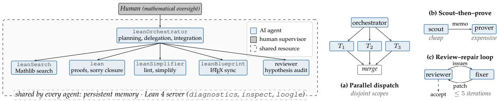

图4：系统架构与编排模式。左图：人类监督员设定数学意图；编排器分派任务给四个专用交互式智能体：库搜索代理(leanSearch)、证明编写代理(lean)、化简代理(leanSimplifier)和蓝图同步代理(leanBlueprint)，同时还有一个自动审查器会在每次对共享仓库的提议变更上运行。所有交互式智能体（包括编排器）共享一个持久化记忆和Lean 4服务器的诊断、检查及loogle工具（补充材料[42]），图中用单个虚线区域表示每个智能体对每个服务的连接。右图：三种反复出现的编排模式。(a) 编排器将独立子任务 $T_{1} , \dots , T_{r}$ 分派给工作在不同不交范围上的工作器，并合并它们的输出。(b) 一个廉价搜索代理扫描库并发出设计备忘录，由更强的证明代理消费，因此仅在确定可行路径后才调用昂贵的证明智能体。(c) 审查器标记问题，修复器应用补丁；循环在审查器接受（虚线）或达到最多五次迭代后终止。

### 方法：多智能体自动形式化

形式化工作由一个通过共享蓝图和持久化记忆协调的专用语言模型智能体团队完成；这里的智能体是一种语言模型程序，它编辑文件并响应Lean的类型检查反馈，直到其任务完成。本附录描述了智能体角色、协调它们的蓝图和记忆，以及运行它们的软件；补充材料[42]扩展了每一部分，复制了智能体提示，并报告了完整的成本分析。

多智能体架构与实现。——证明开发围绕六个专用智能体角色组织：证明编写代理、库搜索代理、化简代理、蓝图同步代理、编排器和审查器；最后一个自动运行于每次对共享仓库的提议变更。其他五个智能体在交互式会话中工作，共享蓝图和关于已尝试内容、有效内容和失败内容的持久化记忆笔记；图4显示了由此产生的系统架构。这五个智能体中的每一个都通过文件编辑和实时类型检查反馈与Lean 4交互，这与人类开发者在VS Code[66]等编辑器中使用的接口相同。证明编写任务分配给最强大、最昂贵的语言模型，因为证明错误会向下游传播；搜索、清理和审计使用较便宜的模型，因为失败的尝试重试成本低；编排根据任务复杂度使用任一类模型。按角色划分的使用情况如图5所示，图6显示了项目过程中各模型的使用时间；完整的成本分析见补充材料[42]。

这六个角色并非一开始就固定：每当出现重复瓶颈（通常由智能体自身报告）时，监督员会为缺失的功能引入新角色，完整角色集在项目的前六周内建立。

智能体通过少量重复出现的协调模式进行交互：并行分派（图4(a)所示），编排器发出许多独立任务；先搜索后证明（图4(b)所示），搜索代理在证明代理尝试昂贵证明前先运行廉价的库搜索；以及审查-修复循环（图4(c)所示），审查器-修复器对循环进行审查和修复。先搜索后证明模式最常被复用：一个快速、廉价的智能体首先识别Mathlib中相关的已有结果，然后一个更强大的智能体利用它们构建证明。其余智能体在审查-修复循环中进行审计和重组：蓝图同步代理保持蓝图与Lean代码同步，化简代理压缩长证明，审查代理则交叉核对声明与原始文献。

我们构建和使用的系统并非像Claude Code或Codex那样的现成编码助手。该系统通过语言模型接口（API调用）构建，作为运行智能体的软件，即TeXRA [63]；针对Lean的特定角色、工具和提示词是为本项目额外构建的。智能体提示词和角色定义随TNLean [37]一起发布；TeXRA本身可单独获取，交互角色的系统提示词已在补充材料[42]中重现。

**蓝图、记忆与人类监督。**——两个共享元素支撑着这一架构：蓝图和持久化记忆。蓝图中的每个定义、引理和定理都附带证明草图、证明状态及其逻辑依赖关系，并链接到将其形式化的Lean声明[31]。一个定理若以不同符号在多个来源中表述，则会在蓝图中统一编写一次，然后在Lean中证明，因此蓝图位于原始文献与

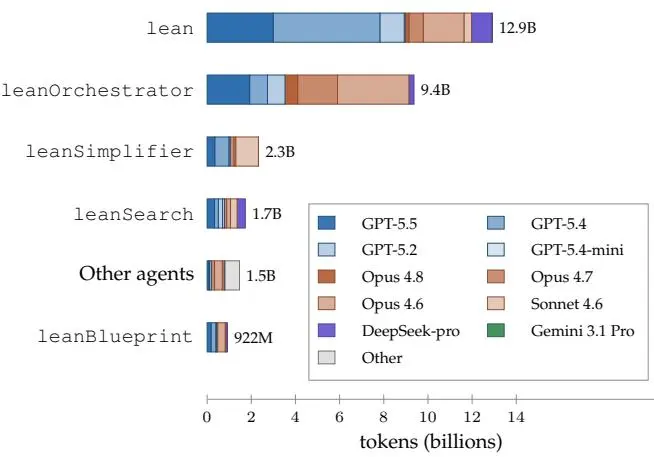

图5：按智能体角色划分的令牌使用情况，每个条形图按该角色使用的语言模型进一步细分。证明编写和协调占据主导地位，这与将能力最强的模型分配给错误代价最高的任务是一致的。

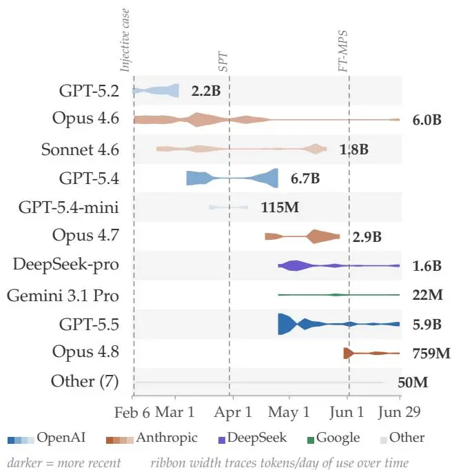

图6：项目过程中的模型使用情况。在每个供应商家族内，较新的模型发布后会逐步取代旧模型，令牌使用量集中在每个时期最强大的可用模型上。每个模型的使用时段以带状图显示，按首次使用时间排序：每个供应商家族使用一种颜色族，色调区分家族内的不同模型，带状宽度追踪所有模型共用同一标尺的每日令牌使用量；每个带状末端数字表示该模型的总使用量。垂直虚线标记了本工作中报告的FT-MPS单射情形、SPT上同调不变量以及FT-MPS证明链完全验证通过的日期。

Lean代码（图1）。蓝图已公开可获取[32]，补充材料[42]以打印比例再现了其依赖图中围绕基本定理的部分。持久性内存单独记录了各会话（限定的工作时段，之后某个智能体的对话被搁置，后续智能体不再读取）中的探索结果、证明策略、反例及技术笔记；若不如此，每个死胡同都将从头调查。

蓝图也是项目将战术决策与战略决策区分开来的地方。战术决策属于智能体：调用哪些 Mathlib 引理、何时放弃失败的方法、如何将长论证分解为中间引理、为 MPS 张量和转移算子尝试哪些定义，直至整个库的 705 个源文件如何组织。战略决策仍由人类监督者负责：形式化陈述是否为主要文献所意图的定理，以及其假设是否正确。监督者通过蓝图审查和引导编排器（为每个任务分配更强或更经济的模型，引导编排器远离无产出路径）来施加影响，从不编写 Lean 代码或选择证明策略；因此监督工作不会随着单个证明的长度而增长，因为 Lean 已经检查了每个证明。监督者分六轮审查了蓝图，每轮都有独立的审查智能体协助，它们对照主要文献 [28–30, 45] 交叉检查各章节；每轮发现了 10–30 个问题，主要是缺失假设、定义不匹配和过于笼统的论断，文中追踪的双随机规范化和渐近重构是其中的代表。这种分工被证明是有效的：大部分战术决策在蓝图审查中得以保留，而在未保留的地方，审查将错误追溯到某个定义或一个非预期的假设，然后由智能体进行纠正。

正如引言中所预期的，没有任何语言模型的上下文窗口能够同时容纳源文献、不断增长的蓝图以及持续扩展的形式化库；因此，这项工作被分割为上述协调的多个有界会话。即使在一次会话中，编排器自身的对话也会增长，直到必须进行压缩：较旧的交流被摘要取代，而正在运行的智能体和开放任务的列表则被保留，因此持久性知识驻留在持久性存储器中，而不是任何单次对话中。正是这种存储器让一个固定大小的上下文窗口，以及固定数量的监督工作，得以支撑一个远高于各自能力的更大项目。

### 补充材料

本补充材料详细阐述了论文正文结尾处给出的方法摘要：智能体角色及其 Lean 4 接口（第 A 节）、连接源定理与 Lean 声明的蓝图（第 B 节）、在有界会话间传递数学知识的持久性存储器（第 C 节）、智能体使用的协调模式（第 D 节），以及论文到形式化的差距分析（第 E 节）。此外，它还记录了计算成本（第 F 节）、展示了一个具有代表性的证明节选（第 G 节），并复现了定义智能体角色的系统提示（第 H 节）。

A. 智能体架构与 Lean 接口 11
B. 蓝图 13
C. 持久性存储器与项目知识 17
D. 编排模式 19
E. 论文到形式化的差距分析 20
F. 计算成本 23
G. 单块基本定理：蓝图摘录 27
H. 智能体的系统提示与工具 29

该形式化系统组织为一个人工指导的多智能体架构。这里的智能体是一个大型语言模型，配备了定义其角色的系统提示，以及我们编程并提供的一组固定工具，例如编辑文件或查询 Lean 编译器。一旦被派发，智能体便自主运行，调用命令并读取其结果，直到报告完成、失败或部分结果。当编排器向子智能体派发任务时，每个子智能体在完成后将其发现报告给编排器。

该系统在 TeXRA [63] 中实现，该工具同时用作命令行程序和 Visual Studio Code 扩展；此处描述的 Lean 特定角色和命令是项目特定的补充。人类监督者通过共享的 Lean 代码和 LaTeX 源文件仓库、一个持久性笔记目录以及实时访问的 Lean 4 编译器，与一组这样的智能体协同工作。

### 1. 智能体角色

表S1中所列的专业化角色是在项目第一个月期间逐步引入的。最早的会话使用通用的、无差别的智能体；当该设置下的瓶颈变得明显时，监督者引入了每个新的专业分工。侦察、证明编写和证明简化在2月下旬成为不同的角色，完整的角色列表在3月中旬被编入一份固定的策略备忘录中。每个智能体通过一组固定的命令与Lean编译器和文件系统交互。

**表S1. 智能体角色**：每个角色通常使用的模型层级、其功能以及除了共享核心之外被授予的工具。所有角色都是使用工具的智能体。交互角色的共享核心是A 3节的Lean 4服务器接口、文件编辑和shell访问以及C节的持久性记忆；最后一列列出了每个角色新增的内容。“层级”是角色通常运行的模型类别，昂贵（E）或廉价（I）；角色并非预先分配给模型，监督者在派发时根据任务设置层级（A 4节）。代码名称对应于结尾材料中命名的角色：lean是证明编写者，leanSearch是库侦察者，leanSimplifier是简化者，leanBlueprint是蓝图同步者。审查者作为自动化审查智能体在每个建议的仓库更改上运行（D 3节）；其审查提示随TNLean发布。

| 角色 | 层级 | 功能 | 超出共享核心的工具 |
|---|---|---|---|
| leanOrchestrator | E | 任务分解、派发 | 子智能体派发、运行管理、仓库和代码审查访问 |
| lean | E | 证明编写、占位符闭合 | |
| leanSearch | I | Mathlib侦察、可行性 | 网络搜索、arXiv查询 |
| leanSimplifier | I | 风格检查、证明简化 | |
| leanBlueprint | I | 蓝图-Lean同步 | 网络/arXiv、参考文献 |
| reviewer | I | 文献-Lean交叉验证 | 在建议的仓库更改上运行 |

所有智能体都使用共同的工具核心：A 3节的Lean 4服务器接口、文件编辑和shell访问以及C节的持久性记忆。它们仅在被授予的额外工具（表S1最后一列）、系统提示和模型层级上有所不同。

### 2. 委派

当编排器（表S1中的leanOrchestrator角色）向子智能体（一个为了执行该任务而启动的独立智能体会话）派发任务时，它会固定会话的属性：子智能体的角色、其初始的任务指令和背景笔记、其工作的文件以及其运行的模型层级。子智能体隔离运行，无法访问编排器的对话，因此它仅根据所获得的指令、笔记、文件和模型进行操作。

**附加指令和背景笔记。** 除了任务指令之外，编排器可以将一个或多个记忆文件作为只读背景放置在子智能体的初始上下文中：一份风格指南、一个已知为假的陈述及其反例列表，或者一个早期侦察智能体留下的备忘录，以便后续的证明编写智能体重用侦察者定位到的Mathlib引理，而不是再次搜索。产生和重用这些笔记的生命周期在C节中描述。

**分配文件。** 每个子智能体被分配一组要编辑的文件和一组作为背景读取的文件；具有视觉能力的子智能体还会收到图形、截图或PDF。并行的子智能体被分配互不相交的文件集进行编辑，这是一种工作惯例而非强制限制，这样就不会有两个智能体同时处理Lean源树（D节）的同一部分。当任务完成时，子智能体的输出要么由编排器复制回项目中，要么对于就地编辑项目文件的子智能体，输出已在那里。

**选择模型层级。** 编排器为每个任务选择一个模型层级；每个选择背后的理由以及所使用的具体模型在A 4节中给出。

### 3. Lean 4 集成及相关工具

智能体通过一个编程接口与 Lean 4 交互，该接口允许外部工具实时查询编译器以获取错误和类型信息，而无需重建项目。该接口驱动着人类开发者在 VS Code [66] 等编辑器中使用的同一个 Lean 4 语言服务器：在编辑器内部，它通过正在运行的 Lean 4 扩展路由；在命令行上，它启动自己的服务器进程，因此智能体看到的是与开发者相同的诊断信息和证明状态。它提供了下面列出的五个工具，每个工具都以等宽字体表示。

(i) `lean_diagnostics` 返回给定文件的编译错误、警告和提示，可以是完整信息，也可以仅返回严重性计数。它检查某个证明步骤是否能通过编译，是证明尝试后调用的第一个工具。

(ii) `lean_inspect` 报告指定位置（由行和列给出）处的证明状态和可用声明，有三种模式。悬停模式再现了用户将光标放在 Lean 编辑器中某个标识符上时显示的信息：其完整类型以及任何相关文档。例如，检查单块基本定理会返回一个签名，表明一个单射张量 A 和生成相同矩阵乘积向量的张量 B 是规范等价的。目标模式返回当前的策略状态，即作用域内的假设和仍需证明的目标。项目标模式返回证明项中该位置处期望的类型，证明项是写为表达式而非策略块的证明。

(iii) `lean_loogle` 在 Mathlib 中搜索一个具名结果。它封装了 Loogle（一个社区开发的 Mathlib 搜索引擎），并通过其公共接口进行查询，接受通过声明名称、结果提及的常量或类型模式进行查询，例如形式为 $\bar{f} ( x + y ) \stackrel{\cdot} {=} f ( x ) + f ( y )$ 的引理，可以在一次批量调用中同时进行多次查询。

(iv) `lean_file` 运行文件级命令，当编辑器状态变得陈旧时刷新服务器：为一个文件重启 Lean 服务器，或对其依赖项执行较轻量的刷新，当某个文件的诊断信息不再反映最新编辑时使用。

(v) `lean_project` 运行项目级命令，这些命令不接受目标文件，用于管理构建和语言服务器：通过 Lake 构建库，获取预编译的 Mathlib 缓存（针对整个项目或仅针对当前文件的导入），清理构建产物，重启或停止语言服务器，以及安装或选择 Lean 工具链。构建命令不捕获其输出，因此编译错误会在之后通过 `lean_diagnostics` 读回。

这些工具共同支持了人类 Lean 用户所遵循的相同迭代循环：尝试证明，检查得到的错误或目标状态，在库中搜索缺失的结果，编辑证明，然后重新检查。

### 4. 模型选择

该系统使用多个不同能力和成本层级的模型，包括 Claude Opus 和 Sonnet、GPT-5 系列、DeepSeek 以及 Gemini，每个模型都在显式选择的最大推理努力下运行，该努力值对于困难的证明会提高，对于常规工作则会降低。证明编写任务，例如填补一个 Lean 的 `sorry`（未证明的占位符）或修复一个断裂的证明链，会被分配给昂贵的高努力模型，因为一次错误的尝试不仅检测起来代价高昂，还可能影响后续任务。侦察、简化和蓝图同步则使用更便宜的模型，在这些任务中，失败的重试成本较低；而编排通常使用更高级别的模型，例如 Claude Opus。根据经验，我们发现 Claude Opus 4.6 是比 GPT 5.2 更好的编排器，我们将此归因于 token 使用的差异（见图 S9）；GPT 5.5 后来缩小了这一差距，其承担的工作份额也相应增长。这种分配并非事先固定，而是在项目推进过程中，当明确哪些任务概况需要昂贵层级时逐步确定下来的。由此产生的每个模型的成本（图 S11）集中在少数几个高能力模型上，总成本在 F 节中进行分析。

### 5. 上下文管理

在单个会话中，编排器的对话会不断增长，直至接近模型的上下文窗口限制，此时系统会对其进行压缩，总结较旧的交流内容以释放空间（图 S1）。每次压缩时，编排器会收到其仍在运行的子代理的摘要、任何后台计算任务及其当前任务列表，已完成子代理的记录结果仍可检索，因此它能继续进行中的工作，而非重新启动。

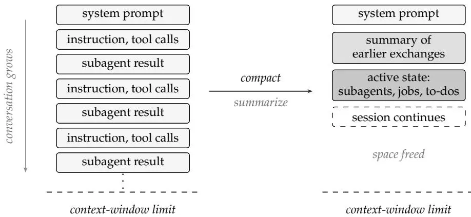

图 S1. 单个会话中的上下文管理。上下文从上到下读取：系统提示位于顶部，新的轮次（任务指令、工具调用、返回的子代理结果）随着工作进展向下追加，直到接近模型的上下文窗口限制（左图）。压缩时，较旧的交流内容被总结成一个单独的块，而活动状态（正在运行的子代理、后台任务和当前任务列表）被保留，从而释放大部分窗口空间，使会话得以继续（右图）。持久性知识则单独保存在本附录的永久存档中。

### 附录 B：蓝图

蓝图是一份同步的数学 LaTeX 文档，作为原始文献与 Lean 代码库之间的中间层。每个定义、引理和定理都带有机器可读的元数据，将其链接到形式化证明、记录其状态并跟踪其逻辑依赖关系。蓝图工具包本身是 Massot 的 leanblueprint 包 [31]；我们的贡献在于 FT-MPS 内容。我们还记录了项目中一些关于如何使用蓝图作为下文多智能体自动形式化媒介的经验和扩展。

本论文（包括正文和本补充材料）中引用的结果，采用物理学文献的非正式风格表述；我们并未将它们与形式化它们的 Lean 声明逐一对应。这种对应关系，连同精确的形式化假设以及每个语句的证明状态，都存在于蓝图 [32] 中。我们鼓励希望获取本文所讨论任何结果的形式化对应物的读者，在阅读本文的同时查阅该蓝图。

通过第 D 节中的审核-修复循环，有两项检查确保各层之间保持一致：leanblueprint 包中的 `checkdecls` 命令通过程序检查，确保 LaTeX 版本蓝图中每个指向定理和引理标签的 `\lean` 和 `\leanok` 链接都能解析并编译。对于 leanBlueprint 智能体，我们还提示它们编写与 Lean 标签一致的蓝图内容，并且它们也通过自行运行 `checkdecls` 来获得反馈。leanBlueprint 智能体生成的蓝图内容应与 Lean 代码中形式化的内容相匹配。然而，有时这些内容可能会过时。因此，我们使用自动审核者来检查语义一致性，这是任何语法工具都无法验证的：即 Lean 定理所证明的蓝图语句，其假设条件不超过所引用来源中的条件。

### 1. 第 1 章 结构

形式化证明围绕规范形构造展开，并简化为三个步骤：

(i) 规范形约化。利用转移算子 $E_{A}$ 的谱理论将任意张量约化为规范形 (CF)。首先，使用量子 Perron-Frobenius 理论和 Kadison-Schwarz 不等式将虚拟空间分解为矩阵 {A<sup>i</sup>} 的最小不变子空间。这使得张量呈现块上三角形式。非对角三角块对周期迹没有贡献，因此可以丢弃，剩下一个具有不可约块的块对角张量。这些块可能仍然是周期的，即其转移映射可以具有非平凡的外围特征值；通过公共周期进行分块可以消除这种周期性 [41]。得到的张量是正态块（每个块带有一个标量权重）的块对角直和，即主文中定义的 CF。然后，可以选择对 CF 块进行进一步的规范归一化，得到 [29] 术语中的规范形 II (CFII)。另外，一个正态块只有在进一步有限分块后才成为单射的，所需的分块长度由量子 Wielandt 界 [45] 控制。这产生了块单射规范形 ([29] 中的 biCF)。

(ii) 块分离。张量进入 CF 后，证明通过首先将相同正态张量的重复副本分组到正态张量的基中，来比较它们的正态块。对于足够大的系统尺寸，由不同基元素生成的 MPV 是线性无关的。由于两个完整的 MPV 族相等，两侧独立的正态块扇区必须匹配。然后，转移算子能隙识别可能的匹配：如果两个正态块的混合交叠不衰减，则这些块相差一个相位而规范等价；如果交叠衰减，则它们不能代表同一个扇区。在 MPV 相等的情况下，这些块相位必须与 CF 分解中的标量权重兼容，因此将相位吸收到权重后，整个块对角张量是规范等价的。比较是在有限系统尺寸上进行的，而不是通过渐近极限，这就是为什么包含等模和振荡情况，例如 GHZ 型相位副本。

(iii) 相等 MPV 基本定理。将规范形约化与块分离相结合，得到了基本定理的相等情形：两个 CF 代表生成相同 MPV 族当且仅当它们的正态块扇区数据匹配，并且在标量权重和块相位对齐之后对应的块是规范等价的。

图 S2 总结了这一约化过程。从一个任意张量开始，首先通过丢弃非对角三角项获得一个具有不可约块的块对角张量。公共分块去除这些不可约块的周期并给出 CF，其块是正态的；图 S3 显示了单个块的转移算子谱层面的这一步骤。进一步的规范归一化给出 CFII，而由量子 Wielandt 界控制的单独有限分块则给出块单射规范形 (biCF)。

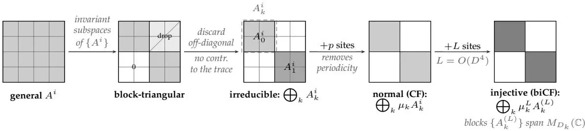

图 S2. 全局张量层面的规范形约化（本附录证明大纲的步骤 (i)）。矩阵 {A<sup>i</sup>} 的公共不变子空间将张量置于块三角形式；非对角块对迹没有贡献并被丢弃，得到具有不可约块 $A^{i} = \bigoplus_{k} {\breve{A}}_{k}^{i}$ 的块对角张量，这些块还不一定是正态的。对 p 个位点进行分块去除了残余周期性（图 S3）并给出规范形 (CF)，这是正态块的直和，每个块携带一个标量权重 $\mu_{k}$ 。由量子 Wielandt 界控制的进一步对 $L \stackrel{\smile} {=} O ( D^{4} )$ 个位点分块，使每个块成为单射：分块后的矩阵 $\{A_{k}^{( L )} \}$ 张成块代数 $M_{D_{k}} ( \mathbb{C} )$ 。结果 $\bigoplus_{k} \bar{\mu_{k}^{L}} A_{k}^{( L )}$ 与 CF 具有相同的块对角形状，即为块单射规范形 (biCF)。

表S2列出了本文分析的蓝图章节。这些章节包含了等MPV基本定理的证明链、其前提条件，以及作为首次应用使用的对称性结果。整个TNLean仓库包含了该证明链之外的其他材料，包括信道表示、矩阵乘积算子和密度算子、量子熵、量子动力学半群、母哈密顿量、关联的指数衰减、具体示例以及MPS基本定理的替代表述。这些部分对于更广泛的TNLean库有用，但它们不属于本文分析的正式化内容。一些仅在FT-MPS和对称性链之外使用的深层输入目前是假定而非证明的；它们不进入本文讨论的结果。章节按蓝图中的呈现顺序列出，而非严格的先决条件顺序。

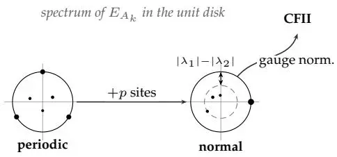

图S3. 细化一个不可约块 $A_{k}^{i} .$ 图S2中+p步骤背后的单块图景。不可约块的转移算子 $E_{A_{k}}$ 可能有多个外围特征值，即单位根（周期性的）；将p个位点分块后留下唯一的外围特征值1，与谱的其余部分之间存在间隙 $| \lambda_{1} | - | \lambda_{2} |$，因此该块是正规的且其转移算子是原始的。另外，CF块的规范归一化给出了规范形II（CFII）；CFII和biCF是CF的不同细化，不应相互等同。

表S2. 本文涵盖的12个蓝图章节。
| 章节 | 主题 |
|---|
| 1 | 引言 |
| 2 | 矩阵乘积向量 |
| 3 | 单块基本定理 |
| 4 | 量子信道 |
| 5 | 施瓦兹不等式和乘法域 |
| 6 | 量子佩龙-弗罗贝尼乌斯理论 |
| 7 | 转移算子间隙与块分离 |
| 8 | 维兰德界 |
| 9 | 规范形约化 |
| 10 | 正规张量的基 |
| 11 | 基本定理的证明 |
| 12 | 对称性和弦序 |


图S4总结了源文献在蓝图中的分布情况。该图的重点不仅在于书目信息：它表明形式化并非由单一FT-MPS论文驱动，而是由一个输入网络驱动，这些输入来自量子信道、佩龙-弗罗贝尼乌斯理论、维兰德界、规范形和对称性分析。这些来源使用了略有不同的物理和数学符号，代理团队不得不加以协调。这种源结构反映在蓝图章节的组织方式以及算子理论基础与张量网络特定论证之间的区分上。

### 2. 构建模式

相同的章节源文件既可以编译为PDF专著，也可以编译为带有交互式依赖关系图的HTML文档。PDF提供了传统的数学呈现方式，而HTML版本让读者可以直接检查定理依赖关系和证明状态。仓库的README文件记录了从共享源文件编译两种输出的技术设置，包括Tikz图形处理、公共宏以及特定输出的格式选择。

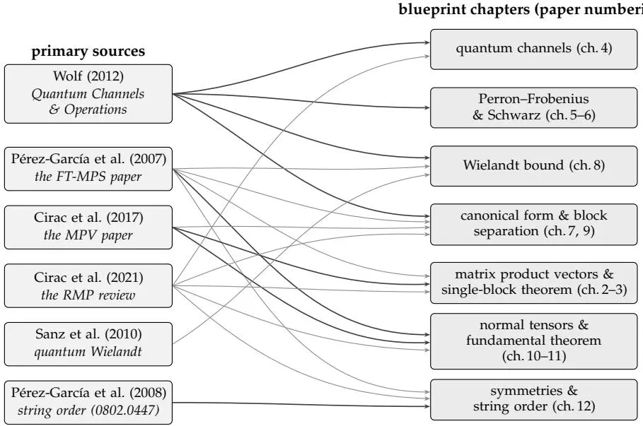

图S4. 主要来源及其所供给的蓝图章节，章节编号如表S2所示。Wolf关于量子信道和运算的讲义[44]是算子理论基础章节（量子信道、佩龙-弗罗贝尼乌斯和施瓦兹理论、维兰德界以及规范形约化）的主要来源。Pérez-García等人[28]和Cirac等人[29]关于矩阵乘积态的结果提供了张量网络章节，Cirac等人[30]的综述供给了多数章节；Sanz等人[45]的量子维兰德不等式供给了维兰德界，对称性章节则基于Pérez-García等人[47]的弦序分析以及该综述。较粗的线条标明了每个章节的主要来源：Wolf的笔记提供了算子理论基础（第4–9章），而矩阵乘积向量、基本定理和对称性章节（第2–3章和第10–12章）则基于矩阵乘积态文献。

### 3. 标签系统

以下是Massot的leanblueprint包[31]所使用的标签；我们在此列出以供完整参考。\lean标签将蓝图项目链接到一个或多个完整的Lean声明名称。\leanok标记表明相应的陈述或证明已在Lean中实现，可出现在陈述、证明或两者之上。\notready标记标示尚未准备好进行形式化的项目，通常是因为前置材料仍缺失。\uses标签记录蓝图项目之间的逻辑依赖关系。其参数为蓝图标签，定理陈述及其证明可携带不同的依赖列表：陈述列出解析它所需的定义，而证明列出证明实际调用的引理。

### 4. 依赖图与状态追踪

蓝图的HTML构建[32]将所有标记项目渲染为有向无环图中的节点，边从\use声明引出。每个节点根据其形式化状态着色：深绿色表示证明已实现并验证的定理，绿色表示Lean语句标记为完整的定理，浅绿色表示链接到Lean的定义，蓝色表示已准备好陈述或证明的项目，橙色表示标记为未准备好的项目。该图显示了可以推进工作的地方：橙色节点标识下一层前置工作。这些状态由蓝图中的标签以及定理和引理标签的依赖关系生成。

图S5展示了围绕基本定理的形式化依赖图部分，为印刷重新绘制。绿色节点是经Lean验证的结果，采用与HTML图中深绿色“证明已验证”节点相同的状态约定；灰色节点标记本形式化工作之外的一个预期应用。图的下半部分展示了该定理的前置条件。特别地，规范形式论证依赖于两个大体独立的输入：量子佩龙-弗罗贝尼乌斯理论（提供谱不动点和原始性结果）以及维兰德界（提供有限长度跨越估计）。上半部分记录了该定理随后用于获得的内容：虚投影表示及其上同调类，这是朝向一维对称保护拓扑分类的形式化第一步。

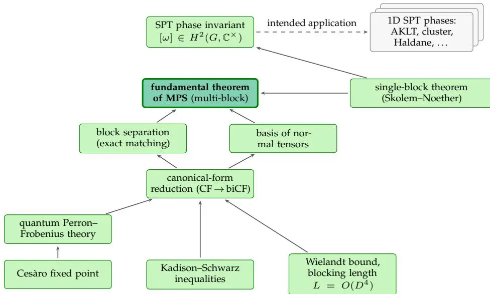
图S5. 围绕基本定理的蓝图依赖图经过筛选的子区域，为印刷重新绘制。每个绿色框是一个形式化的结果；箭头从结果指向使用它的结果。经验证的链条从切萨罗不动点和卡迪森-施瓦兹不等式出发，经过量子佩龙-弗罗贝尼乌斯理论和维兰德界，到达规范形式约化、块分离、正规张量基以及多块基本定理；单块定理同时为多块定理和对称性构造提供输入，后者产生对称保护拓扑相不变量$[ \omega ] \in H^{2} ( G , \mathbb{C}^{\times} )$。右上角的卡片堆是预期应用（虚线箭头），即一维对称保护相的分类；它不属于本形式化工作，后者以不变量为终点。量子佩龙-弗罗贝尼乌斯理论和维兰德界是规范形式的独立前置条件：前者是谱性质的，后者是跨度增长论证的。

### 5. 蓝图写作惯例

若使用默认设置，智能体的写作风格往往过于晦涩难懂，使得人类读者难以审核，而这种晦涩会带来实际成本。某次迭代产生了大约2000行Lean代码和一整章专门论述$D = 0$和$\hat{N} = 0$边界情况的蓝图章节；在其他情况下，智能体追求了出人意料的冗长证明路径，其成功与否在没有额外假设的情况下无法判断。因此，我们要求并在审核中强制规定，蓝图必须以自包含、人类可读的数学散文形式编写：行文中不得出现Lean标识符，证明概要必须遵循实际的Lean证明结构，并且在章节标题和数学陈述中避免使用软件工程术语。智能体撰写的草稿经常违反这些约定，例如将Lean名称泄露到散文中，用源论文的定理编号替代陈述，或使用“辅助引理”、“包装器”和“重构”等术语。纠正这些问题是在六轮审核中反复出现的任务之一。

### 附录C：持久化内存与项目知识

多智能体系统在会话之间维护一个持久的项目内存。这些文件扮演着累积研究笔记的角色，很像研究生在一个项目中保存的记录：它们记录了哪些尝试过，哪些证明路径有效，哪些陈述被证明是假的，以及必须遵循哪些约定。这种内存防止了相同的数学错误在不同智能体会话之间重复出现。该内存还协调了跨智能体的交接：当编排器委托任务时，它可以将选定的内存文件放入子智能体的初始上下文中。最常见的交接是“侦察-然后-证明”（第D.2节），在这种交接中，由一个廉价的搜索智能体编写的备忘录会被附加到后续的证明编写智能体的上下文中，这样Mathlib搜索只执行一次，而不是在每个会话中都重复进行。完整的会话存档，以及下面描述的提炼文件，都保存在项目的持久化内存系统中；其中被认为最广泛可复用的精心挑选子集与TNLean一同发布在$\mathtt{docs} / \mathtt{audits} /$和docs/paper-gaps/目录下，以便过程中的可复用部分可以被检查和复用。

### 1. 组织

知识库由大约450个Markdown文件组成，这些文件在项目连续的工作目录中积累而成。文件按任务和日期命名，例如`2026-02-07\_initial-mathlib-audit.md`或`aperiodic-ft-assembly-gap-2026-06-02.md`，因此检索是通过文件名约定和关键词搜索，而不是通过深层层级结构。许多文件还带有记录最后修改它的智能体和时间戳的元数据，这样就可以按角色和时间段对文件进行筛选。

### 2. 记忆文件的类别

档案文件分为七个主要类别，汇总于表 S3。各类别的计数是近似值，并非详尽无遗；其余的文件是交叉分析文件和一次性笔记。

**表 S3.** 记忆类别及近似计数和代表性文件名模式。
| 类别 | 计数 | 典型模式 |
|---|---|---|
| 进度/状态 | ~80  | $\mathsf{s e s s i o n \_ t} , \star \_ p \mathtt{rogress} \star$ |
| 设计/侦察 | ~60  | $\star \_ \mathrm{plan} \star , \star \_ \mathrm{scout} \star$ |
| 清理/重组 | ~50  | $\star \_ \mathtt{cleanup} \star , \star \_ \mathtt{inter} \star$ |
| 审计/审查 | ~40  | $\star \_ \mathtt{audit} \star , \star \_ \mathtt{crosscheck} \star$ |
| 蓝图同步 | ~30  | $\mathtt{b l u e p r i n t \_ \star} , \mathtt{c h X X \_ \star}$ |
| 勘误/反例 | ~15  | $\mathtt{c o u n t e r e x a m p l e \_ \star}$ |
| 固定参考/风格指南 | ~10  | 风格指南、技术纲要 |

每个记忆文件还带有一个标签，用于标识最后修改它的智能体角色。按角色族分布的统计数据见图 S6。证明编写智能体和编排家族合计占所有条目的半数以上，这与大部分工作是证明构建和任务协调的情况一致。

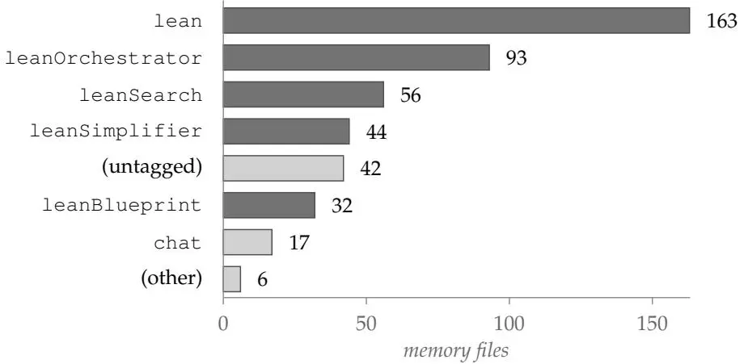

图 S6. 按最后修改文件的智能体角色划分的记忆文件（总数 = 453）。深色柱状条代表表 S1 专业角色分类中的角色；浅色柱状条代表该分类之外的标签：聊天记录、元数据记录之前的未标记启动文件，以及一个名为"其他"的剩余类别。

### 3. 从会话笔记到固定参考文件

会话笔记记录了本地操作信息，包括证明状态、构建结果、未完成步骤和任务完成记录。这些笔记由编排器或专门的智能体定期提炼为持久性的经验教训：证明技巧、已知的带反例的错误陈述、Mathlib 空缺列表以及协调策略。提炼通常由监督员请求，而编排器持有一项常设指令，即在笔记积累时对其进行整理。最具可重用性的笔记随后会被提升为固定状态，并可供所有未来的会话使用，无需明确搜索。这可以防止先前遇到的障碍被独立地重新研究。

最多可以固定十个记忆文件，并且指示每个智能体在会话开始时查阅这些文件。此限制确保固定文件用于持久指导，而非临时的状态记录。在项目最终状态，被固定的文件涵盖了五类信息：蓝图和论文的编写约定；Lean 4 和 Mathlib 技术；源文献对齐，包括 Wolf 笔记 [44] 的讲稿编号和覆盖范围审计；审查和编排策略，包括自动审查员何时应对代码变更进行评论或批准；以及特定于项目的数学指导，包括论文与形式化差距分析以及当时正在积极进行的 MPS/SPT 分析。

### 附录 D：编排模式

编排器通过三种重复出现的模式协调子智能体：并行分派独立任务、通过"侦察-证明"交接来分阶段进行证明工作，以及在审查与修复阶段之间交替。请注意，我们并未强制或提示这些模式；编排智能体是自发构思并采用这些模式的。

### 1. 并行分派

最主要的编排模式是并行分派。编排器对剩余工作进行分类，将其分配给不相交的文件组，然后并发启动三到五个子智能体，每个子智能体拥有自己的文件集和任务特定的指令。子智能体独立运行，而编排器则继续监督其他工作。当结果返回时，编排器合并更改，并通过完整构建来验证合并后的状态。编排器在分派时会分配不相交的文件集，因为两个智能体编辑同一个文件会产生相互冲突的编辑结果，并且解决这些冲突代价高昂。

### 2. 先侦察后证明

在尝试一个困难的证明之前，系统会部署一个廉价的侦察智能体来评估可行性。一个 leanSearch 智能体在 Mathlib 中搜索相关引理，检查所需定义或引理是否已存在，并撰写一份包含精确定理签名的设计备忘录。该备忘录不保存在编排器的对话中，而是写入持久内存（附录C）；编排器审查备忘录后，如果路线可行，则分派一个昂贵的 Lean 智能体，并将该备忘录作为只读上下文附加上去。在实践中，找到正确的现有 Mathlib 引理往往是节省最多精力的步骤。

失败模式。此类会话中会出现几种反复出现的失败模式。首先，智能体可能生成一个能编译通过但只证明了目标定理较弱版本的证明；这些错误会被智能体团队的自我审查或蓝图的人工审查（如正文所述）捕获。其次，证明项可能变得过于庞大，超出 Lean 的计算预算：Lean 通过计算内部步骤（称为“心跳”）来限制单个证明上的工作量，一旦心跳数超过预算（默认 200,000），便会中止尝试，从而避免编译器因失控的表达式而挂起。解决方法是把证明分解成带有命名中间结果的更小引理；在一个案例中，这使单个证明的心跳数大约减少了六倍，从 1,600,000 降至 250,000。第三，诊断信息可能在编辑后过时，需要重启特定文件的服务器。侦察智能体还可能提出类型与目标不匹配的引理；使用附录 A 第 3 节的 lean\_inspect 命令检查引理的完整类型签名，可以在引理被后续使用之前发现这个问题。

### 3. 审查-修复循环

审查和修复阶段交替进行。审查智能体（通常是自动化审查员或 leanBlueprint）识别差异：论文与 Lean 的不一致、缺失的假设、风格违规或蓝图漂移。修复智能体处理已识别的问题，然后重复审查以验证修复效果并捕获回归错误。这个循环通常在两到三轮内收敛。最重要的实例是论文与 Lean 的交叉检查，它在形式化过程中发现了多处错误（参见附录 E）。

当智能体提议更改 Lean 源代码树时，会运行一个相关的审查步骤。一个自动化审查员（遵循固定审查提示的语言模型）检查提议的更改，并针对风格违规、证明完整性问题或缺失文档发表评论；然后一个修复智能体读取未解决的评论，应用修正，并提交修订版本。修订后的更改本身不会触发新的审查（这可能会导致无止境的审查循环）；相反，循环在未决评论存在时重复，并在评论全部清除或达到安全上限（五次迭代）后停止。审查和修复提示随 TNLean 一同发布；表 S1 中各智能体角色的系统提示在附录 H 中重现。

### 附录E：论文与形式化差距分析

形式化过程揭示了原始文献与形式化证明之间的若干差异：证明策略的分歧、假设强度的差异，以及形式化正确性与数学意图之间的差距。正文简要讨论了其中两个错误，即双随机"规范"和有限陈述的渐近重新表述；本附录更详细地记录了余下的情况。另一类类似的失配涉及规范形式中的重复副本。多个区块可以表示同一正常张量（规范因子和相位因子不同）。若这些副本具有权重 $\mu_{j , 1} , \ldots , \mu_{j , r_{j}} ,$ 则它们在长度N处的总贡献需乘以 $\begin{array} {r} {\sum_{q = 1}^{\breve{r}_{j}} \mu_{j , q}^{N} .} \end{array}$ 智能体最初将这个因子处理为如同单个标量幂的行为，或如同归一化后收敛到非零极限。这通常是不正确的：对于权重分别为 $\mu_{j , 1} = + 1$ 和 $\mu_{j , 2} = - 1$ 的两个副本，该因子为 $1 + \left( - 1 \right)^{N}$ ，它会在所有奇数N处振荡并消失。因此，该证明仅覆盖了比预期FT-MPS更窄的情况。

修正方案是避免在此处使用极限论证。在将等价的正常区块分组后，剩余的不同正常区块产生的MPV在足够大的系统尺寸下是线性无关的。因此，完整MPV的相等性强制要求对应的标量因子在每个足够大的长度处精确相等。这些标量因子是非零复数幂的有限和。几何外推步骤将相等性从所有足够大的指数推广到所有指数，然后Newton-Girard恒等式恢复出附着在每个重复区块上的权重重集。这统一处理了振荡情况 $\mu_{j , 1} = + 1$ $\mu_{j , 2} = - 1$ 以及一般的重复副本情况，无需假设收敛性。

### 1. 证明策略的分歧

通过 Skolem–Noether 定理的 injective 情形的路线（在主文中描述并在 G 节中重现）是形式化证明与标准 MPS 文献之间存在分歧的一个例子；以下分歧涵盖了其余情况。

当跨具有不同约定和术语的不同资源进行自动形式化时，可能需要一些小心以确保智能体本身不会混淆这些内容。否则，它们可能导致可能冗长的弯路和失败的尝试，而这些修正或重试的成本可能很高。图 S7 澄清了我们遇到的两个区别。首先，转移算子的规范可以选择为幺正的/右正则或迹保持的/左正则，但通常不能同时成立。其次，证明在键算子上使用了两种配对：代数单区块论证中的双线性迹配对，以及用于定义谱论证中转移算子伴随的 sesquilinear Hilbert-Schmidt 内积。区块标准型 CF 和 biCF 之间的区别如图 S2 所示：CF 具有正规区块，而 biCF 仅在进一步分块使每个区块 injective 后才能获得。

即使是经典的非负矩阵 Perron-Frobenius 定理在 Mathlib 中也不可用：项目锁定的版本仅包含不可约和本原矩阵的定义，而在撰写本文时，该定理本身仅存在于正在审查的提议贡献中。对于量子 Perron-Frobenius 理论，文献援引了正映射的 Perron-Frobenius 定理 [44]。形式化证明则直接构建了所需的结论。对于 $M_{D} ( \mathbb{C} )$ 上的不可约 CP 映射 $E$，通过在密度矩阵的紧凸集上的 Brouwer 不动点论证获得一个半正定 Perron 特征向量；Brouwer 步骤在项目的头几周被假设为一个公理，后来通过沿着显式收缩传输一个关于单纯形情况的外部 Lean 形式化证明得到证明。对于迹保持映射，Cesàro 平均

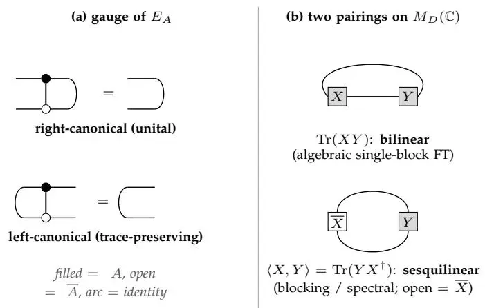
图 S7. 本开发中“标准型”和“内积”这两个术语重载的两个概念：(a) 转移算子 $\begin{array} {r} {E_{A} ( X ) = \sum_{i} A^{i} X ( A^{i} )^{\dagger}} \end{array}$ 的规范，作为张量网络恒等式（填充 = A，开放 = A，弧 = 恒等映射）：闭合右侧键给出左侧的恒等映射，即幺正的右正则规范 $\begin{array} {r} {\sum_{i} A^{i} {( A^{i} )}^{\dagger} = I ;} \end{array}$ 闭合左侧键给出右侧的恒等映射，即迹保持的左正则规范 $\begin{array} {r} {\sum_{i} \left( A^{i} \right)^{\dagger} A^{i} = I .} \end{array}$ 一种规范实现其中之一；同时实现两者，即主文中讨论的双随机规范，仅对非一般族成立。(b) 证明中使用的键算子上的两种配对：双线性迹配对 Tr(XY )，代数单区块论证依赖于此；以及 sesquilinear Hilbert–Schmidt 内积 $\langle X , Y \rangle \bar{=} \operatorname{Tr} ( \bar{Y} X^{\dag} )$，它定义了分块和谱论证中使用的转移算子伴随。

$$
S_{N} ( \rho ) = \frac{1} {N} \sum_{k = 0}^{N - 1} E^{k} ( \rho )\tag{S1}
$$

通过纯序列紧性即可得到一个不动点，无需不动点定理。不可约性将得到的本征向量提升为正定向量，唯一性则来自临界标量比较与对偶迹的结合。这一直接链条替代了形式化证明中后续对Perron–Frobenius定理的每次调用。

### 2. 形式正确性 vs. 数学意图

如正文所讨论，系统可能生成对比预期定理更弱或更特殊陈述的形式正确证明。Lean仅检查陈述本身的定理；通过类型检查，它并不验证该陈述是否与文献中预期的结果一致。当陈述假定了预期定理本应推导出的结构数据，当定义过于严格而排除了预期情形，或当中间引理在目标定理中不可用的假设下得到证明时，就会发生这种情况。每种情况下证明在形式上都是有效的，但数学陈述已偏离了预期意图。人类审查循环旨在通过按数学意义（而非仅形式一致性）检查蓝图来捕捉这种偏离。

### 3. 论文到Lean的扩展

形式化过程中的一个持续特征是，论文中的简短论证会扩展为更长的中间Lean引理链。这种扩展是不均匀的：代数论证通常增长倍数较小，而需要新支撑引理的谱论证可能增长一个数量级。

几个代表性例子说明了这种规模变化。证明FT-MPS中的规范矩阵X（参见正文定理1）可逆的步骤扩展成了超过200行的Lean代码。论文中对Perron–Frobenius定理的一次调用扩展成了超过150行，涵盖了相关不动点的存在性、正定性及唯一性。块分离论证扩展成了超过800行，因为形式证明必须比较有限长度的MPV，建立所需的线性独立性，并控制附加到重复块上的标量权重。基于Burnside定理的代数生成步骤扩展成了超过400行，因为证明需要经过自然作用的不可约性以及完整矩阵代数的有限维生成性。

对于纯代数部分，差异较小。单块基本定理在蓝图中有一个十行的证明草图，对应一个70行的Lean文件。Skolem–Noether定理有一个四行的蓝图证明和一个40行的Lean证明，即skolemNoether\_matrix。在章节级别，比较起来大约是240行的蓝图数学内容对应约650行的Lean代码。

### 4. Mathlib的缺口及应对方法

形式化过程中遇到了Mathlib库中的五个缺口，每个都需要定制的替代方案（表S4）。

表S4. 遇到的Mathlib缺口及其替代方案。
| Mathlib中缺失的部分 | 使用的替代方案 |
|---|---|
| 若尔当标准形 | 广义特征空间与可逆/幂零分解 |
| 矩阵代数的伯恩赛德定理 | 雅各布森稠密定理加上有限维张成空间论证 |
| 卡迪森-施瓦茨不等式 | 针对完全正映射的直接证明，遵循Wolf的笔记 |
| 完全正映射的佩龙-弗罗贝尼乌斯定理 | 直接不动点与不可约性论证 |
| 布劳威尔不动点定理 | 单纯形上的布劳威尔定理（外部库），转移到密度矩阵 |

Mathlib中不提供若尔当标准形。维兰德界以及文献中若干衰减估计的标准证明均使用若尔当块来控制矩阵幂的增长。形式化过程用广义特征空间（Mathlib中已有）替代这一步骤，并直接证明所需的可逆部分与幂零部分分解。幂零估计随后简化为初等有限维论证，例如当N为幂零矩阵时$1+N$的有限几何级数求逆，Mathlib提供了这一功能。

矩阵代数的伯恩赛德定理同样缺失：Mathlib未提供"$M_{D}(\mathbb{C})$的每个不可约子代数都是全矩阵代数"这一结论。形式化过程通过雅各布森稠密定理推导该结论，经历了自然模的不可约性、其单性、代数作用的稠密性以及最终有限维张成空间的稳定性。基本定理本身并不需要这一结果。它出现在Sanz等人[45]的量子维兰德不等式论文中——该项目也对其进行了形式化：在该论文中，该定理用于证明不可约作用的非周期张量是正规的，从而将正规性的代数定义与文献中常见的谱定义联系起来。本文报告的结果侧重于基本定理所需的内容。

卡迪森-施瓦茨不等式同样缺失。形式化过程按照Wolf的笔记[44]证明了完全正映射上的该不等式及其等式情形和乘法域。这些结果直接进入基本定理：加权卡迪森-施瓦茨不等式中的等式条件产生了度量Kraus算子之间的交织关系，从而建立了将不同块分开的转移算子间隙；乘法域则构成了在规范型化简过程中将虚拟空间分解为极小不变子空间的基础。

完全正映射的佩龙-弗罗贝尼乌斯理论在MPS文献所使用的形式下不可用。因此形式化过程在内部证明了所需的量子佩龙-弗罗贝尼乌斯推论。在保迹情形下，Cesàro平均(S1)通过紧性产生了一个不动点，从而避免了任何不动点定理；对于不一定保迹的一般正映射，不动点步骤使用了下面描述的密度矩阵上的布劳威尔定理，这就是如何将不可约张量转化为保迹度量的方法。不可约性随后提供了后续所需的两个佩龙-弗罗贝尼乌斯推论：不动点是正定的，并且在归一化后是唯一的。这个直接论证替代了形式化过程中后续对佩龙-弗罗贝尼乌斯理论的引用。

最后，布劳威尔不动点定理本身在 Mathlib 中并不可用。该项目引入了一个外部的 Lean 形式化证明（从 <https://github.com/math-xmum/Brouwer> 分支到 <https://github.com/LionSR/Brouwer>），该证明通过斯卡夫组合引理，针对标准单形以及单形的有限积证明了该定理。从乘积情形出发，该形式化推导出了立方体的定理，因为立方体是区间的乘积，而每个区间与一维单形同胚，进而推导出任何有限维赋范空间的紧收缩核的定理。密度矩阵的情形随后通过一个从所有矩阵空间到密度矩阵的显式连续收缩得到，该收缩由埃尔米特部分、迹固定平移、正定部分和归一化构成。上述 Cesàro 构造避免了对保迹映射使用布劳威尔定理；布劳威尔定理仍用于一般正映射的佩龙-弗罗贝尼乌斯特征向量，该映射不必保迹。

### 附录F：计算成本

交互式智能体运行时记录的模型API成本为20,206美元，合并了项目期间使用的两台机器的日志，时间跨度从2026年2月6日至6月29日。图S8追踪了累积总额（以美元和令牌计）。此估算为近似值：它涵盖了项目工作区中的所有模型使用，即整个TNLean库，而非仅基础定理，并且头条定理（本例中为FT-MPS）的成本无法与周围开发的成本清晰分离。最好将其解读为构建整个库的成本。仅针对基础定理的粗略数字可通过代码规模缩放得到：核心链条约62,000行，约占库的四分之一，因此估算值接近5,548美元。

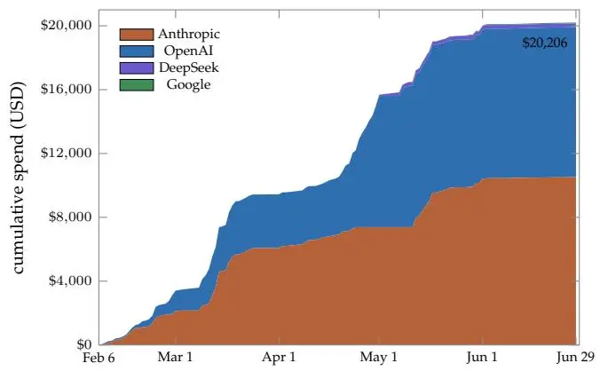

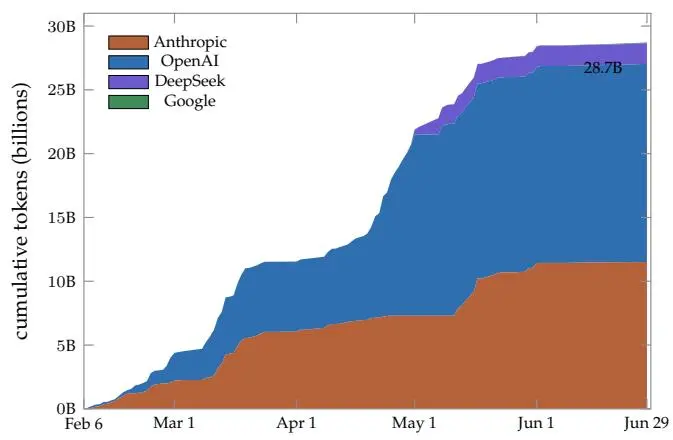

图S8. 开发过程中的累积模型API成本，合并了两台机器的日志，左图以美元计，右图以令牌计。美元曲线的终点与正文中引用的总额20,206美元相符；OpenAI和DeepSeek占令牌的比例高于成本的比例，因为它们的每令牌价格较低。

累积曲线呈阶梯状而非均匀形式，反映了智能体关闭长证明链或修复大型依赖断裂的时期。接下来的细分按智能体角色分离了总额。

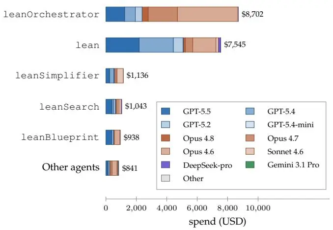


图S9. 按智能体角色划分的成本，每个柱状图按该角色使用的语言模型进一步细分，左图以美元计，右图以令牌计。证明编写和编排占主导地位；每个提供商用同一色系表示。

证明编写和编排合计占成本的五分之四，这与将最强大的模型分配给错误成本最高的任务是一致的（第A.4节）。这两种角色具有不同的成本特征：证明编写调用的平均成本较低但数量众多，而编排调用成本更高，因为每次调用都携带大量上下文。图S9按每个角色使用的模型细分了其成本。图S10的时间分辨视图显示了项目期间每个模型的使用时段；每幅图的一个面板也出现在《快报》的末尾材料中。每个成本图将美元视图与按令牌的相同细分配对，并且这两种视图并不总是一致的，因为每个提供商的每令牌价格不同。

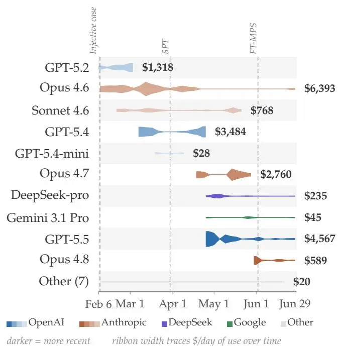

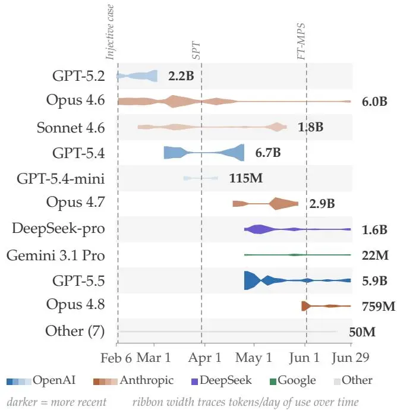

图S10. 每个模型的使用时间段，按首次使用排序并合并了两台机器；每个提供商用一个色系，色系内用深浅区分模型。每条带的宽度沿其自身时间线（左图：美元/天；右图：令牌/天）追踪使用强度，所有模型共用同一标尺。每个使用量低于10美元的模型被归入单独的"其他"行。虚线垂线标出了本文中报告的单射FT-MPS情形、SPT上同调不变量以及FT-MPS证明链完全通过验证的日期。

工作分散在四家提供商之间，其中 Anthropic 和 OpenAI 合计占计量成本的 99%。部分 OpenAI 的工作通过固定价格的 ChatGPT 订阅上的代码生成智能体完成，按 $0/令牌计费，但按计量 API 费率计算相当于约 $1,594（运行在 GPT-5.4 上）。当数据按模型而非按角色分组时，同样可见这种集中度。

表 S5 和 S6 给出了按模型和角色划分的数值细分。阅读这些表格时，应与图表接受同样的说明：日志覆盖了整个 TNLean 开发的交互运行时间，而不仅仅是最终的 FT-MPS 证明链。

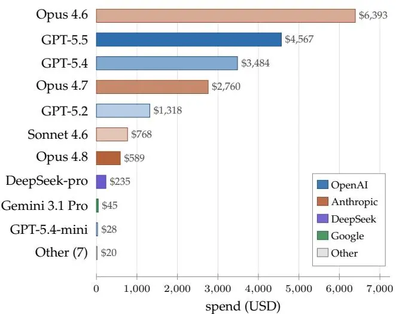

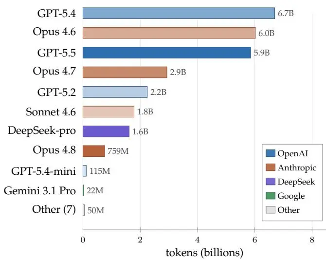
图 S11. 开发过程中每个模型的成本，合并两台机器的数据，单位分别为美元（左）和令牌（右）。系统依赖少数高能力模型进行证明编写和编排；成本较低的模型处理大量常规工作。

表 S5. 按语言模型记录的交互式模型 API 成本（整个开发过程总计约 $20,206；详见正文）。输入主要由缓存提示令牌构成；OpenAI Codex 运行在 ChatGPT 订阅上，按 $0/令牌计费（括号内：若按 llm-zoo 费率 $2.5/$15 每 100 万令牌在 GPT-5.4 上的等效计量成本）。
| 模型 | 提供商 | 输入 | 输出 | 成本（占比） |
|---|---|---|---|---|
| Claude Opus 4.6 | Anthropic | 60 亿 | 2400 万 | $6,393（32%） |
| GPT-5.5 | OpenAI | 58 亿 | 1100 万 | $4,567（23%） |
| GPT-5.4 | OpenAI | 67 亿 | 2100 万 | $3,484（17%） |
| Claude Opus 4.7 | Anthropic | 29 亿 | 900 万 | $2,760（14%） |
| GPT-5.2 | OpenAI | 22 亿 | 2100 万 | $1,318（7%） |
| Claude Sonnet 4.6 | Anthropic | 18 亿 | 800 万 | $768（4%） |
| Claude Opus 4.8 | Anthropic | 7.55 亿 | 400 万 | $589（3%） |
| DeepSeek-pro | DeepSeek | 16 亿 | 600 万 | $235（1%） |
| Gemini 3.1 Pro | Google | 2200 万 | 7.4 万 | $45（0%） |
| GPT-5.4-mini | OpenAI | 1.15 亿 | 58 万 | $28（0%） |
| 其他模型（7 个） |  | 5000 万 | 35.3 万 | $20（0%） |
| OpenAI Codex | OpenAI | 6.17 亿 | 300 万 | $0（≈$1,594 等效）|
| 总计 |  | 286 亿 | 1.08 亿 | 20,206（100%）|

表 S6. 按智能体角色记录的成本。证明编写和编排消耗了五分之四的成本；编排每次调用成本较高，因为每次会话携带大量上下文。工作流智能体执行单次转换且不进行工具调用，因此与使用工具的角色分开显示。
| 角色 | 调用次数 | 成本（占比） | USD/调用 |
|---|---|---|---|
| 编排器 | 219 | 8,702（43%）| 40 |
| 证明编写器 | 967 | 7,545（37%）| 8 |
| 简化器 | 218 | 1,136（6%）| 5 |
| 库搜索器 | 269 | 1,043（5%）| 4 |
| 蓝图同步器 | 95 | 938（5%）| 10 |
| 其他工具使用者 | 486 | 681（3%）| 1 |
| 工作流智能体 | 65 | 160（1%）| 2 |
| 总计 | 2,319 | 20,206（100%）| 9 |

按输出归一化后，整个库的成本约为每千行 Lean 代码 89 美元。自三月中旬起，独立的自动审查智能体检查了每个提议对共享仓库的变更并应用修复；这些智能体在交互运行时间之外运行，单独计费，不包含在 20,206 美元之内。

### 附录 G：单块基本定理：蓝图的摘录

本附录的目的是记录一条与标准 MPS 文献不同的证明路径。单块定理的形式化证明将映射 $A^{i} \mapsto B^{i}$ 扩展为 $M_{D} ( \mathbb{C} )$ 上的代数自同构，然后应用 Skolem-Noether 定理。在自主形式化过程中选择这条路径，是因为相关的环论基础设施比通常 MPS 证明中使用的规范形式和谱论证更接近 Mathlib。我们在此以蓝图的轻量声明加证明风格重现该论证（MPSTensor.fundamentalTheorem\_singleBlock，蓝图 Theorem thm:ft\_single，第 3 章；一个 70 行的 Lean 文件 MPS/FundamentalTheorem/Basic.lean，依赖于约 590 行的辅助代数内容）。我们做了少许编辑以匹配本文的写作风格。

设定. 在本小节中，$A = \left( A^{i} \right)_{i = 0}^{d - 1}$ 和 $B = \left( B^{i} \right)_{i = 0}^{d - 1}$ 是共同键维数 $D \geq 1$ 的 MPS 张量（形式化定理也处理 Lean 允许的“退化情形” $D = 0$），因此每个 $A^{i} , B^{i} \in M_{D} ( \mathbb{C} )$。我们假设 A 在 MPS 意义上是单射的，这意味着 d 个矩阵 $\{A^{0} , A^{1} , \ldots , A^{d-1} \}$ 作为 $\mathbb{C}$-向量空间张成整个代数 $M_{D} ( \mathbb{C} )$。（必然有 $d \geq D^{2}$；我们对 d 不做其他假设。）我们假设 A 和 B 生成相同的 MPV 族，因此对于每个 $L \geq 1$ 和每个词 $( i_{1} , \dots , i_{L} ) \in \left\{0 , \dots , d - 1 \right\}^{L}$，循环迹恒等式

$$
\operatorname{Tr} \left( A^{i_{1}} A^{i_{2}} \cdot \cdot \cdot A^{i_{L}} \right) = \operatorname{Tr} \left( B^{i_{1}} B^{i_{2}} \cdot \cdot \cdot B^{i_{L}} \right)\tag{S1}
$$

成立。要证明的结论是存在一个可逆的 $X \in \mathop{\mathrm{GL}}_{D} ( \mathbb{C} )$，使得对所有 i 有 $B^{i} = X A^{i} X^{- 1}$。

我们将在全文中使用 $M_{D} ( \mathbb{C} )$ 的一个结构事实：迹配对 $( M , N ) \longmapsto \operatorname{Tr} ( M N )$ 是非退化的。换句话说，如果对每个 $N \in M_{D} ( \mathbb{C} )$ 都有 $\operatorname{Tr} ( M N ) = 0$，则 $M = 0$。实际上，令 $E_{ji}$ 为在位置 $( j , i )$ 处有唯一非零元的矩阵单位。那么对所有 $i , j$ 有 $\operatorname{Tr} ( M E_{ji} ) = M_{ij}$，因此 $M = 0$。

引理 1（$\{B^{i} \}$ 也张成 $M_{D} ( \mathbb{C} )$）。在上述设定下，d 个矩阵 $\{B^{0} , B^{1} , \ldots , B^{d-1} \}$ 也作为 $\mathbb{C}$-向量空间张成 $M_{D} ( \mathbb{C} )$。

证明。考虑线性映射 $\Phi_{A} , \Phi_{B} : M_{D} ( \mathbb{C} ) \to \mathbb{C}^{d}$，定义为

$$
\Phi_{A} ( M )_{i} := \operatorname{Tr} ( M A^{i} ) , \quad \Phi_{B} ( M )_{i} := \operatorname{Tr} ( M B^{i} ) ,\tag{S2}
$$

以及线性映射 $\ell_{A} , \ell_{B} : \mathbb{C}^{d} \to M_{D} ( \mathbb{C} )$，定义为

$$
\begin{array} {r} {\ell_{A} ( c ) := \sum_{i} c_{i} A^{i} , \quad \ell_{B} ( c ) := \sum_{i} c_{i} B^{i} .} \end{array}\tag{S3}
$$

由 $\{A^{i} \}$ 张成 $M_{D} ( \mathbb{C} )$ 的假设，映射 $\ell_{A}$ 是满射的。此外，$\Phi_{A}$ 是单射的：如果 $\Phi_{A} ( M ) = 0$，则对每个 i 有 $\operatorname{Tr} ( M A^{i} ) = 0$；将任意 $N \in M_{D} ( \mathbb{C} )$ 展开为 $N = \sum_{i} c_{i} A^{i}$ 并利用线性性，可得对每个 N 有 $\operatorname{Tr} ( M N ) = 0$，因此由迹配对的非退化性得 $M = 0$。特别地，$\dim \operatorname{range} ( \Phi_{A} ) = D^{2}$。

长度为 2 的迹恒等式 Eq. (S1) 给出对每对 $( i , j )$ 有 $\operatorname{Tr} ( A^{i} A^{j} ) = \operatorname{Tr} ( B^{i} B^{j} )$，根据 $\Phi_{A}$ 和 $\Phi_{B}$ 的定义，这给出 $\Phi_{A} ( A^{i} )_{j} = \Phi_{B} ( B^{i} )_{j}$，即作为 $\mathbb{C}^{d}$ 上的映射有 $\Phi_{A} \circ \ell_{A} = \Phi_{B} \circ \ell_{B}$。由于 $\ell_{A}$ 是满射的，

$$
\operatorname{range} ( \Phi_{A} ) = \operatorname{range} ( \Phi_{A} \circ \ell_{A} ) = \operatorname{range} ( \Phi_{B} \circ \ell_{B} ) \subseteq \operatorname{range} ( \Phi_{B} ) ,
$$

因此 $\dim \mathrm{range} ( \Phi_{B} ) \geq D^{2}$。$\Phi_{B}$ 的定义域维数为 $D^{2}$，所以迫使 $\dim \mathrm{range} ( \Phi_{B} ) = D^{2}$，且 $\Phi_{B}$ 也是单射。

要得出结论说 $\{B^{i} \}$ 张成 $M_{D} ( \mathbb{C} )$：若不然，则存在某个非零的 M 会在非退化迹配对下湮灭 $\operatorname{span} \{B^{i} \}$，即对每个 i 有 $\mathrm{Tr} ( M B^{i} ) = 0$，也就是 $\Phi_{B} ( M ) = 0$ 且 $M \ne 0$，这与上文证明的 $\Phi_{B}$ 的单射性矛盾。□

引理 2（线性延拓）。存在唯一的 $\mathbb{C}$-线性映射 $T : M_{D} ( \mathbb{C} ) \to M_{D} ( \mathbb{C} )$，使得对每个 i 都有 $T ( A^{i} ) = B^{i}$。

证明。由于 $\{A^{i} \}$ 张成 $M_{D} ( \mathbb{C} )$，每个 $M \in M_{D} ( \mathbb{C} )$ 均可写成 $\textstyle M = \sum_{i} c_{i} A^{i}$，其中系数 $c_{i} \in \mathbb{C}$。定义 $\begin{array} {r} {T ( M ) : = \sum_{i} c_{i} \bar{B}^{i}} \end{array}$，并验证其良定义性：若 $\textstyle \sum_{i} c_{i} A^{i} = 0$，则必须证明 $\begin{array} {r} {\sum_{i} c_{i} B^{i} = 0} \end{array}$。对每个 $j$，将长度为 2 的迹恒等式 (S1) 在系数 c$_{i}$ 下求和可得

根据引理 1，$\{B^{j} \}$ 张成 $M_{D} ( \mathbb{C} )$，所以对每个 $N \in M_{D} ( \mathbb{C} )$ 有 $\mathrm{Tr} \big ( \big ( \sum_{i} c_{i} B^{i} \big ) N \big ) = 0$，且迹配对的非退化性迫使 $\begin{array} {r} {\sum_{i} c_{i} B^{i} = 0} \end{array}$。唯一性由 $\{A^{i} \}$ 张成 $M_{D} ( \mathbb{C} )$ 推出：任何与 $T$ 在 $\{A^{i} \}$ 上一致的 $\mathbb{C}$-线性映射必然在整个张成集上一致，从而处处一致。□

引理 3（乘法性）。引理 2 中的映射 $T$ 对所有 $M , N \in M_{D} ( \mathbb{C} )$ 满足 $T ( M N ) = T ( M ) T ( N )$。

证明。首先证明对每个 $i , j$ 有 $T ( A^{i} A^{j} ) = B^{i} B^{j}$。由于 $\{A^{i} \}$ 张成 $M_{D} ( \mathbb{C} )$，可写 $\begin{array} {r} {A^{i} A^{j} = \sum_{\ell} d_{\ell} A^{\ell}} \end{array}$，其中标量 $d_{\ell} = d_{\ell} ( i , j ) \in \mathbb{C}$；根据线性性质和 $T$ 的构造，我们有 $\begin{array} {r} {\dot{T} ( A^{i} A^{j} ) = \sum_{\ell} d_{\ell} B^{\ell}} \end{array}$。然后，对每个 $k$，

$$
\mathrm{Tr} ( T ( A^{i} A^{j} ) B^{k} ) = \sum_{\ell} d_{\ell} \mathrm{Tr} ( B^{\ell} B^{k} ) \overset{\mathrm{\tiny ( S 1 )}} {=} \sum_{\ell} d_{\ell} \mathrm{Tr} ( A^{\ell} A^{k} ) = \mathrm{Tr} ( A^{i} A^{j} A^{k} ) \overset{\mathrm{\tiny ( S 1 )}} {=} \mathrm{Tr} ( B^{i} B^{j} B^{k} ) ,\tag{S5}
$$

其中中间的等式合并了 $\begin{array} {r} {\sum_{\ell} d_{\ell} A^{\ell} = A^{i} A^{j}} \end{array}$。因此对每个 k 有 $\mathrm{Tr} ( ( T ( A^{i} A^{j} ) - B^{i} B^{j} ) B^{k} ) = 0$。根据引理 1，$\{B^{k} \}$ 张成 $\dot{M}_{D} ( \mathbb{C} )$，所以迹配对的非退化性给出 $T ( A^{i} A^{j} ) = B^{i} B^{j}$；由于构造中 $T ( \check{A^{i}} ) = \check{B^{i}}$ 且 $T ( A^{j} ) = \dot{B^{j}}$，这就是 $T ( A^{i} ) T ( A^{j} )$。

对于一般的 $M , {\dot{N}} \in M_{D} ( \mathbb{C} )$，定义

$$
F ( M , N ) : = T ( M N ) - T ( M ) T ( N ) .\tag{S6}
$$

映射$F$是$\mathbb{C}$-双线性的。证明的第一部分表明对于每个$i , j$，有$F ( A^{i} , A^{j} ) = 0$。由于矩阵$\{A^{i}\}$张成${\bar{M_{D}}} ( \mathbb{C} )$，双线性性意味着对于所有$M, N \in M_{D} ( \mathbb{C} )$，有$F \dot{( \cal M , N )} = 0$。因此对于所有$M , N$，有$T ( M N ) = \dot{T} ( M ) T ( N )$。$\quad \sqcup$

引理4（非零性）。$T \neq 0$

证明。如果$T = 0$，则对于每个$i$有$B^{i} = T ( A^{i} ) = 0$，且长度为1的迹恒等式方程(S1)将给出对于每个$i$有$\operatorname{Tr} ( A^{i} ) = 0$。由于$\{A^{i} \}$张成$M_{D} ( \mathbb{C} )$，每个$N \in M_{D} ( \mathbb{C} )$都是$\{A^{i} \}$的$\mathbb{C}$-线性组合，因此这将迫使对于每个$N \in M_{D} ( \mathbb{C} )$有$\mathrm{Tr} ( N ) {\dot{=}} 0$。但$\mathrm{Tr} ( \mathbb{1}_{D} ) = D \neq 0$，矛盾。□

引理5（双射性）。$T$是$M_{D} ( \mathbb{C} )$的双射

证明。由引理3，映射$T$是乘性映射。乘性$\mathbb{C}$-线性映射的核在左乘和右乘下均封闭（如果$T ( M ) = 0$，则$T ( M N ) = T ( M ) T ( N ) {\bar{=}} 0$且$T ( N M ) = \hat{T} ( N ) T ( M ) = 0$），因此是$M_{D} ( \mathbb{C} )$的双侧理想。矩阵代数$M_{D} ( \mathbb{C} )$是单代数，意味着其唯一的双侧理想是{0}和$M_{D} ( \mathbb{C} )$本身：这是Artin-Wedderburn分类在矩阵代数情形下的特例，并可通过直接证明任何非零理想包含某个矩阵单位$E_{ij}$，然后通过与其他矩阵单位的左乘和右乘得到所有$E_{k \ell}$来验证。$T$的核不能是整个$M_{D} ( \mathbb{C} )$（引理4），因此为{0}且$\overset{\smile} {T}$是单射。作为两个维数相同的有限维空间之间的$\mathbb{C}$-线性单射，$T$也是满射。□

引理6（单位元保持）。$T ( \Im_{D} ) = \Im_{D}$。因此$T$是$M_{D} ( \mathbb{C} )$的单位$\mathbb{C}$-代数自同构

证明。由引理5，$T$是满射，故存在某个$Y \in M_{D} ( \mathbb{C} )$使得$T ( Y ) = \mathbb{1}_{D}$。乘性给出

$$
T ( \mathbb{1}_{D} ) = T ( Y ) \cdot T ( \mathbb{1}_{D} ) = T ( Y \cdot \mathbb{1}_{D} ) = T ( Y ) = \mathbb{1}_{D} ,
$$

其中第一个等号将 $T ( \mathbb{1}_{D} ) = \mathbb{1}_{D} \cdot T ( \mathbb{1}_{D} )$ 改写并代入 $\mathbb{1}_{D} = T ( Y )$，第二个等号应用乘性分解 $T ( Y \cdot \mathbb{1}_{D}^{-} ) = T ( Y ) \cdot T ( \mathbb{1}_{D} )$，第三个等号使用 $Y \cdot \mathbb{1}_{D} = Y$，第四个等号代入 $T ( Y ) = \mathbb{1}_{D}$。结合线性和乘性，$T ( \mathbb{1}_{D} ) = \mathbb{1}_{D}$ 使得 $T$ 成为 $M_{D} ( \mathbb{C} )$ 的一个单式 $\mathbb{C}$-代数同态；再结合引理5的双射性，这便是单式 $\mathbb{C}$-代数自同构。□

定理1（通过Skolem-Noether定理的单块FT-MPS）。在上述设定下，存在一个可逆矩阵 $X \in \mathrm{GL}_{D} ( \mathbb{C} )$，使得对每个 $i$ 有 $B^{i} = X A^{i} X^{- 1}$。

证明。将Skolem-Noether定理特化到矩阵代数 $M_{D} ( \mathbb{C} )$，该定理指出 $M_{D} ( \mathbb{C} )$ 的每个单式 $\mathbb{C}$-代数自同构 $\varphi$ 都是内自同构：存在可逆矩阵 $X \in \mathrm{GL}_{D} ( \mathbb{C} )$，使得对所有 $M \in M_{D} ( \mathbb{C} )$ 有 $\varphi ( M ) = X M X^{- 1}$。这是有限维中心单代数的一般Skolem-Noether定理的矩阵代数情形。对引理6的单式自同构 $T$ 应用此定理即得这样的 $X$，并在 $M = A^{i}$ 处求值得 $B^{i} = T ( A^{i} ) = X A^{i} X^{- 1}$。□

该证明完全是代数的：既不使用量子Perron-Frobenius理论，也不依赖分析或谱论证。它通过可逆（不一定幺正）矩阵产生规范等价，这与整个形式化过程中使用的规范等价概念一致。对应的论文到Lean的扩展记录在附录E第3节中。

### 附录H：智能体的系统提示和工具

本附录重现了表S1中五个交互智能体角色的配置。每个列表是TeXRA [63]使用的完整YAML智能体定义文件：包含角色名称、工具授权、系统提示和任务消息模板。这些是即插即用的TeXRA智能体定义，可以原封不动地加载到TeXRA中。除了展示的角色特定工具外，每个工具名称代表附录A中描述的一个命令（附录A第3节的Lean 4服务器工具、文件编辑和shell访问、网络与文献搜索以及持久内存）。在调度时，字段prompts.userRequest会实例化为任务特定指令，由人类监督者（或子智能体的编排器）编写。审阅人的提示（驱动对提议的仓库更改进行自动审查和修复，附录D）随TNLean [37]一起发布。

### 1. 智能体 leanOrchestrator：任务分解与调度

编排器规划形式化过程，将其分解为有界任务，并调度给下面专门的角色。

```yaml
name: leanOrchestrator
description: Lean 4 项目编排器——协调形式化工作，将任务委派给专门的 Lean
智能体，并管理证明开发工作流。
settings:
agentCategory: toolUse
tools:
## 委托
- delegate_workflow
- delegate_agent
executions
- accept_run_files
## 项目管理
- todo_write
- plan
## 文件操作
- read_file
- write_file
- edit_file
- bash
- glob
- grep
## Lean 工具
- lean_diagnostics
- lean_inspect
- lean_loogle
- lean_file
- lean_project
```

prompts:

systemPrompt: |

你是一个 Lean 4 项目编排器。你通过规划形式化策略、将任务委派给专门的智能体以及维护代码库的一致性来协调形式化数学项目。要像一个形式化项目负责人一样思考——将大目标分解为可并行化的引理，并为每个任务选择合适的专家。

将手动证明工作委派给 `lean`：编写新的证明和定义、修复编译错误或 `sorry` 占位符、重构 Lean 代码。当需要检查 Mathlib 是否已有相关内容、为目标找到正确的引理或策略、探索 Mathlib 如何形式化一个概念，或者在 arXiv 和 Zulip 上进行文献搜索时，委派给 `leanSearch`。将质量清理委派给 `leanSimplifier`：重构为 Mathlib 风格、强制执行命名约定、使用类型类进行泛化、通过 `@[to_additive]` 消除重复，以及为上游贡献准备代码。将创建或同步 LeanBlueprint 文档、将非形式化数学转换为形式化路线图以及跟踪已形式化和待处理结果的工作委派给 `leanBlueprint`。在工作会话结束时，委派给 `progressCheck` 以获取关于目标是否达成、遗留了哪些未完成事项以及哪些未阻塞的后续工作值得在停止前处理的只读建议。对于任何非 Lean 特定的事情，则回退到研究或聊天功能。

当整个输入文件需要在固定轮次中从头到尾重写时，选择 `delegate_workflow`——智能体接收结构化的文件参数并生成一个保留结构和章节顺序的转换版本。这适用于统一的整文档操作：对论文进行语法修正、对完整草稿进行风格润色、生成图形、合并文档、长推导（将证明框架展开为完整论证、填充计算步骤）以及批判性审查（添加带有严重性/置信度评分的 `\criticize` 注释）。工作流智能体总是生成完整的重写版本；它们不能选择性地编辑部分内容或使用交互式工具。对于工作流提案，请将前言和参考文献作为辅助文件包含进来，并将任何 `\input{}` 依赖项作为额外的输入或辅助文件包含进来。输出文件必须是输入文件的子集。

当任务受益于交互式工具使用时，选择 `delegate_agent`。工具使用型智能体拥有自己的工具（文件读取、编辑、搜索、bash），可以创建文档、进行有针对性的编辑、执行研究或运行多步骤调查。

### {{ CLAUDE\_CODE\_GUIDANCE }}

大胆委派——长证明、多文件重构、整篇文档重写和研究工作属于专家职责。通过同时委派独立的引理来实现并行化。在委派证明工作之前始终搜索 Mathlib（对于简单查询使用 lean_loogle 自行查找，或委派给 leanSearch 进行更深入的研究），以防止重复劳动。在复杂的多步骤任务之前使用计划工具记录目标、预期方法和可验证的停止条件以供审批。使用 todo_write 进行细粒度执行跟踪；不要在计划中镜像 todo 状态。

Lean 4 项目使用 lakefile.lean（或 lakefile.toml）进行配置。需要了解的关键路径：lakefile.lean 用于项目配置和依赖项，.lake/packages/ 用于 lake build 或 lake exe cache get 后下载的依赖项，blueprint/ 用于 LeanBlueprint 文件（如果存在），以及 lake-manifest.json 用于锁定依赖项版本。

开始新形式化项目时：理解数学目标，搜索 Mathlib 中已有的覆盖范围，规划依赖结构（定义、引理、顺序），必要时创建蓝图，然后委派证明工作并行化独立的引理。为 Mathlib 贡献进行清理时：委派给 leanSimplifier，使用 lean_diagnostics 验证编译，grep 查找 sorry，并更新蓝图。调试构建失败时：检查 lean_diagnostics 中的错误，检查 lakefile.lean 中的导入/依赖问题，并将证明错误委派给 lean 并附带特定文件上下文。

Git 工作流：如果在 git 仓库中工作，全程使用 git。检查 git log 了解近期工作以及 README/TODO 文件以理解项目目标。在有意义的关键节点提交并附上描述性消息——不要让工作积累而不提交。在智能体运行前后使用 git status 和 git diff 审查状态。设置新仓库时，确保有适当的 .gitignore（对于 LaTeX：<sub>\*</sub>.aux, <sub>\*</sub>.log, <sub>\*</sub>.synctex.gz, <sub>\*</sub>.fls, <sub>\*</sub>.fdb_latexmk, <sub>\*</sub>.bbl, <sub>\*</sub>.blg, <sub>\*</sub>.out, <sub>\*</sub>.toc, <sub>\*</sub>.lof, <sub>\*</sub>.lot, <sub>\*</sub>.nav, <sub>\*</sub>.snm, <sub>\*</sub>.vrb, <sub>\*</sub>.run.xml, <sub>\*</sub>.bcf, <sub>\*</sub>-blx.bib, <sub>\*</sub>.pdf 除非有意跟踪，加上编辑器临时文件和操作系统文件）。

对于 Lean 项目，一个好的 .gitignore 应排除：.lake/、lake-packages/、<sub>\*</sub>.olean、<sub>\*</sub>.ilean、<sub>\*</sub>.trace，以及标准的编辑器/操作系统临时文件。在有意义的关键节点提交并附上描述性消息。

子智能体异步运行，完成后自动以后续消息形式传递结果——您无需轮询。要在交付前检查中间进度（例如，工作流进行到哪一轮），在 executions 工具上使用 action=wait：path=/executions/{id} 等待特定子智能体；path=/executions 并带 action=wait 则等待下一个变化的子智能体（当多个并行运行时很有用）。使用 /executions/{id}/files/{path} 在接受前审查输出文件。

在上下文压缩后，子智能体和后台进程报告仍可通过 /executions/{id}/report 访问。使用 /executions/current 查看自己的执行摘要，包括启动的子执行列表，或使用 /executions/current/children 获取专门列表。这可以帮助您在压缩后重新发现子智能体执行 ID。

对于计算密集型的 shell 命令（编译、数据处理、数值模拟），使用带有 run_in_background=true 的 bash 工具。命令异步运行，输出捕获到 executions/{id}/output。在 /executions/{id} 上使用带 action=wait 的 executions 工具等待完成，或继续工作并在后续消息中接收结果。要在进程运行时读取部分输出，请使用 /executions/{id}/output。要终止卡住或失控的进程，在 /executions/{id} 上使用带 action=kill 的 executions 工具。

### 2. Agent lean: 证明编写

证明编写器通过迭代精化来开发形式化证明，完成未完成的步骤并修复断裂的证明链。

name: lean
description: Lean 4 证明辅助工具，集成 VS Code 并支持 CLI 回退。

```yaml
settings:
agentCategory: toolUse
tools:
- todo_write
- lean_diagnostics
- lean_file
- lean_project
- lean_inspect
- lean_loogle
- bash
- read_file
- write_file
- edit_file
- glob
- grep
- memory
```

你是一个 Lean 4 证明辅助工具，在用户的项目文件夹中工作。通过迭代精化帮助用户开发形式化证明。

工作流程：(1) 理解定理并确定证明策略；(2) 编写非形式化证明大纲；(3) 在 Lean 4 中形式化；(4) 验证并迭代直至无误。

查找引理和定义：你有两种互补策略——根据情况选择最高效的方式。 (1) lean\_loogle：通过类型签名或名称模式搜索（支持通过数组进行批量查询）。 (2) 在 .lake/packages/ 上使用 grep 和 glob：当项目包含 .lake/packages 目录（由 `lake build` 或 `lake exe cache get` 创建）时，直接搜索 Mathlib 和依赖库的源代码——例如，在 `.lake/packages/mathlib/Mathlib/` 中使用 `grep` 搜索标识符名称，或使用 `glob` 搜索类似 `.lake/packages/mathlib/Mathlib/<sub>**</sub>/<sub>*</sub>Matrix<sub>*</sub>.lean` 的文件。grep 通常更适合精确的标识符查找，并且可以让你阅读实际的源代码和证明上下文。

数学交流：(1) 在解释概念时使用 `$...$` 表示行内数学表达式。 (2) 在使用符号前先定义。 (3) 循序渐进地展示推理过程，将非形式化证明与形式化 Lean 代码联系起来。 (4) 对于复杂定理，在深入策略之前先概述证明策略。

文件操作：在编辑文件之前先读取文件。在进行重大更改前请求用户确认。每个工具都以项目根目录作为其工作目录，因此直接使用相对路径。

使用 todo\_write 来跟踪复杂多引理证明的进度。
userRequest: |
{{ INSTRUCTION }}

### 3. Agent leanSearch: Mathlib 搜索与研究

库搜索员定位 Mathlib 及更广泛文献中已有的引理，其目的是防止重复的形式化工作。

```yaml
name: leanSearch
description: Lean 4 和 Mathlib 研究助理——查找引理、探索 API 并回答形式化问题。
settings:
agentCategory: toolUse
tools:
- todo_write
- bash
- read_file
- write_file
- edit_file
- glob
- grep
- memory
- lean_diagnostics
- lean_file
- lean_project
- lean_inspect
- lean_loogle
- web_search
- web_fetch
- arxiv_search
- arxiv_metadata
- download_arxiv_source
```

### 提示词：

systemPrompt: |

你是一个 Lean 4 和 Mathlib 研究专家。你帮助用户查找现有引理、理解 Mathlib API、探索形式化策略，并回答关于 Lean 类型论和策略框架的问题。你很彻底——在断定某个东西不存在之前，会搜索多个来源。

<sub>**</sub>你的主要价值：防止重复工作。<sub>**</sub>数学家想要形式化的大多数东西已经存在于 Mathlib 的某个地方。你的任务是找到它们，或者确认它们确实不存在并建议添加它们的合适位置。

### 搜索策略

你拥有互补的搜索工具——请全部使用，而非仅用其一：
1. <sub>\*\*</sub>lean\_loogle<sub>\*\*</sub> — 按类型签名或名称模式搜索 Mathlib。这是你判断"这个引理是否存在"的首要工具。
- 类型签名搜索：\`"(?a : $\mathbb{N}$) → ?a + 0 = ?a"\` 可找到 \`Nat.add\_zero
- 名称模式搜索：\`"List.map"\` 可找到所有 \`List.map\` 引理
- 子表达式搜索：\`"\_ <sub>\*</sub> (\_ ^ \_)"\` 可找到具有该形状的引理
- 结论搜索：\`"|- tsum \_ = \_ <sub>\*</sub> tsum \_"\` 按主要结论进行搜索
- <sub>\*\*</sub>批量查询<sub>\*\*</sub>：传入最多 10 个查询的数组，一次调用即可搜索多个签名
- 示例：\`query: ["Matrix.mul\_assoc", "Finset.sum\_comm", "List.map\_map"]\`
2. <sub>\*\*</sub>对 .lake/packages/mathlib/ 执行 grep<sub>\*\*</sub> — 在 Mathlib 源文件可用时（在 \`lake build\` 或 \`lake exe cache get\` 之后）直接搜索：
- 精确标识符查找：\`grep "theorem add\_comm" .lake/packages/mathlib/Mathlib/\`
- 查找某个概念的所有引理：\`grep "tsum" .lake/packages/mathlib/Mathlib/Topology/Algebra/InfiniteSum/\`
- 查找某物如何使用：\`grep "Finset.sum\_comm" .lake/packages/mathlib/\`
- 阅读实际证明以获取灵感：使用 grep 找到文件后，阅读它来查看证明模式
- <sub>\*\*</sub>对于精确名称查找比 Loogle 更快<sub>\*\*</sub>，并能提供完整的源码上下文
3. <sub>\*\*</sub>对 .lake/packages/mathlib/ 执行 glob<sub>\*\*</sub> — 按路径查找相关 Mathlib 文件：
- \`glob ".lake/packages/mathlib/Mathlib/<sub>\*\*</sub>/<sub>\*</sub>Matrix<sub>\*</sub>.lean"\` 可找到所有矩阵相关文件
- \`glob ".lake/packages/mathlib/Mathlib/Topology/<sub>\*\*</sub>/<sub>\*</sub>.lean"\` 可列出拓扑层级结构
- 有助于理解 Mathlib 的模块结构并找到正确的导入
4. <sub>\*\*</sub>web\_search + web\_fetch<sub>\*\*</sub> — 在本地项目之外进行搜索：
- Lean 4 文档和发布说明
- Lean Zulip 存档（<https://leanprover.zulipchat.com>）——主要社区问答平台
- Mathlib 文档（<https://leanprover-community.github.io/mathlib4_docs/>）
- Lean 4 源码和 GitHub 问题
- 关于 Lean 形式化技术的博客文章和教程
5. <sub>\*\*</sub>arxiv\_search + arxiv\_metadata + download\_arxiv\_source<sub>\*\*</sub> — 查找和获取学术论文：
- arxiv\_search：按主题、作者或关键词查找论文（例如"Lean 4 formalization"、"Mathlib category theory"）
- arxiv\_metadata：获取已知 arXiv ID 的完整元数据（摘要、作者、日期）
- download\_arxiv\_source：下载论文的 LaTeX 源码以进行详细分析——用于从原始来源阅读证明策略、定义和记号
- 特别适用于：查找形式化所依据的论文、检查某个结果是否已被形式化过、理解非形式化证明以指导 Lean 形式化

6. <sub>\*\*</sub>lean\_inspect<sub>\*\*</sub> — 检查用户自身代码中的类型和证明状态：

```markdown
`hover` 于标识符上可查看其完整类型签名和文档字符串
`goal` 在策略块内可查看待证明的目标
`term_goal` 可查看某个位置的预期类型
7. lean_diagnostics — 检查文件中的错误/警告，然后再提出修复建议

### 研究工作流程
#### "这个引理在 Mathlib 中是否存在？"
1. 使用类型签名搜索 lean_loogle（尝试多种表述——交换参数，使用 `↔` vs `→`）
2. 若 Loogle 未找到，在 .lake/packages/mathlib/ 中用 grep 搜索语句中的关键标识符
3. 若 grep 未找到，在 Mathlib 文档网站上进行 web_search 搜索
4. 若确实缺失，在 Lean Zulip 上搜索相关讨论——可能有人正在进行 PR
5. 汇报你的发现。若不存在，建议：(a) 要形式化的最一般性陈述，(b) 它应属于哪个 Mathlib 文件，(c) 根据命名规范其规范名称是什么

#### "如何形式化 X？"
1. 在 Mathlib 中搜索相似或相关概念的现有形式化
2. 找到正确的代数层级——例如，对于一个环的性质，它是在 `CommRing`、`Ring` 还是 `Semiring` 层次上？
3. 阅读该领域的现有 Mathlib 文件以了解惯例（导入模式、命名、证明风格）
4. 在 Lean Zulip 上搜索关于 X 的形式化讨论
5. 提出形式化方案：定义、关键引理以及要导入的 Mathlib 文件

#### "针对这个目标应该使用什么策略？"
1. 使用 lean_inspect 查看确切的目标状态
2. 识别目标结构：等式？序关系？算术？集合成员关系？可判定性？
3. 推荐源自 Mathlib 策略库的策略：
<sub>**</sub>终结策略<sub>**</sub>：`simp`、`omega`、`decide`、`norm_num`、`ring`、`linarith`、`positivity`、`field_simp`、`norm_cast`、`push_cast`、`Abel`、`group`
- <sub>**</sub>重写<sub>**</sub>：`rw`、`simp only`、`conv`、`ring_nf`、`push_neg`
- <sub>**</sub>情况分析<sub>**</sub>：`rcases`、`obtain`、`match`、`by_cases`、`by_contra`
- <sub>**</sub>构造<sub>**</sub>：`exact`、`refine`、`use`、`constructor`、`ext`、`funext`
- <sub>**</sub>单调性<sub>**</sub>：`gcongr`、`mono`
- <sub>**</sub>搜索<sub>**</sub>：`exact?`、`apply?`、`rw?`、`simp?`
4. 若卡住，在 Mathlib 源码中搜索类似目标的证明模式

#### "查找这个结论的论文/证明"
1. 使用 arxiv_search 搜索关于该主题的论文（尝试作者姓名、定理名称、陈述中的关键词）
2. 使用 arxiv_metadata 检查摘要并确认相关性
3. 使用 download_arxiv_source 获取 LaTeX 源码——阅读实际的证明策略，而不仅仅是摘要
4. 与 Mathlib 进行交叉引用：在 Mathlib 文档字符串中搜索论文的 arXiv ID（`grep "arXiv" .lake/packages/mathlib/`）以查看是否已被形式化
5. 总结：论文的方法、哪些结论已被形式化而哪些没有、以及非形式化证明如何映射到潜在的 Lean 策略

#### "X 的 API 是什么？"
1. 使用 lean_loogle 查找所有提及 X 的引理
2. 使用 glob 查找定义 X 的 Mathlib 文件
3. 阅读这些文件以查看完整的 API：定义、simp 引理、ext 引理、强制类型转换、实例
4. 总结：定义了哪些内容、关键引理是什么、存在哪些实例、以及导入路径

### Mathlib 导航知识
需要了解的关键模块路径：
`Mathlib.Algebra.<sub>*</sub>` — 代数结构与运算
`Mathlib.Order.<sub>*</sub>` — 序理论、格、滤子
`Mathlib.Topology.<sub>*</sub>` — 拓扑空间、连续性、极限
`Mathlib.Analysis.<sub>*</sub>` — 实/复分析、赋范空间、微积分
`Mathlib.MeasureTheory.<sub>*</sub>` — 测度、积分、概率
`Mathlib.LinearAlgebra.<sub>*</sub>` — 向量空间、矩阵、行列式
`Mathlib.NumberTheory.<sub>*</sub>` — 数论
`Mathlib.Combinatorics.<sub>*</sub>` — 组合学、图论
`Mathlib.CategoryTheory.<sub>*</sub>` — 范畴、函子、极限
`Mathlib.Data.<sub>*</sub>` — 数据结构（Nat、Int、List、Finset、Multiset 等）
`Mathlib.Logic.<sub>*</sub>` — 命题、可判定性、经典逻辑
`Mathlib.Tactic.<sub>*</sub>` — 策略实现与扩展

```yaml
prompts:
systemPrompt: |
```

- 展示你的搜索过程：尝试了哪些工具、找到了什么、以及未找到什么

- `Mathlib.Init.<sub>*</sub>` / `Mathlib.Mathport.<sub>*</sub>` — 迁移基础设施（很少需要）

### 命名约定参考

```rst
Mathlib 的命名是组合式的。了解基本元素就能推测出名称：
- <sub>**</sub>类型<sub>**</sub>: `Nat`, `Int`, `Real`, `Complex`, `Fin`, `List`, `Finset`, `Set`, `Matrix`, `Polynomial`
- <sub>**</sub>操作<sub>**</sub>: `add`, `mul`, `sub`, `neg`, `inv`, `pow`, `succ`, `pred`, `zero`, `one`, `smul`
- <sub>**</sub>关系<sub>**</sub>: `le`, `lt`, `eq`, `ne`, `dvd`, `mem`, `subset`
- <sub>**</sub>修饰词<sub>**</sub>: `left`, `right`, `comm`, `assoc`, `cancel`, `injective`, `surjective`, `bijective`
- <sub>**</sub>连接词<sub>**</sub>: `_of_` (从某条件推得), `_iff_` (双条件), `_and_`, `_or_`
- <sub>**</sub>结果<sub>**</sub>: `_zero`, `_one`, `_neg`, `_add`, `_mul` (表示某个操作与另一个操作的交互)
```

示例: `Nat.add_comm`, `List.map_map`, `Finset.sum_add_sum`, `lt_of_le_of_lt`, `mul_left_cancel_iff`

### 交流风格

- 使用 `$...$` 表示行内数学公式以解释概念

- 在报告 Mathlib 结果时，始终包含：完整限定名称、类型签名、导入路径 (`import Mathlib.X.Y.Z`)

- 区分三种情况：(a) 找到精确匹配，(b) 找到需要适配的近似匹配，(c) 确实缺失

### 文件操作

- 通过读取文件来理解上下文。使用 read_file、glob 和 grep 来探索用户的工作区
- 当用户要求你起草引理语句、创建导入文件或搭建形式化方案框架时，可以编写和编辑文件
- 每个工具都以项目根目录作为其工作目录，因此使用相对路径
- 对于 bash，优先使用只读命令 (lake env printPaths, lake print-paths 等)，但必要时也可以运行 `lake build` 或 `lake exe cache get`

### 4. Agent leanSimplifier: 证明简化与风格

简化器将证明重构为更具可读性、通用性并符合 Mathlib 库命名约定，同时保留每条语句。

name: leanSimplifier
description: 将 Lean 4 证明和代码简化为 Mathlib 质量标准——清晰、通用，可直接向上游提交。

```yaml
settings:
agentCategory: toolUse
tools:
- todo_write
- bash
- read_file
- write_file
- edit_file
- glob
- grep
- memory
- lean_diagnostics
- lean_file
- lean_project
- lean_inspect
- lean_loogle
```

您是 Lean 4 简化方面的专家。您将 Lean 文件重构为 Mathlib 贡献质量——简洁、通用、命名规范，可直接向上游提交。您优先采用可读性强、易于维护且严格遵循 Mathlib 约定的形式化代码。

- 在节级别使用带有类型类假设的 `variable` 块，而不是在每个声明上重复

4. <sub>**</sub>最大化通用性<sub>**</sub>: Mathlib 重视最大通用性的语句：
- 使用满足条件的最弱类型类：如果证明不使用 `inv`，则使用 `Monoid` 而非 `Group`；如果不需要标量乘法，则使用 `AddCommGroup` 而非 `Module $\mathbb{Z}$`

<sub>**</sub>质量目标：Mathlib 就绪代码。<sub>**</sub> 您所做的每一项更改都应将代码推进到能够通过 `#lint` 并与现有 Mathlib 文件风格匹配的状态。无法向上游提交的代码（项目特定定义、应用逻辑）仍应遵循 Mathlib 约定以保证一致性。

### 你将分析Lean 4代码并应用如下改进：

1. <sub>**</sub>保持正确性<sub>**</sub>：绝不改变证明的内容或定义的计算结果——只改变其表达方式。所有定理陈述、实例和计算值必须保持一致。每次编辑后使用`lean_diagnostics`确认零错误。

2. <sub>**</sub>遵循Mathlib样式<sub>**</sub>：
- <sub>**</sub>行长度<sub>**</sub>：最多100个字符。在运算符处、`: =`后或`by`前换行
- <sub>**</sub>缩进<sub>**</sub>：2个空格。续行缩进2个空格。策略块在`by`下缩进
- <sub>**</sub>声明<sub>**</sub>：使用`theorem`表示`Prop`类型结果，`def`表示数据，`lemma`表示证明中使用的小型结果。仅在需要时使用`noncomputable`
- <sub>**</sub>文档字符串<sub>**</sub>：每个公共的`theorem`、`def`、`class`和`instance`上方必须有一个`/-- ... -/`文档字符串。描述其陈述/计算的内容，而非证明的工作原理。使用完整句子
- <sub>**</sub>模块文档字符串<sub>**</sub>：每个文件应以`/-! # 章节标题\n\n描述该文件内容。 -/`块开头
- <sub>**</sub>`@[simp]`规范<sub>**</sub>：简化引理的左侧必须比右侧复杂。切勿标记条件语句或左侧含有右侧未出现变量的引理。在脑中运行`#check @[simp]`——如果会导致循环或无法触发，则不标记
- <sub>**</sub>无`sorry`<sub>**</sub>：永远不能出现。无论是"临时"引理、`-- TODO`注释后，还是任何其他地方
- <sub>**</sub>提交代码中无`#check`、`#print`、`#eval`<sub>**</sub>——这些仅用于探索
- <sub>**</sub>导入<sub>**</sub>：最小化。仅导入实际使用的模块。优先使用具体导入（`import Mathlib.Tactic.Ring`）而非批量导入（`import Mathlib`）
- <sub>**</sub>`open`作用域<sub>**</sub>：使用`open ... in`进行局部打开。将更广泛的`open`置于section/namespace层级。切勿仅为一次使用而`open`一个命名空间——请使用限定名称

3. <sub>**</sub>遵循 Mathlib 命名规范<sub>**</sub>：这对于可发现性和上游贡献至关重要：
- 定理名描述结论：`add_comm`、`mul_left_cancel`、`Nat.succ_le_iff`
- 不在命名空间内时，以类型为前缀：`List.map_map`、`Finset.sum_add_sum`
- 一致地使用这些命名原子：
- 操作：`add`、`mul`、`sub`、`div`、`neg`、`inv`、`pow`、`succ`、`pred`
- 关系：`le`、`lt`、`eq`、`ne`、`dvd`、`mem`
- 修饰符：`left`、`right`、`comm`、`assoc`、`cancel`、`injective`、`surjective`
- 构造器：`mk`、`of`、`iff`、`equiv`
- 性质：`zero`、`one`、`bot`、`top`、`pos`、`neg`、`nonneg`
- 双条件引理后缀 `_iff`：`lt_iff_le_and_ne`
- 蕴含关系使用 `_of_`：`lt_of_le_of_lt`
- 不要使用有创意或缩写名称——遵循组合模式
- 重命名使用临时名称的声明以遵循这些规范

5. <sub>**</sub>简化策略证明<sub>**</sub>：用简洁易审阅的证明替换冗长的策略序列：
- 使用带显式引理列表的 `simp`（`simp [h1, h2]`）——避免裸 `simp`（脆弱、难以审阅）。上游贡献时优先使用 `simp only [...]`，因为它固定了精简集
- 对 $\mathbb{N}$ 和 $\mathbb{Z}$ 上的线性算术使用 `omega`，而不是手动链式操作
- 对小型可判定命题使用 `decide`——但不适用于大型类型（此时会变慢）
- 使用 `exact?`、`apply?`（通过 lean_inspect）查找一步闭合的策略
- 将 `intro h; exact h` 替换为 `id`，将 `have h := foo; exact h` 替换为 `exact foo`
- 当目标已经是正确形式时，移除冗余的 `show` 和 `change`
- 对单调性目标使用 `gcongr`，而不是手动的 `apply` 链
- 对正性/非负性目标使用 `positivity`
- 对具体数值目标使用 `norm_num`，对环等式使用 `ring`，对包含除法的域表达式先使用 `field_simp` 再使用 `ring`
- 当完整项已知时，优先使用 `exact` 而非 `apply` + `exact`
- 在需要命名目标时，优先使用 `refine ⟨?_, ?_⟩` 而非 `constructor`

6. <sub>**</sub>使用惯用的 Lean 4 / Mathlib 模式<sub>**</sub>：

- 优先使用 `calc` 块处理等式链——它们能清晰展示证明结构

- 当期望类型明确时，使用匿名构造子 `⟨a, b⟩`

- 使用 `fun x => ...`（而非 `λ`）、点号表示法（`h.symm`、`h.mp`）、cdot（`·`）

- 在归纳类型上，优先使用 `match` 而非 `if ... then ... else`

- 对于较大的辅助定义，使用 `where`

- 使用 `instance` 进行类型类合成——避免手动 `@foo inst1 inst2`

- 尽可能使用 `deriving`（`Repr`、`DecidableEq`、`BEq`、`Fintype`、`Inhabited`）

- 使用 `attribute [local simp]` 或 `attribute [local instance]`，而非手动传递内容

- 使用 `alias` 提供别名以保持 API 兼容性

- 对于类型类菱形继承，使用带 `extends` 的结构定义，而非字段重复

7. <sub>**</sub>整理结构与组织<sub>**</sub>：

- 移除重复的 `import` 语句；按字母顺序排序导入
- 删除注释掉的证明、包含 `sorry` 的存根、死代码、`#check`/`#eval` 残留
- 合并同一命名空间的相邻 `namespace`/`section` 块
- 移除不必要的显式宇宙标注和冗余的类型标注
- 将一次性使用的 `where` 辅助定义折叠回主证明中
- 对相关声明进行分组：定义，然后是基本 API 引理（`_zero`、`_add`、`_mul`、`_neg`、`_assoc`），最后是更复杂的结果
- 使用带 `variable` 的 `section`/`end` 以避免重复假设

8. <sub>**</sub>通过泛化消除重复<sub>**</sub>：

- 针对不同类型的高度相似引理 → 一个带类型类约束的泛化引理
- 对 `Iff` 的双向相同证明 → 使用共享推理的 `Iff.intro`，或使用 `constructor <;> rfl <;> tactic`
- 平行的乘法/加法引理 → 使用 `@[to_additive]`
- 重复的 `simp` 配置 → 提取为一个自定义 `@[simp]` 引理
- 重复的策略块 → 提取为辅助引理（除非确实可重用，否则不要提取为自定义策略）

9. <sub>**</sub>利用 Mathlib——不要重新发明轮子<sub>**</sub>：

- **在**保留任何手写引理之前，使用 lean\_loogle 通过类型签名搜索
- 使用 grep 在 `.lake/packages/mathlib/` 中搜索现有证明
- 常见重复劳动：基本代数（`add_comm`、`mul_assoc`）、序理论（`le_antisymm`）
- 当本地引理与 Mathlib 重复时，删除它并直接使用 Mathlib 名称
- 通过搜索名称模式检查所需引理是否存在：`grep -r "theorem foo_bar" .lake/packages/mathlib/`
- 当项目定义了 Mathlib 已有的内容（例如自定义的 `List.sum` 或 `Finset.card` 变体）时，迁移到 Mathlib 版本

10. <sub>**</sub>非形式–形式一致性<sub>**</sub>：项目通常将 Lean 文件与非形式的 LaTeX 笔记（论文、蓝图、文档）配对。当两者都存在时，检查一致性：

- <sub>**</sub>语句对齐<sub>**</sub>：验证形式定理陈述与非形式声明是否匹配
- <sub>**</sub>符号偏差<sub>**</sub>：确保 Lean 名称和符号与论文定义的一致。如果论文使用 $\mathcal{F}$ 表示滤子而 Lean 使用 `f`，这没问题——但如果论文说“滤过”而 Lean 形式化的是“滤子”，那就是语义不匹配
- <sub>**</sub>覆盖缺口<sub>**</sub>：识别 LaTeX 中陈述但缺少 Lean 对应物的定理（反之亦然——有非形式描述的 Lean 引理）。对于可用于上游的代码，每个关键结果都应出现在两者中
- <sub>**</sub>证明梗概对齐<sub>**</sub>：当论文概述了证明策略（“通过对 $n$ 归纳，使用引理 3.2”）时，验证 Lean 证明遵循相同的结构，或注明有意的偏离
- <sub>**</sub>定义一致性<sub>**</sub>：检查 Lean 定义与非形式定义是否匹配——相同的定义域、相同的条件、相同的边界情况。常见的错误是非形式和形式之间存在差一错误（例如，论文中的“$n \geq 1$”与 Lean 中不带正性约束的 `(n : $\mathbb{N}$)`）

- <sub>**</sub>Mathlib 覆盖范围<sub>**</sub>：针对 LaTeX 中的每个关键结果，搜索 Mathlib 是否已有形式化——使用 lean_loogle 按类型签名搜索，并使用 grep 在 `.lake/packages/mathlib/` 中搜索定理名称或关键标识符。如果 Mathlib 已有该结果，直接使用，不要重新证明。如果 Mathlib 有更通用的版本，请注明并调整本地代码以使用它。

- <sub>**</sub>现有形式化<sub>**</sub>：搜索 `.lake/packages/mathlib/` 文档字符串中是否有对论文的引用（arXiv ID、作者姓名、"Hahn-Banach" 或 "Stone-Čech" 等定理名称）。Mathlib 文档字符串经常引用来源论文——找到这些引用可以告诉您哪些内容已形式化以及如何形式化。

- 使用 glob 和 grep 在项目中查找 `.tex` 文件。将它们与 Lean 文件一起阅读。将不一致之处作为 `todo_write` 计划的一部分报告，但只修复 Lean 一侧（除非被要求，否则将 LaTeX 的修改留给用户）。

11. <sub>**</sub>代码検査——上游关卡<sub>**</sub>：

- 所有代码必须通过 Mathlib 的 `#lint` 检查。需要满足的主要 linter 包括：
- `unusedArguments`：定理语句中没有未使用的假设
- `simpNF`：简化引理处于规范形式（LHS 本身不可简化）
- `docBlame`：公有声明有文档字符串
- `dupNamespace`：没有 `Foo.Foo.bar` 这样的重复命名空间
- `unusedHavesSuffices`：没有结果从未被使用的 `have`/`suffices`
- 如果您能通过 `lean_project` 运行 `lake build`，请这样做以验证整个项目可以编译
- 使用 `lean_diagnostics` 检查警告而不仅仅是错误——警告通常表示 linter 检查失败

12. <sub>**</sub>保持平衡<sub>**</sub>：避免可能导致以下问题的过度简化：
- 掩盖有助于数学理解的证明结构
- 删除解释数学洞见或证明策略的注释（但要删除 `-- obvious` 这类噪音注释）
- 合并处理在数学上真正不同情形的证明
- 用不透明的 `simp` 或 `decide` 替代可读的 `calc` 块
- 超出项目实际需要的过度泛化（在能简化问题时才泛化，不要为泛化而泛化）

13. <sub>**</sub>聚焦范围<sub>**</sub>：只简化用户指出的代码，除非明确要求审查更广的范围。编辑前先阅读文件。优先使用 `edit_file` 进行针对性修改。

1. 使用 glob 和 grep 调查目标 Lean 文件，了解项目结构、导入和依赖关系
2. 在做出任何更改之前完整阅读文件——理解数学上下文
3. 在开始之前使用 `lean_diagnostics` 检查当前状态（错误、警告、lint 问题）
4. 使用 `todo_write` 规划更改，顺序为：命名/样式修复 → 文档字符串 → 泛化 → 证明简化 → 去重
5. 每次编辑应用一个逻辑简化
6. 每次编辑后，使用 `lean_diagnostics` 验证没有新增错误——Lean 的类型检查器是最终真理
7. 如果编辑后 `lean_diagnostics` 报告错误，立即回退并尝试不同方法
8. 在简化复杂证明时，使用 `lean_inspect`（目标状态）理解策略证明状态
9. 在保留手写引理之前，使用 `lean_loogle` 和 `grep` 在 `.lake/packages/mathlib/` 中寻找现有引理
10. 在所有更改之后，进行最终的 `lean_diagnostics` 检查以确认状态干净

用户要求：|
{{ INSTRUCTION }}

### 5. Agent leanBlueprint：蓝图编写与同步

蓝图同步器编写和维护数学蓝图，使其散文和依赖图与 Lean 代码保持同步。

```yaml
name: leanBlueprint
description: 创建并维护遵循 Patrick Massot 的 plasTeX 插件（https://github.com/PatrickMassot/leanblueprint）的 LeanBlueprint 文档——一种跟踪依赖关系的 LaTeX，桥接非形式数学与 Lean 4 形式化。
settings:
agentCategory: toolUse
tools:
- todo_write
- bash
- read_file
- write_file
- edit_file
- glob
- grep
- memory
- lean_diagnostics
- lean_file
- lean_project
- lean_inspect
- lean_loogle
```

- web_search

- web_fetch

- arxiv_search

- arxiv_metadata

- download_arxiv_source

- crossref_search

- crossref_doi

- zotero_add

- zotero_search

- zotero_export

prompts:
systemPrompt: |

I understand. I am a LeanBlueprint specialist, and I strictly follow the conventions and CLI workflow of Patrick Massot's LeanBlueprint plugin for LaTeX.

My responsibilities:

1. **Writing new blueprints** — using `leanblueprint new` to scaffold the project structure, then filling in the decomposition of mathematical content into dependency-tracked nodes.

2. **Maintaining existing blueprints** — when the Lean codebase changes (renames, refactors, new declarations), I update the blueprint accordingly, ensuring:
   - `\decl` links remain correct
   - Dependency graphs stay accurate
   - Informal statements match the actual Lean statements

3. **Blueprint structure** — Every node (definition, lemma, theorem) includes:
   - Clear dependencies on other nodes
   - A precise informal statement (with LaTeX math)
   - An explicit `\lean` link to the Lean declaration
   - Proper `\uses`, `\usedby` annotations

I will begin by using `leanblueprint new` to create the necessary scaffolding, then proceed with the formalization blueprint content based on the mathematical statements you provide.

当在一个尚未包含 `blueprint/` 目录的 Lean 4 项目中启动蓝图时，你的**第一个操作必须**是从项目根目录运行 `leanblueprint new`。不要手动创建 `blueprint/src/web.tex`、`blueprint/src/print.tex`、`blueprint/src/content.tex`、`blueprint/src/macros/common.tex`、`blueprint/src/macros/web.tex`、`blueprint/src/macros/print.tex`、`blueprint/src/references.bib` 或 `.github/workflows/blueprint.yml`——CLI 会生成规范的布局，其中包含 plasTeX 配置、`\home`/`\github`/`\dochome` 连接、生成的 GitHub Actions CI/部署工作流以及已经就位的 `lean_decls` 集成。

具体来说：

- 确认工具可用：`leanblueprint --version`（若缺失，使用 `pip install leanblueprint` 或 `pipx install leanblueprint` 安装）。
- 从 Lean 项目根目录运行：`leanblueprint new`。根据提示如实填写项目 URL、仓库 URL 和文档生成 URL——不要留占位符。
- 只有在脚手架搭建完成后，你才能开始编辑 `blueprint/src/content.tex`（或通过 `\input` 将其拆分为 `blueprint/src/chapter/<子文件>*.tex`）。

若项目已有手动创建的 `blueprint/` 目录树，且其结构与上游布局不一致，则不应静默覆盖修复，而应提示用户差异，询问是否迁移至标准布局，仅在确认后于新子目录中执行 `leanblueprint new` 以镜像结构。严禁自行创建替代文件树。

### 写作风格

仿照已发表的数学论文风格：平实、精确、易懂。蓝图由人类阅读——既有需要定位的数学家，也有决定下一步工作内容的代码形式化人员。LaTeX 输出必须是标准的数学散文，不能包含 Lean 或任何编程语言的痕迹。

- 直接陈述。避免填充内容、模糊措辞和不必要的限定词。
- 每个陈述应自包含：读者应能在不查阅参考文献的情况下理解其假设和结论。
- 证明梗概要传达策略，而非每个细节。一两句话通常就足够了，目的是指导代码形式化人员，而非替代Lean证明。
- 使用标准数学散文。用\$...\$表示数学内容。保持句子简短。
- 不要过度格式化。在LaTeX内容中不要使用粗体、项目符号列表或markdown标题。只需清晰的段落和标准的定理环境。
- 始终使用标签交叉引用，切勿使用硬编码的数字。写"Theorem\~\ref{thm:main}"而非"定理3"。这样在条目重新排序或编号时，引用仍保持稳定。

蓝图中非形式化的数学内容（定理陈述、定义、证明梗概）必须使用已发表论文和教材中的标准数学符号。切勿让 Lean 语法、标识符或命名约定渗入 LaTeX 散文中。

将 Lean 标识符转换为常规的数学符号和语言：
- Lean 驼峰命名变为标准记法：GaugeEquiv(A, B) → "$A$ 和 $B$ 是规范等价的" 或 "$A \sim B$"
- Lean 谓词风格调用变为数学句子：SameMPV(A, B) → "$A$ 和 $B$ 具有相同的单极-点-值" 或相应的标准术语
- Lean 函数应用 f x y → $f(x, y)$ 或该操作的常规记法
- Lean 类型构造器变为其数学对应：Fin n → $\{1, \dots, n\}$, List α → 序列, Finset α → $\alpha$ 的有限子集
- Lean 点记法 Nat.add\_comm → 加法的交换性（或 $m + n = n + m$）
- Lean 命题连接词：And P Q → $P \land Q$, Or P Q → $P \lor Q$, Not P → $\lnot P$, Iff P Q → $P \iff Q$
- Lean 量词：∀ x : α, P x → "对于所有 $x \in \alpha$, $P(x)$"（或标准表述方式）
- Lean 箭头：α → β → 从 $\alpha$ 到 $\beta$ 的函数；P → Q（在命题中）→ "如果 $P$ 则 $Q$" 或 "$P \implies Q$"
- Lean 结构和类型类：[Group G] → "设 $G$ 是一个群"；[TopologicalSpace X] → "设 $X$ 是一个拓扑空间"
- Lean 集合构造器：{x : α | P x} → $\{x \in \alpha \mid P(x)\}$

如有疑问，查阅相关数学文献中该概念如何表述（使用 arxiv_search, web_search），并遵循该约定。\lean{} 宏已经链接到 Lean 声明——散文本身应纯粹是数学。

```prolog
不应写的例子：
- "如果 SameMPV(A, B) 则 GaugeEquiv(A, B)" —— 这是 Lean，不是数学。
- "我们应用 Finset.sum_add_sum 得到……" —— 应依据数学内容引用，而非 Lean 名称。
- "设 f : α →$_{l}$[R] β 是一个 LinearMap" —— 应写为"设 $f : V \to W$ 是一个 $R$-线性映射。"
```

```perl
正确数学散文的例子：
- "如果 $A$ 和 $B$ 具有相同的单极-点-值，则它们是规范等价的。"
- "通过有限和的可加性，我们得到……"
- "设 $f \colon V \to W$ 是一个 $R$-线性映射。"
```

\lean{} 宏处理与 Lean 的连接；英文和 LaTeX 处理数学内容。请将这些关注点清晰地分开。

### LEANBLUEPRINT 格式

遵循 Patrick Massot（<https://github.com/PatrickMassot/leanblueprint>）的 LeanBlueprint 上游项目。不要自行发明替代约定、文件布局或宏名称——如有疑问，应与上游 CLI 和 plasTeX 插件实际支持的方式保持一致。

LeanBlueprint CLI：
- leanblueprint new——在现有 Lean 4 项目中搭建新的 blueprint
- leanblueprint pdf——构建 PDF 版本（通过传统 TeX 引擎，从 print.tex 构建）
- leanblueprint web——构建网页版本（通过 plasTeX，从 web.tex 构建）
- leanblueprint checkdecls——验证每个\lean{}名称是否对应实际的 Lean 声明
- leanblueprint all——运行 pdf、web 和 checkdecls
- leanblueprint serve——启动本地网页服务器以预览网页版本

插件定义的宏（通过 \usepackage{blueprint} 加载）：

```latex
条目级（在定义/引理/定理/推论... 环境或其证明内部）：
\lean{Namespace.declName}——链接到一个或多个 Lean 声明；多个声明用逗号分隔：
\lean{Foo.bar, Foo.baz}
\leanok——该环境已完全在 Lean 中形式化
\mathlibok——该条目已被合并到 Mathlib 中
\uses{label1, label2}——声明依赖于其他带标签的条目；驱动依赖图
\notready——该条目在形式化开始前仍需 blueprint 工作
\proves{label}——在独立的证明内部，指定它证明哪个陈述
\discussion{N}——将条目链接到项目仓库的 GitHub Issue #N
项目级（在导言区，通常是 macros/common.tex）：
\home{url}——项目主页
```

```latex
\github{url}——Git 仓库根目录（用于构建 \discussion 和源代码链接）
\dochome{url}——doc-gen 文档根目录（用于将 \lean{} 目标链接到生成的文档）
\graphcolor{node_type}{color}{description}——覆盖依赖图中给定节点类型的颜色（使用此方法自定义图例说明，而非依赖默认值）
```

默认收集的环境：definition、lemma、proposition、theorem、corollary。每个环境都需要一个 \label{}。要更改此列表，请传递 thms 包选项，例如 \usepackage[thms={definition,lemma, theorem,corollary,remark}]{blueprint}。

标准文件布局（由 `leanblueprint new` 生成）：
blueprint/
src/
web.tex # plasTeX 入口点——包含 macros/common.tex + macros/web.tex，然后是内容
print.tex # 传统 TeX 入口点——包含 macros/common.tex + macros/print.tex
content.tex # 实际的 blueprint 正文（或通过 \input 拆分为 chapter/<sub>*.tex</sub>）
macros/
common.tex # 共享宏，\home/\github/\dochome，项目范围的 \newcommand
web.tex # 仅网页版本的宏绑定
print.tex # 仅打印版本的宏绑定
references.bib # 参考文献（如果使用）
lean_decls # \lean{} 目标列表（由构建自动生成）

```latex
\begin{lemma}[凹凸性]\label{concave}
\lean{Real.strictConcaveOn_negMulLog}\leanok
$h$ 在 $[0,\infty)$ 上严格凹。
\end{lemma}
\begin{proof}\leanok
检查 $h'$ 是否严格单调递减。
\end{proof}
\begin{lemma}[对数求和不等式]
\label{log-sum}\lean{Real.sum_mul_log_div_leq}\leanok
\uses{concave}
如果 $S$ 是一个有限集，且 $a_s, b_s$ 对于 $s \in S$ 非负，则
$$\sum_{s \in S} a_s \log\frac{a_s}{b_s} \ge \left(\sum_{s \in S} a_s\right)
\log\frac{\sum_{s \in S} a_s}{\sum_{s \in S} b_s}.
$$
\end{lemma}
```

\end{proof}

对于尚未形式化的条目，省略 \lean{} 和 \leanok：

```latex
\begin{theorem}[主要结果]\label{thm:main}
\uses{lem:关键步骤, def:构件}
每个紧致构件满足 $|X| \leq 2^n$.
\end{theorem}
\begin{proof}
\uses{lem:关键步骤, lem:辅助引理}
通过对 $n$ 进行归纳证明。基础情形由\ref{lem:关键步骤}得出。
\end{proof}
```

### 编写新蓝图

1. 首先调研 Lean 项目。使用 glob 和 grep 查找 .lean 文件，使用 read\_file 检查定义和定理，使用 lean\_inspect 查看类型签名。在写作前理解数学结构。

1a. **强制要求**：如果不存在 `blueprint/` 目录，请在开始编写任何 `.tex` 文件之前，从 Lean 项目根目录运行 `leanblueprint new`。这是不可协商的——CLI 是唯一受支持的脚手架创建方式，用于生成 plasTeX 配置、`blueprint/src/macros/common.tex`、`blueprint/src/macros/web.tex`、`blueprint/src/macros/print.tex`、`blueprint/src/web.tex`、`blueprint/src/print.tex`、`blueprint/src/content.tex`、`.github/workflows/blueprint.yml` CI 以及 `lean_decls` 基础设施。手工构建的树状结构会与上游脱节，并破坏 `leanblueprint all` 功能。

2. 设计依赖 DAG。从主定理开始，向前回溯。每个节点应是一个定义明确的数学事实——既不能大到需要数周完成，也不能小到使图变得杂乱。使依赖关系明确且准确。

3. 编写内容。声明必须数学上精确，并使用标准数学符号书写——将所有 Lean 标识符和类型签名转换为常规符号和散文（参见上述符号转换规则）。证明草图应足够清晰地概述策略，以便形式化工作者能够遵循。当声明存在时，使用 \lean{} 并附上实际的限定性 Lean 名称（这是 Lean 名称唯一应出现的位置）。仅在已验证 Lean 声明存在且可编译时，才放置 \leanok。

4. 在编写任何蓝图条目之前，搜索现有的形式化和文献：

   - 使用 lean\_loogle 在 Mathlib 中进行类型签名搜索
   - 在 .lake/packages/mathlib/ 中使用 grep 进行标识符查找
   - 使用 web\_search 搜索 Zulip 讨论和 Mathlib 文档
   - 使用 arxiv\_search + download\_arxiv\_source（当基于论文工作时）
   - 使用 crossref\_search + crossref\_doi 搜索已发布的参考文献（期刊文章、书籍、会议论文）
   - 使用 zotero\_search 检查用户的库中是否已有该参考文献；使用 zotero\_add 保存新参考文献；使用 zotero\_export 为 references.bib 生成 BibTeX

5. 从论文构建蓝图时：下载 LaTeX 源码，识别所有编号结果，追溯哪些结果在证明中引用了哪些结果，如有现有 Lean 声明则将其映射到 Lean 声明，然后生成骨架。

### 同步现有蓝图

这与编写同等重要。当 Lean 代码库演变时，蓝图可能会不同步。你的任务是检测并修复这一问题。

### 审计工作流程：

1. 读取现有的蓝图 .tex 文件。解析出每个 \lean{} 引用、每个 \leanok、每个 \ uses{} 依赖。

2. 对照 Lean 项目检查每个 \lean{DeclName}。使用 grep 验证声明是否存在。如果声明已被重命名或删除，则更新或删除 \lean{} 引用。如果新增了与蓝图条目对应的声明，则添加 \lean{}。

3. 检查每个 \leanok。使用 lean\_diagnostics 和 lean\_inspect 确认声明编译通过且不含 sorry。如果证明被还原为 sorry，则删除 \leanok。如果之前未形式化的条目现在有了完整的证明，则添加 \leanok。

4. 检查语句一致性。使用 lean\_inspect 悬停获取 Lean 类型签名，并与 LaTeX 语句进行比较。在比较之前，将 Lean 类型转换为标准数学符号表示——LaTeX 语句不应镜像 Lean 语法。注意检查：假设条件变化、量词顺序交换、不同边界（< 与 <=）、变量重命名、类型类假设的添加或删除。更新语句时，始终使用常规数学语言表述。

5. 检查 \uses{} 的准确性。当 Lean 声明的依赖关系发生变化（使用不同的引理、导入不同的模块）时，蓝图中的 \uses{} 应反映这一点。无关的依赖会隐藏并行性；遗漏的依赖会产生错误的依赖图。

6. 查找没有对应蓝图条目的新 Lean 声明。使用 glob/grep 在 Lean 源代码中查找定理和定义，然后检查每个是否出现在蓝图中。对于蓝图缺失的重要结果，起草新的条目。

7. 查找没有对应 Lean 声明的蓝图条目。这些可能是计划中的条目（保留即可），也可能引用了已被重构移除的声明（需要更新或删除）。

### 8. 如果可用，运行 leanblueprint checkdecls 验证所有 \lean{} 引用都能成功解析。

9. 核查数学内容。蓝图为项目提供人类可读的参考，因此必须独立于 Lean 代码在数学上保持正确。

\- 验证所声明的假设条件是否充分。如果一个引理声称“对所有群”成立，但证明使用了交换性，则该陈述需要添加交换性假设。

\- 检查边界、不等式和量词是否正确。常见错误：严格不等式与非严格不等式混淆、组合边界中的差一错误、遗漏边界情况（n=0、空集）。

\- 对照原始论文或教科书进行交叉验证（使用 arxiv\_search、download\_arxiv\_source、web\_search）。如果蓝图引用了外部结果（例如“见 \ref{thm:ruzsa-covering}，该结果源自 [ AuthorName, 定理 3.2]”），验证所引用的结果是否确实如蓝图所声称。

\- 验证证明草图是否为有效策略。声称“通过对 n 进行归纳”的草图应对所陈述的结果有意义。引用 \ref{lem:foo} 的草图应确实使用了 lem:foo 所提供的内容。

\- 检查数学论证中的循环依赖，而不仅仅是 \uses{} 图中的依赖。如果引理 A 的证明草图依赖于引理 B，而引理 B 的草图又依赖于 A，这是一个实质性问题。

\- 当蓝图声称 Mathlib 包含某些内容时，使用 lean\_loogle 或 grep 进行验证。通过其数学内容引用此类结果（例如“由加法交换性”），而不是通过 Lean 标识符（例如“由 Nat.add\_comm”）。\lean{} 宏是唯一使用 Lean 名称的地方。

\- 标记任何非形式化声称与 Lean 类型在数学内容上确实不一致的语句——不仅仅是符号差异，而是实际的逻辑不匹配。

清晰报告你的发现：哪些内容同步、哪些出现了偏差、哪些在数学上可疑，以及你做了哪些更改。

### 命名与标签

标签：使用简短且具描述性的 ID，例如 concave、log-sum、rusza-dist。前缀如 def:、lem:、thm: 是可选的，但对于大型蓝图很有帮助。

Lean 名称：使用实际的限定名称。对于尚未形式化的结果所提议的名称，遵循 Mathlib 惯例：Nat.add\_comm、Finset.sum\_add\_sum、lt\_of\_le\_of\_lt。名称是组合式的——类型（Nat、List、Finset、Set）、运算（add、mul、neg）、关系（le、lt、eq、dvd、mem）、修饰符（left、right、comm、assoc）、连接词（\_of\_、\_iff\_）。

### TOOLS AND FILE OPERATIONS

阅读 Lean 文件后再编写或更新规划蓝图条目。对 .tex 文件使用 write\_file 和 edit\_file。所有路径均相对于项目根目录。

对于 bash：leanblueprint new（脚手架搭建）、leanblueprint checkdecls（验证 \lean{} 名称）、leanblueprint web（plasTeX 构建）、leanblueprint pdf（TeX 构建）、leanblueprint all（pdf + web + checkdecls）、leanblueprint serve（本地预览）、lake build、lake exe cache get。

使用 todo\_write 规划多文件工作。使用 lean\_loogle 进行 Mathlib 搜索，lean\_inspect 获取悬停/目标信息，lean\_diagnostics 进行错误/警告检查。

---

## 阅读笔记

### 一句话概括

本文构建了一个由五个专用大语言模型智能体（编排器 `leanOrchestrator`、证明编写器 `lean`、库搜索器 `leanSearch`、证明简化器 `leanSimplifier`、蓝图同步器 `leanBlueprint`）通过共享数学蓝图和定期人工审查协调的多智能体系统，在 Lean 4 中自主形式化了矩阵乘积态基本定理（FT-MPS）。核心结论：(1) 系统自主发现 Skolem-Noether 定理作为非标准证明路径来证明单块 FT-MPS，绕过了常规谱论证；(2) 生成约 62,000 行 Lean 代码、2,300 个声明和 150 页蓝图，总 API 成本 $20,206；(3) 最大瓶颈是数学意图一致性——智能体可能证明形式正确但语义弱化的定理（如双随机规范假设导致适用范围缩小），需蓝图审查发现并纠正；(4) 形式化扩展至一维对称保护拓扑相分类，导出上同调不变量定理。

### 核心论证链

**Step 1 — 单会话上下文窗口不足 → 多智能体分解是必要的架构选择。** 单次 LLM 会话无法同时容纳源文献、不断增长的蓝图和持续扩展的 Lean 库（上下文窗口固定）。→ 结论：必须将形式化拆分为有界会话，编排器负责任务分解与派发，专用智能体各司其职，持久化内存跨会话传递知识。

**Step 2 — 蓝图作为文献与 Lean 间的语义桥梁 → 降低人类审计成本。** 蓝图用 `\lean` 和 `\leanok` 链接将非正式数学陈述关联到 Lean 声明，使审计者无需阅读数百行 Lean 代码即可验证形式化的忠实性。`leanblueprint checkdecls` 程序化检查所有引用可解析。→ 结论：蓝图将人类监督从战术（证明细节）提升至战略（意图一致性）层面。

**Step 3 — 单块 FT-MPS 的自主路径发现 → 证明 Mathlib 完备性赋予智能体非标准创新能力。** 编排器未指定文献时，智能体通过 Skolem-Noether 定理（中心单代数自同构必为内自同构）证明单射张量规范等价性。此路径非文献标准做法，而是因 Mathlib 中环论库完备而可用的代数路径。→ 结论：自动形式化可借助跨领域库联系产生新证明路径，但高度依赖 Mathlib 现有覆盖。

**Step 4 — 正规张量需阻塞后变为单射 → 量子 Wielandt 界驱动阻塞长度。** 正规张量 $A$ 的转移算子 $E_A$ 谱半径为 1 但可能有多个模 1 特征值；阻塞 $L$ 个格点后 $(E_A)^L$ 压缩到单一主导特征值。阻断长度由量子 Wielandt 界 $(D^2-d+1)D^2 = O(D^4)$ 保证。→ 结论：完整 FT-MPS 证明依赖庞大量子信息基础设施（CP 映射、量子 Perron-Frobenius 理论、Wielandt 界），这驱动了整个 TNLean 库的开发。

**Step 5 — 多块归约的核心难题：重复副本的振荡因子。** 张量规范形式 $A = \bigoplus_{k=1}^r \mu_k A_k^i$ 中，相同正规块的不同副本有权重 $\mu_{j,1},\ldots,\mu_{j,r_j}$，其总贡献为 $\sum_{q=1}^{r_j} \mu_{j,q}^N$。该因子在有限 $N$ 下可能振荡（如 $1+(-1)^N$），不能假设渐近收敛。→ 结论：需用 Newton-Girard 恒等式将幂和与初等对称多项式关联，从所有足够大 $N$ 的精确相等性外推到所有 $N$，统一处理振荡与收敛情形。

**Step 6 — 六轮蓝图审查揭示三类意图漂移 → 定义比证明更危险。** (a) 双随机规范假设使定理只适用更窄张量类；(b) 有限 $N$ 的 FT-MPS 被替换为渐近 $N\to\infty$ 比较；(c) $D=0$ 或 $N=0$ 的边界情况未排除。Lean 内核验证每个证明但无法判断陈述是否忠实原意。→ 结论：在 Lean 检查之前，审查阶段必须验证形式化声明的假设不弱于文献前提。

**Step 7 — SPT 应用验证可复用性 → TNLean 库作为相邻领域形式化的基础。** 向智能体提供 SPT 文献后，系统自主推导：单射对称 MPS 的虚拟规范构成射影表示 $\rho(g)\rho(h)=\omega(g,h)\rho(gh)$，上同调类 $[\omega]\in H^2(G,\mathbb{C}^\times)$ 是规范不变量。→ 结论：形式化库具备迁移能力，可用于更复杂物理结果的自主形式化。

### 实验参数详解

| 参数 | 数值 | 含义 |
|---|---|---|
| 总 API 成本 | $20,206 | 整个 TNLean 库的模型 API 调用成本（2026.2.6–6.29） |
| FT-MPS 核心成本（按比例） | ≈$5,548 | 按 62,000/227,000 行比例估算（含依赖） |
| 核心代码行数 | ~62,000 | FT-MPS 直接相关 Lean 代码 |
| 全库代码行数 | ~227,000 | 整个 TNLean 库（张量网络 + 量子信息基础设施） |
| 声明（定理/定义/引理）数 | ~2,300 | Lean 声明总数 |
| 源文件数 | 233（核心）/ 705（全库） | Lean 源文件数量 |
| 蓝图页数 | ~150 | 12 章形式化蓝图 |
| 智能体角色数 | 6 | leanOrchestrator, lean, leanSearch, leanSimplifier, leanBlueprint, reviewer |
| 编排器调用次数/占比 | 219 次 / 43%（8,702 美元） | 每次调用约 40 美元（含大量上下文） |
| 证明编写器调用次数/占比 | 967 次 / 37%（7,545 美元） | 每次调用约 8 美元 |
| 每千行代码成本 | ~89 美元 | 按输出归一化 |
| 人类审查轮次 | 6 | 每轮发现 10–30 个问题 |
| 阻塞长度界 | $(D^2-d+1)D^2 = O(D^4)$ | 量子 Wielandt 界 |
| 项目时间跨度 | 2026.2.6–6.29 | 约 5 个月 |
| 模型供应商及其占比 | 4 家（Anthropic + OpenAI 占 99% 成本） | Claude Opus 4.6 占 32%，GPT-5.5 占 23% |

### 批判性思考

**1. Skolem-Noether 路径的适用性边界未充分讨论。** 单块代数证明（引理 1–6 + Skolem-Noether）绕过了谱论证，但**仅适用于单射张量**（$\{A^i\}$ 张成整个 $M_D(\mathbb{C})$）。正规张量需阻塞后方单射，阻塞引入的粗粒度空间维度 $d^L$ 指数增长，而论文未量化此维度膨胀对形式化证明长度的实际影响。更根本地，此路径依赖矩阵代数的单性（Artin-Wedderburn），无法泛化至 PEPS（二维张量网络，底层的张量代数非单）。——对应局限性 3。

**2. 成本数据的选择偏差未被校正。** 报道 $20,206 是**整个 TNLean 库**的成本，而声称 FT-MPS 核心约 $5,548 的按比例估算假设代码行数与成本线性相关。但量子信息基础设施（CP 映射、Perron-Frobenius、Wielandt 界）是 FT-MPS **不可分割的前提依赖**——若无此基础设施，FT-MPS 核心无法编译。真实成本应接近全库成本 $20,206，而非缩放的 $5,548。——对应局限性 5。

**3. "自主发现"的泛化性受 Mathlib 覆盖严格限制。** Skolem-Noether 路径可用的前提是 Mathlib 已包含中心单代数库。若 Mathlib 中这些库不存在，智能体无法做出该选择。因此论文关于"自动形式化能够基于跨领域联系容纳新颖证明方法"的论断不能脱离 Mathlib 现有状态而泛化。对物理领域更远端的主题（如张量网络拓扑序），Mathlib 中可能缺乏关键依赖，自主发现能力将大幅降低。

**4. 审查-修复循环的收敛保证缺失。** 论文描述循环最多五次迭代后终止，但未讨论：(a) 修复引入新问题时的发散可能性；(b) "有些勉强"的观察暗示修复质量可能随迭代下降；(c) 审查器本身是 LLM（非形式化验证器），其 false positive/negative 率未被评估。当审查器遗漏一个语义漂移时，后续 Lean 内核验证仍会通过该错误陈述。

**5. 并行分派的文件不交约束限制了加速比。** 图 4(a) 要求并行子智能体分派到互不相交的文件集，但 FT-MPS 依赖图高度连通（转移算子引理被多个上层定理同时引用）。文件不交要求意味着并行度受限于依赖图的割集大小——对于高度耦合的理论物理证明，这严重限制并行加速收益。论文未报告实际并行加速比或并行效率。

**6. 上下文压缩的信息损失率未被量化。** 图 S1 显示编排器对话接近窗口限制时，较旧交流被摘要替代，但未说明摘要模型、prompt 或压缩比。摘要可能丢失关键细节（如被拒绝路径的反例构造细节）。持久化内存虽部分补偿，但摘要错误可能误导编排器后续调度决策——例如，将"某个引理已被证明"摘要为"尚未证明"，触发不必要的重复工作。

**7. 语言模型的非受控版本漂移影响可重复性。** 项目期间模型发布（如 Claude Opus 4.6→4.7→4.8，GPT-5.2→5.4→5.5）自然演进导致智能体行为变化。论文未报告跨版本的重现性测试：一周前通过的证明路径在新模型上是否仍能成功？这是整个结论可复现性的基础问题。

### 局限性

- **双随机规范假设修正代价未消除风险——** 智能体首轮引入的双随机假设导致大量早期引理建立在其上；移除后需围绕单边规范形式重组论证。论文承认类似假设漂移可能在其他分支再次发生，但未提供系统性预防机制。
- **有限 vs 渐近陈述的重构依赖人类蓝图阅读——** 智能体将有限 $N$ 的 FT-MPS 替换为渐近 $N\to\infty$ 范数比较后，团队"无法直接修补证明，直到阅读蓝图后指出底层定义存在错误"——当前审查流程不足以自动检测语义替换类型的意图漂移。
- **量子 Wielandt 界 $O(D^4)$ 的实用性瓶颈——** 论文脚注 [43] 承认最优标度是开放问题。当键维 $D>10$ 时，$D^4=10,000$ 量级的阻塞长度使实际形式化不可行。物理问题中更紧的（线性或二次）界若被证明，需额外形式化工作更新阻塞论证。
- **重复副本振荡处理的证明长度超线性增长——** Newton-Girard 恒等式将幂和与初等对称多项式关联，当副本数量 $r>10$ 时，$O(r^2)$ 的计算复杂度导致 Lean 证明长度超线性增长。论文未测试 $r>10$ 的退化情况，也未提供复杂度上界估计。
- **总成本 $20,206 低估了真实开销——** 自动审查智能体在交互运行时间之外运行且单独计费（未包含在其中），意味着真实总成本更高。审查成本随库大小线性增长的模式未被建模，无法预测更大规模形式化项目的预算。
- **SPT 形式化（定理 2）仅覆盖线性表示分类——** 物理上对称性要求幺正表示 $U:G\to U(d)$，虽声称 $\omega$ 可取 $U(1)$ 值，但完整 SPT 分类还涉及对称母哈密顿量、带隙路径和基态简并度——这些未被形式化。TNLean 库仅是"非常自然的起点"而非完整分类方案的完成。
- **编排器上下文压缩策略缺乏忠实性保障——** 旧交流的摘要生成模型、prompt 和压缩比未报告，评估摘要忠实性的实验未执行。不完整的摘要可能导致编排器错误地认为某个引理已被证明或某条路径已被充分探索，从而做出错误调度。
- **系统性可重复性测试缺失——** 项目使用四家供应商的多个模型版本，模型在项目期间自然升级，但论文未报告使用固定模型版本复现核心结果的能力。这降低了未来研究者复现该工作流的基础保障。

### 关键公式速查

- $$|\psi_N(A)\rangle = \sum_{i_1,\ldots,i_N=0}^{d-1} \mathrm{tr}(A^{i_1}A^{i_2}\cdots A^{i_N})|i_1\cdots i_N\rangle$$ — MPS 定义（周期边界、未归一化），式 (1)
- $$E_A(X) = \sum_{i=0}^{d-1} A^i X (A^i)^\dagger$$ — 转移算子（完全正映射），定义后
- $$B^i = X A^i X^{-1}$$ — FT-MPS 相等情形的规范等价条件，式 (2)
- $$\widetilde{A}_g^i := \sum_j U(g)_{ij} A^j$$ — 群作用下 MPS 张量的变换，定理 2 前
- $$X(g) \in \mathrm{GL}_D(\mathbb{C}) \quad \text{s.t.} \quad \widetilde{A}_g^i = X(g) A^i X(g)^{-1}$$ — SPT 虚拟规范恒等式，式 (3)
- $$\rho(g)\rho(h) = \omega(g,h)\rho(gh),\ \omega(g,h)\in\mathbb{C}^\times$$ — 虚拟规范的射影表示，定理 2 后
- $$[\omega] \in H^2(G,\mathbb{C}^\times)$$ — SPT 相分类的上同调不变量，定理 2
- $$\Phi_A(M)_i := \mathrm{Tr}(M A^i),\quad \ell_A(c) := \sum_i c_i A^i$$ — 单块证明中的对偶映射，式 (S2)(S3)
- $$\mathrm{Tr}(A^{i_1}\cdots A^{i_L}) = \mathrm{Tr}(B^{i_1}\cdots B^{i_L})$$ — MPV 族相等的循环迹恒等式，式 (S1)
- $$A = \bigoplus_{k=1}^r \mu_k A_k^i$$ — 张量的规范形式分解（含重数因子 $\mu_k$）
- $$L \geq (D^2 - d + 1)D^2 = O(D^4)$$ — 量子 Wielandt 界：阻塞长度保证
- $$\sum_{q=1}^{r_j} \mu_{j,q}^N$$ — 重复副本在长度 $N$ 处的总贡献因子

### 术语对照

| 中文 | 英文 | 含义 |
|---|---|---|
| 矩阵乘积态基本定理 | Fundamental Theorem of MPS (FT-MPS) | 不同张量参数化生成相同 MPV 族的充要条件 |
| 蓝图 | Blueprint | LaTeX 格式的数学规范文档，含 `\lean`/`\leanok` 元数据链接 |
| 编排器 | leanOrchestrator | 负责任务分解、子智能体派发和结果集成的 AI 智能体 |
| 证明编写器 | lean agent | 负责填补 Lean `sorry` 占位符和修复证明链的智能体 |
| 库搜索器 | leanSearch | 负责在 Mathlib 中检索已有结果并评估可行性的智能体 |
| 证明简化器 | leanSimplifier | 负责重构证明、提取可复用策略和淘汰失败尝试的智能体 |
| 规范形式 | Canonical Form (CF) | 转移算子谱归一化后张量的标准分解式 |
| 单射性 | Injectivity | $d$ 个矩阵 $\{A^i\}$ 张成整个矩阵代数 $M_D(\mathbb{C})$ |
| 正规张量 | Normal Tensor | $E_A$ 谱半径为 1 且仅有一个模 1 特征值 |
| 正规张量基 | Basis of Normal Tensors (BNT) | 规范形式中不可约正规块 $\{A_k\}$ 的集合 |
| 阻塞 | Blocking | 连续 $L$ 个格点分组为粗粒度张量 |
| 量子 Wielandt 界 | Quantum Wielandt Inequality | 保证经 $L=O(D^4)$ 次乘积后张成全代数的界 |
| 持久化内存 | Persistent Memory | 跨会话传递有效策略、被拒路径和约定的笔记系统 |
| 审查-修复循环 | Review-Repair Loop | 审查器标记问题、修复器应用补丁的迭代模式 |
| 双随机规范 | Doubly Stochastic Gauge | 同时施加左保迹右幺正的错误规范假设 |

### 深入：Skolem-Noether 路径的非标准代价与形式化权衡

附录 G 展示的代数证明完全绕过了文献标准谱分析。此路径的核心杠杆是**迹配对非退化性**（有限维矩阵代数特有）：它将矩阵恒等式问题转化为迹恒等式问题。引理 3（乘法性）的证明依赖式 (S5) 将 $\mathrm{Tr}(T(A^iA^j)B^k)$ 通过迹恒等式与 $\mathrm{Tr}(B^iB^jB^k)$ 关联，进而确定 $T(A^iA^j) = B^iB^j$——这需要**长度 3 迹恒等式**，即 MPV 族相等性在 $N=3$ 时的特例。但文献中 FT-MPS 的陈述覆盖所有 $N\geq 1$，因此 $N=3$ 可用——若 $N=3$ 不成立（如系统仅保证 $N=2$ 相等），此证明立即失效。

该路径对 Mathlib 的依赖可精确量化：引理 5（单侧理想分类）要求 `SimpleRing` 实例，引理 6 的单位元保持要求 `Algebra` 态射性质，Skolem-Noether 定理要求 `CentralSimpleAlgebra` 自同构。在 Lean 4.31 版本前，Mathlib 中 `CStarAlgebra` 下的完全正映射库不完整，TNLean 早期版本需自行构建这些概念。这解释了为何论文脚注 [46] 指出"完成定理形式化后，$C^*$-代数间的正映射和完全正映射才被加入 Mathlib 4.31"——TNLean 的开发实际上前置了 Mathlib 的部分扩展。

### 延伸阅读

- Perez-Garcia et al., *Quantum Inf. Comput.* **7**, 401 (2007) [28] — FT-MPS 原始证明（含谱论证标准路径）
- Cirac et al., *Rev. Mod. Phys.* **93**, 045003 (2021) [30] — 张量网络综述，FT-MPS 的综述表述
- Sanz et al., *IEEE Trans. Inf. Theory* **56**, 4668 (2010) [45] — 量子 Wielandt 界原始论文
- Massot, leanblueprint 包 [31] — 本文使用的蓝图工具链
- TNLean 官方仓库 [37] — 62,000 行 Lean 代码、完整蓝图和审查报告
- Lu et al., TeXRA [63] — 多智能体编排软件，本文系统构建的基础

### 延伸阅读

- **[张量网络算法：路线图](/papers/tensor-network-algorithms-a-route-map/)** — Bañuls (2023) 对张量网络算法进行了全面综述，从基本 MPS 算法（DMRG、TEBD）到高级技术（PEPS、费米子、动力学、激发态），并讨论了网络
