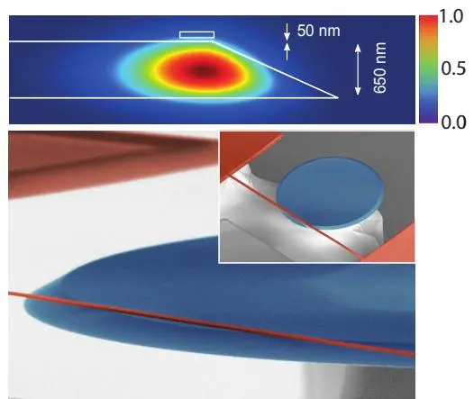
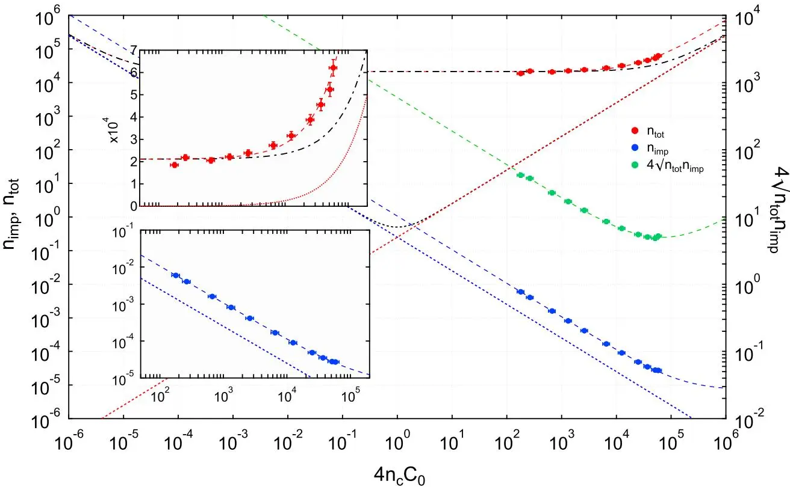
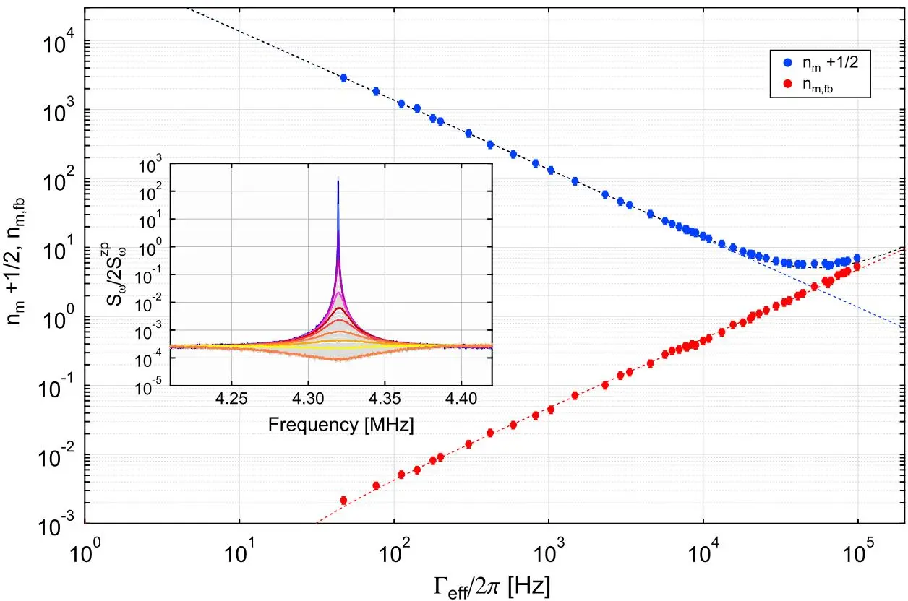

# Measurement-based control of a mechanical oscillator at its thermal decoherence rate
## 机械振子在热退相干率处的测量与控制

**D. J. Wilson, V. Sudhir, N. Piro, R. Schilling, A. Ghadimi, T. J. Kippenberg**

École Polytechnique Fédérale de Lausanne (EPFL)

*Nature* **524**, 325–329 (2015)

## 摘要

实时量子反馈协议 [1,2] 中，连续测量的记录被用于稳定目标量子态。近年来在多种良好隔离的微系统（微波光子 [3]、超导量子比特 [4]）中取得高度成功。相比之下，稳定一个切实宏观物体（如纳米机械振子）的量子态仍是困难挑战：主要障碍是**环境退相干**，对测量态的时间尺度提出严格要求。**本文描述一种位置传感器，能在固态纳米机械振子的热退相干时间尺度内分辨其零点运动**——这是用反馈制备其基态的关键要求 [5]。该传感器基于腔光机械耦合 [6]，实现位移测量的不精确度**比标准量子极限低 40 dB** [7]，同时保持不精确度-反作用积在海森堡不确定极限因子 5 以内。以测量作误差信号、辐射压力作执行器，演示 4.3 MHz 振子从 4.4 K 低温浴**主动反馈冷却（冷阻尼 [8]）到有效 1.1±0.1 mK**，对应平均声子数 $n_m = 5.3 \pm 0.6$（基态概率 16%）。结果为线性位置传感器的性能设立新基准，标志着工程化机械振子作为测量基量子控制实用对象的兴起。

---

## 背景与动机

机械振子的反馈控制历史悠久（蒸汽调速器 [9]、机械钟 [10]、检流计 [11]）。基本方法用传感器跟踪振子位置、用执行器把测量记录转成连续「实时」反馈力。近期实时反馈的量子极限 [1,2] 在良好隔离的个体量子系统中被探索，实现了微波 Fock 态产生 [3]、超导量子比特持续 Rabi 振荡 [4] 等惊人应用。这些协议的基本范式涉及能在量子态因测量反作用退相干同样快的速率下追踪它的「弱测量」[12]。


对机械振子，理想弱位置测量 [13] 自激光问世就有（散粒噪声极限干涉 [7]）。但只有近来——低温低损耗微机械与片上集成光子学 [6] 的汇聚——才可能考虑将其用于量子反馈协议 [8,14]。**主要挑战**：典型射频微机械振子，热环境构成额外的强退相干通道。要用测量基量子反馈控制它，测量必须既弱（最小扰动）又足够高效，能在热退相干时间内分辨振子量子态——对测量精度提出严苛要求。


### 反馈冷却：判据

反馈冷却 [5,8,15,16] 是说明量子反馈效用与挑战的控制协议。机械振子做热布朗运动，通过最小化位移测量 $S_x$（机械频率 $\Omega_m$ 处的谱密度）被导向基态。常规策略 [8] 施加正比于振子速度的反馈力，阻尼运动直到它与测量不精确 $S_x^{\mathrm{imp}}$ 重合。

基态冷却（$n_m < 1$）要求不精确低于阻尼振子的零点涨落：$S_x^{\mathrm{imp}} \lesssim S_x^{\mathrm{zp}}/n_{\mathrm{th}}$，等价于以大于 $2n_{\mathrm{th}}^2$ 的信噪比分辨未阻尼热噪声 $S_x \simeq 2n_{\mathrm{th}} S_x^{\mathrm{zp}}$。对应在特征测量率处分辨零点运动的能力：

$$
\Gamma_{\mathrm{meas}} \equiv \frac{x_{\mathrm{zp}}^2}{2 S_x^{\mathrm{imp}}} \gtrsim \frac{\Gamma_{\mathrm{th}}}{8}, \tag{1}
$$

其中 $x_{\mathrm{zp}}$ 为零点振幅，$\Gamma_{\mathrm{th}} \simeq \Gamma_m n_{\mathrm{th}}$ 为热退相干率，$\Gamma_m$ 为内禀机械阻尼率。**满足式 (1) 是艰巨的技术挑战**，源于典型微机械振子的大热占据与小零点振幅。

### 海森堡与反馈冷却

海森堡不确定原理预言：不精确 $S_x^{\mathrm{zp}}/2$ 的弱连续位置测量 [13] 会产生随机「反作用」力，至少以同等程度扰动振子位置 [7,13]。等价 $n_{\mathrm{imp}} \equiv S_x^{\mathrm{imp}}/2S_x^{\mathrm{zp}}$ 浴量子的不精确导致有效热浴占据增加 $n_{\mathrm{ba}} \geq 1/16 n_{\mathrm{imp}}$。这看似禁止基态冷却——要达到必要测量精度必须大幅加热振子。


**反馈抵消反作用** [17]，故仍可达成 $n_m \approx 2\sqrt{n_{\mathrm{imp}}(n_{\mathrm{ba}} + n_{\mathrm{th}})} - 1/2 < 1$ [8,16,18]。$n_m \to 0$ 的极限在测量记录被反作用诱导涨落主导时逼近——此时测量最大效率 [12]，即测量率 $\Gamma_{\mathrm{meas}} = \Gamma_m/16 n_{\mathrm{imp}}$ 趋近有效热退相干率 $\Gamma_{\mathrm{tot}} = (n_{\mathrm{th}} + n_{\mathrm{ba}})\Gamma_m \geq \Gamma_{\mathrm{meas}}$。为此，线性位置传感器必须达到远低于标准量子极限（SQL）[7]（$n_{\mathrm{imp}} = n_{\mathrm{ba}} = 1/4$）的不精确（约 $n_{\mathrm{th}}$ 倍），同时反作用接近不确定极限：$4\sqrt{n_{\mathrm{ba}} n_{\mathrm{imp}}} \geq 1$。


---

## 器件：近场腔光机械耦合

### 近场耦合：机械与光学谐振器分离优化

本文系统通过**近场耦合** [26]——允许材料与几何迥异的机械和光学谐振器集成——应对上述挑战。为实现高合作性，集成：

- **高 $Q/$（质量）比、低光吸收的机械振子**：高应力 $\mathrm{Si_3N_4}$ 纳米梁 [27]
- **高 $Q/$（模体积）比、低光非线性的光学腔**：化学抛光 $\mathrm{SiO_2}$ 微盘 [28]

耦合通过把梁的一部分精确定位在微盘回音壁模的渐逝场体积内实现（图 1b）。两谐振器集成在硅芯片 [29] 上，支持稳健低温运行。

图 1：用近场光机械换能器测量与控制纳米机械梁位置。(a) $\mathrm{SiO_2}$ 微盘的回音壁模由可调二极管激光器驱动的锥形光纤激发。$\mathrm{Si_3N_4}$ 纳米梁采样微盘的渐逝模体积，其位移记录在传感器透射场的相位中（平衡零差检测）。辐射压力反馈通过用同相光电流的电子处理（延迟、带通、放大）副本调制反馈激光幅度实现。(b) 上：光学模有限元模型；下：光机械系统 SEM。(c) 不同腔内光子数下基频梁模的热机械噪声谱。(d) 宽带额外（扣散粒噪声后）同相信号表为表观腔频率噪声。彩色带表示 $\Gamma_{\mathrm{meas}} = \Gamma_{\mathrm{th}}$ 所需不精确。

### 系统参数

具体地，系统含 65 μm × 400 nm × 70 nm 纳米梁（有效质量 $m \approx 2.9$ pg），置于 30 μm 直径微盘表面约 50 nm 处。微盘用低损（~6%）光纤锥 [30] 与可调二极管激光探测。机械运动在透射腔场相位中用平衡零差干涉仪观测。两个光学模：「传感模」（$\lambda \approx 775$ nm，$\kappa_0 \approx 2\pi\cdot0.44$ GHz，零差读出）与「反馈模」（$\lambda_c \approx 843$ nm，$\kappa_0 \sim 2\pi\cdot1$ GHz，辐射压力执行）。机械用 $\Omega_m \approx 2\pi\cdot4.3$ MHz 纳米梁基频面外模。传感模的光机械耦合 $g_0 \approx 2\pi\cdot20$ kHz（频率牵引 $G \approx 2\pi\cdot0.70$ GHz/nm，$x_{\mathrm{zp}} \approx 29$ fm）。

| 参数 | 数值 |
|------|------|
| 梁尺寸 | 65 μm × 400 nm × 70 nm |
| $m$ | 2.9 pg |
| $\Omega_m/2\pi$ | 4.3 MHz |
| $\Gamma_m/2\pi$ | 5.7 Hz |
| $Q_m$ | $7.6\times10^5$ |
| $g_0/2\pi$（真空耦合）| 20 kHz |
| $G$（频率牵引）| $2\pi\cdot0.70$ GHz/nm |
| $x_{\mathrm{zp}}$ | 29 fm |
| 传感模 $\kappa_0/2\pi$ | 0.44 GHz |
| 反馈模 $\kappa_0/2\pi$ | ~1 GHz |
| $C_0$（单光子合作性）| ~0.64（近临界耦合 0.31）|
| 温度 | 4.4 K |
| $n_{\mathrm{th}}$ | $\sim2.1\times10^4$ |
| 压力 | $<10^{-3}$ mbar |

### 额外热涨落的限制

对所有位置传感器，额外热涨落设下基本精度限。腔光机械传感器的主要额外不精确来自腔衬底的热机械 [31,32] 与热折射 [33] 涨落，产生过量腔频率噪声 $S_\omega^{\mathrm{imp,ex}}$，把测量率限为

$$
\Gamma_{\mathrm{meas}} = \frac{g_0^2/2}{S_\omega^{\mathrm{imp,shot}} + S_\omega^{\mathrm{imp,ex}}} = \frac{\Gamma_m/16}{n_{\mathrm{imp}}^{\mathrm{shot}} + n_{\mathrm{imp}}^{\mathrm{ex}}}. \tag{2}
$$

图 1d 显示传感器在基频梁共振附近宽频段的额外噪声底（从大腔内光子数 $n_c > 10^5$ 测量扣散粒噪声得）。基频噪声峰附近额外频率噪声背景 $S_\omega^{\mathrm{imp,ex}} \approx (2\pi\cdot30\,\text{Hz}/\sqrt{\text{Hz}})^2$，对应额外位置不精确 $S_x^{\mathrm{imp,ex}} \approx (4.3\times10^{-17}\,\text{m}/\sqrt{\text{Hz}})^2$。识别为微盘热折射噪声 [20]、二极管激光频率噪声 [34]、邻近平面内梁模（4.6 MHz）非共振热运动的组合。

得益于振子大零点运动，等效浴占据 $n_{\mathrm{imp}}^{\mathrm{ex}} \approx 1.0\times10^{-5}$——**比 SQL 低近 44 dB**。该不精确对应的测量率 $\Gamma_m/16 n_{\mathrm{imp}}^{\mathrm{ex}} \approx 2\pi\cdot36$ kHz，等于 1.3 K 处的热退相干率。反馈冷却到 $n_m < 1$ 的较宽松要求（$\Gamma_{\mathrm{meas}} \gtrsim \Gamma_{\mathrm{th}}/8$）应在 10 K 即可达到。

---

## 主要结果

### 不精确度与反作用：测量效率

传感器实际性能受可用光功率约束（光子收集效率、光热与辐射压力不稳定性、光吸收加热等额外反作用）。记录测量不精确 $n_{\mathrm{imp}}$ 与总有效浴占据 $n_{\mathrm{tot}} \equiv n_{\mathrm{th}} + n_{\mathrm{ba}}$ 作为腔内光子数 $n_c$ 的函数（图 2），比较乘积与不确定极限值 $4\sqrt{n_{\mathrm{imp}} n_{\mathrm{tot}}} > 1$。

图 2：测量不精确与反作用随腔内光子数。红/蓝/绿点对应总有效浴占据 $n_{\mathrm{tot}} = n_{\mathrm{th}} + n_{\mathrm{ba}}$、不精确 $n_{\mathrm{imp}}$、表观不精确-反作用积 $4\sqrt{n_{\mathrm{tot}} n_{\mathrm{imp}}}$。在 $n_c \approx 5\times10^4$ 观测到最小积 $4\sqrt{n_{\mathrm{imp}} n_{\mathrm{tot}}} \approx 5.0$，对应最大测量效率 $\Gamma_{\mathrm{meas}}/\Gamma_{\mathrm{tot}} \approx 0.040$。

- 低光子数（$n_c \ll n_{\mathrm{th}}/C_0$）：$n_{\mathrm{tot}} \approx n_{\mathrm{th}}$（热化到低温箱），不精确 $n_{\mathrm{imp}} = (16\xi C_0 n_c)^{-1}$，$\xi \approx 0.23$（测量理想性，含光损耗与模劈裂导致的腔传输函数降低）。
- 高光子数：观测到最低不精确 $n_{\mathrm{imp}} \approx 2.7(\pm0.2)\times10^{-5}$——**比 SQL 低 $39.7\pm0.3$ dB**。对应测量率 $\Gamma_{\mathrm{meas}} \approx 2\pi\cdot(13\pm1)$ kHz，是 4.4 K 浴热退相干率 $\Gamma_{\mathrm{th}} \approx 2\pi\cdot120$ kHz 的 1/9.2。**该值在反馈冷却到 $n_m < 1$ 要求的 15% 以内**。
- 大测量强度下应出现量子测量反作用（辐射压力散粒噪声 [23]）$n_{\mathrm{ba}} = C_0 n_c$，但系统因额外反作用偏离——表观过量合作性 $C_0^{\mathrm{ex}} \approx 0.56$，量子反作用仅占 $C_0/(C_0 + C_0^{\mathrm{ex}}) \approx 35\%$。高阶机械模的类似行为 + $C_0^{\mathrm{ex}}$ 在更低低温箱温度下显著更高，暗示**光吸收加热**是过量反作用原因（与 10 K 下非晶玻璃热导率普适降低一致 [39]）。

含额外反作用与非理想测量的表观不精确-反作用积（图 2 绿线）：

$$
4\sqrt{n_{\mathrm{imp}} n_{\mathrm{tot}}} = \sqrt{\frac{1}{\xi}\left(1 + \frac{n_{\mathrm{th}}}{C_0 n_c} + \frac{C_0^{\mathrm{ex}}}{C_0}\right)\left(1 + \frac{n_c}{n_c^{\mathrm{ex}}}\right)}. \tag{3}
$$

在 $n_c \approx 5\times10^4 \ll n_c^{\mathrm{ex}}$ 观测最小积 $4\sqrt{n_{\mathrm{imp}} n_{\mathrm{tot}}} \approx 5.0$，最大测量效率 $\Gamma_{\mathrm{meas}}/\Gamma_{\mathrm{tot}} \approx 0.040$。

### 反馈冷却：$n_m = 5.3$

图 3 显示用不精确远低于 SQL 的测量做反馈冷却。**为本次演示，不精确被刻意限制到 $n_{\mathrm{imp}} \approx 2.9\times10^{-4}$**，以减小额外加热与 4.6 MHz 热噪声峰非共振尾导致的不确定（限制式 (4) 适用到 $\Gamma_{\mathrm{eff}} = (1+g_{\mathrm{fb}})\Gamma_m \lesssim 2\pi\cdot200$ kHz）。反馈增益由电子增益幅度控制，其他参数（如激光功率）不变。

图 3：辐射压力反馈冷却到近基态。蓝/红点对应机械模声子占据 $n_m$（含零点能 1/2）与测量噪声反馈成分 $n_{m,fb} = n_{\mathrm{imp}} g_{\mathrm{fb}}^2/(1+g_{\mathrm{fb}})$ 作为有效阻尼率 $\Gamma_{\mathrm{eff}} = (1+g_{\mathrm{fb}})\Gamma_m$ 的函数。在最佳阻尼 $\Gamma_{\mathrm{eff}} \approx 2\pi\cdot52$ kHz 推断最小占据 $n_m \approx 5.3 \pm 0.6$，对应基态概率 $\approx 16\%$。插图：不同反馈增益的闭环机械噪声谱。

忽略弱驱动（$n_c < 100$）反馈光模的反作用，冷却机械模的有效声子占据取决于热、测量、反馈库耦合（率 $\Gamma_{\mathrm{th}}, \Gamma_m n_{\mathrm{ba}}, g_{\mathrm{fb}} \Gamma_m n_{\mathrm{imp}}$）的平衡（$g_{\mathrm{fb}} \equiv \Gamma_{\mathrm{fb}}/\Gamma_m$ 为开环增益）：

$$
n_m + \frac{1}{2} = \frac{1}{1+g_{\mathrm{fb}}} n_{\mathrm{tot}} + \frac{g_{\mathrm{fb}}^2}{1+g_{\mathrm{fb}}} n_{\mathrm{imp}} \geq 2\sqrt{n_{\mathrm{imp}} n_{\mathrm{tot}}}. \tag{4}
$$

最小占据在最佳增益 $g_{\mathrm{fb}} = \sqrt{n_{\mathrm{tot}}/n_{\mathrm{imp}}}$ 达到，对应把表观位置噪声压到不精确噪声底。计额外反作用，推断最小占据 $n_m \approx 5.3 \pm 0.6$（最佳阻尼 $\Gamma_{\mathrm{eff}} \approx 2\pi\cdot52$ kHz），对应基态概率 $1/(1+n_m) \approx 16\%$。与式 (4) 与图 2 预测吻合。注意更大反馈强度下散粒噪声挤压 [2,15] 导致 $n_{\mathrm{imp}}$ 表观降低，但 $n_m$ 物理上增大。

---

## 结论与展望

这些结果为微机械振子的线性测量与控制设立新基准。**使能进展**是位置传感器能以比 SQL 低 $39.7\pm0.3$ dB 的不精确监测振子位移（比此前结果 [19–21] 改进 100 倍），同时不精确-反作用积在海森堡不确定极限因子 5.0 以内。对 4.3 K 下 4.3 MHz 纳米梁振子，该不精确对应在其内禀热退相干率数量级内分辨零点运动的能力（$\Gamma_{\mathrm{meas}}/\Gamma_{\mathrm{th}} \approx 0.11$），总测量效率 $\Gamma_{\mathrm{meas}}/\Gamma_{\mathrm{tot}} \approx 0.040$。

利用此效率，传统辐射压力冷阻尼 [15] 把振子冷却到平均声子占据 $5.3 \pm 0.6$——比此前固态机械振子的主动反馈冷却 [35–38,40] 改进 40 倍，可与腔光机械中相干反馈（即边带）冷却 [43,44] 的成功相比 [18,41,42]。**适度降低额外反作用，预期 $n_m < 1$ 应是可能的。** 展望：高效光机械传感器开启多种测量基反馈应用，特别是反作用规避 [17,45] 与机械压缩 [14]。

---

## 参考文献


学术论文的参考文献条目按国际惯例保留原文。以下为本文引用的主要文献。


1. Wiseman, *Phys. Rev. A* **49**, 2133 (1994). — **量子反馈理论奠基。**
2. Wiseman, Milburn, *Quantum Measurement and Control* (Cambridge, 2009). — **量子测量与控制教材。**
3. Sayrin et al., *Nature* **477**, 73 (2011). — 微波光子 Fock 态的反馈稳定。
4. Vijay et al., *Nature* **490**, 77 (2012). — 超导量子比特的反馈 Rabi 振荡。
6. Aspelmeyer, Kippenberg, Marquardt, arXiv:1303.0733 (2013). — **腔光机械综述（后成 Rev. Mod. Phys.）。**
7. Caves, *Phys. Rev. Lett.* **45**, 75 (1980). — **引力波探测中的量子噪声（SQL 概念）。**
8. Courty, Heidmann, Pinard, *Eur. Phys. J. D* **17**, 399 (2001). — **冷阻尼反馈冷却。**
13. Clerk, Devoret, Girvin, Marquardt, Schoelkopf, *Rev. Mod. Phys.* **82**, 1155 (2010). — **量子噪声、测量、放大权威综述。**
15. Cohadon, Heidmann, Pinard, *Phys. Rev. Lett.* **83**, 3174 (1999). — **冷阻尼反馈冷却的首次实验。**
17. Wiseman, *Phys. Rev. A* **51**, 2459 (1995). — **反馈规避反作用（量子擦除）。**
19. Teufel et al., *Nat. Nano.* **4**, 820 (2009). — **纳米机械运动测量不精确低于 SQL（本图书馆有 Teufel 2011 对应笔记）。**
23. Purdy, Peterson, Regal, *Science* **339**, 801 (2013). — 辐射压力散粒噪声观测。
25. Suh et al., *Science* **344**, 1262 (2014). — 机械振子的反作用规避测量。
26. Anetsberger et al., *Nat. Phys.* **5**, 909 (2009). **— 近场光机械耦合（本文架构来源）。**
43. Chan et al., *Nature* **478**, 89 (2011). — **激光冷却纳米机械振子到基态（边带路线）。**
44. Teufel et al., *Nature* **475**, 359 (2011). — **边带冷却到基态（本图书馆有对应笔记）。**

---

## 阅读笔记

### 一句话概括

用高应力 $\mathrm{Si_3N_4}$ 纳米梁（4.3 MHz、$Q_m = 7.6\times10^5$）+ $\mathrm{SiO_2}$ 微盘（近场光机械耦合，$g_0/2\pi = 20$ kHz）做位置传感器：在 4.4 K 下达到比标准量子极限低 40 dB 的位移不精确（海森堡极限因子 5 内），测量率 $\Gamma_{\mathrm{meas}}/\Gamma_{\mathrm{th}} \approx 0.11$；以此作误差信号辐射压力冷阻尼反馈，把振子从 4.4 K 冷到等效 1.1 mK（$n_m = 5.3$，基态概率 16%）。这是**固态机械振子测量基量子控制**的里程碑——首次让反馈冷却逼近边带冷却的水平。

### 核心论证链

1. **近场耦合让机械与光学各自优化**：$\mathrm{Si_3N_4}$ 梁（高 $Q$/质量、低吸收）+ $\mathrm{SiO_2}$ 微盘（高 $Q$/模体积、低非线性），渐逝场耦合——材料和几何可独立优化，这是高合作性 $C_0 \approx 0.64$ 的器件根基。
2. **大零点运动让测量更容易**：$x_{\mathrm{zp}} = 29$ fm（比 Teufel 2011 的 4.1 fm 大 7 倍），等效地降低了所需不精确。$S_x^{\mathrm{zp}}$ 大 → 同等 $n_{\mathrm{imp}}$ 下需要的 $S_x^{\mathrm{imp}}$ 也大 → 工程上更可达。
3. **不精确 40 dB 低于 SQL**：$n_{\mathrm{imp}} \approx 2.7\times10^{-5}$，测量率 $\Gamma_{\mathrm{meas}} \approx 2\pi\cdot13$ kHz 达 $\Gamma_{\mathrm{th}}/9.2$——在 $n_m < 1$ 要求的 15% 以内。
4. **反馈抵消反作用**：式 (4) 表明反馈冷却是热库、反作用库、反馈库三者的平衡，最佳增益 $g_{\mathrm{fb}} = \sqrt{n_{\mathrm{tot}}/n_{\mathrm{imp}}}$ 把 $n_m$ 压到 $2\sqrt{n_{\mathrm{imp}} n_{\mathrm{tot}}}$。
5. **$n_m = 5.3$ 的瓶颈是额外反作用**：$C_0^{\mathrm{ex}} \approx 0.56$（光吸收加热）让量子反作用只占 35%，把 $4\sqrt{n_{\mathrm{imp}} n_{\mathrm{tot}}}$ 抬到 5.0。降低它（如更低吸收材料）→ $n_m < 1$。

### 关键物理：为什么反馈冷却能绕过「测得越准反作用越大」？

连续位置测量的悖论：测准（$n_{\mathrm{imp}}$ 小）需要大光功率 → 大辐射压力反作用（$n_{\mathrm{ba}}$ 大）→ 加热振子。$n_{\mathrm{imp}} n_{\mathrm{ba}} \geq 1/16$（海森堡）。看似无解。但反馈冷却的妙处在于 **反馈力同时抵消热噪声与反作用力**：

- 反馈力正比于速度（由位置测量微分得）→ 提供阻尼 $\Gamma_{\mathrm{fb}}$。
- 阻尼既压低热噪声（$n_{\mathrm{th}}/(1+g_{\mathrm{fb}})$），也压低反作用（$n_{\mathrm{ba}}$ 被反馈「追踪」并抵消 [17]）。
- 代价：反馈把测量不精确注入振子（$g_{\mathrm{fb}}^2 n_{\mathrm{imp}}/(1+g_{\mathrm{fb}})$）。
- 三者平衡给出 $n_m + 1/2 = n_{\mathrm{tot}}/(1+g_{\mathrm{fb}}) + g_{\mathrm{fb}}^2 n_{\mathrm{imp}}/(1+g_{\mathrm{fb}}) \geq 2\sqrt{n_{\mathrm{imp}} n_{\mathrm{tot}}}$（式 4，AM-GM 不等式）。

所以反馈冷却的下限是 $2\sqrt{n_{\mathrm{imp}} n_{\mathrm{tot}}}$——同时减小不精确（提光功率）和反作用（提效率、降吸收）才能逼近基态。本文 $2\sqrt{n_{\mathrm{imp}} n_{\mathrm{tot}}} \approx 5$，故 $n_m \approx 5.3$——卡在反作用上。

### 与边带冷却（Teufel 2011）的对比

本文的反馈冷却与 Teufel 2011（本图书馆笔记）的边带冷却是机械振子量子化的两条主路线：

| | 反馈冷却（本文 Wilson 2015）| 边带冷却（Teufel 2011）|
|---|---|---|
| 机制 | 测量位移 → 电子反馈 → 辐射压力阻尼 | 红失谐驱动 → 光子-声子散射（相干）|
| 量子性 | 测量-反馈（非相干，需经典电子学）| 相干（全光学，无电子学）|
| 达到的 $n_m$ | 5.3（基态概率 16%）| 0.34（基态概率 75%）|
| 优势 | 室温兼容（4.4 K 即可）、宽频 | 真 quantum-limited、可到 $n_m \to 0$ |
| 劣势 | 电子学延迟、额外反作用 | 需深分辨边带 + 极低温 |

两者互补：边带冷却的终极极限更低（$n_m\to0$），反馈冷却更灵活（不依赖深分辨边带）。本文的意义是**把反馈冷却从 $n_m \sim 200$（此前 [35–38]）推到 5.3**——逼近边带冷却，证明反馈路线在工程上可行。

### 批判性思考

**1. $n_m = 5.3$ 离基态（$n_m < 1$）仍有距离。** 基态概率 16% 意味着 84% 的时间振子处于激发态。作者说「适度降低额外反作用，$n_m < 1$ 应可能」，但这「适度」是 $C_0^{\mathrm{ex}}$ 从 0.56 降到 $\ll C_0 = 0.31$——即把光吸收加热降一个数量级以上。这并非「适度」，而是材料工程的硬挑战（$\mathrm{SiO_2}$ 在低温下热导率极低 [39]，光吸收的热难以耗散）。后续工作（如 2016-2018）确实通过改用 $\mathrm{Si}$ 或 phononic shield 降低了吸收，但本文本身未达基态。

**2. 额外反作用（光吸收加热）是核心瓶颈，但机制部分靠推测。** 作者识别 $C_0^{\mathrm{ex}} \approx 0.56$ 为额外反作用，归因于光吸收加热（依据：高阶模同样行为 + 低温下 $C_0^{\mathrm{ex}}$ 更高 + 与玻璃热导率降低一致 [39]）。但这是间接证据——没有直接测量局部温升或吸收率。其他可能（如两能级系统吸收、非线性光学）未被完全排除。对想复现/改进的后续工作，这个机制的不确定性是风险。

**3. 4.4 K 的「高温」运行是双刃剑。** 本文故意在 4.4 K（而非 mK）运行，理由是 $n_{\mathrm{th}} \approx 2.1\times10^4$ 大但 $\Gamma_{\mathrm{th}} = n_{\mathrm{th}}\Gamma_m$ 仍可被 $\Gamma_{\mathrm{meas}}$ 匹配（因 $\Gamma_m = 2\pi\cdot5.7$ Hz 极小）。这展示了反馈冷却「不依赖极低温」的优势。但 4.4 K 下 $n_{\mathrm{th}}$ 巨大，要求 $n_{\mathrm{imp}} \ll n_{\mathrm{th}}$（即 40 dB 低于 SQL）——这恰恰是本文的工程难题。如果降到 mK（如 Teufel 2011 的 15-20 mK），$n_{\mathrm{th}}$ 小 200 倍，对不精确的要求也降 200 倍，工程上更容易。所以本文「4.4 K」既是卖点（展示高温能力）也是自我设限（加大了不精确要求）。

**4. 测量效率 $\Gamma_{\mathrm{meas}}/\Gamma_{\mathrm{tot}} = 0.040$ 偏低。** 理想量子反馈要求效率 → 1（测量记录主导振子退相干）。本文 4% 的效率意味着 96% 的退相干来自环境（热 + 反作用），测量只「看到」4%。这远不够做真正的量子态稳定（如稳 Fock 态）。要达到量子反馈控制（而非只是冷却），需要效率 > 50%。本文的 $\xi = 0.23$（光收集效率）和 $C_0^{\mathrm{ex}}$ 是瓶颈——前者可通过更好光耦合改善，后者需材料改进。

**5. 「线性位置传感器的新基准」是相对的。** 本文 40 dB 低于 SQL 是相对此前 [19–21]（~20 dB）的 100 倍改进，确实显著。但 SQL 本身是 $n_{\mathrm{imp}} = 1/4$，40 dB 以下 = $n_{\mathrm{imp}} \sim 10^{-5}$，离「真正分辨单声子」（$n_{\mathrm{imp}} \sim 1/n_{\mathrm{th}} \sim 10^{-4}$ 在反馈冷却判据下）刚好够用。这是「刚刚够用」的精度，不是「宽裕」。任何性能退化（光损耗、振动、温度涨落）都会让 $n_m$ 显著上升。

### 局限性

- **未达基态**：$n_m = 5.3$，基态概率仅 16%。
- **额外反作用**：光吸收加热 $C_0^{\mathrm{ex}} \approx 0.56$，机制部分推测。
- **测量效率低**：$\Gamma_{\mathrm{meas}}/\Gamma_{\mathrm{tot}} = 0.040$，远不够量子态稳定。
- **4.4 K 自设高门槛**：$n_{\mathrm{th}}\sim2\times10^4$ 要求不精确 40 dB 低于 SQL。
- **反馈冷却本质非相干**：依赖电子学延迟，不如边带冷却「干净」。
- **单光子合作性边缘**：$C_0 \approx 0.3-0.6$，强但非压倒性。

### 关键公式速查

| 公式 | 含义 | 出处 |
|------|------|------|
| $\Gamma_{\mathrm{meas}} \equiv x_{\mathrm{zp}}^2/(2 S_x^{\mathrm{imp}}) \gtrsim \Gamma_{\mathrm{th}}/8$ | 反馈冷却到基态的测量率判据 | 式 (1) |
| $\Gamma_{\mathrm{meas}} = \frac{g_0^2/2}{S_\omega^{\mathrm{imp,shot}} + S_\omega^{\mathrm{imp,ex}}}$ | 含额外噪声的测量率 | 式 (2) |
| $4\sqrt{n_{\mathrm{imp}} n_{\mathrm{tot}}} = \sqrt{\frac{1}{\xi}(1 + \frac{n_{\mathrm{th}}}{C_0 n_c} + \frac{C_0^{\mathrm{ex}}}{C_0})(1 + \frac{n_c}{n_c^{\mathrm{ex}}})}$ | 表观不精确-反作用积（含损耗+额外反作用）| 式 (3) |
| $n_m + \frac{1}{2} = \frac{n_{\mathrm{tot}}}{1+g_{\mathrm{fb}}} + \frac{g_{\mathrm{fb}}^2 n_{\mathrm{imp}}}{1+g_{\mathrm{fb}}} \geq 2\sqrt{n_{\mathrm{imp}} n_{\mathrm{tot}}}$ | 反馈冷却占据（AM-GM 下限）| 式 (4) |
| $C_0 = 4g_0^2/(\kappa\Gamma_m)$ | 单光子合作性 | SM |

### 延伸阅读

- **Caves (1980) [7]** — 引力波探测中的量子噪声，SQL 概念的来源。
- **Clerk et al. (2010) [13]** — *Rev. Mod. Phys.* 量子噪声、测量、放大综述，理解反作用、SQL、海森堡极限的权威。
- **Wiseman & Milburn, *Quantum Measurement and Control* (2009) [2]** — 量子反馈理论教材。
- **Courty, Heidmann, Pinard (2001) [8]** — 冷阻尼反馈冷却理论，本文协议的基础。
- **Anetsberger et al. (2009) [26]** — 近场光机械耦合，本文器件架构来源。
- **Teufel et al. (2011) [44]** — **本图书馆有对应笔记** sideband-cooling-ground-state，边带冷却到 $n_m = 0.34$，本文反馈冷却的直接对照。
- **Cohadon et al. (1999) [15]** — 冷阻尼反馈冷却的首次实验。
- **Chan et al. (2011) [43]** — 激光冷却纳米机械振子到基态（光学边带路线）。

### 术语对照

| 中文 | 英文 | 含义 |
|------|------|------|
| 测量基量子控制 | measurement-based quantum control | 用连续测量 + 反馈控制量子态 |
| 量子反馈 | quantum feedback | 用测量记录实时施加反馈力稳定量子态 |
| 反馈冷却 | feedback cooling | 测量位移 → 速度反馈 → 阻尼冷却 |
| 冷阻尼 | cold damping | 辐射压力反馈冷却的别名 [8] |
| 热退相干率 | thermal decoherence rate $\Gamma_{\mathrm{th}}$ | $n_{\mathrm{th}}\Gamma_m$，热环境导致的退相干 |
| 测量率 | measurement rate $\Gamma_{\mathrm{meas}}$ | 测量分辨零点运动的特征速率 |
| 不精确 | imprecision $n_{\mathrm{imp}}$ | 测量位移的不确定度（浴量子单位）|
| 反作用 | back-action $n_{\mathrm{ba}}$ | 测量对振子的扰动力 |
| 标准量子极限 | standard quantum limit (SQL) | $n_{\mathrm{imp}} = n_{\mathrm{ba}} = 1/4$，单正交测量最佳经典精度 |
| 海森堡极限 | Heisenberg limit | $4\sqrt{n_{\mathrm{imp}} n_{\mathrm{ba}}} \geq 1$ |
| 单光子合作性 | single-photon cooperativity $C_0$ | $4g_0^2/\kappa\Gamma_m$，每光子测量率 |
| 真空光机械耦合 | vacuum optomechanical coupling $g_0$ | 单光子-单声子耦合率 |
| 频率牵引 | frequency pull $G$ | $\partial\omega_c/\partial x$，位移对腔频的牵引 |
| 零点运动 | zero-point motion $x_{\mathrm{zp}}$ | 量子基态的位移涨落 |
| 近场耦合 | near-field coupling | 渐逝场耦合机械与光学谐振器 [26] |
| 回音壁模 | whispering gallery mode | 微盘/微球的循环光学模 |
| 额外反作用 | extraneous back-action $C_0^{\mathrm{ex}}$ | 非辐射压力的过量反作用（如光吸收加热）|
| 额外不精确 | extraneous imprecision | 热机械/热折射噪声导致的不精确 |
| 散粒噪声挤压 | shot noise squashing | 闭环反馈导致的表观噪声降低 |
| 辐射压力散粒噪声 | radiation pressure shot noise | 光子数涨落导致的反作用力噪声 [23] |
| 反作用规避 | back-action evasion | 测量单一正交以规避反作用 [17,25] |
| 机械压缩 | mechanical squeezing | 压缩机械正交分量的噪声 [14] |
| 光热不稳定 | photothermal instability | 光吸收导致的热效应破坏稳定 |
