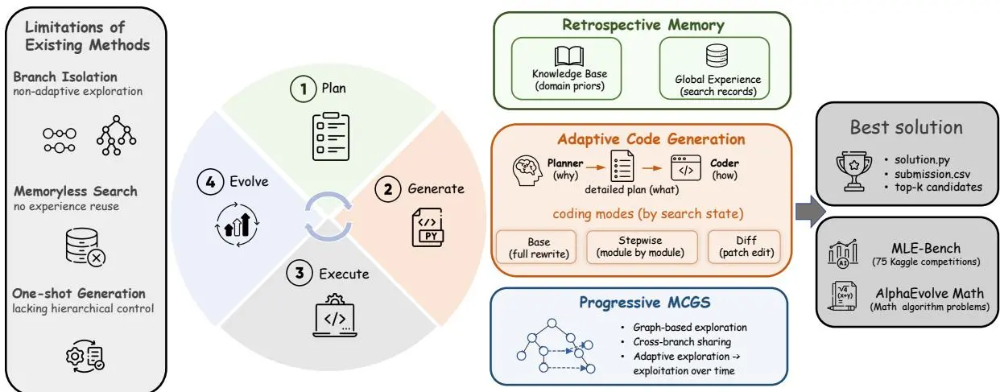
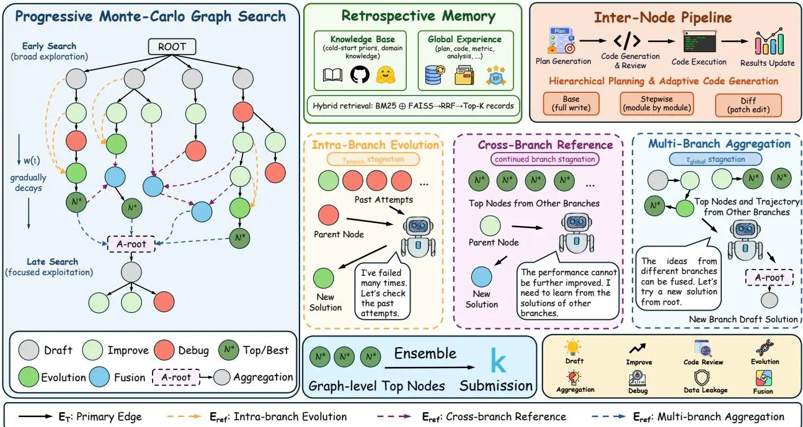
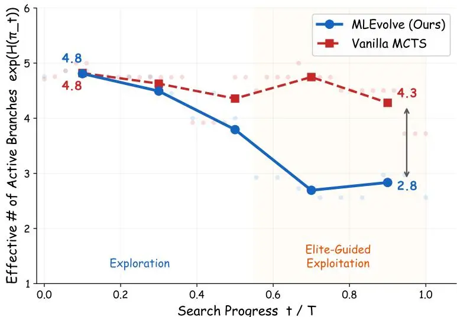
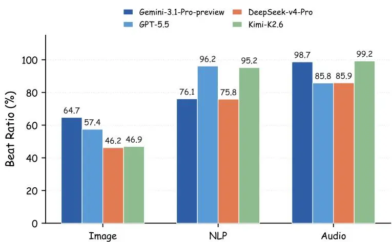
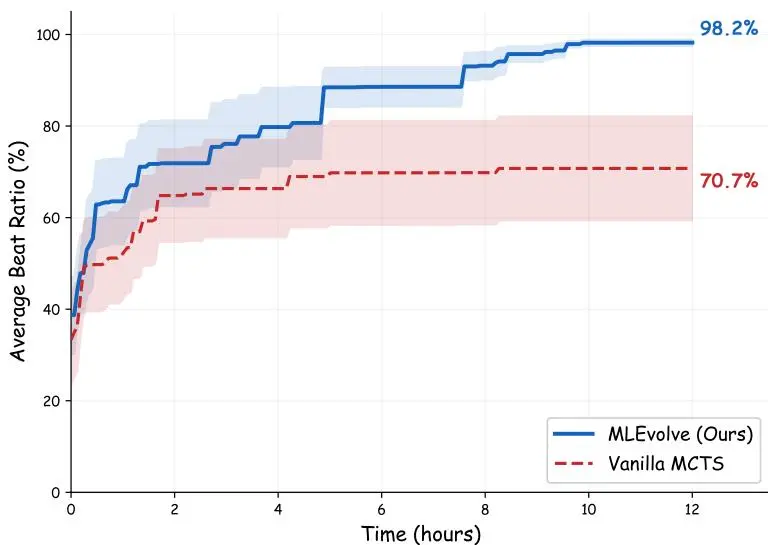
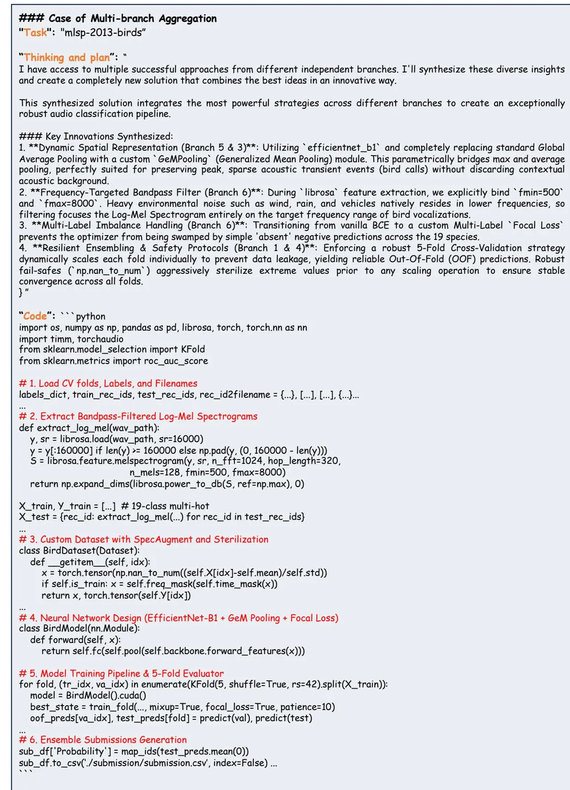

## MLEvolve: 面向自动化机器学习算法发现的自我进化框架

尚恒杜<sup>1</sup><sup>2</sup>, 项超闫<sup>1</sup><sup>♣</sup>, 金鑫石<sup>1</sup><sup>2</sup>, 宗盛曹<sup>1</sup>, 世阳冯<sup>1</sup>, 紫宸梁<sup>1</sup>, 博远孙<sup>1</sup>, 天烁彭<sup>1</sup>, 一帆周<sup>1</sup>, 欣李<sup>1</sup>, 杰周<sup>1</sup><sup>2</sup>, 亮何<sup>1</sup><sup>2</sup>, 波张<sup>1</sup><sup>♣</sup> and 磊白<sup>1</sup><sup>♣</sup> <sup>1</sup>上海人工智能实验室, <sup>2</sup>华东师范大学

大型语言模型（LLM）智能体正越来越多地应用于需要长程任务执行的场景，例如科学发现和机器学习工程（MLE），在这些任务中，持续的自我进化成为一种关键能力。然而，现有的MLE智能体存在分支间信息隔离、无记忆搜索以及缺乏层次化控制等问题，这些都阻碍了长程优化。我们提出了MLEvolve，一个基于LLM的自我进化多智能体框架，用于端到端的机器学习算法发现。通过将树搜索扩展到Progressive MCGS，MLEvolve借助基于图的参考边实现了跨分支信息流动，并采用受熵启发的渐进式调度，逐步将搜索从广泛探索转向聚焦利用。为了让智能体能够随着积累的经验而进化，我们引入了回顾记忆（Retrospective Memory），它将冷启动领域知识库与动态全局记忆相结合，用于特定任务经验的检索与复用。为了实现稳定的长程迭代，我们进一步将策略规划与代码生成解耦，并采用自适应编码模式。在MLE-Bench上的评估显示，MLEvolve在多个维度上取得了最先进的性能，包括在12小时预算（标准运行时间的一半）下的平均奖牌率和有效提交率。此外，MLEvolve在数学算法优化任务上也超越了专门的算法发现方法（包括AlphaEvolve），展现了强大的跨领域泛化能力。我们的代码已在 [GitHub](https://github.com/InternScience/MLEvolve) 公开。

### 1. 引言

人工智能（AI）正在重塑科学研究和复杂工程，催生了"AI for Science"（科学智能）[1]这一范式。随着大型语言模型（LLM）的持续进步，基于LLM的智能体系统[2]现在被应用于长程的自主任务，例如科学发现[3, 4]、自动化实验[5]和端到端算法设计[6]。与单轮推理不同，这些场景涉及开放的搜索空间和有限的时间预算，智能体必须持续地生成解决方案、执行代码、评估结果，并根据反馈调整策略。在此过程中，智能体不断进化：从过去的试验中积累经验，自适应地调整探索策略，并根据当前搜索阶段逐步改进实现。这种持续的自我进化能力正成为长程自主智能体的核心。

机器学习工程（MLE）是此类长程自我进化任务最具代表性的场景之一。设计高性能的AI系统仍然严重依赖专家知识和大量的人工迭代[7]。尽管近期AutoML（自动机器学习）[8, 9]的进展在优化诸如数据处理和模型选择等离散阶段取得了显著成果，但这些方法往往无法覆盖从数据准备到模型训练与推理的完整端到端MLE流程。最近，基于LLM的编码智能体已被应用于MLE场景[10, 11, 12, 13, 14]，利用LLM的规划和代码生成能力在开放的搜索空间内进行迭代优化。这些智能体通常采用贪心或进化搜索策略[12, 15]，

蒙特卡洛树搜索 [14, 16] 或多智能体协作 [13] 来探索候选解决方案。尽管取得了这些进展，现有的 MLE 智能体仍面临三个关键挑战，这些挑战阻碍了其在长周期内的自我进化。首先，现有的搜索机制受限于分支间的<sub>信息</sub><sub>孤立</sub>，且缺乏自适应探索策略。大多数方法采用线性或树状搜索 [12, 14, 16]，将信息限制在单个分支内，难以在不同搜索轨迹间转移成功策略。此外，这些方法在整个优化过程中通常采用固定的探索策略，导致在有限时间预算下资源分配效率低下。其次，大多数搜索框架是<sub>无记忆</sub>的，无法从过去的交互中积累经验 [17, 18]。当前的搜索框架仅传播标量奖励，导致每个规划决策都是孤立做出的，无法复用搜索早期类似尝试中的见解。虽然一些近期方法探索了记忆机制 [17, 18, 19]，但它们需要额外的 LLM 调用或仅提供静态知识，缺乏搜索过程中的自动经验积累。第三，大多数现有方法将规划与代码实现耦合为一次性生成，<sub>缺乏</sub><sub>层次化</sub><sub>控制</sub>。一个合理的设计需要区分“修改什么”和“如何实现”，但许多方法 [14, 20] 在每次迭代中重写整个解决方案，导致迭代效率低下且修改不可控。


<sup>图1</sup> | MLEvolve 概览，总结了其核心组件和支持的任务。现有 MLE 智能体饱受分支间孤立、无记忆探索和缺乏层次化控制之苦。MLEvolve 通过渐进式 MCGS、回顾性记忆、以及带有自适应代码生成的层次化规划来解决这些问题，支持长周期迭代优化任务，如端到端 MLE 和数学算法发现。

为弥补这一差距，我们提出了 <sub>MLEvolve</sub>（图1），一个基于 LLM 的、用于 MLE 任务的自我进化多智能体框架。MLEvolve 统一了三个核心组件：（1）<sub>渐进式</sub><sub>蒙特卡洛图搜索</sub><sub>(MCGS)</sub>，通过基于图的跨分支信息流解决树搜索中的孤立和有限复用问题，并引入一种受熵启发的渐进式探索调度，随时间推移自适应地将搜索从广泛探索引导至聚焦利用；（2）<sub>回顾性</sub><sub>记忆</sub>，将用于冷启动初始化的精选领域知识库与一个动态全局记忆配对，该全局记忆在搜索过程中自动积累和检索任务特定经验；以及（3）带有自适应代码生成的层次化规划，将策略规划与代码生成分离，并根据当前搜索状态在全量重写、逐步修改和基于差异的编辑模式间进行选择。因此，MLEvolve 实现了对端到端机器学习流水线更稳定、更具自我进化性的探索，为具有挑战性的 MLE 任务提供了更强的解决方案。实验结果表明，MLEvolve 在 12 小时预算（标准运行时的一半）下，在 MLE-Bench 上实现了 65.3% 的平均奖牌率，确立了最先进的性能，并进一步在数学优化任务上超越了包括 AlphaEvolve [6] 在内的专用算法发现方法。

我们的主要贡献如下：

• 我们提出了 MLEvolve，一个用于端到端 MLE 任务的自我进化多智能体框架，该框架统一了渐进式图搜索、回顾性记忆和层次化自适应代码生成，以支持长周期迭代优化。

• 我们引入了渐进式 MCGS 和回顾性记忆来实现自我进化优化。渐进式 MCGS 通过基于图的跨分支信息流和渐进式探索调度解决了分支间孤立问题，而回顾性记忆则实现了搜索过程中的自动经验积累和检索。

• 大量实验表明，MLEvolve 在 12 小时预算下，在 MLE-Bench 上达到了 65.3% 的平均奖牌率，在所有现有方法中表现最佳，并且在数学优化任务上进一步超越了 AlphaEvolve [6] 和 AlphaEvolve-v2 [21]，展现了跨域泛化能力。

### 2. 相关工作

#### 2.1. 自动化机器学习算法发现

为应对 MLE 的独特挑战，研究人员开发了专门的编码智能体 [12, 22, 23, 14]，其中许多在 MLE-Bench [24] 等基准测试上进行了评估。这些智能体主要将问题构建为搜索最优代码方案。早期工作如 AIDE [12] 采用贪婪搜索，容易陷入局部最优。后续框架采用了更结构化的探索。ML-Master [14] 和 AIRA-Dojo [16] 使用 MCTS，MARS [18] 引入了具有对比反思的预算感知 MCTS，FM-Agent [15] 应用了进化多岛并行搜索。其他工作探索了智能体协作，例如 R&D-Agent [13] 的研究者-开发者组合以及 AIBuildAI [25] 的分层多智能体协调。一些方法还融入了外部知识或记忆。AutoMind [17] 和 Leeroo [26] 利用领域知识库进行搜索，而 ML-Master 2.0 [19] 引入了用于跨任务知识蒸馏的分层认知缓存。然而，这些方法普遍存在分支间信息隔离以及无法积累和重用过往试验经验的问题。我们的方法从自我进化的视角解决了这些限制，使智能体能够持续适应其搜索行为，积累经验，并在长期优化过程中改进解决方案。

#### 2.2. 基于图的规划与搜索

早期将图结构与 MCTS 结合的方法，通常被称为 MCGS [27, 28]，主要开发用于具有明确定义状态空间的规划和强化学习任务，其中相同状态被合并以压缩搜索空间。最近的基于图的框架如 LocAgent [29] 和 CodexGraph [30] 将图用作检索或定位的静态依赖表示，但这些图在搜索过程中不会进化。相比之下，我们的 MCGS 针对开放式的基于 LLM 的代码生成，其中每个节点代表一个不同的候选解决方案。图结构并非用于压缩状态空间，而是通过动态引用边实现跨分支信息流、轨迹重用和解决方案组合。


图2 MLEvolve 框架。该框架由三个组件组成。(i) 渐进式 MCGS 通过基于图的跨分支信息流和渐进式探索调度来扩展 MCTS。(ii) 回顾性记忆将冷启动知识库与动态全局记忆配对，用于经验积累和检索。(iii) 具有自适应代码生成的分层规划将战略规划与代码实现解耦，并根据搜索状态选择不同的编码模式。

#### 2.3. LLM 智能体的记忆与经验机制

记忆机制已被探索用于改进 LLM 智能体在迭代任务中的表现 [31]。近期关于长期情景记忆的研究 [32] 使智能体能够在更长时间跨度内积累和检索经验记录，从而支持更明智的后续决策。在 MLE 领域，近期工作进一步探索经验复用。ROME [33] 引入“推理梯度”作为结构化优化方向，并将成功轨迹存储为动量记忆；MARS [18] 通过对历史尝试进行对比反思来提取见解；ML-Master 2.0 [19] 引入了用于跨任务知识蒸馏的分层认知缓存。尽管这些方法推进了经验复用，但大多数需要额外的 LLM 进行反思或总结。我们的回顾性记忆能够自动积累和检索经验，无需额外的 LLM 进行显式反思，并进一步整合了一个静态领域知识库用于冷启动初始化。

### 3. MLEvolve

在自动算法发现中，强解通常源于精心设计、经验积累以及参考多个候选路径，而非单一线性改进。为此，我们引入 MLEvolve，这是一个面向 MLE 任务的自我进化的多智能体框架。如图 2 所示，该设计结合了三个关键组件：(1) 渐进式 MCGS（§3.2），它通过基于图的跨分支信息共享和渐进式探索调度来扩展 MCTS，从而从广泛探索过渡到聚焦利用；(2) 回顾性记忆（§3.3），将用于冷启动初始化的静态领域知识库与搜索过程中自动积累和检索历史经验的动态全局记忆相结合；(3) 具有自适应代码生成的分层规划（§3.4），它将战略规划与代码生成分离，并根据当前搜索状态选择不同的编码模式。

#### 3.1. 问题形式化

我们的目标是自动化端到端机器学习流水线的搜索、设计和优化。我们将任务形式化为在结构化搜索空间 [12] 内识别最优解，其中每个节点代表一个涵盖预处理、特征工程、模型训练和预测的完整候选解。目标是针对给定任务找到最优解：

$$
s^{*} = \arg \max_{s \in \mathcal{S}} h (T, s),\tag{1}
$$

其中 $h ( T , s )$ 表示候选解 s 在任务 T 上的评估，该评估可能因任务而异（例如准确率、AUC 或损失）。解空间 S 被组织为一个有向图，并通过迭代搜索进行探索。

#### 3.2. 渐进式 MCGS

现有 MLE 方法中的搜索策略面临分支信息隔离和搜索行为过于固定等局限性。贪婪算法和进化算法容易陷入局部最优，而基于树搜索的方法在有限时间预算下，常常将大量资源用于探索低价值分支，导致后期资源分配效率低下。为解决这些局限性，我们提出了渐进式 MCGS，它引入了一种图结构，支持跨分支信息共享，并采用一种随时间自适应平衡探索与利用的渐进式探索调度策略。

##### 3.2.1. 基于图的搜索空间

为实现公式 (1) 中的优化目标，我们将搜索过程组织为一个有向图：

$$
G = (V, E)， \quad E = E_{T} \cup E_{\mathrm{ref}},\tag{2}
$$

其中每个节点 $\nu \in V$ 映射到一个候选解 $s ( \nu ) \in S$。有向边同时捕捉生成关系和参考关系：

<sup>•</sup> 主边 $E_{T} \colon ( u , \nu ) \ \in \ E_{T}$ 表示 $\nu$ 是通过对 $u$ 应用算子 $o$ 得到的，即 $\nu = g_{o} ( u , R )$。这些边保留了父节点到子节点的生成顺序，并用于选择和反向传播。

<sup>•</sup> 参考边 $E_{\mathrm{ref}} \colon ( r , \upsilon ) \in E_{\mathrm{ref}}$ 表示 $\upsilon$ 额外从节点 $r$ 获取了信息，而不限于其父节点。这些边连接不同分支或非相邻层级的节点，实现跨分支知识流动和组合迁移，但不参与反向传播。当 $E_{\mathrm{ref}} = \emptyset$ 时，搜索退化为标准 MCTS。

##### 3.2.2. 基于渐进式MCGS的探索

MCGS 过程遵循经典的 MCTS 循环：选择、扩展、模拟和反向传播，在选择阶段采用渐进式探索调度策略，并结合基于图的扩展类型。

基于渐进式探索调度的选择。尽管整体搜索空间被建模为图，但选择阶段仅作用于由主边 $E_{T}$ 构成的树主干上。

在每次迭代中，选择策略自上而下遍历 $E_{T}$，利用 UCT 准则确定待扩展的节点 $\upsilon_{t}$：

$$
\pi_{\mathrm{sel}} (\nu) = \arg \max_{i \in C (\nu)} \mathrm{UCT} (i), \quad \text{其中} \mathrm{UCT} (i) = Q_{i} + c (t) \sqrt{\frac{\ln (N_{\nu} + 1)}{N_{i} + \varepsilon}},\tag{3}
$$

其中 $Q_{i}$ 表示子节点 $i$ 的平均奖励，$N_{i}$ 是其访问次数，$N_{\nu}$ 是父节点的访问次数，$\varepsilon > 0$ 是平滑常数。探索常数 $c ( t )$ 按照分段调度策略从初始值 $c_{0}$ 逐渐减小至最小值 $c_{\mathrm{min}}$。

受基于熵的探索原则启发 [34]，我们引入了一种熵启发的渐进式探索调度策略，使搜索从广泛探索逐步过渡到聚焦利用。在局部时间窗口内，分支选择频率形成经验分布 $\pi_{t}$，其香农熵 $H ( \pi_{t} ) = - \sum_{i} \pi_{t} ( i ) \log \pi_{t} ( i )$ 量化了搜索努力的分散程度。核心机制是在基于 UCT 的探索（高熵）和精英引导的利用（低熵）之间进行概率性的软切换。每一步，系统根据时间相关的权重选择这两种策略：

$$
P (S_{t} = \mathrm{UCT}) = w (t), \qquad P (S_{t} = \mathrm{Elite}) = 1 - w (t),\tag{4}
$$

其中 $S_{t}$ 表示第 $t$ 步的选择策略，$w ( t )$ 随搜索时间从 1.0 逐渐减小到最小阈值 $w_{\mathrm{min}}$。$w ( t )$ 的调度策略使得经验分支选择熵 $H ( \pi_{t} )$ 随时间逐步降低，从而将计算资源集中到有希望的分支上。在精英引导的利用模式下，系统绕过局部树遍历，从精英集（全局表现最好的前 $K$ 个节点）中按逆秩加权选择：

$$
P (\nu_{i} \mid \text{精英集}) = \frac{1 / \operatorname{rank} (\nu_{i})}{\sum_{j = 1}^{K} 1 / \operatorname{rank} (\nu_{j})},\tag{5}
$$

其中 $\operatorname{rank} (\nu_{i})$ 是所有有效节点按指标排序时，节点 $\nu_{i}$ 的位置。这使得搜索能够直接利用高价值节点，无论其在图中的位置如何，同时概率性切换机制即使在后期阶段也保留了探索能力。

扩展。为将信息流和组合复用融入搜索过程，我们用基于图的操作扩展了标准 MCTS 扩展。所有扩展类型统一为单一公式：

$$
\upsilon_{\mathrm{new}} = g_{o} (\upsilon_{t}, R), \qquad (\upsilon_{t}, \upsilon_{\mathrm{new}}) \in E_{T}, \left\{\left(r, \upsilon_{\mathrm{new}}\right) \mid r \in R \right\} \subseteq E_{\mathrm{ref}},\tag{6}
$$

其中 ?? 表示参考集。我们通过四种扩展类型实例化该公式（形式化定义见附录B）：

(1) 主扩展 $(R = \varnothing)$。新节点仅由其父节点生成，而不参考其他节点。这构成了基线扩展，基于图的变体在此基础上进行扩展。

(2) 分支内演化 $(R = \mathcal{R}_{\mathrm{hist}} (\nu_{t}, k))$。受人类问题解决策略启发，该模式强调反思过去尝试，而非盲目试错。智能体选取同一分支内最近的 ?? 个节点，形成局部轨迹作为参考集，回顾哪些变化改进了结果或导致了失败。通过自我反思，智能体强化有效模式，同时避免重复错误。

(3) 跨分支参考 $(R = \mathcal{R}_{\mathrm{cross}} (N))$。在机器学习竞赛中，当进展停滞时，参赛者常从社区共享的解决方案中汲取灵感。类似地，当某个分支出现停滞迹象时，MCGS 选取所有已评估分支中的前 ?? 个节点作为参考，使智能体能够借鉴其他分支发现的优秀解决方案。

(4) 多分支聚合 $(R = \mathcal{R}_{\mathrm{agg}})$。对于复杂任务，进展通常需要综合多个强解的互补洞见。这类似于一种集体智能形式：合并来自不同分支的轨迹，组合有用的洞见片段，以激发新方向。在 $\nu_{0}$ 之下创建一个新的分支根节点，作为全新的起点。代表性案例见附录G。

<sub>模拟。</sub>生成候选节点 $\nu_{\mathrm{new}}$ 后，其代码在解释器中执行。解析执行输出以提取任务特定指标和执行日志。即时奖励 $R (\nu)$ 旨在反映执行有效性和性能贡献：

$$
R (\nu) = \left\{\begin{array}{l l} - 1, & \text{若执行失败或未获得有效指标} \\ 1, & \text{若执行成功但未改进分支最优} \\ 2, & \text{若执行成功并刷新分支最优指标。} \end{array} \right.\tag{7}
$$

该结构区分了失败运行、可行但无改进的尝试以及实际改进，从而在 MCGS 过程中实现稳定的信用分配。

<sub>反向传播。</sub>模拟后，奖励 $R (\nu)$ 仅沿主边 $E_{T}$ 传播回根节点。参考边 $E_{\mathrm{ref}}$ 被排除，因为它们代表辅助信息复用而非父子生成，因此不应参与信用分配。对于主路径上的每个祖先节点，更新其访问计数 $N_{u}$ 和累积奖励 $W_{u}$：

$$
N_{u} \leftarrow N_{u} + 1, \qquad W_{u} \leftarrow W_{u} + R (\nu),\tag{8}
$$

并计算平均价值估计：

$$
Q_{u} = W_{u} / (N_{u} + \varepsilon).\tag{9}
$$

**多级停滞检测。** 软切换调度决定了全局的探索-利用转换，而上面介绍的基于图的算子则由明确的停滞条件触发，以防止分支陷入无结果的循环：

• **分支级停滞**：当一个分支连续 $\tau_{\mathrm{branch}}$ 次扩展而未改善其最佳指标时触发。系统首先尝试分支内进化；在后期阶段，当其他分支已积累强大解决方案时，将进一步激活跨分支参考以融入外部知识。

• **全局级停滞**：当全局最佳指标在 $\tau_{\mathrm{global}}$ 步内未改善时触发，激活多分支聚合。

#### 3.3. 回顾式记忆

为了在搜索过程中实现经验积累，我们引入了一种回顾式记忆，它在每次规划决策前检索相关的历史经验，将搜索转变为经验驱动的决策过程。该记忆包括一个用于冷启动初始化的静态领域知识库和一个用于运行时应积累的动态全局记忆。

##### 3.3.1. 领域知识库

有效的机器学习解决方案设计通常依赖于领域先验知识和实践经验。仅靠大模型内部知识往往不足以应对专业任务，导致冷启动错误率高。为缓解此问题，我们整理了一个轻量级的候选模型领域知识库，按任务类型组织。针对不同的任务类型（如图像分类、自然语言处理、表格回归），该知识库提供合适的模型及其简要使用指南，这些内容综合自开源代码库和竞赛平台。给定一个任务??，系统通过将任务描述与领域关键词匹配来检索相关条目 $R_{KB} ( T )$，将此作为初始解决方案生成期间的一个可选信号：

$$
s_{\mathrm{init}} = \operatorname{Init} (T, R_{KB} (T)),\tag{10}
$$

其中 Init<sub>(·)</sub> 表示生成初始计划和代码的初始化过程。

##### 3.3.2. 动态全局记忆

在搜索过程中，全局记忆在每个有效节点执行后累积结构化记录，包括计划、结果、分析和反馈信号。

**混合检索。** 通过结合词汇关键词匹配和基于 FAISS [35] 的语义搜索来检索记录，并利用倒数排名融合（RRF）进行融合：

$$
\operatorname{score} (d) = \alpha \cdot \frac{1}{k + r_{\mathrm{lex}} (d)} + (1 - \alpha) \cdot \frac{1}{k + r_{\mathrm{vec}} (d)},\tag{11}
$$

其中 $r_{\mathrm{lex}} ( d )$ 和 $r_{\mathrm{vec}} ( d )$ 分别表示记录 ?? 在词汇检索和向量检索结果中的排名；?? 是平滑常数；?? 用于平衡两种信号。

**阶段感知检索。** 代理使用阶段特定的查询和过滤器检索记忆记录：

* **规划阶段**：生成初始自由文本规划后，代理将其作为查询来检索相关的成功和失败经验。这些记录能够指导将规划细化为结构化的模块级规范，帮助代理复用有效策略，同时避免之前失败的路线。

* **调试阶段**：遇到执行错误时，代理将错误信息作为查询来检索记忆中已解决的类似错误，提供有用的调试策略。

#### 3.4. 分层规划与自适应代码生成

为了解决一次性代码生成缺乏分层控制的问题，我们引入了一套分层生成流程，将策略规划与代码实现解耦，并根据当前搜索状态自适应地选择不同的代码生成模式。

##### 3.4.1. 规划器-编码器解耦

我们将策略规划与代码生成解耦，从而将全局推理与局部实现分离。规划器在模块层面运作，利用执行反馈、分支轨迹和检索到的记忆，来决定**修改什么**及**为什么**修改。而编码器则在代码层面实现规划的改动，专注于**如何**实现修改，同时保留现有代码结构和正常工作函数。

##### 3.4.2. 自适应代码生成模式

编码器并非采用单一代码生成模式，而是根据当前搜索状态和任务需求，应用三种不同粒度的编码模式：

* **基础模式**：从头开始生成完整代码。当没有可靠解决方案时，特别是在初始草稿阶段，该模式用于构建完整的解答。

* **逐步模式**：按照规划器的规范逐模块生成。该模式用于需要多阶段流程的复杂任务，将解答分解为多个模块有助于降低生成难度。

* **差异模式**：对现有代码进行有针对性的差异编辑。当已有工作解决方案时，该模式能够实现局部优化，修改更加稳定可控。

该框架通过一组专门的代理来实现，每个代理都针对特定的搜索阶段或算子类型定制。详细的代理描述见附录 A。

### 4. 实验

#### 4.1. 实验设置

**基准测试。** 我们在两个基准测试上评估 MLEvolve。主要基准测试是 MLE-Bench [24]，由 OpenAI 提出，用于端到端机器学习工程，包含 75 个来自 Kaggle 的任务，涵盖三个复杂度级别（低、中、高），详细信息和评估指标见附录 C。为了评估跨领域泛化能力，我们还使用了 AlphaEvolve [6] 中的 15 个开放数学优化任务。

**实现细节。** 我们采用 Gemini-3.1-Pro-preview 作为所有代理的骨干大语言模型，温度参数设为 1.0。每个任务分配最多 500 次扩展步骤和 12 小时运行时间，在 21 个 vCPU、234 GB 内存和单个 NVIDIA H200 GPU 上执行。完整超参数设置见附录 D。

**基线方法。** 我们将 MLEvolve 与一系列 MLE 代理进行比较，包括专有和开源代理框架。专有方法包括 FM-Agent [15]、MLE-STAR-Pro-1.5 [22]、MARS [18]、MARS+ [18] 和 AIBuildAI [25]。开源方法包括 AIDE [12]、R&D-Agent [13]、ML-Master [14]、AIRA-Dojo [16]、Leeroo [26] 和 ML-Master 2.0 [19]。表 1 中的基线结果取自 MLE-Bench 排行榜或相应论文。

#### 4.2. 主要结果

MLEvolve 在 MLE-Bench 上取得了最先进的性能。如表 1 所示，在 12 小时的预算限制下，MLEvolve 获得了 65.3% 的平均奖牌率和 34.7% 的金牌率，在所有比较的 MLE 智能体中实现了最佳的整体性能。结果在不同难度级别上保持一致，在低、中、高复杂度任务上的奖牌率分别为 80.3%、64.0% 和 46.7%。此外，MLEvolve 实现了 100% 的有效提交率和 76.0% 的超中位数率，这意味着其提交结果在超过四分之三的任务中超过了人类中位数的 Kaggle 分数。MLEvolve 在标准 24 小时预算减半的情况下，仍优于开源和专有基线方法。

MLEvolve 能够泛化到数学算法优化。为了进一步评估 MLEvolve 在自我进化优化场景中的泛化能力，我们将其应用于来自 AlphaEvolve 的 15 个数学优化任务。这些任务与端到端的 MLE 流水线不同，但共享相似的迭代优化结构：智能体反复提出候选解决方案，评估其质量，并通过持续搜索对其进行改进。如表 2 所示，与包括 AlphaEvolve [6]、AlphaEvolve-v2 [21]、SimpleTES [36]、TTT-Discover [37] 和 OpenEvolve [38] 在内的专业化算法发现方法相比，MLEvolve 在 15 个任务中的 11 个上取得了最佳结果。这些结果表明，我们的自我进化机制并不限于 MLE 领域，而是可以泛化到需要迭代优化的更广泛的算法优化问题。

表 1 | MLE-Bench 上的主要结果（75 个任务，完整数据集）。报告了三个复杂度级别以及总体上的奖牌率，以及有效提交率、超中位数率和金牌率。结果为 3 个种子的均值 ± 标准误。我们根据代码是否公开对方法进行分组。最佳结果以粗体表示；次佳结果以下划线标出。

<table><tr><td rowspan="2">Agent</td><td rowspan="2">时间 (h)</td><td colspan="4">按复杂度划分的奖牌率</td><td colspan="3">其他评价维度</td></tr><tr><td>低 (%)</td><td>中 (%)</td><td>高 (%)</td><td>所有 (%)</td><td>有效 (%)</td><td>超中位数 (%)</td><td>金牌 (%)</td></tr><tr><td colspan="9">专有方法</td></tr><tr><td>FM-Agent [15]</td><td></td><td></td><td></td><td></td><td></td><td></td><td></td><td></td></tr><tr><td>Gemini-2.5-Pro</td><td>24</td><td> $62.1 \pm 1.5$ </td><td> $36.8 \pm 1.5$ </td><td> $33.3 \pm 0.0$ </td><td> $43.6 \pm 0.9$ </td><td> $96.9 \pm 1.2$ </td><td> $51.6 \pm 1.2$ </td><td> $22.7 \pm 0.8$ </td></tr><tr><td>MLE-STAR-Pro-1.5 [22]</td><td></td><td></td><td></td><td></td><td></td><td></td><td></td><td></td></tr><tr><td>Gemini-2.5-Pro</td><td>24</td><td> $68.2 \pm 2.6$ </td><td> $34.2 \pm 1.5$ </td><td> $33.3 \pm 0.0$ </td><td> $44.0 \pm 1.3$ </td><td> $93.8 \pm 0.4$ </td><td> $52.9 \pm 1.6$ </td><td> $19.1 \pm 1.8$ </td></tr><tr><td>MARS [18]</td><td></td><td></td><td></td><td></td><td></td><td></td><td></td><td></td></tr><tr><td>Gemini-3-Pro-preview</td><td>24</td><td> $74.2 \pm 1.5$ </td><td> $52.6 \pm 3.0$ </td><td> $37.8 \pm 2.2$ </td><td> $56.0 \pm 1.5$ </td><td> $\underline{98.7 \pm 0.0}$ </td><td> $65.8 \pm 1.6$ </td><td> $31.1 \pm 0.4$ </td></tr><tr><td>MARS+ [18]</td><td></td><td></td><td></td><td></td><td></td><td></td><td></td><td></td></tr><tr><td>Gemini-3-Pro-preview</td><td>24</td><td> $\underline{78.8 \pm 1.5}$ </td><td> $60.5 \pm 1.5$ </td><td> $\underline{44.4 \pm 2.2}$ </td><td> $62.7 \pm 0.8$ </td><td> $100.0 \pm 0.0$ </td><td> $\underline{74.2 \pm 0.9}$ </td><td> $\underline{33.8 \pm 0.4}$ </td></tr><tr><td>AIBuildAI [25]</td><td></td><td></td><td></td><td></td><td></td><td></td><td></td><td></td></tr><tr><td>Claude-Opus-4.6</td><td>24</td><td> $77.3 \pm 0.0$ </td><td> $\underline{61.4 \pm 0.9}$ </td><td> $46.7 \pm 0.0$ </td><td> $\underline{63.1 \pm 0.4}$ </td><td> $100.0 \pm 0.0$ </td><td> $71.1 \pm 1.2$ </td><td> $25.8 \pm 0.4$ </td></tr><tr><td colspan="9">开源方法</td></tr><tr><td>AIDE [12]</td><td></td><td></td><td></td><td></td><td></td><td></td><td></td><td></td></tr><tr><td>o1-preview</td><td>24</td><td> $35.9 \pm 1.9$ </td><td> $8.5 \pm 0.4$ </td><td> $11.7 \pm 1.3$ </td><td> $17.1 \pm 0.6$ </td><td> $82.8 \pm 1.1$ </td><td> $29.4 \pm 1.3$ </td><td> $9.4 \pm 0.8$ </td></tr><tr><td>R&amp;D-Agent [13]</td><td></td><td></td><td></td><td></td><td></td><td></td><td></td><td></td></tr><tr><td>gpt-5</td><td>12</td><td> $68.2 \pm 2.6$ </td><td> $21.1 \pm 1.5$ </td><td> $22.2 \pm 2.2$ </td><td> $35.1 \pm 0.4$ </td><td> $53.3 \pm 0.0$ </td><td> $40.4 \pm 0.9$ </td><td> $16.4 \pm 0.9$ </td></tr><tr><td>ML-Master [14]</td><td></td><td></td><td></td><td></td><td></td><td></td><td></td><td></td></tr><tr><td>DeepSeek-R1</td><td>12</td><td> $48.5 \pm 1.5$ </td><td> $20.2 \pm 2.3$ </td><td> $24.4 \pm 2.2$ </td><td> $29.3 \pm 0.8$ </td><td> $93.3 \pm 1.3$ </td><td> $44.9 \pm 1.2$ </td><td> $17.3 \pm 0.8$ </td></tr><tr><td>AIRA-Dojo [16]</td><td></td><td></td><td></td><td></td><td></td><td></td><td></td><td></td></tr><tr><td>o3</td><td>24</td><td> $55.0 \pm 1.5$ </td><td> $22.0 \pm 1.2$ </td><td> $21.7 \pm 1.1$ </td><td> $31.6 \pm 0.8$ </td><td> $97.5 \pm 0.3$ </td><td> $45.5 \pm 0.8$ </td><td> $17.3 \pm 0.4$ </td></tr><tr><td>Leeroo [26]</td><td></td><td></td><td></td><td></td><td></td><td></td><td></td><td></td></tr><tr><td>Gemini-3-Pro-preview</td><td>24</td><td> $68.2 \pm 2.6$ </td><td> $44.7 \pm 1.5$ </td><td> $40.0 \pm 0.0$ </td><td> $50.7 \pm 1.3$ </td><td> $50.7 \pm 1.3$ </td><td> $50.7 \pm 1.3$ </td><td> $21.3 \pm 2.0$ </td></tr><tr><td>ML-Master 2.0 [19]</td><td></td><td></td><td></td><td></td><td></td><td></td><td></td><td></td></tr><tr><td>DeepSeek-V3.2-Speciale</td><td>24</td><td> $75.8 \pm 1.5$ </td><td> $50.9 \pm 3.5$ </td><td> $42.2 \pm 2.2$ </td><td> $56.4 \pm 2.5$ </td><td> $95.6 \pm 1.2$ </td><td> $63.1 \pm 1.2$ </td><td> $19.6 \pm 0.9$ </td></tr><tr><td>MLEvolve (ours)</td><td></td><td></td><td></td><td></td><td></td><td></td><td></td><td></td></tr><tr><td>Gemini-3.1-Pro-preview</td><td>12</td><td> $80.3 \pm 1.5$ </td><td> $64.0 \pm 0.9$ </td><td> $46.7 \pm 0.0$ </td><td> $65.3 \pm 0.8$ </td><td> $100.0 \pm 0.0$ </td><td> $76.0 \pm 2.3$ </td><td> $34.7 \pm 0.0$ </td></tr></table>

#### 4.3. 消融实验

为了评估所提出各组件（components）的有效性，我们在 MLE-Bench Lite（22 项任务）上进行了消融实验，每次移除一个组件，同时保持其他所有组件不变。如表 3 所示，移除任何一个组件都会导致性能明显下降，这表明所有三个组件都有助于缓解现有局限性。具体来说，移除渐进式 MCGS 会导致奖牌率和胜率（beat ratio）出现最大幅度的下降。没有这个模块，搜索将退化为采用固定策略的标准基于树的 MCTS，从而在后期阶段将资源浪费在低价值分支上。移除回顾性记忆（Retrospective Memory）也会导致奖牌率下降 13.64%。在这种设置下，智能体（agent）仍然可以偶尔通过搜索独自发现强有力的解决方案，但在长周期任务（long-horizon tasks）中缺乏经验反馈和指导。将自适应代码生成替换为一次性生成同样会降低整体性能，因为缺少规划器-编码器解耦和基于差异的编辑削弱了迭代代码优化（code refinement）的稳定性。我们在附录 E 中进一步分析了渐进式 MCGS 和回顾性记忆内部的各个机制。结果表明，分支内进化是渐进式 MCGS 中最关键的因素，而精英引导式利用主要通过进一步完善已有竞争力的解来提升排行榜排名。

表 2 <sub>|</sub> 按问题类型分组的 15 个数学规划（mathematical programming）任务对比。 <sub>↑</sub> / <sub>↓</sub> 表示越高/越低越好。数值按任务相关精度显示。最佳结果用**加粗**表示；次优结果用下划线标注。“–”表示未报告该结果。

<table><tr><td>问题</td><td>↑/↓</td><td>AlphaEvolve</td><td>AlphaEvolve-v2</td><td>SimpleTES</td><td>TTT-Discover</td><td>OpenEvolve</td><td>MLEvolve</td></tr><tr><td colspan="8">几何填充/区域</td></tr><tr><td>六边形填充六边形</td><td>↓</td><td>3.930092</td><td>3.931</td><td>3.931</td><td>-</td><td>-</td><td>3.9284759302</td></tr><tr><td>正方形中的圆填充</td><td>↑</td><td>2.6358627564</td><td>-</td><td>2.635983</td><td>-</td><td>-</td><td>2.6359830395</td></tr><tr><td>矩形中的圆填充</td><td>↑</td><td>2.3658321334</td><td>-</td><td>-</td><td>-</td><td>-</td><td>2.3658323759</td></tr><tr><td>Heilbronn 凸区域问题</td><td>↑</td><td>0.0309368890</td><td>0.0309</td><td>-</td><td>-</td><td>-</td><td>0.0309372079</td></tr><tr><td>Heilbronn 三角形问题</td><td>↑</td><td>0.03652988988003016</td><td>0.0365</td><td>-</td><td>-</td><td>-</td><td>0.03652988988003020</td></tr><tr><td>11 维空间中的接吻数</td><td>↑</td><td>593</td><td>593</td><td>-</td><td>-</td><td>-</td><td>592</td></tr><tr><td colspan="8">加性组合学</td></tr><tr><td>和差问题 1</td><td>↑</td><td>1.1479889651</td><td>1.1479</td><td>1.143975</td><td>-</td><td>-</td><td>1.1901774219</td></tr><tr><td>和差问题 2</td><td>↑</td><td>1.1584172816</td><td>1.1584</td><td>-</td><td>-</td><td>-</td><td>1.1585457700</td></tr><tr><td colspan="8">自相关/不等式</td></tr><tr><td>一个不确定不等式</td><td>↓</td><td>0.3520991044225</td><td>0.3521</td><td>-</td><td>-</td><td>-</td><td>0.3520991044160</td></tr><tr><td>第一自相关不等式</td><td>↓</td><td>1.5052939684</td><td>1.5032</td><td>1.503871</td><td>1.5028628983</td><td>1.507190</td><td>1.5028628749</td></tr><tr><td>第三自相关不等式变体</td><td>↓</td><td>1.4687620697</td><td>-</td><td>-</td><td>-</td><td>-</td><td>1.4587698922</td></tr><tr><td>第三自相关不等式</td><td>↓</td><td>1.4556427954</td><td>1.4557</td><td>1.453675</td><td>-</td><td>1.460000</td><td>1.4548507482</td></tr><tr><td>第二自相关不等式</td><td>↑</td><td>0.8962799442</td><td>0.961</td><td>0.962694</td><td>0.959100</td><td>0.944900</td><td>0.9054217971</td></tr><tr><td colspan="8">比值/重叠优化</td></tr><tr><td>最大最小比值</td><td>↓</td><td>12.88926611203</td><td>12.889266112</td><td>-</td><td>-</td><td>-</td><td>12.8892299077</td></tr><tr><td>最小重叠问题</td><td>↓</td><td>0.3809230351</td><td>0.380924</td><td>0.380868</td><td>0.3808753232</td><td>0.380965</td><td>0.3808968496</td></tr></table>

表3｜MLE-Bench Lite 上的组件级消融实验（22个任务）。每一行移除MLEvolve的一个核心组件。超越比率是超越的人类Kaggle参赛者的平均百分比。最佳结果以粗体显示。

<table><tr><td>配置</td><td>奖牌率 (%)</td><td>金牌率 (%)</td><td>超越比率 (%)</td></tr><tr><td>MLEvolve</td><td>81.82</td><td>54.55</td><td>88.39</td></tr><tr><td>不含渐进式MCGS</td><td>68.18</td><td>40.91</td><td>79.91</td></tr><tr><td>不含回溯记忆</td><td>68.18</td><td>50.00</td><td>81.90</td></tr><tr><td>不含自适应代码生成</td><td>72.73</td><td>40.91</td><td>84.14</td></tr></table>

向着更高性能的方向发展。

#### 4.4. 进一步分析

##### 4.4.1. 渐进式搜索熵动态

为了实证验证§3.2.2中描述的从探索到利用的渐进式转变，我们测量了搜索过程中有效活跃分支的数量。具体来说，在搜索进度 $t$ 的一个滑动窗口内，我们计算被选中用于解迭代的分支的经验分布 $\pi_{t}$，并使用 exp $\left( H ( \pi_{t} ) \right)$ 来量化搜索努力被有效分配的分支数量，其中 $H ( \pi_{t} )$ 是 $\pi_{t}$ 的香农熵。如图3所示，MLEvolve将有效活跃分支的数量从早期探索阶段的4.8逐渐减少到后期利用阶段的2.8，表明软切换调度策略逐步将计算集中在更有希望的候选者上。相比之下，原始MCTS在整个过程中几乎保持均匀分布，即使在出现有希望的方向后仍继续在所有分支上分散资源。观察到的熵趋势与公式(4)中的调度行为一致，显示了渐进式探索调度和精英引导利用的有效性。



图3｜搜索过程中的有效分支计数 exp(??(??_??))。MLEvolve从4.8逐渐减少到2.8，实证验证了软切换调度策略（公式(4)）。采用固定探索常量的原始MCTS在整个过程中保持在4.3附近。



图4｜MLEvolve在不同骨干LLM上，针对涵盖图像、NLP和音频领域的代表性任务的性能。超越比率按领域报告，完整逐任务分数见附录。

##### 4.4.2. 不同LLM的性能

我们进一步评估了MLEvolve在四种LLM骨干上的表现，包括Gemini-3.1-Pro-preview、GPT-5.5、DeepSeek-v4-Pro和Kimi-K2.6，并在涵盖图像、NLP和音频领域的代表性MLE-Bench任务上进行测试。如图4所示，四种骨干模型表现出明显不同的领域优势。例如，GPT-5.5在NLP任务上达到最高超越比率，为96.2%，而Kimi-K2.6在评估的音频任务上以99.2%领先。尽管存在这些领域差异，所有四种LLM在相同的MLEvolve流程下都取得了有竞争力的结果，表明该框架并未与特定LLM骨干紧密耦合。这些结果表明MLEvolve在不同骨干LLM和任务领域上仍然有效。完整逐任务分数见附录F。



图5｜在12小时搜索预算内代表性任务的超越比率。MLEvolve收敛更快，并在后期阶段持续改进，而基线方法则较早达到平台期。

##### 4.4.3. 随时间变化的性能

为了考察搜索过程中性能的演化情况，图5报告了超越比率（当前最佳提交结果所超越的人类Kaggle参赛者百分比）随时间的函数关系。MLEvolve在早期阶段快速提升，并在中后期持续取得进展，在代表性任务上最终达到98.2%的超越比率。相比之下，Vanilla MCTS更早达到平台期，最终停留在~70%左右，一旦早期有前景的方向被探索完毕，便难以进一步优化方案。这一趋势表明，MLEvolve能够在更长的搜索周期内保持改进，验证了其自我进化设计的有效性。

### 5. 结论

在这项工作中，我们提出了MLEvolve，一个基于大语言模型的自我进化多智能体框架，用于长周期MLE任务。通过集成渐进式MCGS、回顾性记忆以及带自适应代码生成的层级规划，MLEvolve在统一的优化过程中实现了自适应搜索、持续经验积累和灵活的代码生成。实验表明，MLEvolve在MLE-Bench上取得了最先进的性能，在12小时预算下获得了65.3%的平均奖牌率，超越了所有现有基线。消融研究验证了每个组件的有效性。在AlphaEvolve数学优化任务上的结果进一步表明，MLEvolve能够从MLE推广到更广泛的算法优化问题。在未来工作中，我们将把MLEvolve扩展到更通用的AI for Science场景，包括自动化科学实验、跨学科算法发现以及自主研究工作流程。

### 参考文献

[1] Richard Van Noorden and Jefrey M Perkel. “AI and science: what 1,600 researchers think”. In: <sub>Nature</sub> 621.7980 (2023), pp. 672–675.

[2] Shangheng Du et al. “A survey on the optimization of large language model-based agents”. In: ACM Computing Surveys 58.9 (2026), pp. 1–37.

[3] Chris Lu et al. “Towards end-to-end automation of AI research”. In: <sub>Nature</sub> 651.8107 (2026), pp. 914–919.

[4] NovelSeek Team et al. “NovelSeek: When Agent Becomes the Scientist–Building Closed-Loop System from Hypothesis to Verification”. In: <sub>arXiv</sub> <sub>preprint</sub> <sub>arXiv:2505.16938</sub> (2025).

[5] Shiyang Feng et al. “Internagent-1.5: A unified agentic framework for long-horizon autonomous scientific discovery”. In: <sub>arXiv</sub> <sub>preprint</sub> <sub>arXiv:2602.08990</sub> (2026).

[6] Alexander Novikov et al. “Alphaevolve: A coding agent for scientific and algorithmic discovery”. <sup>In:</sup> arXiv preprint arXiv:2506.13131 <sup>(2025).</sup>

[7] Saleema Amershi et al. “Software engineering for machine learning: A case study”. In: <sub>2019</sub> IEEE/ACM 41st International Conference on Software Engineering: Software Engineering in <sub>Practice</sub> <sub>(ICSE-SEIP)</sub>. IEEE. 2019, pp. 291–300.

[8] Xin He, Kaiyong Zhao, and Xiaowen Chu. “AutoML: A survey of the state-of-the-art”. In: Knowledge-based systems <sup>212</sup> <sup>(2021),</sup> <sup>p.</sup> <sup>106622.</sup>

[9] Matthias Feurer et al. “Auto-sklearn 2.0: Hands-free automl via meta-learning”. In: <sub>Journal</sub> <sub>of</sub> Machine Learning Research <sup>23.261</sup> <sup>(2022),</sup> <sup>pp.</sup> <sup>1–61.</sup>

[10] Xingyao Wang et al. “Openhands: An open platform for ai software developers as generalist <sup>agents”.</sup> <sup>In:</sup> International Conference on Learning Representations<sup>.</sup> <sup>Vol.</sup> <sup>2025.</sup> <sup>2025,</sup> <sup>pp.</sup> <sup>65882–</sup> 65919.

[11] Qian Huang et al. “Mlagentbench: Evaluating language agents on machine learning experi-<sup>mentation”.</sup> <sup>In:</sup> arXiv preprint arXiv:2310.03302 <sup>(2023).</sup>

[12] Zhengyao Jiang et al. “Aide: Ai-driven exploration in the space of code”. In: <sub>arXiv</sub> <sub>preprint</sub> arXiv:2502.13138 <sup>(2025).</sup>

[13] Xu Yang et al. “R&D-Agent: An LLM-Agent Framework Towards Autonomous Data Science”. <sup>In:</sup> arXiv preprint arXiv:2505.14738 <sup>(2025).</sup>

[14] Zexi Liu et al. “ML-Master: Towards AI-for-AI via Integration of Exploration and Reasoning”. <sup>In:</sup> arXiv preprint arXiv:2506.16499 <sup>(2025).</sup>

[15] Annan Li et al. “The fm agent”. In: <sub>arXiv</sub> <sub>preprint</sub> <sub>arXiv:2510.26144</sub> (2025).

[16] Edan Toledo et al. “AI Research Agents for Machine Learning: Search, Exploration, and Generalization in MLE-bench”. In: <sub>arXiv</sub> <sub>preprint</sub> <sub>arXiv:2507.02554</sub> (2025).

[17] Yixin Ou et al. “AutoMind: Adaptive Knowledgeable Agent for Automated Data Science”. In: arXiv preprint arXiv:2506.10974 <sup>(2025).</sup>

[18] Jiefeng Chen et al. “MARS: Modular Agent with Reflective Search for Automated AI Research”. <sup>In:</sup> arXiv preprint arXiv:2602.02660 <sup>(2026).</sup>

[19] Xinyu Zhu et al. “Toward ultra-long-horizon agentic science: Cognitive accumulation for machine learning engineering”. In: <sub>arXiv</sub> <sub>preprint</sub> <sub>arXiv:2601.10402</sub> (2026).

[20] Shangheng Du et al. “AutoMLGen: Navigating Fine-Grained Optimization for Coding Agents”. <sup>In:</sup> arXiv preprint arXiv:2510.08511 <sup>(2025).</sup>

[21] Bogdan Georgiev et al. “Mathematical exploration and discovery at scale”. In: <sub>arXiv</sub> <sub>preprint</sub> arXiv:2511.02864 <sup>(2025).</sup>

[22] Jaehyun Nam et al. “MLE-STAR: Machine Learning Engineering Agent via Search and Targeted <sup>Refinement”.</sup> <sup>In:</sup> arXiv preprint arXiv:2506.15692 <sup>(2025).</sup>

[23] Haoyang Fang et al. “Mlzero: A multi-agent system for end-to-end machine learning automa-<sup>tion”.</sup> <sup>In:</sup> arXiv preprint arXiv:2505.13941 <sup>(2025).</sup>

[24] Jun Shern Chan et al. “MLE-bench: Evaluating Machine Learning Agents on Machine Learning <sup>Engineering”.</sup> <sup>In:</sup> The Thirteenth International Conference on Learning Representations, ICLR 2025, Singapore, April 24-28, 2025<sup>.</sup> <sup>2025.</sup>

[25] Ruiyi Zhang et al. “AIBuildAI: An AI Agent for Automatically Building AI Models”. In: <sub>arXiv</sub> preprint arXiv:2604.14455 <sup>(2026).</sup>

[26] Alireza Nadafian, Alireza Mohammadshahi, and Majid Yazdani. “KAPSO: A Knowledgegrounded framework for Autonomous Program Synthesis and Optimization”. In: <sub>arXiv</sub> <sub>preprint</sub> arXiv:2601.21526 <sup>(2026).</sup>

[27] Johannes Czech, Patrick Korus, and Kristian Kersting. “Monte-Carlo graph search for Alp-<sup>haZero”.</sup> <sup>In:</sup> arXiv preprint arXiv:2012.11045 <sup>(2020).</sup>

[28] Edouard Leurent and Odalric-Ambrym Maillard. “Monte-carlo graph search: the value of merging similar states”. In: <sub>Asian</sub> <sub>Conference</sub> <sub>on</sub> <sub>Machine</sub> <sub>Learning</sub>. PMLR. 2020, pp. 577–592.

[29] Zhaoling Chen et al. “Locagent: Graph-guided llm agents for code localization”. In: <sub>Proceedings</sub> of the 63rd Annual Meeting of the Association for Computational Linguistics (Volume 1: Long <sub>Papers)</sub>. 2025, pp. 8697–8727.

[30] Xiangyan Liu et al. “Codexgraph: Bridging large language models and code repositories via <sup>code</sup> <sup>graph</sup> <sup>databases”.</sup> <sup>In:</sup> Proceedings of the 2025 Conference of the Nations of the Americas Chapter of the Association for Computational Linguistics: Human Language Technologies (Volume <sub>1:</sub> <sub>Long</sub> <sub>Papers)</sub>. 2025, pp. 142–160.

[31] Zeyu Zhang et al. “A survey on the memory mechanism of large language model-based agents”. <sup>In:</sup> ACM Transactions on Information Systems <sup>43.6</sup> <sup>(2025),</sup> <sup>pp.</sup> <sup>1–47.</sup>

[32] Wujiang Xu et al. “A-mem: Agentic memory for llm agents”. In: <sub>Advances</sub> <sub>in</sub> <sub>Neural</sub> <sub>Information</sub> <sub>Processing</sub> <sub>Systems</sub> 38 (2026), pp. 17577–17604.

[33] Yifei Zhang et al. “Reasoning as Gradient: Scaling MLE Agents Beyond Tree Search”. In: <sub>arXiv</sub> preprint arXiv:2603.01692 <sup>(2026).</sup>

[34] Edwin T Jaynes. “Information theory and statistical mechanics”. In: <sub>Physical</sub> <sub>review</sub> 106.4 (1957), p. 620.

[35] Jef Johnson, Matthijs Douze, and Hervé Jégou. “Billion-scale similarity search with GPUs”. In: IEEE transactions on big data <sup>7.3</sup> <sup>(2019),</sup> <sup>pp.</sup> <sup>535–547.</sup>

[36] Haotian Ye et al. “Evaluation-driven Scaling for Scientific Discovery”. In: <sub>arXiv</sub> <sub>preprint</sub> arXiv:2604.19341 <sup>(2026).</sup>

[37] Mert Yuksekgonul et al. “Learning to discover at test time”. In: <sub>arXiv</sub> <sub>preprint</sub> <sub>arXiv:2601.16175</sub> (2026).

<sup>[38] Asankhaya</sup> <sup>Sharma.</sup> OpenEvolve: an open-source evolutionary coding agent<sup>.</sup> <sup>2025. url:</sup> https: //github.com/algorithmicsuperintelligence/openevolve<sup>.</sup>

### Appendix

#### A. Agent Descriptions

MLEvolve is realized through a team of specialized agents, each tailored to a specific search phase or operator type. We summarize their roles:

• <sub>Draft</sub> <sub>Agent.</sub> Generates initial candidate solutions at the root node, which can retrieve model priors from the cold-start knowledge base (§3.3.1).

• <sub>Improve</sub> <sub>Agent.</sub> Iteratively refines a runnable solution. It usually obtains structured guidance from the planner and applies controlled revisions through the Dif mode.

• <sub>Debug</sub> <sub>Agent.</sub> This agent is triggered only when execution fails. It repairs faulty solutions based on error traces (<sub>e.g.</sub>, missing dependencies, tensor shape mismatches), applying minimal modifications until the issue is fixed or the retry limit is reached.

• <sub>Evolution</sub> <sub>Agent.</sub> Corresponds to intra-branch evolution by aggregating recent consecutive nodes along the same branch. It extracts experience from the past trajectory and uses it to propose targeted refinements for the current solution.

• <sub>Fusion</sub> <sub>Agent.</sub> Performs cross-branch reference when a branch stagnates. It aggregates strong solutions from other branches as additional references, supplying reusable strategies for the current solution.

• <sub>Aggregation</sub> <sub>Agent.</sub> Triggered by global stagnation, it aggregates top trajectories from multiple branches to create a new branch starting point.

• <sub>Code</sub> <sub>Review</sub> <sub>Agent.</sub> After each code generation step, it reviews the generated code for naming or import errors, suspicious patterns, and metric consistency before execution.

• <sub>Data</sub> <sub>Leakage</sub> <sub>Agent.</sub> Checks for potential leakage between training and evaluation splits to prevent overfitting to evaluation artifacts and avoid inflated scores.

• <sub>Result</sub> <sub>Parse</sub> <sub>Agent.</sub> Parses execution logs to extract task-specific metrics, execution status, and key insights, and transfers structured information back into the search loop.

#### B. Expansion Type Formulations

In §3.2.2 we introduce a unified expansion rule

$$
\upsilon_{\mathrm{new}} = g_{o} (\upsilon_{t}, R), \qquad (\upsilon_{t}, \upsilon_{\mathrm{new}}) \in E_{T}, \left\{\left(r, \upsilon_{\mathrm{new}}\right) \mid r \in R \right\} \subseteq E_{\mathrm{ref}},
$$

parametrized by the reference set ??. This appendix gives the precise instantiation of ?? for each of the four expansion types.

(1) Primary expansion $( R = \varnothing )$ . The new node is generated solely from its parent, without referencing other nodes:

$$
\nu_{\mathrm{new}} = g_{o} (\nu_{t}, \emptyset), \qquad (\nu_{t}, \nu_{\mathrm{new}}) \in E_{T}.\tag{12}
$$

This is the baseline expansion against which the graph-based variants extend, and corresponds to operators such as <sub>Draft</sub>, <sub>Improve</sub>, and <sub>Debug</sub>.

(2) Intra-branch evolution $\left( R = \mathcal{R}_{\mathrm{hist}} ( \nu_{t} , k ) \right)$ . The reference set consists of the nearest ?? ancestor nodes of $\upsilon_{t}$ within the same branch, forming a local trajectory:

$$
\upsilon_{\mathrm{new}} = g_{o} (\upsilon_{t}, \mathcal{R}_{\mathrm{hist}} (\upsilon_{t}, k)), \qquad (\upsilon_{t}, \upsilon_{\mathrm{new}}) \in E_{T}, \{(r, \upsilon_{\mathrm{new}}) | r \in \mathcal{R}_{\mathrm{hist}} (\upsilon_{t}, k) \} \subseteq E_{\mathrm{ref}}.\tag{13}
$$

The primary edge preserves the parent–child relation, while the reference edges record information flow from intra-branch history. Selection and backpropagation are conducted exclusively along $E_{T}$ (3) Cross-branch reference $( R = \mathcal{R}_{\mathrm{cross}} ( N ) )$ . When the current branch stagnates, the system constructs a reference set from the top-?? nodes selected across evaluated branches according to their performance:

$$
\upsilon_{\mathrm{new}} = g_{o} (\upsilon_{t}, \mathcal{R}_{\mathrm{cross}} (N)), \qquad (\upsilon_{t}, \upsilon_{\mathrm{new}}) \in E_{T}, \left\{\left(r, \upsilon_{\mathrm{new}}\right) \mid r \in \mathcal{R}_{\mathrm{cross}} (N) \right\} \subseteq E_{\mathrm{ref}}.\tag{14}
$$

These reference edges allow the new node to reuse efective designs discovered in other branches, providing external guidance for improving the current solution.

(4) Multi-branch aggregation $( R = \mathcal{R}_{\mathrm{agg}} )$ . Triggered by global stagnation, this operator creates a new branch beneath the root ??<sub>0</sub> by aggregating top trajectories from multiple branches. Let $\mathcal{T}_{b}^{\mathrm{top}}$ denote the best-performing trajectories in branch $b \in{\mathcal{B}}$ ; then $\begin{array} {r} {\mathcal{R}_{\mathrm{agg}} = \bigcup_{b \in \mathcal{B}} \mathcal{T}_{b}^{\mathrm{top}}} \end{array}$ , and the expansion is:

$$
\nu_{\mathrm{new}} = g_{o} (\nu_{0}, \mathcal{R}_{\mathrm{agg}}), \qquad (\nu_{0}, \nu_{\mathrm{new}}) \in E_{T}, \{(u, \nu_{\mathrm{new}}) | u \in \mathcal{R}_{\mathrm{agg}} \} \subseteq E_{\mathrm{ref}}.\tag{15}
$$

Unlike incremental refinement along a single branch, aggregation pools information from multiple branches and opens an independent exploration trajectory.

#### C. MLE-Bench Benchmark and Evaluation Metrics

#### C.1. MLE-Bench

We evaluate MLEvolve on MLE-Bench [24], a benchmark introduced by OpenAI for assessing autonomous machine learning engineering. MLE-Bench comprises 75 carefully curated Kaggle competitions spanning natural language processing, computer vision, signal processing, and tabular data analysis. These competitions are selected from 586 candidates through manual screening by ML engineers, ensuring each task represents authentic and challenging ML engineering work. The dataset includes competitions of varying complexity: 22 low-complexity tasks (solvable by experienced engineers in under 2 hours), 38 medium-complexity tasks (2–10 hours), and 15 high-complexity tasks (over 10 hours), covering 15 distinct problem categories.

Each competition includes the original problem description, datasets with reconstructed train-test splits, local grading code, and human baseline performance from Kaggle leaderboards. This setup enables direct comparison between AI agents and human competitors while maintaining evaluation integrity. The benchmark employs medal achievement rates as the primary metric, where agents must reach bronze, silver, or gold medal thresholds based on their performance relative to human participants. Agents must work autonomously within time constraints (24-hour time limit) to produce valid submission files.

#### C.2. Evaluation Metrics

We use the following metrics to evaluate performance on MLE-Bench. All thresholds and percentile data are oficially provided by Kaggle and MLE-Bench.

• <sub>Medal</sub> <sub>Rate</sub> <sub>(All,</sub> <sub>in</sub> <sub>%)</sub>: the percentage of tasks on which the submission earns a medal (gold, silver, or bronze). We additionally report the medal rate stratified by task complexity (Low / Medium / High).

• <sub>Gold</sub> <sub>Medal</sub> <sub>Rate</sub> <sub>(Gold,</sub> <sub>in</sub> <sub>%)</sub>: the percentage of tasks on which the submission earns a gold medal.

• <sub>Valid</sub> <sub>Submission</sub> <sub>Rate</sub> <sub>(Valid,</sub> <sub>in</sub> <sub>%)</sub>: the percentage of tasks that produce a valid submission passing format and correctness checks.

• <sub>Above</sub> <sub>Median</sub> <sub>Rate</sub> <sub>(Med+,</sub> <sub>in</sub> <sub>%)</sub>: the percentage of tasks on which the submission beats half of the human competitors.

• <sub>Beat</sub> <sub>Ratio</sub> <sub>(in</sub> <sub>%)</sub>: the average percentage of human competitors whose performance is surpassed by the agent’s submission.

#### D. Hyperparameters

Table 4 lists the key hyperparameters used in all MLEvolve experiments. Values are kept fixed across all 75 MLE-Bench tasks unless otherwise stated.

Table 4 <sub>|</sub> Default hyperparameter configuration of MLEvolve.

<table><tr><td>Hyperparameter</td><td>Description</td><td>Default</td></tr><tr><td colspan="3">General Search</td></tr><tr><td>steps</td><td>Max search steps</td><td>500</td></tr><tr><td>time_limit</td><td>Total time limit per task</td><td>12 h</td></tr><tr><td>parallel_search_num</td><td>Parallel branches</td><td>3</td></tr><tr><td>initial_drafts</td><td>Initial drafts</td><td>3</td></tr><tr><td>max_drafts</td><td>Max branches from primary expansion</td><td>5</td></tr><tr><td>max_fusion_drafts</td><td>Max additional branches from aggregation</td><td>2</td></tr><tr><td>temperature</td><td>LLM decoding temperature</td><td>1.0</td></tr><tr><td colspan="3">Progressive MCGS</td></tr><tr><td>exploration_constant</td><td>UCT exploration constant  $c_0$ </td><td> $\sqrt{2}$ </td></tr><tr><td>lower_bound</td><td>UCT lower bound  $c_{\text{min}}$ </td><td>0.5</td></tr><tr><td>phase_ratios</td><td>UCT decay phase ratios</td><td>(0.3, 0.7)</td></tr><tr><td>explore_switch_start</td><td>Soft-switch start time ratio</td><td>0.5</td></tr><tr><td>explore_switch_end</td><td>Soft-switch end time ratio</td><td>0.7</td></tr><tr><td>min_exploration_weight</td><td>Minimum exploration weight  $w_{\text{min}}$ </td><td>0.2</td></tr><tr><td>elite_topk</td><td>Top-K candidates in elite-guided exploitation</td><td>3</td></tr><tr><td colspan="3">Stagnation Detection</td></tr><tr><td>branch_stagnation_threshold</td><td>Branch-level stagnation  $\tau_{\text{branch}}$ </td><td>3</td></tr><tr><td>topk_stagnation_threshold</td><td>Global-level stagnation  $\tau_{\text{global}}$ </td><td>6</td></tr><tr><td colspan="3">Retrospective Memory</td></tr><tr><td>memory_similarity_threshold</td><td>Retrieval similarity threshold</td><td>0.7</td></tr><tr><td>memory_embedding_model</td><td>Sentence embedding model</td><td>BGE-base-en-v1.5</td></tr></table>

#### E. Detailed Component Analysis

To complement the component-level ablation in §4.3, we further isolate individual mechanisms within Progressive MCGS and Retrospective Memory on a 9-task subset of MLE-Bench, disabling one mechanism at a time while keeping all others unchanged.

Among the internal mechanisms of Progressive MCGS, removing intra-branch evolution causes the largest drop, reducing the medal rate from 66.67% to 33.33%. This indicates that reusing recent branch history is critical for preventing the agent from repeatedly making similar mistakes across iterations. Removing cross-branch reference and Elite-Guided exploitation leads to milder medal-rate decreases, but they afect diferent aspects of performance. Cross-branch reference provides external guidance from high-performing solutions discovered in other branches, helping the agent escape stagnant local trajectories. Elite-Guided exploitation mainly improves leaderboard ranking by further refining already competitive solutions toward higher-performing ones, as reflected by the lowest beat ratio after its removal. For the memory system, removing either the Knowledge Base or Global Memory reduces the medal rate to 44.44%, showing that both sources of experience contribute to performance. However, removing Global Memory leads to a lower beat ratio than removing the Knowledge Base, suggesting that dynamically accumulated experience has a stronger impact on overall solution quality during long-horizon search. The Knowledge Base mainly provides task-relevant priors for cold-start initialization, while Global Memory continuously accumulates and reuses task-specific experience throughout the search process.

Table 5 <sub>|</sub> Detailed component analysis on 9 representative tasks. Each row disables one mechanism within Progressive MCGS or Retrospective Memory while keeping all others unchanged.

<table><tr><td>Configuration</td><td>Medal (%)</td><td>Beat Ratio (%)</td></tr><tr><td>MLEvolve</td><td>66.67</td><td>82.43</td></tr><tr><td colspan="3">Progressive MCGS</td></tr><tr><td>w/o Evolution</td><td>33.33</td><td>74.95</td></tr><tr><td>w/o Cross-branch</td><td>55.56</td><td>75.93</td></tr><tr><td>w/o Elite-Guided</td><td>55.56</td><td>71.39</td></tr><tr><td colspan="3">Retrospective Memory</td></tr><tr><td>w/o Knowledge Base</td><td>44.44</td><td>76.07</td></tr><tr><td>w/o Global Memory</td><td>44.44</td><td>73.58</td></tr></table>

Table 6 <sub>|</sub> Score comparison of MLEvolve across four LLM backbones on 8 representative MLE-Bench tasks. Best result for each task is highlighted in <sub>bold</sub>.

<table><tr><td>Task</td><td>Metric</td><td>Gemini-3.1-Pro-preview</td><td>GPT-5.5</td><td>DeepSeek-v4-Pro</td><td>Kimi-K2.6</td></tr><tr><td colspan="6">Image Tasks</td></tr><tr><td>cassava-leaf-disease-classification</td><td>Accuracy ↑</td><td>0.8984</td><td>0.8999</td><td>0.9032</td><td>0.8905</td></tr><tr><td>ranzcr-clip-catheter-line-classification</td><td>AUC ↑</td><td>0.9638</td><td>0.9568</td><td>0.8375</td><td>0.8880</td></tr><tr><td>siim-isic-melanoma-classification</td><td>AUC ↑</td><td>0.9252</td><td>0.9045</td><td>0.8662</td><td>0.9294</td></tr><tr><td colspan="6">NLP Tasks</td></tr><tr><td>tweet-sentiment-extraction</td><td>Jaccard ↑</td><td>0.7136</td><td>0.7216</td><td>0.7113</td><td>0.7195</td></tr><tr><td>spooky-author-identification</td><td>Logloss ↓</td><td>0.2175</td><td>0.2324</td><td>0.2298</td><td>0.2305</td></tr><tr><td>random-acts-of-pizza</td><td>AUC ↑</td><td>0.6992</td><td>0.7888</td><td>0.7782</td><td>0.7649</td></tr><tr><td colspan="6">Audio Tasks</td></tr><tr><td>the-icml-2013-whale-challenge-right-whale-redux</td><td>AUC ↑</td><td>0.9947</td><td>0.9947</td><td>0.9938</td><td>0.9934</td></tr><tr><td>mlsp-2013-birds</td><td>AUC ↑</td><td>0.9486</td><td>0.9274</td><td>0.9490</td><td>0.9363</td></tr></table>

#### F. Detailed Results with Diferent LLMs

To provide a detailed view of per-task performance across diferent LLM backbones, we report the scores of Gemini-3.1-Pro-preview, GPT-5.5, DeepSeek-v4-Pro, and Kimi-K2.6 on 8 representative MLE-Bench tasks covering Image, NLP, and Audio domains. As shown in Table 6, each model has its own strengths across diferent tasks and domains, with no single model dominating all tasks. All four backbones produce competitive results under the same MLEvolve pipeline, confirming that the framework is not tied to a specific LLM.

#### G. Case Study

We present representative cases illustrating the three graph-based expansion operators. Each case is drawn from an actual run on MLE-Bench.

#### G.1. Intra-branch Evolution

Figure 6 shows an intra-branch evolution case on the <sub>aptos2019-blindness-detection</sub> task. After six successive draft and improvement steps, the branch reaches a plateau where prior regularization attempts (EMA, Mixup, cross-validation) all failed to improve the score. The Evolution Agent reviews the local trajectory, identifies the bottleneck as architectural, and proposes fusing a DINOv3 backbone with a ResNet50. The coder implements the change via dif-mode edits.

#### G.2. Cross-branch Reference

Figure 7 shows a cross-branch reference case on the <sub>mlsp-2013-birds</sub> task. When the current branch stagnates with a symmetric Focal Loss, the Fusion Agent identifies an alternative loss design (Asymmetric Loss) from a strong solution in another branch. The coder replaces <sub>FocalLoss</sub> with <sub>AsymmetricLoss</sub> via dif-mode edits.

#### G.3. Multi-branch Aggregation

Figure 8 shows a multi-branch aggregation case on the same <sub>mlsp-2013-birds</sub> task. After global stagnation is detected, the Aggregation Agent synthesizes successful components from multiple branches (EficientNet-B1 with GeM pooling, bandpass filter, Multi-Label Focal Loss, 5-fold crossvalidation) into a new branch starting point.

```python
#### Case of Intra-branch Evolution
"Task": "aptos2019-blindness-detection"

"Planner": "Your Past Evolution trajectory:
Step 1:
Branch ID: 4
Stage: DRAFT
Design: I have successfully integrated the three steps into a unified Python script. The resulting code first preprocesses the training and test images in parallel—applying Minkowski Norm color constancy and cropping uninformative borders—and caches them as '.npy' arrays. It then constructs the `DINOv3SquaredEMD` model with the exact prescribed DINOv3 backbone and trains it for 10 epochs using Automatic Mixed Precision (AMP) and the custom Squared EMD Loss. ...

Step2 ... Step 6

I will analyze this trajectory to identify successful patterns and failed approaches, then use these insights to guide my improvement plan.
{
"reason": "Applying a Tier 3 Systemic Paradigm Shift based on trajectory analysis: Previous regularization attempts (EMA, Mixup, CV) failed to improve the single-fold peak, indicating the model is bounded by its architectural inductive bias rather than optimization noise. ViTs process 16x16 patches which can dilute microscopic retinal lesions. Fusing the DINOv3 backbone with a CNN explicitly injects missing high-frequency, translation-invariant local features, breaking the representation plateau.",
"module": ["model_design"],
"plan": {
"model_design": "WHAT: Implement a Hybrid ViT-CNN architecture (Tier 3 change) by integrating a ResNet50 backbone alongside DINOv3. WHY: ViT models lack the local inductive bias required to optimally detect tiny microaneurysms, which CNNs naturally capture. A hybrid model synergizes global context and local precision. HOW: In `DINOv3SquaredEMD`, `import timm` and add `self.cnn = timm.create_model('resnet50', pretrained=True, num_classes=0)`. In `forward`, extract `cnn_feat = self.cnn(x)` (2048 dims) and concatenate it with the DINOv3 features (`cls_token` + `gem_pool`) along dim=1. Update the classification head's `LayerNorm` and first `Linear` layer to accept 4096 dimensions. In `build_model_and_optimizer`, append {'params': model.cnn.parameters(), 'lr': 3e-5}` to the AdamW optimizer parameter groups. INTERFACE constraints: Maintain the class name `DINOv3SquaredEMD`, frozen backbone logic, and the exact input/output signatures."}
"
"Coder": An elegant way to overcome the representations plateau caused by the pure ViT architecture's lack of local inductive bias is to introduce a CNN model acting alongside it. This Hybrid ViT-CNN approach complements the global receptive field of the vision transformer with the high-frequency and translation-invariant local processing capability of a convolutional neural network (like ResNet), ensuring small structures—like microaneurysms—are explicitly preserved and detected.

Here is the implementation of the specified improvement plan.

#### Explaining the Enhancements
1. **Import `timm` **: Add the package required to load the ResNet backbone.
2. **Hybrid Architecture Instantiation**: Within `DINOv3SquaredEMD.__init__`, inject `self.cnn = timm.create_model('resnet50', pretrained=True, num_classes=0)`. to create the ResNet50 backbone.
3. **Head Adaptation**: Adjust the `LayerNorm` and the first `Linear` layer inside `self.head` to accept `4096` dimensions since DINOv3 provides `2048` dimensions (cls_token + gem_pool) and ResNet50 yields `2048` dimensions.
4. **Feature Fusion**: In the `forward` method, pass the image `x` through `self.cnn`, extract `cnn_feat`, and concatenate it with the ViT features alongside the channel dimension.
5. **Optimizer Update**: Finally, register `model.cnn.parameters()` with a learning rate of `3e-5` to the `AdamW` optimizer inside `build_model_and_optimizer()` to ensure the convolutional pathway updates efficiently.

<<<<< SEARCH
import scipy.optimize
class OptimizedRounder:
=====
import scipy.optimize
import timm
class OptimizedRounder:
>>><>>><>> REPLACE

<<<<< SEARCH
for param in block.parameters():
    param.requires_grad = False
    self.head = nn.Sequential(...)
    =====-
    for param in block.parameters():
    param.requires_grad = False
    self.cnn = timm.create_model('resnet50', pretrained=True, num_classes=0)
    self.head = nn.Sequential(...)
    >>>><>> REPLACE
```
Figure 6 <sub>|</sub> An intra-branch evolution case on the <sub>aptos2019-blindness-detection</sub> task.

```python
#### Case of Cross-branch Reference
"Task": "mlsp-2013-birds"
"Planner": "I'll compare the reference solutions and selectively incorporate the best ideas. Now I will output my analysis in JSON format
{
"reason": "The current Focal Loss formulation symmetrically scales positive and negative errors, which is suboptimal for extreme multi-label sparsity where negative examples overwhelmingly dominate. By transitioning to Asymmetric Loss (ASL), we can decouple the focusing parameters and aggressively zero out easy negatives. Updating both model_design and training_evaluation ensures this powerful multi-label loss is properly implemented and utilized.",
"module": ["model_design", "training_evaluation"],
"plan": {
"model_design": "CHANGES (list ALL modifications, one or multiple): Change #1: [Category: Loss Function] - What: Replace the FocalLoss class with an AsymmetricLoss class using gamma_neg=4, gamma_pos=1, clip=0.05. - Why: ASL independently tunes the decay of positive and negative gradients, applying hard clipping to easy negatives to punish background dominance without degrading sparse positive bird calls. - Source: Reference Solution A. WHY current solution limited (and which reference addressed it best): - Root cause: Focal Loss treats probability decay symmetrically, allowing the massive sum of easy negatives to overwhelm rare positive signals. - Evidence: Models using ASL in extreme multi-label audio tasks consistently outperform those using BCE or Focal Loss. - Best reference: Reference Solution A. HOW selected techniques apply to MY solution: - Mechanism: By defining AsymmetricLoss, the loss from highly confident negatives is aggressively diminished. - Compatibility: Fits as a drop-in multi-label loss module replacing FocalLoss. - Expected improvement: Better handling of the 19-class imbalance, boosting AUC. KEEP UNCHANGED (must explicitly list): - Random seed: 42 - Data split: 5-fold CV - Core architecture: HybridPoolBirdModel",
"training_evaluation": "CHANGES (list ALL modifications, one or multiple): Change #1: [Category: Training Strategy] - What: Instantiate criterion = AsymmetricLoss() instead of FocalLoss() in the fold setup. - Why: To apply the decoupled gamma penalties defined in the new model design during the training loop. - Source: Reference Solution A. WHY current solution limited (and which reference addressed it best): - Root cause: The existing loop is hardcoded to FocalLoss, preventing the utilization of asymmetric penalization. - Evidence: Reference A successfully integrates ASL directly into the PyTorch loop for audio multi-label tasks. - Best reference: Reference Solution A. HOW selected techniques apply to MY solution: - Mechanism: Simply replaces the criterion assignment so the gradients are computed asymmetrically. - Compatibility: AsymmetricLoss accepts the identical inputs signature. - Expected improvement: Allows the model to effectively converge on rare bird species without interface breakage."}
"Coder": An issue with symmetrically scaling positive and negative errors via standard Focal Loss is that the sheer volume of negative examples in highly imbalanced, multi-label audio tasks can overwhelm the sparse but critical positive signals from bird calls. To address this, we replace the existing `FocalLoss` with `AsymmetricLoss` (ASL). ASL explicitly decouples the focusing parameters (`gamma_pos` vs `gamma_neg`), applying an aggressive decay specifically to the numerous easy negatives without degrading the rare positive signals. Furthermore, by defining a `clip` value, we entirely nullify gradients from high-confidence negatives, effectively prioritizing the model's focus on learning challenging patterns and sparse labels.
Here are the code modifications to implement this plan:
<<<<< SEARCH
class FocalLoss(nn.Module):
    def forward(self, inputs, targets):
    bce = F.binary_cross_entropy_with_logits(inputs, targets, reduction='none')
    pt = torch.exp(-bce)
    return ((1 - pt)**2.0 * bce).mean()
==ardeultime
class AsymmetricLoss(nn.Module):
    def __init__(self, gamma_neg=4.0, gamma_pos=1.0, clip=0.05, eps=1e-8):
    super().__init__()
    self.gamma_neg = gamma_neg
    self.gamma_pos = gamma_pos
    self.clip = clip
    self.eps = eps
    def forward(self, inputs, targets):
    probs = torch.sigmoid(inputs)
    probs_pos = probs
    probs_neg = 1.0 - probs
    ...
    loss_pos = loss_pos * torch.pow(1.0 - probs_pos, self.gamma_pos)
    loss_neg = loss_neg * torch.pow(1.0 - probs_neg, self.gamma_neg)
    return (loss_pos + loss_neg).mean()
>>><>>> REPLACE
```
Figure 7 <sub>|</sub> A cross-branch reference case on the <sub>mlsp-2013-birds</sub> task.


Figure 8 <sub>|</sub> A multi-branch aggregation case on the <sub>mlsp-2013-birds</sub> task.

---

## 阅读笔记

### 一句话概括

本文提出 **MLEvolve**，一个基于 LLM 的自我进化多智能体框架，用于端到端机器学习算法（MLE）自动发现。核心贡献是三项技术：**渐进式蒙特卡洛图搜索（Progressive MCGS）** 通过引入参考边实现跨分支信息流动，并采用受熵启发的渐进式调度，将搜索从广泛探索逐渐聚焦到利用；**回顾式记忆（Retrospective Memory）** 结合了冷启动领域知识库与动态全局记忆，实现搜索过程中经验的自动积累与检索；**分层规划与自适应代码生成** 将策略规划与代码实现解耦，按搜索状态选择全量重写/逐步生成/差异编辑（dif-mode）模式。在 MLE-Bench 上，MLEvolve 在 12 小时预算（标准 24 小时的一半）下达到 **65.3%** 的平均奖牌率（金牌率 34.7%，超中位数率 76.0%），且在 15 个数学优化任务中 11 个超越 AlphaEvolve，展现了跨领域泛化能力。

### 核心论证链

1. **识别现有 MLE 智能体的根本瓶颈** → 现有方法（AIDE 贪心搜索、ML-Master MCTS 树搜索、FM-Agent 进化算法）受限于三重缺陷：**分支间信息隔离**（树搜索无法跨轨迹复用成功策略）、**无记忆搜索**（每步决策孤立，不积累经验）、**缺乏层次化控制**（规划与代码强耦合，迭代不稳定）。这些缺陷共同阻碍了智能体在长周期任务中的自我进化。

2. **用图搜索空间打破分支隔离** → 将搜索空间建模为有向图 $G=(V, E)$，其中 $E = E_T \cup E_{\mathrm{ref}}$。$E_T$（主边）保留父子生成关系，用于 UCT 选择和奖励反向传播；$E_{\mathrm{ref}}$（参考边）连接跨分支节点，只传递信息但不参与信用分配。这样做的理由是：信息复用不应干扰节点本身的信用评估，否则一个被频繁引用的"枢纽"节点会获得虚高的 Q 值。

3. **用停滞检测触发四种图扩展算子** → 主扩展（基线，$R=\emptyset$）、分支内演化（$R=\mathcal{R}_{\mathrm{hist}}(\nu_t, k)$，取同分支最近 $k$ 个节点作为参考集）、跨分支参考（$R=\mathcal{R}_{\mathrm{cross}}(N)$，从各分支前 $N$ 强解中取）、多分支聚合（$R=\mathcal{R}_{\mathrm{agg}}$，综合多条分支轨迹创建新根）。通过分支级停滞阈值 $\tau_{\mathrm{branch}}=3$ 和全局级停滞阈值 $\tau_{\mathrm{global}}=6$ 自动触发更激进的算子，避免人工调度的麻烦。

4. **用熵启发的软切换平衡探索与利用** → 引入两种选择策略概率切换：UCT 探索（高熵，式 3）与精英引导利用（低熵，式 5），切换概率 $w(t)$ 从 1.0 降至 $w_{\mathrm{min}}=0.2$。目的是解决固定探索常量的 MCTS 在后期仍均匀分配资源的问题。实验中有效分支数从早期的 4.8 降至后期的 2.8，验证了调度效果。

5. **用双组件记忆实现经验积累** → 冷启动领域知识库（按任务类型组织模型先验，通过关键词匹配检索）解决初期 LLM 内部知识不足的问题；动态全局记忆（存储每个有效节点的计划/结果/反馈，用词汇+FAISS 混合检索 + RRF 融合，式 11）实现搜索过程中的经验自动积累与复用。优势是无需额外 LLM 反思调用，比 MARS 的对比反思方法更轻量。

6. **用规划-编码解耦实现稳定迭代** → 规划器在模块层面决定"修改什么"，编码器在代码层面实现"如何修改"。三种自适应编码模式根据搜索状态选择：基础模式（从头构建）、逐步模式（分模块生成）、差异模式（针对性编辑）。差异模式通过 `<<< SEARCH / >>> REPLACE` 块实现局部修改，避免重写整个代码库带来的意外错误。

7. **实验验证设计全组件有效性** → MLE-Bench 上 12 小时（半预算）下 65.3% 奖牌率，超越 24 小时预算的 MARS+（62.7%）和 AIBuildAI（63.1%）。消融实验中移除任一组件奖牌率下降 13-14 个百分点。在 15 个数学优化任务上 11 个超越 AlphaEvolve，证明自我进化机制不限于 MLE 领域。

### 实验参数详解

| 参数 | 数值 | 含义 |
|------|------|------|
| 骨干 LLM | Gemini-3.1-Pro-preview | 所有智能体的生成模型，温度 1.0 |
| 最大扩展步数 | 500 | 每任务总搜索步数上限 |
| 时间预算 | 12 小时 | 标准 MLE-Bench 预算（24h）的一半 |
| 并行分支数 | 3 | 并行搜索的分支数量 |
| 初始草稿数 | 3 | 根节点初始候选方案数 |
| UCT 探索常数 $c_0$ / $c_{\text{min}}$ | $\sqrt{2}$ / 0.5 | 初始和最小探索权重 |
| 软切换起始/结束时间比 | 0.5 / 0.7 | 精英引导介入的时间窗口 |
| 最小探索权重 $w_{\text{min}}$ | 0.2 | UCT 选择策略的最小概率 |
| 精英集大小 $K$ | 3 | 精英引导阶段保留的 Top-K 节点 |
| 分支/全局停滞阈值 | 3 / 6 | 触发分支内演化/多分支聚合 |
| 记忆检索相似度阈值 | 0.7 | 向量检索的过滤门限 |
| 记忆嵌入模型 | BGE-base-en-v1.5 | 语义检索的 sentence embedding |
| 硬件环境 | 21 vCPU + 234 GB RAM + 1×H200 GPU | 每任务运行环境 |
| 消融实验子集 | MLE-Bench Lite (22 任务) / 含 9 任务子集 | 组件消融和内部分析用 |

### 批判性思考

**1. 离散奖励函数（式 7）信息分辨率不足，削弱 Q 值排序区分力。** 奖励只有 $\{-1, 1, 2\}$ 三种离散值，忽略了改进幅度信息：将 AUC 从 0.90 提升到 0.91（微小改进）和从 0.80 提升到 0.95（巨大改进）都获得 $R=2$。在搜索后期，大量节点都处于"改进"状态，Q 值趋于同质化，精英引导的 Top-K 选择因此不够精确。连续型奖励（如奖励正比于性能提升的百分比）可能更好。

**2. 参考边不参与反向传播的设计可能低估高价值分支。** 论文认为参考边"不应参与信用分配，因为它们代表辅助信息复用而非父子生成"。但若分支 A 的节点被分支 B 频繁成功引用（通过 $E_{\text{ref}}$），分支 A 的价值未被任何反馈放大，导致搜索可能过早放弃高价值的"枢纽"分支。在 AlphaGo/Science 等标准 MCGS 中，状态合并时奖励是共享的，这里刻意隔离未见得有充分理由。

**3. 停滞阈值固定，缺乏任务自适应性。** $\tau_{\text{branch}}=3$ 和 $\tau_{\text{global}}=6$ 在所有 75 个任务上固定。对于高复杂度任务（如文本分类中的复杂 NLP 流水线），正常调参可能需要远多于 3 步的尝试；对于低复杂度任务，3 步已说明方向错误。论文未做阈值的敏感性分析（如扫描 1/3/5/7），也未讨论阈值与搜索总步数 500 的比例关系。

**4. 冷启动知识库的检索方案过简。** 知识库检索只做"将任务描述与领域关键词匹配"（关键词匹配），而全局记忆使用更复杂的混合检索（词汇 + FAISS 语义搜索 + RRF 融合）。考虑到知识库条目是人工编译的，若任务描述与知识库关键词分布不重合（Kaggle 任务描述风格多样），冷启动先验可能检索失败，而系统没有 fallback 机制。

**5. 消融实验样本量小，统计置信度受限。** 组件级消融使用 MLE-Bench Lite（22 任务），内部分析（附录 E）进一步缩减到 9 个任务（9/75=12%）。移除分支内演化后奖牌率从 66.67% 降至 33.33%，但论文未报告标准误或置信区间。9 任务的样本下单个异常任务可能导致 11 个百分点的波动。

### 局限性

- **扩展步数 500 的时间尺度下，图结构维护开销未分析。** 随着搜索深入，参考边 $E_{\text{ref}}$ 数量呈 $O(|V| \times K)$ 增长（$K$ 为参考集大小，可达 3-5），每次扩展时需遍历所有 $E_{\text{ref}}$ 来检查是否存在新的信息流入。论文未报告 500 步时的图规模（节点数、边数）、内存占用或检索延迟，也不清楚是否需要对图做剪枝。
- **全局记忆的检索依赖固定阈值 0.7，且未做超参数敏感性分析。** 论文未报告不同相似度阈值（如 0.5/0.7/0.9）下的性能变化，也未说明阈值 0.7 的调优依据。若实际检索命中率偏低（返回空结果），记忆系统没有明确的 fallback 策略来切换到纯 LLM 推理模式。
- **跨分支参考和多分支聚合存在冷启动问题。** 在搜索初期（前 50 步），各分支都处于早期阶段，强解尚未积累，跨分支参考和聚合的效果必然有限。论文未按搜索阶段（early/mid/late）拆分子集分析各算子的增量收益。
- **奖励函数（式 7）未考虑运行时间代价。** 两个候选解决方案都得到 $R=2$，但一个运行 5 分钟，另一个运行 2 小时。在固定 12 小时预算下，运行时间的差异直接转化为可用步数的差异。论文缺少对搜索效率和奖励设计中"效率信号"的讨论。
- **实验设置中骨干 LLM 版本与部分基线不一致。** MLEvolve 使用 Gemini-3.1-Pro-preview，而对比方法 MARS+ 使用 Gemini-3-Pro-preview（低一个版本）。LLM 本身的能力提升可能贡献了部分性能差异。虽然消融实验证明了框架组件有效性，但无法量化多少增益来自新版 LLM，多少来自框架设计。
- **仅评估了一个领域外的基准（AlphaEvolve 数学优化）。** 15 个数学优化任务全部是数值优化/组合数学问题，没有覆盖其他科学领域（如物理模拟、化学分子设计、生物序列优化）。论文声称扩展到"AI for Science"，但证据范围较窄。

### 关键公式速查

- $$s^{*} = \arg \max_{s \in \mathcal{S}} h(T, s)$$ — 优化目标：在搜索空间 $\mathcal{S}$ 中找到任务 $T$ 下评估指标最优的候选解，式(1)
- $$G = (V, E), \quad E = E_T \cup E_{\mathrm{ref}}$$ — 图搜索空间定义：$E_T$ 为主边（父子生成关系），$E_{\mathrm{ref}}$ 为参考边（跨分支信息流），式(2)
- $$\mathrm{UCT}(i) = Q_i + c(t) \sqrt{\frac{\ln(N_\nu + 1)}{N_i + \varepsilon}}$$ — 选择阶段 UCT 准则，探索常数 $c(t)$ 从 $c_0=\sqrt{2}$ 衰减至 $c_{\text{min}}=0.5$，式(3)
- $$P(S_t = \mathrm{UCT}) = w(t), \quad P(S_t = \mathrm{Elite}) = 1 - w(t)$$ — 熵启发的软切换调度，$w(t)$ 从 1.0 降至 $w_{\text{min}}=0.2$，式(4)
- $$P(\nu_i \mid \text{精英集}) = \frac{1 / \mathrm{rank}(\nu_i)}{\sum_{j=1}^K 1 / \mathrm{rank}(\nu_j)}$$ — 精英引导利用的逆秩加权选择，$K=3$，式(5)
- $$\nu_{\mathrm{new}} = g_o(\nu_t, R), \quad (\nu_t, \nu_{\mathrm{new}}) \in E_T, \{(r, \nu_{\mathrm{new}}) \mid r \in R\} \subseteq E_{\mathrm{ref}}$$ — 统一图扩展公式，参考集 $R$ 参数化四种算子，式(6)
- $$R(\nu) = \begin{cases} -1, & \text{执行失败或未获指标} \\ 1, & \text{执行成功但未改进分支最优} \\ 2, & \text{执行成功并改进分支最优} \end{cases}$$ — 离散即时奖励函数，式(7)
- $$\mathrm{score}(d) = \alpha \cdot \frac{1}{k + r_{\mathrm{lex}}(d)} + (1 - \alpha) \cdot \frac{1}{k + r_{\mathrm{vec}}(d)}$$ — 混合检索的倒数排名融合（RRF），结合词汇与语义检索排名，式(11)

### 术语对照

| 中文 | 英文 | 含义 |
|------|------|------|
| 渐进式蒙特卡洛图搜索 | Progressive MCGS | 在 MCTS 基础上引入 $E_{\text{ref}}$ 参考边和渐进式探索调度的图搜索方法 |
| 回顾式记忆 | Retrospective Memory | 静态知识库 + 动态全局记忆的混合记忆系统，用于经验积累与检索 |
| 参考边 | Reference Edge ($E_{\text{ref}}$) | 连接不同分支节点的信息传递边，不参与 UC T 选择和奖励反向传播 |
| 软切换调度 | Soft-switch Scheduling | 在 UCT 探索与精英利用之间概率切换的探索-利用平衡策略 |
| 精英引导利用 | Elite-guided Exploitation | 从全局 Top-K 节点按逆秩加权选择父节点进行扩展的操作模式 |
| 分支内演化 | Intra-branch Evolution | 取同分支最近 $k$ 个历史节点作为参考集，提炼模式后改进（附录 G.1） |
| 跨分支参考 | Cross-branch Reference | 从其他分支的前 $N$ 强解中借鉴思路，突破当前分支停滞（附录 G.2） |
| 多分支聚合 | Multi-branch Aggregation | 综合多条分支轨迹，在根节点下创建全新搜索起点（附录 G.3） |
| 差异模式 | dif-mode | 基于 `<<< SEARCH / >>> REPLACE` 块对现有代码做局部编辑，不改动其他部分 |
| 倒排排名融合 | Reciprocal Rank Fusion (RRF) | 将词汇检索和稠密向量检索的排名分数加权融合的混合检索方法 |

### 延伸阅读

- **AlphaEvolve** 算法发现方法：与 MLEvolve 同属"搜索 + LLM 生成代码"范式，专注于数学优化问题。
- **MARS / MARS+**：在 MCTS 基础上引入对比反思的记忆机制，是 MLEvolve 在 MLE-Bench 上的直接竞争基线。
- **ML-Master 2.0**：引入分层认知缓存用于跨任务知识蒸馏，与 MLEvolve 的回顾式记忆有相似设计哲学。
- **LocAgent / CodexGraph**：在 LLM 代码生成中将图结构用作静态依赖表示，与 MLEvolve 的动态进化图形成对比。
