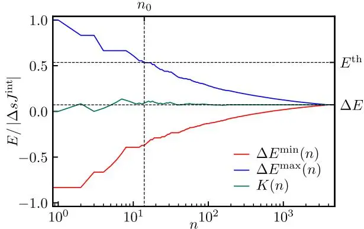
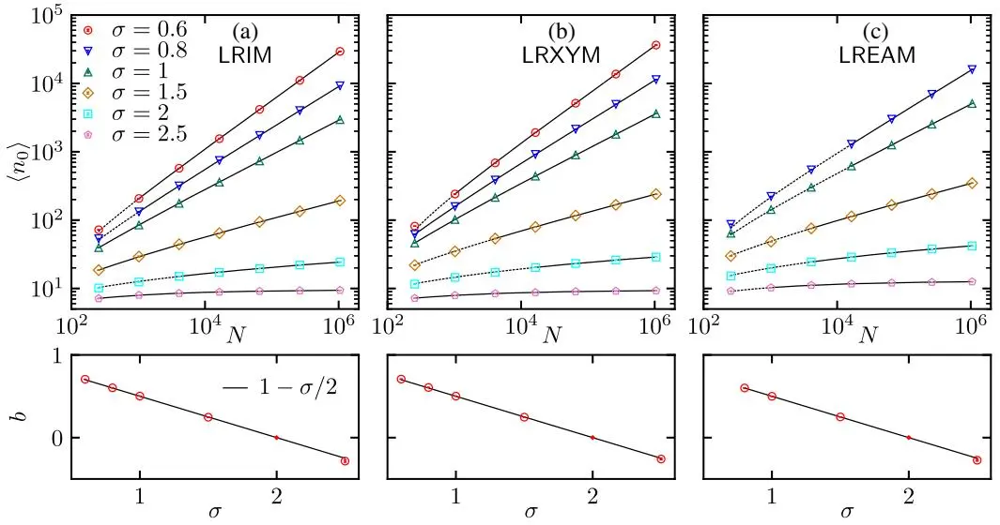
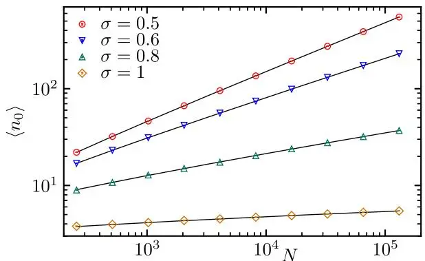
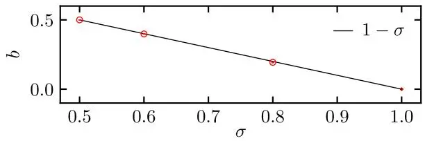
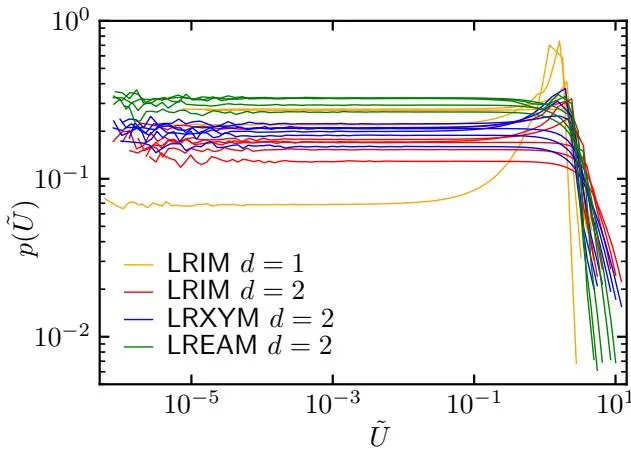

## 长程相互作用晶格系统Metropolis蒙特卡洛模拟的高效预决策方案

Fabio Müller<sup>\*</sup> 和 Wolfhard Janke<sup>†</sup>

莱比锡大学理论物理研究所，IPF 231101，德国莱比锡 04081

（2025年10月2日收稿；2026年2月17日修订；2026年4月10日接受；2026年6月2日发表）

我们提出了一种快速且通用的预决策方案，用于具有$\mathbb{N}$个组分的$d$维长程相互作用晶格模型的Metropolis蒙特卡洛模拟。对于形式为$V(r) = r^{-d - \sigma}$的势能，该方法将计算复杂度从$O(N^{2})$分别降低到$O(N^{2 - \sigma / d})$（当$\sigma < d$时）和$O(N)$（当$\sigma > d$时）。该算法已在多个${\mathrm{O}}(n)$自旋模型上实现并测试，范围从Ising模型到XY模型，再到Edwards-Anderson自旋玻璃模型。使用相同的随机数序列时，该算法能够产生与精确求和哈密顿量中所有项进行模拟完全相同的马尔可夫链。由于其通用性、简单性以及降低的计算复杂度，该算法有望得到广泛应用，从而促进对长程相互作用在晶格模型物理学中作用的深入理解，特别是在非平衡情境下。

Metropolis蒙特卡洛算法[1]可被视为研究晶格系统的主力工具，既能研究平衡性质，也能研究非平衡过程。一大类模型是${\mathrm{O}}(n)$矢量自旋模型，其各种定义能够捕捉从一级和二级相变到无限级Berezinskii-Kosterlitz-Thouless型相变乃至玻璃态行为等不同的物理现象。从非平衡视角来看，也存在一系列广泛的不同过程，这些过程可以通过Metropolis算法进行研究，并在近期引起了显著关注，例如场驱动滞后[2,3]、相序[4,5]、Kibble-Zurek机制[6]、Mpemba效应[7]等。从计算角度看，这些物理方面的研究通常局限于短程相互作用系统，因为传统上对具有$\mathbb{N}$个组分的长程相互作用系统进行模拟，其复杂度为$O(N^{2})$。这一事实严重阻碍了模拟研究，直到最近算法上的进展才缓解了这一问题，从而引发了对长程相互作用系统非平衡物理学的新一波重要见解[8-14]。这一发展的一个关键基石是我们近期提出的快速层级Metropolis算法[15]，然而该算法伴随相当高的技术开销，构成了其广泛采用的障碍。

在本快报中，我们提出了一种新的、更精简的算法。与快速层级算法[15]相反，它甚至适用于相互作用中存在随机符号的系统。在实现的技术要求方面，新算法与传统Metropolis算法相当，同时仍能显著降低计算复杂度。由于该算法使用相同的随机数序列，能够精确复现与精确评估能量值的Metropolis算法完全相同的马尔可夫链，因此所有关于所研究系统的现有物理知识都可以一对一地沿用。虽然这一特性使其在研究非平衡过程时特别有用，但该算法同样可以应用于平衡系统。复现Metropolis动力学的特性、实现的简单性以及随之而来的计算负担的巨大减少，使其成为广泛研究植根于长程相互作用系统的各种现象的一个非常有前景的候选方案。

作为原型模型，我们考虑长程O$(n)$自旋模型的三种不同变体，它们的哈密顿量形式相同：

$$
\mathcal{H} = - \frac{1}{2} \sum_{i} \sum_{j \neq i} J_{i,j} \mathbf{s}_{i} \mathbf{s}_{j}, \tag{1}
$$

其中自旋 $\mathbf{s}_{i}$ 是 $n$ 维单位向量，当 $n = 1$ 时对应伊辛模型。相互作用由下式给出

$$
| J_{i , j} | = r ( i , j )^{- d - \sigma} ,\tag{2}
$$

其中 $r ( i , j )$ 表示 $\mathbf{s}_{i}$ 与 $\mathbf{s}_{j}$ 之间的欧几里得距离，$d$ 是空间维度，$\sigma > 0$ 是可调参数，决定了相互作用的衰减速率。取绝对值 $|J_{i , j}|$ 是为了考虑反铁磁相互作用的可能性——例如出现在我们作为一个示例考虑的长程 Edwards-Anderson 自旋玻璃模型中。与我们的文献 [15] 一样，我们使用 $N = L^{d}$ 个自旋的超立方晶格，并采用 Ewald 求和 [16] 实现周期性边界条件，从而得到一组修改后的耦合参数，该参数在模拟开始时一次性确定，之后与简单的最小像约定结合使用。

为了涵盖由方程 (1) 定义的模型类中的广泛特征，我们考虑以下情况：(i) 典型的长程铁磁伊辛模型 (LRIM)，(ii) 作为最简单矢量自旋模型的长程铁磁 XY 模型 (LRXYM)，以及 (iii) 长程 Edwards-Anderson 自旋玻璃 (LREAM)，作为原型模型，其相互作用符号是在模拟开始时为每对自旋 $\mathbf{s}_{i}$ 和 $\mathbf{s}_{j}$ 独立确定的淬火随机变量。前两个系统满足平移不变性，因此可以使用单一组耦合参数 $J_{0 , k}$ 进行模拟。后者还需要一个矩阵 $\iota_{i , j}$，其中包含每对自旋相互作用的符号。

在传统实现中，Metropolis 算法基于提议-接受方案。对于当前处于能量为 $E^{\mathrm{old}}$ 的微观态的系统，提议一个能量为 $E^{\mathrm{new}}$ 的新微观态。如果满足

$$
\rho < \exp ( - \beta \Delta E ) ,\tag{3}
$$

则接受新微观态，其中 $\rho$ 是区间 $[0, 1)$ 上连续均匀分布的随机数，$\beta$ 是逆温度，$\Delta E = E^{\mathrm{new}} - E^{\mathrm{old}}$ 是与提议更新相关的能量变化。通常，对于自旋系统，一次更新只涉及单个自旋，因此在仅包含最近邻相互作用的模型中，$\Delta E$ 的计算只包含常数个、非常有限的项。对于长程 O$(n)$ 模型，由单个自旋 $\mathbf{s}_{i}$ 更新导致的 $\Delta E$ 的计算为

$$
\Delta E = E_{i}^{\mathrm{new}} - E_{i}^{\mathrm{old}} = - \Delta \mathbf{s}_{i} \sum_{j \neq i} J_{i , j} \mathbf{s}_{j} ,\tag{4}
$$

其中 $\Delta \mathbf{s}_{i} = \mathbf{s}_{i}^{\mathrm{new}} - \mathbf{s}_{i}^{\mathrm{old}}$，求和遍历系统中所有其他自旋。因此，需要对整个系统进行求和，导致每次蒙特卡洛扫描（扫描次数等于系统中包含的自旋数）的复杂度为臭名昭著的 $O(N^{2})$。然而，如文献 [15,17] 所示，这个问题在许多情况下可以绕过。通过对方程 (3) 求解 $\Delta E$ 来避免对 (4) 的完全求值

$$
\Delta E < - \frac{\ln \rho} {\beta} \equiv E^{\mathrm{th}} ,\tag{5}
$$

定义阈值能量 $E^{\mathrm{th}}$，更新超过该值时才会被接受。这使得我们可以基于严格界限 $\Delta E^{\mathrm{min}} \leq \Delta E$ 和 $\Delta E^{\mathrm{max}} \geq \Delta E$ 做出决策。如果 $\Delta E^{\mathrm{min}}$ 大于 $E^{\mathrm{th}}$，则拒绝更新；如果 $\Delta E^{\mathrm{max}}$ 小于 $E^{\mathrm{th}}$，则接受更新。根据具体情况，这些决策可以在计算量极度减少的情况下做出。在文献 [15] 中，我们基于这一思想，为晶格和非晶格系统建立了一个通用算法。这是通过利用模拟域层次空间分解的树结构实现的。在此，我们提出一个非常简化的框架，它基于部分求和与预决策方案。为了实现这一点，我们首先在 (4) 中引入一个排列 $\pi ( j )$，这允许我们重新排列求和顺序，以最好地适应我们的算法目的（在大多数情况下，这是通过将 $J_{i , j}$ 按幅度降序排序来实现的）。其次，我们将求和分为两部分，

$$
\begin{array} {r l} & {\displaystyle \Delta E = \underbrace{- \Delta \mathbf{s}_{i} \sum_{j = 1}^{n} J_{i , \pi ( j )} \mathbf{s}_{\pi ( j )}}_{K \equiv \mathrm{已知部分}} \underbrace{- \Delta \mathbf{s}_{i} \sum_{j = n + 1}^{N - 1} J_{i , \pi ( j )} \mathbf{s}_{\pi ( j )}}_{R \equiv \mathrm{剩余部分}}} \\ & {\displaystyle = K ( n ) + R ( n ) ,} \end{array}\tag{ðÞ}
$$

其中只有第一个求和 $K ( n )$ 会被显式处理，因此是精确已知的。对于 $R ( n )$ 的处理，我们引入一个额外的量

$$
U ( n ) = | \Delta \mathbf{s}_{i} | \sum_{j = n + 1}^{N - 1} | J_{i , \pi ( j )} | = | \Delta \mathbf{s}_{i} | \left[ J_{i}^{\mathrm{int}} - \sum_{j = 1}^{n} | J_{i , \pi ( j )} | \right] ,\tag{ðÞ}
$$

其中

$$
J_{i}^{\mathrm{int}} = \sum_{j \neq i} \bigl | J_{i , j} \bigr | ,\tag{ðÞ}
$$

是 $\mathbf{s}_{i}$ 与系统中所有其他自旋之间耦合的总和。由于 $J_{i}^{\mathrm{int}}$ 在模拟开始时被计算一次（事实上，对于具有周期性边界条件和平移不变性的系统，所有 $J_{i}^{\mathrm{int}}$ 都相同，因此我们只需计算一次，并简记为 $J^{\mathrm{int}} )$，因此 $U ( n )$ 可以在求和过程中与 $K ( n )$ 一起计算。我们注意到，对于 $R ( n )$ 中的每一项，有 $\mathrm{\mathbf{\tau} -} | \Delta \mathbf{s}_{i} J_{i , k} | \leq - \Delta \mathbf{s_{i}} J_{i , k} \mathbf{s}_{k} \leq | \Delta \mathbf{s}_{i} J_{i , k} |$（因为自旋是单位向量），因此

$$
\;-\; U ( n ) \leq R ( n ) \leq U ( n ) .\tag{ðÞ}
$$

现在，我们可以很容易地建立 (6) 的严格下界和上界

$$
\begin{array} {l} {\Delta E^{\mathrm{min}} ( n ) = K ( n ) - U ( n ) , \quad \text{以及}} \\ {\Delta E^{\mathrm{max}} ( n ) = K ( n ) + U ( n ) ,} \end{array}\tag{<sub>ð</sub><sub>Þ</sub>}
$$

使得可以通过在 $n_{0}$ 个求和步骤处提前终止和来实现预决策，条件是 $\Delta E^{\mathrm{min}} ( n_{0} ) \geq E^{\mathrm{th}}$（拒绝）或 $\Delta E^{\mathrm{max}} ( n_{0} ) < E^{\mathrm{th}}$（接受）。

最后，剩下的是选择一个高效的排列 $\pi ( j )$，使得式(7)中的 $U ( n )$ 尽可能快地减小。我们在此采用的最直观方法，是选取一种排列，将 $\lvert J_{i , j} \rvert$ 按单调递减顺序排列，从而在给定 $n$ 下最小化 $U ( n )$ [18]。

对于具有平移对称性的系统，明确的算法公式包含以下准备步骤：(1) 计算从位于 $\mathbf{r} = \mathbf{0}$ 的参考自旋到晶格中所有其他自旋的所有相互作用 $J_{\mathbf{0} , k}$。(2) 将这些相互作用及其对应的相对位置向量 $\mathbf{r}_{k}$ 一起存储。(3) 按相互作用强度 $| J_{\mathbf{0} , k} |$ 的降序对该列表进行排序。(4) 计算积分相互作用 $\begin{array} {r} {J^{\mathrm{int}} = \sum_{k} \left| J_{\mathbf{0} , k} \right|} \end{array}$。

由于这些步骤仅在模拟开始时执行一次，因此它们不会显著影响算法的执行时间。然而，现在必须使用 $\mathbf{r}_{j} = \mathbf{r}_{i} + \mathbf{r}_{k}$ 并考虑最小映像惯例来正确识别自旋 $\mathbf{s}_{j}$。然后，每次更新包含以下步骤：(1) 随机选择一个要更新的自旋 $\mathbf{s}_{i}$。(2) 提议一个新状态 $\mathbf{s}_{i}^{\mathrm{new}}$（对于伊辛自旋，$s_{i}^{\mathrm{new}} = - s_{i}^{\mathrm{old}} $）。(3) 随机抽取阈值能量 $E^{\mathrm{th}} ~ ( 5 ) . ~ ( 4 )$ 如果 $E^{\mathrm{th}} > \vert \Delta \mathbf{s}_{i} \vert J^{\mathrm{int}}$，则直接接受更新。(5) 继续求和，直到 (i) $\Delta E^{\mathrm{max}} ( n ) < E^{\mathrm{th}}$：接受更新；或 (ii) $\Delta E^{\mathrm{min}} ( n ) \geq E^{\mathrm{th}}$：拒绝更新。

在图1中，我们通过可视化一个示例决策过程来说明此流程。我们在图中绘制了 $K ( n )$ 以及 $\Delta E^{\mathrm{min}} ( n )$ 和 $\Delta E^{\mathrm{max}} ( n )$。可以清楚地看到，随着索引 $n$ 的增加，能量边界如何趋近 $\Delta E$ 的真实值。在这种特定情况下，由于阈值能量 $E^{\mathrm{th}}$ 与自旋翻转相关的实际值 $\Delta E$ 之间的差异相当大，因此已经在 $n_{0} = 14$ 个求和步骤（约占自旋总数的0.34%）之后就可以接受更新。

接下来，我们进行性能分析。通过算法挂钟时间的缩放来评估计算复杂度的常见方法是存在主要缺点的，因为它可能严重依赖于几个环境因素。这些因素主要是计算节点的硬件架构和配置，以及并行运行的工作负载，这可能会影响加速时钟和缓存可用性。虽然可以尝试精确重现代码运行的环境，但要以低于5%的不确定性安全评估运行时间仍然很困难。因此，我们在此采用不同的方法，通过测量每次更新所需的平均求和步骤数 $\left. n_{0} \right.$，从而得到一个与架构和环境无关的基准 [19]。



图1：$d = 2$、$\sigma = 0.6$、$N = 64^{2}$、$T = 20$ 的长程 Ising 模型预决策过程的示例说明。由于温度远高于临界温度 $T_{c}$，系统处于无序状态。绿线表示精确已知的部分 $K ( n )$，它考虑了单个相互作用 $J_{i , j} s_{i} s_{j}$ 的实际符号。红线和蓝线分别表示下界和上界 $\Delta E^{\operatorname*{min} / \operatorname*{max}} ( n ) = K ( n ) \mp U ( n )$ 的演化，根据构造，它们单调收敛到与更新相关的 $\Delta E$ 的精确值。在仅 $n_{0} = 14$ 个（共 $N - 1 = 64^{2} - 1 = 4095$ 个）求和步骤时，上界 $\Delta E^{\mathrm{max}}$ 已经低于能量阈值 $E^{\mathrm{th}}$，因此只需明确知道所有相互作用中极小的一部分即可接受该更新。

由此得到的标度分析如图2所示。分别在其转变温度下对二维 LRIM 和 LRXYM 进行基准测试，而对于二维 LREAM，我们在 LRIM 的 $0.5 T_{c} ( \sigma )$ 温度下进行模拟。我们已经验证，模拟温度的选择不影响渐近算法标度，因此模拟温度的选择对我们的分析是次要的。对于所有三种模型（LRIM、LRXYM 和 LREAM），当 $\sigma \neq 2$ 时，数据均可以拟合为如下幂律依赖关系：

$$
\langle n_{0} \rangle ( N ) = C + A N^{b} ,\tag{ðÞ}
$$

得到的指数为

$$
b = 1 - \sigma / 2 .\tag{ðÞ}
$$

通过深入分析算法性能，并考虑概率密度 $f ( n_{0} )$ 及其一阶矩 $\begin{array} {r} {\left. n_{0} \right. = \sum_{n_{0} = 0}^{N - 1} n_{0} f ( n_{0} )} \end{array}$，我们在补充材料 [20] 中给出了理论论证，指出 (12) 式中的 2 应更一般地替换为维度 $d$。这些论证与附录中 $d = 1$ 的标度行为一致。因此，对于 $\sigma = d$，我们预期存在对数发散，这一点由图2(a)–2(c)中对 $\sigma = 2$ 的三个模型所用的对数拟合 $\langle n_{0} \rangle ( N ) = C + A \ln N$ 对数据的良好描述所支持。对于 $\sigma > 2$，$\langle n_{0} \rangle$ 在大 $N$ 下趋近于常数，即在此短程类似区间内，指数 $b$ 仅起到次主导修正的作用。每个拟合的区间均单独选取，使得自由度对应的 $\chi^2$ 接近于1。所有模型及 $\sigma$ 值在所选拟合区间内的拟合结果以黑色实线显示，虚线则表示其向排除在拟合范围之外的较小 $N$ 的外推。因此我们发现，计算复杂度在很大程度上与模型无关，而前置因子则依赖于模型，变化因子小于2。对于 $\sigma \ge 1.5$，与完全计算能量差的模拟相比，即使对于 $L = 1024$，我们也观察到所需求和步数减少了3000到50000倍，由于更优的标度行为，该减少幅度会随系统尺寸增大而进一步增加。因此，在该区间内（$\mathrm{O}(n)$ 模型的平衡临界性质从短程区间交叉到长程区间 [21–28]），该算法可在数天内完成模拟，而使用朴素实现则需要数十年时间。



图2：二维 $d=2$ 情况下 (a) LRIM、(b) LRXYM 和 (c) LREAM 模型中所需平均求和步数 $\langle n_{0} \rangle$ 的标度分析。实线表示在拟合区间内对 $\langle n_{0} \rangle ( N ) = C + A N^{b}$ 的拟合，以提取渐近算法标度；虚线表示向较小 $N$ 的外推。下方面板显示了所得指数 $b$。对于预期 $b=0$ 的 $\sigma = 2$，采用了对数拟合。对于 $\sigma > 2$，当 $N \to \infty$ 时每次更新的计算量变为常数

总之，我们提出了一种用于格点系统Metropolis蒙特卡洛模拟中长程相互作用精确处理的新算法。该算法可视为一种带有自适应截断的模拟：对于每次单独更新，截断恰好选取得足够大，以便根据Metropolis准则做出正确决策。以与模型无关的方式，我们观察到每扫计算复杂度从 $O ( N^{2} )$ 降至 $0 < \sigma < d$ 时的 $O ( N^{2 - \sigma / d} )$，以及 $\sigma > d$ 时的 $O ( N )$，这意味着对于 $\sigma > d$，即使渐近性能也优于参考文献 [15] 中技术难度显著更高的算法。对于接近 $d$ 的较小 $\sigma$ 值，由于算法标度仍较弱且算法前置因子因复杂度降低而显著减小，该算法在极大系统尺寸下仍具有竞争力。对于不可积势，存在其他降低计算复杂度的替代方法 [29–31]，更详细的讨论见参考文献 [15]。

我们未研究任何动力学性质，因为Metropolis算法的决策被完全复现，因此其动力学性质也被完全保留。新方法非常易于实现，并能轻松适应其他应用场景。最后，我们在补充材料[20]中提供了可工作的实现代码，以便该领域的研究人员能够轻松采用和扩展该算法。可能的应用包括对阻挫系统的平衡态研究，目前这类系统尚缺乏高效的簇算法，例如自旋玻璃、随机场模型或偶极伊辛模型[32]。此外，该算法的特性使其非常适合用于研究非平衡过程，如相序动力学[33]、Kibble-Zurek机制[34,35]、Mpemba效应[7]以及许多其他过程[36]。

致谢——我们感谢Daniel Kloster和Henrik Christiansen的有益讨论。本项目得到了德国研究基金会（DFG）资助，资助号为No. 560547547（项目ID JA 483/36-1），以及德法高等大学（DFH-UFA）通过博士学院“L”的资助，资助号为No. CDFA-02-07。

数据可用性——支持本文结论的数据在发表时不会公开提供，因为技术不可行，且根据本研究项目的条款，准备、存储和托管数据的成本过高。如有合理请求，可向作者索取数据。

[1] N. Metropolis, A. W. Rosenbluth, M. N. Rosenbluth, A. H. Teller, and E. Teller，通过快速计算状态方程，J. Chem. Phys. 21, 1087 (1953).

[2] B. K. Chakrabarti and M. Acharyya，动态转变与滞后，Rev. Mod. Phys. 71, 847 (1999).

[3] P. L. Krapivsky, S. Redner, and E. Ben-Naim，*统计物理的动力学视角*（剑桥大学出版社，剑桥，英格兰，2010）。

[4] A. J. Bray，相序动力学理论，Adv. Phys. 51, 481 (2002).

[5] R. Livi and P. Politi，*非平衡统计物理：现代视角*（剑桥大学出版社，剑桥，英格兰，2017）。

[6] W. H. Zurek，超流氦中的宇宙学实验？，Nature (London) 317, 505 (1985).

[7] G. Teza, J. Bechhoefer, A. Lasanta, O. Raz, and M. Vucelja，非平衡热弛豫中的加速：Mpemba及相关效应，Phys. Rep. 1164, 1 (2026).

[8] H. Christiansen, S. Majumder, and W. Janke，长程伊辛模型的相序动力学，Phys. Rev. E 99, 011301(R) (2019).

[9] H. Christiansen, S. Majumder, M. Henkel, and W. Janke，长程伊辛模型中的老化，Phys. Rev. Lett. 125, 180601 (2020).

[10] R. Agrawal, F. Corberi, E. Lippiello, P. Politi, and S. Puri，低温下二维长程伊辛模型的动力学，Phys. Rev. E 103, 012108 (2021).

[11] H. Christiansen, S. Majumder, and W. Janke，二维长程伊辛模型中的零温粗化，Phys. Rev. E 103, 052122 (2021).

[12] R. Agrawal, F. Corberi, F. Insalata, and S. Puri，具有长程相互作用的伊辛铁磁体的渐近态，Phys. Rev. E 105, 034131 (2022).

[13] F. Müller, H. Christiansen, and W. Janke，二维长程伊辛模型中的相分离动力学，Phys. Rev. Lett. 129, 240601 (2022).

[14] F. Müller, H. Christiansen, and W. Janke，二维长程伊辛模型相分离过程中老化的非普适性，Phys. Rev. Lett. 133, 237102 (2024).

[15] F. Müller, H. Christiansen, S. Schnabel, and W. Janke，长程相互作用系统Metropolis蒙特卡洛模拟的快速、分层自适应算法，Phys. Rev. X 13, 031006 (2023).

[16] P. Ewald，光学和静电晶格势的计算，Ann. Phys. (Berlin) 369, 253 (1921).

[17] S. Schnabel and W. Janke，通过树数据结构和简约Metropolis算法加速聚合物模拟，Comput. Phys. Commun. 256, 107414 (2020).

[18] 在$|J_{i,j}|$中，对子序列进行额外排序以最小化缓存未命中，可进一步改善实际运行时间。

[19] 我们仔细验证过，与简单的Metropolis算法相比，由于算法程序略微复杂所导致的算法前因子增量在数量级上为1，因此可以忽略不计。

[20] 参见补充材料，网址：<http://link.aps.org/supplemental/10.1103/29yw-9grr>，其中在最小假设下推导了新方法的计算复杂度，并提供了Julia编程语言中该算法的完整实现。代码也可从 <https://gitlab.com/flabons/predecisionmetropolis> 下载。

[21] E. Luijten and H. W. J. Blöte，具有代数相互作用系统中长程与短程临界行为的边界，Phys. Rev. Lett. 89, 025703 (2002).

[22] M. C. Angelini, G. Parisi, and F. Ricci-Tersenghi，短程与长程Ising模型之间的关系，Phys. Rev. E 89, 062120 (2014).

[23] M. Picco，具有长程相互作用的Ising模型的临界行为，arXiv:1207.1018.

[24] C. Behan, L. Rastelli, S. Rychkov, and B. Zan，长程到短程交叉的标度理论及红外对偶性，J. Phys. A 50, 354002 (2017).

[25] G. Giachetti, N. Defenu, S. Ruffo, and A. Trombettoni，具有长程耦合的Berezinskii-Kosterlitz-Thouless相变，Phys. Rev. Lett. 127, 156801 (2021).

[26] C. Behan, E. Lauria, M. Nocchi, and P. van Vliet，长程Ising模型的解析与数值自举，J. High Energy Phys. 03 (2024) 136.

[27] T. Xiao, D. Yao, C. Zhang, Z. Fan, and Y. Deng，由长程相互作用诱导的二维XY铁磁体，Chin. Phys. Lett. 42, 070002 (2025).

[28] T. Xiao, Z. Liu, Z. Fan, and Y. Deng，关于长程相互作用统计模型中Sak准则的讨论，arXiv:2512.04805.

[29] B. Het´enyi, K. Bernacki, and B. Berne，多“时间步长”蒙特卡洛方法，J. Chem. Phys. 117, 8203 (2002).

[30] S. C. Kapfer and W. Krauth，用于长程系统的Cell-veto蒙特卡洛算法，Phys. Rev. E 94, 031302(R) (2016).

[31] X. Gao, S. Jiang, J. Liang, and Q. Zhou，周期性库仑系统的$\mathbb{O}$ log $\mathbb{N}$蒙特卡洛方法，arXiv:2601.09288.

[32] K. De’Bell, A. B. MacIsaac, and J. P. Whitehead，磁性薄膜和准二维系统中的偶极效应，Rev. Mod. Phys. 72, 225 (2000).

[33] A. J. Bray and A. D. Rutenberg，相序的生长规律，Phys. Rev. E 49, R27 (1994).

[34] K. Du, X. Fang, C. Won, C. De, F.-T. Huang, W. Xu, H. You, F. J. Gómez-Ruiz, A. del Campo, and S.-W. Cheong，Ising畴的Kibble-Zurek机制，Nat. Phys. 19, 1495 (2023).

[35] G. Schaller, F. Queisser, S. P. Katoorani, C. Brand, C. Kohlfürst, M. R. Freeman, A. Hucht, P. Kratzer, B. Sothmann, M. H.-v. Hoegen, and R. Schützhold，Si(001)表面各向异性Ising模型中的Kibble-Zurek动力学，Phys. Rev. Lett. 134, 246202 (2025).

[36] G. Ódor，非平衡晶格系统中的普适类，Rev. Mod. Phys. 76, 663 (2004).

### 附录

附录：$d = 1$维度的算法标度——在正文中我们指出(12)式中的分母2实际上应为$d$。为了证实这一说法，我们额外对$d = 1$维LRIM的$\left. n_{0} \right.$进行了标度分析。与$d = 2$维LRIM类似，模拟同样在$T_{c} ( \sigma )$下进行。由于$\sigma > 1$时转变温度为零，系统平衡时始终处于基态，模拟变得平凡。因此，此处我们将$\sigma$限制在$\sigma \leq 1$范围内。如图3所示，标度假设(11)式中的指数满足关系$b = 1 - \sigma$，这证实了$b$的一般表达式应为$b = 1 - \sigma / d$。





图3：$d = 1$维LRIM所需平均求和步数$\left. n_{0} \right.$的标度分析。实线表示对$\langle n_{0} \rangle ( N ) = C + A N^{b}$的拟合，此处拟合范围涵盖全部系统尺寸。下方面板显示了描述$\left. n_{0} \right.$渐近增长的幂律假设中的指数$b$。对于$\sigma = 1 = d$的情况，我们预期$b = 0$，因此采用对数形式假设。

### 附录：补充材料

## 补充材料：长程相互作用晶格系统Metropolis蒙特卡洛模拟的高效预决策方案

Fabio Müller<sup>a)</sup> 和 Wolfhard Janke<sup>b)</sup>

莱比锡大学理论物理研究所，IPF 231101，德国莱比锡 04081

(日期：2026年4月21日)

本补充材料由两部分组成。第一部分对每次更新所需求和步数的渐近标度的函数形式给出了动机说明。第二部分提供了该算法在Julia编程语言中的可运行实现。代码针对 $d = 2 \ \mathrm{LRIM}$ 的具体情况实现，但可以轻松推广到其他空间维度或序参量维度。

### I. 渐近标度律的普适性

对于 $d = 1$ 和 $d = 2$，我们在正文中已经证明每次更新所需的平均求和步数由 $\left. n_{0} \right. = C + N^{1 - \bar{\sigma_{\mathit{\mathrm{/} d}}}}$ 描述，其中 $N$ 是系统包含的自旋数，$C$ 是任意常数。特定系统在温度 $T$ 下每次更新所需的期望求和步数 $\langle n_{0} \rangle ( T )$ 必须理解为热平均，对于大多数系统而言，这在解析上是难以处理的。然而，在下面仅需少量假设的情况下，我们为上述关系的普适性提供了一个合理的推导。

作为起点，我们注意到提议更新中涉及的实际能量差 $\Delta E$ 取决于当前构型、候选自旋 ${\bf s}_{i}$ 的选择以及所选自旋的变化 $\Delta \mathbf{s}_{i} = \mathbf{s}_{i}^{\mathrm{new}} - \mathbf{s}_{i}^{\mathrm{old}}$。对于伊辛自旋，新状态总是自旋指向相反方向；而对于所有其他 ${\mathrm{O}} ( n )$ 模型，新方向是另一个独立的随机变量，典型地要么是完全随机的n维单位向量，要么是在由当前方向和适当选择的孔径角定义的受限视锥内选取的向量。与系统中所有其他自旋产生的有效场一起，$\Delta \mathbf{s}_{i}$ 从而决定了与更新相关的 $\Delta E$ 的实际值（参见正文中式(4)）。分布 $p ( \Delta E )$ 先验未知，它由温度 $T$ 下的平衡性质和更新提议的规定决定。反之，阈值能量 $\dot{\boldsymbol{E}}^{\mathrm{th}}$ 是一个独立随机变量，简单地从尺度为 $T$ 的指数分布中抽取。只有当这两个独立的随机变量非常接近时，决策通常需要非常严格的界限，因此需要非常大的 $n_{0} \sim N$


图 S1. 正文中所有设置的概率密度 $p ( \tilde{U} )$。相同颜色的不同曲线对应不同的σ值。虽然概率分布的全局形式不是普适的，但小 $\tilde{\mathbf{\nabla}} \tilde{U}$ 行为由 $p ( \tilde{U} ) = \mathrm{const}$ 普适地表征。

决策时刻界限的归一化不确定性可以通过将所需求和步数 $n_{0}$ 代入正文中式(7)并除以 $| \Delta \mathbf{s}_{i} |$ 得到：

将自身限制于按降序排列 $| J_{i , j} |$ 的 $\pi ( j )$ 并忽略任何类型的晶格效应，求和方案可被视为半径R的球壳上的求和。因此，求和索引 $j$ 可以直接与半径相关联

$$
R ( j ) \propto j^{1 / d} ,\tag{S2}
$$

包含前 $j$ 个相互作用最强的自旋的 $d$ 维球体的半径。势能参数化为 $J ( r ) \propto r^{- d - \tilde{\sigma}}$ 直接导致

$$
\begin{array} {r} {J ( j ) \propto \left( j^{1 / d} \right)^{- d - \sigma} = j^{- 1 - \sigma / d} .} \end{array}\tag{S3}
$$

将其代回 (S1) 并将求和替换为积分，我们得到

$$
\tilde{U} ( n_{0} ) \sim \int_{n_{0}}^{N} J ( j ) d j \sim n_{o}^{- \sigma / d} - N^{- \sigma / d} ,\tag{S4}
$$

从而给出 $\tilde{U}$ 与 $n_{0}$ 之间的函数关系。

我们的目的是从概率密度 $p ( n_{0} )$ 尾部的行为推导出渐近算法复杂度。结合方程 (S4)，我们需要概率密度 $p ( \tilde{U} )$ 来获取 $p ( n_{0} )$，但后者是先验未知的。在图 S1 中，我们展示了主文中所有设置下的 $p ( \tilde{U} )$，其中相同颜色的不同线条对应不同的 $\sigma$ 值。虽然不同情况下分布的整体形式不同，但总存在一个系统依赖的交叉不确定度 $\tilde{U}_{\mathrm{co}}$，低于该值时 $\tilde{p ( U} < \tilde{U}_{\mathrm{co}} \tilde{)} = \mathrm{const}$。利用 $p ( \tilde{U} )$ 在小 $\tilde{U}$ 区域的这一普适行为，并通过变量变换，我们还可以将 $n_{0} > n_{\mathrm{co}}$（其中 $n_{\mathrm{co}}$ 是对应的交叉求和索引）时的 $n_{0}$ 分布描述为

$$
p ( n_{0} > n_{\mathrm{co}} ) = p ( \tilde{U} ( n_{0} ) ) \left| \frac{d} {d n_{0}} \tilde{U} ( n_{0} ) \right| \propto n_{0}^{- 1 - \sigma / d} .\tag{S5}
$$

现在，只需将 $n_{0}$ 表示为 $p ( n_{0} )$ 的一阶矩

$$
\begin{array} {l} {\displaystyle \langle n_{0} \rangle = \sum_{n_{0} = 0}^{N} n_{0} p ( n_{0} )} \\ {\displaystyle = \sum_{n_{0} = 0}^{n_{\mathrm{co}} - 1} n_{0} p ( n_{0} ) + \sum_{n_{0} = n_{\mathrm{co}}}^{N} n_{0} p ( n_{0} )} \\ {\displaystyle \sim C^{\prime} + \int_{n_{\mathrm{co}}}^{N} n_{0}^{- \sigma / d} d n_{0}} \\ {\displaystyle \sim C + N^{1 - \sigma / d} ,} \end{array}\tag{S6}
$$

我们利用了 $p ( n_{0} )$ 尾部的函数依赖关系，并将其他一切吸收到单个常数 $C$ 中。每个蒙特卡洛扫描的计算复杂度可以通过将 (S6) 得到的渐近行为乘以 $N$ 简单获得。对于 $0 < \sigma \leq d$，主导贡献来自第二项。对于 $\sigma < d$，我们得到 $O \left( N^{2 - \sigma / d} \right)$，而对于 $\sigma = d$，(S6) 预期出现对数发散，产生 $O \left( N \right.$ log N) 复杂度。相反，对于 $\sigma > d$，(S6) 中的第二项消失，导致每次扫描的复杂度为 $O \left( N \right)$。

因此，观察到对于小的 $\tilde{U}$ 有 $p ( \tilde{U} )$ = 常数，再加上按 $J_{i , j}$ 单调递减的求和顺序大致对应于球壳求和这一事实，使我们能够从理论上推导出渐近算法规模。该推导结果与正文中的数值结果高度吻合。

```julia
import Random
"""
init_couplings_simple(L, sigma)
对于线性系统尺寸 `L` 和衰减参数 `sigma`，它返回所有可能距离矢量的相互作用矩阵 J_{i,j}。
或者，也可以加载预计算的耦合，例如由埃瓦尔德求和得到的结果。
"""
function init_couplings_simple(L, sigma)
    couplings = Array{Float64}(undef, L÷2 + 1, L÷2 + 1)
    for j = 0:L÷2, i = 0:L÷2
        r2::Float64 = j^2 + i^2
        if j==0 && i==0
            couplings[1,1] = 0
        else
            couplings[i+1,j+1] = r2 ^ (-0.5*(2+sigma))
        end
    end
    return couplings
end;
"""
用于存储排序后的耦合及其相对位置的数据类型。
"""
struct indexed_coupling
    dx::Int16
    dy::Int16
    J::Float64
end;
"""
create_sorted_couplings(couplings, N)
该函数创建所有可能耦合的列表，对其进行排序，并返回该列表以及所有耦合的总和 J^{int}。
"""
function create_sorted_couplings(couplings, N)
    sorted_couplings = Vector{indexed_coupling}([])
    index = 0
    for j = 1:N, i = 1:N
        if i===1 && j===1 # 无自相互作用
            continue
        else
            dx = i-1
            dx =dx > N÷2 ? N - dx : dx
            dy = j-1
            dy = dy > N÷2 ? N - dy : dy
            J = couplings[dx+1,dy+1]
            ic = indexed_coupling(i-1,j-1,J)
            push!(sorted_couplings,ic)
        end
    end
    sort!(sorted_couplings, by = s -> s.J, rev = true)
    J_int = 0
    for coupling in sorted_couplings[end:-1:1]
        J_int += coupling.J
    end
    return sorted_couplings, J_int
end;
"""
perform_updates!(spins, L, number_of_updates,
                 beta, integrated_coupling, sorted_couplings, rng)
执行 `number_of_updates` 次梅特罗波利斯更新。每次更新，从 `L`x`L` 方格晶格 `spins` 中随机选择单个自旋。
`beta` 是逆温度，`integrated_coupling` 是所有耦合的总和，`sorted_couplings` 是排序后的耦合列表及其相对坐标，`rng` 是所使用的伪随机数引擎。
"""
function perform_updates!(spins, L, number_of_updates,
                           beta, integrated_coupling, sorted_couplings, rng)
    summation_steps = 0
    for i = 1:number_of_updates
        accept = false
        known = 0
```

### II. JULIA 语言实现

```julia
unknown = integrated_coupling
index = 1
## 步骤 1：
spin = rand(rng, 0:L^2-1) # 随机选取自旋 s_i
x_i = 1+spin÷L # 计算其坐标
y_i = 1+spin%L
s_i = spins[x_i,y_i] # 获取其值
## 步骤 2：
new_s_i = -s_i # 对于 XY 自旋，需要抽取新的随机方向
ds = new_s_i - s_i
abs_ds = abs(ds) # 对于伊辛自旋，该值始终为 2
## 步骤 3：
e_th = -log(rand(rng))/beta # 计算自旋翻转的阈值能量，公式(5)
for sc in sorted_couplings
## 步骤 4/5
if known + unknown*abs_ds < e_th # 检查是否接受
accept = true
break
end
if known - unknown*abs_ds > e_th # 检查是否拒绝
break
end
## 步骤 5
summation_steps += 1
## 确定 s_j 的坐标，考虑周期性边界条件
J_ij = sc.J
x_j = x_i + sc.dx
x_j = x_j > L ? x_j - L : x_j
y_j = y_i + sc.dy
y_j = y_j > L ? y_j - L : y_j
## 根据公式(10)优化边界
known -= ds * spins[x_j,y_j] * J_ij
unknown -= J_ij
end
if accept == true
spins[x_i,y_i] = new_s_i
end
end
return summation_steps
end;
function main()
seed = 42
L::Integer = 128 # 晶格线性尺寸
sigma = 1.5
beta::Float64 = 1/5.582 # 此 sigma 值对应的临界温度
num_bins = 10
updates_per_bin = 1000*L^2 # 每个分箱的更新次数，用于分箱分析中的误差估计
rng = Random.Xoshiro(seed)
spins = ones(Int8, L, L) # 初始化完全有序的起始构型
couplings = init_couplings_simple(L, sigma)
sorted_couplings, J_int = create_sorted_couplings(couplings, L)
## 预平衡
perform_updates!(spins, L, updates_per_bin, beta, J_int, sorted_couplings, rng)
## 生产阶段
num_updates = zeros(Int64, num_bins)
for i = 1:num_bins
print("步骤 ", i,'/', num_bins, '\r')
num_updates[i] = perform_updates!(spins, L, updates_per_bin, beta, J_int,
sorted_couplings, rng)
end
## 分箱分析
num_updates = num_updates/updates_per_bin
average = sum(num_updates)/num_bins
print('\n',average, " ± ")
std_error_mean = (sum((num_updates .- average).^2)/(num_bins - 1)/num_bins)^0.5
println(std_error_mean)
end
main()
```

---

## 阅读笔记

### 一句话概括

本文提出一种基于**预决策（pre-decision）方案**的 Metropolis 蒙特卡洛算法，用于处理势能形式为 $V(r)=r^{-d-\sigma}$ 的长程相互作用晶格系统。该方法通过将能量差求和拆分为**已知部分 $K(n)$** 与**剩余部分 $R(n)$**，并利用严格界 $\Delta E^{\min/\max}(n)=K(n)\mp U(n)$，在仅求和前 $n_0$ 个最强耦合项后即可提前做出接受/拒绝决策。相比传统精确求和的 $O(N^2)$ 复杂度，该算法将每扫复杂度降至 $O(N^{2-\sigma/d})$（$\sigma<d$）、$O(N\log N)$（$\sigma=d$）及 $O(N)$（$\sigma>d$），且**使用相同随机数序列时精确复现原 Metropolis 马尔可夫链**（即不引入任何动力学近似）。算法已在 $d=1,2$ 维的 Ising、XY 和 Edwards-Anderson 自旋玻璃模型上验证，标度指数 $b=1-\sigma/d$ 与理论推导高度吻合。

---

### 核心论证链

**步骤 1 — 识别瓶颈并提出规避路径**
传统长程 Metropolis 模拟中，单自旋更新需计算 $\Delta E = -\Delta\mathbf{s}_i\sum_{j\neq i}J_{i,j}\mathbf{s}_j$，求和遍历所有 $N-1$ 个自旋，导致每扫复杂度 $O(N^2)$。**为什么**不能直接减少求和的项数？因为 $\Delta E$ 的精确值看似需要所有项。因此需要找到一种**不必精确计算 $\Delta E$ 就能做出正确接受/拒绝决策**的方法。

**步骤 2 — 将精确求值转化为阈值比较**
由接受准则 $\rho < e^{-\beta\Delta E}$ 解出 $\Delta E < -\ln\rho/\beta \equiv E^{\mathrm{th}}$（式 5）。**为什么**这个转化是关键？因为我们现在只需判断 $\Delta E$ 相对于 $E^{\mathrm{th}}$ 的位置，而非其精确数值。**结论**：只要能够确定 $\Delta E$ 是否小于 $E^{\mathrm{th}}$，即可完成 Metropolis 决策。

**步骤 3 — 引入求和拆分与严格上下界**
将 $\Delta E$ 拆为已知部分 $K(n)$ 和剩余部分 $R(n)$，并定义 $U(n)=|\Delta\mathbf{s}_i|\sum_{j=n+1}^{N-1}|J_{i,\pi(j)}|$（式 7）。**为什么**可以这样做？因为 $R(n)$ 中每项满足 $-|\Delta\mathbf{s}_i J_{i,k}| \leq -\Delta\mathbf{s}_i J_{i,k}\mathbf{s}_k \leq |\Delta\mathbf{s}_i J_{i,k}|$，从而 $-U(n)\leq R(n)\leq U(n)$（式 9）。**结论**：$\Delta E$ 的严格上下界为 $\Delta E^{\min/\max}(n)=K(n)\mp U(n)$（式 10），且随 $n$ 增大单调收敛到 $\Delta E$ 真值。

**步骤 4 — 建立预决策判据**
若 $\Delta E^{\min}(n_0)\geq E^{\mathrm{th}}$ 则**拒绝**（下界已高于阈值），若 $\Delta E^{\max}(n_0)<E^{\mathrm{th}}$ 则**接受**（上界已低于阈值）。**为什么**决策一定能在某个 $n_0\leq N-1$ 处做出？因为 $U(n)\to 0$ 时 $\Delta E^{\min/\max}\to \Delta E$，此时 $\Delta E$ 要么 $<E^{\mathrm{th}}$ 要么 $\geq E^{\mathrm{th}}$，必满足其一。**结论**：仅需计算 $n_0$ 项即可做出正确决策，$n_0$ 的大小决定了算法效率。

**步骤 5 — 排列优化加速界收敛**
按 $|J_{i,j}|$ 降序排列求和顺序（排列 $\pi(j)$）。**为什么**降序最优？因为 $U(n)=|\Delta\mathbf{s}_i|\left[J_i^{\mathrm{int}}-\sum_{j=1}^n|J_{i,\pi(j)}|\right]$，先取最大的 $|J_{i,j}|$ 可使 $U(n)$ 最快衰减，从而最小化 $n_0$。**结论**：排序策略决定了 $U(n)$ 的衰减速率，进而决定算法的标度行为。

**步骤 6 — 推导复杂度标度律**
将求和索引 $j$ 与球壳半径 $R(j)\propto j^{1/d}$ 关联（补充材料式 S2），利用势能 $J(r)\propto r^{-d-\sigma}$ 导出 $\tilde{U}(n_0)\sim n_0^{-\sigma/d}-N^{-\sigma/d}$（式 S4）。**为什么**需要 $p(\tilde{U})$ 分布？因为 $\langle n_0\rangle$ 是 $p(n_0)$ 的一阶矩，而 $p(n_0)$ 由 $p(\tilde{U})$ 通过变量变换求得。结合小 $\tilde{U}$ 区域 $p(\tilde{U})=\text{const}$ 的普适行为，得到 $\langle n_0\rangle\sim C+N^{1-\sigma/d}$（式 S6）。**结论**：每扫复杂度为 $O(N\cdot\langle n_0\rangle)=O(N^{2-\sigma/d})$（$\sigma<d$）；$\sigma=d$ 时对数发散 $O(N\log N)$；$\sigma>d$ 时 $O(N)$。

**步骤 7 — 多模型数值验证标度律**
在 $d=2$ 维 LRIM、LRXYM、LREAM 三个模型上，于转变温度附近观察 $\langle n_0\rangle(N)$ 的幂律标度（图 2）。**为什么**要选三个不同的模型？验证算法是否与序参量维数 $n$ 和相互作用符号随机性无关。**结论**：所有模型的指数 $b=1-\sigma/2$（$d=2$）与理论一致，$\sigma=2$ 时对数拟合验证了 $b=0$ 的预期，$\sigma>2$ 时趋近常数。$d=1$ 维额外验证（图 3）确认一般公式 $b=1-\sigma/d$。

---

### 实验参数详解

| 参数 | 数值/范围 | 含义 |
|------|-----------|------|
| $d$ | 1, 2 | 空间维度（$d=3$ 未测试） |
| $L$ | 4 至 1024 | 晶格线性尺寸，$N=L^d$ |
| $\sigma$ | 0.2, 0.5, 0.7, 1.0, 1.5, 2.0, 2.5, 3.0 | 势能衰减指数，$\sigma<d$ 为真正长程区 |
| 模拟温度 $T$ | $T_c(\sigma)$（LRIM, LRXYM），$0.5T_c(\sigma)$（LREAM） | 各模型在对应转变温度附近运行 |
| $n$（序参量维数） | $n=1$（Ising），$n=2$（XY），Edwards-Anderson | 模型类型 |
| $J^{\mathrm{int}}$ | 模拟前一次性计算 | 每个自旋与所有其他自旋的 $\lvert J_{i,j}\rvert$ 总和 |
| 每次更新求和步数 $\langle n_0\rangle$ | 因 $\sigma,N$ 而异，最小 0（直接接受），最大 $N-1$ | 算法核心效率指标 |
| 拟合区间 | 依 $\chi^2/\mathrm{dof}\approx1$ 选取 | 确定幂律标度的系统尺寸范围 |
| $\sigma=2$ 拟合 | $\langle n_0\rangle=C+A\ln N$ | 验证 $d=2$ 时 $\sigma=d$ 的对数发散 |

---

### 批判性思考

**1. 球壳连续近似与晶格离散性的偏差**：补充材料式 S2 将求和索引 $j$ 用 $R(j)\propto j^{1/d}$ 近似，但实际晶格中给定半径的格点数不是 $j$ 的连续函数——尤其在 $d=2$ 时圆环上格点数呈现阶梯状增长。该近似对 $\sigma$ 较小（长程区）时影响可忽略，但对 $\sigma\approx d$ 时 $n_0$ 较大区域的尾巴行为可能引入 $O(1)$ 量级的系统误差。

**2. $\langle n_0\rangle$ 不能完全反映实际挂钟加速比**：作者有意采用 $\langle n_0\rangle$ 而非挂钟时间以消除硬件依赖性。但 $K(n)$ 的计算涉及浮点乘加（$-\Delta\mathbf{s}_i J_{i,j}\mathbf{s}_j$）和条件分支（每次循环需比较两个界），而 $U(n)$ 仅涉及浮点减法。分支预测失败在高 $\sigma$（短程区）时频繁发生——因为 $\Delta E^{\min/\max}$ 与 $E^{\mathrm{th}}$ 接近，预决策常在最后几步才做出，分支惩罚可能使实际每秒浮点运算数显著低于峰值。

**3. 与快速层级算法 [15] 的对比缺失中间 $\sigma$ 区间的定量数据**：作者声称 $\sigma>d$ 时本文算法优于 [15]（$O(N)$ vs $O(N\log N)$），但未给出 $\sigma\approx d$ 时两种算法的 $\langle n_0\rangle$ 对比。层级算法利用树结构在 $\sigma$ 极小时可能因空间局部性获得更好的缓存性能，而本文的线性扫描全局列表在 $N=10^6$ 量级时可能遭遇 TLB 缺失瓶颈。缺少一个 $N=1024^2$、$\sigma=0.5$ 条件下的挂钟时间对比。

**4. $p(\tilde{U})=\text{const}$ 普适性的成立边界未严格划定**：补充材料的理论推导依赖于小 $\tilde{U}$ 区域 $p(\tilde{U})$ 为常数这一假设。图 S1 显示该假设在 $\tilde{U}\lesssim 10^{-2}$ 时成立，但不同 $\sigma$ 和模型的交叉尺度 $\tilde{U}_{\mathrm{co}}$ 可变化两个数量级。对于自旋玻璃（LREAM），符号随机性可能导致 $p(\tilde{U})$ 在小 $\tilde{U}$ 处出现振荡（因为 $\Delta E$ 由大量正负相消项组成），但论文未展示该模型单独的 $p(\tilde{U})$ 图。

**5. 非平衡过程中算法标度的有效性未论证**：作者强调算法复现 Metropolis 动力学，因此非平衡过程可安全使用。但文中的标度分析和 $p(\tilde{U})$ 分布均在**平衡态**附近测量。在相序动力学、Mpemba 效应等非平衡过程中，构型始终远离平衡，$\Delta E$ 的分布显著不同于平衡态，可能导致 $p(\tilde{U})$ 的小 $\tilde{U}$ 行为变化，进而影响 $\langle n_0\rangle$ 的标度指数或前置因子。这需要额外的数值验证。

**6. 晶格形状和各向异性的影响未探索**：文中使用正方形超立方晶格 + Ewald 求和。对于长方形晶格、六角晶格或存在晶格缺陷的系统，$J_{i,j}$ 的排序方案（按 $|J|$ 降序）是否仍与球壳求和近似兼容？若晶格具有强各向异性（如长程偶极相互作用），$|J_{i,j}|$ 的衰减不仅依赖于距离还依赖于方向，球壳近似失效，此时 $\langle n_0\rangle$ 的标度行为将偏离 $1-\sigma/d$。

---

### 局限性

- **仅测试 $d=1,2$，高维推广未经验证**：$d=3$ 时球壳表面积增长为 $O(R^2)$，$J(r)\sim r^{-3-\sigma}$，补充材料的积分推导虽在形式上推广到任意 $d$，但 $d=3$ 时排序列表长度 $N=O(10^6)$ 以上时的访存模式、Ewald 求和的截断参数选择均未讨论。
- **排序预处理的 $O(N\log N)$ 内存开销未量化**：需存储 $N-1$ 个 `indexed_coupling` 结构体（含两个 Int16 和一个 Float64），$N=1024^2$ 时约为 $1024^2\times(2+2+8)\approx 12\,\mathrm{MB}$，尚可接受；但 $d=3$、$L=128$ 时 $N\approx 2\times10^6$，列表大小达 $\sim 24\,\mathrm{MB}$，排序本身需 $O(N\log N)$ 时间，可能超过模拟收益。
- **仅覆盖 O$(n)$ 矢量自旋模型族**：算法核心依赖于 $|\Delta\mathbf{s}_i|$ 有限（单位向量），对于 Potts 模型（状态离散且 $|\Delta\mathbf{s}_i|$ 无自然定义）、$\phi^4$ 连续场论（场值无上界）或具有多体相互作用的模型，预决策框架不直接适用。
- **LREAM 模拟温度为 $0.5T_c$ 而非 $T_c$​**：正文指出玻璃态在 $T_c$ 处临界慢化严重，因此选择 $0.5T_c$ 运行。但玻璃态在低温下 $\Delta E$ 分布可能展宽，$p(\tilde{U})$ 的小 $\tilde{U}$ 常数区域可能缩小，导致 $\langle n_0\rangle$ 的前置因子 $A$ 相比铁磁情况增大，但作者未提供 $T_c$ 附近的对比数据。
- **Ewald 求和的具体实现和收敛精度未披露**：周期性边界条件通过 Ewald 求和预处理耦合系数，但截断半径、收敛容差、以及 Ewald 参数 $\alpha$ 的选择均未给出。不同 Ewald 参数会对 $J^{\mathrm{int}}$ 和排序列表产生 $O(10^{-6})$ 量级的扰动，可能影响预决策在 $\Delta E$ 接近 $E^{\mathrm{th}}$ 时的边界行为。
- **$\sigma>d$ 时与纯短程模拟的衔接未讨论**：$\sigma>d$ 时算法复杂度 $O(N)$，但前置因子来自整个排序列表的访存，而传统近邻列表法仅需 $O(1)$ 个邻居。文中未给出 $\sigma$ 多大时预决策方案的前置因子与近邻法相当，导致用户难以判断何时切换到更简单的短程特定算法更划算。
- **自旋玻璃中符号矩阵 $\iota_{i,j}$ 的存储开销未计入复杂度**：LREAM 需要一个额外的 $N\times N$ 符号矩阵（或等效的稀疏存储），其构建和查表开销在分析中以"模拟开始时一次性计算"一笔带过，但 $N=10^5$ 时符号矩阵本身即占 $10^5\times10^5\times1\text{bit}\approx 1.25\,\mathrm{GB}$，显著超出单个 GPU 显存或 CPU L3 缓存。

---

### 关键公式速查

- \[\mathcal{H} = -\frac{1}{2}\sum_i\sum_{j\neq i}J_{i,j}\mathbf{s}_i\mathbf{s}_j\] — 长程 O$(n)$ 模型哈密顿量，式 (1)
- \[|J_{i,j}| = r(i,j)^{-d-\sigma}\] — 势能衰减形式，式 (2)
- \[\rho < \exp(-\beta\Delta E)\] — Metropolis 接受判据，式 (3)
- \[\Delta E = -\Delta\mathbf{s}_i\sum_{j\neq i}J_{i,j}\mathbf{s}_j\] — 单自旋更新能量差，式 (4)
- \[E^{\mathrm{th}} = -\ln\rho/\beta\] — 阈值能量，式 (5)
- \[\Delta E = K(n) + R(n),\quad K(n)=-\Delta\mathbf{s}_i\sum_{j=1}^n J_{i,\pi(j)}\mathbf{s}_{\pi(j)}\] — 求和拆分为已知与剩余部分，式 (6)
- \[U(n)=|\Delta\mathbf{s}_i|\sum_{j=n+1}^{N-1}|J_{i,\pi(j)}|\] — 剩余部分的上界幅度，式 (7)
- \[-U(n)\leq R(n)\leq U(n)\] — 剩余项的严格界限，式 (9)
- \[\Delta E^{\min/\max}(n)=K(n)\mp U(n)\] — $\Delta E$ 的严格上下界，式 (10)
- \[\langle n_0\rangle(N)=C+AN^b,\quad b=1-\sigma/d\] — 平均求和步数的标度律，式 (11)(12)
- \[\tilde{U}(n_0)\sim n_0^{-\sigma/d}-N^{-\sigma/d}\] — 归一化不确定度与求和步数的函数关系，补充材料式 (S4)
- \[p(n_0>n_{\mathrm{co}})\propto n_0^{-1-\sigma/d}\] — $n_0$ 分布的尾部渐近行为，补充材料式 (S5)
- \[\langle n_0\rangle\sim C+N^{1-\sigma/d}\] — $\langle n_0\rangle$ 的渐近形式，补充材料式 (S6)

---

### 术语对照

| 中文 | 英文 | 含义 |
|------|------|------|
| 预决策方案 | Pre-decision scheme | 利用严格界在部分求和后提前做出接受/拒绝决策的算法 |
| 阈值能量 | Threshold energy $E^{\mathrm{th}}$ | 由随机数 $\rho$ 和逆温度 $\beta$ 定义的接受/拒绝能量边界 |
| 已知部分 | Known part $K(n)$ | 已显式求和的 $n$ 个最强耦合项的能量贡献 |
| 剩余部分 | Remaining part $R(n)$ | 未求和项的总能量贡献，数值未知但有界 |
| 归一化不确定度 | Normalized uncertainty $\tilde{U}$ | $U(n)/\lvert \Delta\mathbf{s}_i\rvert$，反映剩余部分的最大可能贡献幅度 |
| 最小像约定 | Minimum image convention | 周期性边界条件下取最近镜像计算粒子间距的惯用规则 |
| Ewald 求和 | Ewald summation | 处理周期性边界条件下降幂律相互作用的加和技术 |
| O$(n)$ 矢量自旋模型 | O$(n)$ vector spin model | 自旋为 $n$ 维单位向量的经典自旋模型族 |
| Edwards-Anderson 自旋玻璃 | Edwards-Anderson spin glass (LREAM) | 相互作用符号为淬火随机变量的长程自旋玻璃模型 |
| 分箱分析 | Binning analysis | 将模拟数据分成若干块以估计统计误差的方法 |
| 马尔可夫链精确复现 | Exact Markov chain reproduction | 使用相同随机数序列时，预决策算法与精确求值算法产生完全相同轨迹的性质 |
| 标度指数 | Scaling exponent $b$ | $\langle n_0\rangle\sim N^b$ 中的指数，$b=1-\sigma/d$ |

---

### 深入：预决策方案与快速层级算法的结构差异

一个值得深入理解的点：为什么本文的**一维排序列表**也能达到与 PRX [15] 中**$k$维树结构**相同的标度收益？

核心区别在于**界构造方式**：
- **树方法**：通过空间分层（将晶格递归划分为子立方体），对每个子立方体计算 $\Delta\mathbf{s}_i$ 与该立方体内所有自旋相互作用的**总和上界**。树遍历时，若整个子立方体的贡献上界仍不足以做出决策，则递归进入子节点。
- **列表方法**：通过按 $|J_{i,j}|$ 降序排序，用 $U(n)$ 直接度量**所有未处理项的最大可能贡献之和**。$U(n)$ 的衰减速度 $\sim n^{-\sigma/d}$ 源自排序顺序直接对应距离顺序——最强的相互作用来自最近的自旋。

两者共享相同的理论基础：**决策所需信息量由 $|J_{i,j}|$ 的累积分布决定**，而非由空间结构本身。树结构本质上也是按空间距离顺序访问（由近及远），但额外维护了树层的 $O(N)$ 额外存储和 $O(\log N)$ 的遍历开销。本文的洞察在于：按 $|J|$ 排序后直接线性扫描，以 $O(N\log N)$ 的一次性排序代价，换取了每步 $O(1)$ 的求和开销，且在 $\sigma>d$ 时比树方法更快（树方法即使 $\sigma>d$ 仍需遍历 $O(\log N)$ 层）。

**代价是什么？** 列表方法牺牲了空间局部性——排序后的耦合列表在物理空间中完全无序，每次访问 $J_{i,\pi(j)}$ 时对应的自旋 $\mathbf{s}_{\pi(j)}$ 在内存中随机跳跃，导致缓存未命中率远高于树方法（树方法在子立方体层次上保持空间连续性）。但作者未报告缓存性能数据，这是一个未量化的权衡。

### 延伸阅读

- **[张量网络算法：路线图](/papers/tensor-network-algorithms-a-route-map/)** — Bañuls (2023) 对张量网络算法进行了全面综述，从基本 MPS 算法（DMRG、TEBD）到高级技术（PEPS、费米子、动力学、激发态），并讨论了网络
