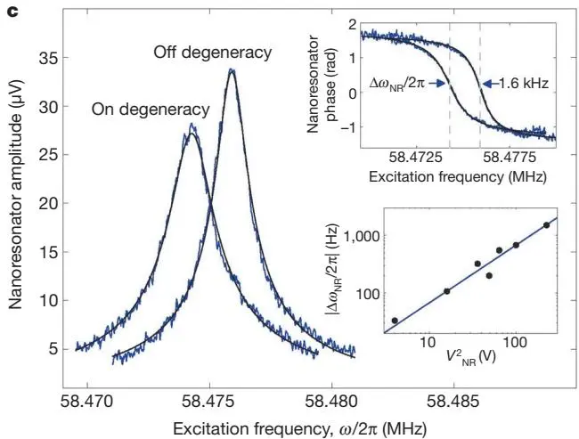
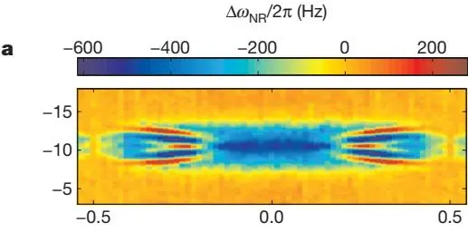
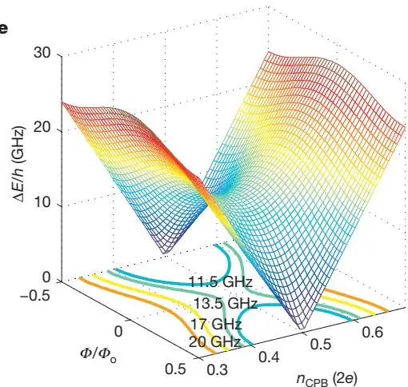
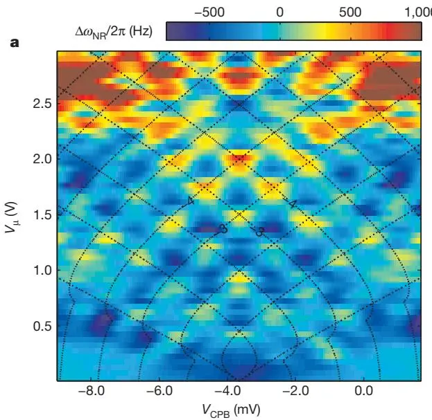

# Nanomechanical Measurements of a Superconducting Qubit
## 超导量子比特的纳米机械测量

**M. D. LaHaye, J. Suh, P. M. Echternach, K. C. Schwab, M. L. Roukes**

Caltech · Jet Propulsion Laboratory

*Nature* **459**, 960–964 (2009)

## 摘要

宏观机械结构的运动量子态的观测，仍是量子态制备与测量中一个悬而未决的挑战。一种受到广泛理论关注 [1–13] 的途径，是把超导量子比特作为控制与探测元件集成到纳米机电系统（NEMS）中。本文报告了 NEMS 谐振器与超导量子比特——Cooper-pair box（CPB）——耦合的测量。我们证明该耦合导致纳米机械频率的**色散频移**，它是腔量子电动力学（CQED）中电磁谐振器所经历的「**单原子折射率效应**」[14] 的机械 analogue。该色散相互作用的大幅值使我们能够进行**基于 NEMS 的超导量子比特光谱测量**，并观测 **Landau-Zener 干涉效应**——这是纳米机械读出量子干涉的首次演示。

---

## 背景与动机

单个原子与宏观光腔之间非共振相互作用导致的色散频移，二十多年前首次被演示 [15]，最终催生了光的量子本性的优美验证与量子退相干的深入研究 [14]。其中最令人印象深刻的包括对单个微波光子的非破坏观测 [16] 和单腔模「薛定谔猫」态的制备 [17]。超导量子比特中的类似效应也被用于探测共面波导谐振器的 Fock 态 [18] 和微波驱动 Cooper-pair box（CPB）量子比特的缀饰态 [19]。

人们早已认识到：耦合到超导量子比特的纳米机械谐振器，在形式上应与 CQED 系统（简谐振子耦合到二能级系统 [1–13]）完全等价。此外，由于典型超导量子比特与 NEMS 之间存在巨大的频率差异，一种类似于 CQED **色散极限**的耦合区间会自然存在，并能以类似方式实现高度非经典的纳米机械纠缠态 [6,11–13] 与 Fock 态 [2,7–9,11] 的制备与测量。


作为实现上述更先进方案的第一步，本文实现了 CPB 量子比特与纳米机械谐振器的**色散耦合**，并通过测量纳米谐振器的 CPB 态依赖频移，证明该相互作用与「简谐振子耦合到二能级系统」的简单图像一致。这是**机械量子系统**（mechanical quantum systems）领域的奠基实验之一。


---

## 器件与模型

### 纳米机械谐振器

纳米机械谐振器是一个悬浮氮化硅（silicon nitride）纳米结构的基频面内弯曲模（fundamental in-plane flexural mode，图 1a）。其基频响应可很好地用阻尼简谐振子描述：

- 共振频率 $\omega_{\mathrm{NR}}/2\pi = 58\,\text{MHz}$（图 1c）
- 有效质量 $M \approx 4\times 10^{-16}$ kg
- 弹簧常数 $K = M\omega_{\mathrm{NR}}^2 \approx 60\,\text{N}\cdot\text{m}^{-1}$
- 阻尼率 $\kappa = \omega_{\mathrm{NR}}/Q$，$Q$ 在 30,000 到 60,000 之间

与电磁振子类似，纳米谐振子的哈密顿量可用产生算符 $\hat{a}^\dagger$ 与湮灭算符 $\hat{a}$ 写出：

$$
\hat{H}_{\mathrm{NR}} = \hbar\omega_{\mathrm{NR}}(\hat{a}^\dagger\hat{a} + 1/2),
$$

其中模式里的量子——现在是**机械量子**——数目为 $N = \langle\hat{a}^\dagger\hat{a}\rangle$。

### Cooper-pair box 量子比特

一个分列结（split-junction）CPB 量子比特 [20]，由两个约瑟夫森隧穿结和一个超导铝环组成，通过电容 $C_{\mathrm{NR}}$ 与纳米谐振器耦合（图 1a）。CPB 用简单的自旋-1/2 哈密顿量描述 [21]：

$$
\hat{H}_{\mathrm{CPB}} = (E_{\mathrm{el}}\hat{\pmb{\sigma}}_z - E_{\mathrm{J}}\hat{\pmb{\sigma}}_x)/2,
$$

其中 $\hat{\sigma}_z$、$\hat{\sigma}_x$ 是 CPB 电荷基下的 Pauli 矩阵。第一项是静电能差 $E_{\mathrm{el}} = 8E_C(n_{\mathrm{CPB}} + n_{\mathrm{NR}} - n - 1/2)$，充电能 $E_C = e^2/2C_\Sigma$；第二项是结的约瑟夫森能 $E_J = E_{J0}|\cos(\pi\Phi/\Phi_0)|$。对角化 $\hat{H}_{\mathrm{CPB}}$ 得基态 $|-\rangle$ 与激发态 $|+\rangle$ 间隔 $\Delta E = \sqrt{E_{\mathrm{el}}^2 + E_J^2}$，$E_C/h$ 与 $E_{J0}/h$ 典型约 10 GHz。

### 耦合：电容调制

纳米谐振器的位移 $x$ 线性调制其与 CPB 间的电容：$C_{\mathrm{NR}}(x) \approx C_{\mathrm{NR}}(0) + (\partial C_{\mathrm{NR}}/\partial x)\,x$，进而通过 $n$ 与 $E_C$ 调制 CPB 的静电能，给出相互作用哈密顿量 [2]：

$$
\hat{H}_{\mathrm{int}} = \hbar\lambda(\hat{a} + \hat{a}^\dagger)\hat{\sigma}_z,
$$

其中

$$
\lambda \approx \frac{4n_{\mathrm{NR}}E_C}{\hbar}\frac{1}{C_{\mathrm{NR}}}\frac{\partial C_{\mathrm{NR}}}{\partial x}x_{zp} \tag{1}
$$

是电容耦合常数，$x_{zp} = \sqrt{\hbar/2M\omega_{\mathrm{NR}}}$ 是零点涨落。本文参数下 $|\lambda/2\pi| \approx 0.3 - 2.3$ MHz。

### 与 CQED 的形式等价

把完整系统哈密顿量 $\hat{H} = \hat{H}_{\mathrm{NR}} + \hat{H}_{\mathrm{CPB}} + \hat{H}_{\mathrm{int}}$ 变换到量子比特的能量本征基：

$$
\hat{H} = \hbar\omega_{\mathrm{NR}}\hat{a}^\dagger\hat{a} + \frac{\Delta E}{2}\hat{\sigma}_z + \hbar\lambda(\hat{a}+\hat{a}^\dagger)\left(\frac{E_{\mathrm{el}}}{\Delta E}\hat{\sigma}_z - \frac{E_J}{\Delta E}\hat{\sigma}_x\right). \tag{2}
$$


这是一个 **Jaynes-Cummings 型哈密顿量**。当量子比特与纳米谐振器大失谐（$\hbar|\lambda|\sqrt{N} \ll |\Delta E - \hbar\omega_{\mathrm{NR}}|$）时，实现**色散耦合极限**，系统发生可视为 CPB 对纳米谐振器频率的缀饰修正的能量位移 [2]。


图 1：器件与测量电路描述，以及纳米谐振器的驱动频率响应。(a) 与实测器件类似的器件的着色扫描电镜图。纳米谐振器由低应力氮化硅制成，表面覆约 80 nm 铝用于施加 $V_{\mathrm{NR}}$。CPB 与纳米谐振器在同一沉积步骤中由铝形成，置于距谐振器约 300 nm 处，互电容 $C_{\mathrm{NR}} = 43$ aF。(b) 用射频反射测量 $\Delta\omega_{\mathrm{NR}}/2\pi$ 的电路示意。(c) 纳米谐振器在 CPB 偏置于与偏离电荷简并点时的幅值（主图）与相位（上插图）随激发频率 $\omega$ 的变化。下插图：$|\Delta\omega_{\mathrm{NR}}/2\pi|$（黑圈）对 $V_{\mathrm{NR}}^2$ 的依赖，蓝线拟合 $|\Delta\omega_{\mathrm{NR}}/2\pi| = AV_{\mathrm{NR}}^2$。

---

## 主要结果

### 色散频移：单原子折射率效应的机械 analogue

在色散极限下，纳米谐振器经历的频率位移为

$$
\frac{\Delta\omega_{\mathrm{NR}}}{2\pi} = \frac{\hbar\lambda^2}{\pi}\frac{E_J^2}{\Delta E(\Delta E^2 - (\hbar\omega_{\mathrm{NR}})^2)}\langle\hat{\pmb{\sigma}}_z\rangle. \tag{3}
$$

对 $\Delta E > \hbar\omega_{\mathrm{NR}}$：CPB 处于基态（$\langle\hat{\sigma}_z\rangle = -1$）时 $\Delta\omega_{\mathrm{NR}}/2\pi < 0$，完全占据激发态（$\langle\hat{\sigma}_z\rangle = +1$）时 $\Delta\omega_{\mathrm{NR}}/2\pi > 0$。$\Delta\omega_{\mathrm{NR}}/2\pi$ 对 $\langle\hat{\sigma}_z\rangle$ 的依赖，**与 CQED 色散极限中的单原子折射位移 [14] 高度类似**。本文系统中 $\Delta E \gg \hbar\omega_{\mathrm{NR}}$，可把 $\Delta\omega_{\mathrm{NR}}/2\pi$ 完全归因于 CPB 的态依赖极化率（即「量子电容」[22,23]）。

样品冷却到 $T_{\mathrm{mc}} \approx 100 - 140$ mK（$k_BT_{\mathrm{mc}} \ll \Delta E$，量子比特主要在基态，准粒子中毒率最小 [24]）。当 $V_{\mathrm{CPB}}$ 调到电荷简并点时，纳米谐振器频率下降，幅值 $|\Delta\omega_{\mathrm{NR}}/2\pi| \approx \hbar\lambda^2/\pi E_J \approx 1600$ Hz——与式 (3) 及 CPB 处于基态一致。$|\Delta\omega_{\mathrm{NR}}/2\pi|$ 对 $V_{\mathrm{NR}}$ 呈**二次依赖**（图 1c 下插图），与式 (1)、(3) 吻合。

### 频移对 CPB 参数的依赖

把纳米谐振器嵌入锁相环，固定 $V_{\mathrm{NR}}$ 并绝热扫描 $V_{\mathrm{CPB}}$ 与 $\Phi$，可追踪 $\Delta\omega_{\mathrm{NR}}/2\pi$（图 2a）。$\Delta\omega_{\mathrm{NR}}/2\pi$ 对 $V_{\mathrm{CPB}}$ 和 $\Phi$ 的整体依赖与模型（式 (3) 及图 2b–d）**定性高度吻合**：

- 对 $V_{\mathrm{CPB}}$ 呈预期的 **period-2e 依赖**（确认了四个周期）
- 对 $\Phi$ 的周期性与**一个磁通量子** $\Phi_0$ 吻合

图 2：纳米谐振器频移作为 CPB 参数 $V_{\mathrm{CPB}}$ 与 $\Phi/\Phi_0$ 的函数。(a) $V_{\mathrm{NR}} = 7$ V、$T_{\mathrm{mc}} \approx 100$ mK 下测得的 $\Delta\omega_{\mathrm{NR}}/2\pi$。(b) 用完整 CPB 哈密顿量数值计算的 $\Delta\omega_{\mathrm{NR}}/\lambda\,2\pi$。(c)、(d) 数据（黑实线）与模型（蓝虚线）的对比。

当 $E_J/k_B \lesssim T_{\mathrm{mc}}$ 时，CPB 激发态在电荷简并点附近被热布居，$\Delta\omega_{\mathrm{NR}}/2\pi$ 的调制深度减小——可用 Boltzmann 加权平均 $\langle\pmb{\sigma}_z\rangle = -\tanh(\Delta E/2k_BT_{\mathrm{mc}})$ 解释。

### 纳米机械读出的量子比特光谱

用共振于量子比特跃迁 $\Delta E$ 的微波辐照 CPB 门，通过监测机械频移 $\Delta\omega_{\mathrm{NR}}/2\pi$ 做光谱。CPB 在 $\Delta E \approx \hbar\omega_\mu$ 时以 Rabi 频率 $\Omega_d \approx 4E_CE_Jn_\mu/\hbar\Delta E$ 在 $|+\rangle$ 与 $|-\rangle$ 间振荡。因纳米谐振器响应时间 $2\pi/\kappa$ 远长于 CPB 动力学时标，$\Delta\omega_{\mathrm{NR}}/2\pi$ 反映**平均量子比特占据** $\langle\hat{\sigma}_z\rangle = \rho_+ - \rho_-$，其中 $\rho_\pm$ 由 Bloch 方程的稳态解给出 [26]：

$$
\rho_+ = 1 - \rho_- = \frac{1}{2}\frac{\Omega_d^2 T_1 T_2}{1 + \Omega_d^2 T_1 T_2 + (\Delta E/\hbar - \omega_\mu)^2 T_2^2}. \tag{4}
$$

固定 $\omega_\mu/2\pi$ 与 $n_\mu$，扫描 $V_{\mathrm{CPB}}$ 与 $\Phi$，对 $\omega_\mu/2\pi = 10.5 - 20$ GHz 观测到 $\Delta\omega_{\mathrm{NR}}/2\pi \to 0$ 的**双曲线**——它们描出与量子比特跃迁 $\Delta E$ 的 $n_{\mathrm{CPB}}-\Phi$ 依赖一致的等能轮廓（图 3）。

图 3：用纳米机械频移作为探针的 CPB 光谱。(a–d) 施加频率 $\omega_\mu/2\pi = 11.5$ GHz (a)、13.5 GHz (b)、17 GHz (c)、20 GHz (d) 微波时测得的 $\Delta\omega_{\mathrm{NR}}/2\pi$ 对 $V_{\mathrm{CPB}}$ 与 $\Phi$ 的依赖。(e) CPB 基/激发态劈裂跃迁频率 $\Delta E/h$ 对 $V_{\mathrm{CPB}}$ 与 $\Phi$ 的曲面图，高亮了微波频率处的等能轮廓。

由此提取 $E_C/h = 12.7 - 13.7$ GHz、$E_{J0}/h \approx 13$ GHz，进而估计耦合强度 $|\lambda/2\pi| \approx 0.5 - 3$ MHz（$V_{\mathrm{NR}} = 2 - 15$ V）。量子比特线宽测量给出电荷简并点处 $T_2 \geq 2$ ns。

### Landau-Zener 干涉的纳米机械读出

在大微波幅 $V_\mu$ 下，可用 $\Delta\omega_{\mathrm{NR}}/2\pi$ 探测 CPB 中的**量子相干干涉效应**（图 4）。这些效应源于 CPB 被 $V_\mu$ 扫过电荷简并点处避免能级交叉时发生的 **Landau-Zener 隧穿** [27]。若 $T_2$ 大于微波调制周期 $2\pi/\omega_\mu$，则相继的 Landau-Zener 事件可相互干涉，导致量子比特布居 $\langle\hat{\sigma}_z\rangle$ 作为 $V_\mu$ 与 $V_{\mathrm{CPB}}$ 的函数发生**振荡**。

固定 $V_\mu$ 扫描 $V_{\mathrm{CPB}}$，清晰观测到量子干涉（图 4a）。最低 $V_\mu$ 下 Landau-Zener 隧穿被指数抑制，$\Delta\omega_{\mathrm{NR}}/2\pi$ 与 CPB 处于 $|-\rangle$ 一致；增大 $V_\mu$ 后 $\Delta\omega_{\mathrm{NR}}/2\pi$ 随 $V_\mu$、$V_{\mathrm{CPB}}$ 振荡，甚至变号。相邻干涉条纹的间距 $\Delta V_{\mathrm{CPB}}$ 随 $\omega_\mu/2\pi$ **线性增长**（图 4b, c），线性拟合给出 $E_C/h = 14.9 \pm 0.6$ GHz，与光谱提取值吻合。

图 4：用纳米机械频移作为探针的 Landau-Zener 干涉测量。(a) $\Delta\omega_{\mathrm{NR}}/2\pi$ 的干涉条纹对微波幅 $V_\mu$ 与 CPB 门电压 $V_{\mathrm{CPB}}$ 的依赖（$\omega_\mu/2\pi = 6.50$ GHz）。(b) 不同 $\omega_\mu/2\pi = 4.00 - 6.50$ GHz 下恒定 $V_\mu$ 处的截面。(c) $m=-3$ 与 $m=-4$ 等相轮廓交点处相邻干涉条纹间距 $\Delta n_{\mathrm{CPB}}$ 的线性拟合。(d) $\omega_\mu/2\pi = 6.50$ GHz、$V_{\mathrm{CPB}} = -3.66$ mV 时纳米机械频移对微波幅的依赖，展示干涉条纹的预期周期调制。

---

## 讨论与展望

对驱动与非驱动 CPB 两种情形，简单的色散模型（式 (2)）都与观测**高度吻合**。这并非理所当然：用于描述原子-光子相互作用的运动方程，竟然也适用于悬浮纳米结构与介观电子器件之间的相互作用——尤其是后者各自都包含数十亿个原子。

观测中的若干突出问题：
1. CPB 调到电荷简并点时 NEMS **阻尼增大**（额外能量损失），其依赖 $V_{\mathrm{CPB}}$ 且随 $V_{\mathrm{NR}}$ 增大，表明由 CPB 介导。
2. 电荷简并点附近观察到额外的**共振特征**（图 3），起源未明，对多光子跃迁 [19] 与 Landau-Zener 隧穿 [27] 机制都不敏感。

本文测得的色散相互作用，结合已用于操控 [28] 与测量 [18,28] 超导量子比特的技术，有望很快用于产生与探测纳米机械系统与量子比特的**纠缠态**。例如，把纳米谐振器色散耦合到一个初始制备在 $|-\rangle$、$|+\rangle$ 叠加态的 CPB，可产生以不同频率振荡的纳米谐振子相干态叠加（$\omega_{\mathrm{NR},\pm}/2\pi = \omega_{\mathrm{NR}}/2\pi \pm \Delta\omega_{\mathrm{NR}}/2\pi$）。理论 [13] 表明，在 $|\lambda/2\pi| \approx 10$ MHz 的耦合下（本文器件的适度改进即可达到）应可观测纠缠「复相」（recoherences），并要求 CPB 退相干时间 $T_2 \gtrsim 100$ ns。

---

## 结论

我们演示了用与纳米机械谐振器的色散相互作用来**读出超导量子比特**。这一技术加上基于悬臂的磁共振力探测 [30]，是仅有的两种已演示的、针对单个二能级量子系统的机械探针技术。在纳米机械谐振器中研究量子相干的现实前景，确立了「纳米谐振器耦合量子比特」作为探索量子力学前沿的有价值新工具。

---

## 参考文献


学术论文的参考文献条目按国际惯例保留原文（作者、刊名、卷期、年份），便于检索原文。以下为本文引用的主要文献。


1. Armour, Blencowe, Schwab, *Phys. Rev. Lett.* **88**, 148301 (2002). — **NEMS-CPB 纠缠与退相干的理论先驱。**
2. Irish, Schwab, *Phys. Rev. B* **68**, 155311 (2003). — **耦合 NEMS-CPB 系统的量子测量理论，本文相互作用哈密顿量的来源。**
3. Martin, Shnirman, Tian, Zoller, *Phys. Rev. B* **69**, 125339 (2004). — 机械谐振器基态冷却方案。
4. Cleland, Geller, *Phys. Rev. Lett.* **93**, 070501 (2004).
5. Tian, *Phys. Rev. B* **72**, 195411 (2005).
6. Buks, Blencowe, *Phys. Rev. B* **74**, 174504 (2006).
7. Wei, Liu, Sun, Nori, *Phys. Rev. Lett.* **97**, 237201 (2006).
8. Jacobs, Lougovski, Blencowe, *Phys. Rev. Lett.* **98**, 147201 (2007).
9. Clerk, Utami, *Phys. Rev. A* **75**, 042302 (2007).
10. Hauss et al., *Phys. Rev. Lett.* **100**, 037003 (2008).
11. Jacobs, Jordan, Irish, *Europhys. Lett.* **82**, 18003 (2008).
12. Utami, Clerk, *Phys. Rev. A* **78**, 042323 (2008).
13. Armour, Blencowe, *N. J. Phys.* **10**, 095004 (2008). — **用量子比特回波探测纳米机械相干性，本文展望的核心。**
14. Haroche, Raimond, *Exploring the Quantum: Atoms, Cavities, and Photons* (Oxford, 2006). — **CQED 经典教材。**
15. Heinzen, Feld, *Phys. Rev. Lett.* **59**, 2623 (1987). — 单原子色散频移的首次演示。
16. Guerlin et al., *Nature* **448**, 889 (2007). — 单微波光子非破坏计数。
17. Brune et al., *Phys. Rev. Lett.* **77**, 4887 (1996). — 薛定谔猫态退相干。
18. Schuster et al., *Nature* **445**, 515 (2007). — 超导电路中分辨光子数态。
19. Wilson et al., *Phys. Rev. Lett.* **98**, 257003 (2007).
20. Nakamura, Pashkin, Tsai, *Nature* **398**, 786 (1999). — **CPB 量子比特首次相干演示。**
21. Makhlin, Schön, Shnirman, *Rev. Mod. Phys.* **73**, 357 (2001). — 约瑟夫森结量子态工程综述。
22. Sillanpää et al., *Phys. Rev. Lett.* **95**, 206806 (2005). — 约瑟夫森电容的直接观测。
23. Duty et al., *Phys. Rev. Lett.* **95**, 206807 (2005). — Cooper-pair 晶体管中的量子电容。
24. Palmer et al., *Phys. Rev. B* **76**, 054501 (2007).
25. Truitt et al., *Nano Lett.* **7**, 120 (2007). — 纳米机械谐振器阵列的电容读出。
26. Schuster et al., *Phys. Rev. Lett.* **94**, 123602 (2005). — 交流 Stark 频移与退相干。
27. Sillanpää et al., *Phys. Rev. Lett.* **96**, 187002 (2006). — **CPB 中 Landau-Zener 干涉的连续监测，本文 Fig.4 的对照。**
28. Leek et al., *Science* **318**, 1889 (2007). — **固态量子比特中的 Berry 相位（本图书馆有对应笔记）。**
29. Naik et al., *Nature* **443**, 193 (2006). — 量子反作用冷却纳米机械谐振器。
30. Rugar, Budakian, Mamin, Chui, *Nature* **430**, 329 (2004). — 磁共振力显微镜探测单自旋。

---

## 阅读笔记

### 一句话概括

把一个 58 MHz 的悬浮氮化硅纳米机械谐振子，通过 43 aF 的微小电容色散耦合到一个 Cooper-pair box 量子比特；CPB 的量子态改变谐振子的频率（~1.6 kHz 的位移），作者据此实现了三件事——验证「单原子折射率效应」的机械 analogue、用机械频移读出量子比特光谱、读出 Landau-Zener 干涉条纹。这是**机械量子系统**（mechanical quantum systems）的奠基实验。

### 核心论证链

1. **形式等价**：NEMS（简谐振子）+ CPB（二能级系统）+ 电容耦合 = Jaynes-Cummings 型哈密顿量（式 2），与 CQED 形式相同。
2. **大失谐 → 色散极限**：$\Delta E \gg \hbar\omega_{\mathrm{NR}}$（CPB 能隙 ~10 GHz 远大于机械频率 58 MHz），自然进入色散区，机械频率被 CPB 态缀饰（式 3）。
3. **态依赖频移 = 量子电容**：$\Delta\omega_{\mathrm{NR}}/2\pi \propto \langle\sigma_z\rangle$，CPB 在基/激发态时机械频率下移/上移——这就是「单原子折射率」的机械版。
4. **三重验证**：(a) 频移对 $V_{\mathrm{NR}}$ 二次依赖（式 1 的 $\lambda\propto n_{\mathrm{NR}}$）；(b) 对 $V_{\mathrm{CPB}}$ 的 period-2e、对 $\Phi$ 的 $\Phi_0$ 周期；(c) 微波驱动下的光谱双曲线 + Landau-Zener 干涉条纹间距随 $\omega_\mu$ 线性增长。
5. **关键参数自洽**：从光谱提取 $E_C/h = 12.7-13.7$ GHz，从干涉条纹提取 $E_C/h = 14.9\pm0.6$ GHz，两者吻合 → 整个图像自洽。

### 关键物理：色散频移为什么是「单原子折射率」的 analogue

在 CQED 中，单个原子（二能级系统）大失谐地耦合到光腔时，原子的极化率会改变腔的有效折射率，使腔频产生依赖原子态的微小位移——这就是 Haroche 等人发展的「单原子折射率效应」[14]。本文把这个图像原封不动地搬到了机械系统：

| CQED（光学/微波） | 本文（纳米机械） |
|-------------------|------------------|
| 光腔（电磁振子） | 氮化硅纳米谐振子（机械振子） |
| 原子（二能级） | Cooper-pair box（超导量子比特） |
| 偶极耦合 | 电容耦合（位移调制电容） |
| 大失谐：$\Delta_{\mathrm{atom}} \gg \kappa$ | 大失谐：$\Delta E \gg \hbar\omega_{\mathrm{NR}}$ |
| 腔频位移 $\propto \langle\sigma_z\rangle$ | 机械频移 $\propto \langle\sigma_z\rangle$ |

关键洞察：**形式等价不依赖物理实现**。无论是电磁场还是机械振动，只要是简谐振子 + 二能级系统 + 大失谐耦合，色散频移的数学结构就完全相同。这为后续把 CQED 的全套量子探测技术（Fock 态分辨、猫态制备、量子非破坏测量）移植到机械系统铺平了道路。

### 为什么是「量子电容」而不是真空 Rabi 分裂？

本文 $\Delta E \gg \hbar\omega_{\mathrm{NR}}$（10 GHz vs 58 MHz 的 ~24 meV vs ~0.24 μeV，差 5 个数量级），处于**极深色散区**。在这个极限下，式 (3) 可简化为 $\Delta\omega_{\mathrm{NR}}/2\pi \approx \hbar\lambda^2/\pi\Delta E\cdot\langle\sigma_z\rangle$，频移完全来自 CPB 的态依赖极化率——即「量子电容」[22,23]。**观测不到真空 Rabi 分裂**，因为系统从未接近共振（共振要求 $\Delta E \approx \hbar\omega_{\mathrm{NR}}$，而 58 MHz 的机械频率远低于任何可实现的 CPB 能隙）。这是本文与后来 Pirkkalainen 2013、Gustafsson 2014（本图书馆后续笔记）的关键区别——后者通过边带技术实现了等效共振。

### 实验参数详解

| 参数 | 数值 | 含义 |
|------|------|------|
| $\omega_{\mathrm{NR}}/2\pi$ | 58 MHz | 纳米机械谐振子频率（面内弯曲基模） |
| $M$ | $\approx 4\times10^{-16}$ kg | 有效质量 |
| $K$ | $\approx 60$ N/m | 弹簧常数 |
| $Q$ | 30,000–60,000 | 品质因子（依赖温度与耦合） |
| $\kappa$ | $\omega_{\mathrm{NR}}/Q$ | 阻尼率 |
| $C_{\mathrm{NR}}$ | 43 aF | CPB-谐振子互电容 |
| CPB-谐振子间距 | ~300 nm | 决定 $C_{\mathrm{NR}}$ |
| $E_C/h$ | 12.7–13.7 GHz（光谱）/ $14.9\pm0.6$ GHz（干涉） | CPB 充电能 |
| $E_{J0}/h$ | ~13 GHz | 最大约瑟夫森能 |
| $|\lambda/2\pi|$ | 0.3–2.3 MHz（式1）/ 0.5–3 MHz（光谱） | 耦合常数 |
| $|\Delta\omega_{\mathrm{NR}}/2\pi|$ | ~1600 Hz | 电荷简并点处最大频移 |
| $T_{\mathrm{mc}}$ | 100–140 mK | 稀释制冷机混合腔温度 |
| $T_2$ | $\geq 2$ ns | CPB 退相干时间（电荷简并点） |
| $x_{zp}$ | $\sqrt{\hbar/2M\omega_{\mathrm{NR}}}$ | 机械零点涨落 |
| 驱动幅 | 1–10 pm rms | 等效 $10^3-10^5$ 量子 |

**为什么频移只有 ~1.6 kHz？** 色散频移 $\Delta\omega_{\mathrm{NR}} \sim \lambda^2/\Delta E$，是二阶效应（$\lambda \sim$ MHz，$\Delta E \sim$ 10 GHz），故 kHz 量级合理。这远小于机械线宽 $\kappa/2\pi = \omega_{\mathrm{NR}}/2\pi Q \sim 1$ kHz，刚好可分辨——这也是为什么需要 $Q \sim 30{,}000$ 的高品质因子。

**为什么 $T_2 \geq 2$ ns 这么短？** CPB 在电荷简并点对电荷噪声敏感，加上准粒子中毒 [24]。本文的 $T_2$ 比同时期 circuit QED 系统（Leek 2007 的 $T_2^{\mathrm{echo}} \approx 2\,\mu$s）短了三个数量级——这正是本文「机械读出」尚未达到量子相干操控门槛的核心瓶颈（见批判性思考 #2）。

### 三种测量模式的物理

本文用同一套色散耦合做了三种不同测量，值得厘清它们的区别：

| 模式 | CPB 状态 | 测量量 | 物理图像 |
|------|----------|--------|----------|
| **静态频移**（图 2） | 热平衡基态（无驱动） | $\Delta\omega_{\mathrm{NR}}(V_{\mathrm{CPB}}, \Phi)$ | 读出 CPB 基态的量子电容 |
| **微波光谱**（图 3） | 微波驱动到稳态 | $\Delta\omega_{\mathrm{NR}} \to 0$ 的双曲线 | 共振时 CPB 饱和（$\rho_+=\rho_-=1/2$），频移消失 |
| **Landau-Zener 干涉**（图 4） | 大幅微波扫描 | $\Delta\omega_{\mathrm{NR}}$ 的振荡条纹 | 读出相继 LZ 事件的量子干涉 |

第三种尤其精妙：它不是简单地读 CPB 的稳态占据，而是读出了 CPB 波函数的**相位演化**——条纹间距对 $\omega_\mu$ 的线性依赖直接编码了 CPB 在避免交叉处的累积相位。

### 批判性思考

**1. 「形式等价」的局限：机械耗散不可忽略。** 作者强调 NEMS-CPB 与 CQED「形式等价」，但有一处关键差异被轻描淡写：机械谐振子的 $Q$（30,000–60,000）远低于微波腔（$10^4–10^6$ 但 $\kappa$ 绝对值小）。更重要的是，作者自己观察到「CPB 调到电荷简并点时 NEMS 阻尼增大」——这意味着 CPB 给机械模式**开辟了新的耗散通道**，而 CQED 中原子对腔的耗散贡献通常可忽略。这个额外阻尼的起源未被解释，但它直接限制了未来做量子相干实验时的机械相干时间。形式等价掩盖了耗散结构的实质差异。

**2. $T_2 \geq 2$ ns 是致命短板。** 作者在展望中说「需要 $T_2 \gtrsim 100$ ns 才能观测纠缠复相」。本文实测 $T_2 \geq 2$ ns，差了 50 倍。这个差距不是「适度改进」能弥合的——CPB 的电荷噪声问题要到 transmon（2008）才根本解决。事实上，后续的机械-量子比特实验（Pirkkalainen 2013、Gustafsson 2014）都改用了 transmon 或类似的高相干量子比特，正是吸取了这个教训。本文用的是 CPB，是时代所限，但也因此其「量子相干」的承诺未能兑现。

**3. 耦合强度 $|\lambda/2\pi| \approx 0.3-2.3$ MHz 偏弱。** 作者说观测纠缠复相需要 $|\lambda/2\pi| \approx 10$ MHz（ref. 13），本文差了 5–30 倍。虽然作者预期通过缩小电极间距可提升一个数量级，但实际工程上 43 aF 的电容（对应 300 nm 间距）已经接近当时工艺极限。后来的工作通过**压电耦合**（Gustafsson 2014 用 GaAs 压电换能器）或**边带驱动**（Pirkkalainen 2013）绕过了「纯静电耦合太弱」的问题——这是对本文技术路线的隐性否定。

**4. 没有真正进入「量子」区。** 本文驱动幅 1–10 pm 对应 $10^3-10^5$ 个机械量子——机械振子完全处于**经典区**。所谓「纳米机械测量」测的是 CPB 的量子态，机械谐振子本身始终是经典探针。真正的「机械振子量子态制备」（如基态冷却、Fock 态）要等 Teufel 2011（边带冷却，本图书馆后续笔记）和 Wilson 2015。本文的价值在于**验证了耦合机制**，而非实现机械量子态——它的定位更接近「机械量子系统的开篇」，而非「量子机械系统的完成」。

**5. Landau-Zener 干涉读出的间接性。** 用机械频移读 LZ 干涉很巧妙，但条纹宽度本应能提取 $T_2$，作者却说「需要仔细考虑各时标的模型」而未给出。这说明机械读出的时间分辨率（受 $\kappa$ 限制）不足以直接分辨 $T_2$——读出的是时间平均的 $\langle\sigma_z\rangle$，而非瞬态动力学。这是色散读出的固有局限：快量子比特 + 慢振子 = 只能读平均，读不出动力学。

### 局限性

- **纯经典驱动区**：$10^3-10^5$ 量子，机械振子未进入量子区。
- **CPB 相干时间短**：$T_2 \geq 2$ ns，离量子相干操控差两个数量级。
- **耦合偏弱**：$|\lambda/2\pi| \sim$ MHz，离纠缠观测需求差一个数量级。
- **未实现机械量子态制备**：既没基态冷却，也没 Fock 态分辨。
- **额外耗散机制未明**：电荷简并点处的 NEMS 阻尼增大未解释。
- **无 SM 深入分析**：器件参数细节、电荷漂移校正都在 Supplementary Information，主文未展开。

### 关键公式速查

| 公式 | 含义 | 出处 |
|------|------|------|
| $\lambda \approx \frac{4n_{\mathrm{NR}}E_C}{\hbar}\frac{1}{C_{\mathrm{NR}}}\frac{\partial C_{\mathrm{NR}}}{\partial x}x_{zp}$ | 电容耦合常数 | 式 (1) |
| $\hat{H} = \hbar\omega_{\mathrm{NR}}\hat{a}^\dagger\hat{a} + \frac{\Delta E}{2}\hat{\sigma}_z + \hbar\lambda(\hat{a}+\hat{a}^\dagger)(\frac{E_{\mathrm{el}}}{\Delta E}\hat{\sigma}_z - \frac{E_J}{\Delta E}\hat{\sigma}_x)$ | Jaynes-Cummings 型系统哈密顿量 | 式 (2) |
| $\Delta\omega_{\mathrm{NR}}/2\pi = \frac{\hbar\lambda^2}{\pi}\frac{E_J^2}{\Delta E(\Delta E^2-(\hbar\omega_{\mathrm{NR}})^2)}\langle\sigma_z\rangle$ | 色散频移（核心可测量） | 式 (3) |
| $\rho_+ = \frac{1}{2}\frac{\Omega_d^2 T_1 T_2}{1+\Omega_d^2 T_1 T_2 + (\Delta E/\hbar-\omega_\mu)^2 T_2^2}$ | 微波驱动下 CPB 稳态占据 | 式 (4) |

### 延伸阅读

- **Irish & Schwab (2003) [2]** — 耦合 NEMS-CPB 系统的量子测量理论，本文哈密顿量的直接来源。
- **Haroche & Raimond, *Exploring the Quantum* (2006) [14]** — CQED 经典教材，理解「单原子折射率效应」的权威来源。
- **Sillanpää et al. (2006) [27]** — CPB 中 Landau-Zener 干涉的连续监测，本文图 4 的直接对照。
- **Leek et al. (2007) [28]** — 固态量子比特中的 Berry 相位（**本图书馆有对应笔记** berry-phase-solid-state-qubit），同一时期的 circuit QED 实验，$T_2^{\mathrm{echo}} \approx 2\,\mu$s，可与本文 $T_2 \geq 2$ ns 对比。
- **Naik et al. (2006) [29]** — 量子反作用冷却纳米机械谐振器，本文提到的另一条机械量子化路径。
- **后续工作（本图书馆笔记）**：
  - **Teufel et al. (2011)** — 边带冷却微机械运动到量子基态，真正实现机械振子量子态制备。
  - **Pirkkalainen et al. (2013)** — 混合电路腔 QED + 微机械谐振器，用边带技术实现等效共振。
  - **Gustafsson et al. (2014)** — 传播声子耦合人工原子，用压电耦合绕过静电耦合的强度限制。

### 术语对照

| 中文 | 英文 | 含义 |
|------|------|------|
| 纳米机电系统 | nanoelectromechanical systems (NEMS) | 纳米尺度的机械振子 + 电学读出 |
| Cooper-pair box | 库珀对盒 | 基于约瑟夫森结的超导电荷量子比特 |
| 色散耦合 | dispersive coupling | 大失谐下振子频率被二能级系统态缀饰 |
| 色散频移 | dispersive frequency shift | $\Delta\omega \propto \langle\sigma_z\rangle$ 的频率位移 |
| 单原子折射率效应 | single-atom index effect | CQED 中单原子改变腔频的经典类比 |
| 量子电容 | quantum capacitance | CPB 态依赖的极化率 |
| 真空 Rabi 分裂 | vacuum Rabi splitting | 共振耦合下的能级劈裂（本文未观测到） |
| Jaynes-Cummings 模型 | Jaynes-Cummings model | 二能级 + 简谐振子的标准模型 |
| 电荷简并点 | charge degeneracy point | $E_{\mathrm{el}} = 0$，CPB 对电荷噪声最不敏感 |
| 避免能级交叉 | avoided level crossing | 能级不相交，Landau-Zener 隧穿的前提 |
| Landau-Zener 隧穿 | Landau-Zener tunnelling | 扫过避免交叉时的非绝热跃迁 |
| Landau-Zener 干涉 | Landau-Zener interference | 相继 LZ 事件的量子干涉 |
| 射频反射测量 | radiofrequency reflectometry | 通过反射射频信号读出阻抗变化 |
| 零点涨落 | zero-point fluctuation $x_{zp}$ | 量子基态的位移涨落 |
| 准粒子中毒 | quasiparticle poisoning | 准粒子进入 CPB 破坏电荷态 |
| 退相干时间 | dephasing time $T_2$ | 量子比特相位相干保持时间 |
| 弛豫时间 | relaxation time $T_1$ | 量子比特能量弛豫时间 |
| 纠缠复相 | recoherence | 纠缠态周期性恢复相干（本文展望） |
