## 统一超辐射相变

Jie Peng,1,$^{2}$ Enrique Rico,2,$^{3}$ Jianxin Zhong,$^{1}$ Enrique Solano,2,3,$^{4}$ 和 I˜nigo L. Egusquiza$^{5}$

$^{1}$湖南微纳能源材料与器件重点实验室暨物理与光电工程学院，湘潭大学，湖南 411105，中国

$^{2}$巴斯克大学物理化学系 UPV/EHU，Apartado 644，E-48080 Bilbao，西班牙

$^{3}$IKERBASQUE，巴斯克科学基金会，Maria Diaz de Haro 3，E-48013 Bilbao，西班牙

$^{4}$上海大学物理系，上海 200444，中国

$^{5}$巴斯克大学理论与科学史系 UPV/EHU，Apartado 644，E-48080 Bilbao，西班牙

我们通过统一处理证明，简单光-物质模型中 Dicke 模型和经典振子极限的超辐射相变确实属于同一类型。我们证明平均场近似在这两种情形下都是精确的，并计算了参数空间中相变的结构和位置。我们将这一研究扩展到更广泛的模型范围，特别关注对称性考量。我们揭示了这些模型参数空间中相结构的一般特征。

引言.– 自从 Dicke 的开创性发现——局域辐射气体的超辐射态 [1]——以来，超辐射这一概念得到了积极研究。在超辐射态中，平均光子数是宏观的，即在极限 $N \to \infty$ 下比值 $\langle a^{\dagger} a \rangle / \bar{N}$ 有限，其中 N 是参与原子的数量。超辐射相变（SPT）的存在已在 Tavis-Cummings 模型 [4] 中得到严格证明 [2, 3]，该模型描述了 N 个自旋通过偶极耦合与单个玻色子模式的相互作用，但将其限制在旋波近似（RWA）下。这些早期工作还考虑了扩展到多模情形、超越 RWA 的情况以及一系列类似模型 [5–12]。

一个较新的进展是认识到，在另一种极限下也存在类似的相变，在 Rabi 模型情形中，这对应于光子频率相对于量子比特频率趋于零 [13–18]。这一极限被理解为经典振子 [13]。这些相变在零温度下实现 [19]，因此原则上属于量子相变（QPT）[20] 的范畴（不过关于这一点参见文献 [19] 的讨论）。随着理论发展，实验上实现至少部分这些相变也引起了浓厚兴趣 [21, 22]。

在本文中，我们提出对一大类模型 [23–31] 中 SPT 的统一处理方法，包括热力学极限和经典振子极限。在所有这类模型中，自由哈密顿量（倾向于正常相）与相互作用（当其增强时产生超辐射相）之间存在竞争。此外，在所有这类模型中，玻色子的平均场近似 [6] 在相应极限下是精确的。然后通过分析朗道势的极值来研究物理相。序参量是宏观玻色子期望数。底层哈密顿量的对称性（或缺乏对称性）将在朗道势中显现，而二级和一级超辐射相变的存在将直接与之相关。

统一分析.– 我们提出对 Dicke 模型热力学极限和量子 Rabi 模型经典振子模型及其 SPT 的统一处理。因此，我们首先考虑模型族（$\hbar = 1$）

$$
H = \omega a^{\dagger} a + \sum_{i = 1}^{N} \frac{g} {\sqrt{N}} \sigma_{ix} ( a + a^{\dagger} ) + \sum_{i} \Delta \sigma_{iz} .\tag{1}
$$

和通常一样，$a$ 和 $a^{\dagger}$ 表示玻色子模式（“光子”）的湮灭和产生算符，而泡利矩阵则带有自旋指标。该模型族的参数包括 $\omega$（光子能量）、$\Delta$（自旋能量）、$g$（耦合强度）和 $N$（自旋数），此外可能还有逆温度 $\beta = 1 / k_{B} \dot{T}$。我们此后将这一模型称为迪克-量子拉比 (DQR) 模型。

在热力学极限下的 DQR 模型中，序参量为比率 $\langle a^{\dagger} a \rangle / N$。如果该比率在 $N \to \infty$ 极限下，对于热态或基态是有限的，则表明超辐射相的存在。

现在我们致力于识别参数空间中的区域，这些区域可以理解为参数空间上某个函数 C 的无限水平集，并且其中比率 $\langle a^{\dagger} a \rangle / C$ 充当序参量，这一思路最初在文献 [19] 中有所暗示。因此，我们将哈密顿量改写为如下形式：

$$
H = \Delta \sum_{i = 1}^{N} \left[ {\frac{\omega C} {N \Delta}} {\frac{a^{\dagger} a} {C}} + {\frac{g \sqrt C} {\sqrt N \Delta}} \sigma_{ix} {\frac{( a + a^{\dagger} )} {\sqrt C}} + \sigma_{iz} \right] .\tag{2}
$$

如果确实存在相变，上述表达式中的三项都必须出现，否则就无法产生解释相变所需的竞争。此外，需要在假设 $\langle a^{\dagger} a \rangle / {\dot{C}}$ 为序参量的情况下检验它们。这等价于要求当 $C \to \infty$ 时，有效耦合 $\Omega = \omega C / N \Delta$ 和 $\gamma = g \sqrt{C} / \Delta \sqrt{N}$ 趋向于有限值。

因此，感兴趣的参数空间区域由函数 $C = \Omega ( N \Delta / \omega ) \infty$ 给出，其中 $\Omega$ 为有限非零量，同时 $g^{2} / \omega \Delta$ 保持有限。达到该区域的一种方法是令 $N \to \infty$，同时保持其他所有参数有限；这对应于通常的热力学极限。另一种方法，即经典谐振子极限，则通过考虑 $\Delta / \omega \infty$ 以及 $g / \omega = ( \gamma / \sqrt{\Omega} ) \sqrt{\Delta / \omega} \infty$ 来实现，同时 $\gamma$ 和 $\Omega$ 以及 $N$ 均为有限。这一分析可以推广到有限温度情形 [32]。

热力学极限和经典谐振子极限都包含在参数组合 $N \Delta / \omega$ 的无穷水平集中，并且在该水平集上由平均场近似决定。也就是说，在该极限下，平均场配分函数 $\tilde{Z}$ 与完整配分函数 $Z$ 相等。更具体地说，平均场约化自由能 $\tilde{f} = - \ln \tilde{Z} / \beta N \Delta$ 和完整约化自由能 $f = - \ln Z / \beta N \Delta$ 精确到 $O ( \omega / N \Delta )$ 量级 [32]。

基于这一结果，在相关极限 $\omega / N \Delta \mathrm{~ ~ {~ ~} ~} 0$ 且 $g^{2} / \omega \Delta$ 有限的情况下，基于平均场近似进行相分析是精确的。对于当前哈密顿量 (1)，平均场配分函数计算为 $\tilde{Z} =$ $\sqrt{N \Delta / \pi \beta \omega^{2}} \int_{- \infty}^{+ \infty} \mathrm{d} u \exp \left[ - \beta N \Delta \phi ( u ) \right]$，其中 $\phi ( u ) =$ $u^{2} \ : - \ : \ln \left. 2 \cosh \left( \beta \Delta \sqrt{1 + 4 \gamma^{2} u^{2}} \right) \right. / \beta \Delta$ 扮演朗道势的角色。最后这一结论源于在 $\beta N \Delta \infty$ 极限下，该积分可以很好地近似为 $\exp \left[ - \beta N \Delta \phi ( u_{\mathrm{min}} ) \right]$，其中 $u_{\mathrm{min}}$ 是 $\phi ( u )$ 全局最小值的位置。换句话说，$f = - \ln \tilde{Z} / \beta N \Delta \approx \phi ( u_{\mathrm{min}} )$。注意 $\beta N \Delta =$ $\beta \omega ( N \Delta / \omega )$，因此只要 $\beta \omega \neq 0$，我们一开始考虑的极限就保证了可以通过拉普拉斯方法进一步近似该积分。

每个相关相的超辐射或正常特性由序参量 $\langle a^{\dagger} a \rangle / ( \bar{N} \Delta / \omega )$ 决定，它可以通过平均场预言很好地近似为 $\omega \partial_{\omega} f ~ = ~ \omega \partial_{\omega} \phi ( u_{\mathrm{min}} )$。由于 $\omega \partial_{\omega} \gamma ~ =$ $- \gamma / 2$ 且 $\gamma \partial_{\gamma} \phi ( u ) = u \phi^{\prime} ( u ) - 2 u^{2}$，我们得到

$$
\frac{\langle a^{\dagger} a \rangle} {N \Delta / \omega} \approx - \frac{\gamma} {2} \partial_{\gamma} \phi ( u_{\mathrm{min}} ) = u_{\mathrm{min}}^{2} .\tag{3}
$$

因此，若朗道势 $\phi ( u )$ 的全局最小值为零，系统处于正常相；若原点不再是全局最小值，则系统处于超辐射相。分隔这两个区域的临界线由 $\tanh (\beta \Delta) - \frac{1}{2\gamma_{c}^{2}} = 0$ 给出。对于小于该方程确定临界耦合 $\gamma_{c} (\beta \Delta)$ 的耦合强度，系统处于正常相；而对于 $\gamma > \gamma_{c}$，则处于超辐射相。接近临界点时，$u_{\mathrm{min}}^{2}$ 与 $\gamma - \gamma_{c}$ 成正比，该相变为二级相变。注意，在这一统一处理中，我们既重现了 $N \to \infty$ Dicke SPT [5]，也重现了量子拉比经典振子 SPT [15]。

对称性.– 哈密顿量 (1) 具有 $\mathbb{Z}_{2}$ 对称性这一事实体现在 $\phi(u)$ 为偶函数上。这连同连续性以及 $\breve{u^{2}}$ 在 $|u|$ 较大时成为 $\phi(u)$ 的主导项，完全确定了相变为二级相变。为更好地建立 $\mathbb{Z}_{2}$ 对称性与朗道势为偶函数之间的联系，我们考虑 DQR 模型的单模非均匀各向异性扩展，

$$
\begin{array} {r l r} {H = \omega a^{\dagger} a + \sum_{i = 1}^{N} [ \frac{g_{i}} {\sqrt{N}} ( a^{\dagger} \sigma_{i}^{-} + a \sigma_{i}^{+} ) + \frac{g_{i} \lambda_{i}} {\sqrt{N}} ( a \sigma_{i}^{-} + a^{\dagger} \sigma_{i}^{+} )} \\ & {} & {+ ~ \Delta_{i} \sigma_{iz} ] . \quad ( 4 )} \end{array}
$$

我们将此模型称为非均匀模型，因为不同量子比特的偶极耦合常数 $g_{i}$ 不同，自旋能 $\Delta_{i}$ 和各向异性参数 $\lambda_{i}$ 也不同。这些各向异性体现在旋转项和反旋转项的不同呈现方式上。在一般情况下（至少对于一个 $i$ 值有 $\lambda_{i} \neq 0$），该模型具有 $\mathbb{Z}_{2}$ 对称性，其非平凡群元为 $\Pi = \exp [ i \pi ( a^{\dagger} a + \textstyle \sum_{i}^{N} ( 1 + \sigma_{iz} ) / 2 ) ]$。由于对于相干态 $| \overline{{{\alpha}}} \rangle$，有 $\langle \alpha | \Pi H \overline{{{\Pi}}} | \overline{{{\alpha}}} \rangle^{\prime} = U \langle - \overline{{{\alpha}}} | \bar{H} | - \alpha \rangle U^{\dagger}$，其中 $U =$ $\begin{array} {r} {U^{\dagger} = \prod_{i = 1}^{N} \sigma_{i}^{z}} \end{array}$ 是幺正的，因此平均场朗道势是 α 的偶函数。

令 ∆ 为集合 $\{\Delta_{i}\}$ 的某个正广义平均值。那么如前所述，平均场近似在 $N \Delta / \omega \to \infty$ 极限下渐近精确，并且相图同样由平均场朗道势决定。如文献 [32] 所示，在这个极限下确实存在 $\mathrm{SPT}$，它们都是二级相变且属于平均场类型，伴随着 $\mathbb{Z}_{2}$ 对称性破缺。对于有限的 $N \Delta / \omega \gg 1$，平均场方法仍然近似有效，且 $\mathbb{Z}_{2}$ 对称性应得以保持。因此，基态在有限 N 下将近似呈现为“薛定谔猫”态的形式 [32]。注意，该模型将 DQR 哈密顿量 (1) 作为一个特例包含在内。如果对所有 i 都有 $\lambda_{i} = 0$，即非均匀 Tavis–Cummings 模型，则会出现一种非常不同的对称性：即由守恒量 $a^{\dagger} a + \textstyle \sum_{i}^{N} ( 1 + \sigma_{iz} ) / 2$ 生成的 $U ( 1 )$ 对称性。在这种情况下，朗道势仅通过 $| \alpha | ^{2}$ 依赖于 α，这反映了潜在的连续对称性，而二级 SPT 的自发对称性破缺将伴随着戈德斯通模的出现 [32]。

为了强调对称性的作用，考虑在之前的哈密顿量中添加静态偏置 $\epsilon_{i} \sigma_{ix}$ 来显式破坏 $\mathbb{Z}_{2}$ 对称性。在这种情况下，正如预期，不存在 SPT，而是序参量随耦合强度连续增加 [32]。

无对称性的一级 $\mathrm{SPT}$ – 由序参量控制的二级相变需要破缺某种对称性。然而，一级相变的发生并非如此。为在当前背景下说明这一论断，考虑将 QRM 哈密顿量均匀地扩展，加入一个双光子耦合项 [33, 34]，

$$
H = \omega a^{\dagger} a + \sum_{i = 1}^{N} [ \sigma_{ix} [ \frac{g} {\sqrt{N}} ( a + a^{\dagger} ) + \frac{g^{\prime}} {N} ( a^{2} + ( a^{\dagger} )^{2} ) ] + \Delta \sigma_{iz} ] .\tag{5}
$$

系统的稳定性要求$g^{\prime} / \omega \ < \ 1 / 2 [ 35 .$ 36]。在一般情况下$g , g^{\prime} \neq 0$，该哈密顿量不具有对称性。遵循现已成熟的常规方法，我们得到约化自由能作为势函数$\phi ( u ) ~ = ~ u^{2} ~ \stackrel{\sim} {-} ~$ $\begin{array} {r} {\frac{1} {\beta \Delta} \ln \left\lceil 2 \cosh \left( \beta \Delta \sqrt{1 + \left[ 2 \gamma u + 2 \gamma^{\prime} u^{2} \right]^{2}} \right) \right\rceil} \end{array}$的全局最小值，其中$\gamma =$ $\frac{g} {\sqrt{\Delta \omega}}$，$\gamma^{\prime} \overset{^{\mathrm{~ \textstyle ~ ~}}} {=} g^{\prime} / \omega \left[ 32 \right]$。对称性的缺失体现在朗道势在一般情况下不是偶函数。尽管如此，$u = 0$始终是一个极值点，并且在$\gamma$和$\gamma^{\prime}$接近0时确实是全局最小值。进一步分析发现，参数空间中存在一个临界区域，将正常相和超辐射相区分开来，该区域由$\phi ( u ) = \phi ( 0 )$和$\phi^{\prime} ( u ) = 0$同时存在非零解决定。当$\beta \Delta \to \infty$时，该方程组变为代数方程，可以确定显式临界线$2 \gamma^{2} + 4 \gamma^{\prime 2} = 1$，这与单量子比特的量子相变情况一致[33]。我们在图1(a)中给出了一般情况的相图。由于缺乏对称性，该相变必须是一级相变，并且对于$\beta \Delta \to \infty$的情况，这一点确实得到了验证，因为刚好在临界线上方，重标度光子数$\bar{u} ( \gamma_{c} , \gamma_{c}^{\prime} )_{\mathrm{min}}^{2} = ( 2 \gamma_{c}^{\prime} / \gamma_{c} )^{2} \neq 0$，如图1(b)所示。

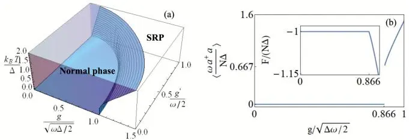

图1. (a)热力学极限下包含单光子和双光子项的Dicke模型的相图。(b)有限温度$\omega / k_{B} T \ne 0$、$\begin{array} {r} {g^{\prime} / \omega = 0.25 , \frac{g} {\sqrt{\Delta \omega / 2}} =} \end{array}$ 0.866且$\langle a^{\dagger} a \rangle_{c} / C = 2 / 3$时经典振子极限下的重标度平均光子数。所有临界量均由解析预测得到，并与数值结果吻合。

相图的一般结构.– 现在我们给出一个具有离散对称性的模型，该模型同时存在连续和不连续的对称性保护拓扑相，并用它来说明所考虑的一族模型相图的一般性质。具体而言，我们现在研究两个自旋，除了与光子模式偶极耦合外，还存在XYZ自旋-自旋相互作用[37]，并具有$\mathbb{Z}_{2}$对称性，

$$
H = \omega a^{\dagger} a + \sum_{j = 1 , 2} [ g_{j} \sigma_{jx} ( a + a^{\dagger} ) + \Delta_{j} \sigma_{jz} ] + \sum_{\alpha = x , y , x} J^{( \alpha )} \sigma_{1 \alpha} \sigma_{2 \alpha} .\tag{6}
$$

我们在经典振子极限 $\Delta / \omega \to \infty$ 下研究其相图。从配分函数 $Z = \exp \left( - \beta \Delta f \right)$ 定义约化自由能 $f$，根据当前标准假设，它将在朗道势 $\phi ( u ) = u^{2} + \lambda ( u )$ 的全局最小值处确定为 $\phi ( u_{\mathrm{min}} )$，其中 $\lambda ( u )$ 是两自旋算子 $\begin{array} {r} {h ( u ) = \sum_{j = 1}^{2} [ 2 \gamma_{j} u \sigma_{jx} + \delta_{j} \sigma_{jz} ] +} \end{array}$ $\scriptstyle \sum_{\alpha = x , y , z} \epsilon_{\alpha} \sigma_{1 \alpha} \sigma_{2 \alpha}$ 的最小本征值，此处 $\Delta$ 是 $\{\Delta_{j} \}$ 的某个正广义均值，$\gamma_{j} = {g_{j}} / {\sqrt{\Delta \omega}} , \delta_{j} = \Delta_{j} / \Delta , \epsilon_{\alpha} = J^{( \alpha )} / \Delta$，而序参量 $\omega \langle a^{\dagger} \dot{a} \rangle / \Delta$ 被计算为 $u_{\mathrm{min}}^{2}$。

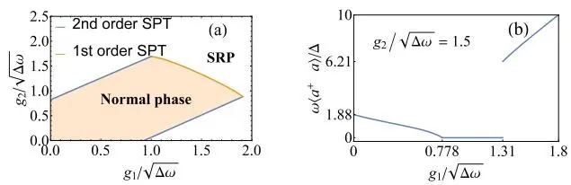

图2：具有 XYZ 自旋-自旋相互作用的非等同两量子比特拉比模型。${\Delta_{1}} / {\Delta} = 3 , {\Delta_{2}} / {\Delta} = 2 , {J^{x}} / {\Delta} = 3 , {J^{y}} / {\Delta} =$ 2, $J^{z} / \Delta = 1$。(a) 任意有限温度 $\omega / k_{B} T \ne 0$ 下的相图。(b) 在任意有限温度 $\omega / k_{B} T \ne 0$ 下，对于 $\begin{array} {r} {\frac{g_{2}} {\sqrt{\Delta \omega}} = 1.5} \end{array}$ 的重标光子数。

因此，感兴趣的相空间是七维的，而我们考察由偶极耦合控制的二维截面，这些耦合被组织成向量 ${\vec{\gamma}}$。在一般截面上，会出现连续和不连续相变。原点 $\vec{\gamma} = 0$ 始终处于正常相，因为有效哈密顿量 $h ( u )$ 此时与 $u$ 无关。此外，由于朗道函数呈现为 $\phi ( u ) = u^{2} + f ( u \vec{\gamma} )$，其中 $f$ 是多个（此处为两个）变量的函数，我们看到在临界点 $u_{*}$ （满足 $\phi^{\prime} ( u_{*} ) = 0$）处有 $\vec{\gamma} \cdot \nabla_{\gamma} \phi ( u_{*} ) = - 2 u_{*}^{2}$。因此，对于非零临界点，该值为负。另外，由于 $h ( u )$ 是有界算子，可以看出对于大的 k\~γk，$\phi$ 的最小值可近似位于 $| \gamma_{1} | + | \gamma_{2} |$ 处，从而预测系统将处于超辐射相。由此可知，原点周围存在一个正常相区域，并且其边界（即临界线）法向量的径向分量不为零。

对于固定的 $\vec{\delta} , \{\epsilon_{\alpha} \}$，可以通过多种方法判断在 $\vec{\gamma}$ 平面给定方向上的相变是一阶还是二阶。首先，$\phi ( u )$ 在零点的二阶导数可以通过二阶微扰计算获得。如果随着 $\| \vec{\gamma} \|$ 沿固定方向增大，$\phi^{\prime \prime} ( 0 )$ 不变号，则该方向上的相变必定是不连续的。另一方面，由于如果在 $u$ 空间中存在点 $u_{s} \neq 0$ 使得 $\phi ( 0 ) = \phi ( u_{s} )$，则原点不能是（唯一的）全局最小值，故需分析此方程。当将此方程代入 $h ( u )$ 的久期方程时，可得变量 $u_{s}^{2}$ 的三次方程。对其判别式的研究为我们提供了解的存在性和类型的判据，从而确定相变的位置和性质。实际上，量 $\phi^{\prime \prime} ( 0 )$ 将决定三次方程在原点的值，从而将两种方法联系起来。

注意，在任何情况下，我们上述讨论所依赖的相空间中都存在对称性。因此，由于初始哈密顿量的 $\mathbb{Z}_{2}$ 对称性，有效自旋哈密顿量 $h ( u )$ 与 $h ( - u )$ 是等谱的。这导致了相空间关于 $\vec{\gamma} - \vec{\gamma}$ 的对称性。还可以类似地识别出相空间的其它对称性。例如，在变换 $\vec{\delta} - \vec{\delta}$ 下等。

我们在图2中通过描绘一个 $\vec{\gamma}$ 平面截面来展示这一般分析。

我们由此看到，在包含偶极耦合到玻色子模式的一般自旋模型中，若存在对称性，则在偶极耦合空间的原点附近会存在一个正常相区域，并且通常沿着径向流向超辐射相。边界一般由一阶和二阶相变线的片段构成。

多模 DQR 模型 —— 在上述单模分析中，我们观察到通过逐步增强一个偶极耦合，系统可能从超辐射态过渡到正常态，再回到超辐射态。因此，利用多量子比特系统，我们可以获得一系列相变序列，其实验实现将极具意义。

尽管玻色子模式和自旋角色的根本不同，但上述事实表明，扩展到多个玻色子模式（以下称多模）可能为我们提供丰富的现象学，甚至更易于实验实现。事实上，具有偶极耦合的多模模型可以利用本文提出的技术进行分析[32]，并且将出现超辐射相。

特别地，让我们考察以下哈密顿量：

$$
H = \sum_{\nu = 1}^{M} \omega_{\nu} a_{\nu}^{\dagger} a_{\nu} + \sum_{i = 1}^{N} \sum_{\nu = 1}^{M} \frac{g_{\nu}} {\sqrt{N}} \sigma_{ix} ( a_{\nu} + a_{\nu}^{\dagger} ) + \sum_{i = 1}^{N} \Delta_{i} \sigma_{iz} .\tag{7}
$$

在这种情况下，量子比特的偶极耦合是均匀的。即使情况并非如此，也很容易观察到存在一个$\mathbb{Z}_{2}$对称性，其生成元为$\Pi =$ exp $\left\{i \pi \left[ \sum_{\nu} a_{\nu}^{\dagger} a_{\nu} + ( 1 / 2 ) \bar{\sum_{i}} \left( 1 + \sigma_{iz} \right) \right] \right\}$。此外，如果偶极耦合矢量为零，系统处于正常相。按照先前分析的步骤，我们识别出一组序参量 $\omega_{\nu} \langle a_{\nu}^{\dagger} a_{\nu} \rangle / N \Delta .$，其中$\Delta$是自旋频率$\Delta_{i} = \Delta \delta_{i}$的某种平均值。类似地，我们得到一个关于$M$个变量$\{u_{\nu} \}_{\nu = 1}^{M}$的朗道函数，其全局最小值决定了相。实际上，这些变量在朗道函数中仅通过组合$\vec{u}^{2}$和${\vec{\gamma}} \cdot{\vec{u}}$出现（这里我们使用向量符号表示相应的$M$维对象），其形式为$\phi ( \vec{u} ) = \vec{u}^{2} - s \left. \left( \bar{\gamma} \cdot \vec{u} \right)^{2} \right.$，其中$s$是某个函数。因此，除原点外，朗道函数的临界点平行于矢量${\vec{\gamma}}$。与上述分析类似，我们看到对于除原点外的临界点，$\vec{\gamma} \cdot \nabla_{\gamma} \phi = - 2 \vec{u}^{2}$为负，因此耦合空间中的径向流指向超辐射相。耦合线由$\begin{array} {r} {1 / \vec{\gamma}_{c}^{2} = 2 \sum_{i} \operatorname{\hat{tanh}} ( \beta \Delta_{i} ) / N | \delta_{i} |} \end{array}$确定。相变是连续的，序参量以平均场指数径向变化。由于临界性由有效耦合矢量${\vec{\gamma}}$的长度控制，因此可以通过协作方式实现超辐射。我们将这种现象称为辅助SPT。

### References

[1] R. H. Dicke, Phys. Rev. 93, 99 (1954).

[2] K. Hepp and E. H. Lieb, Ann. Phys. 76, 360 (1973).

[3] Y. K. Wang and F. T. Hioe, Phys. Rev. A 7, 831 (1973).

[4] M. Tavis and F. W. Cummings. Phys. Rev. 170, 379 (1968).

[5] F. T. Hioe, Phys. Rev. A 8, 1440 (1973).

[6] K. Hepp and E. H. Lieb, Phys. Rev. A 8, 2517 (1973).

[7] X.-Y. Chen and Y.-Y. Zhang, Phys. Rev. A 97, 053821 (2018).

[8] L. Garbe, I. L. Egusquiza, E. Solano, C. Ciuti,

结论与展望.– 我们提出了对SPT的解析研究，以统一的方式涵盖了热力学极限和经典振荡极限下的多种具有偶极耦合的玻色-自旋模型。我们表明，在这两种情况下，平均场近似都是精确的，这与文献中的预期一致。由于我们根据朗道势研究了相变，对称性分析变得突出，并强调了其在一个通用模型族中的相关性。我们证明了从这种方法可以恢复相空间关于偶极耦合的一般特征，并描绘了各向异性以及一级/连续相边界。鉴于目前可用的广泛现象学，包括辅助SPT和一级相变的识别，我们期望这一通用框架将成为新实验提案的良好基础。

致谢.– 我们感谢Ricardo Puebla的有益讨论。这项工作得到了中国国家留学基金（编号201707230010）、国家自然科学基金（11704320、11604240）、湖南省自然科学基金（2018JJ3482）、国家基础研究计划（2015CB921103）、长江学者和创新团队发展计划（编号IRT13093）、西班牙MINECO/FEDER FIS2015-69983-P、巴斯克政府IT986-16、欧盟量子技术旗舰项目QMiCS（820505）和OpenSuperQ（820363）的支持。

T. Coudreau, P. Milman, and S. Felicetti, Phys. Rev. A 95, 053854 (2017).

[9] X. Y. Guo, Z. Z. Ren, and Z. M. Chi, J. Opt. Soc. Am. B 5, 1245 (2011).

[10] C. F. Lee and N. F. Johnson, Phys. Rev. Lett. 93, 083001 (2004).

[11] T. C. Jarrett, C. F. Lee and N. F. Johnson, Phys. Rev. B 74, 121301(R) (2006).

[12] R. Guti´errez-J´auregui and H. J. Carmichael, Phys. Rev. A (R) 98, 023804 (2018).

[13] L. Bakemeier, A. Alvermann and H. Fehske, Phys. Rev. A 85, 043821 (2012).

[14] S. Ashhab. Phys. Rev. A 87 013826 (2013).

[15] M.-J. Hwang, R. Puebla, and M. B. Plenio, Phys. Rev. Lett. 115, 180404 (2015).

[16] M.-J. Hwang and M. B. Plenio, Phys. Rev. Lett. 117, 123602 (2016).

[17] M. X. Liu, S. Chesi, Z.-J, Ying, X. S. Chen, H.-G. Luo and H.-Q. Lin, Phys. Rev. Lett. 119, 220601 (2017).

[18] L.-T. Shen, Z.-B. Yang, H.-Z. Wu, and S.-B. Zheng, Phys. Rev. A 95, 013819 (2017).

[19] J. Larson and E. K Irish 2017 J. Phys. A: Math. Theor. 50, 174002 (2017).

[20] S. Sachdev, *Quantum Phase Transitions*, Cambridge University Press, 2 edition (2011).

[21] K. Baumann, C. Guerlin, F. Brennecke and T. Esslinger, Nature 464, 1301 (2010).

[22] R. Puebla, M.-J. Hwang, J. Casanova, and M. B. Plenio, Phys. Rev. Lett. 118 073001 (2017).

[23] D. Braak, Phys. Rev. Lett. 107 100401 (2011).

[24] Q.-H. Chen, C. Wang, S. He, T. Liu, and K.-L. Wang, Phys. Rev. A 86, 023822 (2012).

[25] J. Casanova, G. Romero, I. Lizuain, J. J. Garc´ıa-Ripoll, and E. Solano, Phys. Rev. Lett. 105, 263603 (2010).

[26] J. S. Pedernales, I. Lizuain, S. Felicetti, G. Romero, L. Lamata and E. Solano, Sci. Rep. 5 15472 (2015).

[27] J.-F. Huang, J.-Q. Liao, L. T., and L.-M. Kuang, Phys. Rev. A 96, 043849 (2017).

[28] J. Peng, Z. Z. Ren, G. J. Guo, G. X. Ju and X. Y. Guo, Eur. Phys. J. D 67, 162 (2013).

[29] X. Gu, A. F. Kockum, A. Miranowicz, Y. Liu, F. Nori, Phys. Rep. 718-719, 1 (2017).

[30] J. Casanova, R. Puebla, H. Moya-Cessa and M. B. Plenio, npj Quantum Inf. 4, 47 (2018).

[31] A. F. Kockum, A. Miranowicz, S. De Liberato, S. Savasta, and F. Nori, Nat. Rev. Phys. 1,19 (2019).

[32] 更多细节见补充材料。

[33] Z.-J. Ying, L. Cong, X.-M. Sun, preprint at arXiv:1804.08128 (2018).

[34] Y.-F. Xie, L. W. Duan, and Q.-H. Chen, Phys. Rev. A 99, 013809 (2019).

[35] J. Peng et.al, J. Phys. A: Math. Theor. 50 174003 (2017).

[36] S. Felicetti, J. S. Pedernales, I. L. Egusquiza, G. Romero, L. Lamata, D. Braak, and E. Solano, Phys. Rev. A 92, 033817 (2015).

[37] J. Peng, et. al., J. Phys. A: Mathe. and Theor. 47, 265303 (2014).

### 补充材料：超辐射相变：精确统一表述

#### S1. 有限温度下SPT参数的量级

在讨论式(2)时，我们强调了需要两个参数有限。的确，Ω和$\gamma$的有限性是基于我们在零温下识别SPT的需求。然而，即使在有限温度下，我们也需要它们的存在，这可以通过考虑式(2)中哈密顿量的配分函数$Z = \operatorname{Tr} \left[ \exp ( - \beta H ) \right]$来保证。约化自由能$f$定义为$f = \bar{F} / ( N \bar{\Delta} ) = - ( \ln Z ) / ( \beta N \Delta )$，在我们考察的所有（广义）热力学极限下，它应该有限以使得SPT成为可能。如正文所述，假设非零系数$\omega C / ( N \Delta ) = \Omega$和$g \sqrt{C} / ( \Delta \sqrt{N} ) = \gamma$，我们发现热态下，

$$
\frac{\langle a^{\dagger} a \rangle} {C} = \frac{\partial f} {\partial \Omega} , \qquad \frac{1} {N} \left. \sum_{i = 1}^{N} \sigma_{ix} \frac{a + a^{\dagger}} {\sqrt{C}} \right. = \frac{\partial f} {\partial \gamma} .\tag{S1}
$$

由于SPT发生在第一个量从一个区域为零变为另一区域非零时，约化自由能及其导数必须有限，因此我们在热态下也要求Ω和$\gamma$有限。

#### S2. 平均场方法对SPT的有效性

这里我们研究平均场近似在

$$
Z = \mathrm{Tr} \exp ( - \beta H ) = \int \mathrm{Tr}_{sp} \langle \alpha | e^{- \beta H ( a^{\dagger} , a )} | \alpha \rangle \frac{d^{2} \alpha} {\pi} ,\tag{S2}
$$

中的有效性，其中$\begin{array} {r} {H ( {a}^{\dagger} , a ) = \omega{a}^{\dagger} a + \sum_{i = 1}^{N} \left\lceil \frac{g} {\sqrt{N}} \sigma_{ix} ( a + {a}^{\dagger} ) + \Delta \sigma_{iz} \right\rceil .} \end{array}$

Hepp和Lieb [1]得到了上界和下界

$$
\tilde{Z} \le Z \le \exp \{\beta \omega \} \tilde{Z} ,\tag{S3}
$$

其中 $\begin{array} {r} {\tilde{Z} = \int \mathrm{Tr}_{spin} \exp \{- \beta \left[ \omega | \alpha | ^{2} + \sum_{i = 1}^{N} \frac{g} {\sqrt{N}} \sigma_{ix} ( \alpha + \alpha^{*} ) + \sum_{i = 1}^{N} \Delta \sigma_{iz} \right] \} \frac{d^{2} \alpha} {\pi}} \end{array}$ 是 $Z$ 的平均场近似。现在，我们证明当 $N \Delta / \omega$ 趋于无穷大，同时保持 $g / \sqrt{\Delta \omega}$ 有限时，平均场近似的渐近有效性。

经过一些重新整理并变换变量为 $\alpha = \sqrt{N \Delta / \omega} \alpha^{\prime}$，我们得到

$$
\tilde{Z} = \frac{N \Delta} {\omega} \int \mathrm{Tr}_{spin} \exp \{- \beta N \Delta h ( \alpha^{\prime} , \alpha^{\prime *} ) \} \frac{d^{2} \alpha^{\prime}} {\pi} ,\tag{S4}
$$

其中有效自旋哈密顿量 $h ( \alpha^{\prime} , \alpha^{* \prime} )$ 定义为 $\begin{array} {r} {| \alpha^{\prime} | ^{2} + \sum_{i = 1}^{N} ( g / N \sqrt{\omega \Delta} ) \sigma_{ix} ( \alpha^{\prime} + \alpha^{\prime *} ) + \sum_{i = 1}^{N} \sigma_{iz} / N .} \end{array}$ 在对量子比特部分求迹后，得到 $\begin{array} {r} {\tilde{Z} = ( N \Delta / \omega ) \int \exp \{- \beta N \Delta \phi_{1} ( \alpha^{\prime} , \alpha^{* \prime} ) \} d^{2} \alpha^{\prime} / \pi} \end{array}$，其中 $\phi_{1} ( \alpha^{\prime} , \alpha^{* \prime} )$ 中所有 $\alpha^{\prime}$ 和 $\alpha^{* \prime}$ 的系数在我们关注的极限下均为有限值。

式(S3)中的界限可以重写为

$$
\frac{- \ln \tilde{Z}} {\beta N \Delta} \geq \frac{- \ln Z} {\beta N \Delta} \geq - \frac{\omega} {N \Delta} - \frac{\ln \tilde{Z}} {\beta N \Delta} .\tag{S5}
$$

因此，如果 $f = - \ln{\tilde{Z}} / \beta N \Delta$ 在极限 $N \Delta / \omega \to \infty$ 下确实为有限值，则约化自由能 $F / N \Delta = - \ln Z / \beta N \Delta$ 渐近地由 $f$ 决定。对于 $\beta \omega$ 的所有有限值，$f$ 渐近地由 $\phi$ 在其最小值处的值给出，由此得到结论。

这一分析可以推广到形式如下的多模模型

$$
H = \sum_{\nu} \left[ \omega_{\nu} a_{\nu}^{\dagger} a_{\nu} + a_{\nu}^{\dagger} B + a_{\nu}^{\dagger} B^{\dagger} \right] + \sum_{i} \Delta \sigma_{iz} ,\tag{S6}
$$

其中 $B$ 是一个原子算符，即作用于有限维希尔伯特空间的算符。它们相应的配分函数的界限为 [1]

$$
\tilde{Z} \le Z \le \exp ( \beta \sum_{\nu} \omega_{\nu} ) \tilde{Z} .\tag{S7}
$$

我们再次观察到，当 $\begin{array} {r} {\sum_{\mu} \omega_{\mu} / N \Delta \to 0 .} \end{array}$ 时，平均场近似是渐近精确的。

接下来，我们将 [1] 中对界限的研究推广到具有双光子相互作用项的新情形，

$$
H = \omega a^{\dagger} a + A + a^{\dagger} B + a B^{\dagger} + {a^{\dagger}}^{2} D + a^{2} D^{\dagger} .\tag{S8}
$$

$B$ 和 $D$ 同样是作用于有限维空间 $H$ 的算符。

遵循 [1] 中提出的类似步骤，我们将截断相干态定义为

$$
\begin{array} {r} {| \alpha , n \rangle = P_{n} | \alpha \rangle ,} \end{array}\tag{S9}
$$

其中 $P_{n}$ 是射影到具有 $n$ 个光子的态上的投影算符，因此 $P_{n} \to I$ 是强收敛的。定义 $K_{n}$ 并识别包含它的一些公式是有用的，如下所示；

$$
\begin{array} {r} {\langle \alpha , n | \beta , n \rangle = K_{n} ( \alpha , \beta ) = \exp [ - \frac{1} {2} ( | \alpha | ^{2} + | \beta | ^{2} ) ] \sum_{m = 0}^{n} ( \alpha^{*} \beta )^{m} / m ! ,} \end{array}\tag{S10}
$$

$$
\begin{array} {r} {\langle \alpha , n | a | \alpha , n \rangle = \alpha K_{n - 1} ( \alpha , \alpha ) , \langle \alpha , n | a^{\dagger} | \alpha , n \rangle = \alpha^{*} K_{n - 1} ( \alpha , \alpha ) , \langle \alpha , n | a^{\dagger} a | \alpha , n \rangle = | \alpha | ^{2} K_{n - 1} ( \alpha , \alpha ) ,} \end{array}\tag{S11}
$$

$$
\langle \alpha , n | a^{2} | \alpha , n \rangle = \alpha^{2} K_{n - 2} ( \alpha , \alpha ) , \ \langle \alpha , n | {a^{\dagger}}^{2} | \alpha , n \rangle = {\alpha^{*}}^{2} K_{n - 2} ( \alpha , \alpha ) .\tag{S12}
$$

标准的凸性不等式 $\langle \psi | e^{X} | \psi \rangle \geq \langle \psi | \psi \rangle \exp ( \langle \psi | X | \psi \rangle / \langle \psi | \psi \rangle )$ ，或其更一般的Schwartz不等式形式 $P_{n} \exp ( X ) P_{n} \geq \exp ( P_{n} X P_{n} ) \ [ 2 ]$ ，为我们提供了带有截断的相应界限

$$
\begin{array} {r l r} {{Z_{n} = \mathrm{Tr} [ P_{n} e^{- \beta H} P_{n} ] \geq \mathrm{Tr}_{\mathcal{G}} \int \frac{d^{2} \alpha} {\pi} K_{n} ( \alpha , \alpha ) \times \exp \{- | \alpha | ^{2} K_{n - 1} ( \alpha , \alpha ) / K_{n} ( \alpha , \alpha ) + A}} \\ {} & {} & {+ [ B \alpha^{*} K_{n - 1} ( \alpha , \alpha ) / K_{n} ( \alpha , \alpha ) + H . C . ] + [ D ( {\alpha^{*}} )^{2} K_{n - 2} ( \alpha , \alpha ) / K_{n} ( \alpha , \alpha ) + H . C . ] \}} \end{array}\tag{S13}
$$

然后我们对两边取极限 $n \infty$ ，得到 $Z \geq \tilde{Z}$ ，其中 $\tilde{Z}$ 是平均场近似下的配分函数。

另一方面 [1, 3]，

$$
Z_{n} ( \epsilon ) \le \pi^{- 1} \int \mathrm{d}^{2} \alpha K_{n} ( \alpha , \alpha ) \mathrm{Tr}_{5} \exp \{- \beta H_{n} ( \alpha , \epsilon ) \} ,\tag{S14}
$$

其中

$$
H_{n} = P_{n} H P_{n} = \frac{1} {\pi} \int \mathrm{d} \alpha H_{n} ( \alpha ) | \alpha , n \rangle \langle \alpha , n | ,
$$

$$
H_{n} ( \alpha , \epsilon ) = H_{n} ( \alpha ) e^{- \epsilon \mid \alpha \mid^{2}} .\tag{S15}
$$

这里

$$
H_{n} ( \alpha ) = \omega ( \vert \alpha \vert^{2} - 1 ) + A + B \alpha^{*} + B^{\dagger} \alpha + D \alpha^{* ^{2}} + D^{\dagger} \alpha^{2} .\tag{S16}
$$

我们接着取极限 $n \infty$ 和 $\epsilon 0$ ，得到 $Z \le e^{\beta \omega} \tilde{Z}$ 。在此分析中，隐含的要求是 $\omega^{2} / 4 > \Vert D^{\dagger} D \Vert$ ，这是稳定性所必需的。

总之，界限 $\tilde{Z} \le Z \le e^{\beta \omega} \tilde{Z}$ 确实适用于（稳定的）双光子相互作用情况，且约化自由能渐近地由平均场值给出。

### S3. 具有对称性的二阶SPT：各向异性非均匀DQR模型

这里我们考虑各向异性非均匀Dicke-量子Rabi模型，

$$
H = \omega a^{\dagger} a + \sum_{i = 1}^{N} \left[ \frac{g_{i}} {\sqrt{N}} ( a^{\dagger} \sigma_{i}^{-} + a \sigma_{i}^{+} ) + \frac{g_{i} \lambda_{i}} {\sqrt{N}} ( a \sigma_{i}^{-} + a^{\dagger} \sigma_{i}^{+} ) + \Delta_{i} \sigma_{z} \right] .\tag{S17}
$$

和之前一样，我们考虑极限 $N \Delta / \omega \to \infty$ ，此时配分函数的平均场近似 $\begin{array} {r} {\tilde{Z} = \int ( \mathrm{d}^{2} \alpha / \pi ) \mathrm{Tr}_{spin} \lceil e^{- \beta \langle \alpha | H ( a^{\dagger} \alpha^{*} , a \alpha ) | \alpha \rangle} \rceil} \end{array}$ 是渐近精确的。对量子比特部分求迹，我们得到 $\tilde{Z} =$ $\textstyle{\int \exp [ - \phi_{1} ( x , y ) ] d x d y} {\tilde{\left/ {\pi} \right.}}$ ，其中

$$
\phi_{1} ( x , y ) = \beta \omega ( x^{2} + y^{2} ) - \sum_{i = 1}^{N} \ln 2 \cosh [ \beta \sqrt{\Delta_{i}^{2} + \frac{g_{i}^{2} ( 1 + \lambda_{i} )^{2} x^{2}} {N} + \frac{g_{i}^{2} ( 1 - \lambda_{i} )^{2} y^{2}} {N}} ] .\tag{S18}
$$

让我们变更变量 $u = \sqrt{\omega / N \Delta} x$ 和 $v = \sqrt{\omega / N \Delta} y$ ，其中 $\Delta$ 又是 $\{\Delta_{i} \}$ 的一个正广义均值。则约化自由能 $f = - \ln \tilde{Z} / ( \beta N \Delta )$ 可用它在Landau势全局最小值处的值很好地近似

$$
\phi ( u , v ) = u^{2} + v^{2} - \sum_{i = 1}^{N} \frac{1} {\beta N \Delta} \ln 2 \cosh [ \beta \Delta \sqrt{\delta_{i}^{2} + \gamma_{i}^{2} ( 1 + \lambda_{i} )^{2} u^{2} + \gamma_{i}^{2} ( 1 - \lambda_{i} )^{2} v^{2}} ] ,\tag{S19}
$$

其中 $\delta_{i} = \Delta_{i} / \Delta$ 且 $\gamma_{i} = g_{i} / \sqrt{\Delta \omega}$

该函数的极值满足

$$
\frac{\partial \phi} {\partial u} = 2 u - \frac{1} {N} \sum_{i = 1}^{N} \mathrm{tanh} [ \beta \Delta \sqrt{\delta_{i}^{2} + \gamma_{i}^{2} ( 1 + \lambda_{i} )^{2} u^{2} + \gamma_{i}^{2} ( 1 - \lambda_{i} )^{2} v^{2}} ] \frac{\gamma_{i}^{2} ( 1 + \lambda_{i} )^{2} u} {\sqrt{\delta_{i}^{2} + \gamma_{i}^{2} ( 1 + \lambda_{i} )^{2} u^{2} + \gamma_{i}^{2} ( 1 - \lambda_{i} )^{2} v^{2}}} = 0 , ( \mathrm{S 20} )
$$

$$
\frac{\partial \phi} {\partial v} = 2 v - \frac{1} {N} \sum_{i = 1}^{N} \mathrm{tanh} [ \beta \Delta \sqrt{\delta_{z}^{2} + \gamma_{i}^{2} ( 1 + \lambda_{i} )^{2} u^{2} + \gamma_{i}^{2} ( 1 - \lambda_{i} )^{2} v^{2}} ] \frac{\gamma_{i}^{2} ( 1 - \lambda_{i} )^{2} v} {\sqrt{\delta_{i}^{2} + \gamma_{i}^{2} ( 1 + \lambda_{i} )^{2} u^{2} + \gamma_{i}^{2} ( 1 - \lambda_{i} )^{2} v^{2}}} = 0 ( \mathrm{S 21} )
$$

显然，原点 $( u , v ) = ( 0 , 0 )$ 总是一个极值点，并且在$\gamma_{i}$接近0时是全局最小值。如果$\lambda_{i} \neq 0$，方程组(S20)和(S21)不能同时满足$u$和$v$均不为零。让我们首先假设$u = 0$。在这种情况下，当满足以下条件时，方程(S21)存在$v \neq 0$的解：

$$
\frac{1} {N} \sum_{i = 1}^{N} \mathrm{tanh} [ \beta \Delta \delta_{i} ] \frac{\gamma_{i}^{2} ( 1 - \lambda_{i} )^{2}} {\delta_{i}} = \sum_{i = 1}^{N} \mathrm{tanh} [ \beta \Delta_{i} ] \frac{g_{i}^{2} ( 1 - \lambda_{i} )^{2}} {N \omega \Delta_{i}} \ge 2 .\tag{S22}
$$

该相变是连续的。

现在考虑$v = 0$的情况，我们看到当满足以下条件时，方程(S20)存在$u \neq 0$的解：

$$
\frac{1} {N} \sum_{i = 1}^{N} \mathrm{tanh} [ \beta \Delta \delta_{i} ] \frac{\gamma_{i}^{2} ( 1 + \lambda_{i} )^{2}} {\delta_{i}} = \sum_{i = 1}^{N} \mathrm{tanh} [ \beta \Delta_{i} ] \frac{g_{i}^{2} ( 1 + \lambda_{i} )^{2}} {N \omega \Delta_{i}} \ge 2 ,\tag{S23}
$$

这同样导致一个连续相变。

为说明这一论断，让我们考虑$\beta \Delta \to \infty$极限下的均匀情形。临界条件在$u \neq 0$解时达到$\gamma^{2} ( 1 + \lambda )^{2} = 2$，在$v \ne 0$解时达到$\gamma^{2} ( 1 - \lambda )^{2} = 2$。在第一种情形的临界点附近，$u_{\mathrm{min}}^{2} \approx 2 ( | \gamma ( 1 + \lambda ) | - \sqrt{2} )$。

作为该哈密顿量方程(S20)的特例，注意到当所有$\lambda_{i} = 1$时，便恢复了非均匀Dicke模型。超辐射相变表现为$u$类型，超辐射条件为：

$$
\sum_{i = 1}^{N} \operatorname{tanh} [ \beta \Delta_{i} ] \frac{2 g_{i}^{2}} {N \omega \Delta_{i}} > 1 .\tag{S24}
$$

均匀Dicke模型的相图如图S1所示。现在注意到$N = 1$且$\lambda = 1$对应于Rabi模型。

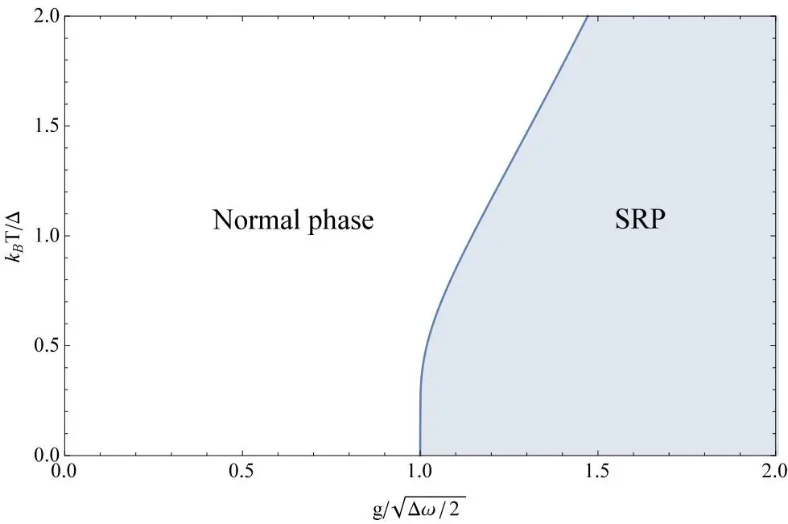

图S1. 热力学极限$( N \to \infty )$下Dicke模型的相图

对于这些特殊情况以及一般的参数值，该哈密顿量具有$\mathbb{Z}_{2}$对称性，生成元为$\Pi = \exp \left\{i \pi \left[ a^{\dagger} a + \sum_{i = 1}^{N} ( 1 + \sigma_{iz} ) / 2 \right] \right\}$。这反映在$\phi ( u , v )$的两个对称性上：$u \to - u$和$v \to - v$。事实上，它是$u^{2}$和$v^{2}$的函数。因此，对于所有参数值，原点的Hessian矩阵都是对角的。上述识别的临界线对应于原点处Hessian行列式的首次符号变化，即当$( u , v )$空间中的原点从最小值变为鞍点时。我们在此看到$\mathbb{Z}_{2}$对称性的连续相变朗道函数的通常行为。

如果所有$\lambda_{i}$均为零，对称性得以增强，此时哈密顿量方程(S20)对应于非均匀Tavis–Cummings模型。方程(S19)简化为：

$$
\phi ( u , v ) = u^{2} + v^{2} - \sum_{i = 1}^{N} \frac{1} {\beta N \Delta} \ln 2 \cosh [ \beta \Delta \sqrt{\delta_{i}^{2} + \gamma_{i}^{2} ( u^{2} + v^{2} )} ] .\tag{S25}
$$

该函数在$( u , v )$平面上呈现旋转对称性，这反映了非均匀Tavis–Cummings模型的$U ( 1 )$对称性。原点的Hessian矩阵与单位矩阵成正比，比例常数为$2 - ( 1 / N ) \sum_{i} \gamma_{i}^{2} \tanh( \beta \Delta_{i} ) / \delta_{i}$。临界条件由该量为零决定，或等价地，由原点的Hessian行列式为零决定。也就是说，如果满足以下条件，系统处于超辐射相：

$$
\sum_{i = 1}^{N} \operatorname{tanh} [ \beta \Delta_{i} ] \frac{g_{i}^{2}} {N \omega \Delta_{i}} > 2 .\tag{S26}
$$

兰道函数从原点处的全局最小值变为墨西哥帽形状。使用极坐标，我们可以将对称性破缺解释为迫使选择特定的方向$\theta$，其中$\theta$为极角。所有这些方向都是等价的，因此我们预期存在无能隙激发。

现在让我们研究基态，这在量子SPT情形中特别相关。也就是说，一旦确定了最小点，我们也可以对基态波函数进行变分估计。具体地，考虑$\lambda_{i} = 1$的情形，即非均匀DQR哈密顿量。有效平均场哈密顿量为

$$
H \left( \boldsymbol{u}_{\mathrm{min}} \right) = N \Delta u_{\mathrm{min}}^{2} + \Delta \sum_{i = 1}^{N} \left[ 2 u_{\mathrm{min}} \gamma_{i} \sigma_{ix} + \delta_{i} \sigma_{iz} \right] ,\tag{S27}
$$

这是独立自旋项的求和，易于对角化。$H \left( u_{\mathrm{min}} \right)$在自旋空间中的基态为

$$
| \psi_{sp} \rangle = \otimes_{i = 1}^{N} \left( \begin{array} {c} {{\sin \theta_{i}}} \\ {{- \cos \theta_{i}}} \end{array} \right) ,\tag{S28}
$$

其中角度由下式定义

$$
\tan \theta_{i} = \frac{2 u_{\mathrm{{min}}} \gamma_{i}} {\delta_{i} + \sqrt{\delta_{i}^{2} + 4 u_{\mathrm{{min}}}^{2} \gamma_{i}^{2}}} .\tag{S29}
$$

因此，基态中以$\Delta$为单位平均的自旋能量为

$$
\frac{1} {N} \left. \sum_{i = 1}^{N} \sigma_{iz} \right. = - \frac{1} {N} \sum_{i = 1}^{N} \frac{\delta_{i}} {\sqrt{\delta_{i}^{2} + 4 \gamma_{i}^{2} u_{\mathrm{min}}}} .\tag{S30}
$$

当对称性破缺时，基态由非零的$u_{\mathrm{min}}$决定，从而得到总基态（同时包括玻色子和自旋空间）$| g s \rangle = | \alpha_{\mathrm{min}} \rangle \otimes | \psi_{sp} \rangle$

在广义热力学极限之外，平均场方法仍然提供了良好的近似。然而$\mathbb{Z}_{2}$对称性并未破缺，因此具有奇宇称的基态近似形式为

$$
\begin{array} {l} {\displaystyle | \mathrm{GS} \rangle = \frac{1} {\sqrt{2}} \left[ | \alpha_{\mathrm{min}} \rangle \otimes_{i = 1}^{N} \left( \frac{\sin \theta_{i}} {- \cos \theta_{i}} \right) - | - \alpha_{\mathrm{min}} \rangle \otimes_{i = 1}^{N} \left( \frac{\sin \theta_{i}} {\cos \theta_{i}} \right) \right]} \\ {\displaystyle \quad = \frac{1} {\sqrt{2}} \left[ ( | \alpha_{\mathrm{min}} \rangle - | - \alpha_{\mathrm{min}} \rangle ) | \psi_{s p +} \rangle + ( | \alpha_{\mathrm{min}} \rangle + | - \alpha_{\mathrm{min}} \rangle ) | \psi_{s p -} \rangle \right] ,} \end{array}\tag{S31}
$$

其中$| \psi_{s p \pm} \rangle$是$\textstyle \prod_{i = 1}^{N} \sigma_{iz}$的$\left| \pm \right.$本征态。鉴于重叠$\left. \alpha_{\mathrm{min}} | - \alpha_{\mathrm{min}} \right.$实际上为零，该态在有限N下归一化为“薛定谔猫”态。在单量子比特拉比情形中，$\begin{array} {r} {u_{\mathrm{min}} = \frac{1} {\sqrt{2}} \sqrt{\frac{\gamma^{2}} {\gamma_{c}^{2}} - \frac{\gamma_{c}^{2}} {\gamma^{2}}} , \gamma_{c} = \sqrt{1 / 2}} \end{array}$，因此

$$
\tan \theta = \frac{2 u_{\mathrm{min}} \gamma} {1 + \sqrt{1 + 4 \gamma^{2} u_{\mathrm{min}}^{2}}} = \frac{\sqrt{\gamma^{4} - \gamma_{c}^{4}}} {\gamma^{2} + \gamma_{c}^{2}} = \sqrt{\frac{\gamma^{2} - \gamma_{c}^{2}} {\gamma^{2} + \gamma_{c}^{2}}} .\tag{S32}
$$

知道显式基态（在变分近似下），我们可以描绘其许多特征。作为示例，我们考虑$\Delta / \omega \gg 1$的量子拉比模型$( N = 1 )$的基态光子数分布。在此态中，测量到自旋向上且n个光子的概率$P_{ne}$，对于偶数$n$将为零；类似地，自旋向下且奇数光子的概率也为零。这导致

$$
\begin{array} {c} {{P_{2 m + 1 , e} = 2 \sin^{2} \theta e^{- | \alpha_{\mathrm{min}} | ^{2}} \displaystyle \frac{| \alpha_{\mathrm{min}} | ^{2 ( 2 m + 1 )}} {( 2 m + 1 ) !} , \hfill}} \\ {{P_{2 m , g} = 2 \cos^{2} \theta e^{- | \alpha_{\mathrm{min}} | ^{2}} \displaystyle \frac{| \alpha_{\mathrm{min}} | ^{4 m}} {( 2 m ) !} . \hfill}} \end{array}\tag{S33}
$$

我们在图S2中展示了这些表达式，以及通过直接对角化得到的结果。

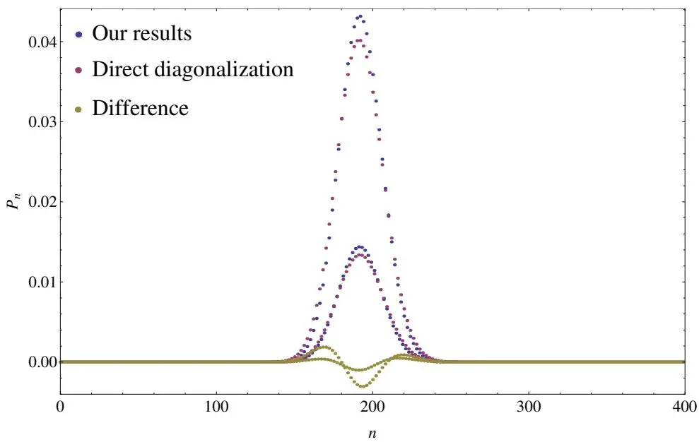

图S2. 拉比模型基态光子分布。参数（任意单位）：$\Delta = 16 , \omega = 1 / 16 , g = 1$，对应 $\gamma = 1 , \gamma_{c} = 1 / \sqrt{2} , C = \Delta / \omega = 256 , \langle a^{\dag} a \rangle = C u_{\mathrm{min}}^{2} = C | \alpha_{\mathrm{min}} | ^{2} = 192$。红点由式(S33)得到，蓝点由哈密顿量数值对角化得到。黄点表示两者之差。

### S4. 无对称性情况

我们在上述分析中强调，$\mathbb{Z}_{2}$ 对称性保证了相关 $\phi ( u )$ 函数为偶函数。这使得我们能够建立 $\mathrm{SPT}$ 的存在性及其二阶特征。现在我们通过添加一个静态偏置来打破这一对称性。更具体地，考虑哈密顿量

$$
H = \omega a^{\dagger} a + \sum_{i = 1}^{N} \frac{g_{i}} {\sqrt{N}} \sigma_{ix} ( a + a^{\dagger} ) + \sum_{i = 1}^{N} \Delta_{i} \sigma_{iz} + \sum_{i = 1}^{N} e_{i} \sigma_{ix}\tag{S34}
$$

$$
= \Delta \sum_{i = 1}^{N} \left[ \Omega \frac{a^{\dag} a} {C} + \gamma_{i} \sigma_{ix} \frac{a + a^{\dag}} {\sqrt{C}} + \delta_{i} \sigma_{iz} + \epsilon_{i} \sigma_{ix} \right] ,\tag{S35}
$$

其中，与前文一样，$C$ 将是给出宏观极限的参数或参数组合，而 $\Omega , \gamma_{i}$、$\delta_{i} = \Delta_{i} / \Delta$ 和 $\epsilon_{i} = e_{i} / \Delta$ 是有限的，其中 $\Delta$ 是 $\Delta_{i}$ 的某种平均值。选择 $C = N \Delta / \bar{\omega}$ 时，我们设 $\Omega = 1$，而 $\begin{array} {r} {\gamma_{i} = \frac{g_{i}} {\sqrt{\Delta_{i} \omega}}} \end{array}$。

该模型不存在宇称对称性。尽管如此，上述分析仍然适用，因为在热力学极限和经典振子极限下，配分函数的平均场近似都是合适的。按照上述步骤，我们得到相应的 $\phi ( u )$ 函数：

$$
\phi ( u ) = u^{2} - \frac{1} {\beta \Delta N} \sum_{i = 1}^{N} \ln \left[ \cosh \left( \beta \Delta \sqrt{\delta_{i}^{2} + \left( \epsilon_{i} + 2 \gamma_{i} u \right)^{2}} \right) \right] .\tag{S36}
$$

显然，如果并非所有偏置 $\epsilon_{i}$ 都为零，这不再是 $u$ 的偶函数，因此 $u = 0$ 通常不是一个极值点。为具体起见，让我们在经典振子极限下，集中考虑有限 $N$ 的均匀情况。朗道势 $\phi ( u )$ 为

$$
\phi ( u ) = u^{2} - \sqrt{1 + \left( \epsilon + 2 \gamma u \right)^{2}} .\tag{S37}
$$

其导数为

$$
\phi^{\prime} ( u ) = 2 u - \frac{2 \gamma ( \epsilon + 2 \gamma u )} {\sqrt{1 + \left( \epsilon + 2 \gamma u \right)^{2}}} , .\tag{S38}
$$

容易看出，对于一般的 $\epsilon$ 和 $\gamma$，原点永远不是极值点：系统总是呈现宏观光子数。

### S5. 含单光子和双光子项的迪克模型

一个相关的问题是，与两个光子存在偶极耦合的模型是否也能呈现超辐射。正如我们将看到的，我们一直依赖的宇称对称性通常不存在，因此任何相变（如果存在）都不可能是连续的。为了评估这一点，如前所述，我们将式(5)中的哈密顿量用一组有限参数 $\Omega , \gamma$ 和 $\gamma^{\prime}$ 以及一个宏观性参数 $C = N \Delta / \omega$ 重新表述。即，

$$
H = \Delta \sum_{i = 1}^{N} \left[ {\frac{{a^{\dag} a}} {C}} + \gamma \frac{{a + {a^{\dag}}}} {{\sqrt{C}}} \sigma_{ix} + {\gamma^{\prime} \frac{{a^{2} + {{\left( a^{\dag} \right)}^{2}}}} {C}} \sigma_{ix} + \sigma_{iz} \right] ,\tag{S39}
$$

其中 $\gamma{=} g / \sqrt{\Delta \omega} , \ \gamma^{\prime} = g^{\prime} / \omega$。按照现已成熟的标准步骤，我们得到约化自由能 $F / ( N \Delta )$ 作为势函数的最小值，现在该势函数依赖于两个变量：

$$
\phi ( u , v ) = u^{2} + v^{2} - \frac{1} {\beta \Delta} \ln \left[ 2 \cosh \left( \beta \Delta \sqrt{1 + \left[ 2 \gamma u + 2 \gamma^{\prime} \left( u^{2} - v^{2} \right) \right]^{2}} \right) \right] .\tag{S40}
$$

系统的稳定性要求极小值位于 $(u, v)$ 空间中的有限点。使用极坐标，势能的大半径主导行为为 $r^{2} \left( 1 - 2 \gamma^{\prime} \cos ( 2 \bar{\theta} ) \right)$。因此，稳定性要求 $| \gamma^{\prime} | < 1 / 2 $，或者用原始参数表示为 $| g^{\prime} | < \omega / 2$。此结果在文献中以不同形式出现过，极限值对应于双光子项引起的光谱坍缩。

对于非零的 $\gamma^{\prime}$ 和 $\gamma$，该模型没有对称性。尽管如此，$\phi ( u , v )$ 对于所有参数取值都是 $v$ 的偶函数。不出所料，参数空间中存在一些区域确实存在对称性。即，若 $\gamma^{\prime} = 0$，我们恢复具有 $\mathbb{Z}_{2}$ 对称性的迪克情况，这一点反映在 $\phi$ 同时也是 $u$ 的偶函数上。若 $\gamma = 0$，则我们具有由 $u v$ 交换对称性和宇称产生的 $\mathbb{Z}_{4}$ 对称性。现在我们通过计算 $\phi ( u , v )$ 的导数来寻找其极值

$$
\begin{array} {r l r} {{\frac{\partial \phi ( u , v )} {\partial u} = 2 u - \operatorname{tanh} [ \beta \Delta \sqrt{1 + [ 2 \gamma u + 2 \gamma^{\prime} ( u^{2} - v^{2} ) ]^{2}} ] \frac{( 2 \gamma + 4 \gamma^{\prime} u ) [ 2 \gamma u + 2 \gamma^{\prime} ( u^{2} - v^{2} ) ]} {\sqrt{1 + [ 2 \gamma u + 2 \gamma^{\prime} ( u^{2} - v^{2} ) ]^{2}}} ,}} \\ & {} & {\frac{\partial \phi ( u , v )} {\partial v} = 2 v + \operatorname{tanh} [ \beta \Delta \sqrt{1 + [ 2 \gamma u + 2 \gamma^{\prime} ( u^{2} - v^{2} ) ]^{2}} ] \frac{4 \gamma^{\prime} v [ 2 \gamma u + 2 \gamma^{\prime} ( u^{2} - v^{2} ) ]} {\sqrt{1 + [ 2 \gamma u + 2 \gamma^{\prime} ( u^{2} - v^{2} ) ]^{2}}} .} \end{array}\tag{S41}
$$

从式(S41)可以立即看出 $\partial_{v} \phi ( u , 0 )$ 恒为零。另一种方式是在 $( u , v )$ 平面上得到一条线。计算该线上第一个方程时，得到 $u$ 的线性方程。将该结果代回该线以确定临界点时，可以看出只要满足稳定性条件，$v$ 就没有实数解。由此可知，所有极值都位于 $v = 0$ 线上。因此，我们必须分析

$$
\tilde{\phi} ( u ) = u^{2} - \frac{1} {\beta \Delta} \ln \left[ 2 \cosh \left( \beta \Delta \sqrt{1 + \left[ 2 \gamma u + 2 \gamma^{\prime} u^{2} \right]^{2}} \right) \right] .\tag{S43}
$$

的极值。显然，当 $\gamma$ 和 $\gamma^{\prime} \to 0$ 时，$u = 0$ 是全局最小值。

在 $\beta \Delta \infty$ 极限下，关键方程变为代数方程。特别地，在该极限下，当 $2 \gamma^{2} + 4 \gamma^{\prime 2} \overset{\cdot} {\geq} 1$ 时，$\phi ( u ) = \phi ( 0 )$ 存在非零解，并且实际上在临界点处有 $\phi^{\prime} ( \bar{u} ) = 0$，条件是 $2 \gamma^{2} + 4 \gamma^{\prime 2} \geq 1$。因此，我们建立了带有上述临界线的一级超辐射相变的存在性。

我们在正文中通过对 $N = 1$ 且 $\Delta / \omega = 200$ 的哈密顿量进行对角化来展示结果。我们在图S3(a)和S3(b)中描绘了预期的一级量子相变。基态与第一激发态之间的交叉在有限参数下必然是避免的。尽管如此，光子数从零到宏观数量的变化是非常急剧的，正如对 $\Delta / \omega \infty$ 极限情况的分析结果所预期的。

### S6. 相图的总体结构

我们正在考虑的单模模型具有如下总体结构

$$
\frac{1} {\omega} H = a^{\dagger} a + A + B a^{\dagger} + B^{\dagger} a + D \left( a^{\dagger} \right)^{2} + D^{\dagger} a^{2} ,\tag{S44}
$$

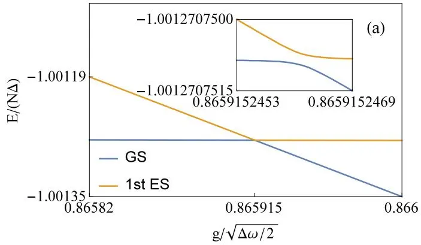

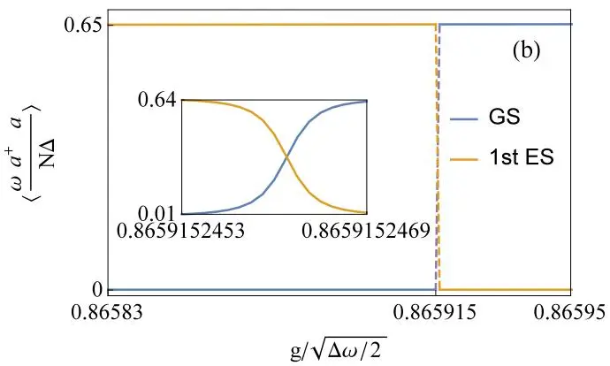

图 S3. (a) 通过直接对角化哈密顿量式 (5) 得到的基态 (GS) 和第一激发态 (ES) 的能量，参数为 $N = 1 , \Delta / N \omega = 200$，$g^{\prime} / \omega = 0.25$，$\frac{g_{c}} {\sqrt{\Delta \omega / 2}} = 0.866$，$\langle \frac{\omega a^{\dagger} a} {N \Delta} \rangle_{c} = 2 / 3$。(b) (a) 中基态和第一激发态的光子数。$\langle a^{\dagger} a \rangle_{c} = 400 / 3$。数值结果与 $N \Delta / \omega \to \infty$ 下的精确分析吻合。

其中 $A$、$B$ 和 $D$ 是作用于有限维希尔伯特空间 $H$ 的算符。这些算符连续依赖于定义相关相空间的（约化）参数。我们在上文已经证明，只要 $\| D^{\dagger} D \| < \dot{\omega}^{2} / 4$，在（广义）热力学极限下平均场近似就是有效的，并且相结构将由如下形式的朗道势决定：

$$
\phi ( u , v ) = u^{2} + v^{2} + \lambda ( u , v ) ,\tag{S45}
$$

或者可能约化为单变量 $u$。$\phi ( u , v )$ 的对称性继承自哈密顿量的对称性。在我们研究的情形中，该函数是连续且可微的。此外，它相对于模型参数也是连续且可微的。在所有感兴趣的情况下，对于大的 $u^{2} + v^{2}$，主导项将是这些变量的二次型。另外，在大多数情况下，原点将是朗道势的极值点。但需要注意的是，当引入偏置时，情况并非如此。基于这两个考虑，即对于大的序参量，朗道势以二次型增长，并且原点在所有参数值下都是极值点，可以得出两种可能：要么原点是唯一的全局最小值，要么存在至少一个非零点 $(u_{*} , v_{*})$，使得 $\phi ( u_{*} , v_{*} ) = \phi ( 0 , 0 )$。这个（或这些）特殊点将取决于约化参数。

如果系统确实处于相空间的超辐射区域，势能将在远离原点处有一个全局最小值。最小值的位置也依赖于参数，在相变点处是非解析的。

在感兴趣的情况下，存在一组偶极耦合 ${\vec{\gamma}}$，使得势能可以写为

$$
\phi ( u ) = u^{2} + \mu ( u \vec{\gamma} ) ,\tag{S46}
$$

其中 $\mu$ 是多个变量的函数 $\mu ( \vec{x} )$。注意，这确实适用于第 S5 节式 (S39) 中给出的同时包含单光子和双光子项的迪克模型，其中 $\vec{\gamma} = ( \gamma , \sqrt{\gamma^{\prime}} )$。我们立即写出 $\begin{array} {r} {\partial_{u} \phi = 2 u + \vec{\gamma} \cdot \nabla \mu .} \end{array}$，这里用 $\nabla$ 表示函数 $\mu$ 对其变量的梯度。由于 $\phi$ 依赖于偶极耦合，我们还可以考虑其在偶极耦合空间中的梯度 $\nabla_{\gamma}$。显然有 $\nabla_{\gamma} \phi = u \nabla \mu$。结合这两个结果，我们得出结论：

$$
\boldsymbol{u} \partial_{u} \phi = 2 \boldsymbol{u}^{2} + \vec{\gamma} \cdot \nabla_{\gamma} \phi .\tag{S47}
$$

我们看到，如果 $\phi$ 在远离原点处存在极值点，那么在该点 $\vec{\gamma} \cdot \nabla_{\gamma} \phi$ 将为负值。因此，在该点偶极耦合空间的径向导数为负，如果该非零极值点是一个最小值，那么增加耦合将使势阱加深。因此，一旦进入超辐射相，偶极耦合的径向增加将使我们进一步深入超辐射相。

### S7. 具有海森堡相互作用的两量子比特拉比模型

正如我们所述，在所考虑的一类模型中，一旦实现了超辐射，沿偶极耦合空间径向移动将使我们进一步深入超辐射相。然而，这并不意味着偶极耦合是各向同性的。为了说明这一点，我们在正文式 (6) 中提到了以下模型，此处重述：

$$
H = \omega a^{\dagger} a + \sum_{j = 1 , 2} [ g_{j} \sigma_{jx} ( a + a^{\dagger} ) + \Delta_{j} \sigma_{jz} ] + \sum_{\alpha = x , y , x} J^{( \alpha )} \sigma_{1 \alpha} \sigma_{2 \alpha} .\tag{S48}
$$

该模型通常具有 $\mathbb{Z}_{2}$ 对称性，其算符为 $\begin{array} {r} {\Pi = \exp \left\{i \pi \left[ a^{\dagger} a + \sum_{i = 1}^{2} \left( 1 + \sigma_{iz} \right) / 2 \right] \right\}} \end{array}$

我们定义 $\Delta$ 为自旋能量 $\Delta_{i}$ 的某种平均值，若其不为零，则取 $\Delta = \textstyle \sum_{i} \Delta_{i} / N$，或取 $\begin{array} {r} {\Delta_{i} = \left( \sum_{i} \Delta_{i}^{2} / N \right)^{1 / 2}} \end{array}$，亦或其他广义均值。现定义 $\gamma_{j} = g_{j} / \sqrt{\Delta \omega} , \delta_{j} = \Delta_{j} / \Delta$ 与 $\epsilon_{\alpha} = J^{( \alpha )} / \Delta$。依照此前对其他模型的分析方法，我们得到有效平均场自旋哈密顿量

$$
h ( u ) = \sum_{j = 1}^{2} \left( 2 \gamma_{j} u \sigma_{jx} + \delta_{j} \sigma_{jz} \right) + \sum_{\alpha} \epsilon_{\alpha} \sigma_{1 \alpha} \sigma_{2 \alpha} .\tag{S49}
$$

我们研究该模型在极限 $\beta \Delta \to \infty$ 下的行为。此情形下，相结构由朗道势 $\phi ( u ) = \dot{u^{2}} + \lambda ( u )$ 控制，其中 $\lambda ( u )$ 为 $h ( u )$ 的最小本征值。

在此情形下，我们将看到，由于自旋相互作用、不同自旋能量以及非均匀偶极耦合的存在，偶极耦合空间通常会呈现各向异性。事实上，在我们之前研究过的极限情况 $\epsilon_{\alpha} \to 0$ 下，容易确定 $\begin{array} {r} {\lambda ( u ) = - \sum_{j} \sqrt{\delta_{j}^{2} + 4 \gamma_{j}^{2} u^{2}}} \end{array}$。由此给出临界线

$$
2 \sum_{j} \frac{\gamma_{j}^{2}} {| \delta_{j} |} = 1 .\tag{S50}
$$

该临界线为一条椭圆，其长短轴取决于 $\delta_{j}$ 的非均匀程度。值得注意，在此情况下临界线的实际形状可通过微扰计算得到。为理解这一点，考虑自旋能量相同且为正的情形：$\delta_{1} = \delta_{2} = \delta > 0$。此时 $h ( 0 )$ 的最小本征值为 $- 2 \delta$。将 $\lambda ( u )$ 微扰展开至二阶，对应的本征值为 $- 2 \delta - 2 ( \gamma_{1}^{2} + \gamma_{2}^{2} ) u^{2} / \delta$。这是由于在这种情形下，所有方向上的相变均为二级相变。

然而，在这一般模型中，也存在一级相变的可能性。为证明这一点，我们考虑均匀模型，其中 $\gamma_{1} = \gamma_{2} = \gamma$ 且 $\delta_{1} = \delta_{2} = \delta$。此时，可将有效自旋哈密顿量重写为

$$
h ( u ) = 4 \gamma u S_{x} + 2 \delta S_{z} + 2 \sum_{\alpha} \epsilon_{\alpha} S_{\alpha}^{2} - \sum_{\alpha} \epsilon_{\alpha} ,\tag{S51}
$$

其中 $\mathbf S = ( \pmb{\sigma}_{1} + \pmb{\sigma}_{2} ) / 2$。在单重态子空间中，特征值为 $- \sum_{\alpha} \epsilon_{\alpha}$。该特征值与 $u$ 无关。因此，考虑存在一点 $u_{*}$，在该点三重态空间中 $h ( u )$ 的最小特征值跨越单重态子空间中的常数特征值。对于 $u < u_{*}$，朗道势的形式为 $\textstyle u^{\widehat{2}} - \sum_{\alpha}^{\cdot} \epsilon_{\alpha}$；而对于 $u > u$，则存在额外的 $u$ 依赖项，这可能在距原点有限距离处引入一个新的极小值。例如，考虑 $\epsilon_{y} = 0 , \epsilon_{x} > 0$ 且 $\epsilon_{z} > \sqrt{\epsilon_{x}^{2} + 4 \delta^{2}} - \epsilon_{x} > 0$ 的情形。此时，在 $u = 0$ 附近 $h ( u )$ 的最小特征值为单重态空间的特征值。随着 $u$ 增大，$h ( u )$ 的主导项变为第一项，对于大的 $u$，$h ( u )$ 的最小特征值为 $- 4 \gamma u$。显然，在某个点，三重态子空间的最小特征值将跨越常数单重态特征值。此外，从该点开始，朗道势的导数表现为 $u^{2} - 4 \gamma u$ 加上修正项，因此会出现比原点处取值更小的极小值。这意味着在此情形中相变可能是一级的。

这一分析建议将有效自旋哈密顿量改写为

$$
\begin{array} {l} {{\displaystyle h ( u ) = 2 \left( \gamma_{1} + \gamma_{2} \right) u S_{x} + \left( \delta_{1} + \delta_{2} \right) S_{z} + 2 \sum_{\alpha} \epsilon_{\alpha} S_{\alpha}^{2}}} \\ {~} \\ {{\displaystyle ~ - \sum_{\alpha} \epsilon_{\alpha}}} \\ {{\displaystyle ~ + \left( \gamma_{1} - \gamma_{2} \right) u \left( \sigma_{1 x} - \sigma_{2 x} \right) + \frac{1} {2} \left( \delta_{1} - \delta_{2} \right) \left( \sigma_{1 z} - \sigma_{2 z} \right) .}} \end{array}
$$

在此形式中，第一行仅作用于三重态空间，第二行正比于单位矩阵，第三行连接单重态和三重态空间。对于大的 $u > 0$，最小特征值为 $- \left( \left| \gamma_{1} \right| + \left| \gamma_{2} \right| \right) u$。可以看出，若该行为在与 $u^{2}$ 项竞争之前出现，且原点附近最小特征值的行为对 $u$ 的依赖性非常弱，则相变可以是一级的。

因此，我们定性地表明，偶极耦合空间中存在各向异性，并且在一定参数范围内，一级和二级相变都是可行的。

现在考虑一个易于进行完整分析的具体情形；即自旋全同 $( \gamma_{1} = \gamma_{2} = \gamma , \delta_{1} = \delta_{2} = \delta )$ 且自旋-自旋耦合各向同性 $( \epsilon_{x} = \epsilon_{y} = \epsilon_{z} = \epsilon )$。在条件 $\epsilon > | \delta | / 2$ 下，朗道势为

$$
\phi ( u ) = \left\{\begin{array} {l l} {u^{2} - 3 \epsilon} & {\mathrm{i f ~} | u | \leq \frac{1} {2 | \gamma |} \sqrt{4 \epsilon^{2} - \delta^{2}} ,} \\ {u^{2} + \epsilon - 2 \sqrt{\delta^{2} + 4 \gamma^{2} u^{2}}} & {\mathrm{i f ~} | u | \geq \frac{1} {2 | \gamma |} \sqrt{4 \epsilon^{2} - \delta^{2}} .} \end{array} \right.\tag{S52}
$$

对第二个表达式求导，我们发现其非零极小值位于$| u_{\mathrm{m}} | = 2 | \gamma | \sqrt{1 - \delta^{2} / 16 \gamma^{2}}$ 。若满足$16 \gamma^{4} > 4 \epsilon^{2} > \delta^{2}$，则该极小值对应超辐射相。在固定$\epsilon$和$\delta$（且满足条件$\epsilon > | \delta | / 2$）的情况下，一级相变的临界点由$\gamma_{c}^{2} = \epsilon / 2$给出。

另一方面，若$\epsilon < | \delta | / 2$，对于所有$u$值，最小本征值始终为$\epsilon - 2 \sqrt{\delta^{2} + 4 \gamma^{2} u^{2}}$。此时将发生连续相变，临界偶极耦合为$\gamma_{c}^{2} = | \delta | / 4$。在$\gamma$、$\epsilon$和$\delta$的三维参数空间中，一级和二级临界曲面具有公共直线$\gamma^{2} = \epsilon / 2 = | \delta | / 4$。

为了进一步定量分析，需要记住一个便利的条件：若存在有限非零的$u$使得$\phi ( u ) = \phi ( 0 )$成立，则朗道势在原点$u = 0$处将不再具有唯一的全局极小值。在本情形中，这对应方程$\lambda ( u ) = \lambda ( 0 ) - u^{2}$。由于对于一般参数和序参量$u$，最小本征值的求解作为第一步已相当复杂，而朗道势导数的计算又依赖于这第一步的结果，我们在某些情况下通过将方程$\lambda ( u ) = \lambda ( 0 ) - u^{2}$代入久期方程Det$[ h ( u ) - \lambda ( u ) \mathbb{1} ]$来绕开这一过程。该技术为我们提供了一种也可数值实现的分析工具。我们在图S4、S5和S6中展示了一些实例。更具体地说，我们提到的代入将问题转化为一个关于变量$u^{2}$的三次方程。我们寻找对应三次多项式正的实根。特别地，我们寻找是否存在正的实重根以识别临界性，这要求三次多项式的判别式为零。同时还需考虑多项式在$u^{2} = 0$处的取值，以判断正根（计重数）的个数为奇数还是偶数。在给定自旋能量和自旋-自旋耦合的某些参数后，这为我们提供了关于偶极耦合的解析方程，结果可通过数值对角化进行验证。

该分析为我们提供了对上述第S6节中偶极耦合空间上一般相结构的特定检验。确实，如正文所示，偶极耦合空间原点附近的区域处于正常相，而在所描绘的情形中，沿径向方向进入超辐射相。

### S8. 多模DICKE-QR模型

根据我们的分析，配分函数可写为

$$
Z = \int \ldots \int \mathrm{Tr}_{sp} \exp \{- \beta [ \sum_{\nu} \omega_{\nu} ( x_{\nu}^{2} + y_{\nu}^{2} ) + \frac{\sum_{i , \nu} ( 2 g_{\nu} , x_{\nu} ) \sigma_{ix}} {\sqrt{N}} + \sum_{i} \Delta_{i} \sigma_{iz} ] \} \frac{d x_{1} d y_{1} \ldots d x_{\nu} d y_{\nu}} {\pi^{M}} .\tag{S53}
$$

在对量子比特和$y$部分求迹后，我们得到

$$
Z = \sqrt{\frac{1} {\pi^{M} \beta^{M} \omega_{1} \omega_{2} \ldots \omega_{M}}} \int \exp \{- \beta \sum_{\nu} \omega_{\nu} x_{\nu}^{2} + \sum_{1} \ln \left[ 2 \cosh [ \beta \Delta \sqrt{\delta_{i}^{2} + \frac{4 ( \sum_{\nu} g_{\nu} x_{\nu} )^{2}} {N \Delta^{2}}} ] \right] \} d x_{1} \ldots d x_{M} ,\tag{S54}
$$

作变换 $\begin{array} {r} {x_{\nu} \sqrt{\frac{N \Delta} {\omega_{\nu}}} u_{\nu} .} \end{array}$ ，我们得到 $\begin{array} {r} {Z = \mathbf{N}^{\prime} \int \exp \{- \beta N \Delta \phi ( u_{\nu} ) \} d u_{\nu}} \end{array}$ ，其中

$$
\phi ( u_{\nu} ) = \sum_{\nu} u_{\nu}^{2} - \frac{1} {\beta N \Delta} \sum_{i} \ln \left[ 2 \cosh \beta \Delta \sqrt{\delta_{i}^{2} + 4 \big ( \sum_{\nu} \gamma_{\nu} u_{\nu} \big )^{2}} \right] ,\tag{S55}
$$

其中 $\begin{array} {r} {\gamma_{\nu} = \frac{g_{\nu}} {\sqrt{\omega_{\nu} \Delta}} , \delta_{i} = \Delta_{i} / \Delta ,} \end{array}$ ∆ 是 $\Delta_{i}$ 的平均值。对于有限温度 $\begin{array} {r} {\beta \gg \frac{1} {N \Delta} , \beta N \Delta} \end{array}$ 为无穷大，因此根据拉普拉斯方法，约化自由能 $\frac{F} {N \Delta}$ 由 ${\phi} ( u_{m} ) , m = 1 , 2 , \ldots , M$ 的全局最小值决定。

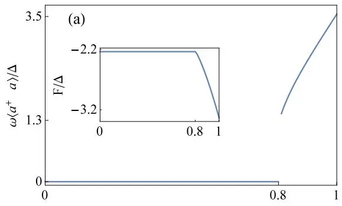

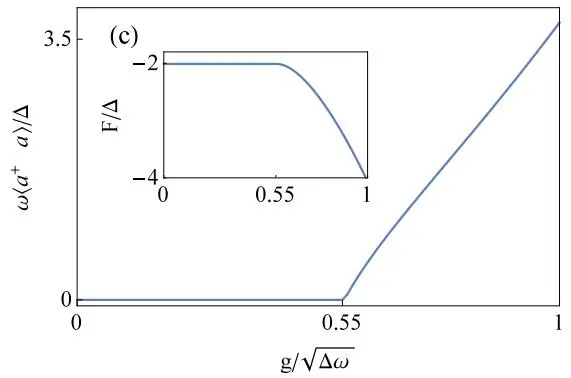

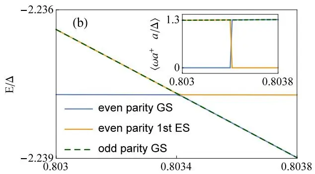

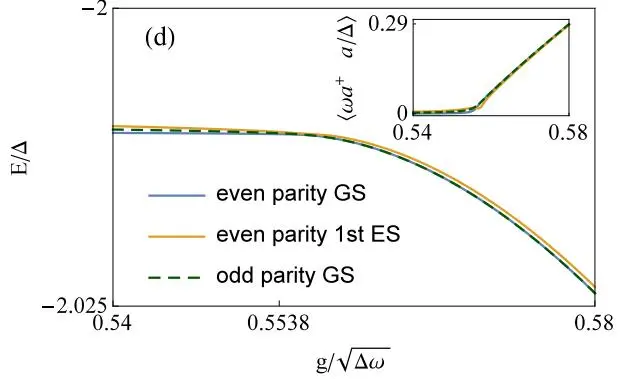

图 S4. 左图：具有偶极相互作用的相同两量子比特拉比模型在任意有限温度 $\omega / k_{B} T \ne 0$ 下的平均重标光子数和约化自由能，通过数值寻找 φ(u) 的全局最小值得到。右图：每个宇称子空间中的最低本征能级及其平均光子数，通过数值对角化哈密顿量得到。$\begin{array} {r} {( \mathrm{a} ) \epsilon_{x} = 1 . \ \gamma_{c} = 0.803 , \ \langle \frac{\omega a^{\dagger} a} {\Delta} \rangle_{c} \sim 1.308 . \ ( \mathrm{b} ) \Delta / \omega = C = 200 , \ \epsilon_{x} = 1 , \ \langle a^{\dagger} a \rangle_{c} \sim 261.6 . \ ( \mathrm{c} ) \epsilon_{x} = 0.2 ,} \end{array}$ $\gamma_{c} = 0.55387 . ( \mathrm{d} ) \Delta / \omega = 800 , \epsilon_{x} = 0.2 $。所有临界性质均通过解析方法获得，与数值结果吻合良好。

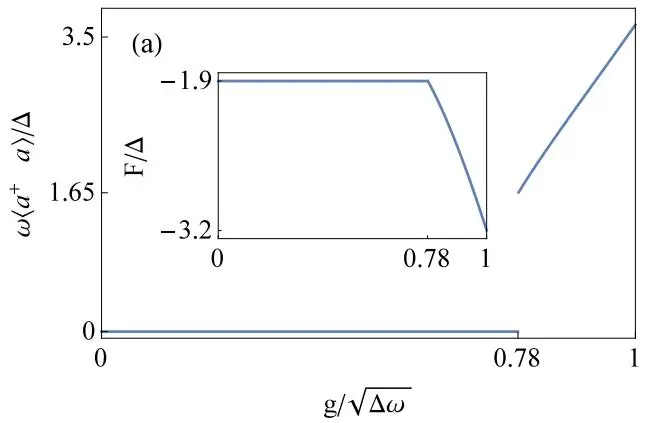

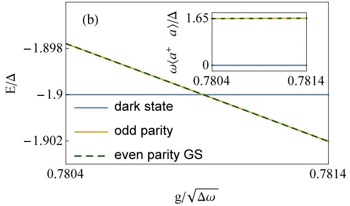

图 S5. 左图：具有 XYZ 海森堡相互作用的相同两量子比特拉比模型 $\epsilon_{x} = 1.1 , \epsilon_{y} = 0.3 , \epsilon_{z} = 0.5$ 在任意有限温度 $\omega / k_{B} T \neq 0$ 下的行为。$( \mathrm{a} )$ 通过数值寻找 $\phi ( u )$ 的全局最小值得到的平均重标光子数和约化自由能。$\gamma_{c} = 0.781063$，$u_{c}^{2} = 1.65378$。$( \mathrm{f}^{\prime} )$ 通过直接对角化哈密顿量得到的 $\begin{array} {r} {\frac{\Delta} {\omega} = 200 . ~ \langle a^{\dagger} a \rangle_{c} \sim 330} \end{array}$ 的最低能级。所有临界性质均通过解析获得，与数值结果吻合良好。

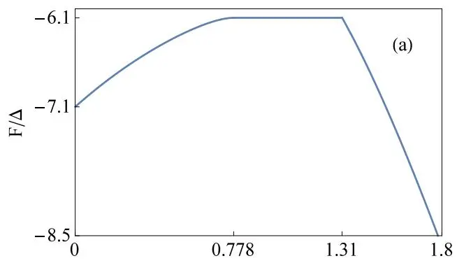

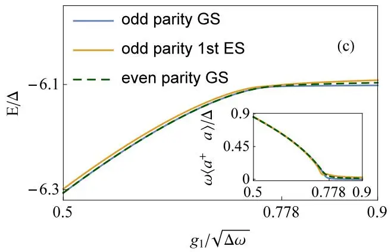

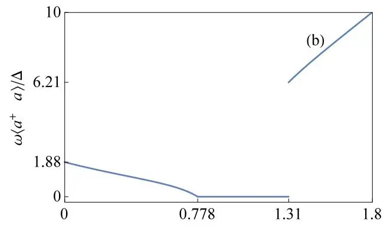

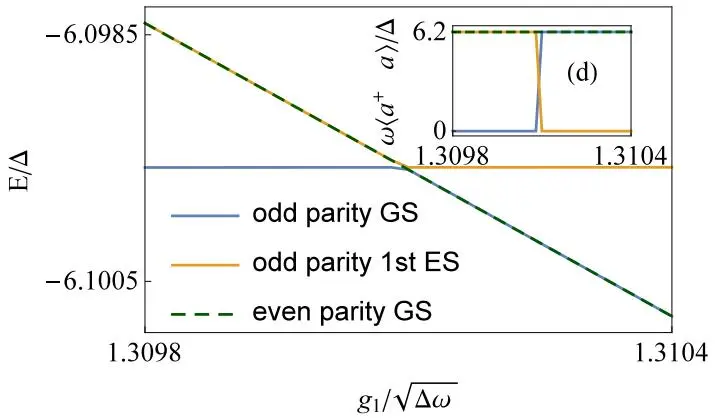

图 S6. 具有 XYZ 自旋-自旋相互作用的非相同两量子比特拉比模型。${\Delta_{1}} / {\Delta} = 3 , {\Delta_{2}} / {\Delta} = 2 , {J^{x}} / {\Delta} = 3 , {J^{y}} / {\Delta} = 2 ,$ $\begin{array} {r} {J^{z} / \Delta = 1 , \frac{g_{2}} {\sqrt{\Delta \omega}} = 1.5 ,} \end{array}$，在任意有限温度 $\omega / k_{B} T \neq 0$ 下。$( \mathrm{a} )$ 约化自由能。(b) 重标光子数。二阶 SPT 发生在 $\begin{array} {r} {\frac{g_{1 a}} {\sqrt{\Delta \omega}} = 0.778} \end{array}$，而一阶 SPT 发生在 $\begin{array} {r} {\frac{g_{1 b}} {\sqrt{\Delta \omega}} = 1.31 , \langle \frac{\omega a^{\dagger} a} {\Delta} \rangle_{c} \sim 6.21} \end{array}$。(c) 和 (d) 在 $\begin{array} {r} {\frac{\Delta} {\omega} = 100 . ~ \langle a^{\dagger} a \rangle_{c} \sim 6.20} \end{array}$ 处通过直接对角化哈密顿量得到的最低能级。

这应满足

$$
\frac{\partial \phi} {\partial u_{m}} = u_{m} - \frac{1} {N} \sum_{i} \mathrm{tanh} [ \beta \Delta \sqrt{\delta_{i}^{2} + 4 \big ( \sum_{\nu} \gamma_{\nu} u_{\nu} \big )^{2}} ] \frac{2 \sum_{\nu} ( \gamma_{\nu} u_{\nu} ) \gamma_{m}} {\sqrt{\delta_{i}^{2} + 4 \big ( \sum_{\nu} \gamma_{\nu} u_{\nu} \big )^{2}}} = 0 ,\tag{S56}
$$

所以 $\begin{array} {r} {u_{\nu} = \frac{\gamma_{\nu} u_{1}} {\gamma_{1}}} \end{array}$。将其代入 $m = 1$ 时的方程 (S56) 中，并定义 $\begin{array} {r} {\gamma^{2} = \sum_{\nu} \gamma_{\nu}^{2}} \end{array}$，我们得到

$$
\begin{array} {r} {u_{1} \left( 1 - \frac{1} {N} \sum_{i} \operatorname{tanh} [ \beta \Delta \sqrt{\delta_{i}^{2} + 4 \gamma^{4} u_{1}^{2} / \gamma_{1}^{2}} ] \frac{2 \gamma^{2}} {\sqrt{\delta_{i}^{2} + 4 \gamma^{4} u_{1}^{2} / \gamma_{1}^{2}}} \right) = 0 .} \end{array}\tag{S57}
$$

一个解是 $u_{1} = 0$，从而 $u_{\nu} = 0$，当 $g \sim 0$ 时这显然是全局最小值。与 $\gamma$ 相关的解存在于

$$
\gamma^{2} \geq \frac{N} {2 \sum_{i} ( \operatorname{tanh} [ \beta \Delta_{i} ] / \delta_{i} )} .\tag{S58}
$$

在临界点 $\gamma_{c}$ 处，$u_{\nu} ( \gamma_{c} ) = 0$，因此 $f ( u_{\nu} ( \gamma_{c} ) ) = f ( 0 )$，但随着 $\gamma_{\nu}$ 增加，所有非零的 $\phi ( u_{\nu} )$ 都在减小，因此全局最小值应该是这个依赖于 $\gamma$ 的极值。对于全同量子比特 $\Delta_{i} = \Delta$，从$\operatorname{Eq} .$ . (S57) 容易得到经典振子或零温情况 $( \beta \Delta \to \infty )$ 下 SRP 的临界值 $\gamma_{c}^{2} = 1 / 2$ 以及 $\begin{array} {r} {\frac{\omega_{\nu} a^{\dagger} a} {N \Delta} = u_{\nu}^{2} = \frac{\gamma_{\nu}^{2}} {4} ( \frac{1} {\gamma_{c}^{4}} - \frac{1} {\gamma^{4}} )} \end{array}$。

[2] C. Davis. Proc. Amer. Math. Soc. 8, 42–44 (1957).

[3] E. H. Lieb, Commun. Math. Phys. 31, 327 (1973).

---

## 阅读笔记

### 一句话概括

本文通过引入缩放参数 $C = N\Delta/\omega$，将 Dicke 模型（热力学极限 $N \to \infty$）和量子 Rabi 模型（经典振子极限 $\Delta/\omega \to \infty$）中的超辐射相变（SPT）纳入统一框架。核心手法是证明当 $N\Delta/\omega \to \infty$（同时 $g^2/\omega\Delta$ 有限）时，**平均场近似渐近精确**（配分函数满足 $\tilde{Z} \le Z \le e^{\beta\omega}\tilde{Z}$），从而可统一用朗道势 $\phi(u)$ 的全局最小值分析相图。**核心结论**：(i) 有 $\mathbb{Z}_2$ 对称性时 SPT 为二级相变，临界条件 $\tanh(\beta\Delta) = 1/2\gamma_c^2$，序参量 $u_{\min}^2 \propto (\gamma-\gamma_c)$；(ii) 无对称性时（如双光子耦合项 $g'$）相变为一级，临界线 $2\gamma^2 + 4\gamma'^2 = 1$，临界处 $u_{\min}^2 \neq 0$ 跳变为有限值；(iii) 提出"辅助 SPT"现象——多模系统中单个模式耦合虽弱，多个模式协同可使有效耦合 $\gamma^2 = \sum_\nu \gamma_\nu^2$ 超过临界值而诱导超辐射。

### 核心论证链

1. **寻找统一的极限表述**：将 DQR 模型哈密顿量重写为含宏观参数 $C$ 的形式，要求缩放后的光子能量 $\Omega = \omega C / N\Delta$ 和自旋-光子耦合 $\gamma = g\sqrt{C} / \Delta\sqrt{N}$ 在极限下有限。发现这等价于要求 $N\Delta/\omega \to \infty$（$g^2/\omega\Delta$ 有限）。**关键认识**：热力学极限 ($N\to\infty$) 和经典振子极限 ($\Delta/\omega \to \infty$) 在数学结构上是同一种极限的不同实现——都使得配分函数中的玻色子积分可用鞍点法精确处理。

2. **证明平均场近似的渐近精确性**：借助 Hepp-Lieb 不等式 $\tilde{Z} \le Z \le e^{\beta\omega}\tilde{Z}$（S2节），得到约化自由能误差 $|F/N\Delta - f_{\text{MF}}| \le \omega/N\Delta$。当 $N\Delta/\omega \to \infty$ 时误差消失。**这给出了严格的数学保证**，使得后续整个相图分析都建立在精确而非近似的基础上。

3. **建立朗道势相图分析方法**：平均场配分函数化为高斯积分 $\tilde{Z} \propto \int e^{-\beta N\Delta \phi(u)} du$，朗道势 $\phi(u) = u^2 - \frac{1}{\beta\Delta}\ln 2\cosh(\beta\Delta\sqrt{1+4\gamma^2 u^2})$。序参量 $\langle a^\dagger a\rangle / (N\Delta/\omega) = u_{\min}^2$。**这一步将复杂的多体问题归结为单实变量函数最小值问题**，相变条件由 $\phi$ 全局最小值的行为决定。

4. **从朗道势奇偶性推断相变类型**：$\mathbb{Z}_2$ 对称性保证了 $\phi(u)$ 为偶函数。因此 $u=0$ 始终是极值点，相变通过 $\phi''(0)$ 变号发生，属于二级相变。临界条件 $\tanh(\beta\Delta) - 1/2\gamma_c^2 = 0$，接近临界点时 $u_{\min}^2$ 与 $\gamma-\gamma_c$ 成正比（平均场指数 $\beta=1/2$）。

5. **统一非均匀各向异性模型**：将框架扩展至含不同 $g_i,\Delta_i,\lambda_i$ 的非均匀 DQR 模型（S3节），朗道势变为二维 $\phi(u,v)$。$u$ 型和 $v$ 型超辐射的临界条件分别关联 $(1+\lambda_i)^2$ 和 $(1-\lambda_i)^2$ 权重因子。当 $\lambda_i=0$ 时对称性增强为 $U(1)$，朗道势出现旋转对称的"墨西哥帽"，临界值变为 $\sum_i \tanh(\beta\Delta_i) g_i^2/(N\omega\Delta_i) > 2$。

6. **对称性破坏诱导一级相变**：加入双光子耦合 $g'(a^2 + a^{\dagger 2})\sigma_x$（S5节）后 $\mathbb{Z}_2$ 对称性消失，朗道势不再是偶函数。临界条件变为联立方程 $\phi(u)=\phi(0)$ 和 $\phi'(u)=0$，解得 $2\gamma^2 + 4\gamma'^2 = 1$。在零点临界处 $u_{\min}^2$ 跳变至有限值，证实为一级相变。**这展示了朗道势方法对相变类型的判别能力**：对称性 $\Rightarrow$ 二级，无对称性 $\Rightarrow$ 一级。

7. **揭示偶极耦合相图的一般结构**：对两量子比特 XYZ 模型（S7节），利用关系 $\vec{\gamma} \cdot \nabla_\gamma \phi = -2u^2$（S6节式S47）说明径向耦合流总是指向超辐射相。相图中正常相区域围绕原点，边界由二级和一级相变线段构成。一级相变的产生依赖于自旋子空间的能级交叉——三重态与单重态特征值在特定 $u$ 处竞争（S7节式S52）。

8. **多模辅助 SPT**：多模 DQR 模型（S8节）的朗道势 $\phi(\vec{u})$ 仅通过 $\vec{u}^2$ 和 $\vec{\gamma}\cdot\vec{u}$ 组合依赖多模式变量，因此所有极值点沿 $\vec{\gamma}$ 方向排列。临界耦合为 $\gamma_c^2 = N/[2\sum_i \tanh(\beta\Delta_i)/\delta_i]$，各模式效果可相互叠加——即使每个 $\gamma_\nu$ 单独都远小于临界值，只要 $\sum_\nu \gamma_\nu^2$ 超过 $\gamma_c^2$ 即可发生 SPT。

### 实验参数详解

| 参数 | 数值/条件 | 含义 |
|------|-----------|------|
| $N\Delta/\omega$ | $\to \infty$ | 统一极限条件：热力学极限 ($N\to\infty$) 或经典振子极限 ($\Delta/\omega \to \infty$) |
| $g^2/\omega\Delta$ | 有限 | 决定超辐射是否发生的通用耦合组合 |
| $\gamma = g/\sqrt{\Delta\omega}$ | — | 统一表述下的无量纲有效耦合强度 |
| $\gamma' = g'/\omega$ | $< 1/2$ | 双光子耦合参数，>1/2 时系统光谱坍缩失稳 |
| $\beta\Delta$ | $\to \infty$（零温） | 零温极限下朗道势简化为 $\phi(u)=u^2-\sqrt{1+(2\gamma u)^2}$ |
| $\gamma_c$（均匀 $\mathbb{Z}_2$，零温） | $1/\sqrt{2} \approx 0.707$ | 二级相变临界耦合（Dicke 和 Rabi 模型统一值） |
| $2\gamma_c^2 + 4\gamma_c'^2$ | $=1$（零温） | 含双光子项时一级相变临界线 |
| $\sum_i \tanh(\beta\Delta_i) g_i^2/(N\omega\Delta_i)$ | $> 2$（TC 模型） | Tavis-Cummings 模型 ($\lambda_i=0$) 的临界条件，系数比 Dicke 模型大 2 倍 |
| $\Delta_i = \Delta$（均匀情形） | — | 数值对角化中设 $\Delta/\omega = 200$（图S2）或 $800$（图S4d）以实现经典振子极限 |
| 临界序参量（双光子，零温） | $u_c^2 = (2\gamma_c'/\gamma_c)^2$ | 一级相变临界点跳跃量，例：$\gamma'/\omega=0.25,\gamma=0.866$ 时 $u_c^2=2/3$ |

### 批判性思考

1. **平均场精确性在有限温度下的边界**：作者借助 Hepp-Lieb 不等式 $\tilde{Z} \le Z \le e^{\beta\omega}\tilde{Z}$（S2节式S5），证明自由能误差 $O(\omega/N\Delta)$。此证明隐含着 $\beta\omega$ 需为有限值——当 $\beta\omega \to 0$（极高温度）时，$e^{\beta\omega}-1 \sim \beta\omega \to 0$，看似误差更小，但实际上此极限下配分函数中的玻色子部分发散（$Z_{\text{osc}} \sim 1/\beta\omega$），梯形不等式是否能保持紧致性并未论证。临界温度 $T_c$ 附近的行为是否仍可被平均场精确描述是一个开放问题。

2. **双光子项上界推导的双重极限取序问题**：S2节中为含双光子项的哈密顿量（式S8）推导 $\tilde{Z} \le Z \le e^{\beta\omega}\tilde{Z}$ 时，使用了截断相干态 $|\alpha,n\rangle$ 和凸性不等式，最终上界依赖 $n \to \infty$、$\epsilon \to 0$ 的取序。该双重极限是否可交换（即一致性）没有严格证明——若先取 $\epsilon \to 0$ 再取 $n \to \infty$，与先取 $n \to \infty$ 再取 $\epsilon \to 0$ 可能得到不同结果。这限制了该证明向多模+双光子耦合情形的可靠推广。

3. **二维朗道势降维的特定性**：双光子模型中作者通过 $v=0$ 线消维（S5节），依赖双光子项中 $v$ 仅通过 $u^2-v^2$ 组合出现且 $\phi$ 为 $v$ 的偶函数。此消维对更一般的非线性耦合形式不成立——譬如形如 $g_2(a^2 + a^{\dagger 2}) + g_3(a^3 + a^{\dagger 3})$ 时，降维条件不复存在，相图分析将需要复现二维鞍点搜索的复杂性。

4. **辅助 SPT 临界指数的模式数无关性未论证**：多模情形（S8节）中作者直接套用单模平均场指数 $u_{\min}^2 \propto \gamma - \gamma_c$，但临界指数通常与系统对称性和空间维数有关，而非单纯模式数 $M$。然而，当 $M \to \infty$ 时可能出现"模式软化"和非平凡临界行为（类似 $d \to \infty$ 的极限），文中未讨论 $M$ 作为热力学极限另一截断的影响。

### 局限性

- **有限 $N$ 和有限 $\Delta/\omega$ 的修正未定量刻画**：论文所有严格结论都基于 $N\Delta/\omega \to \infty$ 极限，但对有限 $N$、有限 $\Delta/\omega$ 时平均场修正 $O(\omega/N\Delta)$ 的预因子大小未给出，无法判断为达到如 1% 精度需要 $N\Delta/\omega$ 至少多大。

- **实时动力学和非平衡淬火完全缺失**：论文仅分析平衡态相变，未涉及时域行为——如超辐射相中的 Goldstone/Ising 模激发、淬火后的纠缠增长（$S \propto vt$ 纠缠壁垒）。对于实验验证（如超导量子比特耦合腔中的量子动力学模拟），这个缺口是关键局限。

- **一级相变的核化动力学未分析**：含双光子项的一级 SPT（S5节）和自旋-自旋耦合情形的一级边界（S7节）仅给出平衡相图，未分析亚稳态寿命、成核速率或迟滞回线宽度，而这些是实验观测一级相变的核心挑战。

- **双光子项稳定性条件仅对均匀情形成立**：$|g'| < \omega/2$ 来自朗道势大半径展开 $r^2(1-2\gamma'\cos 2\bar{\theta})$，仅适用于均匀单量子比特模型。对于非均匀耦合或多量子比特，集体激发谱的变形会修改稳定性边界，论文未给出推广形式。

- **数值验证规模限于 $N=1$ 和 $N=2$**：数值对角化仅用于单量子比特 Rabi 模型（图S2、S3）和两量子比特模型（图S4-S6），未对 $N>2$ 的多量子比特模型进行有限尺寸标度分析，无法确认有限 $N$ 下临界参数的收敛速度和有限尺寸标度指数。

- **无对称性偏置的交叉区域未刻画**：S4节中当 $\epsilon_i \neq 0$ 时系统总是呈现宏观光子数，严格意义上根本不存在相变而是一个交叉。论文只在概念上点明"不存在 SPT"，但未对交叉区域的光子数增长形式、标度行为作任何定量刻画——例如 $\epsilon \ll 1$ 时是否有 $\langle a^\dagger a\rangle \sim \epsilon^2$ 或更复杂的标度律。

### 关键公式速查

- $$H = \omega a^\dagger a + \sum_{i=1}^N \frac{g}{\sqrt{N}} \sigma_{ix} (a + a^\dagger) + \sum_i \Delta \sigma_{iz} $$ — 统一的 DQR 模型哈密顿量（式1），涵盖 Dicke 和 Rabi 两种情形

- $$\frac{\langle a^\dagger a\rangle}{N\Delta/\omega} = u_{\min}^2$$ — 序参量与朗道势最小值的关系（式3），正常相 $u_{\min}=0$，超辐射相 $u_{\min}\neq0$

- $$\tanh(\beta\Delta) - \frac{1}{2\gamma_c^2} = 0$$ — 有 $\mathbb{Z}_2$ 对称性时的二级相变临界线（正文推导），统一 Dicke 和 Rabi 的临界条件

- $$2\gamma^2 + 4\gamma'^2 = 1$$ — 含双光子项时一级相变的零温临界线（S5节推导），临界处 $u_{\min}^2 = (2\gamma_c'/\gamma_c)^2 \neq 0$ 确认非连续性

- $$\tilde{Z} \le Z \le e^{\beta\omega} \tilde{Z}$$ — 平均场近似的 Hepp-Lieb 上下界（S2节式S3），$N\Delta/\omega \to \infty$ 时自由能误差 $<\omega/N\Delta \to 0$

- $$\vec{\gamma} \cdot \nabla_\gamma \phi = -2u^2$$ — 偶极耦合空间径向流关系（S6节式S47），确认一旦进入超辐射相，径向增加耦合使势阱更深

- $$\gamma_c^2 = \frac{N}{2\sum_i \tanh(\beta\Delta_i)/\delta_i}$$ — 多模 DQR 模型临界耦合（S8节式S58），显示各模式协同效应：只要总强度 $\sum_\nu\gamma_\nu^2$ 超过此值即可发生 SPT

### 术语对照

| 中文 | 英文 | 含义 |
|------|------|------|
| 超辐射相变 | Superradiant Phase Transition (SPT) | 热力学极限下平均光子数与系统尺寸比值 $\langle a^\dagger a\rangle/C$ 有限非零的量子相变 |
| DQR 模型 | Dicke-Quantum Rabi model | 含统一参数的通用哈密顿量，一个公式覆盖 Dicke 模型和 Rabi 模型 |
| 朗道势 | Landau potential $\phi(u)$ | 平均场自由能泛函，其全局最小值决定系统热力学相 |
| $\mathbb{Z}_2$ 对称性 | $\mathbb{Z}_2$ symmetry | 宇称变换 $\Pi = e^{i\pi(a^\dagger a + \sum_i (1+\sigma_{iz})/2)}$ 下的对称性，保证朗道势为偶函数 |
| 平均场近似 | Mean-field approximation | 用玻色子相干态将自旋-玻色子耦合退耦为独立自旋问题，大 $N\Delta/\omega$ 下成为精确解 |
| 辅助超辐射 | Assisted SPT | 多个玻色子模式协同贡献有效耦合 $\gamma^2 = \sum_\nu \gamma_\nu^2$ 达到临界值的现象 |
| 经典振子极限 | Classical oscillator limit ($\Delta/\omega \to \infty$) | 量子比特能隙远大于光子频率时，光场行为类经典振子，与热力学极限 $N\to\infty$ 数学等价 |
| Hepp-Lieb 不等式 | Hepp-Lieb bounds ($\tilde{Z} \le Z \le e^{\beta\omega}\tilde{Z}$) | 配分函数的上下界，保证平均场自由能误差受限于 $\omega/N\Delta$ |

### 深入：统一极限 $N\Delta/\omega \to \infty$ 的等价性

两个极限的等价性可以从哈密顿量的缩放结构最直观地理解。将 $\alpha = \sqrt{N\Delta/\omega}\,\alpha'$ 代入相干态积分后，玻色子积分因子变为 $\beta N\Delta|\alpha'|^2$，而自旋-光子耦合项变为 $\beta N\Delta \cdot (g/N\sqrt{\omega\Delta})\sigma_{ix}(\alpha'+\alpha^{*\prime})$。此时 $N\Delta/\omega$ 成为积分中"有效系统大小"：它越大，拉普拉斯方法越精确——无论这个大小的来源是 $N$ 还是 $\Delta/\omega$。物理解释：当系统可以和大光子库（$N$ 很大）耦合时，或者当量子比特具有很大的能隙（$\Delta$ 很大）导致自旋几乎不翻转时，光场的涨落都被有效抑制，平均场变为精确解。这解释了为什么单量子比特 Rabi 模型（$N=1$）在经典振子极限下的相图与 Dicke 模型（$\Delta$ 固定、$N\to\infty$）完全相同——都源于同一鞍点近似的精确性。

### 延伸阅读

- **K. Hepp and E. H. Lieb (1973)** — Dicke 模型超辐射相变的严格解和平均场精确性的原始证明，奠定了本文所依赖的 Hepp-Lieb 不等式框架的数学基础。
- **M.-J. Hwang, R. Puebla, and M. B. Plenio (2015)** — 单量子比特 Rabi 模型经典振子极限中超辐射相变的发现，本文将其与 Dicke SPT 统一处理的重要参考（式S7节参考文献[15]）。
- **Z.-J. Ying, L. Cong, X.-M. Sun (2018)** — 含双光子项的 Rabi 模型中的一级量子相变，与本文S5节中单/双光子混合模型的一级 SPT 直接相关（参考文献[33]）。
- **J. Larson and E. K. Irish (2017)** — 对光-物质模型中”量子相变”的批判性讨论，特别是零温相变与有限温度量子相变概念边界的问题（参考文献[19]）。
- **[耗散驱动的 Rabi 模型中的量子相变信号](/papers/dissipation-driven-rabi-qpt/)** — De Filippis 等（2023）证明耗散量子 Rabi 模型在深强耦合区发生 BKT 量子相变，并把序参量与线性响应测量（磁化率、弛豫函数）直接联系起来。
