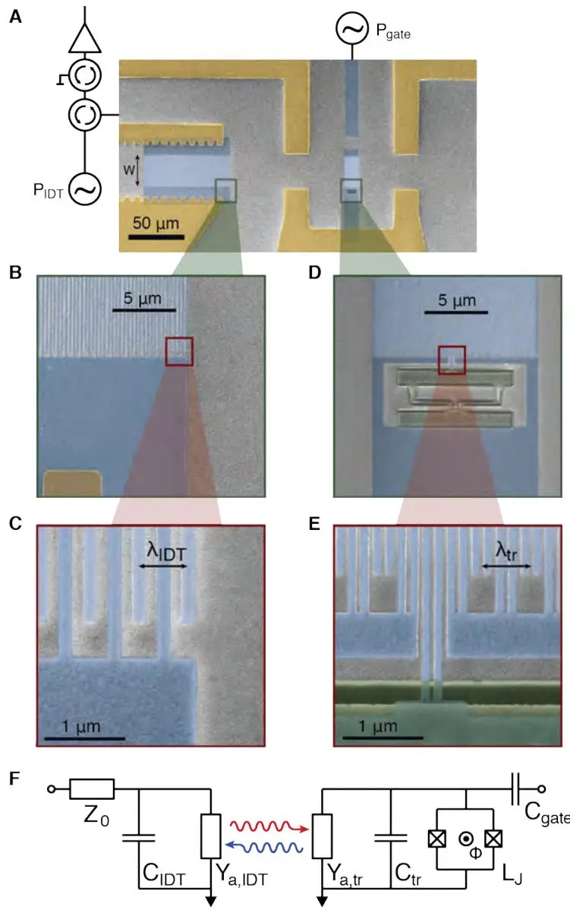
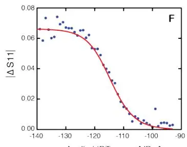
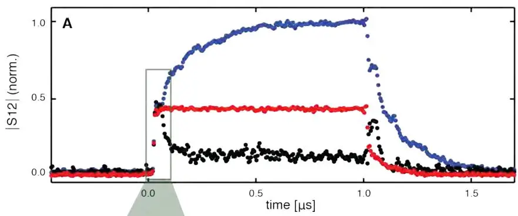
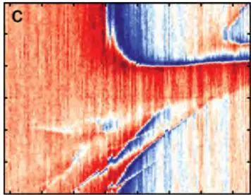

# Propagating Phonons Coupled to an Artificial Atom
## 传播声子耦合到人工原子

**M. V. Gustafsson, T. Aref, A. Frisk Kockum, M. K. Ekström, G. Johansson, P. Delsing**

Chalmers University of Technology · Columbia University

*Science* **346**, 207–211 (2014)

## 摘要

量子信息可存储在微机械谐振器中，编码为振动量子即声子。振动运动被限制在谐振器的本征模中，声子因而作为局域存储。**本文把传播声子耦合到量子区的人工原子**，用量子光学中的发现复现——只是声取代了光的角色。结果突显了声子与光子的相似性，但也指向量子力学声独特特征带来的新机遇。声子的低传播速度将为处理量子信息开启新的动态方案，短波长则允许探索光子系统无法企及的原子物理区。

---

## 背景与动机

光的量子本性在其与原子（元素原子或人工原子）的相互作用中揭示与探索。人工原子通常有微波段跃迁频率，可在微芯片上设计、参数定制，适合研究原子物理与量子光学的基本现象。作为超导量子比特，它们在封闭空间（电磁腔）中被广泛使用——与受限微波辐射充分相互作用 [1–3]。这些实验近期扩展到开放一维（1D）传输线中的量子光学——原子与行进微波光子相互作用 [4–7]。


本文是这类系统的**声学等价物**——探索声（而非光）的量子性质。关键区别：此前的「机械量子系统」用悬浮谐振器的本征模（局域声子）；本文用**表面声波（SAW）**——自由传播的声子，相互作用前后在芯片表面长距离飞行。这是「行进声子」的首次量子耦合演示。


### SAW 与压电耦合

SAW（Rayleigh 波）[21–23] 在固体表面约一个波长深度内弹性传播。射频段以上，SAW 波长足够短，微芯片表面可作传播介质。**通过压电衬底，SAW 可从电信号高效产生，传播长距离后再转回电域**——这广泛用于商业微波延迟线与滤波器 [22–24]。

SAW 器件的核心组件是**叉指换能器（IDT）**：两个电极，各由许多长指构成，薄膜沉积在压电衬底上。两电极指交叉排列，电极间加交流电压在衬底表面产生振荡应变波，从每个指辐射出 SAW。指的周期 $\lambda_{IDT}$ 定义 IDT 的声学共振，频率 $\omega_{IDT} = 2\pi\nu_0/\lambda_{IDT}$（$\nu_0$ 为 SAW 速度）。当电驱动 $\omega = \omega_{IDT}$，所有指辐射的 SAW 相干叠加，产生强声束。

---

## 器件：IDT + transmon 量子比特

### GaAs 衬底 + 铝 IDT

样品制作在半绝缘 GaAs 衬底 (100) 面（图 1A），选其压电与机械性质。IDT 在左侧（图 1B 放大），$N_{IDT} = 125$ 指对，重叠宽 $W = 25$ μm，铝指覆钯，SAW 沿晶体 [011] 方向传播，速度 $\nu_0 \approx 2900$ m/s。IDT 利用内部反射实现强电-声功率转换 [22,23]，$\omega_{IDT}/2\pi = 4.8066$ GHz 附近 1 MHz 窄带。IDT 经环形器、隔离器耦合到低温低噪声 HEMT 放大器。

图 1：样品与实验装置。(A) 样品电子显微图（俯视假彩）。左侧 IDT 把电信号转成 SAW 反之亦然，$N_{IDT} = 125$ 指周期，周期 600 nm，SAW 束宽 $W = 25$ μm。SAW 传播 100 μm 到达右侧量子比特。(B-C) IDT 放大。(D-E) transmon 量子比特放大，$N_{tr} = 20$ 指周期，双指以抑制内部机械反射 [22,23,26]。(F) 量子比特的半经典电路模型：$C_{tr}$ 指结构几何电容，被 SQUID（可调非线性电感 $L_J$，磁通 $\Phi$ 调）旁路，$Y_{a,tr}$ 为声学导纳。

### transmon 量子比特作为「声学原子」

人工原子是 transmon 型 [25] 超导量子比特，位于 IDT 右侧 100 μm（图 1A, D-E）。transmon 由 SQUID（被大几何电容 $C_{tr}$ 旁路，充电能 $E_c = e^2/2C_{tr}$）组成，SQUID 的约瑟夫森能 $E_J$ 可用磁通 $\Phi$ 调。约瑟夫森电感 $L_J = \hbar^2/(4e^2 E_J)$ 与 $C_{tr}$ 形成共振电路，$L_J$ 的非线性给出原子特征的非谐能谱。

**transmon 天然适合耦合 SAW**：旁路电容可设计成指结构（像 IDT），$C_{tr}$ 上的电荷直接关联衬底表面 Rayleigh 波的机械应变。量子比特指结构 $N_{tr} = 20$ 周期，每周期 4 指（双指配置大幅减小内部机械反射 [22,23,26]）。$N_{tr} < N_{IDT}$，量子比特声学带宽（~250 MHz）远宽于 IDT。几何估计 $C_{tr} = 85$ fF。

### 声学耦合率

量子比特的声学耦合率 $\Gamma_{10}$ 是关键参数，$1/\Gamma_{10}$ 是量子比特从第一激发态 $|1\rangle$ 通过发射频率 $\omega_{10}$ 声子弛豫到基态 $|0\rangle$ 的平均时间。指结构的声-电转换用复频率依赖声学导纳 $Y_a$ 表示（电耗散代表转成 SAW）。代入 transmon 半经典模型（图 1F）得 $\Gamma_{10} = c_g^2 N_{tr} K^2 \omega_{10}/\sqrt{2} = 2\pi\times 30$ MHz，其中 $c_g \approx 0.8$ 为几何因子，$K^2 = 0.07\%$ 为压电耦合强度材料参数。


本文通过压电把量子比特**直接耦合到 SAW**，使该作用成为量子比特的主导弛豫通道。这意味着可双向通过 SAW 与量子比特通信——声学激发它、监听其传播表面声子的发射。这是「声学量子光学」的核心。


### 量子模型

为定量分析，作者发展了考虑量子比特非谐性的扩展模型 [27,28–33]。transmon 能级 $E_n \approx -E_J + \sqrt{8E_J E_C}(n+1/2) - E_C(6n^2+6n+3)/12$。还需考虑量子比特的空间延展（$N_{tr}$ 个波长上与 SAW 相互作用），每指一个相互作用点、计入 SAW 相位差。假设沿量子比特的传播时间远短于耦合频率倒数（$\nu_0/(N_{tr}\lambda) \gg \Gamma_{10}$）——每个发射声子在下一个发射前完全离开量子比特。

| 参数 | 数值 |
|------|------|
| 衬底 | GaAs (100)，半绝缘 |
| $\nu_0$（SAW 速度）| ~2900 m/s |
| $\omega_{IDT}/2\pi$ | 4.8066 GHz |
| IDT 带宽 | ~1 MHz |
| $N_{IDT}$ | 125 指对 |
| $N_{tr}$ | 20 指周期 |
| 量子比特声学带宽 | ~250 MHz |
| $\Gamma_{10}/2\pi$（理论）| 30 MHz |
| $\Gamma_{10}/2\pi$（拟合）| **38 MHz** |
| $C_{tr}$ | 85 fF |
| $E_{J0}/h$ | 22.2 GHz |
| $E_c/h$ | 0.22 GHz |
| $K^2$（压电耦合）| 0.07% |
| 温度 | 20 mK |
| IDT-量子比特距离 | 100 μm |
| 声学传播时间（量子比特→IDT）| ~40 ns |
| 热声子数（每模）| $<10^{-4}$ |

---

## 主要结果

### 声学反射测量：非线性饱和

开放 1D 几何中的原子（无纯退相干时）**完美反射弱共振相干辐射**。但当辐照功率达到或超过每个弛豫时间一个光子时，量子比特 $|1\rangle$ 态显著布居，降低其反射 $\omega_{10}$ 声子的能力，透射增加 [4,5,7,34]。

测量方法：相干微波音（频率 $\omega$）加到 IDT，IDT 把部分功率转成向量子比特传播的 SAW。IDT 共振时约 25% 电功率反射不转声（图 2A，量子比特大失谐）。其余 SAW 一半右传，计损耗后约 8% 电功率以 SAW 到达量子比特。量子比特反射的声功率中可观部分在 IDT 转回电功率检测。

图 2：声学反射测量。(D) 图 2B 中一个反射峰的放大。(E) $\omega = \omega_{IDT}$ 处截面（蓝），量子比特反射理论拟合（红）得声学耦合率 $\Gamma_{10}/2\pi = 38$ MHz。(F) 不同 IDT 功率下 $|\Delta S_{11}|$ 的磁通调制。量子比特反射相干束中声子的速率受 $\Gamma_{10}$ 限制，$P_{IDT}/\hbar\omega_{IDT} \gg \Gamma_{10}$ 时反射系数趋于零，磁通调制消失。**这一单声子级别的饱和是量子比特二能级本性的证据**。

量子比特共振频率 $\omega_{10}$ 被磁通 $\Phi$ 调制（周期 $\Phi_0 = h/2e$）。调磁通时 $\omega_{10}$ 与 $\omega_{IDT}$ 重合处反射增加。**反射的关键特征是反射系数对相干音功率的非线性依赖**：仅当入射声子流远低于每相互作用时间一个（$P_{SAW}/\hbar\omega \ll \Gamma_{10}$）时量子比特全反射。功率增加时 $|1\rangle$ 部分布居，反射降低。理论模型拟合得 $\Gamma_{10}/2\pi = 38$ MHz，退相干可忽略——意味着低功率极限下量子比特**全反射**。

### 稳态电驱动：声子发射

除声学激发，可用电门寻址量子比特跃迁、用 IDT 拾取量子比特发射的 SAW 声子。预期电驱动共振时量子比特选择性地发射单声子态。门加固定 $\omega_{IDT}$ 的 RF 信号，观测发射声子流对量子比特失谐 $\Delta\omega_{10} = \omega_{10} - \omega_{IDT}$ 与 RF 功率 $P_{gate}$ 的依赖。

图 3：从门驱动量子比特、用 IDT 监听其声学发射。(A) 门到 IDT 的转换系数 $|S_{12}|$ 对驱动功率与量子比特失谐的依赖。低门功率下量子比特仅在零失谐被激发，SAW 发射与 RF 幅度成正比。更高功率下两个 $\omega = \omega_{20}/2$ 的门光子可激发 $|2\rangle$ 态、随后发射两个声子。更高功率可见越来越高阶的光子-声子转换。

$P_{gate}$ 从零增加：先在 $\Delta\omega_{10} = 0$ 看到量子比特声学发射；更高功率下 $\Delta\omega_{10} > 0$ 出现额外峰，对应多光子激发量子比特高态、随后弛豫成多声子。峰间距反映量子比特非谐性，拟合得 $E_{J0}/h = 22.2$ GHz、$E_c/h = 0.22$ GHz——与几何估计吻合。

### 时域：证明是声子而非光子

SAW 慢传播（相对电磁波）使我们能明确量子比特通过声子（而非光子）耦合到 IDT。对门加 1 μs 微波脉冲，研究时域到达 IDT 的信号（图 4）。

图 4：时间分辨的量子比特发射。(A) 量子比特大失谐时（红），一定串扰从门到达 IDT 传输线（功率与频率无关，归因于传输线间电容耦合）。量子比特近共振时，SAW 与串扰同相（蓝）则转换系数大增，反相（黑）则减小。(B) (A) 放大。量子比特发射在串扰起始后约 40 ns 观测到——对应量子比特到 IDT 的**声学传播时间**。

- 量子比特大失谐：仅看到与频率无关的串扰（传输线间杂散电容）。
- 量子比特近共振：串扰先升起（电脉冲到达门的时间参考），**约 40 ns 后**才看到量子比特发射——对应量子比特到 IDT 的声学传播时间。**这明确证明信号是声子的**。
- SAW 相位对 $\Delta\omega_{10}$ 敏感，小变化可使量子比特发射与串扰相长（蓝）或相消（黑）叠加。
- IDT 部分反射来自量子比特的声子，可见对应 IDT-量子比特往返的声学回波。

### 混合双音谱学：Autler-Townes 双重态

为细致刻画声子-量子比特动力学，做混合双音谱学：IDT 持续低功率声学探音（$\omega_{IDT}$）测反射；同时改变量子比特失谐 $\Delta\omega_{10}$、对门加连续电控制音（变 $\omega_{gate}, P_{gate}$）。量子比特吸收门光子时影响其声子反射（图 5）。

对中-强电驱动 $|1\rangle\to|2\rangle$ 跃迁，量子比特能级的 Rabi 劈裂产生 **Autler-Townes 双重态** [35,36]。更高控制功率下观测到丰富谱特征，与全量子模型定量吻合。

---

## 展望与总结

SAW 器件占据固定机械谐振器与自由光子传输线之间的中间地带。

**与悬浮谐振器比**：SAW 声子虽行进，也可用片上布拉格镜约束成腔。这类腔天然与行进波集成，模式能可达远超 $k_BT$（标准低温设备），运动直接在冷却衬底中，热化极好。少数研究表明低温高频 SAW 腔可有较高 $Q$ [37,38]。

**与光子比**：SAW 声子传播速度低约 $10^5$ 倍，同频下波长短得多。**慢速意味着量子比特可调得比 SAW 穿过量子比特别间距快得多**，开启陷俘与处理量子的新动态方案。SAW 声子还给出一种**原子尺寸显著超过相互作用量子波长的区域**——这与光子学、腔 QED、电路 QED 中迄今实现的点状相互作用相反 [28]。本文量子比特是 SAW 波长的 $N_{tr} = 20$ 倍，可在专门器件中大幅扩展。

在强压电材料（如 LiNbO₃）中，IDT 型量子比特的多个耦合点应能达到「超强耦合」[31,39,40]（$\Gamma_{10}\gtrsim\omega_{10}/10$）甚至「深强耦合」[41]（$\Gamma_{10}\gtrsim\omega_{10}$）——这些用标准光电偶极耦合难以企及。

总之，我们演示了 SAW 与人工原子在强耦合区的非经典相互作用。声子可作传播量子信息载体，类比量子光学中的行进光子。SAW 能达到光子无法企及的耦合强度与时域控制区域。

---

## 参考文献


学术论文的参考文献条目按国际惯例保留原文。以下为本文引用的主要文献。


1. Wallraff et al., *Nature* **431**, 162 (2004). — **circuit QED 强耦合。**
4. Astafiev et al., *Science* **327**, 840 (2010). — **单人工原子共振荧光（1D 开放空间光子版）。**
5. Hoi et al., *Phys. Rev. Lett.* **107**, 073601 (2011). — 微波单光子路由器。
6. Eichler et al., *Phys. Rev. Lett.* **106**, 220503 (2011). — **行进微波光子态层析（本图书馆有对应笔记）。**
8. O'Connell et al., *Nature* **464**, 697 (2010). — **机械振子量子基态与单声子控制。**
9. LaHaye et al., *Nature* **459**, 960 (2009). — **纳米机械测量超导量子比特（本图书馆有对应笔记）。**
10. Pirkkalainen et al., *Nature* **494**, 211 (2013). — **混合电路腔 QED 与微机械谐振器（本图书馆有对应笔记）。**
16. Gustafsson, Santos, Johansson, Delsing, *Nature Phys.* **8**, 338 (2012). — **GHz 回声腔中传播声波的局域探测，本文组的前作。**
21. Lord Rayleigh, *Proc. London Math. Soc.* (1885). — **Rayleigh 波的奠基论文。**
22. Datta, *Surface Acoustic Wave Devices* (Prentice-Hall, 1986). — **SAW 器件经典教材。**
25. Koch et al., *Phys. Rev. A* **76**, 042319 (2007). — **transmon 设计。**
28. Frisk Kockum, Delsing, Johansson, *Phys. Rev. A* **90**, 013837 (2014). — **巨型人工原子的频率依赖弛豫率设计（本文「原子大于波长」的理论）。**
35. Autler, Townes, *Phys. Rev.* **100**, 703 (1955). — **Autler-Townes 双重态的奠基。**

---

## 阅读笔记

### 一句话概括

在 GaAs 压电衬底上，用 125 对指的 IDT 产生 4.8 GHz 表面声波（SAW），传到 100 μm 外一个 20 指周期的 transmon 量子比特（像 IDT 一样压电耦合）——量子比特的声学耦合率 $\Gamma_{10}/2\pi = 38$ MHz 主导其弛豫；观测到声子版的非线性反射饱和（单声子级）、电驱动多声子发射、40 ns 声学延迟，证明传播声子能像行进光子一样做量子光学。这是**声学量子光学（acoustic quantum optics）的开山实验**。

### 核心论证链

1. **压电耦合让声学通道主导**：transmon 的旁路电容做成指结构（像 IDT），直接压电耦合 SAW → $\Gamma_{10}/2\pi = 38$ MHz 远超其他弛豫通道。量子比特主要靠发声子弛豫。
2. **非线性反射饱和 = 二能级证据**：低功率入射声子流（$\ll\Gamma_{10}$）量子比特全反射；高功率（$\gg\Gamma_{10}$）$|1\rangle$ 布居饱和、反射降低（图 2F）。这是单声子级别的非线性——经典振子不会这样。
3. **40 ns 延迟 = 声子（非光子）证据**：门脉冲后 40 ns 才在 IDT 看到量子比特信号（图 4），正好对应 100 μm / 2900 m/s 的声学传播时间。电磁波只要 0.3 ps，所以这必是声子。
4. **多声子发射 = 量子比特多能级证据**：门功率增加时出现 $\omega_{20}/2$、$\omega_{30}/3$ 等多光子激发峰（图 3），峰间距 = 非谐性 → 拟合 transmon 参数 $E_{J0}, E_c$。
5. **全量子模型定量吻合**：所有观测（反射、发射、Autler-Townes）与考虑非谐 + 空间延展的量子模型定量一致，无自由参数调谐。

### 关键物理：为什么声子量子光学与光子版「形式相同但物理不同」？

1D 开放几何中，二能级原子对共振相干辐射的反射系数在低功率趋于 1——无论辐射是光子还是声子，数学结构相同（输入输出理论）。但物理实现截然不同：

| | 光子（微波） | 声子（SAW）|
|---|---|---|
| 速度 | $c\sim3\times10^8$ m/s | $\nu_0\sim2900$ m/s（慢 $10^5$ 倍）|
| 波长 @ 5 GHz | ~6 cm | ~600 nm（短 $10^5$ 倍）|
| 耦合机制 | 电偶极（量子比特电容）| 压电（指结构应变）|
| 时域控制 | 量子比特调谐 vs 光子飞行：光子太快 | **量子比特可调得比声子穿过片上距离快** |
| 原子尺寸 vs 波长 | 点状（$\ll\lambda$）| 可巨型（$N_{tr}\lambda = 20\lambda$）|

**慢速**是新动态方案的根源：可在声子「飞行中」改变量子比特状态，实现飞行声子的陷俘、路由、相干操控——光子太快做不到。**短波长 + 大原子**则开启「巨型人工原子」[28] 区域（量子比特尺寸 > 波长），耦合点之间可产生干涉，频率依赖的弛豫率与 Lamb 移可被设计——这是点状光子耦合无法企及的。

### 反射饱和：单声子级别的非线性

图 2F 的反射饱和是最干净的「量子性」证据。经典线性振子对入射辐射的反射与功率无关；二能级量子比特则不然：

- 入射声子流 $P_{SAW}/\hbar\omega \ll \Gamma_{10}$（每弛豫时间远小于 1 个声子）：量子比特几乎总在 $|0\rangle$，能吸收并相干再辐射（反射）每个入射声子 → 反射系数 → 1。
- 入射流 $\gg \Gamma_{10}$：量子比特来不及弛豫回 $|0\rangle$ 就被下一个声子撞击，$|1\rangle$ 显著布居 → 不能再吸收 → 反射降低。

**饱和阈值正好在单声子每弛豫时间**（$P_{SAW}/\hbar\omega \sim \Gamma_{10}$）——这是「量子比特是二能级」的直接证明。如果是经典振子或三能级系统，饱和行为完全不同。

### 多声子发射：transmon 非谐性的指纹

图 3 的多声子发射峰间距等于 transmon 非谐性 $\alpha = E_c$。原理：

- 低功率：门频率 = $\omega_{10}$，激发 $|0\rangle\to|1\rangle$，发射 1 个声子。
- 中功率：门频率 = $\omega_{20}/2$（两光子能量 = $|0\rangle\to|2\rangle$ 跃迁），双光子激发 $|2\rangle$，级联弛豫发射 2 个声子。
- 高功率：$n$ 光子激发 $|n\rangle$，发射 $n$ 个声子。

峰位 $\omega_{n0}/n$ 的间距由非谐性 $E_c$ 决定（transmon $\omega_{n0} \approx n\omega_{10} - n(n-1)E_c/2$）。拟合得 $E_c/h = 0.22$ GHz，与 $C_{tr} = 85$ fF 的几何估计一致——自洽性检验通过。

### 批判性思考

**1. $\Gamma_{10}/2\pi = 38$ MHz 的「强耦合」要打折扣。** 本文称「强耦合区」，但 $\Gamma_{10}$ 是量子比特到**1D 连续模**的耦合率（声学传输线的辐射阻尼），不是量子比特到单个模的相干耦合 $g$。这与腔 QED 的「强耦合」（$g > \kappa, \gamma$）含义不同——这里没有「腔」，SAW 是连续传播的。所谓「强」指 $\Gamma_{10}$ 大于量子比特的其他退相干通道（纯退相、电偶极辐射），使声学主导。但缺乏腔意味着没有 Rabi 振荡、没有真空声子场——只有行进声子的散射/发射。把这与 circuit QED 强耦合并列，是术语的过度延伸。

**2. 没有真正的「单声子 Fock 态」演示。** 本文测的是相干声子束的反射/发射统计（非线性饱和、多声子峰），证明量子比特-声子相互作用的量子性，但**没有产生或测量单个声子的 Fock 态**。要真正做「声子量子信息」，需要单声子源 + 单声子探测器，本文两者都没有——它做的是「相干声子束与二能级系统的非线性相互作用」。这与 Eichler 2011（行进光子 Wigner 函数重建，本图书馆笔记）的差距明显：后者重建了单光子态，本文只展示非线性散射。

**3. GaAs 的 $K^2 = 0.07\%$ 偏弱。** 作者指出在 LiNbO₃（更强压电）中可達超强/深强耦合（$\Gamma_{10}\gtrsim\omega_{10}/10$）。本文用 GaAs 是工艺成熟度的妥协，$\Gamma_{10}/2\pi = 38$ MHz 离深强耦合（$\sim 480$ MHz）差一个数量级。后续工作（如 2017 年后）确实转向 LiNbO₃，验证了作者的判断——但本文本身仍是「中等耦合」，其「声学量子光学」的承诺主要靠理论前瞻支撑。

**4. IDT 的窄带（1 MHz）限制了灵活性。** IDT 用内部反射实现强电-声转换，代价是带宽仅 1 MHz。这意味着只有 $\omega_{IDT} \pm 0.5$ MHz 范围的声子能高效产生/检测——量子比特要在 $\omega_{10} \approx \omega_{IDT}$ 处工作，调谐范围受 IDT 带宽限制。量子比特本身带宽 250 MHz 较宽，但实验中被 IDT 的窄带「卡住」。这是工程取舍：强转换换窄带。

**5. 「巨型人工原子」的预告。** 作者强调量子比特尺寸是 SAW 波长的 20 倍，指向「巨型人工原子」[28]——耦合点之间干涉导致频率依赖的弛豫率。但本文未真正演示这种「巨型」效应（如频率依赖的 Lamb 移、非指数弛豫）。这更像是后续工作的预告，本文的贡献是「证明了 SAW-transmon 平台可行」，巨型原子要等 Frisk Kockum 等 2018 年后的工作展开。

### 局限性

- **非 Fock 态**：相干声子束，非单声子量子态。
- **耦合中等**：$\Gamma_{10}/2\pi = 38$ MHz，离深强耦合远。
- **IDT 窄带**：1 MHz，限制频率灵活性。
- **无腔**：1D 连续模，无 Rabi 振荡、无真空声子场。
- **巨型原子未演示**：仅预告，未实测频率依赖弛豫。
- **材料妥协**：GaAs 弱压电，深强耦合需 LiNbO₃。

### 关键公式速查

| 公式 | 含义 | 出处 |
|------|------|------|
| $\omega_{IDT} = 2\pi\nu_0/\lambda_{IDT}$ | IDT 声学共振频率 | 正文 |
| $\Gamma_{10} = c_g^2 N_{tr} K^2 \omega_{10}/\sqrt{2}$ | 量子比特声学耦合率（半经典）| 正文 |
| $E_n \approx -E_J + \sqrt{8E_J E_C}(n+1/2) - E_C(6n^2+6n+3)/12$ | transmon 能级 | 正文 |
| 反射饱和阈值 $P_{SAW}/\hbar\omega \sim \Gamma_{10}$ | 单声子级别非线性 | 图 2F |
| 声学传播时间 $t = d/\nu_0 \approx 100\,\mu\text{m}/2900\,\text{m/s} \approx 40$ ns | 量子比特→IDT 延迟 | 图 4 |

### 延伸阅读

- **Astafiev et al. (2010) [4]** — 单人工原子共振荧光（光子版），本文声子版的直接对照。
- **Eichler et al. (2011) [6]** — **本图书馆有对应笔记** itinerant-microwave-photon-tomography，行进光子态层析，本文声子版的「光子量子光学」对照。
- **LaHaye et al. (2009) [9]** — **本图书馆有对应笔记** nanomechanical-superconducting-qubit，局域机械振子路线，本文行进声子的对照。
- **Pirkkalainen et al. (2013) [10]** — **本图书馆有对应笔记** hybrid-circuit-cavity-mechanical-resonator，局域声子 + 量子比特，本文行进声子的对照。
- **O'Connell et al. (2010) [8]** — 高频压电振子单声子控制，另一条声学路线。
- **Frisk Kockum, Delsing, Johansson (2014) [28]** — 巨型人工原子理论，本文「原子 > 波长」方向的展开。
- **Datta, *Surface Acoustic Wave Devices* (1986) [22]** — SAW 器件经典教材，理解 IDT、压电转换的工程基础。
- **Lord Rayleigh (1885) [21]** — Rayleigh 波的奠基论文。

### 术语对照

| 中文 | 英文 | 含义 |
|------|------|------|
| 表面声波 | surface acoustic wave (SAW) | 沿固体表面传播的弹性波（Rayleigh 波）|
| 行进声子 | propagating / itinerant phonon | 自由飞行的声子（非局域本征模）|
| 叉指换能器 | interdigital transducer (IDT) | 电-声转换的指状电极结构 |
| 压电耦合 | piezoelectric coupling | 应变↔电极化的耦合（$K^2$ 量度）|
| 声学耦合率 | acoustic coupling rate $\Gamma_{10}$ | 量子比特发一声子弛豫的速率 |
| 声学导纳 | acoustic admittance $Y_a$ | 指结构声-电转换的复导纳 |
| 声学反射 | acoustic reflection | 量子比特对 SAW 的反射（类原子对光）|
| 非线性饱和 | nonlinear saturation | 单声子级功率下反射降低 |
| 多声子发射 | multiphonon emission | 多光子激发高态→级联发多声子 |
| Autler-Townes 双重态 | Autler-Townes doublet | 强驱动下能级 Rabi 劈裂 |
| transmon | transmon | 电荷绝缘超导量子比特 |
| SQUID | SQUID | 可调约瑟夫森电感 |
| 巨型人工原子 | giant artificial atom | 尺寸 > 波长的人工原子 [28] |
| 超强耦合 | ultrastrong coupling | $\Gamma_{10}\gtrsim\omega_{10}/10$ |
| 深强耦合 | deep strong coupling | $\Gamma_{10}\gtrsim\omega_{10}$ |
| 行进微波光子 | itinerant microwave photon | 1D 传输线中飞行的微波光子 |
| Rayleigh 波 | Rayleigh wave | 表面弹性波的一种 |
| Bragg 镜 | Bragg mirror | 用周期结构反射/约束波 |
| 声学腔 | acoustic cavity | Bragg 镜约束的 SAW 腔 |
| 输入输出理论 | input-output theory | 1D 波导-原子耦合的标准理论 |
| 半经典电路模型 | semi-classical circuit model | transmon 谐振子近似（仅 $|0\rangle,|1\rangle$）|
