## 再来一次：从强化学习视角重新审视神经量子态

Juan Agustín Duque1,2,∗ Sergio García-Heredia2,∗ Vinicius Hernandes3 Eliška Greplová3 Thomas Spriggs3,† Aaron Courville1,4,† Anna Dawid2,†

1Mila Quebec AI Institute, Université de Montréal, Montréal, Canada

2Applied Quantum Algorithms ⟨aQa$\mathbb{L}$⟩, LIACS & LION, Leiden University, Leiden, Netherlands 3QuTech and Kavli Institute of Nanoscience, Delft University of Technology, Delft, Netherlands

4CIFAR AI Chair <juanduquevan@gmail.com> ∗共同第一作者。 †共同指导。

### 摘要

神经量子态（NQS）提供了近似量子多体波函数的灵活且可扩展的框架。在 NQS 参数化中，自回归模型尤其具有吸引力，因为它们能够从 Born 分布中实现精确且独立的采样，避免了马尔可夫链方法中的自相关和混合问题。然而，它们的优化仍然相对未被充分探索：Adam 是一种可扩展的方法，但忽略了函数空间几何，而随机重构虽然原理上严谨，但在大模型中成本高昂且数值不稳定。为了解决这一差距，我们展示了变分能量最小化可以看作是 Born 分布上的优势策略梯度问题，从而为 NQS 训练提出了信任域优化。我们引入了近端波函数优化（PWO），这是一种原理严谨的信任域算法，它裁剪幅值通道中的概率比变化和相位通道中的相位增量。PWO 避免了显式矩阵求逆，在多次更新中重复使用样本，并将一阶优化的可扩展性与理论保证相结合。在伊辛和受挫的 $J_{1} {-} J_{2}$ 一维和二维自旋系统中，PWO 相对于 Adam、minSR 和 SPRING 提高了稳定性和实际时间收敛。最后，我们微调了一个 1.5B 参数的 RWKV-7 模型，展示了在规模上比先前工作高出三个数量级的 NQS 优化。

### 1 引言

量子物理致力于预测和理解多个相互作用的量子粒子的行为。然而，要精确确定N个量子比特系统的基态（最低能量态），通常需要对一个$2^{N} \times 2^{N}$的哈密顿量矩阵进行对角化，这使得精确方法在规模扩大时迅速变得不可行。变分方法通过优化参数化的波函数拟设来近似基态，从而应对这种指数级复杂度。神经量子态（NQS）[Carleo and Troyer, 2017, Lange et al., 2024]在此基础上进一步发展，利用神经网络作为具有表现力的波函数表示，能够捕捉复杂的关联[Nomura and Imada, 2021]和高纠缠度[Gauvin-Ndiaye et al., 2025]，并扩展到传统方法难以处理的高维系统[Pescia et al., 2024]。

NQS 的实际成功不仅依赖于表现力，还取决于从变分分布中采样和进行优化的能力。最先进的 NQS 方法 [Wu et al., 2024] 主要依赖马尔可夫链蒙特卡洛（MCMC）来估计能量和梯度，这在困难状态下会引入自相关、慢混合和不可靠的探索 [Wolff, 1990, Del Debbio et al., 2004]。自回归 NQS 通过分解 Born 分布并实现精确、独立的采样，消除了这一采样瓶颈 [Sharir et al., 2020, Hibat-Allah et al., 2020, Moss et al., 2025]。因此，它们为变分优化提供了一个简洁的环境：样本可以直接从当前波函数中抽取，训练动态不再受马尔可夫链限制的干扰。尽管有这些优势，它们的应用仍然有限，因为稳定的优化是训练精确自回归模型的核心瓶颈。

现有的优化方法面临着尖锐的权衡。一阶优化器如 Adam [Kingma and Ba, 2014] 计算效率高，并能自然地扩展到大型神经网络，但它们忽略了变分波函数的几何结构，在 NQS 应用中可能会不稳定或不精确地收敛 [Pfau et al., 2020, Liu et al., 2025]。随机重配置（SR）及其可扩展变体如 minSR [Chen and Heyl, 2024] 在几何上更具原则性，因为它们近似了波函数空间中的自然梯度下降。然而，它们需要求解大型且通常病态的线性系统，其成本对于大型网络或大样本方案来说变得过高。因此，自回归 NQS 解决了一个重要的采样问题，但对大型自回归波函数模型进行稳定的一阶优化仍然是一个核心障碍，近期有研究尝试用迁移学习来应对 [Merali et al., 2026]。

**贡献。** 这一差距表明 NQS 中缺失了一个优化原则。在这项工作中，我们观察到，在特定假设下，NQS 中的变分目标在数学上等价于强化学习（RL）中的策略梯度目标。尽管这种联系在早期工作中就已隐含存在 [Carleo and Troyer, 2017]，但尚未被形式化或用于设计现代优化器。在这项工作中，我们展示了 RL 风格的信任域优化能够提升 NQS 训练的可扩展性和稳定性。我们的贡献如下：

*   我们正式建立了变分能量最小化与策略梯度 RL 之间的联系，表明 NQS 梯度在 Born 分布上具有优势加权形式。
*   我们引入了近端波函数优化（PWO），一种受近端策略优化（PPO）[Schulman et al., 2017] 启发的 NQS 训练算法，并证明了 PWO 代理满足信任域改进界，从而允许样本复用。
*   我们展示了在标准基准测试（1D、2D Ising 和 $J_{1} {-} J_{2}$）上，与 Adam 和 minSR 相比，PWO 能够提升自回归 NQS 的稳定性和收敛速度。
*   最后，我们通过在 1D Ising 模型上微调一个 15 亿参数的 RWKV-7 LLM [Peng et al., 2025]，展示了 PWO 的可扩展性。

### 2 背景

#### 2.1 强化学习

强化学习（RL）是一种机器学习范式，智能体通过与环境的交互来学习做出决策。在每个时间步 $t$，智能体观察到一个状态 $s_{t}$，选择一个动作 $a_{t}$，然后从转移函数 $P ( \cdot | s_{t} , a_{t} )$ 中接收到一个奖励 $r_{t + 1}$ 和一个新状态 $s_{t + 1}$。智能体的目标是学习一个策略，以最大化随时间累积的期望回报。令 $\pi_{\pmb{\theta}}$ 表示一个由 $\theta$ 参数化的策略。形式上，回报定义在轨迹 $\tau : = ( s_{0} , a_{0} , r_{1} , s_{1} , a_{1} , r_{2} , \dots )$ 上，该轨迹是智能体-环境交互产生的一系列状态、动作和奖励。遵循 Agarwal 等人 [2021] 的符号，在 $\pi_{\theta}$ 下轨迹 $\tau$ 的概率为

$$
\mathcal{P}_{\boldsymbol{\theta}} (\tau) = \mu (s_{0}) \pi_{\boldsymbol{\theta}} (a_{0} | s_{0}) P (s_{1} | s_{0}, a_{0}) \pi_{\boldsymbol{\theta}} (a_{1} | s_{1}) P (s_{2} | s_{1}, a_{1}) \dots ,\tag{1}
$$

其中 $\mu ( s_{0} )$ 表示状态的初始分布。RL 的目标是找到一个策略，最大化期望折扣回报，这由策略 $\pi_{\theta}$ 的状态值函数和动作值函数来刻画：

$$
V^{\pi_{\boldsymbol{\theta}}} (s) := \mathbb{E}_{\pi_{\boldsymbol{\theta}}} \left[ \sum_{t = 0}^{\infty} \gamma^{t} r_{t} \bigg | s_{0} = s \right], \quad Q^{\pi_{\boldsymbol{\theta}}} (s, a) := \mathbb{E}_{\pi_{\boldsymbol{\theta}}} \left[ \sum_{t = 0}^{\infty} \gamma^{t} r_{t} \bigg | s_{0} = s, a_{0} = a \right],\tag{2}
$$

。在策略优化中，智能体通过使用策略梯度估计器 [Williams, 1992] 进行梯度上升来最大化其期望回报，该估计器的形式为：

$$
\nabla_{\boldsymbol{\theta}} V^{\pi_{\boldsymbol{\theta}}} (\mu) = \mathbb{E}_{\tau \sim \mathcal{P}_{\boldsymbol{\theta}}} \left[ \sum_{t = 0}^{\infty} \gamma^{t} A^{\pi_{\boldsymbol{\theta}}} (s_{t}, a_{t}) \nabla_{\boldsymbol{\theta}} \log \pi_{\boldsymbol{\theta}} (a_{t} | s_{t}) \right].\tag{3}
$$

这里 $A^{\pi_{\theta}} ( s , a ) : = Q^{\pi_{\theta}} ( s , a ) - V^{\pi_{\theta}} ( s )$ 表示在状态 $s$ 下采取动作 $a$ 的优势，即相对于策略平均值在状态 $s$ 下采取动作 $a$ 的期望回报。

#### 2.2 神经量子态

理论量子多体物理学的关键任务之一是近似具有许多相互作用粒子的系统的基态波函数。对于一个由 $N$ 个自旋 $1/2$ 粒子组成的系统，一个构型是一个二元向量 $\mathbf{s} \in \{\pm 1 \}^{N}$，波函数可以看作一个希尔伯特空间 $\dot{\mathcal{H}}$ （见附录A）中的复向量 $| \psi \rangle$，该空间由所有 $2^{N}$ 个构型索引。等价地，它定义了一个函数 $\mathbf{s} \mapsto \boldsymbol \psi ( \mathbf{s} )$，其中 $\psi ( \mathbf{s} ) \in \mathbb{C}$ 是分配给构型 s 的振幅：

$$
| \psi \rangle = \sum_{\mathbf{s} \in \{\pm 1 \}^{N}} \psi (\mathbf{s}) | \mathbf{s} \rangle ,\tag{4}
$$

这里我们使用了狄拉克括号记号（见附录 $\mathbf{A} $）。该向量的指数级大小使得对于大的 $N$，显式表示难以处理。神经量子态通过用神经网络 $f_{\theta}$ 参数化振幅函数来解决这个问题，使得 $f_{\pmb \theta} ( \mathbf{s} )$ 为 $\psi ( \mathbf{s} ) $ 提供一个紧凑的近似 [Carleo and Troyer, 2017, Dawid et al., 2025]。在实际应用中，NQS 模型输出复振幅的对数，

$$
f_{\pmb{\theta}} (\mathbf{s}) = \log \psi_{\pmb{\theta}} (\mathbf{s}) = \log | \psi_{\pmb{\theta}} (\mathbf{s}) | + i \arg \psi_{\pmb{\theta}} (\mathbf{s}),\tag{5}
$$

它将波函数分解为对数模和相位，通常由独立的网络（通道）处理。这种表示在数值上很方便，因为振幅可以跨越许多数量级。根据玻恩规则，归一化波函数在构型上诱导出一个概率分布，$P_{\pmb{\theta}} ( \mathbf{s} ) \propto \left| \psi_{\pmb{\theta}} ( \mathbf{s} ) \right| ^{2}$。在这项工作中，我们专注于自回归 $\mathrm{NQS}$，它显式地分解 $P_{\theta}$，并能够从玻恩分布中进行精确的独立采样。

#### 2.3 寻找基态

哈密顿量 $\hat{H}$ 是量子系统的能量算符：它对相互作用、外场和决定哪些波函数具有低能或高能的动能项进行编码。NQS 框架的一个流行应用是寻找量子系统的基态。给定用哈密顿量 $\hat{H}$ 描述的物理系统，基态是对应于最低本征值 $E_{0}$ 的本征态 $| \psi_{0} \rangle$。这可以表述为一个最小化问题：

$$
E_{0} \leq E [ \psi ] = \frac{\langle \psi | \hat{H} | \psi \rangle}{\langle \psi | \psi \rangle}, \quad \forall | \psi \rangle \in \mathcal{H},\tag{6}
$$

当且仅当 |ψ⟩ 属于基态本征空间时等式成立——这被称为变分原理。以基态的该变分表述为起点，所谓的变分方法定义了一个参数化族 $| \overline{{\psi}}_{\pmb{\theta}} \rangle$，并通过求解下式来近似基态：

$$
\boldsymbol{\theta}^{*} = \underset{\boldsymbol{\theta}} {\operatorname{argmin}} E [ \psi_{\boldsymbol{\theta}} ] = \underset{\boldsymbol{\theta}} {\operatorname{argmin}} \frac{\langle \psi_{\boldsymbol{\theta}} | \hat{H} | \psi_{\boldsymbol{\theta}} \rangle}{\langle \psi_{\boldsymbol{\theta}} | \psi_{\boldsymbol{\theta}} \rangle}.\tag{7}
$$

在 NQS 的情况下，这个函数族由神经网络给出，如前所述。

#### 2.4 变分蒙特卡罗

为了高效计算式（7）的一个最小值，NQS 使用蒙特卡洛估计。这种方法被称为变分蒙特卡洛。特别地，能量可以写成：

$$
E [ \psi_{\pmb{\theta}} ] = \frac{\langle \psi_{\pmb{\theta}} | \hat{H} | \psi_{\pmb{\theta}} \rangle}{\langle \psi_{\pmb{\theta}} | \psi_{\pmb{\theta}} \rangle} = \sum_{\mathbf{s}} \mathcal{P}_{\pmb{\theta}} (\mathbf{s}) E_{\pmb{\theta}}^{\mathrm{loc}} (\mathbf{s}) = \mathbb{E}_{\mathbf{s} \sim \mathcal{P}_{\pmb{\theta}}} \big [ E_{\pmb{\theta}}^{\mathrm{loc}} (\mathbf{s}) \big ],\tag{8}
$$

其中我们定义

$$
\mathcal{P}_{\boldsymbol{\theta}} (\mathbf{s}) = \frac{| \psi_{\boldsymbol{\theta}} (\mathbf{s}) | ^{2}}{\sum_{\mathbf{s}^{\prime}} | \psi_{\boldsymbol{\theta}} (\mathbf{s}^{\prime}) | ^{2}}, \quad E_{\boldsymbol{\theta}}^{\mathrm{loc}} (\mathbf{s}) := \sum_{\mathbf{s}^{\prime}} \frac{\psi_{\boldsymbol{\theta}} (\mathbf{s}^{\prime})}{\psi_{\boldsymbol{\theta}} (\mathbf{s})} \left\langle \mathbf{s} | \hat{H} | \mathbf{s}^{\prime} \right\rangle .\tag{9}
$$

通过这种表述，NQS 通过从参数化分布 $\mathcal{P}_{\theta}$ 中采样一组自旋构型 $\{\mathbf{s}_{i} \}_{i = 1}^{M}$，并计算 $E_{\theta}^{\mathrm{loc}} ( \mathbf{s}_{i} )$ 的样本均值来估计损失函数：

$$
L (\pmb{\theta}) \approx \bar{E}_{\pmb{\theta}}^{\mathrm{loc}} \equiv \frac{1}{M} \sum_{i = 1}^{M} E_{\pmb{\theta}}^{\mathrm{loc}} (\mathbf{s}_{i}).\tag{10}
$$

算法 1: 近端波函数优化 (PWO)

输入: 哈密顿量 $\hat{H}$, NQS $\psi_{\theta}$, 批次大小 $M$, 内部轮次 $K$, 幅度裁剪 $\epsilon$, 相位裁剪 $\delta$ 初始化 $\theta$

while 未收敛 do

$\theta_{\text{old}} \leftarrow \theta$

采样 $\{\mathbf{s}_i\}_{i=1}^M \sim \mathcal{P}_{\theta_{\text{old}}}$

缓存 $\{\mathbf{s}_i\}_{i=1}^M$ 的参考对数概率 $\log \mathcal{P}_{\theta_{\text{old}}}(\mathbf{s}_i)$; 相位 $\arg \psi_{\theta_{\text{old}}}(\mathbf{s}_i)$; 以及归一化的实部和虚部优势 $A_{\theta_{\text{old}}}^{\text{R}}(\mathbf{s}_i)$ 和 $A_{\theta_{\text{old}}}^{\text{I}}(\mathbf{s}_i)$。

for $k = 1, \ldots, K$ do

    计算 $\{\mathbf{s}_i\}_{i=1}^M$ 的当前对数概率 $\log \mathcal{P}_{\theta}(\mathbf{s}_i)$ 和相位 $\arg \psi_{\theta}(\mathbf{s}_i)$ $r_i \leftarrow \exp(\log \mathcal{P}_{\theta}(\mathbf{s}_i) - \log \mathcal{P}_{\theta_{\text{old}}}(\mathbf{s}_i))$ $\phi_i \leftarrow 2 \cdot \text{atan}_2 (\sin (\arg \psi_{\theta}(\mathbf{s}_i) - \arg \psi_{\theta_{\text{old}}}(\mathbf{s}_i)), \cos (\arg \psi_{\theta}(\mathbf{s}_i) - \arg \psi_{\theta_{\text{old}}}(\mathbf{s}_i)))$ $\ell_i^R \leftarrow \max(r_i A_{\theta_{\text{old}}}^{\text{R}}(\mathbf{s}_i), \text{clip}(r_i, 1 - \epsilon, 1 + \epsilon) A_{\theta_{\text{old}}}^{\text{R}}(\mathbf{s}_i))$ $\ell_i^I \leftarrow \text{stop\_gradient}(r_i) \cdot \max(\phi_i A_{\theta_{\text{old}}}^{\text{I}}(\mathbf{s}_i), \text{clip}(\phi_i, -\delta, \delta) A_{\theta_{\text{old}}}^{\text{I}}(\mathbf{s}_i))$ $\theta \leftarrow \theta - \eta \nabla_{\theta} \frac{1}{M} \sum_{i=1}^{M} (\ell_i^R + \ell_i^I)$。

通过对式 (8) 求导（见附录 B.2），可以证明其关于 θ 的梯度可以表示为关于 $\mathcal{P}_{\pmb{\theta}}$ 的期望值，并使用 MCMC 采样或自回归模型的直接采样进行估计：

$$
\partial_{\theta_{i}} L (\pmb{\theta}) = \mathbb{E}_{\mathbf{s} \sim \mathcal{P}_{\pmb{\theta}}} \big [ 2 \operatorname{Re} \big \{\big (E_{\pmb{\theta}}^{\mathrm{loc}} (\mathbf{s}) - \mathbb{E}_{\mathbf{s} \sim \mathcal{P}_{\pmb{\theta}}} [ E_{\pmb{\theta}}^{\mathrm{loc}} (\mathbf{s}) ] \big) O_{i} (\mathbf{s})^{*} \big \} \big ],\tag{11}
$$

对于 $i = 1 , \ldots , P$，其中 $O_{i} ( \mathbf{s} ) = \partial_{\theta_{i}}$ log ψθ 被称为得分函数。

#### 2.5 随机重配置

随机梯度下降（SGD）[Robbins and Monro, 1951] 在许多场景下是一种简单有效的优化方法。然而，在 VMC 的背景下，由于参数空间的复杂几何结构，它可能面临收敛缓慢和不稳定的问题。关键在于，参数 θ 的微小变化并不一定对应量子态 $| \psi_{\pmb{\theta}} \rangle$ 的微小变化。

随机重配置（SR）[Sorella, 1998] 将自然梯度下降 [Amari, 1998] 推广到 VMC，它对梯度 $\nabla_{\pmb{\theta}} L ( \pmb{\theta} )$ 进行预处理，以确保一次训练迭代中的 $| \psi_{\pmb{\theta}} \rangle$ 与下一次迭代之间的距离很小。该距离由两个状态之间的不保真度给出，并由 Fubini-Study 度量近似到二阶：

$$
S_{ij} = \mathrm{Re} \left\{\mathrm{Cov}_{\mathbf{s} \sim \mathcal{P}_{\theta}} \left[ O_{i}^{*} (\mathbf{s}), O_{j} (\mathbf{s}) \right] \right\}, \qquad i, j = 1, \ldots , P,\tag{12}
$$

它编码了当前参数配置下希尔伯特空间的局部几何结构。在数学上，SR 以下列方式修改更新规则：

$$
\boldsymbol{\theta} \leftarrow \boldsymbol{\theta} - \eta \mathbf{S}^{- 1} \nabla_{\boldsymbol{\theta}} L (\boldsymbol{\theta}),\tag{13}
$$

其中 $\eta \in \mathbb R$ 是学习率。我们在附录 C.1 中讨论了 SR 的高计算成本及其最近的改进，从而激励使用一阶优化方法。

### 3 近端波函数优化

在此，我们介绍一种训练 NQS 的新优化过程。我们首先将当前的 NQS 优化范式与 RL 中的策略梯度更新建立等价关系，然后以此为基础，将近端策略优化应用于 NQS。

命题 3.1（变分能量最小化的策略梯度形式）。假设哈密顿量是 stoquastic 的，即其在所选计算基下的矩阵表示具有非正的非对角元素。那么我们可以假设 $f_{\pmb \theta} = \log \psi_{\pmb \theta} = \log | \bar{\psi}_{\pmb \theta} |$，并且变分能量的梯度可以写成策略梯度形式：

$$
\boldsymbol{\nabla}_{\boldsymbol{\theta}} E [ \psi_{\boldsymbol{\theta}} ] = \mathbb{E}_{\mathbf{s} \sim \mathcal{P}_{\boldsymbol{\theta}}} \left[ \left(E_{\boldsymbol{\theta}}^{\text{loc}} (\mathbf{s}) - \mathbb{E}_{\mathbf{s} \sim \mathcal{P}_{\boldsymbol{\theta}}} \left[ E_{\boldsymbol{\theta}}^{\text{loc}} (\mathbf{s}) \right]\right) \boldsymbol{\nabla}_{\boldsymbol{\theta}} \log \mathcal{P}_{\boldsymbol{\theta}} (\mathbf{s}) \right].\tag{14}
$$

具体而言，变分能量最小化等价于对构型进行优势策略梯度更新。证明见附录B.1。

<table><tr><td colspan="2">强化学习</td><td colspan="2">变分蒙特卡洛</td></tr><tr><td>策略</td><td> $\pi_{\theta}(a \mid s)$ </td><td>Born分布</td><td> $\mathcal{P}_{\theta}(\mathbf{s}) \propto |\psi_{\theta}(\mathbf{s})|^{2}$ </td></tr><tr><td>优势</td><td> $A^{\pi_{\theta}}(s_{t}, a_{t})$ </td><td>中心化局域能量</td><td> $\Delta E(\mathbf{s}) = E_{\theta}^{\text{loc}}(\mathbf{s}) - E[\psi_{\theta}]$ </td></tr><tr><td>策略梯度</td><td> $A^{\pi_{\theta}}\nabla_{\theta}\log \pi_{\theta}$ </td><td>VMC力</td><td> $2\operatorname{Re}[\Delta E(\mathbf{s})\nabla_{\theta}\log \psi_{\theta}^{*}(\mathbf{s})]$ </td></tr><tr><td>KL信任区域</td><td> $D_{\text{KL}}(\pi_{\theta_{\text{old}}} \| \pi_{\theta})$ </td><td>不保真度</td><td> $\mathcal{I}(\psi_{\theta}, \psi_{\theta+\delta\theta})$ </td></tr><tr><td>Fisher矩阵</td><td> $\mathbf{F}$ </td><td>Fubini–Study度量</td><td> $\mathbf{S}$ </td></tr></table>

表1：NQS中RL策略梯度方法与VMC方法之间的对应关系。

这一命题通过关联式(11)和式(14)，在NQS与RL框架之间建立了直接联系（另见表1），从而启发了我们的算法——近端波函数优化（PWO）。关键观察在于：SR梯度是求解近似约束优化问题的结果，该问题旨在最小化期望能量，同时将不保真度的变化限制在某个小量δ以内。RL文献中早已研究了类似问题，但称之为信任区域优化[Kakade and Langford, 2002, Schulman et al., 2015, 2017]。其核心思想与SR相似：最大化期望奖励，同时将总变分距离的变化限制在某个小量δ以内。

近端策略优化（PPO）[Schulman et al., 2017]引入了一种简单的启发式方法，通过约束更新使更新后的策略与旧策略保持接近，经验上展现出单调改进的效果。将其应用于NQS时，PPO会最小化以下代理损失：

$$
L_{\mathrm{mod}}^{\mathrm{clip}} (\pmb{\theta}) = \mathbb{E}_{\mathbf{s} \sim \mathcal{P}_{\pmb{\theta}_{\mathrm{old}}}} \left[ \max \left(r_{\pmb{\theta}} (\mathbf{s}) A_{\pmb{\theta}_{\mathrm{old}}}^{\mathrm{R}} (\mathbf{s}), \mathrm{clip} (r_{\pmb{\theta}} (\mathbf{s}), 1 - \epsilon , 1 + \epsilon) A_{\pmb{\theta}_{\mathrm{old}}}^{\mathrm{R}} (\mathbf{s})\right) \right],\tag{15}
$$

其中，$r_{\pmb{\theta}} = \mathcal{P}_{\pmb{\theta}} / \mathcal{P}_{\pmb{\theta}_{\mathrm{old}}}$是更新后分布与旧分布之间的重要性采样比率，$\epsilon$是裁剪幅度，$\max$来自求解最小化问题，而

$$
A_{\pmb{\theta}_{\mathrm{old}}}^{\mathrm{R}} (\mathbf{s}) := \mathrm{Re} \left\{E_{\pmb{\theta}_{\mathrm{old}}}^{\mathrm{loc}} (\mathbf{s}) \right\} - \mathbb{E}_{\mathbf{s} \sim \mathcal{P}_{\pmb{\theta}_{\mathrm{old}}}} \left[ \mathrm{Re} \left\{E_{\pmb{\theta}_{\mathrm{old}}}^{\mathrm{loc}} (\mathbf{s}) \right\} \right],\tag{16}
$$

是优势估计的等价形式，表示构型s的局域能量相对于当前NQS下期望能量的差值。在RL中，裁剪确保了策略更新的保守性，从而在优化过程中保持稳定性。

虽然PPO天然适用于振幅通道，但它本身并不能涵盖完整的VMC梯度。如附录B.3所示，变分梯度还包含一个虚部，用于控制波函数相位的演化。因此，我们引入了第二个近端目标函数，通过直接约束当前模型与参考模型之间的包裹相位增量来控制相位更新。具体地，设 $\phi_{\theta}(\mathbf{s})$ 表示包裹相位差（见附录B.4），我们最小化裁剪后的相位代理损失：

$$
L_{\mathrm{arg}}^{\mathrm{clip}} (\pmb{\theta}) = \mathbb{E}_{\mathbf{s} \sim \mathcal{P}_{\pmb{\theta}_{\mathrm{old}}}} \left[ \mathrm{sg} \big (r_{\pmb{\theta}} (\mathbf{s}) \big) \max \big (\phi_{\pmb{\theta}} (\mathbf{s}) A_{\pmb{\theta}_{\mathrm{old}}}^{\mathrm{I}} (\mathbf{s}), \mathrm{clip} \big (\phi_{\pmb{\theta}} (\mathbf{s}), - \delta , \delta \big) A_{\pmb{\theta}_{\mathrm{old}}}^{\mathrm{I}} (\mathbf{s}) \big) \right],\tag{17}
$$

其中 $\operatorname{sg}( \cdot )$ 表示停止梯度算子（见定理B.5），而

$$
A_{\boldsymbol{\theta}_{\text{old}}}^{\mathrm{I}} (\mathbf{s}) := \operatorname{Im} \left\{E_{\boldsymbol{\theta}_{\text{old}}}^{\text{loc}} (\mathbf{s}) \right\} - \mathbb{E}_{\mathbf{s} \sim \mathcal{P}_{\boldsymbol{\theta}_{\text{old}}}} \left[ \operatorname{Im} \left\{E_{\boldsymbol{\theta}_{\text{old}}}^{\text{loc}} (\mathbf{s}) \right\} \right].\tag{18}
$$

局部能量的虚部的期望为零，因此保留中心化仅是为了镜像强化学习中的优势。方程 (17) 是相位类比于 PPO 的版本：它并非裁剪概率比，而是裁剪相位增量本身，在仍然遵循 VMC 梯度虚部的同时，防止波函数发生突变。使用相位增量而非相位之比，可确保在内策略（on-policy）时，即重要性采样比率 $r_{\theta}$ 为 1（无样本复用）时，组合损失函数（方程 (15) + (17)）的梯度与原始梯度（方程 (11)）一致。

PWO 将幅值和相位损失结合成一个高效的（见附录 C.2）一阶优化过程。对于幅值通道，命题 3.1 表明，当相位固定时，变分能量最小化表现为对构型进行优势加权策略梯度更新，这自然引出了基于重要性比率的 PPO 风格裁剪替代函数。对于相位通道，附录 B.6 表明，VMC 梯度的虚部可通过一个约束相位增量的替代函数进行保守优化。实践中，PWO 在从参考 Born 分布 $\gamma_{\theta_{\mathrm{old}}}$ 采样的固定批次构型上执行 $\mathbf{\bar{\Sigma}}_{K}$ 次内部更新，裁剪幅值的概率比变化和相位的包裹相位增量。由于同一批次在多个内部步骤中重复使用，相位目标函数包含分离的重要性权重，以纠正参考采样分布与当前采样分布之间的不匹配（见定理 B.5）。算法 1 总结了这一过程。

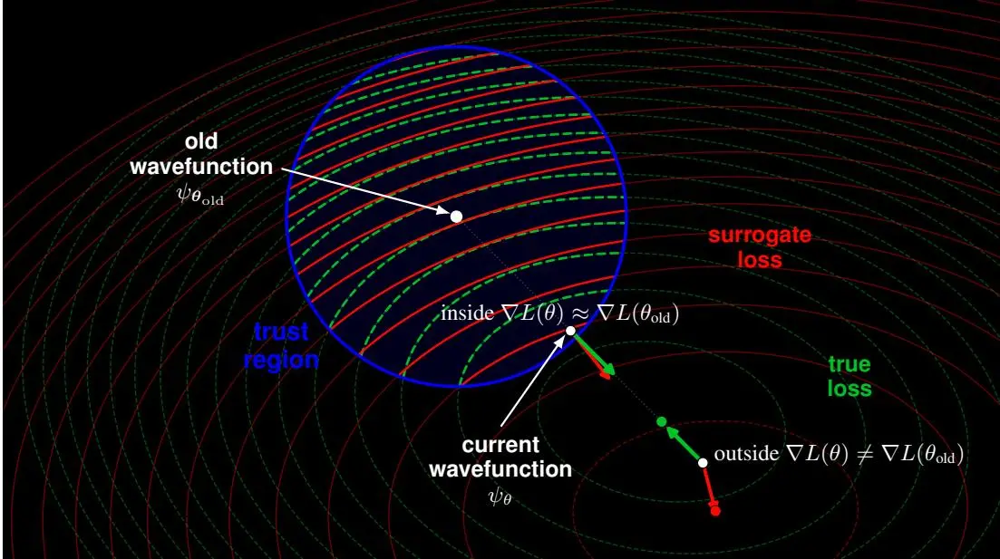
图1：PWO 的信任区域直觉。在信任区域内，替代函数曲面提供可靠的局部改进方向；在信任区域外，替代函数曲面与真实曲面可能存在显著差异。

### 4 理论分析

PWO 的理论依据与策略优化中的单调改进分析类似。在 CPI [Kakade and Langford, 2002] 和 TRPO [Schulman et al., 2015] 中，真实回报的变化由一个在参考策略下的替代目标函数加上一个远离该策略的惩罚项来控制。PWO 遵循相同原理，只是将回报替换为负变分能量，概率比控制幅值通道，相位增量控制相位通道。图 1 说明了这一原理：信任区域通过使优化过程足够接近参考波函数 $\psi_{\pmb{\theta}_{\mathrm{old}}}$，从而使得在旧样本上评估的替代损失函数仍是当前能量曲面的可控近似，进而实现样本复用。定理 4.1 表明，这种近端构造保留了精确的局部 VMC 方向。

定理 4.1 (PWO 的一阶一致性). 令 $| \psi_{\pmb{\theta}} \rangle$ 在 $\pmb{\theta}_{\mathrm{old}}$ 处可微，并假设共同支撑集。对于 $\epsilon , \delta > 0$

$$
\left. \nabla_{\boldsymbol{\theta}} \left(L_{\mathrm{mod}}^{\mathrm{clip}} (\boldsymbol{\theta}) + L_{\mathrm{arg}}^{\mathrm{clip}} (\boldsymbol{\theta})\right) \right| _{\boldsymbol{\theta} = \boldsymbol{\theta}_{\mathrm{old}}} = \left. \nabla_{\boldsymbol{\theta}} E [ \psi_{\boldsymbol{\theta}} ] \right| _{\boldsymbol{\theta} = \boldsymbol{\theta}_{\mathrm{old}}}.\tag{19}
$$

证明见附录 B.6。

因此，PWO 的第一次内部更新完全匹配 VMC 梯度；替代函数仅在复用样本时控制该方向的跟随程度。对于有限更新，仅局部一致性是不够的。令 $r_{\theta} = \mathcal{P}_{\theta} / \mathcal{P}_{\theta_{\mathrm{old}}}$，αθ 为包裹相位增量，并定义

$$
\mathcal{A}_{\boldsymbol{\theta}_{\mathrm{old}}} (\boldsymbol{\theta}) := 2 \mathbb{E}_{\mathbf{s} \sim \mathcal{P}_{\boldsymbol{\theta}_{\mathrm{old}}}} \left[ \sqrt{r_{\boldsymbol{\theta}}} \left(\cos \alpha_{\boldsymbol{\theta}} A_{\boldsymbol{\theta}_{\mathrm{old}}}^{\mathrm{R}} + \sin \alpha_{\boldsymbol{\theta}} A_{\boldsymbol{\theta}_{\mathrm{old}}}^{\mathrm{I}}\right) \right],\tag{20}
$$

定理 4.2 (不保真度能量界). 令 $| \psi_{\pmb{\theta}_{\mathrm{old}}} \rangle$ 和 $| \psi_{\pmb{\theta}} \rangle$ 是具有共同支撑集的归一化波函数。则

$$
E [ \psi_{\pmb{\theta}} ] - E [ \psi_{\pmb{\theta}_{\mathrm{old}}} ] \leq \mathcal{A}_{\pmb{\theta}_{\mathrm{old}}} (\pmb{\theta}) + 2 \bigg \| \hat{H} - E [ \psi_{\pmb{\theta}_{\mathrm{old}}} ] \mathbb{1} \bigg \| _{\infty} \left(1 - \sqrt{1 - \mathcal{I} (\psi_{\pmb{\theta}_{\mathrm{old}}} , \psi_{\pmb{\theta}})}\right).\tag{21}
$$

证明见附录B.4。

该界限与裁剪无关，且对任意有限更新均成立。截断 PWO 保证则需额外要求：实际更新不仅在采样批次上（该方法仅鼓励而非保证此条件，见附录B.7），而是在全局范围内满足振幅和相位信任域。

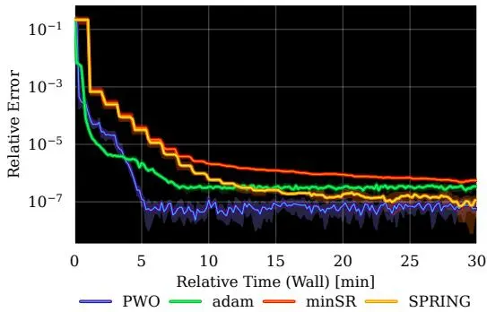

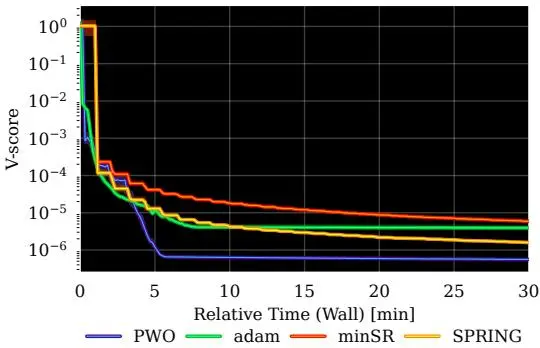
图2：在横场伊辛模型上，PWO、Adam、minSR 和 SPRING 在10个随机种子上的比较。所有方法均使用1024个样本在单个 NVIDIA L40S GPU 上运行。

推论4.3（截断PWO改进保证）。假设定理4.2的条件成立，且中心化局部能量有界，并对所有s满足全局约束 $r_{\pmb{\theta}} ( \mathbf{s} ) \in [ 1 - \epsilon , 1 + \epsilon ]$ 和 $| \alpha_{\pmb \theta} ( \mathbf{s} ) | \leq \delta$，其中 $0 \leq \epsilon \leq 1$，$0 \le \delta \le \pi$。则存在 $C_{\theta_{\mathrm{old}}} < \infty$，使得

$$
E [ \psi_{\boldsymbol{\theta}} ] - E [ \psi_{\boldsymbol{\theta}_{\mathrm{old}}} ] \leq L_{\mathrm{mod}}^{\mathrm{clip}} (\boldsymbol{\theta}) + L_{\mathrm{arg}}^{\mathrm{clip}} (\boldsymbol{\theta}) + 2 C_{\boldsymbol{\theta}_{\mathrm{old}}} \left(1 - \frac{1 + \sqrt{1 - \epsilon^{2}}}{2} \cos^{2} \left(\frac{\delta}{2}\right)\right).\tag{22}
$$

证明见附录B.7。

最后一项为信任域惩罚项。当 $\epsilon , \delta \to 0$ 时该项消失，随着任一裁剪范围放宽而增大。因此，若最小化截断替代函数直至式(22)右侧为负，则更新后的波函数保证具有更低能量。综上，这些结果表明 PWO 遵循精确的局部 VMC 方向，而有限更新误差一般由保真度控制，在全局裁剪下则由显式的振幅和相位信任域控制。

### 5 实验

#### 5.1 自旋链基准测试

我们评估了 PWO 在三种不同自旋系统上应用于150万参数自回归 NQS 的表现。每个系统由具有周期边界条件的 $N = 12$ 个格点的一维自旋-1/2链组成，因此格点索引按模 N 理解。设 $\hat{\sigma}_{i}^{\alpha} , \alpha \in \{x , y , z \}$ 表示格点 i 上的泡利算符，$\hat{\mathbf{S}}_{i} = 1 / 2 ( \hat{\sigma}_{i}^{x} , \hat{\sigma}_{i}^{y} , \hat{\sigma}_{i}^{z} )$。对每个哈密顿量，我们最小化变分能量 $E [ \psi_{\pmb{\theta}} ]$，并报告相对于精确基态能量 ${\cal E}_{0}$ 的相对误差 $\epsilon_{\mathrm{rel}} = ( E [ \tilde{\psi}_{\pmb \theta} ] - \bar{E_{0}} ) / E_{0}$，这些较小的系统均可计算该量。我们还报告了 V 分数 [Wu 等, 2024]，这是一种基于能量方差的尺度不变收敛指标，对于精确本征态该值为零。所选的两个哈密顿量难度递增，因为底层物理需要更复杂的函数来表示。所有优化器使用相同的 NQS 架构和相同数量的蒙特卡洛样本，因此性能差异反映的是优化效果而非模型容量。关于超参数搜索和所用架构的详细信息，见附录 D.1 和 D.2。

**横场伊辛模型**

$$
\hat{H}_{\mathrm{Ising}} = - J \sum_{i = 1}^{N} \hat{\sigma}_{i}^{z} \hat{\sigma}_{i + 1}^{z} - h \sum_{i = 1}^{N} \hat{\sigma}_{i}^{x}.\tag{23}
$$

这里，$J = 1$ 是铁磁耦合强度，$h = 1$ 是横场强度。该哈密顿量是一个标准的无符号问题基准：对角相互作用项倾向于对齐的自旋构型，而横场通过翻转单个自旋引入量子涨落。因此，命题3.1严格成立。

**海森堡 $J_{1} {-} J_{2}$ 链**

$$
\hat{H}_{J_{1} - J_{2}} = J_{1} \sum_{i = 1}^{N} \hat{\mathbf{S}}_{i} \cdot \hat{\mathbf{S}}_{i + 1} + J_{2} \sum_{i = 1}^{N} \hat{\mathbf{S}}_{i} \cdot \hat{\mathbf{S}}_{i + 2}, \qquad J_{1} > 0, J_{2} > 0.\tag{24}
$$

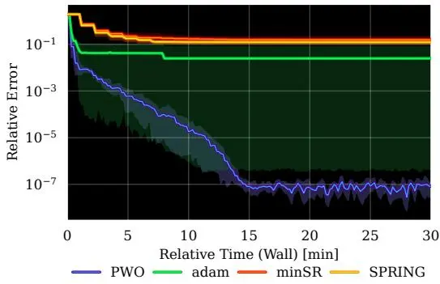

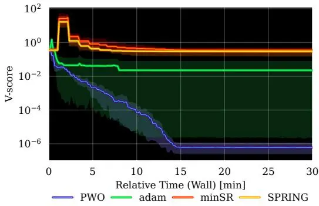
图3：PWO、Adam、minSR 与 SPRING 在 Heisenberg $J_{1} {-} J_{2}$ 链上10个随机种子的对比。MinSR 对该哈密顿量极不稳定，10次运行中有6次产生 NaN。所有方法均在单个 NVIDIA L40S GPU 上使用1024个样本运行。

我们设定 $J_{1} = 1$ 和 $J_{2} = 0.5$，即 $J_{2} / J_{1} = 0.5$。在此比值下，次近邻相互作用最大程度地破坏了近邻反铁磁耦合，将系统置于 Majumdar–Ghosh 点。该点处具有复杂符号结构的高度纠缠基态，使得变分优化和蒙特卡洛采样都极具挑战性 [Sorella, 1998]。与 $\hat{H}_{\mathrm{Ising}}$ 不同，哈密顿量 $\hat{H}_{J_{1} - J_{2}}$ 在计算基上需要非平凡的符号结构；我们采用复值参数化，使 PWO 能够通过其相位通道学习这一结构。该设置旨在评估裁剪相位代理（式 (17)）是否仍是一种实用的启发式方法。我们在附录 E.1 中对 $J_{1} = 0.25$ 和 $J_{2} = 0$（即所谓的 Heisenberg 链）进行了类似研究。

所有结果均基于10个随机种子计算得出。由于多次运行都达到了高精度误差，数值不稳定性可能产生极端离群值。因此，均值和标准差汇总在此情形下并不适用，因为单次不稳定运行可能会扭曲中心估计和不确定性带。我们遵循 Agarwal 等人 [2022] 的做法，改为报告四分位统计量：在每个评估时刻，曲线显示四分位均值（IQM），即舍弃最低和最高四分位数后，对中间50%的种子取平均。阴影区域表示四分位距，即第25百分位数到第75百分位数。这既提供了稳健的中心估计，又展示了运行间的变异性。所有单个种子的曲线图见附录 E.1 至 E.3。我们在附录 C.4 中讨论了我们方法的局限性。

#### 5.2 收敛性与稳定性结果

图2显示，在一维伊辛模型上，PWO 是四种优化器中收敛最快的，约在5分钟内达到相对误差 $10^{-7}$，而 minSR 需要约30分钟才能达到相同精度。V 分数也呈现相同趋势：PWO 迅速抑制能量波动，表明近端目标函数不仅改进了能量估计，还驱动状态向本征态收敛。Adam 和 SPRING 也稳步进展，但需要更多挂钟时间才能达到相同精度。MinSR 在该较简单的哈密顿量上表现稳定，但其每步计算成本使其在挂钟时间上显著更慢。

在图3的 $J_{1} {-} J_{2}$ 哈密顿量上，PWO 在大约15分钟内达到相对误差 $10^{-7}$，同时 V 分数持续降低，表明学习到的状态在能量和方差上都趋于收敛。相比之下，Adam 由于离群值，在比 PWO 高出数个数量级处出现平台。此外，与伊辛模型相比，PWO 与 minSR 及 SPRING 的对比更为显著：minSR 数值不稳定，10次运行中有6次产生 NaN；两者在30分钟后仍停留在 $10^{-1}$ 的相对误差。尽管使用了曲率启发式的更新，这些方法仍难以取得进展，并表现出数值不稳定性。这是本文核心论点最有力的实验证据：一种 PPO 风格的近端目标函数可以保留一阶优化的低挂钟时间成本，同时提供在困难量子哈密顿量上训练表达能力强的 NQS 所需的稳定性。附录 E.1 中关于 Heisenberg 链的实验也得出了相同结论。我们还为更清晰和更易观察，在附录 E.1 中绘制了未经聚合或过滤的所有单个种子曲线。

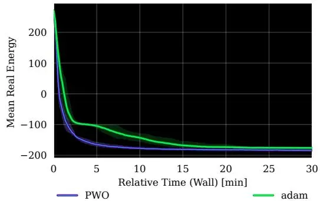

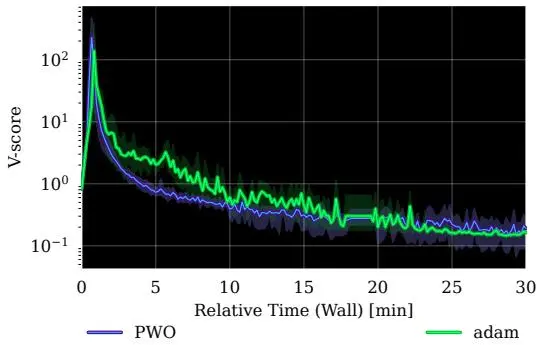
图4：$10 \times 10$ 晶格上的二维受挫 $J_{1} {-} J_{2}$ Heisenberg 模型。左图：平均真实能量。右图：V 分数。PWO 在相同挂钟时间预算内比 Adam 更快达到更低能量，并保持更低的基于方差的误差信号。

#### 5.3 方晶格上的二维 $J_{1} {-} J_{2}$ 模型

我们接下来测试 PWO 在一维链之外是否仍然有效，研究对象是受挫方晶格 $J_{1} {-} J_{2}$ Heisenberg 模型，采用周期性边界条件，系统尺寸为 $10 \times 10$。我们使用带有二维 RoPE 的复值块自回归 Transformer，并强制施加零磁化扇区。由于在此尺寸下精确对角化不可行，我们通过平均真实能量和 V 分数来比较优化器。如图4所示，PWO 比 Adam 更快地降低能量，并在相同挂钟时间预算内达到更低的能量区间。V 分数也呈现相同趋势，表明近端目标函数在该受挫二维基准上也能提升稳定性。单个种子的运行结果见附录 E.1。

#### 5.4 可扩展性实验

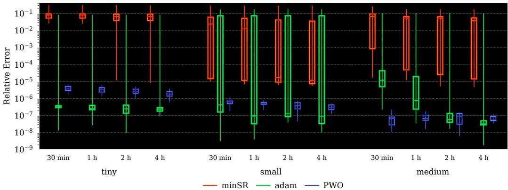
图5：不同模型规模和优化方法下的挂钟时间扩展性对比。箱线图显示种子间的四分位均值相对误差，箱子表示四分位距，线段表示最小值和最大值。结果按模型规模和挂钟时间分组，并在单个 NVIDIA A100 GPU 上运行。

图5比较了PWO、Adam和minSR在Heisenberg $J_{1} {-} J_{2}$ 链上（详见附录D.7）随着NQS模型规模增大时的扩展行为。PWO在所有NQS规模下均表现出稳定性和单调的能量改进，并在前30分钟内接近最终能量。相比之下，minSR既不稳定，也从未达到有竞争力的能量值。Adam在极小网络上的表现最佳，但在中小规模NQS中稳定性和效率下降，而PWO在此类情况下既更快又更可靠。特别地，对于中等NQS，要达到与PWO相当的能量尺度，Adam需要大约4倍的时间。在附录C.2中，我们展示了PWO比其它优化器收敛更快，因为它单位时间内执行的优化步骤更多。虽然Adam在4小时的长时间训练后能达到更低的能量，但观察到的扩展趋势表明，这一优势在更大的网络上可能会减弱。在附录E.2中，我们对样本数和系统规模进行了额外的扩展实验。

#### 5.5 大型语言模型的NQS微调

图6：1.5B参数RWKV7LLM在一维Ising模型上的微调曲线。

图6展示了1.5B参数RWKV-7模型在横向场Ising链上的微调结果。与Adam相比，PWO实现了更低的最终相对误差和V分数，同时在完整挂钟预算内保持了稳定的训练。这一改进并非旨在说明LLM或大型网络[Moss et al., 2026]是一维哈密顿量的正确归纳偏置；而是表明，当ansatz的规模超越现有NQS文献[Rende et al., 2025]三个数量级以上时，近端目标函数依然有效。

### 6 相关工作

强化学习与基态搜索。基态搜索已通过Feynman-Kac表示[Barr et al., 2020]被视为最优控制问题，并且通过将stoquastic哈密顿量视为奖励函数，已为格点模型开发了RL框架[Gispen and Lamacraft, 2022]。最近的元学习方法[Jae et al., 2025]利用RL来优化量子态学习过程本身。然而，这些工作要么通过理论重新表述问题，要么通过优化学习过程来应用RL。我们则直接将RL作为主要的优化框架，并将其应用于NQS ansatz。

重要性采样与信赖域。此前已在非自回归NQS优化中探索过样本复用和近端目标函数。Yang等人[2020]引入了重要性采样梯度优化（ISGO），该方法通过使用当前波函数与参考波函数之间的概率比对局部能量进行加权，从而在多个梯度更新中复用马尔可夫链样本。在此基础上，Chen等人[2022]引入了一种受PPO启发的相位变化余弦惩罚。我们的工作在命题3.1中形式化了与RL的类比，直接在虚梯度上使用不同的裁剪目标函数而非惩罚项，并使策略-梯度对应关系精确，从而首次实现了十亿参数模型的稳定训练。

### 7 结论

我们提出了近端波函数优化（PWO），一种可扩展的一阶优化器，用于神经量子态（NQS），其源于变分蒙特卡洛与强化学习（RL）之间的显式联系。在固定相位stoquastic设定下，我们证明了变分能量最小化可以写成关于Born分布的优势策略梯度目标函数，其中自旋构型充当动作，中心化的局域能量充当优势函数。这将NQS优化重新表述为一个信赖域策略优化问题，启发了一种PPO风格的算法，该算法在振幅通道中对概率比变化进行裁剪，并通过一个裁剪的相位增量替代函数自然地扩展到复波函数。在自旋链基准测试中，PWO在挂钟收敛速度和稳定性上优于Adam、minSR和SPRING，在优化最脆弱的阻挫区域取得了最大提升。最后，通过将1.5B参数的RWKV-7模型作为自回归NQS进行微调，我们将NQS训练带入现代大规模序列建模的领域。更广泛地，我们的研究结果架起了RL和NQS社区之间的桥梁，促进了进一步的相互启发。通过解锁大型自回归NQS，PWO为研究仅凭规模这一“苦涩教训”的精神是否能克服量子多体模拟中的当前障碍打开了大门。

### 可复现性声明

复现我们实验的代码可在 <https://github.com/jduquevan/> hyperscalenqs 获取。完整的实验细节，包括超参数搜索、模型架构、优化器设置、样本预算和扩展配置，见附录D。

### 致谢

本工作得到了荷兰科学研究组织（NWO/OCW）的支持，作为Quantum Limits（项目编号SUMMIT.1.1016）的一部分。本出版物也是项目“最优数字-模拟量子电路”（文件编号NGF.1582.22.026）的一部分，该项目属于研究计划NGF Quantum Delta NL 2022，由荷兰研究委员会（NWO）和荷兰国家增长基金计划Quantum Delta NL（部分）资助。Juan Agustín Duque获得蒙特利尔大学St-Pierre-Larochelle奖学金以及Aaron Courville的系统泛化表示CIFAR AI主席的支持。

### 参考文献

Alekh Agarwal, Nan Jiang, Sham Kakade, and Wen Sun. Reinforcement Learning: Theory and Algorithms. Draft/Preprint, 2021. URL <https://rltheorybook.github.io/.>

Rishabh Agarwal, Max Schwarzer, Pablo Samuel Castro, Aaron Courville, and Marc G. Bellemare. Deep reinforcement learning at the edge of the statistical precipice. arXiv preprint arXiv:2108.13264, 2022. doi: 10.48550/arXiv.2108.13264. URL <https://arxiv.org/abs/> 2108.13264.

Shun-ichi Amari. Natural gradient works efficiently in learning. Neural Computation, 10(2): 251–276, 1998. doi: 10.1162/089976698300017746. URL <https://doi.org/10.1162/> 089976698300017746.

Ariel Barr, Willem Gispen, and Austen Lamacraft. Quantum ground states from reinforcement learning. In Proceedings of the First Mathematical and Scientific Machine Learning Conference, volume 107 of Proceedings of Machine Learning Research, pages 635–653, 2020. URL https: //proceedings.mlr.press/v107/barr20a.html.

Giuseppe Carleo and Matthias Troyer. Solving the quantum many-body problem with artificial neural networks. Science, 355(6325):602–606, 2017. doi: 10.1126/science.aag2302. URL <https://doi.org/10.1126/science.aag2302.>

Ao Chen and Markus Heyl. Empowering deep neural quantum states through efficient optimization. Nature Physics, 20(9):1476–1481, 2024. doi: 10.1038/s41567-024-02566-1. URL https: //doi.org/10.1038/s41567-024-02566-1.

Hongwei Chen, Douglas Gerard Hendry, Phillip E. Weinberg, and Adrian Feiguin. Systematic improvement of neural network quantum states using Lanczos. In Advances in Neural Information Processing Systems, 2022. URL <https://openreview.net/forum?id=qZUHvvtbzy.>

Kenny Choo, Antonio Mezzacapo, and Giuseppe Carleo. Fermionic neural-network states for ab-initio electronic structure. Nature Communications, 11(1):2368, 2020. doi: 10.1038/ s41467-020-15724-9. URL <https://doi.org/10.1038/s41467-020-15724-9.>

Anna Dawid, Julian Arnold, Borja Requena, Alexander Gresch, Marcin Płodzien, Kaelan Donatella,´ Kim A. Nicoli, Paolo Stornati, Rouven Koch, Miriam Büttner, Robert Okuła, Gorka Muñoz Gil, Rodrigo A. Vargas-Hernández, Alba Cervera-Lierta, Juan Carrasquilla, Vedran Dunjko, Marylou Gabrié, Patrick Huembeli, Evert van Nieuwenburg, Filippo Vicentini, Lei Wang, Sebastian J. Wetzel, Giuseppe Carleo, Eliška Greplová, Roman Krems, Florian Marquardt, Michał Tomza, Maciej Lewenstein, and Alexandre Dauphin. Machine Learning in Quantum Sciences. Cambridge University Press, 2025. ISBN 9781009504935. doi: 10.1017/9781009504942. URL https: //doi.org/10.1017/9781009504942.

Luigi Del Debbio, Gian Mario Manca, and Ettore Vicari. Critical slowing down of topological modes. Physics Letters B, 594(3–4):315–323, 2004. doi: 10.1016/j.physletb.2004.05.038. URL <https://doi.org/10.1016/j.physletb.2004.05.038.>

Mehdi Drissi, James W. T. Keeble, Javier Rozalén Sarmiento, and Arnau Rios. Second-order optimization strategies for neural network quantum states. Philosophical Transactions of the Royal Society A, 382(2275):20240057, 2024. doi: 10.1098/rsta.2024.0057. URL <https://doi.org/> 10.1098/rsta.2024.0057.

Chloé Gauvin-Ndiaye, Joseph Tindall, Javier Robledo Moreno, and Antoine Georges. Mott transition and volume law entanglement with neural quantum states. Physical Review Letters, 134(7): 076502, 2025. doi: 10.1103/PhysRevLett.134.076502. URL <https://doi.org/10.1103/> PhysRevLett.134.076502.

Willem Gispen and Austen Lamacraft. Ground states of quantum many body lattice models via reinforcement learning. In Proceedings of the 2nd Mathematical and Scientific Machine Learning Conference, volume 145 of Proceedings of Machine Learning Research, pages 369–385, 2022. URL <https://proceedings.mlr.press/v145/gispen22a.html.>

Gil Goldshlager, Nilin Abrahamsen, and Lin Lin. A Kaczmarz-inspired approach to accelerate the optimization of neural network wavefunctions. Journal of Computational Physics, 516: 113351, 2024. doi: 10.1016/j.jcp.2024.113351. URL <https://doi.org/10.1016/j.jcp.> 2024.113351.

Jan Hermann, Zeno Schätzle, and Frank Noé. Deep-neural-network solution of the electronic Schrödinger equation. Nature Chemistry, 12(10):891–897, 2020. doi: 10.1038/s41557-020-0544-y. URL <https://doi.org/10.1038/s41557-020-0544-y.>

Mohamed Hibat-Allah, Martin Ganahl, Lauren E. Hayward, Roger G. Melko, and Juan Carrasquilla. Recurrent neural network wave functions. Physical Review Research, 2(2):023358, 2020. doi: 10.1103/PhysRevResearch.2.023358. URL <https://doi.org/10.1103/PhysRevResearch.> 2.023358.

Roger A. Horn and Charles R. Johnson. Matrix Analysis. Cambridge University Press, Cambridge, 2 edition, 2012. ISBN 9780521839402. doi: 10.1017/CBO9780511810817. URL https: //doi.org/10.1017/CBO9780511810817.

Jeongwoo Jae, Jeonghoon Hong, Jinho Choo, and Yeong-Dae Kwon. Reinforcement learning to learn quantum states for Heisenberg scaling accuracy. Advanced Quantum Technologies, 8(10), 2025. doi: 10.1002/qute.202500206. URL <https://doi.org/10.1002/qute.202500206.>

Sham Kakade and John Langford. Approximately optimal approximate reinforcement learning. In Proceedings of the Nineteenth International Conference on Machine Learning, pages 267–274, 2002. URL <https://dl.acm.org/doi/10.5555/645531.656005.>

Diederik P. Kingma and Jimmy Ba. Adam: A method for stochastic optimization. arXiv preprint arXiv:1412.6980, 2014. doi: 10.48550/arXiv.1412.6980. URL <https://arxiv.org/abs/1412.> 6980.

Hannah Lange, Anka Van de Walle, Atiye Abedinnia, and Annabelle Bohrdt. From architectures to applications: A review of neural quantum states. arXiv preprint arXiv:2402.09402, 2024. doi: 10.48550/arXiv.2402.09402. URL <https://arxiv.org/abs/2402.09402.>

Jing Liu, Ying Tang, and Pan Zhang. Efficient optimization of variational autoregressive networks with natural gradient. Physical Review E, 111(2):025304, 2025. doi: 10.1103/PhysRevE.111.025304. URL <https://doi.org/10.1103/PhysRevE.111.025304.>

James Martens and Roger Grosse. Optimizing neural networks with Kronecker-factored approximate curvature. In Proceedings of the 32nd International Conference on Machine Learning, pages 2408–2417, 2015. URL <https://proceedings.mlr.press/v37/martens15.html.>

Ejaaz Merali, Mohamed Hibat-Allah, Mohammad Kohandel, Richard T. Scalettar, and Ehsan Khatami. Parallel scan recurrent neural quantum states for scalable variational monte carlo, 2026. URL <https://arxiv.org/abs/2605.13807.>

M. Schuyler Moss, Roeland Wiersema, Mohamed Hibat-Allah, Juan Carrasquilla, and Roger G. Melko. Leveraging recurrence in neural network wavefunctions for large-scale simulations of Heisenberg antiferromagnets on the square lattice. Physical Review B, 112(13):134450, 2025. ISSN 2469-9950. doi: 10.1103/6ccd-wzhz.

M. Schuyler Moss, Alev Orfi, Christopher Roth, Anirvan M. Sengupta, Antoine Georges, Dries Sels, Anna Dawid, and Agnes Valenti. Double descent: When do neural quantum states generalize? Physical Review E, 113(4):045303, 2026. ISSN 2470-0045. doi: 10.1103/cwmj-fxr4. URL <https://link.aps.org/doi/10.1103/cwmj-fxr4.>

Yusuke Nomura and Masatoshi Imada. Dirac-type nodal spin liquid revealed by refined quantum many-body solver using neural-network wave function, correlation ratio, and level spectroscopy. Physical Review X, 11(3):031034, 2021. doi: 10.1103/PhysRevX.11.031034. URL https: //doi.org/10.1103/PhysRevX.11.031034.

Jannes Nys, Gabriel Pescia, Alessandro Sinibaldi, and Giuseppe Carleo. Ab-initio variational wave functions for the time-dependent many-electron Schrödinger equation. Nature Communications, 15(1):9404, 2024. doi: 10.1038/s41467-024-53672-w. URL <https://doi.org/10.1038/> s41467-024-53672-w.

Bo Peng, Ruichong Zhang, Daniel Goldstein, Eric Alcaide, Xingjian Du, Haowen Hou, Jiaju Lin, Jiaxing Liu, Janna Lu, William Merrill, Guangyu Song, Kaifeng Tan, Saiteja Utpala, Nathan Wilce, Johan S. Wind, Tianyi Wu, Daniel Wuttke, and Christian Zhou-Zheng. RWKV-7 “goose” with expressive dynamic state evolution. arXiv preprint arXiv:2503.14456, 2025. doi: 10.48550/arXiv. 2503.14456. URL <https://arxiv.org/abs/2503.14456.>

Gabriel Pescia, Jannes Nys, Jane Kim, Alessandro Lovato, and Giuseppe Carleo. Message-passing neural quantum states for the homogeneous electron gas. Physical Review B, 110(3):035108, 2024. doi: 10.1103/PhysRevB.110.035108. URL <https://doi.org/10.1103/PhysRevB.110.> 035108.

David Pfau, James S. Spencer, Alexander G. D. G. Matthews, and W. M. C. Foulkes. Ab initio solution of the many-electron Schrödinger equation with deep neural networks. Physical Review Research, 2(3):033429, 2020. doi: 10.1103/PhysRevResearch.2.033429. URL <https://doi.> org/10.1103/PhysRevResearch.2.033429.

Yi Ren and Donald Goldfarb. Efficient subsampled Gauss-Newton and natural gradient methods for training neural networks. arXiv preprint arXiv:1906.02353, 2019. doi: 10.48550/arXiv.1906.02353. URL <https://arxiv.org/abs/1906.02353.>

Riccardo Rende, Luciano Loris Viteritti, Lorenzo Bardone, Federico Becca, and Sebastian Goldt. A simple linear algebra identity to optimize large-scale neural network quantum states. Communications Physics, 7(1):260, 2024. doi: 10.1038/s42005-024-01732-4. URL https: //doi.org/10.1038/s42005-024-01732-4.

Riccardo Rende, Luciano Loris Viteritti, Federico Becca, Antonello Scardicchio, Alessandro Laio, and Giuseppe Carleo. Foundation neural-networks quantum states as a unified ansatz for multiple hamiltonians. Nature Communications, 16(1):7213, 2025. doi: 10.1038/s41467-025-62098-x.

Herbert Robbins and Sutton Monro. A stochastic approximation method. The Annals of Mathematical Statistics, 22(3):400–407, 1951. doi: 10.1214/aoms/1177729586. URL <https://doi.org/10.> 1214/aoms/1177729586

Bidipta Sarkar, Mattie Fellows, Juan Agustin Duque, Alistair Letcher, Antonio León Villares, Anya Sims, Clarisse Wibault, Dmitry Samsonov, Dylan Cope, Jarek Liesen, Kang Li, Lukas Seier, Theo Wolf, Uljad Berdica, Valentin Mohl, Alexander David Goldie, Aaron Courville, Karin Sevegnani, Shimon Whiteson, and Jakob Nicolaus Foerster. Evolution strategies at the hyperscale. arXiv preprint arXiv:2511.16652, 2026. doi: 10.48550/arXiv.2511.16652. URL <https://arxiv.org/abs/2511.16652.>

John Schulman, Sergey Levine, Philipp Moritz, Michael I. Jordan, and Pieter Abbeel. Trust region policy optimization. arXiv preprint arXiv:1502.05477, 2015. doi: 10.48550/arXiv.1502.05477. URL <https://arxiv.org/abs/1502.05477.>

John Schulman, Filip Wolski, Prafulla Dhariwal, Alec Radford, and Oleg Klimov. Proximal policy optimization algorithms. arXiv preprint arXiv:1707.06347, 2017. doi: 10.48550/arXiv.1707.06347. URL <https://arxiv.org/abs/1707.06347.>

Kristof T. Schütt, Huziel E. Sauceda, Pieter-Jan Kindermans, Alexandre Tkatchenko, and Klaus-Robert Müller. Schnet—a deep learning architecture for molecules and materials. The Journal of Chemical Physics, 148(24):241722, 2018. doi: 10.1063/1.5019779. URL <https://doi.org/10.> 1063/1.5019779.

Or Sharir, Yoav Levine, Noam Wies, Giuseppe Carleo, and Amnon Shashua. Deep autoregressive models for the efficient variational simulation of many-body quantum systems. Physical Review Letters, 124(2):020503, 2020. doi: 10.1103/PhysRevLett.124.020503. URL <https://doi.org/> 10.1103/PhysRevLett.124.020503.

Ahmedeo Shokry, Alessandro Santini, and Filippo Vicentini. When less is more: Approximating the quantum geometric tensor with block structures. arXiv preprint arXiv:2510.08430, 2025. doi: 10.48550/arXiv.2510.08430. URL <https://arxiv.org/abs/2510.08430.>

Leslie N. Smith and Nicholay Topin. Super-convergence: Very fast training of neural networks using large learning rates. arXiv preprint arXiv:1708.07120, 2018. doi: 10.48550/arXiv.1708.07120. URL <https://arxiv.org/abs/1708.07120.>

Sandro Sorella. Green function Monte Carlo with stochastic reconfiguration. Physical Review Letters, 80(20):4558–4561, 1998. doi: 10.1103/PhysRevLett.80.4558. URL <https://doi.org/> 10.1103/PhysRevLett.80.4558.

Ingrid von Glehn, James S. Spencer, and David Pfau. A self-attention ansatz for ab-initio quantum chemistry. In International Conference on Learning Representations, 2023. URL <https:// openreview.net/forum?id=xveTeHVlF7j.

Jia-Qi Wang, Rong-Qiang He, and Zhong-Yi Lu. Generalized Lanczos method for systematic optimization of neural-network quantum states. Physical Review B, 113(8):085120, 2026. doi: 10.1103/PhysRevB.113.085120. URL <https://doi.org/10.1103/PhysRevB.113.085120.>

Ronald J. Williams. Simple statistical gradient-following algorithms for connectionist reinforcement learning. Machine Learning, 8(3–4):229–256, 1992. doi: 10.1007/BF00992696. URL https: //doi.org/10.1007/BF00992696.

Ulli Wolff. Critical slowing down. Nuclear Physics B - Proceedings Supplements, 17:93–102, 1990. doi: 10.1016/0920-5632(90)90224-I. URL <https://doi.org/10.1016/0920-5632(90)> 90224-I.

Dian Wu, Riccardo Rossi, Filippo Vicentini, Nikita Astrakhantsev, Federico Becca, Xiaodong Cao, Juan Carrasquilla, Francesco Ferrari, Antoine Georges, Mohamed Hibat-Allah, Masatoshi Imada, Andreas M. Läuchli, Guglielmo Mazzola, Antonio Mezzacapo, Andrew Millis, Javier Robledo Moreno, Titus Neupert, Yusuke Nomura, Jannes Nys, Olivier Parcollet, Rico Pohle, Imelda Romero, Michael Schmid, J. Maxwell Silvester, Sandro Sorella, Luca F. Tocchio, Lei Wang, Steven R. White, Alexander Wietek, Qi Yang, Yiqi Yang, Shiwei Zhang, and Giuseppe Carleo. Variational benchmarks for quantum many-body problems. Science, 386(6719):296–301, 2024. doi: 10.1126/science.adg9774. URL <https://doi.org/10.1126/science.adg9774.>

Li Yang, Zhaoqi Leng, Guangyuan Yu, Ankit Patel, Wen-Jun Hu, and Han Pu. Deep learningenhanced variational Monte Carlo method for quantum many-body physics. Physical Review Research, 2(1):012039, 2020. doi: 10.1103/PhysRevResearch.2.012039. URL <https://doi.> org/10.1103/PhysRevResearch.2.012039.

### Appendix

B.1 Proof of Proposition 3.1 . . . . . . . . . . . . . . . . . . . . . . . . . . . . . . . . . . . . . . . . . . . . . . . . . . . . . . . . . . . . . . . . . . . . . . B.2 Variational Gradient Derivation . . . . . . . . . . . . . . . . . . . . . . . . . . . . . . . B.3 Variational Gradient Decomposition. 19
B.4 Exact Complex-Amplitude Decomposition. 19
B.5 Amplitude and Phase Trust Regions Control Infidelity. 21
B.6 PWO Surrogate Upper Bound and First-Order Consistency. 21
B.7 Clipped PWO Improvement Certificate. 23
C.1 Numerical Cost of Stochastic Reconfiguration and Improvements. 25
C.2 Relative Speed of PWO per Iteration. 25
C.3 Why RWKV? 26
C.4 Limitations of PWO. 26
D.1 Hyperparameter search. 27
D.2 Neural Quantum State Architecture. 27
D.3 Ising Model. 28
D.4 Heisenberg Chain. 28
D.5 Heisenberg $J_{1} - J_{2}$ Chain. 29
D.6 Two-dimensional $J_{1} - J_{2}$ square-lattice experiment. 29
D.7 Scaling Experiment. 30
D.8 RWKV-7 on Ising Model. 31
E.1 Individual Seed Plots for All Hamiltonias. 32
E.2 Scaling Samples and System Sizes. 33
E.3 Individual Seed Plots for RWKV7 Fine-tuning. 34

### A Dirac Notation

This appendix provides a self-contained introduction to the Dirac (bra-ket) notation used throughout the paper.

Hilbert space. A quantum state lives in a complex vector space H called a Hilbert space, equipped with an inner product. For a system of N spin-1/2 particles, the Hilbert space is $\mathcal{H} = \dot{(} \mathbb{C}^{2} )^{\otimes N}$ , which has dimension $2^{N}$ . A natural orthonormal basis is the computational (spin) basis, whose elements |s⟩ are indexed by binary spin configurations $\mathbf{s} \in \{\pm 1 \}^{N}$

Ket vectors. A quantum state is written as a ket $| \psi \rangle$ , which is simply a column vector in H. Any state can be expanded in the computational basis,

$$
| \psi \rangle = \sum_{\mathbf{s} \in \{\pm 1 \}^{N}} \psi (\mathbf{s}) | \mathbf{s} \rangle ,\tag{25}
$$

where each coefficient $\psi ( \mathbf{s} ) \in \mathbb{C}$ is the amplitude of configuration s. The vector $| \psi \rangle$ is therefore completely specified by the mapping $\mathbf{s} \mapsto \boldsymbol \psi ( \mathbf{s} )$ , which NQS parameterize with a neural network.

Bra vectors and inner product. The bra ⟨ψ| is the conjugate transpose (Hermitian adjoint) of |ψ⟩,

$$
\langle \psi | = | \psi \rangle^{\dagger}.\tag{26}
$$

The inner product of two states is written $\langle \phi | \psi \rangle$ , which evaluates to the complex number $\sum_{\mathbf{s}} \phi ( \mathbf{s} )^{*} \psi ( \mathbf{\hat{s}} )$ . When $\phi = \psi$ this gives the squared norm $\begin{array} {r} {\langle \psi | \psi \rangle = \sum_{\mathbf{s}} | \psi ( \mathbf{s} ) | ^{2} \geq 0} \end{array}$ , with equality only for the zero vector. The basis states are orthonormal:

$$
\langle \mathbf{s} | \mathbf{s}^{\prime} \rangle = \delta_{\mathbf{s}, \mathbf{s}^{\prime}},\tag{27}
$$

where $\delta_{\mathbf{s} , \mathbf{s}^{\prime}}$ is the Kronecker delta.

Completeness relation. The basis states form a complete set, meaning the identity operator 1 can be resolved as

$$
\sum_{\mathbf{s}} | \mathbf{s} \rangle \langle \mathbf{s} | = \mathbb{1}.\tag{28}
$$

This is used repeatedly in derivations (e.g. Appendix B.2) to insert a basis expansion and convert abstract operator equations into sums over spin configurations.

Operators and matrix elements. A quantum operator $\hat{A}$ is a linear map $\mathcal{H} \mathcal{H} ,$ , represented as a $2^{N} \times 2^{N}$ matrix in the computational basis. The entry at row s and column s′ is the matrix element

$$
\langle \mathbf{s} | \hat{A} | \mathbf{s}^{\prime} \rangle = \langle \mathbf{s} | (\hat{A} | \mathbf{s}^{\prime} \rangle) = (\mathbf{A})_{\mathbf{s}, \mathbf{s}^{\prime}}.\tag{29}
$$

An operator is Hermitian (or self-adjoint) if $\hat{A} = \hat{A}^{\dagger}$ , which implies real eigenvalues. The Hamiltonian Hˆ is always Hermitian because energy is a real-valued observable.

Expectation value. The expected value of an observable $\hat{A}$ in state $| \psi \rangle$ is

$$
\langle \hat{A} \rangle_{\psi} := \frac{\langle \psi | \hat{A} | \psi \rangle}{\langle \psi | \psi \rangle}.\tag{30}
$$

For the Hamiltonian, this gives the variational energy $E [ \psi ] = \left. \psi | \hat{H} | \psi \right. / \left. \psi | \psi \right.$ that NQS minimizes. When |ψ⟩ is normalized $( \langle \psi | \psi \rangle = 1 )$ , the denominator can be dropped.

### Summary table.

<table><tr><td>Dirac symbol</td><td>Linear-algebra equivalent</td><td>Meaning in this paper</td></tr><tr><td> $|\psi\rangle$ </td><td>column vector in  $\mathbb{C}^{2^N}$ </td><td>quantum state / wavefunction</td></tr><tr><td> $\langle\psi|$ </td><td>conjugate row vector</td><td>dual / adjoint state</td></tr><tr><td> $\langle\phi|\psi\rangle$ </td><td> $\phi^\dagger\psi$  (dot product)</td><td>inner product; overlap of two states</td></tr><tr><td> $\langle\psi|\psi\rangle$ </td><td> $\| \psi \| ^2$ </td><td>squared norm; = 1 for normalized states</td></tr><tr><td> $|s\rangle$ </td><td>standard basis vector  $e_s$ </td><td>spin-configuration basis state</td></tr><tr><td> $\langle s|\hat{H}|s'\rangle$ </td><td> $(\mathbf{H})_{s,s'}$  matrix entry</td><td>Hamiltonian matrix element</td></tr><tr><td> $\langle\psi|\hat{H}|\psi\rangle$ </td><td> $\psi^\dagger\mathbf{H}\psi$  (quadratic form)</td><td>(unnormalized) variational energy</td></tr><tr><td> $\sum_s |s\rangle \langle s|$ </td><td> $\mathbb{1}_{2^N}$  (identity matrix)</td><td>completeness / resolution of identity</td></tr></table>

### B Mathematical Statements

### B.1 Proof of Proposition 3.1

Proposition 3.1 (Policy-gradient form of variational energy minimization). Assume the Hamiltonian is stoquastic, i.e. its matrix representation in a chosen computational basis has non-positive offdiagonal elements. Then we can assume $f_{\pmb \theta} = \log \psi_{\pmb \theta} = \log | \bar{\psi}_{\pmb \theta} |$ , and the gradient of the variational energy can be written in policy-gradient form as

$$
\nabla_{\boldsymbol{\theta}} E [ \psi_{\boldsymbol{\theta}} ] = \mathbb{E}_{\mathbf{s} \sim \mathcal{P}_{\boldsymbol{\theta}}} \big [ \big (E_{\boldsymbol{\theta}}^{\mathrm{loc}} (\mathbf{s}) - \mathbb{E}_{\mathbf{s} \sim \mathcal{P}_{\boldsymbol{\theta}}} [ E_{\boldsymbol{\theta}}^{\mathrm{loc}} (\mathbf{s}) ] \big) \nabla_{\boldsymbol{\theta}} \log \mathcal{P}_{\boldsymbol{\theta}} (\mathbf{s}) \big ].\tag{14}
$$

In particular, variational energy minimization is equivalent to an advantage policy-gradient update over configurations. For a proof, see Appendix B.1.

Proof. We follow the proof strategy of the policy gradient theorem [Agarwal et al., 2021] to connect the standard NQS/VMC gradient estimator with REINFORCE-style updates when the probability distribution is parameterized autoregressively.

Differentiating gives

$$
\nabla_{\pmb{\theta}} E [ \psi_{\pmb{\theta}} ] = \nabla_{\pmb{\theta}} \sum_{\mathbf{s}} \mathcal{P}_{\pmb{\theta}} (\mathbf{s}) E_{\pmb{\theta}}^{\mathrm{loc}} (\mathbf{s})\tag{31}
$$

$$
= \sum_{\mathbf{s}} \nabla_{\boldsymbol{\theta}} \mathcal{P}_{\boldsymbol{\theta}} (\mathbf{s}) E_{\boldsymbol{\theta}}^{\mathrm{loc}} (\mathbf{s}) + \sum_{\mathbf{s}} \mathcal{P}_{\boldsymbol{\theta}} (\mathbf{s}) \nabla_{\boldsymbol{\theta}} E_{\boldsymbol{\theta}}^{\mathrm{loc}} (\mathbf{s})\tag{32}
$$

$$
= \sum_{\mathbf{s}} \mathcal{P}_{\boldsymbol{\theta}} (\mathbf{s}) E_{\boldsymbol{\theta}}^{\text{loc}} (\mathbf{s}) \nabla_{\boldsymbol{\theta}} \log \mathcal{P}_{\boldsymbol{\theta}} (\mathbf{s}) + \sum_{\mathbf{s}} \mathcal{P}_{\boldsymbol{\theta}} (\mathbf{s}) \nabla_{\boldsymbol{\theta}} E_{\boldsymbol{\theta}}^{\text{loc}} (\mathbf{s})\tag{33}
$$

$$
= \mathbb{E}_{\mathbf{s} \sim \mathcal{P}_{\boldsymbol{\theta}}} \big [ E_{\boldsymbol{\theta}}^{\mathrm{loc}} (\mathbf{s}) \nabla_{\boldsymbol{\theta}} \log \mathcal{P}_{\boldsymbol{\theta}} (\mathbf{s}) \big ] + \mathbb{E}_{\mathbf{s} \sim \mathcal{P}_{\boldsymbol{\theta}}} \big [ \nabla_{\boldsymbol{\theta}} E_{\boldsymbol{\theta}}^{\mathrm{loc}} (\mathbf{s}) \big ].\tag{34}
$$

We now analyze the second term. Define the log-derivative observable

$$
\mathbf{O} (\mathbf{s}) := \nabla_{\boldsymbol{\theta}} \log \psi_{\boldsymbol{\theta}} (\mathbf{s}),
$$

then

$$
\mathbb{E}_{\mathbf{s} \sim \mathcal{P}_{\boldsymbol{\theta}}} \big [ \nabla_{\boldsymbol{\theta}} E_{\boldsymbol{\theta}}^{\mathrm{loc}} (\mathbf{s}) \big ] = \mathbb{E}_{\mathbf{s} \sim \mathcal{P}_{\boldsymbol{\theta}}} \Bigg [ \nabla_{\boldsymbol{\theta}} \sum_{\mathbf{s}^{\prime}} \frac{\psi_{\boldsymbol{\theta}} (\mathbf{s}^{\prime})}{\psi_{\boldsymbol{\theta}} (\mathbf{s})} \left< \mathbf{s} | \hat{H} | \mathbf{s}^{\prime} \right> \Bigg ]\tag{35}
$$

$$
= \mathbb{E}_{\mathbf{s} \sim \mathcal{P}_{\boldsymbol{\theta}}} \left[ \sum_{\mathbf{s}^{\prime}} \langle \mathbf{s} | \hat{H} | \mathbf{s}^{\prime} \rangle \frac{(\psi_{\boldsymbol{\theta}} (\mathbf{s}) \nabla_{\boldsymbol{\theta}} \psi_{\boldsymbol{\theta}} (\mathbf{s}^{\prime}) - \nabla_{\boldsymbol{\theta}} \psi_{\boldsymbol{\theta}} (\mathbf{s}) \psi_{\boldsymbol{\theta}} (\mathbf{s}^{\prime}))}{\psi_{\boldsymbol{\theta}} (\mathbf{s})^{2}} \right]\tag{36}
$$

$$
= \mathbb{E}_{\mathbf{s} \sim \mathcal{P}_{\boldsymbol{\theta}}} \left[ \sum_{\mathbf{s}^{\prime}} \langle \mathbf{s} | \hat{H} | \mathbf{s}^{\prime} \rangle \frac{\psi_{\boldsymbol{\theta}} (\mathbf{s}^{\prime})}{\psi_{\boldsymbol{\theta}} (\mathbf{s})} (\mathbf{O} (\mathbf{s}^{\prime}) - \mathbf{O} (\mathbf{s})) \right]\tag{37}
$$

$$
= \sum_{\mathbf{s}} \mathcal{P}_{\boldsymbol{\theta}} (\mathbf{s}) \sum_{\mathbf{s}^{\prime}} \hat{H}_{\mathbf{s}, \mathbf{s}^{\prime}} \frac{\psi_{\boldsymbol{\theta}} (\mathbf{s}^{\prime})}{\psi_{\boldsymbol{\theta}} (\mathbf{s})} (\mathbf{O} (\mathbf{s}^{\prime}) - \mathbf{O} (\mathbf{s})),\tag{38}
$$

where ${\hat{H}}_{\mathbf{s} , \mathbf{s}^{\prime}} = \langle \mathbf{s} | {\hat{H}} | \mathbf{s}^{\prime} \rangle$ , which gives the double-sum form

$$
\mathbb{E}_{\mathbf{s} \sim \mathcal{P}_{\boldsymbol{\theta}}} \big [ \nabla_{\boldsymbol{\theta}} E_{\boldsymbol{\theta}}^{\mathrm{loc}} (\mathbf{s}) \big ] = \frac{1}{Z_{\boldsymbol{\theta}}} \sum_{\mathbf{s}, \mathbf{s}^{\prime}} \psi_{\boldsymbol{\theta}} (\mathbf{s}) \psi_{\boldsymbol{\theta}} (\mathbf{s}^{\prime}) \hat{H}_{\mathbf{s}, \mathbf{s}^{\prime}} (\mathbf{O} (\mathbf{s}^{\prime}) - \mathbf{O} (\mathbf{s})).\tag{39}
$$

At this point, the only remaining question is whether the second term in (39) vanishes. This happens when the Hamiltonian is stoquastic in the chosen basis. In that case, its matrix elements are real and Hermiticity implies $\hat{H}_{\mathbf{s} , \mathbf{s}^{\prime}} = \hat{H}_{\mathbf{s}^{\prime} , \mathbf{s}}$ . Moreover, according to Perron-Frobenius [Horn and Johnson, 2012], all the components of the ground state wavefunction of a stoquastic Hamiltonian are real and strictly positive, so $\psi_{\pmb{\theta}} ( \mathbf{s} ) = | \psi_{\pmb{\theta}} ( \mathbf{s} )$ and the log-derivative observable $\mathbf{O} ( \mathbf{s} )$ is real-valued.

Under this assumption, the factor $\psi_{\pmb \theta} ( \mathbf{s} ) \psi_{\pmb \theta} ( \mathbf{s}^{\prime} ) \hat{H}_{\mathbf{s} , \mathbf{s}^{\prime}}$ in (39) is symmetric under exchanging s and $\mathbf{s}^{\prime} {\mathrm{.}}$ , whereas the difference $\mathbf{O} ( \mathbf{s}^{\prime} ) - \mathbf{O} ( \mathbf{\bar{s}} )$ is antisymmetric. Therefore, each term in the double sum cancels with the term obtained by swapping s and $\mathbf{s}^{\prime}$ , and the whole sum is zero. Hence,

$$
\mathbb{E}_{\mathbf{s} \sim \mathcal{P}_{\boldsymbol{\theta}}} \big [ \nabla_{\boldsymbol{\theta}} E_{\boldsymbol{\theta}}^{\mathrm{loc}} (\mathbf{s}) \big ] = 0.\tag{40}
$$

Substituting back into (34) yields the pure score-function (policy-gradient) estimator:

$$
\nabla_{\boldsymbol{\theta}} E [ \psi_{\boldsymbol{\theta}} ] = \mathbb{E}_{\mathbf{s} \sim \mathcal{P}_{\boldsymbol{\theta}}} \left[ E_{\boldsymbol{\theta}}^{\text{loc}} (\mathbf{s}) \nabla_{\boldsymbol{\theta}} \log \mathcal{P}_{\boldsymbol{\theta}} (\mathbf{s}) \right].\tag{41}
$$

Moreover, for any constant c that doesn’t depend on s,

$$
\mathbb{E}_{\mathbf{s} \sim \mathcal{P}_{\boldsymbol{\theta}}} [ c \nabla_{\boldsymbol{\theta}} \log \mathcal{P}_{\boldsymbol{\theta}} (\mathbf{s}) ] = c \sum_{\mathbf{s}} \mathcal{P}_{\boldsymbol{\theta}} (\mathbf{s}) \nabla_{\boldsymbol{\theta}} \log \mathcal{P}_{\boldsymbol{\theta}} (\mathbf{s})\tag{42}
$$

$$
= c \sum_{\mathbf{s}} \nabla_{\boldsymbol{\theta}} \mathcal{P}_{\boldsymbol{\theta}} (\mathbf{s})\tag{43}
$$

$$
= c \nabla_{\boldsymbol{\theta}} \sum_{\mathbf{s}} \mathcal{P}_{\boldsymbol{\theta}} (\mathbf{s})\tag{44}
$$

$$
= c \nabla_{\theta} 1 = 0.\tag{45}
$$

So we may subtract any constant baseline without bias [Agarwal et al., 2021]. Choosing the baseline as the global energy $\begin{array} {r} {\dot{E [ \psi_{\pmb \theta} ]} = \mathbb{E}_{\mathbf{s} \sim \mathcal{P}_{\pmb \theta}} [ E_{\pmb \theta}^{\mathrm{loc}} ( \mathbf{s} ) ]} \end{array}$ gives the form

$$
\nabla_{\boldsymbol{\theta}} E [ \psi_{\boldsymbol{\theta}} ] = \mathbb{E}_{\mathbf{s} \sim \mathcal{P}_{\boldsymbol{\theta}}} \big [ \big (E_{\boldsymbol{\theta}}^{\mathrm{loc}} (\mathbf{s}) - \mathbb{E}_{\mathbf{s} \sim \mathcal{P}_{\boldsymbol{\theta}}} [ E_{\boldsymbol{\theta}}^{\mathrm{loc}} (\mathbf{s}) ] \big) \nabla_{\boldsymbol{\theta}} \log \mathcal{P}_{\boldsymbol{\theta}} (\mathbf{s}) \big ],\tag{46}
$$

which is analogous to the Advantage form of the REINFORCE estimator [Agarwal et al., 2021].

### B.2 Variational Gradient Derivation

In this section, we show how to derive the well known VMC-gradient in Eq. (11) [Carleo and Troyer, 2017] from Eq. (8). We start from the general expression for the energy, valid for any (not necessarily normalized) state |ψθ⟩:

$$
E [ \psi_{\boldsymbol{\theta}} ] = \frac{\langle \psi_{\boldsymbol{\theta}} | \hat{H} | \psi_{\boldsymbol{\theta}} \rangle}{\langle \psi_{\boldsymbol{\theta}} | \psi_{\boldsymbol{\theta}} \rangle}.\tag{47}
$$

Differentiating with respect to $\theta_{k}$ using the quotient rule and the Hermiticity of $\hat{H}$ gives:

$$
\partial_{\theta_{k}} E [ \psi_{\boldsymbol{\theta}} ] = \frac{2 \operatorname{Re} \left\{\left(\partial_{\theta_{k}} \langle \psi_{\boldsymbol{\theta}} |\right) \hat{H} | \psi_{\boldsymbol{\theta}} \rangle \right\}}{\langle \psi_{\boldsymbol{\theta}} | \psi_{\boldsymbol{\theta}} \rangle} - E [ \psi_{\boldsymbol{\theta}} ] \frac{2 \operatorname{Re} \left\{\left(\partial_{\theta_{k}} \langle \psi_{\boldsymbol{\theta}} |\right) | \psi_{\boldsymbol{\theta}} \rangle \right\}}{\langle \psi_{\boldsymbol{\theta}} | \psi_{\boldsymbol{\theta}} \rangle}.\tag{48}
$$

Since the final result is norm-invariant, we now choose the convenient normalization $\langle \psi_{\pmb \theta} | \psi_{\pmb \theta} \rangle = 1$ which simplifies the expression to:

$$
\partial_{\theta_{k}} E [ \psi_{\boldsymbol{\theta}} ] = 2 \operatorname{Re} \left\{\left(\partial_{\theta_{k}} \langle \psi_{\boldsymbol{\theta}} |\right) (\hat{H} - E [ \psi_{\boldsymbol{\theta}} ]) | \psi_{\boldsymbol{\theta}} \rangle \right\}.\tag{49}
$$

We insert the completeness relation $\begin{array} {r} {\sum_{\mathbf{s}} | \mathbf{s} \rangle \langle \mathbf{s} | = \mathbb{I}} \end{array}$ twice and use $\mathcal{P}_{\pmb{\theta}} ( \mathbf{s} ) = | \psi_{\pmb{\theta}} ( \mathbf{s} ) | ^{2}$

$$
\left(\partial_{\theta_{k}} \langle \psi_{\pmb{\theta}} |\right) \big (\hat{H} - E [ \psi_{\pmb{\theta}} ] \big) | \psi_{\pmb{\theta}} \rangle = \sum_{\mathbf{s}} (\partial_{\theta_{k}} \langle \psi_{\pmb{\theta}} |) | \mathbf{s} \rangle \langle \mathbf{s} | \big (\hat{H} - E [ \psi_{\pmb{\theta}} ] \big) | \psi_{\pmb{\theta}} \rangle\tag{50}
$$

$$
= \sum_{\mathbf{s}} \partial_{\theta_{k}} \psi_{\boldsymbol{\theta}}^{*} (\mathbf{s}) \left(\sum_{\mathbf{s}^{\prime}} \langle \mathbf{s} | \hat{H} | \mathbf{s}^{\prime} \rangle \langle \mathbf{s}^{\prime} | \psi_{\boldsymbol{\theta}} \rangle - E [ \psi_{\boldsymbol{\theta}} ] \psi_{\boldsymbol{\theta}} (\mathbf{s})\right)\tag{51}
$$

$$
= \sum_{\mathbf{s}} \psi_{\boldsymbol{\theta}}^{*} (\mathbf{s}) O_{k}^{*} (\mathbf{s}) \left(\sum_{\mathbf{s}^{\prime}} \hat{H}_{\mathbf{s}, \mathbf{s}^{\prime}} \psi_{\boldsymbol{\theta}} (\mathbf{s}^{\prime}) - E [ \psi_{\boldsymbol{\theta}} ] \psi_{\boldsymbol{\theta}} (\mathbf{s})\right)\tag{52}
$$

$$
= \sum_{\mathbf{s}} | \psi_{\boldsymbol{\theta}} (\mathbf{s}) | ^{2} O_{k}^{*} (\mathbf{s}) \left(E_{\boldsymbol{\theta}}^{\mathrm{loc}} (\mathbf{s}) - E [ \psi_{\boldsymbol{\theta}} ]\right)\tag{53}
$$

$$
= \mathbb{E}_{\mathbf{s} \sim \mathcal{P}_{\boldsymbol{\theta}}} \Big [ O_{k}^{*} (\mathbf{s}) \Big (E_{\boldsymbol{\theta}}^{\mathrm{loc}} (\mathbf{s}) - \mathbb{E}_{\mathbf{s} \sim \mathcal{P}_{\boldsymbol{\theta}}} [ E_{\boldsymbol{\theta}}^{\mathrm{loc}} (\mathbf{s}) ] \Big) \Big ],\tag{54}
$$

(55)

where in the last step we used that $E [ \psi_{\pmb \theta} ] = \mathbb{E}_{{\mathbf s} \sim \mathcal{P}_{\pmb \theta}} [ E_{\pmb \theta}^{\mathrm{loc}} ( {\mathbf s} ) ]$ . Therefore,

$$
\partial_{\theta_{k}} E [ \psi_{\boldsymbol{\theta}} ] = 2 \operatorname{Re} \left\{\mathbb{E}_{\mathbf{s} \sim \mathcal{P}_{\boldsymbol{\theta}}} \Big [ O_{k}^{*} (\mathbf{s}) \Big (E_{\boldsymbol{\theta}}^{\mathrm{loc}} (\mathbf{s}) - \mathbb{E}_{\mathbf{s} \sim \mathcal{P}_{\boldsymbol{\theta}}} [ E_{\boldsymbol{\theta}}^{\mathrm{loc}} (\mathbf{s}) ] \Big) \Big ] \right\}.\tag{56}
$$

### B.3 Variational Gradient Decomposition

For the development of a practical algorithm we can decompose the VMC gradient into its probability and phase components as follows. Starting from the standard VMC/NQS gradient estimator we can write

$$
\nabla_{\boldsymbol{\theta}} E [ \psi_{\boldsymbol{\theta}} ] = 2 \mathrm{Re} \left\{\mathbb{E}_{\mathbf{s} \sim \mathcal{P}_{\boldsymbol{\theta}}} \big [ \big (E_{\boldsymbol{\theta}}^{\mathrm{loc}} (\mathbf{s}) - \mathbb{E}_{\mathbf{s} \sim \mathcal{P}_{\boldsymbol{\theta}}} [ E_{\boldsymbol{\theta}}^{\mathrm{loc}} (\mathbf{s}) ] \big) \mathbf{O} (\mathbf{s})^{*} \big ] \right\}.\tag{57}
$$

Recall that ∗ is the complex conjugate, and

$$
E_{\boldsymbol{\theta}}^{\mathrm{loc}} (\mathbf{s}) = \operatorname{Re} \left\{E_{\boldsymbol{\theta}}^{\mathrm{loc}} (\mathbf{s}) \right\} + i \cdot \operatorname{Im} \left\{E_{\boldsymbol{\theta}}^{\mathrm{loc}} (\mathbf{s}) \right\}, \quad \mathbf{O} (\mathbf{s}) = \operatorname{Re} \left\{\mathbf{O} (\mathbf{s}) \right\} + i \cdot \operatorname{Im} \left\{\mathbf{O} (\mathbf{s}) \right\}.\tag{58}
$$

For convenience, we denote $E_{R} : = \operatorname{Re} {\left\{E_{\pmb{\theta}}^{\mathrm{loc}} ( \mathbf{s} ) \right\}}$ and $E_{I} : = \operatorname{Im} {\big \{} E_{\theta}^{\mathrm{loc}} ( \mathbf{s} ) {\big \}}$ (analogously for $\mathbf{O} ( \mathbf{s} ) )$ . We can now write

$$
\nabla_{\boldsymbol{\theta}} E [ \psi_{\boldsymbol{\theta}} ] = 2 \mathrm{Re} \left\{\mathbb{E}_{\mathbf{s} \sim \mathcal{P}_{\boldsymbol{\theta}}} \big [ \big ((E_{R} - \mathbb{E}_{\mathbf{s} \sim \mathcal{P}_{\boldsymbol{\theta}}} [ E_{\boldsymbol{\theta}}^{\mathrm{loc}} (\mathbf{s}) ]) + i E_{I} \big) (O_{R} - i O_{I}) \big ] \right\}\tag{59}
$$

$$
= 2 \mathrm{Re} \{\mathbb{E}_{\mathbf{s} \sim \mathcal{P}_{\theta}} [ (E_{R} - \mathbb{E}_{\mathbf{s} \sim \mathcal{P}_{\theta}} [ E_{\pmb{\theta}}^{\mathrm{loc}} (\mathbf{s}) ]) O_{R}\tag{60}
$$

$$
\;-\; i (E_{R} - \mathbb{E}_{\mathbf{s} \sim \mathcal{P}_{\boldsymbol{\theta}}} [ E_{\boldsymbol{\theta}}^{\mathrm{loc}} (\mathbf{s}) ]) O_{I} + i E_{I} O_{R} + E_{I} O_{I} ] \}\tag{61}
$$

$$
= 2 \mathrm{Re} \left\{\mathbb{E}_{\mathbf{s} \sim \mathcal{P}_{\boldsymbol{\theta}}} \big [ (E_{R} - \mathbb{E}_{\mathbf{s} \sim \mathcal{P}_{\boldsymbol{\theta}}} [ E_{\boldsymbol{\theta}}^{\mathrm{loc}} (\mathbf{s}) ]) O_{R} \big ] \right\} + 2 \mathrm{Re} \left\{\mathbb{E}_{\mathbf{s} \sim \mathcal{P}_{\boldsymbol{\theta}}} [ E_{I} O_{I} ] \right\},\tag{62}
$$

which shows exactly how to update our model, when we parameterize the real and imaginary parts of the amplitude separately. Moreover, we can subtract a constant baseline, c, from the second term (corresponding to the imaginary parts of our parameterization) to reduce the variance:

$$
2 \operatorname{Re} \left\{\mathbb{E}_{\mathbf{s} \sim \mathcal{P}_{\theta}} [ E_{I} (O_{I} - c) ] \right\} = 2 \operatorname{Re} \left\{\mathbb{E}_{\mathbf{s} \sim \mathcal{P}_{\theta}} [ E_{I} O_{I} ] \right\} - 2 \operatorname{Re} \left\{\mathbb{E}_{\mathbf{s} \sim \mathcal{P}_{\theta}} [ E_{I} c ] \right\}\tag{63}
$$

$$
= 2 \mathrm{Re} \left\{\mathbb{E}_{\mathbf{s} \sim \mathcal{P}_{\theta}} [ E_{I} O_{I} ] \right\} - 2 c \mathrm{Re} \left\{\mathbb{E}_{\mathbf{s} \sim \mathcal{P}_{\theta}} [ E_{I} ] \right\}\tag{64}
$$

$$
= 2 \mathrm{Re} \{\mathbb{E}_{\mathbf{s} \sim \mathcal{P}_{\theta}} [ E_{I} O_{I} ] \},\tag{65}
$$

where line 65 comes from the reality of expected values under Hermitian operators. So like before, we may subtract a baseline to reduce variance.

To find the variance-minimizing constant, consider the one-sample estimator for the imaginary contribution to the gradient

$$
g_{I} (\mathbf{s}; c) := 2 E_{I} (\mathbf{s}) (O_{I} (\mathbf{s}) - c).\tag{66}
$$

Since $\mathbb{E}_{\mathbf{s} \sim \mathcal{P}_{\pmb{\theta}}} [ E_{I} ( \mathbf{s} ) ] = 0$ , subtracting any constant c leaves the estimator unbiased:

$$
\mathbb{E} [ g_{I} (\mathbf{s}; c) ] = 2 \mathbb{E} [ E_{I} (\mathbf{s}) O_{I} (\mathbf{s}) ].\tag{67}
$$

Therefore, the optimal constant is the one that minimizes $\mathbb{V} ( g_{I} ( \mathbf{s} ; c ) )$ , or equivalently its second moment:

$$
\underset{c} {\operatorname{argmin}} \mathbb{E} \Big [ E_{I} (\mathbf{s})^{2} (O_{I} (\mathbf{s}) - c)^{2} \Big ].\tag{68}
$$

Differentiating with respect to c and setting the derivative to zero gives

$$
0 = \frac{\partial}{\partial c} \mathbb{E} \left[ E_{I} (\mathbf{s})^{2} (O_{I} (\mathbf{s}) - c)^{2} \right]\tag{69}
$$

$$
= - 2 \mathbb{E} \left[ E_{I} (\mathbf{s})^{2} (O_{I} (\mathbf{s}) - c) \right],\tag{70}
$$

hence the variance-minimizing baseline is

$$
c^{\star} = \frac{\mathbb{E} \left[ E_{I} (\mathbf{s})^{2} O_{I} (\mathbf{s}) \right]}{\mathbb{E} \left[ E_{I} (\mathbf{s})^{2} \right]}.\tag{71}
$$

If $O_{I} ( \mathbf{s} )$ is vector-valued, this formula is applied coordinate-wise. We tried using this minimizer in practice, but its implementation requires adding an extra forward and backward pass, making it significantly slower than the vanilla gradient expression.

### B.4 Exact Complex-Amplitude Decomposition

We now derive an exact decomposition of the energy difference between two normalized complex wavefunctions. Let $| \psi_{\pmb{\theta}} \rangle$ be the reference state and $| \psi_{\pmb{\theta}^{\prime}} \rangle$ be the candidate state. We choose the global phase of $| \psi_{\pmb{\theta}^{\prime}} \rangle$ so that

$$
\langle \psi_{\pmb{\theta}} | \psi_{\pmb{\theta}^{\prime}} \rangle = | \langle \psi_{\pmb{\theta}} | \psi_{\pmb{\theta}^{\prime}} \rangle | = \sqrt{1 - \mathcal{I} (\psi_{\pmb{\theta}} , \psi_{\pmb{\theta}^{\prime}})}.\tag{72}
$$

Define

$$
r_{\boldsymbol{\theta}^{\prime}; \boldsymbol{\theta}} (\mathbf{s}) := \frac{\mathcal{P}_{\boldsymbol{\theta}^{\prime}} (\mathbf{s})}{\mathcal{P}_{\boldsymbol{\theta}} (\mathbf{s})}, \qquad z_{\boldsymbol{\theta}^{\prime}; \boldsymbol{\theta}} (\mathbf{s}) := \frac{\psi_{\boldsymbol{\theta}^{\prime}} (\mathbf{s})}{\psi_{\boldsymbol{\theta}} (\mathbf{s})}.\tag{73}
$$

Writing

$$
z_{\boldsymbol{\theta}^{\prime}; \boldsymbol{\theta}} (\mathbf{s}) = \sqrt{r_{\boldsymbol{\theta}^{\prime} ; \boldsymbol{\theta}} (\mathbf{s})} e^{i \alpha_{\boldsymbol{\theta}^{\prime}; \boldsymbol{\theta}} (\mathbf{s})},
$$

we take the wrapped phase difference

$$
\alpha_{\boldsymbol{\theta}^{\prime}; \boldsymbol{\theta}} (\mathbf{s}) = \operatorname{atan}_{2} \left(\sin \left(\arg \psi_{\boldsymbol{\theta}^{\prime}} (\mathbf{s}) - \arg \psi_{\boldsymbol{\theta}} (\mathbf{s})\right), \cos \left(\arg \psi_{\boldsymbol{\theta}^{\prime}} (\mathbf{s}) - \arg \psi_{\boldsymbol{\theta}} (\mathbf{s})\right)\right).\tag{74}
$$

For later use, define the PWO phase increment

$$
\phi_{\boldsymbol{\theta}^{\prime}; \boldsymbol{\theta}} (\mathbf{s}) := 2 \alpha_{\boldsymbol{\theta}^{\prime}; \boldsymbol{\theta}} (\mathbf{s}).\tag{75}
$$

The factor of two appears because the VMC phase gradient in Eq. (62) contains $2 A_{\theta}^{\mathrm{I}} \nabla$ arg ψθ.

Theorem B.1 (Exact complex-amplitude decomposition). Let

$$
\hat{K}_{\boldsymbol{\theta}} := \hat{H} - E [ \psi_{\boldsymbol{\theta}} ] \mathbb{1}, \qquad | \eta \rangle := | \psi_{\boldsymbol{\theta}^{\prime}} \rangle - | \psi_{\boldsymbol{\theta}} \rangle ,
$$

and let

$$
\Delta E_{\boldsymbol{\theta}}^{\mathrm{loc}} := E_{\boldsymbol{\theta}}^{\mathrm{loc}} - E [ \psi_{\boldsymbol{\theta}} ] = A_{\boldsymbol{\theta}}^{\mathrm{R}} + i A_{\boldsymbol{\theta}}^{\mathrm{I}}.
$$

Then

$$
E [ \psi_{\pmb{\theta}^{\prime}} ] - E [ \psi_{\pmb{\theta}} ] = 2 \mathrm{Re} \mathbb{E}_{\mathbf{s} \sim \mathcal{P}_{\pmb{\theta}}} \left[ z_{\pmb{\theta}^{\prime}; \pmb{\theta}} (\mathbf{s})^{*} \Delta E_{\pmb{\theta}}^{\mathrm{loc}} (\mathbf{s}) \right] + \langle \eta | \hat{K}_{\pmb{\theta}} | \eta \rangle .\tag{76}
$$

Consequently,

$$
E [ \psi_{\pmb{\theta}^{\prime}} ] - E [ \psi_{\pmb{\theta}} ] \leq 2 \mathbb{E}_{\mathbf{s} \sim \mathcal{P}_{\pmb{\theta}}} \left[ \sqrt{r} \cos \alpha A_{\pmb{\theta}}^{\mathrm{R}} \right] + 2 \mathbb{E}_{\mathbf{s} \sim \mathcal{P}_{\pmb{\theta}}} \left[ \sqrt{r} \sin \alpha A_{\pmb{\theta}}^{\mathrm{I}} \right]\tag{77}
$$

$$
\;+\; 2 \Big \| \hat{H} - E [ \psi_{\pmb{\theta}} ] \mathbb{1} \Big \| _{\infty} \left(1 - \sqrt{1 - \mathcal{I} (\psi_{\pmb{\theta}} , \psi_{\pmb{\theta}^{\prime}})}\right),\tag{78}
$$

where, for readability, we have suppressed the $( \pmb \theta^{\prime} ; \pmb \theta )$ subscripts on r and α.

Proof. Since $\langle \psi_{\pmb \theta} | \hat{K}_{\pmb \theta} | \psi_{\pmb \theta} \rangle = 0$ , expanding around the reference state gives

$$
\begin{array}{r l} & E [ \psi_{\boldsymbol{\theta}^{\prime}} ] - E [ \psi_{\boldsymbol{\theta}} ] = \langle \psi_{\boldsymbol{\theta}^{\prime}} | \hat{K}_{\boldsymbol{\theta}} | \psi_{\boldsymbol{\theta}^{\prime}} \rangle \\ & \qquad = 2 \operatorname{Re} \langle \eta | \hat{K}_{\boldsymbol{\theta}} | \psi_{\boldsymbol{\theta}} \rangle + \langle \eta | \hat{K}_{\boldsymbol{\theta}} | \eta \rangle . \end{array}\tag{79}
$$

(80)

Moreover, $\eta ( \mathbf{s} ) = ( z_{\theta^{\prime} ; \theta} ( \mathbf{s} ) - 1 ) \psi_{\theta} ( \mathbf{s} )$ , and

$$
\langle \mathbf{s} | \hat{K}_{\boldsymbol{\theta}} | \psi_{\boldsymbol{\theta}} \rangle = \psi_{\boldsymbol{\theta}} (\mathbf{s}) \Delta E_{\boldsymbol{\theta}}^{\mathrm{loc}} (\mathbf{s}).
$$

Therefore,

$$
\begin{array}{r l} & {\langle \eta | \hat{K}_{\boldsymbol{\theta}} | \psi_{\boldsymbol{\theta}} \rangle = \mathbb{E}_{\mathbf{s} \sim \mathcal{P}_{\boldsymbol{\theta}}} \left[ (z_{\boldsymbol{\theta}^{\prime}; \boldsymbol{\theta}} (\mathbf{s})^{*} - 1) \Delta E_{\boldsymbol{\theta}}^{\mathrm{loc}} (\mathbf{s}) \right]} \\ & {\qquad = \mathbb{E}_{\mathbf{s} \sim \mathcal{P}_{\boldsymbol{\theta}}} \left[ z_{\boldsymbol{\theta}^{\prime}; \boldsymbol{\theta}} (\mathbf{s})^{*} \Delta E_{\boldsymbol{\theta}}^{\mathrm{loc}} (\mathbf{s}) \right],} \end{array}\tag{81}
$$

(82)

because $\begin{array} {r} {\mathbb{E}_{\mathbf{s} \sim \mathcal{P}_{\pmb{\theta}}} [ \Delta E_{\pmb{\theta}}^{\mathrm{loc}} ( \mathbf{s} ) ] = 0} \end{array}$ . The residual satisfies

$$
\langle \eta | \hat{K}_{\boldsymbol{\theta}} | \eta \rangle \leq \left| \langle \eta | \hat{K}_{\boldsymbol{\theta}} | \eta \rangle \right| \leq \left\| \hat{K}_{\boldsymbol{\theta}} \right\| _{\infty} \| \eta \| ^{2}.\tag{83}
$$

By the phase convention in Eq. (72),

$$
\left\| \eta \right\| ^{2} = 2 - 2 \operatorname{Re} \left\langle \psi_{\boldsymbol{\theta}} | \psi_{\boldsymbol{\theta}^{\prime}} \right\rangle = 2 \left(1 - \sqrt{1 - \mathcal{I} (\psi_{\boldsymbol{\theta}} , \psi_{\boldsymbol{\theta}^{\prime}})}\right).\tag{84}
$$

Finally,

$$
\mathrm{Re} \left[ z^{*} \Delta E_{\boldsymbol{\theta}}^{\mathrm{loc}} \right] = \sqrt{r} \left(\cos \alpha A_{\boldsymbol{\theta}}^{\mathrm{R}} + \sin \alpha A_{\boldsymbol{\theta}}^{\mathrm{I}}\right),\tag{85}
$$

which proves the result.

### B.5 Amplitude and Phase Trust Regions Control Infidelity

The bound above, in the Conservative Policy Iteration (CPI) style, depends on the infidelity between the current and candidate wavefunctions. We now show that separate trust regions on the Born distribution and the phase imply such an infidelity trust region.

Lemma B.2 (Amplitude and phase trust regions imply an infidelity trust region). Let $0 \leq \epsilon < 1$ and $0 \leq \delta \leq \pi / 2 .$ . Assume that we have no measure zero events and that for every configuration with $\begin{array} {r} {\mathcal{P}_{\pmb{\theta}} ( \mathbf{s} ) > 0 ,} \end{array}$

$$
1 - \epsilon \leq r_{\boldsymbol{\theta}^{\prime}; \boldsymbol{\theta}} (\mathbf{s}) \leq 1 + \epsilon ,\tag{86}
$$

and that the phases satisfy, up to a global phase,

$$
\left| \alpha_{\boldsymbol{\theta}^{\prime}; \boldsymbol{\theta}} (\mathbf{s}) \right| \leq \delta / 2.\tag{87}
$$

Then

$$
\mathcal{I} (\psi_{\boldsymbol{\theta}}, \psi_{\boldsymbol{\theta}^{\prime}}) \leq 1 - \cos^{2} \left(\frac{\delta}{2}\right) \frac{1 + \sqrt{1 - \epsilon^{2}}}{2}.\tag{88}
$$

Proof. The overlap satisfies

$$
\langle \psi_{\boldsymbol{\theta}^{\prime}} | \psi_{\boldsymbol{\theta}} \rangle = \sum_{\mathbf{s}} \sqrt{\mathcal{P}_{\boldsymbol{\theta}} (\mathbf{s}) \mathcal{P}_{\boldsymbol{\theta}^{\prime}} (\mathbf{s})} e^{i \alpha_{\boldsymbol{\theta}^{\prime}; \boldsymbol{\theta}} (\mathbf{s})} = \mathbb{E}_{\mathbf{s} \sim \mathcal{P}_{\boldsymbol{\theta}}} \left[ \sqrt{r_{\boldsymbol{\theta}^{\prime} ; \boldsymbol{\theta}} (\mathbf{s})} e^{i \alpha_{\boldsymbol{\theta}^{\prime}; \boldsymbol{\theta}} (\mathbf{s})} \right].\tag{89}
$$

Since $| \alpha_{\pmb{\theta}^{\prime} ; \pmb{\theta}} ( \mathbf{s} ) | \leq \delta / 2 \leq \pi / 4$

$$
| \langle \psi_{\boldsymbol{\theta}^{\prime}} | \psi_{\boldsymbol{\theta}} \rangle | \geq \mathrm{Re} \langle \psi_{\boldsymbol{\theta}^{\prime}} | \psi_{\boldsymbol{\theta}} \rangle\tag{90}
$$

$$
= \mathbb{E}_{\mathbf{s} \sim \mathcal{P}_{\boldsymbol{\theta}}} \left[ \sqrt{r_{\boldsymbol{\theta}^{\prime} ; \boldsymbol{\theta}} (\mathbf{s})} \cos \alpha_{\boldsymbol{\theta}^{\prime}; \boldsymbol{\theta}} (\mathbf{s}) \right]\tag{91}
$$

$$
\geq \cos \left(\frac{\delta}{2}\right) \mathbb{E}_{\mathbf{s} \sim \mathcal{P}_{\boldsymbol{\theta}}} \left[ \sqrt{r_{\boldsymbol{\theta}^{\prime} ; \boldsymbol{\theta}} (\mathbf{s})} \right].\tag{92}
$$

It remains to lower bound the amplitude factor. Set $a_{0} = 1 {-} \epsilon{\mathrm{and}} b_{0} = 1 {+} \epsilon .$ . Since $r_{\pmb{\theta}^{\prime} ; \pmb{\theta}} ( \mathbf{s} ) \in [ a_{0} , b_{0} ]$ and $\sqrt{x}$ is concave, it lies above its chord on $[ a_{0} , b_{0} ]$

$$
\sqrt{r_{\boldsymbol{\theta}^{\prime} ; \boldsymbol{\theta}} (\mathbf{s})} \geq \frac{b_{0} - r_{\boldsymbol{\theta}^{\prime} ; \boldsymbol{\theta}} (\mathbf{s})}{b_{0} - a_{0}} \sqrt{a_{0}} + \frac{r_{\boldsymbol{\theta}^{\prime} ; \boldsymbol{\theta}} (\mathbf{s}) - a_{0}}{b_{0} - a_{0}} \sqrt{b_{0}}.\tag{93}
$$

Taking expectations, using linearity of expectation and

$$
\mathbb{E}_{\mathbf{s} \sim \mathcal{P}_{\boldsymbol{\theta}}} [ r_{\boldsymbol{\theta}^{\prime}; \boldsymbol{\theta}} (\mathbf{s}) ] = \sum_{\mathbf{s}} \mathcal{P}_{\boldsymbol{\theta}^{\prime}} (\mathbf{s}) = 1,\tag{94}
$$

gives

$$
\mathbb{E}_{\mathbf{s} \sim \mathcal{P}_{\boldsymbol{\theta}}} \left[ \sqrt{r_{\boldsymbol{\theta}^{\prime} ; \boldsymbol{\theta}} (\mathbf{s})} \right] \geq \frac{b_{0} - 1}{b_{0} - a_{0}} \sqrt{a_{0}} + \frac{1 - a_{0}}{b_{0} - a_{0}} \sqrt{b_{0}} = \frac{\sqrt{1 - \epsilon} + \sqrt{1 + \epsilon}}{2}.\tag{95}
$$

Combining Eqs. (92) and (95), then squaring, gives Eq. (88). The compact form follows from

$$
\left(\frac{\sqrt{1 - \epsilon} + \sqrt{1 + \epsilon}}{2}\right)^{2} = \frac{1 + \sqrt{1 - \epsilon^{2}}}{2}.
$$

The small-trust-region expansion follows from $\cos^{2} \delta = 1 - \delta^{2} + O ( \delta^{4} )$ and $( 1 + \sqrt{1 - \epsilon^{2}} ) / 2 = $ $1 - \epsilon^{2} / 4 + O ( \epsilon^{4} )$ □

### B.6 PWO Surrogate Upper Bound and First-Order Consistency

We now relate the exact complex-amplitude decomposition to the practical PWO surrogate. The exact decomposition contains the coefficients $2 \sqrt{r}$ cos α and $2 \sqrt{r}$ sin α, whereas PWO uses the simpler first-order surrogates r and $r \phi = 2 r \alpha$ . The following lemma controls the phase approximation error.

Lemma B.3 (Quadratic error of the PWO phase coefficient). For every $t \geq 0$ and $\alpha \in [ - \pi , \pi ]$

$$
\left| 2 t \sin \alpha - 2 t^{2} \alpha \right| \leq 4 \pi^{2} \left| t e^{i \alpha} - 1 \right| ^{2}.\tag{96}
$$

Proof. Set

$$
d (t, \alpha) := | t e^{i \alpha} - 1 | ^{2} = (t - 1)^{2} + 2 t (1 - \cos \alpha).\tag{97}
$$

We consider three ranges of t. If $0 \leq t \leq 1 / 2 ,$ then $d ( t , \alpha ) \geq ( 1 - t )^{2} \geq 1 / 4$ , while

$$
| 2 t \sin \alpha - 2 t^{2} \alpha | \leq 2 t + 2 \pi t^{2} \leq 1 + \frac{\pi}{2} \leq 4 \pi^{2} d (t, \alpha).\tag{98}
$$

$\mathrm{If} t \geq 2$ , then $d ( t , \alpha ) \geq ( t - 1 )^{2} \geq t^{2} / 4$ , and

$$
\left| 2 t \sin \alpha - 2 t^{2} \alpha \right| \leq 2 t + 2 \pi t^{2} \leq 4 \pi^{2} d (t, \alpha).\tag{99}
$$

It remains to consider $1 / 2 \leq t \leq 2$ . We write

$$
2 t \sin \alpha - 2 t^{2} \alpha = 2 t (\sin \alpha - \alpha) + 2 t \alpha (1 - t),\tag{100}
$$

and use the bounds, derived from the Taylor expansions, | sin $\alpha - \alpha | \leq \alpha^{2} / 2$ and $1 - \cos \alpha \ge 2 \alpha^{2} / \pi^{2}$ on $[ - \pi , \pi ]$ . Thus

$$
d (t, \alpha) \geq (t - 1)^{2} + \frac{4 t \alpha^{2}}{\pi^{2}}.\tag{101}
$$

The term $t \alpha^{2}$ is bounded by $( \pi^{2} / 4 ) d ( t , \alpha )$ . For the mixed term, let $x = | 1 - t |$ and $y = 2 \sqrt{t} | \alpha | / \pi$ Then $d ( t , \alpha ) \geq x^{2} + y^{2}$ and

$$
2 t | \alpha | | 1 - t | = \pi \sqrt{t} x y \leq \frac{\pi \sqrt{t}}{2} (x^{2} + y^{2}) \leq \frac{\pi \sqrt{2}}{2} d (t, \alpha).\tag{102}
$$

Combining these bounds gives

$$
| 2 t \sin \alpha - 2 t^{2} \alpha | \leq \left(\frac{\pi^{2}}{4} + \frac{\pi \sqrt{2}}{2}\right) d (t, \alpha) \leq 4 \pi^{2} d (t, \alpha).\tag{103}
$$

Define the unclipped PWO surrogates

$$
S_{\mathrm{mod}} (\pmb{\theta}^{\prime}; \pmb{\theta}) := \mathbb{E}_{\mathbf{s} \sim \mathcal{P}_{\pmb{\theta}}} \left[ r_{\pmb{\theta}^{\prime}; \pmb{\theta}} (\mathbf{s}) A_{\pmb{\theta}}^{\mathrm{R}} (\mathbf{s}) \right],\tag{104}
$$

$$
S_{\mathrm{arg}} (\boldsymbol{\theta}^{\prime}; \boldsymbol{\theta}) := \mathbb{E}_{\mathbf{s} \sim \mathcal{P}_{\boldsymbol{\theta}}} \left[ r_{\boldsymbol{\theta}^{\prime}; \boldsymbol{\theta}} (\mathbf{s}) \phi_{\boldsymbol{\theta}^{\prime}; \boldsymbol{\theta}} (\mathbf{s}) A_{\boldsymbol{\theta}}^{\mathrm{I}} (\mathbf{s}) \right].\tag{105}
$$

Theorem B.4 (PWO modulus–phase surrogate upper bound). Assume $A_{\theta}^{\mathrm{R}}$ and $A_{\theta}^{\mathrm{I}}$ are bounded. Then

$$
E [ \psi_{\boldsymbol{\theta}^{\prime}} ] - E [ \psi_{\boldsymbol{\theta}} ] \leq S_{\mathrm{mod}} (\boldsymbol{\theta}^{\prime}; \boldsymbol{\theta}) + S_{\mathrm{arg}} (\boldsymbol{\theta}^{\prime}; \boldsymbol{\theta}) + 2 C_{\boldsymbol{\theta}} \left(1 - \sqrt{1 - \mathcal{I} (\psi_{\boldsymbol{\theta}} , \psi_{\boldsymbol{\theta}^{\prime}})}\right),\tag{106}
$$

where one may take

$$
C_{\boldsymbol{\theta}} = \left\| \hat{H} - E [ \psi_{\boldsymbol{\theta}} ] \mathbb{1} \right\| _{\infty} + \left\| A_{\boldsymbol{\theta}}^{\mathrm{R}} \right\| _{\infty} + 4 \pi^{2} \left\| A_{\boldsymbol{\theta}}^{\mathrm{I}} \right\| _{\infty}.\tag{107}
$$

In particular,

$$
E [ \psi_{\boldsymbol{\theta}^{\prime}} ] - E [ \psi_{\boldsymbol{\theta}} ] \leq S_{\mathrm{mod}} (\boldsymbol{\theta}^{\prime}; \boldsymbol{\theta}) + S_{\mathrm{arg}} (\boldsymbol{\theta}^{\prime}; \boldsymbol{\theta}) + 2 C_{\boldsymbol{\theta}} \mathcal{I} (\psi_{\boldsymbol{\theta}}, \psi_{\boldsymbol{\theta}^{\prime}}).\tag{108}
$$

Proof. For readability, write $r = r_{\pmb{\theta}^{\prime} ; \pmb{\theta}} , \alpha = \alpha_{\pmb{\theta}^{\prime} ; \pmb{\theta}} , \phi = 2 \alpha$ , and $z = {\sqrt{r}} e^{i \alpha}$ . Since

$$
\left| z - 1 \right| ^{2} = 1 + r - 2 \sqrt{r} \cos \alpha ,
$$

and $\begin{array} {r} {\mathbb{E}_{\mathbf{s} \sim \mathcal{P}_{\pmb{\theta}}} [ A_{\pmb{\theta}}^{\mathrm{R}} ] = 0} \end{array}$ , we have

$$
2 \mathbb{E}_{\mathcal{P}_{\theta}} [ \sqrt{r} \cos \alpha A_{\theta}^{\mathrm{R}} ] = \mathbb{E}_{\mathcal{P}_{\theta}} [ r A_{\theta}^{\mathrm{R}} ] - \mathbb{E}_{\mathcal{P}_{\theta}} [ | z - 1 | ^{2} A_{\theta}^{\mathrm{R}} ]\tag{109}
$$

$$
\leq S_{\mathrm{mod}} + \left\| A_{\pmb{\theta}}^{\mathrm{R}} \right\| _{\infty} \mathbb{E}_{\mathcal{P}_{\pmb{\theta}}} [ | z - 1 | ^{2} ].\tag{110}
$$

For the phase term, apply Lemma B.3 with $t = {\sqrt{r}} ;$

$$
2 \mathbb{E}_{\mathcal{P}_{\boldsymbol{\theta}}} [ \sqrt{r} \sin \alpha A_{\boldsymbol{\theta}}^{\mathrm{I}} ] = \mathbb{E}_{\mathcal{P}_{\boldsymbol{\theta}}} [ r \phi A_{\boldsymbol{\theta}}^{\mathrm{I}} ] + \mathbb{E}_{\mathcal{P}_{\boldsymbol{\theta}}} [ (2 \sqrt{r} \sin \alpha - 2 r \alpha) A_{\boldsymbol{\theta}}^{\mathrm{I}} ]\tag{111}
$$

$$
\leq S_{\mathrm{arg}} + 4 \pi^{2} \big \| A_{\pmb{\theta}}^{\mathrm{I}} \big \| _{\infty} \mathbb{E}_{\mathcal{P}_{\pmb{\theta}}} [ | z - 1 | ^{2} ].\tag{112}
$$

Finally,

$$
\mathbb{E}_{\mathcal{P}_{\boldsymbol{\theta}}} [ | z - 1 | ^{2} ] = \left\| \psi_{\boldsymbol{\theta}^{\prime}} - \psi_{\boldsymbol{\theta}} \right\| ^{2}\tag{113}
$$

$$
= 2 \left(1 - \sqrt{1 - \mathcal{I} (\psi_{\boldsymbol{\theta}} , \psi_{\boldsymbol{\theta}^{\prime}})}\right),\tag{114}
$$

where we used the global-phase convention Eq. (72). Combining Eqs. (78), (110), and (112) proves Eq. (106). The linear-infidelity form follows from $1 - {\sqrt{1 - x}} \leq x$ □

Theorem B.5 (First-order consistency of the PWO surrogate). Assume that ψ is differentiable in a neighborhood of the reference parameters. For the phase surrogate, detach the importance ratio from the gradient computation:

$$
S_{\mathrm{arg}} (\pmb{\theta}^{\prime}; \pmb{\theta}) = \mathbb{E}_{\mathbf{s} \sim \mathcal{P}_{\pmb{\theta}}} \left[ \mathrm{sg} \left(r_{\pmb{\theta}^{\prime}; \pmb{\theta}} (\mathbf{s})\right) \phi_{\pmb{\theta}^{\prime}; \pmb{\theta}} (\mathbf{s}) A_{\pmb{\theta}}^{\mathrm{I}} (\mathbf{s}) \right].
$$

Then

$$
\nabla_{\pmb{\theta}^{\prime}} \left[ S_{\mathrm{mod}} (\pmb{\theta}^{\prime}; \pmb{\theta}) + S_{\mathrm{arg}} (\pmb{\theta}^{\prime}; \pmb{\theta}) \right] \big | _{\pmb{\theta}^{\prime} = \pmb{\theta}} = \nabla_{\pmb{\theta}} E [ \psi_{\pmb{\theta}} ].\tag{115}
$$

The same derivative is obtained from the clipped objectives at the reference point, since $r = 1$ and $\phi = 0$ lie in the interior of the clipping intervals.

Proof. At ${\pmb \theta}^{\prime} = {\pmb \theta}_{\ast}$

$$
\left. \nabla_{\boldsymbol{\theta}^{\prime}} r_{\boldsymbol{\theta}^{\prime}; \boldsymbol{\theta}} (\mathbf{s}) \right| _{\boldsymbol{\theta}^{\prime} = \boldsymbol{\theta}} = \nabla_{\boldsymbol{\theta}} \log \mathcal{P}_{\boldsymbol{\theta}} (\mathbf{s}) = 2 \nabla_{\boldsymbol{\theta}} \log | \psi_{\boldsymbol{\theta}} (\mathbf{s}) |,\tag{116}
$$

$$
\left. \nabla_{\boldsymbol{\theta}^{\prime}} \phi_{\boldsymbol{\theta}^{\prime}; \boldsymbol{\theta}} (\mathbf{s}) \right| _{\boldsymbol{\theta}^{\prime} = \boldsymbol{\theta}} = 2 \nabla_{\boldsymbol{\theta}} \arg \psi_{\boldsymbol{\theta}} (\mathbf{s}).\tag{117}
$$

Therefore the gradient of $S_{\mathrm{mod}}$ recovers the $2 A_{\pmb{\theta}}^{\mathrm{R}} \pmb{\nabla}$ log $| \psi_{\pmb{\theta}} |$ term in Eq. (62), while the detached phase surrogate recovers the $2 A_{\theta}^{\mathrm{I}} \nabla$ arg ψθ term. Thus the sum of the two surrogate gradients equals the VMC gradient. □

Theorem 4.1 (First-order consistency of PWO). Let $| \psi_{\pmb{\theta}} \rangle$ be differentiable at $\pmb{\theta}_{\mathrm{old}}$ , and assume common support. For $\epsilon , \delta > 0$

$$
\nabla_{\boldsymbol{\theta}} \left(L_{\mathrm{mod}}^{\mathrm{clip}} (\boldsymbol{\theta}) + L_{\mathrm{arg}}^{\mathrm{clip}} (\boldsymbol{\theta})\right) \bigg | _{\boldsymbol{\theta} = \boldsymbol{\theta}_{\mathrm{old}}} = \left. \nabla_{\boldsymbol{\theta}} E [ \psi_{\boldsymbol{\theta}} ] \right| _{\boldsymbol{\theta} = \boldsymbol{\theta}_{\mathrm{old}}}.\tag{19}
$$

For a proof see Appendix B.6.

Proof. Since clipping is inactive to first order at $r = 1$ and $\phi = 0 .$ , the clipped objectives have the same derivative at the reference point and the proof of Theorem B.5 still applies. □

### B.7 Clipped PWO Improvement Certificate

We finally combine the PWO surrogate bound with the amplitude–phase infidelity control. This gives the deterministic population-level certificate corresponding to the clipped PWO objective.

Define the clipped losses

$$
L_{\mathrm{mod}}^{\mathrm{clip}} (\pmb{\theta}^{\prime}; \pmb{\theta}) := \mathbb{E}_{\mathcal{P}_{\pmb{\theta}}} \left[ \max \left(r A_{\pmb{\theta}}^{\mathrm{R}}, \mathrm{clip} (r, 1 - \epsilon , 1 + \epsilon) A_{\pmb{\theta}}^{\mathrm{R}}\right) \right],\tag{118}
$$

$$
L_{\mathrm{arg}}^{\mathrm{clip}} (\boldsymbol{\theta}^{\prime}; \boldsymbol{\theta}) := \mathbb{E}_{\mathcal{P}_{\boldsymbol{\theta}}} \left[ \operatorname{sg} (r) \max \left(\phi A_{\boldsymbol{\theta}}^{\mathrm{I}}, \mathrm{clip} (\phi , - \delta , \delta) A_{\boldsymbol{\theta}}^{\mathrm{I}}\right) \right],\tag{119}
$$

where, as above, $r = r_{\theta^{\prime} ; \theta}$ and $\phi = \phi_{\pmb{\theta}^{\prime} ; \pmb{\theta}} = 2 \alpha$

Corollary 4.3 (Clipped PWO improvement certificate). Assume the conditions of Theorem $4.2 ,$ bounded centered local energies, and global constraints $r_{\pmb{\theta}} ( \mathbf{s} ) \in [ 1 - \epsilon , 1 + \epsilon ]$ and $| \alpha_{\pmb \theta} ( \mathbf{s} ) | \leq \delta$ for all s, with $0 \leq \epsilon \leq 1$ and $0 \le \delta \le \pi$ . Then there exists $C_{\theta_{\mathrm{old}}} < \infty$ such that

$$
E [ \psi_{\boldsymbol{\theta}} ] - E [ \psi_{\boldsymbol{\theta}_{\mathrm{old}}} ] \leq L_{\mathrm{mod}}^{\mathrm{clip}} (\boldsymbol{\theta}) + L_{\mathrm{arg}}^{\mathrm{clip}} (\boldsymbol{\theta}) + 2 C_{\boldsymbol{\theta}_{\mathrm{old}}} \left(1 - \frac{1 + \sqrt{1 - \epsilon^{2}}}{2} \cos^{2} \left(\frac{\delta}{2}\right)\right).
$$

(22)

For a proof see Appendix B.7.

Proof of Corollary 4.3. The clipped energy bound first follows from the linear-infidelity bound (108) and the pointwise inequalities

$$
L_{\mathrm{mod}}^{\mathrm{clip}} (\pmb{\theta}) \geq S_{\mathrm{mod}} (\pmb{\theta}; \pmb{\theta}_{\mathrm{old}}), \qquad L_{\mathrm{arg}}^{\mathrm{clip}} (\pmb{\theta}) \geq S_{\mathrm{arg}} (\pmb{\theta}; \pmb{\theta}_{\mathrm{old}}),\tag{120}
$$

which hold because each clipped objective takes the maximum of the unclipped term and its clipped counterpart, and sg(r) has the same forward value as r. Thus

$$
E [ \psi_{\boldsymbol{\theta}} ] - E [ \psi_{\boldsymbol{\theta}_{\mathrm{old}}} ] \leq L_{\mathrm{mod}}^{\mathrm{clip}} (\boldsymbol{\theta}) + L_{\mathrm{arg}}^{\mathrm{clip}} (\boldsymbol{\theta}) + 2 C_{\boldsymbol{\theta}_{\mathrm{old}}} \mathcal{I} (\psi_{\boldsymbol{\theta}_{\mathrm{old}}}, \psi_{\boldsymbol{\theta}}).\tag{121}
$$

By Lemma B.2, the assumptions $r_{\pm} \in [ 1 - \epsilon , 1 + \epsilon ] \mathrm{~ a n d ~} | \phi_{\pmb{\theta}} | \leq \delta$ imply

$$
\mathcal{I} \left(\psi_{\boldsymbol{\theta}_{\text{old}}}, \psi_{\boldsymbol{\theta}}\right) \leq 1 - \frac{1 + \sqrt{1 - \epsilon^{2}}}{2} \cos^{2} \left(\frac{\delta}{2}\right),\tag{122}
$$

because the wrapped phase itself is $\phi_{\pmb{\theta}} / 2$ . Substituting this estimate into the previous display gives Eq. (22). □

PWO only encourages, but does not guarantee, the global trust-region conditions required by the certificate. First, the initial step is always taken from the unclipped objective, since clipping is inactive at $( \pmb{\theta} = \pmb{\theta}_{\mathrm{old}} )$ . Second, even after clipping activates on a sampled configuration, an update driven by other unclipped configurations can still change its amplitude or phase because all configurations share parameters. Thus, clipping controls the empirical surrogate on the sampled batch, but does not impose pointwise bounds globally. The certificate should therefore be read as a conditional guarantee for realized updates that satisfy the amplitude and phase trust regions over the full support.

### C Additional Sections

### C.1 Numerical Cost of Stochastic Reconfiguration and Improvements

A significant bottleneck arises when using the original SR formulation for optimization. The vanilla implementation involves inverting a $P \stackrel{-} {\times} P$ matrix, where $P$ denotes the number of parameters. Alternatively, Chen and Heyl [2024] showed that this inversion problem can be recast into one that inverts a matrix of size $M \times M$ , where M is the number of samples used per iteration in the Monte Carlo estimation – this goes by the name of minSR and builds upon ideas from the machine learning optimization literature [Ren and Goldfarb, 2019]. The required operations for minSR are $O ( M^{2} \breve{P} ) \stackrel{\cdot} {+} O ( M^{3} )$ instead of ${\bar{O}} ( P^{3} )$ , and the memory usage is only $O ( M P )$ instead of $O ( P^{2} )$ . It was used to train a Vision Transformer with around $\mathrm{3 \times 10^{\overline{{5}}}}$ parameters, giving the lowest energy so far for the difficult benchmark of the Majumdar–Ghosh point of the $1 \bar{0} \times \bar{10} \ J 1 {-} \ J 2$ Heisenberg system [Rende et al., 2024].

Despite the improvements brought by minSR, several implementations of NQS optimization, especially for electronic structure problems, employ KFAC [Martens and Grosse, 2015] instead of SR. The $O ( \bar{M}^{3} )$ cost can still be prohibitive when training networks for problems that require a large number of samples; KFAC provides a practical compromise: it avoids explicit matrix inversion through block-diagonal approximation, offering scalability at the potential cost of missing information about the geometry of the Hilbert space. KFAC is commonly used for applications to fermionic systems [Choo et al., 2020], where NQS achieved remarkable results, including architectures like FermiNet [Pfau et al., 2020], SchNet [Schütt et al., 2018], PauliNet [Hermann et al., 2020], and more recent transformer-based approaches [von Glehn et al., 2023].

Recent advances have aimed to improve upon both approaches. These include SPRING, which combines minSR and KFAC to avoid explicit inversion [Goldshlager et al., 2024], methods that exploit block-diagonal structure in the quantum geometric tensor to improve conditioning and scalability [Nys et al., 2024, Shokry et al., 2025], and variational Lanczos techniques that accelerate convergence by extracting information across multiple eigenstates [Wang et al., 2026]. For a more detailed analysis of improvements in second-order optimization of NQS, the reader can refer to Drissi et al. [2024].

### C.2 Relative Speed of PWO per Iteration

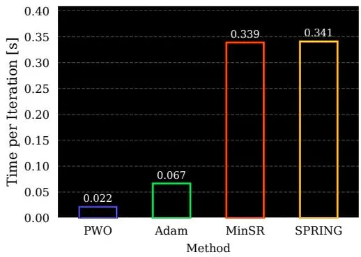
(a) Wall-clock time per optimizer iteration.

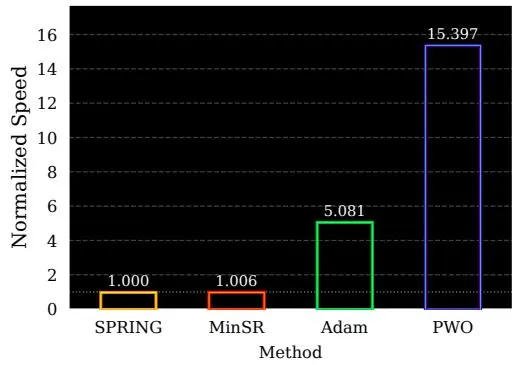
(b) Normalized iteration speed relative to SPRING.
图7：Per-iteration computational cost and normalized iteration speed for PWO and the baseline optimizers on the Heisenberg $J_{1} {-} J_{2}$ chain with the default architecture D.2. Both measurements are obtained on a single NVIDIA L40S GPU. Normalized speed is reported as the number of optimizer iterations per unit time relative to SPRING, so higher is faster.

Beyond convergence in wall-clock time, it is useful to isolate the computational cost of each optimization update. Figure 7b compares the normalized iteration speed (optimization steps per unit of time) of PWO against the baselines. The speed advantage over minSR is expected: PWO is a first-order method and does not require constructing or inverting the stochastic-reconfiguration matrix. In contrast, minSR replaces the original $P \times P \operatorname{SR}$ solve by an $\mathbf{\bar{\boldsymbol{M}}} \times \mathbf{\boldsymbol{M}}$ solve, where $\breve{M}$ is the number of samples, but it still requires expensive Jacobian contractions and a matrix inversion or linear solve. PWO avoids this curvature computation entirely.

The comparison with Adam is more subtle. A single PWO update has additional bookkeeping relative to Adam, including probability ratios, clipping terms, and wrapped phase increments. However, in VMC the dominant cost is often not the optimizer algebra itself, but sampling configurations and evaluating the corresponding local energies. PWO computes local energies and advantages once for a sampled batch and then reuses that batch across multiple proximal inner epochs. Adam, in contrast, performs a single update per sampled batch, so the local-energy overhead is paid again for each parameter update. Thus, PWO can amortize the expensive energy computation across several optimization steps, making its effective per-update cost competitive with Adam despite the more structured surrogate objective.

### C.3 Why RWKV?

RWKV is a particularly natural architecture for large-scale autoregressive NQS because it combines the expressivity of sequence models with recurrent inference. Unlike Transformer-based autoregressive models, RWKV does not require a growing key-value cache, so its per-token inference cost and memory footprint remain constant in the sequence length [Peng et al., 2025]. This is well aligned with autoregressive VMC, where spin configurations are generated sequentially and model evaluations are repeatedly invoked during Monte Carlo optimization. Recurrent architectures have also been successful in autoregressive NQS more broadly, where they provide exact independent sampling from the Born distribution while avoiding Markov-chain mixing issues [Hibat-Allah et al., 2020, Merali et al., 2026]. Finally, recent hyperscale RWKV fine-tuning work provides a practical implementation foundation for adapting billion-parameter recurrent models to nonstandard optimization objectives [Sarkar et al., 2026]. For these reasons, RWKV is a useful stress test for whether PWO can scale beyond conventional NQS architectures.

### C.4 Limitations of PWO

Although PWO is supported by a first-order consistency result and a clipped improvement bound, the theory remains local and conservative: it relies on common-support and boundedness assumptions and does not imply global convergence for neural-network training. Empirically, our results include one dimensional chains, a frustrated two-dimensional square lattice, and a large-scale RWKV fine-tuning experiment, but they are still not a comprehensive NQS benchmark across Hamiltonian families. In particular, broader validation on larger two-dimensional systems, fermionic models, and electronicstructure problems remains open. Finally, PWO introduces additional optimization hyperparameters, such as amplitude and phase clipping thresholds and the number of inner epochs, whose optimal values may depend on the Hamiltonian, ansatz, system size, and sample budget.

### D Experimental Details

### D.1 Hyperparameter search

For each method, we perform a small hyperparameter search over the learning rate using a grid sweep and select the configuration with the best validation performance. For PWO, we additionally tune the clipping parameters that control the amplitude and phase surrogate objectives. Specifically, after selecting an initial learning rate, we independently grid search each clipping parameter while holding the best values found so far fixed. This sequential procedure provides a simple and computationally tractable way to tune the additional PWO-specific hyperparameters without requiring an exhaustive joint sweep over all combinations.

For Adam-based methods, including PWO, we use a cosine one-cycle learning-rate schedule [Smith and Topin, 2018]. The learning rate is first increased to a peak value during a short warmup phase and is then annealed smoothly to a small final value by cosine decay. The peak learning rate is selected by the grid search above, while the other schedule parameters are fixed across runs. For PWO, which performs multiple optimization epochs per sampled batch, we scale the transition horizon by the number of PPO epochs so that the schedule evolves on a comparable outer-iteration timescale. For minSR and SPRING, a constant learning rate performed better than scheduled variants.

Because the Heisenberg and J1–J2 chains are more challenging optimization problems than the transverse-field Ising model, we use longer learning-rate schedules for these settings (compare Appendices D.3-D.5). In particular, we allocate more transition steps to the Heisenberg chain than to Ising, and more transition steps to J1–J2 than to Heisenberg. This gives the optimizer a longer annealing horizon on the harder Hamiltonians, while keeping the schedule structure fixed across problems. To improve readability, we report the method-specific hyper-parameters for each Hamiltonian separately. The Ising configuration is shown first, followed by the Heisenberg and J1–J2 settings in the subsequent subsections.

### D.2 Neural Quantum State Architecture

Across experiments, we use the same autoregressive recurrent neural network for PWO and minSR, ensuring that performance differences arise from the optimizer rather than the parametrization. Given a spin configuration $\mathbf{s} \in \{\pm 1 \}^{N}$ , we map spins to binary tokens, prepend a beginning-of-sequence token, and embed the resulting sequence with learned token embeddings of dimension 32 and learned positional embeddings. The embedded inputs are projected to dimension 256, followed by a tanh nonlinearity and layer normalization. The backbone consists of GRU layers with residual connections between recurrent blocks. From the shared recurrent representation, we use two separate two-layer MLP heads and GELU activations: an amplitude head, which outputs conditional log-probabilities via a log-softmax, and a phase head, which outputs bounded phases through a tanh nonlinearity scaled by π. The model has 1.4M parameters. Unless otherwise stated, all methods and Hamiltonians use the same architecture. The shared hyperparameters are summarized in Table 2.

<table><tr><td>Architecture hyperparameter</td><td>Value</td></tr><tr><td>Token embedding dimension</td><td>32</td></tr><tr><td>Site embeddings</td><td>Learned</td></tr><tr><td>Backbone input dimension</td><td>256</td></tr><tr><td>Backbone nonlinearity</td><td>tanh</td></tr><tr><td>Backbone normalization</td><td>Layer normalization</td></tr><tr><td>Recurrent backbone</td><td>GRU</td></tr><tr><td>Number of GRU layers</td><td>3</td></tr><tr><td>GRU hidden dimension</td><td>256</td></tr><tr><td>Amplitude head</td><td>2-layer MLP</td></tr><tr><td>Phase head</td><td>2-layer MLP</td></tr><tr><td>Head hidden dimension</td><td>256</td></tr><tr><td>Head activation</td><td>GELU</td></tr><tr><td>Phase output</td><td> $\pi \tanh(\cdot)$ </td></tr><tr><td>Phase scale</td><td> $\pi$ </td></tr></table>

Table 2: Shared NQS architecture used across all Hamiltonians and optimization methods. The same autoregressive GRU-based parameterization is used for Adam, PWO, minSR, and SPRING.

### D.3 Ising Model

<table><tr><td>Hyperparameter</td><td>Adam</td><td>PWO</td><td>minSR</td><td>SPRING</td></tr><tr><td>Optimizer / method</td><td>Adam</td><td>Adam + PWO</td><td>minSR</td><td>SPRING</td></tr><tr><td>Learning rate</td><td> $10^{-5}$ </td><td> $10^{-5}$ </td><td> $10^{-2}$ </td><td> $10^{-2}$ </td></tr><tr><td>Peak learning rate</td><td> $10^{-4}$ </td><td> $10^{-4}$ </td><td>-</td><td>-</td></tr><tr><td>Transition steps</td><td>5,000</td><td>20,000</td><td>-</td><td>-</td></tr><tr><td>PPO epochs</td><td>-</td><td>4</td><td>-</td><td>-</td></tr><tr><td>PPO clip  $\epsilon$ </td><td>-</td><td> $10^{-3}$ </td><td>-</td><td>-</td></tr><tr><td>Advantage normalization</td><td>-</td><td>Yes</td><td>-</td><td>-</td></tr><tr><td>Phase loss</td><td>-</td><td> $\Delta\phi$ clip</td><td>-</td><td>-</td></tr><tr><td>Phase coefficient</td><td>-</td><td>1.0</td><td>-</td><td>-</td></tr><tr><td>Phase clip</td><td>-</td><td>0.3</td><td>-</td><td>-</td></tr><tr><td>Center imaginary advantage</td><td>-</td><td>Yes</td><td>-</td><td>-</td></tr><tr><td>Normalize imaginary advantage</td><td>-</td><td>Yes</td><td>-</td><td>-</td></tr><tr><td>Phase Jacobian baseline</td><td>-</td><td>Yes</td><td>-</td><td>-</td></tr><tr><td>SR diagonal shift</td><td>-</td><td>-</td><td> $10^{-2}$ </td><td> $10^{-2}$ </td></tr><tr><td>NTK / minSR mode</td><td>-</td><td>-</td><td>Yes</td><td>Yes</td></tr><tr><td>On-the-fly SR</td><td>-</td><td>-</td><td>Yes</td><td>Yes</td></tr><tr><td>SPRING momentum</td><td>-</td><td>-</td><td>-</td><td>0.8</td></tr></table>

Table 3: Hyperparameters used for the Ising experiments. All methods use $N = 12$ , periodic boundary conditions, $J = 1 , h = 1$ , complex-valued neural quantum states, 1024 training samples, exact diagonalization for evaluation, and evaluation every 200 iterations. Adam and PWO use the cosine one-cycle schedule.

### D.4 Heisenberg Chain

<table><tr><td>Hyperparameter</td><td>Adam</td><td>PWO</td><td>minSR</td><td>SPRING</td></tr><tr><td>Optimizer / method</td><td>Adam</td><td>Adam + PWO</td><td>minSR</td><td>SPRING</td></tr><tr><td>LR parameter / constant LR</td><td> $10^{-5}$ </td><td> $10^{-5}$ </td><td> $10^{-3}$ </td><td> $10^{-3}$ </td></tr><tr><td>Peak learning rate</td><td> $3 \times 10^{-4}$ </td><td> $10^{-4}$ </td><td>-</td><td>-</td></tr><tr><td>Transition steps</td><td>10,000</td><td>40,000</td><td>-</td><td>-</td></tr><tr><td>PPO epochs</td><td>-</td><td>4</td><td>-</td><td>-</td></tr><tr><td>PPO clip  $\epsilon$ </td><td>-</td><td> $10^{-3}$ </td><td>-</td><td>-</td></tr><tr><td>Advantage normalization</td><td>-</td><td>Yes</td><td>-</td><td>-</td></tr><tr><td>Phase loss</td><td>-</td><td> $\Delta\phi$ clip</td><td>-</td><td>-</td></tr><tr><td>Phase coefficient</td><td>-</td><td>1.0</td><td>-</td><td>-</td></tr><tr><td>Phase clip</td><td>-</td><td>0.3</td><td>-</td><td>-</td></tr><tr><td>Center imaginary advantage</td><td>-</td><td>Yes</td><td>-</td><td>-</td></tr><tr><td>Normalize imaginary advantage</td><td>-</td><td>Yes</td><td>-</td><td>-</td></tr><tr><td>Phase Jacobian baseline</td><td>-</td><td>Yes</td><td>-</td><td>-</td></tr><tr><td>SR diagonal shift</td><td>-</td><td>-</td><td> $10^{-2}$ </td><td> $10^{-2}$ </td></tr><tr><td>NTK / minSR mode</td><td>-</td><td>-</td><td>Yes</td><td>Yes</td></tr><tr><td>On-the-fly SR</td><td>-</td><td>-</td><td>Yes</td><td>Yes</td></tr><tr><td>SPRING momentum</td><td>-</td><td>-</td><td>-</td><td>0.8</td></tr></table>

Table 4: Hyperparameters for the Heisenberg-chain experiments. All methods use $N = 12 .$ periodic boundary conditions, coupling $J = 0.25 ,$ , no sign rule, complex-valued neural quantum states, 1024 training samples, exact evaluation, and evaluation every 200 iterations. Adam and PWO use a cosine one-cycle learning-rate schedule; minSR and SPRING use a constant learning rate.

### D.5 Heisenberg $J_{1} {-} J_{2}$ Chain

<table><tr><td>Hyperparameter</td><td>Adam</td><td>PWO</td><td>minSR</td><td>SPRING</td></tr><tr><td>Optimizer / method</td><td>Adam</td><td>Adam + PWO</td><td>minSR</td><td>SPRING</td></tr><tr><td>LR parameter / constant LR</td><td> $10^{-5}$ </td><td> $10^{-5}$ </td><td> $10^{-3}$ </td><td> $10^{-3}$ </td></tr><tr><td>Peak learning rate</td><td> $3 \times 10^{-4}$ </td><td> $10^{-4}$ </td><td>-</td><td>-</td></tr><tr><td>Transition steps</td><td>10,000</td><td>40,000</td><td>-</td><td>-</td></tr><tr><td>PPO epochs</td><td>-</td><td>4</td><td>-</td><td>-</td></tr><tr><td>PPO clip  $\epsilon$ </td><td>-</td><td> $10^{-3}$ </td><td>-</td><td>-</td></tr><tr><td>Advantage normalization</td><td>-</td><td>Yes</td><td>-</td><td>-</td></tr><tr><td>Phase loss</td><td>-</td><td> $\Delta\phi$ clip</td><td>-</td><td>-</td></tr><tr><td>Phase coefficient</td><td>-</td><td>1.0</td><td>-</td><td>-</td></tr><tr><td>Phase clip</td><td>-</td><td>0.3</td><td>-</td><td>-</td></tr><tr><td>Center imaginary advantage</td><td>-</td><td>Yes</td><td>-</td><td>-</td></tr><tr><td>Normalize imaginary advantage</td><td>-</td><td>Yes</td><td>-</td><td>-</td></tr><tr><td>Phase Jacobian baseline</td><td>-</td><td>Yes</td><td>-</td><td>-</td></tr><tr><td>SR diagonal shift</td><td>-</td><td>-</td><td> $10^{-2}$ </td><td> $10^{-2}$ </td></tr><tr><td>NTK / minSR mode</td><td>-</td><td>-</td><td>Yes</td><td>Yes</td></tr><tr><td>On-the-fly SR</td><td>-</td><td>-</td><td>Yes</td><td>Yes</td></tr><tr><td>SPRING momentum</td><td>-</td><td>-</td><td>-</td><td>0.8</td></tr></table>

Table 5: Hyperparameters for the frustrated Heisenberg $J_{1} {-} J_{2}$ experiments. All methods use $N = 12$ periodic boundary conditions, couplings $J_{1} = 1$ and $J_{2} = 0.5 ,$ , no sign rule, complex-valued neural quantum states, 1024 training samples, exact evaluation, and evaluation every 200 iterations. Adam and PWO use a cosine one-cycle learning-rate schedule; minSR and SPRING use a constant learning rate.

### D.6 Two-dimensional $J_{1} {-} J_{2}$ square-lattice experiment

Using the same method hyper-parameters as above, we evaluate PWO on the frustrated spin-1/2 $J_{1} {-} \bar{J_{2}}$ Heisenberg model on a two-dimensional square lattice,

$$
\hat{H}_{J_{1} - J_{2}}^{\mathrm{2D}} = J_{1} \sum_{\langle i, j \rangle} \hat{\mathbf{S}}_{i} \cdot \hat{\mathbf{S}}_{j} + J_{2} \sum_{\langle \langle i, j \rangle \rangle} \hat{\mathbf{S}}_{i} \cdot \hat{\mathbf{S}}_{j},\tag{123}
$$

where $\langle i , j \rangle$ and $\langle \langle i , j \rangle \rangle$ denote nearest- and next-nearest-neighbor pairs, respectively. We use an $L \times L$ square lattice with $L = 10$ , periodic boundary conditions, $J_{1} = 1$ , and ${\bar{J}}_{2} = 0 . {\bar{5}}$ . All runs are restricted to the zero-magnetization sector, $S_{\mathrm{tot}}^{z} = 0$ , by masking infeasible autoregressive choices during sampling and evaluation.

For this experiment we use a complex-valued patch-autoregressive transformer designed for twodimensional lattices. Instead of generating spins one at a time, the model partitions the $10 \times 10$ lattice into non-overlapping $2 \times 2$ patches. Each patch is represented as a categorical token with vocabulary size $2^{4} = 16 .$ , so the full configuration is generated as a sequence of

$$
T = \left(\frac{L}{2}\right)^{2} = 25\tag{124}
$$

autoregressive tokens. The wavefunction is factorized over patch tokens as

$$
\log \psi_{\theta} (\mathbf{s}) = \sum_{t = 1}^{T} \left[ \frac{1}{2} \log p_{\theta} (a_{t} \mid a_{< t}) + i \phi_{\theta} (a_{t} \mid a_{< t}) \right],\tag{125}
$$

where the factor $1 / 2$ corresponds to the Born-rule convention $P_{\theta} ( \mathbf{s} ) = | \psi_{\theta} ( \mathbf{s} ) | ^{2}$

The model prepends a beginning-of-sequence token and embeds patch tokens with learned token embeddings of dimension 64. We also use learned site embeddings and prefix-count features that encode the partial magnetization constraint. These embeddings are projected to width 96, normalized with layer normalization, and passed through an 8-layer causal transformer backbone. Each transformer block uses 6 attention heads, two-dimensional axial RoPE with base 100, residual connections, and a feedforward width of $4 \times 96 = 384$

From the final transformer representation, the model uses separate amplitude and phase heads. Both heads are two-layer MLPs with hidden dimension 192 and GELU activations. The amplitude head outputs masked conditional log-probabilities through a log-softmax, ensuring exact normalization over feasible patch choices. The phase head outputs centered phase increments using a π tanh(·) parameterization, with small initialization scale $\mathrm{\dot{1} 0^{- 3}}$ . This gives an exactly sampleable complex autoregressive neural quantum state adapted to the two-dimensional square lattice.

While the aim of this experiment is to compare optimizers and not to achieve the state-of-the-art variational energy (around -199.0536 [Rende et al., 2024]), we note that the energy of the PWOtrained autoregressive transformer of 1.5M parameters is −185 after 30 mins, reaches −195.6 after 24 hours, and keeps decreasing. The run is on a single GPU and imposes no symmetries, except for zero-magnetization sampling.

<table><tr><td>Hyperparameter</td><td>Value</td></tr><tr><td>Lattice size</td><td> $10 \times 10$ </td></tr><tr><td>Number of spins</td><td>100</td></tr><tr><td>Boundary conditions</td><td>Periodic</td></tr><tr><td>Hamiltonian couplings</td><td> $J_1 = 1, J_2 = 0.5$ </td></tr><tr><td>Magnetization sector</td><td> $S_{\text{tot}}^z = 0$ </td></tr><tr><td>Patch size</td><td> $2 \times 2$ </td></tr><tr><td>Patch vocabulary size</td><td>16</td></tr><tr><td>Autoregressive tokens</td><td>25</td></tr><tr><td>Token embedding dimension</td><td>64</td></tr><tr><td>Transformer width</td><td>96</td></tr><tr><td>Transformer depth</td><td>8</td></tr><tr><td>Attention heads</td><td>6</td></tr><tr><td>Transformer MLP hidden dimension</td><td>384</td></tr><tr><td>RoPE type</td><td>2D axial RoPE</td></tr><tr><td>RoPE base</td><td>100</td></tr><tr><td>Amplitude head</td><td>2-layer MLP</td></tr><tr><td>Phase head</td><td>2-layer MLP</td></tr><tr><td>Head hidden dimension</td><td>192</td></tr><tr><td>Phase parameterization</td><td> $\pi \tanh(\cdot)$ </td></tr><tr><td>Phase initialization std.</td><td> $10^{-3}$ </td></tr><tr><td>Prefix-count features</td><td>Yes</td></tr><tr><td>Learned site embeddings</td><td>Yes</td></tr></table>

Table 6: Architecture used for the two-dimensional frustrated $J_{1} {-} J_{2}$ square-lattice experiment. The model is a complex patch-autoregressive transformer over $2 \times 2$ spin patches, with two-dimensional axial RoPE and an exact zero-magnetization constraint enforced through autoregressive masking.

### D.7 Scaling Experiment

To study how performance scales with model capacity, we train three model sizes on the frustrated Heisenberg $J_{1} {-} J_{2}$ chain $( N = 12 , J_{1} = 1 , J_{2} \overset{-} {=} 0 . \overset{-} {5}$ , periodic boundary conditions) using PWO, Adam, and minSR. All three sizes share the same autoregressive GRU architecture described in Appendix D.2; they differ only in the number of recurrent layers and hidden dimensions. Table 7 summarises the sizes and the corresponding total parameter counts.

<table><tr><td>Size</td><td>GRU layers</td><td>RNN hidden</td><td>Head hidden</td><td>Parameters</td></tr><tr><td>Tiny</td><td>1</td><td>64</td><td>64</td><td>44,452</td></tr><tr><td>Small</td><td>2</td><td>128</td><td>128</td><td>269,156</td></tr><tr><td>Medium</td><td>3</td><td>256</td><td>256</td><td>1,456,356</td></tr></table>

Table 7: Model sizes used in the scaling experiment. All models use an embedding dimension of 32 and are evaluated on the frustrated Heisenberg $J_{1} {-} J_{2}$ chain with $N = 12$ sites. Parameter counts include all weights and biases of the full autoregressive network (embedding, recurrent backbone, amplitude head, and phase head).

The hyperparameters used for each optimization method in the scaling experiment are listed in Table 8. The schedule and clipping parameters are identical to those of the main $J_{1} {-} J_{2}$ experiments (see Tables 5 and 2); only the number of transition steps differs to account for the change in model size.

<table><tr><td>Hyperparameter</td><td>Adam</td><td>PWO</td><td>minSR</td></tr><tr><td>Optimizer / method</td><td>Adam</td><td>Adam + PWO</td><td>minSR</td></tr><tr><td>Learning rate</td><td> $10^{-5}$ </td><td> $10^{-5}$ </td><td> $10^{-3}$ </td></tr><tr><td>Peak learning rate</td><td> $3 \times 10^{-4}$ </td><td> $10^{-4}$ </td><td>-</td></tr><tr><td>Transition steps</td><td>40,000</td><td>40,000</td><td>-</td></tr><tr><td>PPO epochs</td><td>-</td><td>4</td><td>-</td></tr><tr><td>PPO clip  $\epsilon$ </td><td>-</td><td> $10^{-3}$ </td><td>-</td></tr><tr><td>Advantage normalization</td><td>-</td><td>Yes</td><td>-</td></tr><tr><td>Phase loss</td><td>-</td><td> $\Delta\phi$ clip</td><td>-</td></tr><tr><td>Phase coefficient</td><td>-</td><td>1.0</td><td>-</td></tr><tr><td>Phase clip</td><td>-</td><td>0.3</td><td>-</td></tr><tr><td>Center imaginary advantage</td><td>-</td><td>Yes</td><td>-</td></tr><tr><td>Normalize imaginary advantage</td><td>-</td><td>Yes</td><td>-</td></tr><tr><td>Phase Jacobian baseline</td><td>-</td><td>Yes</td><td>-</td></tr><tr><td>SR diagonal shift</td><td>-</td><td>-</td><td> $10^{-2}$ </td></tr><tr><td>NTK / minSR mode</td><td>-</td><td>-</td><td>Yes</td></tr><tr><td>On-the-fly SR</td><td>-</td><td>-</td><td>Yes</td></tr><tr><td>Training samples</td><td></td><td>2,048</td><td></td></tr><tr><td>Seeds</td><td></td><td>10</td><td></td></tr></table>

Table 8: Hyperparameters for the scaling experiment on the frustrated Heisenberg $J_{1} {-} J_{2}$ chain $( N = 12 , \bar{J}_{1}^{-} = \bar{1} , J_{2} = 0.5 .$ , periodic boundary conditions). All methods and sizes use the same optimization hyperparameters; only the model architecture varies across runs (see Table 7). Adam and PWO use a cosine one-cycle learning-rate schedule; minSR uses a constant learning rate.

### D.8 RWKV-7 on Ising Model

<table><tr><td>Hyperparameter</td><td>Adam</td><td>PWO</td></tr><tr><td>Optimizer / method</td><td>Adam</td><td>Adam + PWO</td></tr><tr><td>Model</td><td>RWKV-7</td><td>RWKV-7</td></tr><tr><td>Model size</td><td>1.5B</td><td>1.5B</td></tr><tr><td>Learning rate</td><td> $10^{-5}$ </td><td> $10^{-5}$ </td></tr><tr><td>Transition steps</td><td>1,200</td><td>4,800</td></tr><tr><td>Decay rate</td><td>0.5</td><td>0.5</td></tr><tr><td>PPO epochs</td><td>-</td><td>4</td></tr><tr><td>PPO clip  $\epsilon$ </td><td>-</td><td> $10^{-3}$ </td></tr><tr><td>Advantage normalization</td><td>-</td><td>Yes</td></tr><tr><td>Batch size</td><td>150</td><td>150</td></tr><tr><td>Machine power</td><td>2</td><td>2</td></tr><tr><td>Evaluation samples</td><td>4,096</td><td>4,096</td></tr><tr><td>Evaluation batch size</td><td>128</td><td>128</td></tr><tr><td>Exact diagonalization</td><td>Yes</td><td>Yes</td></tr></table>

Table 9: Hyperparameters for the RWKV-7 fine-tuning experiments on the transverse-field Ising model. Both methods use an autoregressive RWKV-7 model with 1.5B parameters, $N = 12 .$ , periodic boundary conditions, $J = 1 , h = 1$ , exact diagonalization for evaluation, and samples drawn exactly from the autoregressive Born distribution. Adam corresponds to the single-epoch first-order baseline, while PWO performs four proximal inner epochs per sampled batch.

### E Additional Figures

### E.1 Individual Seed Plots for All Hamiltonias

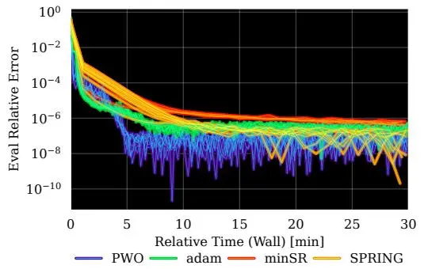

Ising model
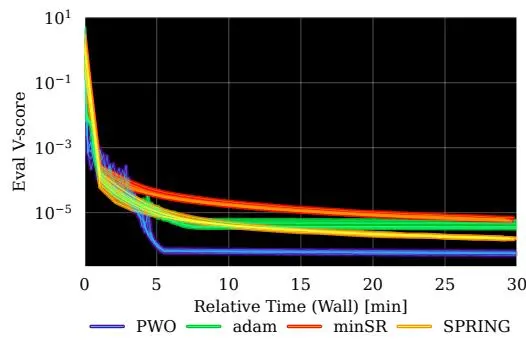

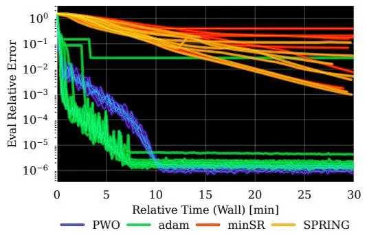

Heisenberg chain
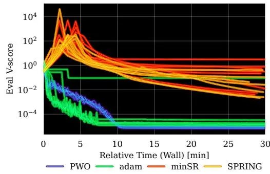

$J_{1} {-} J_{2}$ Heisenberg model
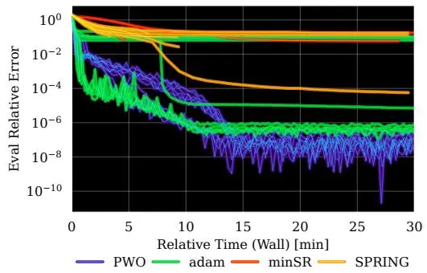

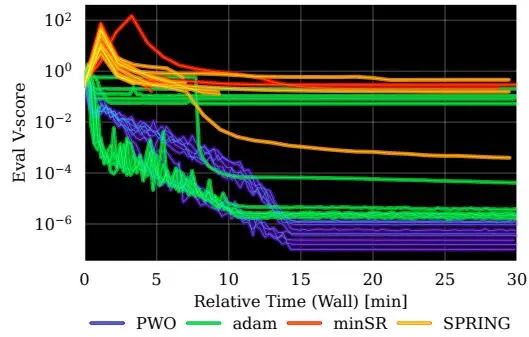

Square-lattice $J_{1} {-} J_{2}$ Heisenberg model
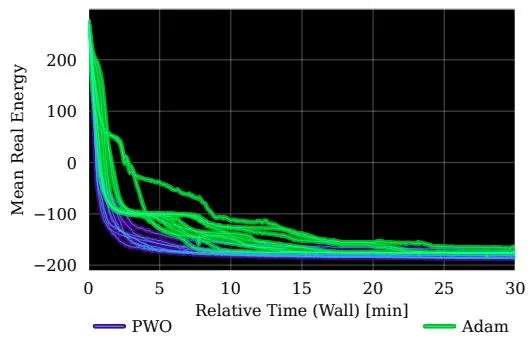

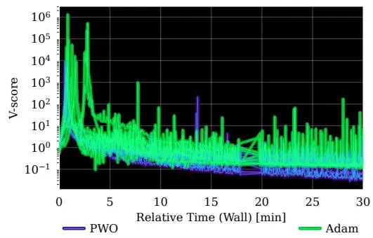
图8：Individual-seed learning curves for all Hamiltonians. Each row corresponds to one Hamiltonian, and the right column reports the V-score.

### E.2 Scaling Samples and System Sizes

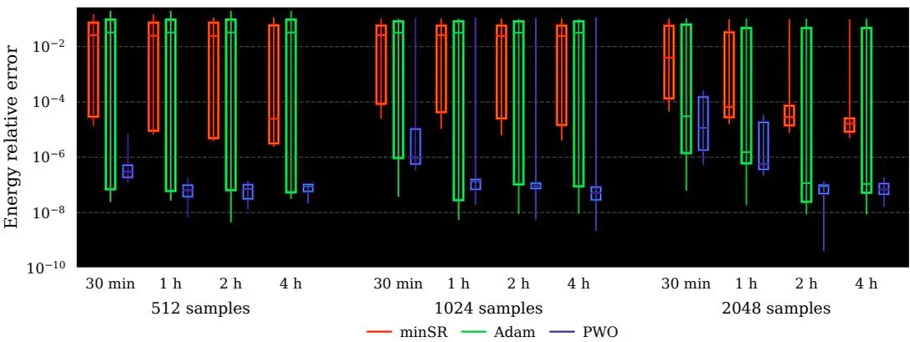
图9：Wall-clock scaling comparison across number of samples and optimization methods. Boxplots show the interquartile mean relative error over seeds, with boxes indicating the interquartile range and lines indicating the min and max. Results are grouped by model size and wall-clock time, and run on a single NVIDIA A100 GPU.

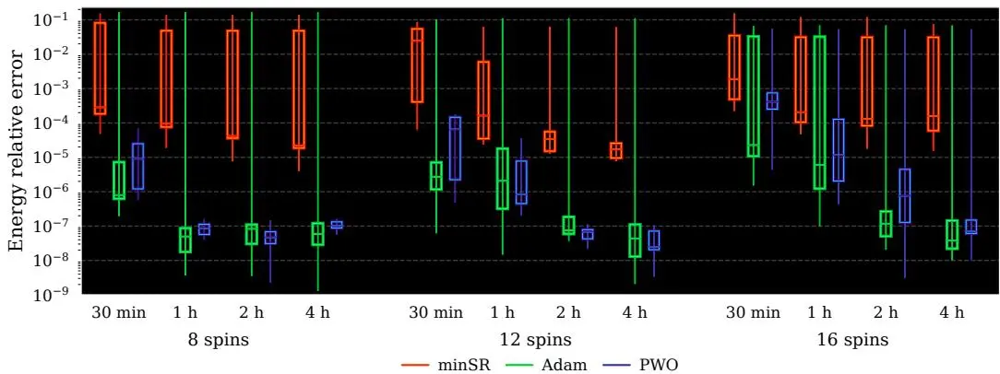
图10：Wall-clock scaling comparison across system size and optimization methods. Boxplots show the interquartile mean relative error over seeds, with boxes indicating the interquartile range and lines indicating the min and max. Results are grouped by model size and wall-clock time, and run on a single NVIDIA A100 GPU.

### E.3 Individual Seed Plots for RWKV7 Fine-tuning

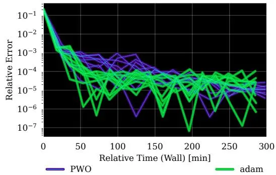

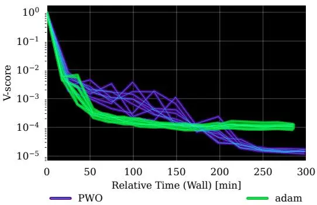
图11：Individual-seed fine-tuning curves for the 1.5B-parameter RWKV-7 neural quantum state on the transverse-field Ising model. Each curve corresponds to one random seed, with relative error shown on the left and V-score on the right. PWO consistently remains stable across seeds and reaches lower final error and variance than the Adam baseline, indicating that the proximal objective improves robustness even in the billion-parameter regime.

---

## 阅读笔记

### 一句话概括

本文提出近端波函数优化（PWO），一种受强化学习近端策略优化（PPO）启发的神经量子态（NQS）训练算法，针对自回归 NQS 在 Born 分布精确采样优势下优化方法薄弱的问题。核心发现是：在 stoquastic 哈密顿量假设下，变分能量最小化的梯度可等价为 Born 分布上的优势加权策略梯度（命题3.1），从而将 PPO 的裁剪信任域机制引入 VMC。PWO 裁剪幅值通道的概率比变化（$\epsilon = 10^{-3}$）和相位通道的包裹相位增量（$\delta = 0.3$），避免显式矩阵求逆，在 $K=4$ 次内部更新中复用同一批次样本。在一维 $N=12$ 横向场伊辛链上，PWO 约 5 分钟达到相对误差 $10^{-7}$，比 minSR 快约 6 倍；在阻挫 $J_1$-$J_2$ 链上仅 PWO 稳定收敛至 $10^{-7}$（minSR 60% 运行为 NaN），并首次将 NQS 优化扩展至 1.5B 参数的 RWKV-7 语言模型。

### 核心论证链

1. **问题识别——自回归 NQS 优化存在空白**：自回归 NQS 解决了从 Born 分布精确独立采样的瓶颈，但缺乏匹配的优化方法——Adam 忽略波函数几何导致不稳定，SR/minSR 需矩阵求逆（$O(P^3)$ 或 $O(M^2P + M^3)$）在大模型和大样本方案中不可行。这定位了"一阶优化的可扩展性与自然梯度的几何原则性"之间的空白，目标是设计一种兼具两者优势的 NQS 训练算法。

2. **建立 RL-NQS 等价性以引入信任域框架**：在 stoquastic 哈密顿量（非对角非正）下证明命题3.1——变分能量梯度可写成策略梯度形式，其中构型 $\mathbf{s}$ 对应动作空间，Born 分布 $\mathcal{P}_{\theta}(\mathbf{s})$ 对应策略 $\pi_{\theta}(a|s)$，中心化局域能量 $E_{\theta}^{\mathrm{loc}}(\mathbf{s}) - \mathbb{E}[E_{\theta}^{\mathrm{loc}}]$ 对应优势函数。这给出了一个形式化框架：NQS 优化可被重新表述为 RL 安全策略优化问题。

3. **设计 PWO 的核心算法机制**：基于上述等价性，引入两个裁剪代理损失——幅值通道裁剪概率比 $r_{\theta} = \mathcal{P}_{\theta}/\mathcal{P}_{\theta_{\mathrm{old}}}$（式15），相位通道裁剪包裹相位增量 $\phi_{\theta}$（式17）。相位目标中的停止梯度算子 $\mathrm{sg}(r_{\theta})$ 是关键设计——它分离了重要性权重与相位梯度，确保 $\theta = \theta_{\mathrm{old}}$ 时组合代理损失的梯度精确等于原始 VMC 梯度（定理4.1）。

4. **给出理论保证——局部一致性与改进界**：定理4.1证明在 $\theta = \theta_{\mathrm{old}}$ 处 PWO 代理损失梯度与 VMC 梯度等价，这保证了首次内部更新方向无误。定理4.2建立有限更新下的能量-不保真度界：真实能量变化不超过替代函数 $+$ 保真度惩罚项。推论4.3在全局裁剪条件（$r_{\theta} \in [1-\epsilon, 1+\epsilon]$, $|\phi_{\theta}| \leq \delta$）下给出可证改进条件，虽在神经网络训练中无法严格满足，但为裁剪启发式提供了概念正当性。

5. **实验验证——一维自旋链**：在 $N=12$ 横向场伊辛链（stoquastic，无符号问题）上，PWO ~5 分钟达 $\epsilon_{\mathrm{rel}}=10^{-7}$，minSR ~30 分钟（慢 6 倍，因每步矩阵求逆）。在 $J_1$-$J_2$ 链（非 stoquastic，强符号结构）上，PWO ~15 分钟达 $10^{-7}$，而 minSR 10 次运行 6 次 NaN，Adam 出现离群值平台（相对误差 $\sim 10^{-2}$）。这证明裁剪代理目标在困难阻挫问题上的数值稳定性超越了一阶和二阶方法。

6. **扩展到更大规模**：在 $10 \times 10$ 阻挫方晶格（$N=100$，patch-autoregressive Transformer）上，PWO 30 分钟达 $-185$，24 小时降至 $-195.6$ 且持续下降，快于 Adam。在 1.5B 参数 RWKV-7 微调一维伊辛模型上，PWO 比 Adam 达到更低的最终误差和 V 分数，证明在超出此前 NQS 模型规模三个数量级时，近端目标函数依然有效。

### 实验参数详解

| 参数 | 数值 | 含义 |
|------|------|------|
| 系统尺寸 | $N=12$ (1D), $10\times 10$ (2D) | 自旋数，周期边界条件 |
| 训练样本数 | 1024 (1D), 150 (RWKV) | 每外循环采样的构型数 |
| PPO 内轮次 $K$ | 4 | 每批次复用的优化步数 |
| 幅值裁剪阈值 $\epsilon$ | $10^{-3}$ | 概率比裁剪范围 $[1-\epsilon, 1+\epsilon]$ |
| 相位裁剪阈值 $\delta$ | 0.3 (rad) | 包裹相位增量裁剪范围 $[-\delta, \delta]$ |
| 学习率 | $10^{-5}$ (Adam/PWO基), $10^{-2}$ (minSR/SPRING) | 基础优化步长 |
| cosine 峰值学习率 | $10^{-4}$ (Ising), $10^{-4}$ ($J_1$-$J_2$ PWO), $3\times10^{-4}$ ($J_1$-$J_2$ Adam) | 预热后最大学习率 |
| cosine transition steps | 20000 (Ising PWO), 40000 ($J_1$-$J_2$ PWO) | 预热到退火的过渡步数 |
| 模型参数量 | 1.4M (GRU), 1.5M (2D Transformer), 1.5B (RWKV-7) | NQS 架构容量 |
| GRU 隐藏维度 | 256 | 1D GRU backbone 宽度 |
| Transformer 宽度/深度 | 96 / 8 层 | 2D patch Transformer 架构 |
| 2D patch 尺寸 | $2 \times 2$ | 分块自回归 token，词汇量 16 |
| 相位输出参数化 | $\pi \tanh(\cdot)$ | 输出相位在 $[-\pi, \pi]$ 范围 |
| 磁化约束 | $S^z_{\mathrm{tot}} = 0$ (2D) | 自回归 masking 强制零磁化 |
| SR 对角偏移 | $10^{-2}$ (minSR/SPRING) | 防止 Fubini-Study 矩阵病态 |
| 随机种子数 | 10 | 统计聚合用四分位均值 (IQM) |

### 批判性思考

**1. stoquastic 假设与非 stoquastic 基准之间的理论鸿沟未弥合**：命题3.1严格依赖 stoquastic 条件——哈密顿量非对角元非正，波函数可取实正，变分梯度退化为概率分布上的策略梯度。但核心实验 $J_1$-$J_2$ 链（$J_1=1, J_2=0.5$）是非 stoquastic 的——次近邻耦合引入符号结构，相位通道无法被忽略。此时 RL 等价性不成立，相位裁剪代理（式17）的有效性完全依赖经验。论文未提供在非 stoquastic 下相位裁剪梯度与真 VMC 梯度之间的偏离界。

**2. 样本复用率 $K=4$ 对梯度保真度的影响缺乏量化分析**：PWO 在固定批次上执行 $K=4$ 次更新，重要性权重 $r_{\theta}$ 随内部迭代偏离 1。虽然定理4.1保证 $\theta=\theta_{\mathrm{old}}$ 处梯度匹配，但第 2-4 次内部更新的梯度偏差 $\|\nabla L_{\text{clip}}(\theta) - \nabla E[\psi_{\theta}]\|$ 无封闭上界。推论4.3的改进保证要求全局裁剪——网络参数更新导致的构型概率变化在未采样构型上不可控。$K=4$ 的选择仅凭经验（隐式假设 $r_{\theta}$ 在 4 次更新内保持在 $[1-\epsilon, 1+\epsilon]$），缺乏梯度偏差的解析或数值刻画。

**3. minSR 计算复杂度对比的选择性呈现**：论文指出 minSR 复杂度 $O(M^2P + M^3)$ 反向约为 $P=1.4\times10^6, M=1024$ 时 $M^2P \approx 1.5\times 10^{12}$，以此强调 PWO 的一阶优势。但忽略了三件事：(a) PWO 的 $K=4$ 内轮次将每外循环的前向/反向传播成本放大 4 倍；(b) 图7b 显示 PWO 迭代速度比 Adam 慢约 25-30%，论文归因于"局域能量计算主导"忽略了梯度计算本身的额外开销在更大模型下的放大；(c) minSR 的结构可以充分利用 GPU 批量矩阵运算（Jacobian contraction 可通过一次前向模式自动微分完成），论文未报告实际 GPU 峰值利用率对比。

**4. 优化器比较的学习率调度不对称**：PWO 和 Adam 使用精心调的 cosine one-cycle 调度（含预热和退火阶段），而 minSR/SPRING 使用常数学习率（"minSR 使用常数学习率表现更好"）。这意味着 PWO 的优势部分来自调度策略而非近端代理本身。公平比较应为所有方法使用统一策略（如对所有方法搜索最佳调度），或证明 minSR/SPRING 在优化调度后效益为零。同样，minSR 在 $J_1$-$J_2$ 上 60% 的运行 NaN——论文未系统探索不同对角偏移（如 $10^{-1}, 10^{-3}$）能否稳定 minSR。

**5. RWKV-7 微调实验的泛化性证据不足**：1.5B 参数微调仅验证横向场伊辛链——最简单 stoquastic 基准且 $N=12$。支撑论点"跨三个数量级规模"时，仅验证了模型大小这一维度，未验证问题难度维度。在阻挫问题或二维系统上使用 1.5B NQS 的结果缺失，使得"规模扩展有效"的结论限定于最简单场景。

### 局限性

- **stoquastic 假设限制**：命题3.1要求哈密顿量在计算基下非对角元非正，排除费米子哈密顿量、含规范场格点模型以及多数量子化学哈密顿量。对非 stoquastic 系统的相位通道，RL 等价性不成立——PWO 相位裁剪缺乏理论对应，其有效性仅依赖 $J_1$-$J_2$ 链的有限经验。
- **改进保证的全局性缺失**：推论4.3要求对所有构型 $\mathbf{s}$ 满足 $r_{\theta}(\mathbf{s}) \in [1-\epsilon, 1+\epsilon]$ 和 $|\alpha_{\theta}(\mathbf{s})| \leq \delta$——这对神经网络参数更新在实际中不可验证（未采样构型的概率比不可知）。因此理论保证不具操作性，裁剪仅提供了一个启发式信任域。定理4.2的保真度界依赖于精确 $\mathcal{I}$ 计算，在指数大的希尔伯特空间中不可行。
- **小系统验证与可扩展性担忧**：1D 实验仅 $N=12$，2D 为 $N=100$。关键词"自回归"的优势之一是精确采样，但重要性权重 $r_{\theta}$ 的方差随系统尺寸 $N$ 指数增长——每构型的对数概率 $\log \mathcal{P}_{\theta}(\mathbf{s})$ 与 $N$ 线性正比，$r_{\theta}$ 在小更新下也易超出 $[1-\epsilon, 1+\epsilon]$。$N=12$ 场景下 $r_{\theta}$ 方差可控，但 $N=50$ 或 $N=100$ 时样本复用是否退化未经检验（附录 E.2 仅扩展至 $N=20$）。
- **相位裁剪的数值不稳定性风险**：相位目标（式17）使用包裹相位差 $\phi_{\theta}$（通过 atan2 计算），在相位角靠近 $\pm\pi$ 边界时 atan2 的梯度接近无穷，可能引起反向传播不稳定。论文未讨论相位包裹处理（unwrapping）机制，也未分析 $\delta=0.3$ 时边界行为。
- **超参数的哈密顿量依赖性**：$\epsilon=10^{-3}, \delta=0.3, K=4$ 在每个哈密顿量上分别搜索得到。论文未提供敏感度分析——$\epsilon$ 增加一个数量级（$10^{-2}$）或 $K$ 增加至 8 时的收敛行为未知。在未知哈密顿量上超参数调整的开销可能抵消部分收敛优势。
- **2D 系统的理想化条件**：$10 \times 10$ 阻挫方晶格实验采用 $2\times2$ patch tokenization（25 token 序列）和零磁化约束。使用的 patch-autoregressive Transformer（1.5M 参数）不是该系统的最优架构——文献 [Rende et al., 2024] 报导的态优变分能量约 $-199.05$，PWO 在 30 分钟只达 $-185$（24 小时后 $-195.6$），表明架构/初始化的影响超过优化器本身。

### 关键公式速查

- $$E[\psi_{\theta}] = \mathbb{E}_{\mathbf{s} \sim \mathcal{P}_{\theta}}[E_{\theta}^{\mathrm{loc}}(\mathbf{s})]$$ — 变分能量作为 Born 分布下局域能量的期望，式(8)
- $$\nabla_{\theta} E[\psi_{\theta}] = \mathbb{E}_{\mathbf{s} \sim \mathcal{P}_{\theta}}\left[ (E_{\theta}^{\mathrm{loc}}(\mathbf{s}) - \mathbb{E}[E_{\theta}^{\mathrm{loc}}]) \nabla_{\theta} \log \mathcal{P}_{\theta}(\mathbf{s}) \right]$$ — stoquastic 假设下策略梯度形式的 VMC 梯度（命题3.1），式(14)
- $$L_{\mathrm{mod}}^{\mathrm{clip}}(\theta) = \mathbb{E}_{\mathbf{s} \sim \mathcal{P}_{\theta_{\mathrm{old}}}}\left[ \max\left( r_{\theta} A_{\theta_{\mathrm{old}}}^{\mathrm{R}}, \ \mathrm{clip}(r_{\theta}, 1-\epsilon, 1+\epsilon) A_{\theta_{\mathrm{old}}}^{\mathrm{R}} \right) \right]$$ — PWO 幅值通道裁剪代理损失，式(15)
- $$L_{\mathrm{arg}}^{\mathrm{clip}}(\theta) = \mathbb{E}_{\mathbf{s} \sim \mathcal{P}_{\theta_{\mathrm{old}}}}\left[ \mathrm{sg}(r_{\theta}) \max\left( \phi_{\theta} A_{\theta_{\mathrm{old}}}^{\mathrm{I}}, \ \mathrm{clip}(\phi_{\theta}, -\delta, \delta) A_{\theta_{\mathrm{old}}}^{\mathrm{I}} \right) \right]$$ — PWO 相位通道裁剪代理损失（含停止梯度），式(17)
- $$E[\psi_{\theta}] - E[\psi_{\theta_{\mathrm{old}}}] \leq \mathcal{A}_{\theta_{\mathrm{old}}}(\theta) + 2 \| \hat{H} - E[\psi_{\theta_{\mathrm{old}}}] \mathbb{1} \|_{\infty} \left(1 - \sqrt{1 - \mathcal{I}(\psi_{\theta_{\mathrm{old}}}, \psi_{\theta})}\right)$$ — 不保真度能量界，定理4.2，式(21)
- $$S_{ij} = \mathrm{Re}\{ \mathrm{Cov}_{\mathbf{s} \sim \mathcal{P}_{\theta}}[ O_i^*(\mathbf{s}), O_j(\mathbf{s}) ] \}$$ — Fubini-Study 度量/量子 Fisher 矩阵，SR 的几何预处理核心，式(12)
- $$\mathcal{P}_{\theta}(\mathbf{s}) = |\psi_{\theta}(\mathbf{s})|^2 / \sum_{\mathbf{s}'} |\psi_{\theta}(\mathbf{s}')|^2$$ — Born 分布（自旋构型概率），式(9)

### 术语对照

| 中文 | 英文 | 含义 |
|------|------|------|
| 神经量子态 | Neural Quantum State (NQS) | 用神经网络参数化量子多体波函数的框架 |
| 自回归模型 | Autoregressive Model | 将 Born 分布分解为条件概率乘积，支持精确独立采样 |
| 变分蒙特卡洛 | Variational Monte Carlo (VMC) | 用蒙特卡洛采样估计变分能量及其梯度的技术 |
| 随机重配置 | Stochastic Reconfiguration (SR) | 使用 Fubini-Study 度量预处理梯度的量子自然梯度法 |
| 近端策略优化 | Proximal Policy Optimization (PPO) | RL 中通过裁剪代理损失实现信任域更新的算法 |
| 近端波函数优化 | Proximal Wavefunction Optimization (PWO) | 本文提出的 NQS 优化算法，将 PPO 裁剪机制引入 VMC |
| Fubini-Study 度量 | Fubini-Study Metric | 量子态空间中量子 Fisher 矩阵对应的黎曼度量 |
| 局域能量 | Local Energy $E_{\theta}^{\mathrm{loc}}(\mathbf{s})$ | 给定构型 $\mathbf{s}$ 下哈密顿量期望的蒙特卡洛估计 |
| minSR | Minimum Sample Stochastic Reconfiguration | SR 的样本-规模变体，$P \times P$ 求逆转为 $M \times M$ |
| stoquastic 哈密顿量 | Stoquastic Hamiltonian | 非对角元均非正的哈密顿量，波函数可取实正形式 |
| Majumdar-Ghosh 点 | Majumdar-Ghosh Point | $J_2/J_1 = 0.5$ 处高度纠缠的二聚化基态，阻挫基准 |
