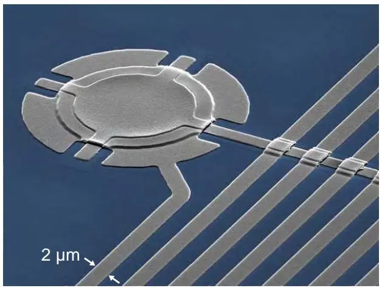
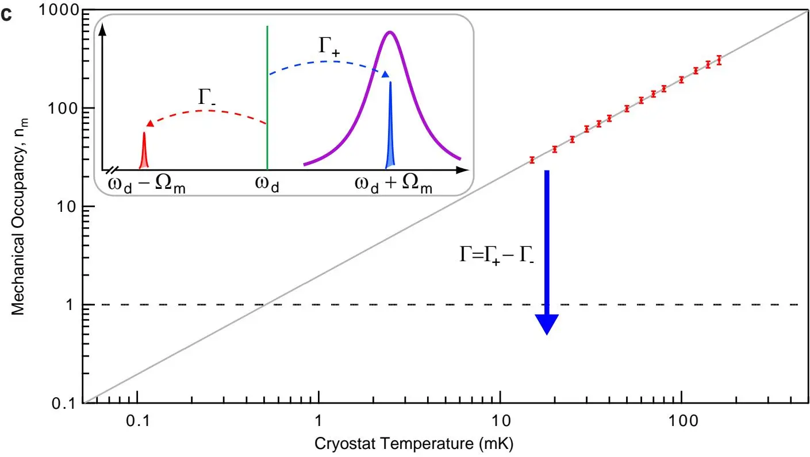
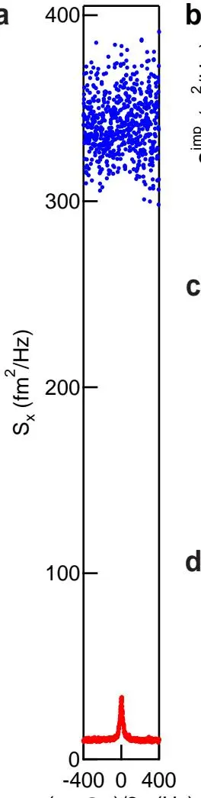
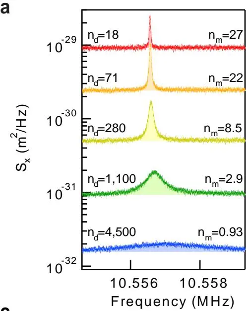
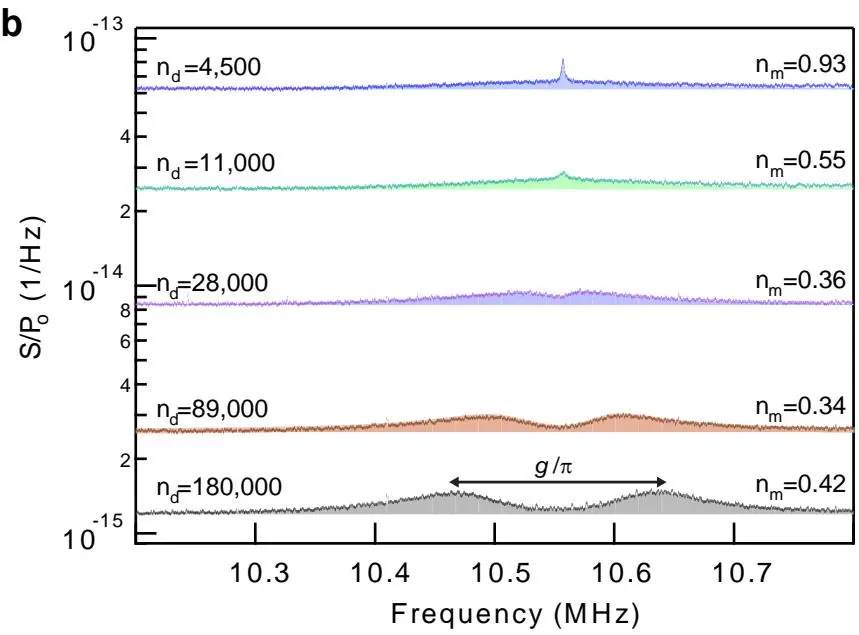
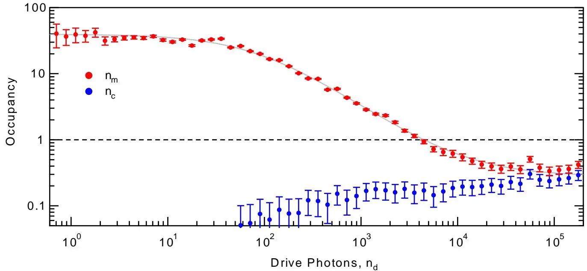

# Sideband Cooling of Micromechanical Motion to the Quantum Ground State
## 边带冷却微机械运动至量子基态

**J. D. Teufel, T. Donner, D. Li, J. W. Harlow, M. S. Allman, K. Cicak, A. J. Sirois, J. D. Whittaker, K. W. Lehnert, R. W. Simmonds**

NIST Boulder · JILA · University of Colorado

*Nature* **475**, 359–363 (2011)

## 摘要

激光冷却技术的出现彻底改变了许多原子尺度系统的研究，把囚禁离子制备到运动基态 [1]、实现玻色-爱因斯坦凝聚 [2]。类似的冷却技术 [3,4] 为把宏观物体制备到运动基态提供了一条通用而灵活的途径，将微机械的强大技术带入量子区。腔光机械或电机械系统通过光与运动的强相互作用实现边带冷却 [5–15]。然而进入量子区（运动量子数小于 1）一直难以企及，因为边带冷却不足以压倒机械系统与热环境的耦合。**本文演示把微机械振子的运动边带冷却到量子基态。** 进入量子区需要大的电机械相互作用——通过把微机械膜嵌入超导微波谐振电路实现。为验证冷却进入量子区，我们对微波场做近量子极限的测量，从海森堡极限分辨出该运动，相差因子 5.1 [3]。此外，器件展现强耦合，允许微波光子与机械声子相干交换 [16]。**同时实现强耦合、基态制备和高效测量**，为运动非经典态的控制与检测的快速进展奠定了舞台 [17,18]，甚至可能在更大的尺寸和质量这一未探索区域检验量子理论本身 [19]。

---

## 背景与动机

既能与环境解耦（高品质因子 $Q$）又能置于量子区的机械振子，能让我们以全新方式探索量子力学 [17–21]。要让振子处于量子区，必须能把它制备到基态、任意操控其量子态、并在接近海森堡极限处检测其状态。要把振子制备到基态，必须把温度 $T$ 降到 $k_BT < \hbar\Omega_m$（$\Omega_m$ 为共振频率）。


高频模（> 1 GHz）用常规制冷（$T < 50$ mK）即可满足冷却要求，但这些「硬」振子在极短的机械寿命内难以控制与检测。一种被动冷却的独特方法 [22]（压电膨胀振子耦合超导量子比特）成功克服了这些困难，但不兼容广泛的低频、高 $Q$、弯曲机械模。为利用这些振子的优异机械性质，需要一种**主动冷却**方法——能把振子温度降到环境温度以下。


### 边带冷却原理

腔光/电机械系统 [4] 自然提供了检测机械运动与把机械模冷却到基态的方法 [23,24]。运动改变电磁腔共振频率 $\omega_c$ 的物体，受到辐射压力力，由参量相互作用哈密顿量描述：

$$
\hat{H}_{\mathrm{int}} = \hbar G\hat{n}\hat{x},
$$

其中 $G = d\omega_c/dx$，$\hat{n}$ 是腔光子数，$\hat{x}$ 是机械振子位移。用频率 $\omega_d$ 驱动腔，振子运动在 $\omega_d \pm \Omega_m$ 产生上下边带。这些边带光子是从驱动场非弹性散射的，提供了与振子交换能量的途径。

图 1a：器件的着色扫描电镜图。铝（灰）电机械电路制作在蓝宝石（蓝）衬底上，15 μm 直径的膜光刻悬浮在下电极上方 50 nm。膜的运动调制电容，进而调制超导微波电路的共振频率。

若驱动场被最优地红失谐（$\Delta \equiv \omega_d - \omega_c = -\Omega_m$），光子会被优先上转换到 $\omega_c$（该处光子态密度最大，图 1b）。当上转换光子离开腔时，带走一个机械量子（一个声子）的能量。于是机械振子被辐射压力力阻尼并冷却。因机械运动编码在离开腔的散射光子中，对该光子场的量子极限测量提供了对机械运动的近海森堡极限检测 [25]。


红失谐驱动（$\Delta = -\Omega_m$）→ 上边带光子优先散射到 $\omega_c$（态密度高）→ 每个散射光子带走一个声子 → 机械振子被冷却。这就是「边带冷却」——把机械量子「泵」到光子上再带走。前提是**分辨边带条件** $\Omega_m \gg \kappa$（机械频率远大于腔线宽）。


### 之前工作的瓶颈

腔光机械系统已实现很大的边带冷却率 [8–12,14,15]，但这些率不足以克服机械模更大的热加热率。电机械实验用低能光子 [5–7,13]，天然兼容 100 mK 以下运行，但一直受限于**弱的电机械相互作用**和**低效的光子场检测**。本文突破正在于这两点。

---

## 器件与实验设计

### 把电机械耦合做到最大

本文的腔电机械系统中，薄铝膜的弯曲模参量耦合到超导微波谐振电路。**与以往微波系统不同，本器件通过把几乎所有微波电场集中在机械振子附近 [16]，实现了大的电机械耦合。** 振子是 100 nm 厚、15 μm 直径的铝膜，悬浮在蓝宝石衬底上第二铝层上方 50 nm [26]（图 1）。两层金属形成可变平行板电容，被 12 nH 螺旋电感旁路。该电容-电感组合创造了一个微波腔，其共振频率依赖膜的机械位移，中心 $\omega_c = 2\pi\times 7.54$ GHz。

| 参数 | 数值 | 含义 |
|------|------|------|
| 膜厚度 | 100 nm | 铝膜 |
| 膜直径 | 15 μm | |
| 膜-下电极间距 | 50 nm | 决定 $G$ |
| 振子质量 $m$ | 48 pg | |
| $\omega_c/2\pi$ | 7.54 GHz | 微波腔频率 |
| $\kappa/2\pi$ | ~200 kHz | 腔能量衰减率 |
| $\Omega_m/2\pi$ | 10.56 MHz | 机械频率 |
| $\Gamma_m/2\pi$ | 32 Hz | 内禀机械阻尼 |
| $Q_m = \Omega_m/\Gamma_m$ | $3.3\times10^5$ | 机械品质因子 |
| $x_{zp}$ | 4.1 fm | 零点运动 |
| $\Omega_m/\kappa$ | > 50 | **深分辨边带区** |
| $G/2\pi$ | $49\pm2$ MHz/nm | 电机械耦合强度 |
| 温度 | 15 mK | 稀释制冷机 |


$\Omega_m/\kappa > 50$ 意味着机械频率（10.56 MHz）远大于腔线宽（200 kHz），上下边带在频谱上清晰分开。这是边带冷却到基态的理想条件 [23,24]：下边带（加热）被强烈抑制，上边带（冷却）被优先散射。本文远超 $\Omega_m/\kappa \gg 1$ 的判据，是该方案成功的关键。


### 近量子极限测量：约瑟夫森参量放大器

为测量机械位移，施加红失谐（$\Delta = -\Omega_m$）微波场。上边带（$\omega_c$）被定制**约瑟夫森参量放大器（JPA）**[27,28] 放大，再经低温放大器、室温解调、频谱仪监测。膜的热运动在微波噪声谱中产生清晰可分辨的峰。如前所述 [28]，该测量方案构成近散粒噪声极限的微波干涉仪，可在接近基本极限的最小附加噪声下测量机械位移。

---

## 校准与测量灵敏度

### 温度校准

为把解调信号校准到膜的运动，在改变低温箱温度时测量热噪声谱（图 1c）。用弱微波驱动（~3 个腔光子）确保辐射压力阻尼与冷却效应可忽略。当 $\Omega_m \gg \kappa \gg \Gamma_m$ 且 $\Delta = -\Omega_m$，位移谱密度 $S_x$ 与观测微波噪声谱密度 $S$ 关系为 $S_x = 2(\kappa\Omega_m/G\kappa_{ex})^2 S/P_o$。按能量均分，$S_x$ 共振曲线下面积正比于机械模有效温度。

图 1c：上边带微波功率直接测量机械模热占据，可通过改变低温箱温度原位校准。机械模在所有温度都热化到低温箱，未用边带冷却时最小热占据为 30 个机械量子。插图说明边带冷却概念。

线性依赖表明机械模在最低可达到温度 15 mK 仍与低温箱平衡——对应热占据 $n_m = 30$。校准定出电机械耦合强度 $G/2\pi = 49\pm2$ MHz/nm。

### 测量不精确度

总测量位移噪声来自膜实际均方运动 $S_x^{\mathrm{th}}$ 和测量不精确导致的表观运动 $S_x^{\mathrm{imp}}$。图 2a 显示低噪声参量放大显著降低 $S_x^{\mathrm{imp}}$，白噪声背景降低 30 倍以上，把分辨热运动所需积分时间缩短 1000 倍。

图 2：辐射压力阻尼下的位移灵敏度。(a) 有（红）/无（蓝）JPA 的位移谱密度。(b) 微波驱动功率增加时绝对位移灵敏度 $S_x^{\mathrm{imp}}$ 改善，最高功率达 $5.5\times10^{-34}$ m²/Hz。(c) 参量耦合 $g$ 随 $\sqrt{n_d}$ 增长，把机械线宽从 $\Gamma_m = 2\pi\times 32$ Hz 阻尼到腔 $\kappa$。(d) 以机械量子为单位的相对测量不精确 $n_{\mathrm{imp}}$ 渐近到常数 $n_{\mathrm{imp}} = 1.9$，直接量度光子测量效率。

增加失谐驱动幅度（以腔光子数 $n_d$ 量度）时：

- 不精确度 $S_x^{\mathrm{imp}} \propto 1/n_d$，最高功率（$n_d\approx 10^5$）下绝对位移灵敏度 $5.5\times10^{-34}$ m²/Hz。
- 但驱动功率也阻尼并冷却振子 [3,23,24]。总机械耗散率 $\Gamma_m' = \Gamma_m + \Gamma$，其中 $\Gamma = \Gamma_+ - \Gamma_-$，$\Gamma_\pm = 4g^2\kappa/[\kappa^2 + 4(\Delta\pm\Omega_m)^2]$，$g = Gx_{zp}\sqrt{n_d}$。
- 辐射压力阻尼在约 75 个光子处变得显著（$\Gamma = \Gamma_m$，机械线宽翻倍）。

把不精确度表示为等价机械量子 $n_{\mathrm{imp}} = \Gamma_m' S_x^{\mathrm{imp}}/(8x_{zp}^2)$，可见驱动大于 $n_d\approx 100$ 后 $S_x^{\mathrm{imp}}$ 的线性下降被 $\Gamma_m'$ 的线性增长抵消，$n_{\mathrm{imp}}$ 不再改善。**渐近值 $n_{\mathrm{imp}}$ 直接量度微波测量效率。** 理想无损量子极限测量 $n_{\mathrm{imp}} = 1/4$。JPA 把 $n_{\mathrm{imp}}$ 从 70 降到 **1.9 个量子**——接近理想极限。

---

## 主要结果：边带冷却到量子基态

从 20 mK（热占据 $n_m^T = 40$）出发，辐射压力力冷却膜。图 3a 显示随 $n_d$ 从 18 增到 4500 的位移谱密度——功率增大导致三效应：噪声底更低、共振更宽、面积更小。**面积对应均方运动，直接测量模有效温度。** 在 4000 个光子的驱动下，热占据降到 1 个机械量子以下——**进入量子区**。

图 3a：五种驱动功率下的位移噪声谱与洛伦兹拟合（阴影）。功率更高时机械模既被阻尼（更大线宽）又被冷却（更小面积）。

图 3b：更宽频段内归一化边带噪声谱清晰显示窄机械峰和宽腔峰。驱动功率增加时腔出现可分辨热布居，为耦合系统的最终占据设下限制。最高驱动功率下耦合率超过两模内禀耗散，系统杂化为光机械正则模。

图 3c：从 20 mK 热平衡 $n_m = 40$ 出发，边带冷却把机械模热占据降至 $n_m = 0.34 \pm 0.05$——量子基态。

### 冷却极限：腔热布居的瓶颈

更宽频段上出现线宽 $\kappa$ 的第二个洛伦兹峰，面积对应腔的有限热占据 $n_c$。机械模与电模这两噪声源相互干涉，导致噪声挤压 [13]，在 $2g > \kappa/\sqrt{2}$ 时发展为正则模劈裂 [29]。用量子描述 [13,25]，预期噪声谱为

$$
S/\hbar\omega = \frac{1}{2} + n_{\mathrm{add}} + \frac{2\kappa_{ex}[\kappa n_c(\Gamma_m^2 + 4\delta^2) + 4\Gamma_m n_m^T g^2]}{|4g^2 + (\kappa + 2j(\delta+\widetilde{\Delta}))(\Gamma_m + 2j\delta)|^2}. \tag{1}
$$

**边带冷却永远不能把机械模占据降到腔占据以下。** 假设 $\Omega_m \gg \kappa$，机械模的最终占据 [29]

$$
n_m = n_m^T\left(\frac{\Gamma_m}{\kappa}\frac{4g^2+\kappa^2}{4g^2+\kappa\Gamma_m}\right) + n_c\left(\frac{4g^2}{4g^2+\kappa\Gamma_m}\right). \tag{2}
$$

对中等耦合（$\sqrt{\kappa\Gamma_m}\ll g \ll \kappa$），机械冷却与驱动光子数线性。超出此区，正则模劈裂的开始抑制进一步冷却——机械冷却率不再由机械-腔耦合限制，而由腔-环境耦合率 $\kappa$ 限制。最终占据不能低于 $n_m^T\Gamma_m/\kappa$。


随耦合增大，本文器件先冷却到基态、再进入强耦合区（$n_m^T\Gamma_m < \kappa < g$）。$n_d$ 超过 $2\times10^4$ 后机械占据收敛到腔布居，达最小值 $\mathbf{n_m = 0.34 \pm 0.05}$。最高功率（$n_d = 2\times10^5$）下机械模与腔杂化，呈现强耦合特征的正则模劈裂 [16]。这是「先基态、再强耦合」的正确次序——只有在强耦合区，量子态才能比从电磁或机械模到环境的退相干更快地被操控。


---

## 接近海森堡极限

图 2 与图 3 共同量化了系统的总测量效率。海森堡极限要求连续位移测量必伴随反作用力 [3,12,25]：$\sqrt{S_x^{\mathrm{imp}}S_F} \geq \hbar$，$S_F$ 为力噪声谱密度。从机械模热占据与阻尼率提取总力谱密度 $S_F = 4\hbar\Omega_m m\Gamma_m'(n_m + 1/2)$。假设有限占据完全由反作用造成（最保守），得上界。本实验达到迄今最接近海森堡极限的位移检测 [14,25]，最低不精确-反作用积

$$
\sqrt{S_x^{\mathrm{imp}}S_F} = 4\hbar\sqrt{n_{\mathrm{imp}}(n_m + 1/2)} = (5.1\pm0.4)\hbar.
$$

即离海森堡极限（红失谐激励下理论下限 $\hbar\sqrt{2}$）仅差因子 **3.6**；若用单端口几何（$\beta=1$）而非对称耦合（$\beta=1/2$），该因子还能降到 1.8。于是该机械器件**同时实现基态制备、强耦合与近量子极限检测**。

---

## 补充材料要点

补充材料给出噪声谱的完整输入输出理论推导、测量电路、腔参数定标，以及边带冷却的基本极限。

### 完整噪声谱（适用于弱耦合与强耦合）

输出噪声含两项：腔热噪声（谱权分布在「缀饰」腔模上，弱耦合退化为洛伦兹线型）与机械模热噪声（带修正的机械灵敏度）。本文未假设弱耦合，故该公式在正则模劈裂存在时也成立——给出统一的描述。

### 边带冷却的基本极限

式 (2) 是 $g/\Omega_m$、$\kappa/\Omega_m$ 的一阶近似。二阶修正最后一项 $\frac{8g^2+\kappa^2}{16\Omega_m^2}$ 代表**边带冷却的基本极限**——它突显了分辨边带区的重要性。本文 $\Omega_m \gg \kappa, g$，该极限贡献可忽略（$<10^{-4}$ 量子）。

### 测量效率的损耗

附加噪声 $n_{\mathrm{add}}' = n_{\mathrm{add}}/\eta + ((1-\eta)/\eta)/2$（$\eta$ 为腔-探测器透过率）。JPA 自身 $n_{\mathrm{add}} = 0.8$，腔-JPA 间 2.5 dB 损耗 → 总 $n_{\mathrm{add}}' = 2.1$。这解释了 $n_{\mathrm{imp}} = 1.9$ 高于理想 $1/4$。**单端口几何 + 更低损耗**是后续改进的方向。

---

## 结论与展望

这些测量展示了边带技术把宏观（~$10^{12}$ 原子）机械模冷却到量子区——超出常规制冷技术所能。这些广泛适用的态制备、操控与检测方法，为触及一大类长寿命机械振子的量子本性铺路。通过光子与声子的强相互作用，机械系统现在能继承量子光学的实验与理论力量，**开启了量子声学（quantum acoustics）这一领域**。

展望：零点运动的直接测量、声子发射与吸收率基本不对称性的观测 [1]、量子非破坏测量 [3]、机械运动纠缠态的产生 [17,18]；结合单光子源与探测器（如超导量子比特 [22,30]），可制备任意机械运动量子态、观测 7 GHz 光子与 10 MHz 声子间的单激发 Rabi 振荡 [20]。机械模的参量耦合可快速开关，态转入后可存储 $\tau_{\mathrm{th}} = 1/(n_m^T\Gamma_m) > 100$ μs。最后，机械振子能耦合任意频率的光，可作微波-光学位域间量子信息传递的独特中介 [21]。

---

## 参考文献


学术论文的参考文献条目按国际惯例保留原文，便于检索原文。以下为本文引用的主要文献。


1. Diedrich, Bergquist, Itano, Wineland, *Phys. Rev. Lett.* **62**, 403 (1989). — **离子激光冷却到零点能，边带冷却的原型。**
2. Anderson et al., *Science* **269**, 198 (1995). — 玻色-爱因斯坦凝聚。
3. Braginsky, Khalili, *Quantum Measurement* (Cambridge, 1992). — **量子测量与海森堡极限的奠基。**
4. Kippenberg, Vahala, *Science* **321**, 1172 (2008). — 腔光机械综述。
7. Teufel, Harlow, Regal, Lehnert, *Phys. Rev. Lett.* **101**, 197203 (2008). — **微波场对纳米机械振子的动力学反作用，本文组的前作。**
13. Rocheleau et al., *Nature* **463**, 72 (2010). — 机械振子近基态制备（前作）。
16. Teufel et al., *Nature* **471**, 204 (2011). — **强耦合区电路腔电机械，本文器件的器件论文。**
22. O'Connell et al., *Nature* **464**, 697 (2010). — **机械振子量子基态与单声子控制（被动冷却路线，本文的对照）。**
23. Marquardt, Chen, Clerk, Girvin, *Phys. Rev. Lett.* **99**, 093902 (2007). — **腔辅助边带冷却的量子理论。**
24. Wilson-Rae, Nooshi, Zwerger, Kippenberg, *Phys. Rev. Lett.* **99**, 093901 (2007). — **动力学反作用基态冷却理论。**
25. Clerk, Devoret, Girvin, Marquardt, Schoelkopf, *Rev. Mod. Phys.* **82**, 1155 (2010). — **量子噪声、测量与放大的权威综述。**
27. Castellanos-Beltran, Irwin, Hilton, Vale, Lehnert, *Nature Phys.* **4**, 929 (2008). — **可调约瑟夫森超材料放大与压缩。**
28. Teufel, Donner, Castellanos-Beltran, Harlow, Lehnert, *Nature Nanotech.* **4**, 820 (2009). — **纳米机械运动测量不精确度低于标准量子极限，本文测量方案的前作。**
29. Dobrindt, Wilson-Rae, Kippenberg, *Phys. Rev. Lett.* **101**, 263602 (2008). — 腔光机械中参量正则模劈裂。

---

## 阅读笔记

### 一句话概括

把一片 15 μm 的超导铝膜（48 pg、~$10^{12}$ 原子）嵌进 7.54 GHz 的超导微波腔，用红失谐驱动把膜的 10.56 MHz 弯曲模**边带冷却**到 $n_m = 0.34$——低于 1 个量子，进入量子基态；同时靠 JPA 做到 $n_{\mathrm{imp}} = 1.9$ 的近量子极限位移测量，并展示强耦合（光子-声子相干交换）。这是**宏观机械振子首次被主动冷却到量子区**，开启了量子声学。

### 核心论证链

1. **器件创新**：把几乎所有微波电场集中在 50 nm 间隙的膜附近 → 电机械耦合 $G/2\pi = 49$ MHz/nm 比以往大得多。这是「为什么这次能成」的硬件突破。
2. **深分辨边带**：$\Omega_m/\kappa > 50$（10.56 MHz vs 200 kHz）→ 上下边带清晰分开，红失谐驱动优先散射冷却边带，加热边带被强烈抑制。
3. **JPA 让测量够灵敏**：JPA 把附加噪声降到 $n_{\mathrm{imp}} = 1.9$（理想 $1/4$），既能看到膜的微弱热运动，又能分辨冷却后的残余占据。
4. **冷却的层级**：随驱动功率↑，先 $\Gamma = \Gamma_m$（阻尼起效）→ $n_m < 1$（进量子区）→ $2g > \kappa/\sqrt{2}$（强耦合正则模劈裂）。正确的「先基态、再强耦合」次序。
5. **极限由腔热布居决定**：边带冷却不能把机械模冷到腔以下（式 2），腔在高功率下被加热到 $n_c\sim 0.3$，机械模收敛到 $n_m = 0.34$——这是真正的瓶颈。

### 关键物理：边带冷却为什么能把振子冷到环境温度以下？

常规制冷只能让振子与环境平衡（本文 $n_m = 30$ @ 15 mK）。边带冷却的精妙在于它**不靠温度梯度，而靠频率选择性**：

- 红失谐驱动（$\omega_d = \omega_c - \Omega_m$）在腔里产生的光子，遇到膜的热运动会被散射。
- 上边带散射（$\omega_d + \Omega_m \to \omega_c$）：光子能量提高 $\hbar\Omega_m$，能量来自声子 → **声子湮灭**（冷却）。该散射到 $\omega_c$ 处态密度高，速率 $\Gamma_-$ 大。
- 下边带散射（$\omega_d - \Omega_m$）：光子能量降低 $\hbar\Omega_m$，能量给声子 → **声子产生**（加热）。该散射到 $\omega_d - \Omega_m$ 处态密度低，速率 $\Gamma_+$ 小。
- 净冷却率 $\Gamma = \Gamma_- - \Gamma_+ > 0$，有效温度 $T_{\mathrm{eff}} \sim T\cdot\Gamma_m/(\Gamma_m + \Gamma) \ll T$。

**前提 $\Omega_m \gg \kappa$（分辨边带）**：只有上下边带在频域分开，$\Gamma_+$ 才会远小于 $\Gamma_-$。若 $\Omega_m \lesssim \kappa$（ unresolved），两速率接近，冷却被加热抵消。本文 $\Omega_m/\kappa > 50$ 是这个方案成功的根基。

### 关键创新：为什么本文能成，之前不能？

| 挑战 | 之前工作的状态 | 本文的突破 |
|------|---------------|------------|
| 电机械耦合弱 | $g_0$ 太小，冷却率 $\Gamma = 4g^2/\kappa$ 不够 | 50 nm 间隙集中电场 → $G/2\pi = 49$ MHz/nm（大 1-2 个数量级）|
| 测量效率低 | HEMT 附加噪声大（~20-70 量子）| JPA 把 $n_{\mathrm{imp}}$ 从 70 降到 1.9（接近 $1/4$ 理想）|
| 热加热率大 | 光机械 $\Gamma_m$ 大，冷却率跟不上 | 超导电路 + 15 mK + 高 $Q_m = 3.3\times10^5$，$\Gamma_m = 32$ Hz 极小 |
| 分辨边带 | 光学 $\kappa$ 难做小 | 微波 $\kappa = 2\pi\times 200$ kHz 天然小，$\Omega_m/\kappa > 50$ |

三点同时突破（耦合、测量、低温兼容）才能成——这也是为什么这是 2011 年才实现的里程碑。

### 海森堡极限与不精确-反作用积

连续位移测量有个基本约束：测得越准（$S_x^{\mathrm{imp}}$ 小），反作用力越大（$S_F$ 大），乘积 $\sqrt{S_x^{\mathrm{imp}}S_F} \geq \hbar$（式 S13）。本文达 $(5.1\pm0.4)\hbar$，离红失谐激励下的理论下限 $\hbar\sqrt{2}$ 仅差 3.6 倍。

| 量 | 本文 | 理想 |
|----|------|------|
| $n_{\mathrm{imp}}$ | 1.9 | 1/4 |
| $n_m$（最小）| 0.34 | 0 |
| $\sqrt{S_x^{\mathrm{imp}}S_F}/\hbar$ | 5.1 | $\sqrt{2}$（红失谐）/ 1（共振）|

$n_{\mathrm{imp}} = 1.9$ 高于理想 $1/4$ 的原因：JPA 自身 $n_{\mathrm{add}} = 0.8$ + 腔-JPA 间 2.5 dB 损耗 + 对称耦合 $\beta = 1/2$ 丢失一半信号。补充材料指出单端口几何 + 更低损耗可把这个因子从 3.6 降到 1.8——后续工作（如 Wilson 2015、Mason 2019，本图书馆笔记）正是沿这条路线改进的。

### 批判性思考

**1. $n_m = 0.34$ 的「基态」要打引号。** 严格说 $n_m = 0.34$ 意味着约 25% 的时间振子处于激发态，并非「纯基态」。但 $n_m < 1$ 是「进入量子区」的公认判据（基态布居 > 50%），所以「接近基态」的表述是合理的。真正的纯基态（$n_m \to 0$）受限于腔热布居 $n_c$——只要腔在高功率下被加热到 ~0.3，机械模就不可能更低。这是本文方法学的内在限制，不是工程不足。

**2. 腔加热的来源未完全查清。** 文中承认「不清楚观察到的腔布居是衬底直接加热、微波衰减器加热、还是内禀腔频率噪声」，但排除了信号源的相位/幅度噪声（用滤波腔做了 40 dB 抑制，补充材料图 S3）。这种「不知道但排除了 A」的论证是负面的——腔加热的真正机制可能是 JPA 泵浦漏到腔、或超导膜的非平衡准粒子，这些都可能成为后续工作的瓶颈。Wilson 2015 通过更好地隔离泵浦、Mason 2019 通过改进 JPA 设计都在这点上做了改进。

**3. 「先基态、再强耦合」的次序依赖精细参数调谐。** 理想层级 $n_m^T\Gamma_m < \kappa < g$ 需要内禀机械耗散 $\Gamma_m = 2\pi\times 32$ Hz 极小。如果 $\Gamma_m$ 更大（如更差的 $Q_m$），冷却到基态所需功率会更高，腔加热会更严重，可能无法在强耦合前先达基态。本文的 $Q_m = 3.3\times10^5$ 是仔细工程的成果，但不一定可复制——不同器件批次的 $Q_m$ 可能波动。

**4. 与 O'Connell 2010 [22] 的路线对比。** O'Connell 2010 先于本文实现了机械振子基态（$n_m \approx 0$）+ 单声子控制，但用的是 6 GHz 高频压电振子 + 被动冷却（直接制冷到基态）。本文用的是 10.56 MHz 低频弯曲模 + 主动边带冷却。两条路线各有优劣：O'Connell 的高频振子天然易基态化但机械寿命短、$Q$ 低；本文的低频振子 $Q$ 高、寿命长（$\tau_{\mathrm{th}} > 100$ μs），但需主动冷却。本文的意义在于**把基态制备推广到广泛存在的低频高 $Q$ 弯曲模**——这是 O'Connell 路线做不到的。

**5. 「量子声学」的开场白有点超前。** 结论里说「开启量子声学」，但本文并未演示任何非经典声子态（无猫态、无 Fock 态分辨、无纠缠）。它做的是**基态制备 + 强耦合 + 好测量**——这是后续非经典实验的三块基石。真正的「量子声学」非经典演示要等后续（如 Wilson 2015 的反馈冷却、Mason 2019 的低于 SQL 测量）。本文的定位是「enabling」，不是「demonstrating」——这个区分很重要，避免把奠基工作当成终点。

### 局限性

- **非纯基态**：$n_m = 0.34$，有热激发残余。
- **腔加热未解**：限制了最终占据，机制部分不明。
- **依赖精细参数**：$\Gamma_m$ 必须极小才能实现正确层级。
- **无非经典态演示**：未做 Fock 态、猫态、纠缠。
- **对称耦合 $\beta = 1/2$**：丢失一半信号到输入，降低测量效率。
- **JPA 损耗**：腔-JPA 间 2.5 dB 损耗抬高 $n_{\mathrm{add}}'$。

### 关键公式速查

| 公式 | 含义 | 出处 |
|------|------|------|
| $\hat{H}_{\mathrm{int}} = \hbar G\hat{n}\hat{x}$ | 辐射压力参量耦合 | 正文 |
| $\Gamma_\pm = 4g^2\kappa/[\kappa^2 + 4(\Delta\pm\Omega_m)^2]$ | 上下边带散射率 | 正文 |
| $g = Gx_{zp}\sqrt{n_d}$ | 增强耦合率（驱动依赖）| 正文 |
| $S/\hbar\omega = \frac{1}{2} + n_{\mathrm{add}} + \frac{2\kappa_{ex}[\kappa n_c(\Gamma_m^2+4\delta^2)+4\Gamma_m n_m^T g^2]}{\|4g^2+(\kappa+2j(\delta+\widetilde{\Delta}))(\Gamma_m+2j\delta)\|^2}$ | 完整噪声谱（弱+强耦合统一）| 式 (1) |
| $n_m = n_m^T(\frac{\Gamma_m}{\kappa}\frac{4g^2+\kappa^2}{4g^2+\kappa\Gamma_m}) + n_c(\frac{4g^2}{4g^2+\kappa\Gamma_m})$ | 最终占据（一阶近似）| 式 (2) |
| $\sqrt{S_x^{\mathrm{imp}}S_F} = 4\hbar\sqrt{n_{\mathrm{imp}}(n_m+1/2)} \geq \hbar$ | 海森堡不精确-反作用积 | 式 (S13) |
| $n_{\mathrm{imp}} = \frac{1}{4\beta}\frac{\kappa}{\kappa_{ex}}\frac{4g^2+\kappa\Gamma_m}{4g^2}(\frac{1}{2}+n_{\mathrm{add}}')$ | 测量不精确度（机械量子单位）| 式 (S11) |

### 延伸阅读

- **Marquardt et al. (2007) [23]** + **Wilson-Rae et al. (2007) [24]** — 边带冷却到基态的量子理论，本文方案的理论根基（两篇背靠背 PRL）。
- **Clerk et al. (2010) [25]** — *Rev. Mod. Phys.* 量子噪声、测量与放大综述，理解海森堡极限、反作用、附加噪声的权威。
- **Teufel et al. (2009) [28]** — 纳米机械运动测量低于标准量子极限，本文测量方案的前作。
- **Teufel et al. (2011) [16]** — 强耦合电路腔电机械（*Nature* 471），本文器件的器件论文。
- **O'Connell et al. (2010) [22]** — 高频压电振子基态 + 单声子控制（被动冷却路线），本文的对照。
- **Braginsky & Khalili, *Quantum Measurement* (1992) [3]** — 量子测量与海森堡极限的奠基教材。
- **本图书馆相关笔记**：
  - **LaHaye et al. (2009)** — 纳米机械测量超导量子比特（nanomechanical-superconducting-qubit），本文之前的 NEMS-量子比特色散耦合，对比本文的边带冷却路线。
  - **Wilson et al. (2015)** — 机械振子的测量反馈控制，本文边带冷却 + JPA 路线的后续。
  - **Mason et al. (2019)** — 连续力与位移测量低于标准量子极限，本文海森堡极限接近的延续。

### 术语对照

| 中文 | 英文 | 含义 |
|------|------|------|
| 边带冷却 | sideband cooling | 用红失谐驱动把机械量子泵到光子上带走，冷却振子 |
| 量子基态 | quantum ground state | $n_m < 1$，基态布居 > 50% |
| 腔电机械 | cavity electromechanics | 机械振子参量耦合微波腔 |
| 腔光机械 | cavity optomechanics | 机械振子参量耦合光学腔 |
| 分辨边带 | resolved sideband | $\Omega_m \gg \kappa$，上下边带分开 |
| 红失谐 | red detuned $\Delta = -\Omega_m$ | 驱动低于腔频一个机械频率（冷却）|
| 蓝失谐 | blue detuned $\Delta = +\Omega_m$ | 驱动高于腔频（加热/放大）|
| 辐射压力 | radiation pressure | 光子数改变对振子的力 |
| 动力学反作用 | dynamical backaction | 散射光子对振子的等效阻尼/加热 |
| 正则模劈裂 | normal-mode splitting | 强耦合下光子-声子杂化产生两个本征模 |
| 强耦合 | strong coupling $g > \kappa, \Gamma_m$ | 相干交换快于退相干 |
| 零点运动 | zero-point motion $x_{zp}$ | 量子基态的位移涨落 |
| 约瑟夫森参量放大器 | Josephson parametric amplifier (JPA) | 近量子极限的微波放大器 |
| 附加噪声 | added noise $n_{\mathrm{add}}$ | 放大器添加的噪声（量子数单位）|
| 不精确度 | imprecision $n_{\mathrm{imp}}$ | 测量位移的不确定度（量子数单位）|
| 反作用 | backaction $n_{\mathrm{ba}}$ | 测量对振子的扰动力 |
| 海森堡极限 | Heisenberg limit | $\sqrt{S_x^{\mathrm{imp}}S_F} \geq \hbar$ |
| 标准量子极限 | standard quantum limit (SQL) | 单正交测量的最佳经典精度 |
| 光机械诱导透明 | optomechanically induced transparency | 强耦合下腔谱的透明窗口 |
| 量子声学 | quantum acoustics | 声子量子态的研究（本文开启）|
| 热占据 | thermal occupancy $n_m^T$ | $[\exp(\hbar\Omega_m/k_BT)-1]^{-1}$ |
| 输入输出理论 | input-output theory | 腔-传输线边界标准理论 |
| 单端口腔 | single-port cavity $\beta=1$ | 全部信号耦合到输出（理想）|
