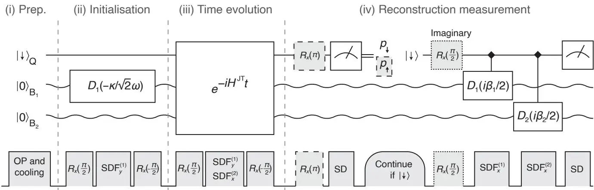

# Direct observation of geometric-phase interference in dynamics around a conical intersection
## 锥形交叉点动力学中几何相位干涉的直接观测

**C. H. Valahu, V. C. Olaya-Agudelo, R. J. MacDonell 等**

悉尼大学 · ARC 量子系统工程卓越中心 · UCSD · ETH Zurich

*Nature Chemistry* **15**, 1503–1508 (2023) | 🔴 实验

## 摘要

锥形交叉点（conical intersections）在化学和物理中广泛存在，控制着光收集、视觉、光催化和化学反应性等过程。当反应路径环绕锥形交叉点时，分子波函数会受到几何相位的影响，通过量子力学干涉改变反应结果。以往实验只在散射模式和光谱可观测量中检测到几何相位的间接信号，从未直接观测到底层的波包干涉。本文在可编程离子阱量子模拟器中，首次直接观测到了一个**工程化锥形交叉点**周围波包动力学中的几何相位干涉。实验开发了一种重建囚禁离子二维波包密度的技术，结果与理论模型一致，证明了类比量子模拟器精确描述核量子效应的能力。

---

## 实验方案

### 离子阱量子模拟器

实验使用 **$^{171}\mathrm{Yb}^+$ 离子阱**量子模拟器，通过映射关系将化学系统的锥形交叉点动力学编码到离子的内部和运动自由度中：

- 离子的两个内部电子态模拟分子的两个电子态
- 离子的两个简谐振动模式模拟分子的两个核振动模式
- 激光驱动的耦合模拟非绝热耦合

### 几何相位干涉

当波包沿环绕锥形交叉点的闭合路径演化时，几何相位导致波函数获得一个 $\pi$ 相移。两条路径（顺时针 vs 逆时针）的干涉产生**破坏性干涉**——这是几何相位的直接指纹。



实验示意：离子阱中的工程化锥形交叉点，波包绕锥形交叉点演化的两条路径。

---

## 阅读笔记

### 一句话概括

首次在离子阱量子模拟器中直接观测到了锥形交叉点周围几何相位导致的波包干涉——从"间接信号"到"直接观测"的跨越。

### 与传统 Berry 相位实验的关系

| | Leek 2007 | 本文 (2023) |
|---|---|---|
| 平台 | 超导量子比特 | **离子阱** |
| 几何相位来源 | 外加磁场旋转 | **锥形交叉点（分子动力学）** |
| 应用场景 | 量子计算 | **化学动力学** |
| 核心观测 | Berry 相位累积 | **几何相位干涉图样** |

这是 Berry 相位研究从"量子计算"到"化学物理"的跨学科延伸。

### 延伸阅读

- **[Leek et al. 2007, Science](/papers/berry-phase-solid-state-qubit/)** — Berry 相位在固态中的首次观测
- **Berry 1984, Proc. R. Soc. Lond. A** — Berry 相位的原始论文
