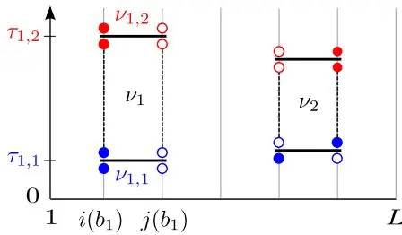
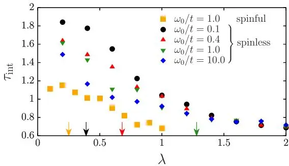
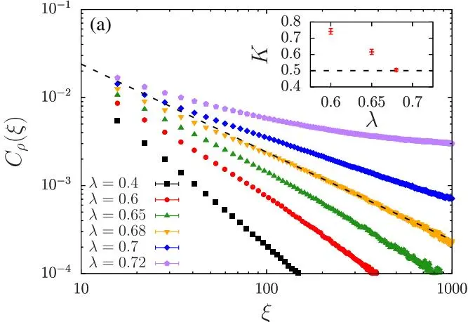
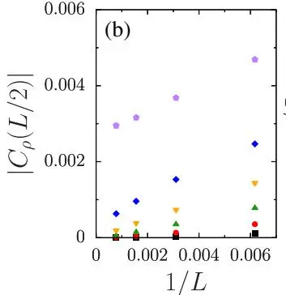
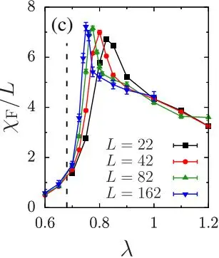
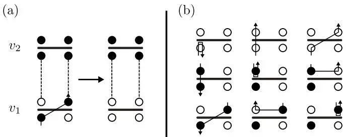

## 延迟相互作用的定向环量子蒙特卡洛方法

Manuel Weber, Fakher F. Assaad, 和 Martin Hohenadler

Institut für Theoretische Physik und Astrophysik, Universität Würzburg, 97074 Würzburg, Germany (收稿日期：2017年4月28日；发表于2017年8月31日)

我们将定向环量子蒙特卡洛方法推广到延迟相互作用的情况。通过路径积分，费米子-玻色子或自旋-玻色子模型可以通过解析积分掉玻色子，映射为具有延迟相互作用的作用量。这产生了一种精确算法，它将随机级数展开表示中高效环更新的优势与避免直接采样玻色子的优点相结合。应用于电子-声子模型表明，该方法克服了先前存在的长自相关时间和指数递减接受率等有害问题。例如，由此产生的巨大加速使我们能够研究最多1282个位点链上的Peierls量子相变。

引言——在缺乏强关联量子系统的一般精确解的情况下，高效数值方法的发展是一个核心目标。对于一维情况，密度矩阵重正化群方法[1,2]已成为标准方法。然而，对于更高维度、有限温度或长程相互作用，其效率要低得多，因此量子蒙特卡洛方法通常更具优势。后者为相当一般的一维费米子和自旋哈密顿量提供高精度结果。特别地，在随机级数展开表示中[3]对路径积分进行QMC模拟的计算开销与系统大小$\mathbb{L}$和逆温度$\beta = 1 / k_{B} T$成线性关系。由于使用了簇更新（算子环或定向环）[4–6]，自相关时间较短。虽然通常由于符号问题而局限于1D费米子模型，但此类QMC方法已成功应用于更高维度的自旋[7–9]和玻色子[10,11]模型。

延迟相互作用（即在虚时上非局域）对系统大小、温度和参数施加了显著限制。这类相互作用通常源于与玻色子模式（例如，声子[12,13]或自旋涨落[14]）的耦合，或来自动力学屏蔽[15]。由于此类问题普遍不可积，人们对它们的理解很大程度上来源于数值研究。虽然杂质问题可以非常有效地求解[16]，但格点问题仍然是一个挑战。在DMRG方法中[17–19]，庞大的玻色子希尔伯特空间成为一个限制因素，尤其是在有限温度或动力学性质方面。对于基于SSE的QMC方法[20–26]，缺乏对玻色子的全局更新（除了一种特定形式的自旋-声子耦合[27]），使得模拟效率远低于费米子或自旋的情况。近相变点自相关时间显著增加[21]。极长的自相关时间也影响行列式QMC方法，其中即使是自由玻色子的采样也可能具有挑战性[28]。事实上，对于电子-声子模型，具有$(\beta L)^{3}$标度和局部更新的连续时间相互作用展开QMC方法[29–31]在相同计算成本下为关联函数提供更好的结果[23]。另一方面，定向环方法对于空间长程相互作用仍然有效[32,33]。

在这篇快报中，我们通过在虚时中表述问题、解析地积分掉玻色子，并利用定向环更新来高效地采样由此产生的具有延迟相互作用的问题，从而克服了这些限制。这种新颖方法结合了SSE表示中可用的全局更新和基于作用量的CT-INT方法中可能实现的玻色子解析积分两者的优势。

方法——SSE表示[3]对应于配分函数的高温展开，

$$
Z = \sum_{\alpha} \sum_{n = 0}^{\infty} {\frac{\beta^{n}} {n !}} \sum_{S_{n}} \langle \alpha | \prod_{p = 1}^{n} \hat{H}_{a_{p} , b_{p}} | \alpha \rangle .\tag{1}
$$

哈密顿量 $\hat{H}$ 被写成局域算符之和 $\begin{array} {r} {\hat{H} = - \sum_{a , b} \hat{H}_{a , b} ,} \end{array}$，其中 $a$ 指定算符类型，$b$ 指定格点 $i_b$ 和 $j(b)$ 之间的键。展开式 (1) 通过随机方式采样。一个展开阶为 $n$ 的构型对应一个由 $n$ 个算符组成的序列，由索引序列 ${\cal S}_{n} = \{[ a_{1} , b_{1} ] , . . . , [ a_{n} , b_{n} ] \}$ 指定，以及一个来自完备基的态 $\alpha$，在该基中 $\hat{H}$ 无分支，即 $\hat{H}_{a , b} | \alpha \rangle \sim | \alpha^{\prime} \rangle$。如果 $\hat{H}$ 同时包含非对角（$a = 1$）和对角（$a = 2$）算符，则两种更新类型足以实现遍历性。对于对角更新，通常通过插入 $\mathbb{N} − n$ 个单位算符 $( a = 0 )$ 将算符串长度固定为 $\mathbb{N}$。然后，可以顺序遍历 $S_{N}$，并提出更新 $\hat{H}_{0 , b} \hat{H}_{2 , b}$。相应的构型权重直接从传播态 $\begin{array} {r} {| \alpha ( p ) \rangle \sim \prod_{l = 1}^{p} \hat{H}_{a_{l} , b_{l}} | \alpha \rangle} \end{array}$ 获得。

全局有向环更新在大范围键上交换对角和非对角算符 [5]。

为具体说明，我们以高度非平庸的一维无自旋 Holstein 哈密顿量为例进行解释 [12]

$$
\hat{H} = - t \sum_{i} \hat{B}_{i , i + 1} + \omega_{0} \sum_{i} \hat{a}_{i}^{\dagger} \hat{a}_{i} + \gamma \sum_{i} \hat{\rho}_{i} ( \hat{a}_{i}^{\dagger} + \hat{a}_{i} ) ,\tag{2}
$$

其中电子跳跃项 $\hat{B}_{i , i + 1} = ( \hat{c}_{i}^{\dagger} \hat{c}_{i + 1} + \mathrm{H . c .} )$，密度 $\hat{\rho}_{i} = ( \hat{c}_{i}^{\dagger} \hat{c}_{i} - 1 / 2 )$；$\hat{c}_{i}^{\dagger}$ 和 $\hat{a}_{i}^{\dagger}$ 分别是作用于格点 $i$ 的费米子和玻色子产生算符；化学势为零。在现有的玻色子-费米子模型 SSE 方法中 [20–23]，费米子按上述方式采样。由于缺乏非对角项，玻色子通过局域移动以及局域占据数的截断进行更新。即使使用 tempering 技术，自相关时间也随耦合强度 $\gamma$ 显著增加 [21]，且接受率随 $\omega_{0}$ 增大呈指数下降 [23]，这严重限制了应用。我们的新方法消除了这些问题。该方法基于相干态路径积分 [34]，其中对玻色子场的高斯积分被显式计算 [35]，从而得到具有延迟相互作用的费米子作用量 [我们定义 $\lambda = \gamma^{2} / ( 2 \omega_{0} t ) ]$

$$
S_{\mathrm{ret}} = - 2 \lambda t \iint d \tau_{1} d \tau_{2} \sum_{i} \rho_{i} ( \tau_{1} ) P ( \tau_{1} - \tau_{2} ) \rho_{i} ( \tau_{2} ) .\tag{3}
$$

$P ( \tau ) = \omega_{0} \cosh [ \omega_{0} ( \beta / 2 - \tau ) ] / [ 2 \sinh ( \omega_{0} \beta / 2 ) ]$ 是自由玻色子传播子，其中 $\tau \in [ 0 , \beta )$ 且 $P ( \tau + \beta ) = P ( \tau )$。其他费米子-玻色子模型也会出现类似的相互作用。

在基于作用量的表述中，SSE 表示对应于将 $\begin{array} {r} {Z = \int \mathcal{D} ( \dot{\bar{c}} , c ) e^{- S_{0} - S_{1}}} \end{array}$ 在 $\begin{array} {r} {S_{0} = \int d \tau \sum_{i} \bar{c}_{i} ( \tau ) \partial_{\tau} c_{i} ( \tau )} \end{array}$ 附近展开。对于一般作用量，我们将 $S_{1}$ 写为顶点之和，

$$
S_{1} = - \sum_{\nu} w_{\nu} h_{\nu} .\tag{4}
$$

一个顶点由超指数 $\nu$、权重 $w_{\nu}$ 以及算符的Grassmann表示 $h_{\nu}$ 指定。配分函数变为

$$
Z = \sum_{n = 0}^{\infty} \sum_{C_{n}} \frac{Z_{0}} {n !} w_{\nu_{1}} . . . w_{\nu_{n}} \langle h_{\nu_{1}} . . . h_{\nu_{n}} \rangle_{0} ,\tag{5}
$$

其中 $C_{n} = \{\nu_{1} , . . . , \nu_{n} \}$ 编码了 $n$ 阶的一个组态，$\langle{\cal O} \rangle_{0} = Z_{0}^{- 1} \int{\cal D} ( \bar{c} , c ) e^{- S_{0}} {\cal O}$，其中 $\begin{array} {r} {Z_{0} = \int \mathcal{D} ( \bar{c} , c ) e^{- S_{0}}} \end{array}$，且时间排序是隐式的。展开式 (5) 对于任何有限的 $\beta$ 和 $\mathbb{L}$ 均收敛 [29]。

对于无延迟问题，我们有 ${\cal S}_{1} =$ $\begin{array} {r} {- \int d \tau \sum_{a , b} H_{a , b} ( \tau ) , ~ \mathrm{i . e . ,} ~ \nu = \{a , b , \tau \} , ~ w_{\nu} = d \tau ,} \end{array}$，且 $h_{\nu} = H_{a , b} ( \tau )$。通过将时间排序的期望值映射到算符串，建立了式 (5) 与 SSE 表示之间的关系：

$$
\sum_{S_{n}} Z_{0} \langle h_{\nu_{1}} . . . h_{\nu_{n}} \rangle_{0} = \sum_{S_{n}} \sum_{\alpha} \langle \alpha | \prod_{p} \hat{H}_{a_{p} , b_{p}} | \alpha \rangle .\tag{6}
$$

在右侧，时间标签不再需要。因此，包含在 $\textstyle \sum_{C_{n}}$ 中的 $\tau$ 积分可以执行，并给出 $\beta^{n}$，从而得到式 (1)。在 SSE 与全哈密顿量中时间排序相互作用展开之间的映射，已在文献 [25] 中引入。

对于如 $\mathrm{E q .} ( 3 )$ 所示的延迟相互作用，$S_{1}$ 特别包含相互作用 $\mathcal{S}_{\mathrm{ret}}$；$\langle h_{\nu_{1}} . . . h_{\nu_{n}} \rangle_{0}$ 仍可映射到算符串以计算组态的权重。然而，权重 $w_{\nu}$ 依赖于虚时的事实，要求对 $\tau$ 积分以及场的时间排序进行显式采样。由于 $S_{1}$ 由双线性项 $\bar{c} ( \tau ) c ( \tau )$ 组成，这种重新排序不会改变组态的符号。

算法.—我们以无自旋 Holstein 模型为例说明我们的算法；其他模型（见下文）只需进行最小修改。由于标准的定向回环方法已有详细记录 [5]，我们重点关注差异。技术细节另见补充材料 [36]。

(i) 组态空间.—组态由一个态 $| \alpha \rangle = | n_{1} , . . . , n_{L} \rangle$（在局域占据数基下）、一个展开阶 $n$ 以及一个有序顶点列表 $C_{n} = \{\nu_{1} , . . . , \nu_{n} \}$ 组成。为了同时表示具有一个时间参数的双线性跃迁项和具有两个时间参数的双二次相互作用项，将每个顶点 $\nu_{k}$ 写为两个子顶点 $\nu_{k , 1}$ 和 $\nu_{k , 2}$，并为跃迁项添加一个带有虚拟时间变量的单位“算符”1b τ 是方便的。每个子顶点随后具有局域变量 $\nu_{k , j} = \{a_{k , j} , b_{k , j} , \tau_{k , j} \}$（见图1.1）。对于 Holstein 模型，$b_{k , 1} = b_{k , 2} = b_{k}$。为简化符号，后面省略索引 k。我们将式 (4) 写为

$$
S_{1} = - \iint d \tau_{1} d \tau_{2} P ( \tau_{1} - \tau_{2} ) \sum_{a_{1} , a_{2} , b} h_{a_{1} a_{2} , b} ( \tau_{1} , \tau_{2} ) .\tag{7}
$$

非对角跃迁顶点由下式给出

$$
\begin{array} {l} {{\displaystyle h_{10 , b} ( \tau_{1} , \tau_{2} ) = \frac{t} {2} B_{b} ( \tau_{1} ) \mathbb{1}_{b} ( \tau_{2} )} ,} \\ {{\displaystyle h_{01 , b} ( \tau_{1} , \tau_{2} ) = \frac{t} {2} \mathbb{1}_{b} ( \tau_{1} ) B_{b} ( \tau_{2} )} ,} \end{array}\tag{8}
$$

而对角相互作用顶点读作

图1.1 无自旋 Holstein 模型的顶点，参见式 (8) 和 (9)。顶点 $\nu_{1}$ 是连接位点 $i ( b_{1} )$ 和 $j ( b_{1} )$ 的键 $b_{1}$ 上的一个对角顶点 $( a_{1 , 1} = a_{1 , 2} = 2 )$。它由时间 $\tau_{1 , 1}$ 处的子顶点 $\nu_{1 , 1}$ 和时间 $\tau_{1 , 2}$ 处的子顶点 $\nu_{1 , 2}$ 组成。顶点 $\nu_{2}$ 是非对角的 $( a_{2 , 1} = 1$ $a_{2 , 2} = 0 )$，作用于 $b_{2} , \tau_{2 , 1} , \tau_{2 , 2}$。空心（实心）符号表示空（占据）的晶格位点。

$$
h_{22 , b} ( \tau_{1} , \tau_{2} ) = \lambda t [ C + \rho_{i ( b )} ( \tau_{1} ) \rho_{i ( b )} ( \tau_{2} ) + ( i j ) ] ,\tag{9}
$$

其中 $j ( b ) = i ( b ) + 1$。为了得到式(7)的形式，我们将方程(8)中的非对角项乘上 $P ( \tau_{1} - \tau_{2} )$，并利用 $\begin{array} {r} {\int_{0}^{\beta} d \tau_{2} P ( \tau_{1} - \tau_{2} ) = 1} \end{array}$ 处理虚拟时间变量。这本质上将跃迁项提升为延迟相互作用，并产生顶点权重 $\mathcal{W}_{\nu} = w ( \tau_{1} , \tau_{2} ) W [ h_{a_{1} a_{2} , b} ( \tau_{1} , \tau_{2} ) ]$，其中 $w ( \tau_{1} , \tau_{2} ) =$ $P ( \tau_{1} - \tau_{2} ) d \tau_{1} d \tau_{2}$，与算符类型 $a_{1}$、$a_{2}$ 无关。因此，$P ( \tau_{1} - \tau_{2} )$ 仅在对角更新中发挥作用，而在有向环方程中被消去，从而便于高效实现。相反，$W [ h_{a_{1} a_{2} , b} ( \tau_{1} , \tau_{2} ) ]$ 仅通过世界线构型隐含地依赖于时间，其值见补充材料[36]。最后，式(9)中的常数 $C =$ $1 / 2 + \delta \left( \delta \geq 0 \right)$ 保证了权重的正定性。

(ii) 对角更新。——对于延迟相互作用，算符序列不能顺序遍历，因为每个顶点更新需要知道序列中两个不同位置处的传播状态。然而，$\{i , \tau \}$ 处的占据数完全由初始态 $| \alpha \rangle$ 以及 0 到 τ 之间作用于格点 i 的非对角算符数目决定。在对角更新过程中，我们为每个格点 i 构建一个有序列表，包含算符 $B_{b ( i )} ( \tau )$ 的时间自变量。排序该列表需要 $\mathcal{O} ( L \beta \log \beta )$ 次操作，之后可以快速计算任意传播态。对角更新涉及使用 Metropolis-Hastings 算法[37,38]添加或移除单个顶点 $h_{22 , b} ( \tau_{1} , \tau_{2} )$，接受率为 $A_{C C^{\prime}} =$ min $( R_{C C^{\prime}} , 1 )$。添加新顶点时 $R_{C_{n} \to C_{n + 1}} = L \beta W [ h_{22 , b} ( \tau_{1} , \tau_{2} ) ] / ( n_{\mathrm{diag}} + 1 )$，而移除时 $R_{C_{n} C_{n - 1}} = 1 / R_{C_{n - 1} C_{n}}$，其中 $n_{\mathrm{diag}}$ 是 $C_{n}$ 中对角顶点的数目。根据 $P ( \tau_{1} - \tau_{2} )$ 通过逆变换抽样[38]采样 $\tau_{1} , \tau_{2}$，可确保对于任意 $\omega_{0}$ 都有高接受率。

(iii) 有向环更新。——对于延迟相互作用和瞬时相互作用，有向环更新非常相似[5]。对于瞬时情况，$\left| \alpha ( p ) \right.$ 沿着连接顶点子集的闭合路径更新。从随机选取顶点的腿 $l_{\mathrm{i}}$ 出发，出射腿 $l_{\mathrm{e}}$ 的选择决定了顶点如何随占据数 $n_{l_{\mathrm{i}}} , n_{l_{\mathrm{e}}}$ 翻转为 $1 - n_{l_{\mathrm{i}}} ,$ $1 - n_{l_{\mathrm{e}}}$ 而改变。因此，顶点的算符类型可以从 $a = 1$ 变为 $a = 2$ 或相反。从 $l_{\mathrm{e}}$ 出发，环继续前往下一个顶点，直至闭合。选择 $l_{\mathrm{e}}$ 的概率由一般顶点的有向环方程[5]决定，这些方程可通过局部细致平衡条件导出。

我们将此推广到延迟相互作用，利用了(i)上述次顶点结构，(ii)更新次顶点仅将世界线构型局部变为另一个允许构型的事实，以及(iii)我们选择的权重 $w ( \tau_{1} , \tau_{2} )$ 消除了有向环方程中所有时间依赖性的特性。由于(i)和(ii)，每个次顶点成为通常链式顶点列表[5]（也包括单位算符）中的独立条目。尽管(ii)允许我们独立更新次顶点，但延迟相互作用(3)导致更新概率也依赖于通过 $P ( \tau )$ 连接的另一顶点。这些条件适用于Holstein模型（见补充材料[36]），也适用于Fröhlich、Su-Schrieffer-Heeger和自旋-声子模型[39]。最后，对于无自旋Holstein模型，有向环方程可精确求解，且当 $\lambda \leq 1$ 时不存在回溯（见补充材料[36]）。

（iv）可观测量。——电子可观测量与SSE表示[40]中的计算方法完全相同。玻色子估计量通过生成泛函[41]获得。动态关联函数也可以计算。

应用。——为了展示我们新方法的潜力，首先讨论其效率。在Holstein-Hubbard模型（公式2的自旋类似物）的标准SSE模拟中，积分自相关时间 $\tau_{\mathrm{int}}$ 随 $\lambda$ 发散[21]。尽管通过并行回火有所改善，但在中间耦合强度下，对于中等难度参数 $( \omega_{0} = t ,$ $L = 16$ $\beta t = 2 L )$，$\tau_{\mathrm{int}}$ 仍超过100[21]。图2显示了我们的方法在 $L = 18$ 且 $\beta t = 2 L$ [42]时的 $\tau_{\mathrm{int}}$，覆盖了声子频率从绝热到反绝热的整个范围以及耦合强度从弱到强的整个范围。采用周期边界条件。值得注意的是，对于有自旋和无自旋的Holstein模型，$\tau_{\mathrm{int}}$ 均为1的量级[43]。事实上，自相关随 $\lambda$ 增加而减小，没有Peierls相变的可见特征。图中数据为总能量的结果，其他可观测量的 $\tau_{\mathrm{int}}$ 更小。对于更大的系统也观察到类似的自相关时间。

在验证了其数值效率后，我们利用该方法获得了半满无自旋Holstein模型（2）的高精度结果。该模型为研究一维电子与量子声子耦合的Peierls相变提供了一个通用框架。根据先前的研究[45–49]，该模型展现出具有动力学指数 $z = 1$ 的Berezinskii-Kosterlitz-Thouless量子相变，在Luttinger液体和具有 $q = 2 k_{\mathrm{F}} = \pi$ 电荷密度与晶格形变调制的电荷密度波（CDW）绝缘体之间转变。由于 $z = 1$，我们保持 $\beta / L = \mathrm{const}$

图2：通过分箱分析[44]确定的、无自旋和有自旋Holstein模型总能量的自相关时间 $\tau_{\mathrm{int}}$。此处 $L = 18 , \beta t = 2 L$。箭头指示Peierls临界值 $\lambda_{c} ( \omega_{0} )$ [18,45]。

8

图3：无自旋Holstein模型 $( \omega_{0} = 0.4 t )$ 的结果。(a) 实空间密度关联函数在偶数距离上作为共形距离 $\xi = L \sin ( \pi r / L )$ [50]的函数，计算于长度长达 $L = 1282$ 个格点的链上 $( \beta t = 2 L )$。虚线表示在 $\lambda_{c}$ 处预期的 $1 / \xi$ 衰减。插图：通过使用 $L = 162 – 562$ 将 $C_{\rho} ( L / 2 )$ 拟合为 $A / r^{2 K}$ 提取的Luttinger参数 $\mathbb{K}$。(b) 距离为 $L / 2$ 处密度关联的有限尺寸标度，表明在 $\lambda_{c} = 0.68 ( 1 )$ 之后存在长程序。此处 $\beta t = 2 L$，图例与(a)相同。(c) $\beta t = 4 L$ 时的保真度磁化率。虚线指示 $\lambda_{c}$。

图3展示了实空间密度关联函数 $C_{\rho} ( r ) = \langle \hat{\rho}_{r} \hat{\rho}_{0} \rangle$（使用共形距离 $\xi$，见图3说明）和保真度磁化率 $\chi_{F}$ [41,51]，后者是量子保真度的有限温度推广，是量子相变的无偏诊断工具[52,53]。我们模拟了格点数高达 $L = 1282$、$\beta t \geq 2 L$ 的系统。先前关于实空间关联函数的结果仅报道到 $L \lesssim 50$ [23]，而其他量的DMRG结果最多到 $L = 256$ [45]。

图3(a)揭示了自旋无关、排斥性Luttinger液体中密度关联的理论预测幂律衰减[54]。对$C_{\rho} ( r )$的主要贡献来自振荡项$\cos ( 2 k_{\mathrm{F}} r ) r^{- 2 K}$（我们仅绘制偶数$r$）。非普适指数由Luttinger参数$\mathbb{K}$决定。正如自旋无关Luttinger液体Mott相变所预期的，$\mathbb{K}$随$\lambda$增加而减小，直到对于$\lambda_{c} = 0.68 ( 1 )$[45]达到临界值$K = 1 / 2$。这一点可通过与图3(a)中表示$1 / r$幂律的虚线比较看出。插图显示了通过幂律拟合得到的$\mathbb{K}$估计值（详见标题）。对于$\lambda > \lambda_{c}$，$\mathbb{K}$缩放至零，系统呈现长程CDW序。

在图3(b)中，我们绘制了最大距离$r = L / 2$处的密度关联函数，其在热力学极限下作为量子相变的序参量。我们发现对于$\lambda \gtrsim 0.68$，存在非零的外推序参量，这与图3(a)及之前的估计[45]一致。该相变也可从图3(c)所示的保真度磁化率中检测到。由于$\chi_{F}$的统计误差通常较大，最大系统尺寸为$L = 162$。与先前工作相比，有向环算法使我们能够达到足够大的$\mathbb{L}$和$\beta$，以观察理论上预测的$\lambda_{c}$处的尖点[55]。后者随着$\mathbb{L}$的增大而锐化并收敛（与其他一维模型[55]类似，收敛缓慢）至$\lambda_{c}$。更一般地，图3(b)和3(c)之所以重要，是因为它们确立了序参量和$\chi_{F}$在无需参考玻色化结果的情况下检测CDW相变的实用性。因此，它们可用于有自旋的电子-声子模型，由于金属相中存在自旋能隙[23,56,57]且缺乏关于Luther-Emery液体[56]Mott相变的可靠理论，这类模型的分析变得复杂。此外，我们的方法能够达到解析自旋能隙所需的系统尺寸[23]。

结论与展望。——我们提出了一种适用于推迟相互作用系统的高效有向环量子蒙特卡洛方法。对于所考虑的电子-声子模型，我们的算法优于任何其他现有方法，包括DMRG。由于全局更新，自相关可忽略不计，无需退火或机器学习。该方法使我们能够以与纯费米子模型相同的精度研究费米子-玻色子模型。它可用于解决电子-声子物理领域中的若干开放性问题。其中包括具有竞争性电子-声子和电子-电子相互作用的模型相图、量子Peierls链的比热，以及Peierls材料中随温度变化的维度交叉。该方法还可通过带有适当约束的费米子路径积分表示扩展到自旋-玻色子模型。具有推迟相互作用的自旋或硬核玻色子的无符号模拟可在任意维度中进行，这对于理解具有耗散的关联量子系统非常重要（近期数值工作见参考文献[58,59]）。最后，探索该方法是否允许我们通过包含依赖于频率的相互作用的高频带来研究超越低能区域的准一维材料，将十分有趣。

本工作得到了德国研究基金会（DFG）通过SFB 1170 ToCoTronics和FOR 1807的资助。作者衷心感谢约翰·冯·诺伊曼计算研究所（NIC）提供的计算时间以及于利希超级计算中心[60]的JURECA[60]超级计算机。

### 补充材料

### 顶点权重

在SSE表示中，蒙特卡罗构型的权重 $\begin{array} {r} {W ( C_{n} ) ~ = ~ \frac{1} {n !} \prod_{p = 1}^{\bar{n}} \mathcal{W}_{\nu_{p}} .} \end{array}$ 分解为单个顶点权重 $\mathcal{W}_{\nu} =$ $w ( \tau_{1} , \tau_{2} ) W [ h_{a_{1} a_{2} , b} ( \tau_{1} , \tau_{2} ) ]$ 的乘积。顶点的显式时间依赖关系体现在 $w ( \tau_{1} , \tau_{2} ) = P ( \tau_{1} - \tau_{2} ) d \tau_{1} d \tau_{2}$ 中，该因子与算子类型无关，因此仅需在对角更新过程中考虑。剩余部分 $W [ h_{a_{1} a_{2} , b} ( \tau_{1} , \tau_{2} ) ] = W_{v_{1} , v_{2}}$ 完全由顶点类型 $v_{1} , v_{2} \in \{1 , \ldots , 6 \}$ 决定，而这些顶点类型又进一步指定了每个子顶点处世界线构型的变化。图1展示了无自旋Holstein模型可能的子顶点类型，其中 $v \in \{1 , \ldots , 4 \}$ 对应单位算符和对角算符 $( a = 0 , 2 )$，而 $v \in \{5 , 6 \}$ 对应非对角算符 (a = 1)。相应的权重 $W_{v_{1} , v_{2}}$ 列于表I。

表I. 无自旋Holstein模型在所有顶点类型 v₁ 和 v₂ 可能组合下的顶点权重 $W_{v_{1} , v_{2}}$。
| v2 v1 | 1 | 2 | 3 | 4 |  | 5 6 |  |
|---|---|---|---|---|---|---|---|
| 1 | λt (C + 1) | λtC λt (C + 1) λt (C − ) | λtC | —1) | λt (C − −) t/2 t/2 λtC |  | t/2 t/2 |
| 2 3 | λtC λtC | λt (C − 1) λt (C + |  | 1) | λtC |  | t/2 t/2 |
| 4 | λt (C − 1) | λtC | λtC |  | λt (C + 1) t/2 t/2 |  |  |
| 5 | t/2 | t/2 | t/2 |  | t/2 |  | 0 0 |
| 6 | t/2 | t/2 | t/2 |  | t/2 | 0 | 0 |
|  |  |  |  |  |  |  |  |

图1：无自旋Holstein模型的子顶点类型。空心(实心)符号表示空(占据)晶格位点。

图2：(a) 顶点由子顶点类型 v₁ 和 v₂ 确定。有向路径仅分配给一个子顶点，并翻转对应状态的占据数。此处，我们考虑 $h_{10 , b} ( \tau_{1} , \tau_{2} ) h_{22 , b} ( \tau_{1} , \tau_{2} )$。(b) 针对类型为 v₁ 的子顶点的有向回路方程分配表示例。

### 有向回路方程的求解

对于有向回路更新，图1所示的顶点类型 $v ~ \in ~ \{1 , \ldots , 6 \}$ 的构型空间通过为给定顶点分配连接入口腿 $l_{\mathrm{i}} \in \{1 , \ldots , 4 \}$ 和出口腿 $l_{\mathrm{e}} \in \{1 , \ldots , 4 \}$ 的有向路径而得以扩充。这些分配的蒙特卡罗权重由有向回路方程决定，该方程可从局部细致平衡条件推导得出[1]。对于延迟相互作用，每个顶点由两个子顶点构成。虽然有向回路方程确定了整个顶点的权重，但回路的构建是局部的——仅将一个有向路径分配给一个子顶点，而保持另一个子顶点不变。如图2(a)所示，回路中包含的格点上的占据数随后被翻转，顶点类型也随之变化。对于正文中式(8)和式(9)定义的顶点，我们需要区分两种情况：有向回路要么遇到单位算符，要么遇到其他算符。在前一种情况下，路径以概率1径直穿过子顶点并改变其顶点类型。在后一种情况下，需要显式求解有向回路方程。

如正文所述，世界线构型在每个子顶点处独立地进行更新。然而，虽然另一个子顶点的顶点类型不变，但其虚设算符类型 $a_{2}$ 通常并不保持不变。例如，在图2(a)中交换 $h_{10 , b} ( \tau_{1} , \tau_{2} ) h_{22 , b} ( \tau_{1} , \tau_{2} )$ 时，a2 从 0 变为 2。这对应于从 $\tau_{1}$ 处的跳跃算符和 $\tau_{2}$ 处的单位算符更新为 $\tau_{1}$ 和 $\tau_{2}$ 时刻的（对角）密度-密度相互作用项。由于转变为对角算符的单位算符对后续更新中的权重 $W_{v_{1} , v_{2}}$ 有影响，因此跟踪此类变化至关重要。

我们以图2(b)给出的分配表为例说明有向回路方程的求解过程（关于分配表的详细讨论见参考文献[1]）。我们仅展示对应于图2(a)中较下子顶点的顶点类型 $v_{1}$ 的可能分配。类型为 $v_{2}$ 的第二个子顶点不受回路更新这一区段的影响，但仍会进入构型权重。图2(b)中的每一行展示了固定 $l_{\mathrm{i}}$ 下针对三种可能的出口腿 $l_{\mathrm{e}}$ 的可能分配。相关权重关于对角线对称，因为相应的分配可通过反转路径方向并翻转回路触及格点上的占据数而相互关联。对于图2(b)的具体示例，我们得到相应权重为

$$
\begin{array} {r} {b_{1} + a + b = W_{1 , v_{2}} \mathrm{,}} \\ {a + b_{2} + c = W_{2 , v_{2}} \mathrm{,}} \\ {b + c + b_{3} = W_{5 , v_{2}} \mathrm{.}} \end{array}\tag{1}
$$

回弹权重 $b_{i} , \ i \in \{1 , 2 , 3 \}$ 对应于对角线上的分配，而 $a , b ,$ 和 $c$ 为其余权重。我们的目标是减小回弹权重并求解 $a , b ,$ 和 $c$。为此，我们写出

$$
\begin{array} {l} {{a = \displaystyle \frac{1} {2} \left[ W_{1 , v_{2}} + W_{2 , v_{2}} - W_{5 , v_{2}} - b_{1} - b_{2} + b_{3} \right] \ : ,}} \\ {{b = \displaystyle \frac{1} {2} \left[ W_{1 , v_{2}} - W_{2 , v_{2}} + W_{5 , v_{2}} - b_{1} + b_{2} - b_{3} \right] \ : ,}} \\ {{c = \displaystyle \frac{1} {2} \left[ - W_{1 , v_{2}} + W_{2 , v_{2}} + W_{5 , v_{2}} + b_{1} - b_{2} - b_{3} \right] \ : .}} \end{array}\tag{2}
$$

为具体起见，我们选择 $v_{2} = 3$ 并代入表I给出的权重。这得到

$$
\begin{array} {l} {{a = \displaystyle \frac{1} {2} \left[ 2 \lambda t C - \frac{( 1 + \lambda ) t} {2} - b_{1} - b_{2} + b_{3} \right] \ : ,}} \\ {{b = \displaystyle \frac{1} {2} \left[ \frac{( 1 + \lambda ) t} {2} - b_{1} + b_{2} - b_{3} \right] \ : ,}} \\ {{c = \displaystyle \frac{1} {2} \left[ \frac{( 1 - \lambda ) t} {2} + b_{1} - b_{2} - b_{3} \right] \ : .}} \end{array}\tag{3}
$$

跳跃权重 $b_{i}$ 和常数 $C = 1 / 2 + \delta$ 必须选择得当，使得 $a , b ,$ 和 c 为正。对于 $\lambda < 1$，取 $b_{1} = b_{2} = b_{3} = 0$ 和 $\delta \ge ( 1 - \lambda ) / ( 4 \lambda )$ 即可满足条件。在我们的模拟中，选择了下界。对于 $\lambda \geq 1$，c 的正性要求 $b_{1} ~ \geq ~ ( \lambda - 1 ) t / 2$，而 b 的正性则要求 $b_{1} \leq ( \lambda + 1 ) t / 2$。我们选择了下界和 $\delta = 0$。这一过程需要对每种背景顶点 $v_{2}$ 类型和每种可能的 $v_{1}$ 分配表重复进行。最后，我们发现全局常数 C 必须按此处给出的示例进行选择。

需要指出的是，有向圈方程组的精确解既非普遍存在，也不是高效模拟所必需的。相反，这些方程可以通过线性规划技术进行求解[2]。

### 参考文献

[1] O. Syljuasen and A. W. Sandvik, Phys. Rev. E 66, 046701 (2002).

[2] F. Alet, S. Wessel, and M. Troyer, Phys. Rev. E 71, 036706 (2005).

[1] S. White, Phys. Rev. Lett. $^{69}$, 2863 (1992).

[2] S. White, Phys. Rev. B $^{48}$, 10345 (1993).

[3] A. W. Sandvik and J. Kurkijärvi, Phys. Rev. B $^{43}$, 5950 (1991).

[4] A. W. Sandvik, Phys. Rev. B $^{59}$, R14157 (1999).

[5] O. F. Syljuasen and A. W. Sandvik, Phys. Rev. E $^{66}$, 046701 (2002).

[6] F. Alet, S. Wessel, and M. Troyer, Phys. Rev. E $^{71}$, 036706 (2005).

[7] A. W. Sandvik, Phys. Rev. Lett. $^{98}$, 227202 (2007).

[8] J. Carrasquilla, Z. Hao, and R. G. Melko, Nat. Commun. $^{6}$, 7421 (2015).

[9] Y. Wang, W. Guo, and A. W. Sandvik, Phys. Rev. Lett. $^{114}$, 105303 (2015).

[10] P. Sengupta, L. P. Pryadko, F. Alet, M. Troyer, and G. Schmid, Phys. Rev. Lett. $^{94}$, 207202 (2005).

[11] M. Hohenadler, M. Aichhorn, S. Schmidt, and L. Pollet, Phys. Rev. A $^{84}$, 041608 (2011).

[12] T. Holstein, Ann. Phys. (N.Y.) $^{8}$, 325 (1959).

[13] W. P. Su, J. R. Schrieffer, and A. J. Heeger, Phys. Rev. Lett. $^{42}$, 1698 (1979).

[14] D. M. Edwards, Physica (Amsterdam) $^{378}$–380B, 133 (2006).

[15] D. C. Langreth, Phys. Rev. B $^{1}$, 471 (1970).

[16] P. Werner, A. Comanac, L. de’ Medici, M. Troyer, and A. J. Millis, Phys. Rev. Lett. $^{97}$, 076405 (2006).

[17] E. Jeckelmann, C. Zhang, and S. R. White, Phys. Rev. B $^{60}$, 7950 (1999).

[18] H. Fehske, G. Hager, and E. Jeckelmann, Europhys. Lett. $^{84}$, 57001 (2008).

[19] M. Tezuka, R. Arita, and H. Aoki, Phys. Rev. Lett. $^{95}$, 226401 (2005).

[20] R. T. Clay and R. P. Hardikar, Phys. Rev. Lett. $^{95}$, 096401 (2005).

[21] R. P. Hardikar and R. T. Clay, Phys. Rev. B $^{75}$, 245103 (2007).

[22] P. Sengupta, A. W. Sandvik, and D. K. Campbell, Phys. Rev. B $^{67}$, 245103 (2003).

[23] J. Greitemann, S. Hesselmann, S. Wessel, F. F. Assaad, and M. Hohenadler, Phys. Rev. B $^{92}$, 245132 (2015).

[24] A. W. Sandvik and D. K. Campbell, Phys. Rev. Lett. $^{83}$, 195 (1999).

[25] A. W. Sandvik, R. R. P. Singh, and D. K. Campbell, Phys. Rev. B $^{56}$, 14510 (1997).

[26] F. Michel and H. G. Evertz, arXiv:0705.0799.

[27] F. Assaad and H. Evertz, World-line and Determinantal Quantum Monte Carlo Methods for Spins, Phonons and Electrons, in Computational Many-Particle Physics, edited by H. Fehske, R. Schneider, and A. Weiße (Springer, Berlin, Heidelberg, 2008), p. 277.

[28] M. Hohenadler and T. C. Lang, in Computational Many-Particle Physics, edited by H. Fehske, R. Schneider, and A. Weiße (Springer, Berlin, Heidelberg, 2008), p. 357.

[29] A. N. Rubtsov, V. V. Savkin, and A. I. Lichtenstein, Phys. Rev. B $^{72}$, 035122 (2005).

[30] F. F. Assaad and T. C. Lang, Phys. Rev. B $^{76}$, 035116 (2007).

[31] F. F. Assaad, DMFT at 25: Infinite Dimensions: Lecture Notes of the Autumn School on Correlated Electrons, (Verlag des Forschungszentrum Jülich, Jülich, 2014) Chap. 7. Continuous-time QMC Solvers for Electronic Systems in Fermionic and Bosonic Baths.

[32] A. W. Sandvik, Phys. Rev. E $^{68}$, 056701 (2003).

[33] M. Hohenadler, S. Wessel, M. Daghofer, and F. F. Assaad, Phys. Rev. B $^{85}$, 195115 (2012).

[34] J. W. Negele and H. Orland, Quantum Many-Particle Systems (Perseus Books, Reading, MA, 1998).

[35] R. P. Feynman, Phys. Rev. $^{97}$, 660 (1955).

[36] See Supplemental Material at <http://link.aps.org/supplemental/10.1103/PhysRevLett.119.097401> for explicit vertex weights for the spinless Holstein model, the corresponding directed-loop equations, and their solution.

[37] N. Metropolis, A. W. Rosenbluth, M. N. Rosenbluth, A. H. Teller, and E. Teller, J. Chem. Phys. $^{21}$, 1087 (1953).

[38] W. K. Hastings, Biometrika $^{57}$, 97 (1970).

[39] M. Hohenadler and H. Fehske, arXiv:1706.00470.

[40] A. W. Sandvik, J. Phys. A $^{25}$, 3667 (1992).

[41] M. Weber, F. F. Assaad, and M. Hohenadler, Phys. Rev. B $^{94}$, 245138 (2016).

[42] A sweep consisted of two blocks of diagonal and directedloop updates. For each block of diagonal updates, we attempted approximately $2 \langle n_{\mathrm{diag}} \rangle$ updates. The number of loop updates was fixed by touching approximately $2 \langle n \rangle$ subvertices of type $a = 1 , 2$

[43] For the spinful Holstein model, each subvertex obtains an additional spin variable $\sigma_{j} .$ Including this variable for the dummy unit “operators” in the off-diagonal vertices leads to an additional prefactor of $1 / 2$

[44] W. Janke, Monte Carlo Methods in Classical Statistical Physics, in Computational Many-Particle Physics, edited by H. Fehske, R. Schneider, and A. Weiße (Springer, Berlin, Heidelberg, 2008), p. 79.

[45] S. Ejima and H. Fehske, Europhys. Lett. $^{87}$, 27001 (2009).

[46] J. E. Hirsch and E. Fradkin, Phys. Rev. B $^{27}$, 4302 (1983).

[47] R. J. Bursill, R. H. McKenzie, and C. J. Hamer, Phys. Rev. Lett. $^{80}$, 5607 (1998).

[48] A. Weiße and H. Fehske, Phys. Rev. B $^{58}$, 13526 (1998).

[49] M. Hohenadler, G. Wellein, A. R. Bishop, A. Alvermann, and H. Fehske, Phys. Rev. B $^{73}$, 245120 (2006).

[50] J. Cardy, Scaling and Renormalization in Statistical Physics (Cambridge University Press, Cambridge, England, 1996).

[51] L. Wang, Y.-H. Liu, J. Imriška, P. N. Ma, and M. Troyer, Phys. Rev. X $^{5}$, 031007 (2015).

[52] P. Zanardi and N. Paunković, Phys. Rev. E $^{74}$, 031123 (2006).

[53] S.-J. Gu, Int. J. Mod. Phys. B $^{24}$, 4371 (2010).

[54] J. Voit, Rep. Prog. Phys. $^{58}$, 977 (1995).

[55] G. Sun, A. K. Kolezhuk, and T. Vekua, Phys. Rev. B $^{91}$, 014418 (2015).

[56] A. Luther and V. J. Emery, Phys. Rev. Lett. $^{33}$, 589 (1974).

[57] J. Voit, Eur. Phys. J. B $^{5}$, 505 (1998).

[58] Z. Cai, U. Schollwöck, and L. Pollet, Phys. Rev. Lett. $^{113}$, 260403 (2014).

[59] Z. Cai, Z. Yan, L. Pollet, J. Lou, X. Wang, and Y. Chen, arXiv:1704.00606.

[60] Jülich Supercomputing Centre, J. Large-Scale Res. Facilities $^{2}$, A62 (2016).

---

## 阅读笔记

### 一句话概括
本文提出**延迟相互作用的定向环量子蒙特卡洛方法**（Directed-Loop QMC for Retarded Interactions），通过路径积分将费米子-玻色子模型（以无自旋 Holstein 模型为例）中的玻色子解析积分掉，映射为具有延迟相互作用的作用量，再在随机级数展开（SSE）框架下用定向环更新高效采样。**核心结论**：(1) 该方法彻底克服了传统 SSE 模拟中因局域玻色子更新导致的自相关时间发散（$\tau_{\mathrm{int}} \sim 1$，且随耦合 $\lambda$ 增加而减小）；(2) 接受率不再随声子频率 $\omega_0$ 指数下降；(3) 应用于无自旋 Holstein 链的 Peierls 相变，系统尺寸达到 $L = 1282$（此前文献仅 $L \lesssim 50$），首次在实空间关联函数中直接观测到 $1/r$ 衰减的 BKT 临界行为，并确定临界耦合 $\lambda_c = 0.68(1)$。

### 核心论证链
1. **问题定位：费米子-玻色子模型的数值瓶颈** — 传统 SSE 方法对玻色子只有局域更新（插入/移除声子），导致自相关时间随电子-声子耦合 $\gamma$ 发散，且接受率随 $\omega_0$ 指数衰减，无法研究大尺寸系统（此前实空间关联函数仅 $L \lesssim 50$）。**→ 必须设计一种不直接采样玻色子的全局更新算法。**

2. **关键洞察：解析积分掉玻色子** — 利用相干态路径积分，对 Holstein 模型中的玻色子场做高斯积分（Feynman, 1955），得到只含费米子自由度的延迟相互作用作用量 $S_{\mathrm{ret}} = -2\lambda t \iint d\tau_1 d\tau_2 \sum_i \rho_i(\tau_1)P(\tau_1-\tau_2)\rho_i(\tau_2)$。**→ 玻色子自由度被精确消除，避免了庞大的玻色子希尔伯特空间截断问题。**

3. **SSE 框架的推广：从瞬时到延迟相互作用** — 将延迟作用量 $S_1$ 写成顶点求和 $S_1 = -\sum_\nu w_\nu h_\nu$，其中 $\nu = \{a_1, a_2, b, \tau_1, \tau_2\}$ 携带两个虚时参数。配分函数展开 $Z = \sum_n \sum_{C_n} \frac{Z_0}{n!} w_{\nu_1}\cdots w_{\nu_n}\langle h_{\nu_1}\cdots h_{\nu_n}\rangle_0$ 仍可通过 Grassmann 期望值映射到算符串。**→ 将延迟问题的 SSE 展开与标准 SSE 建立了联系，使环更新在概念上成为可能。**

4. **顶点结构设计与权重分解** — 每个“双时顶点”拆分为两个子顶点 $\nu_{k,1}$ 和 $\nu_{k,2}$，分别携带 $\tau_1$ 和 $\tau_2$。权重分解为 $\mathcal{W}_\nu = w(\tau_1,\tau_2) \times W[h_{a_1a_2,b}(\tau_1,\tau_2)]$，其中时间依赖 $w(\tau_1,\tau_2)=P(\tau_1-\tau_2)d\tau_1 d\tau_2$ 在定向环方程中自动消去。**→ 延迟相互作用的时间非局域性被隔离在对角更新中，环更新方程与瞬时情形几乎相同。**

5. **对角更新与时间排序** — 延迟相互作用不允许顺序遍历算符串（因为顶点涉及两个不同虚时位置）。改为为每个格点 $i$ 构建包含所有 $B_{b(i)}(\tau)$ 时间自变量的有序列表（$O(L\beta\log\beta)$ 操作），从而快速计算任意传播态。时间变量 $\tau_1,\tau_2$ 通过逆变换从 $P(\tau_1-\tau_2)$ 采样。**→ 确保对角更新在任意 $\omega_0$ 下都有高接受率，避免了指数衰减问题。**

6. **定向环更新求解** — 对每个子顶点独立分配有向路径，环方程通过局部细致平衡推导。以 $v_2=3$ 背景为例，环方程的解为 $a, b, c$ 的显式表达式，选取回弹权重 $b_i$ 和常数 $\delta$ 保证正定性。**→ 环方程可精确求解（$\lambda < 1$ 时 $b_i=0$；$\lambda \ge 1$ 时需增加 $b_1$），且无回溯性，保证了高效率。**

7. **数值验证与应用** — 在 $L=18, \beta t=2L$ 上测量自相关时间 $\tau_{\mathrm{int}} \sim 1$（无自旋和有自旋 Holstein 模型），不随 $\lambda$ 发散。进一步对无自旋 Holstein 链做到 $L=1282$，通过实空间密度关联 $C_\rho(r)$ 的幂律拟合提取 Luttinger 参数 $\mathbb{K}$，在 $\lambda_c=0.68(1)$ 处 $\mathbb{K}=1/2$，确认 BKT 相变。保真度磁化率 $\chi_F$ 在 $\lambda_c$ 处出现尖点。**→ 该方法达到甚至超越了 DMRG 的系统尺寸（此前 DMRG 最大 $L=256$），且自相关时间可以忽略。**

### 实验参数详解

| 参数 | 数值 | 含义 |
|------|------|------|
| $L$ | 18（自相关测量）, 1282（最大标度分析） | 一维链格点数 |
| $\beta t$ | $2L$（标准设置）, $4L$（保真度磁化率） | 逆温度（$t$ 为跳跃积分），保持 $\beta/L = \text{const}$ 以匹配动力学指数 $z=1$ |
| $\omega_0$ | $0.4t$（图3）, 范围 $0.1t$–$t$（自相关图2） | 声子频率，覆盖绝热到反绝热区域 |
| $\lambda = \gamma^2/(2\omega_0 t)$ | $0.0$–$1.2$ | 有效电子-声子耦合强度 |
| $\lambda_c$ | $0.68(1)$ | Peierls 相变的 BKT 临界耦合（与 Ejima & Fehske 2009 DMRG 结果一致） |
| $C = 1/2 + \delta$ | $\delta \ge (1-\lambda)/(4\lambda)$（$\lambda<1$）；$\delta=0$（$\lambda\ge1$ 且 $b_1$ 下界） | 权重正定性常数 |
| 回弹权重 $b_1,b_2,b_3$ | $\lambda<1$ 时为零；$\lambda\ge1$ 时 $b_1 \ge (\lambda-1)t/2$ | 有向环方程的正性调节参数 |
| 子顶点类型 $v$ | $1,2,3,4$（对角/单位）, $5,6$（非对角） | 6 种世界线构型 |
| 每个 sweep 尝试的对角更新数 | $\sim 2\langle n_{\mathrm{diag}}\rangle$ | 对角更新块 |
| 每个 sweep 触碰的子顶点数 | $\sim 2\langle n \rangle$（类型 $a=1,2$） | 定向环更新块 |

### 批判性思考
1. **正性条件的参数调节代价** — 为保证 $a,b,c$ 正性，常数 $C$ 的下界依赖于耦合 $\lambda$（$\lambda<1$ 时 $\delta \ge (1-\lambda)/(4\lambda)$，$\lambda \ge 1$ 时 $\delta=0$）。在 $\lambda \to 0$ 极限下 $\delta \sim 1/(4\lambda)$ 发散，导致 $C$ 无穷大，会严重抑制对角顶点插入概率（权重 $\propto \lambda t C$），使弱耦合区域采样效率下降。论文未讨论该极限下的实际表现。

2. **有向环方程在 $\lambda \ge 1$ 时的回弹开销** — 当 $\lambda \ge 1$ 时，必须引入非零回弹权重 $b_1 \ge (\lambda-1)t/2$，这意味着环更新有一定概率“反弹”不改变构型。回弹概率随 $\lambda$ 线性增大，在 $\lambda \gg 1$ 时可能导致环更新效率下降。论文仅提到“选择了下界”，但未给出实际模拟中的回弹概率或对自相关时间的影响。

3. **系统尺寸标度的隐藏限制** — 对角更新中为每个格点构建有序列表需要 $O(L\beta\log\beta)$ 操作，每个 sweep 中排序开销随 $L$ 和 $\beta$ 超线性增长。论文在 $L=1282, \beta t=2L$ 时未报告计算时间或排序开销占总时间的比例，与其他方法（如 DMRG 在 $L=256$ 时的计算成本）也未做定量对比。

4. **虚时网格的连续性与实际离散化** — 论文宣称 $\tau_1,\tau_2$ 通过逆变换从连续分布 $P(\tau_1-\tau_2)$ 采样，但数值实现中时间变量必然存储在某种离散结构中（如双精度浮点数或分层网格）。对于 $\omega_0\beta$ 极大时，$P(\tau)$ 在 $\tau$ 接近 $0$ 或 $\beta$ 处有非常尖锐的峰（指数宽度 $\sim 1/\omega_0$），逆变换采样可能面临数值精度问题，论文未讨论。

5. **与 CT-INT 方法对比的缺失** — 论文引言提到 CT-INT 方法在 $(\beta L)^3$ 标度和局部更新下效果不错（参考文献 [23,29,30]），但未与本文方法进行任何直接的计算成本或精度的系统对比。考虑到 CT-INT 不需要玻色子积分且实现更简单，在没有定量比较的情况下，“优于任何其他现有方法”的结论缺乏直接证据。

6. **可观测量的玻色子部分误差** — 玻色子估计量通过生成泛函获得（参考文献 [41]），但论文未报道这些间接测量的统计误差或与直接采样玻色子的方法进行对比。电子关联函数方法沿用标准 SSE，但延迟相互作用下顶点携带两个时间标签，可能影响测量算符的时间排序修正，论文未详细讨论。

7. **推广到有自旋模型的额外自由度开销** — 有自旋 Holstein 模型每个子顶点增加一个自旋变量 $\sigma_j$，虚设单位“算符”额外引入 $1/2$ 的前因子。这意味着构型空间扩大为无自旋版本的 4 倍，顶点权重表格需要从 $6\times6$ 扩展到 $12\times12$，环方程求解复杂度随之增长。论文仅用一句话提及，未给出有自旋情形下的实际效率数据。

### 局限性
- **一维链的几何限制** — 算法在补充材料中仅针对一维链给出了显式的顶点权重表和环方程解。虽然原则上可推广到更高维度，但顶点类型数量随配位数指数增长（$v$ 类型数 $\propto$ 局域构型数），环方程精确解在高维不再可行（需线性规划），论文未提供高维推广方案。
- **无回溯性条件 $\lambda < 1$ 的限制** — 正文声称“当 $\lambda \leq 1$ 时不存在回溯”，但补充材料中给出了 $\lambda \ge 1$ 时需引入非零回弹权重 $b_1$。实际上无回溯性仅对 $\lambda < 1$ 成立，$\lambda \ge 1$ 时回弹的存在会降低更新效率，且论文未讨论 $\lambda$ 接近 1 时的过渡行为。
- **权重正定性常数 $\delta$ 取值的非普适性** — $\delta$ 的下界依赖于耦合 $\lambda$（$\lambda<1$ 时 $\delta \ge (1-\lambda)/(4\lambda)$），对每个不同的 $\lambda$ 需手动调节。若 $\delta$ 取值过大，对角顶点插入概率 $\propto 1/(n_{\mathrm{diag}}+1)$ 中的权重 $W$ 被高估，会降低接受率；若取值恰好下界，则在临界点附近 $\lambda \approx 1$ 时 $\delta$ 趋于 0，数值稳定性存疑。
- **有限温度标度的固有矛盾** — 论文保持 $\beta/L = \text{const}$ 以匹配 $z=1$ 的 BKT 标度，但真实 Holstein 模型在 $\lambda<\lambda_c$ 时的 Luttinger 液体相中动力学指数 $z=1$ 仅渐近成立。在有限尺寸 $L$ 下，$\beta/L$ 的选取会影响提取的 $\mathbb{K}$ 值的系统误差，论文未做 $\beta/L$ 的收敛性扫描（仅 $2L$ 和 $4L$ 两组）。
- **保真度磁化率 $\chi_F$ 的统计误差限制** — 论文提到 $\chi_F$ 的统计误差通常较大，最大系统尺寸仅做到 $L=162$（远小于关联函数的 $L=1282$）。$\chi_F$ 的计算涉及二阶导数 $\partial^2 \ln Z / \partial \lambda^2$，在 QMC 中需要数值差分或生成泛函的高阶累积量，这些方法在弱信号下收敛缓慢，限制了 $\chi_F$ 在更大尺寸下的实用性。
- **与 DMRG 的不可直接比较性** — 论文声称该方法“优于任何其他现有方法，包括 DMRG”，但 DMRG 擅长零温基态性质（特别是自旋隙和关联函数），而本文方法是有限温度（$\beta t = 2L$）模拟。DMRG 在 $L=256$ 时的基态精度可能优于有限温度 QMC 在 $L=1282$ 时的精度，二者在温度、尺寸、误差来源上不可直接比较。
- **排除电子-电子相互作用的简化** — 方法演示仅针对纯 Holstein 模型（无 Coulomb 排斥 $U$）。实际材料中电子-电子与电子-声子相互作用共存，当引入 $-U\sum_i \hat{n}_{i\uparrow}\hat{n}_{i\downarrow}$ 项后，延迟相互作用作用量中会出现 $\rho_i(\tau_1)\rho_i(\tau_2)$ 的四费米子项，导致符号问题（除非 $U=\infty$ 或特殊填充），论文未讨论这种情况下的适用性。
- **声子频率 $\omega_0$ 的极端值失效** — 在 $\omega_0 \to 0$（绝热极限）下，$P(\tau) \to 1/\beta$ 变得平坦，延迟相互作用变为长程瞬时相互作用 $\propto \iint d\tau_1 d\tau_2 \rho_i(\tau_1)\rho_i(\tau_2)$，此时顶点权重的时间依赖消失，但 $\omega_0=0$ 时玻色子积分发散（$\lambda$ 定义中分母 $\omega_0=0$），方法无法直接适用。在 $\omega_0 \to \infty$（反绝热极限）下，$P(\tau) \to \delta(\tau)$ 恢复瞬时相互作用，但此时 $\lambda = \gamma^2/(2\omega_0 t) \to 0$，接近正性发散区，效率可能下降。

### 关键公式速查

- $$Z = \sum_{\alpha} \sum_{n=0}^{\infty} \frac{\beta^n}{n!} \sum_{S_n} \langle\alpha| \prod_{p=1}^{n} \hat{H}_{a_p,b_p} |\alpha\rangle$$ — SSE 配分函数展开，式 (1)
- $$\hat{H} = -t\sum_i (\hat{c}_i^\dagger \hat{c}_{i+1} + \mathrm{H.c.}) + \omega_0\sum_i \hat{a}_i^\dagger \hat{a}_i + \gamma\sum_i \hat{\rho}_i(\hat{a}_i^\dagger + \hat{a}_i)$$ — 无自旋 Holstein 哈密顿量（$\hat{\rho}_i = \hat{n}_i - 1/2$），式 (2)
- $$S_{\mathrm{ret}} = -2\lambda t \iint d\tau_1 d\tau_2 \sum_i \rho_i(\tau_1) P(\tau_1-\tau_2) \rho_i(\tau_2)$$ — 解析积分掉玻色子后的延迟相互作用作用量，$\lambda = \gamma^2/(2\omega_0 t)$，式 (3)
- $$P(\tau) = \frac{\omega_0 \cosh[\omega_0(\beta/2 - \tau)]}{2\sinh(\omega_0\beta/2)}$$ — 自由玻色子传播子（虚时格林函数），周期 $P(\tau+\beta)=P(\tau)$，式 (3) 下文
- $$S_1 = -\sum_{\nu} w_\nu h_\nu$$ — 作用量写为顶点求和，$\nu$ 为超顶点索引，$w_\nu$ 为权重，$h_\nu$ 为 Grassmann 表示，式 (4)
- $$Z = \sum_{n=0}^{\infty} \sum_{C_n} \frac{Z_0}{n!} w_{\nu_1}\cdots w_{\nu_n} \langle h_{\nu_1}\cdots h_{\nu_n} \rangle_0$$ — 延迟相互作用的 SSE 展开，式 (5)
- $$\mathcal{W}_\nu = w(\tau_1,\tau_2) W[h_{a_1 a_2,b}(\tau_1,\tau_2)]$$ — 顶点权重分解：时间部分 $w(\tau_1,\tau_2)=P(\tau_1-\tau_2)d\tau_1 d\tau_2$ 和构型部分 $W$，正文式 (7) 附近
- $$h_{22,b}(\tau_1,\tau_2) = \lambda t [C + \rho_{i(b)}(\tau_1)\rho_{i(b)}(\tau_2) + (i\leftrightarrow j)]$$ — 对角顶点（密度-密度相互作用），$C=1/2+\delta$ 保证正定性，式 (9)
- $$h_{10,b}(\tau_1,\tau_2) = \frac{t}{2} B_b(\tau_1) \mathbb{1}_b(\tau_2),\; h_{01,b}(\tau_1,\tau_2) = \frac{t}{2} \mathbb{1}_b(\tau_1) B_b(\tau_2)$$ — 非对角顶点（跳跃 + 单位虚算符），式 (8)

### 术语对照

| 中文 | 英文 | 含义 |
|------|------|------|
| 随机级数展开 | Stochastic Series Expansion (SSE) | 配分函数的高温级数展开，将指数算符展开为算符序列 |
| 定向环更新 | Directed-Loop Update | QMC 中的全局簇更新，通过有向路径在顶点之间连续翻转占据数 |
| 延迟相互作用 | Retarded Interaction | 在虚时上非局域的二体相互作用，$S \propto \iint d\tau_1 d\tau_2 \rho(\tau_1) P(\tau_1-\tau_2) \rho(\tau_2)$ |
| Holstein 模型 | Holstein Model | 电子通过局域晶格畸变与声子耦合的模型，声子频率 $\omega_0$，耦合 $\gamma$ |
| 相干态路径积分 | Coherent-State Path Integral | 用玻色子相干态表示路径积分，对高斯型玻色子积分可解析执行 |
| Luttinger 参数 | Luttinger Parameter $\mathbb{K}$ | 一维 Luttinger 液体中关联函数幂律指数，CDW 相变点 $\mathbb{K}_c = 1/2$ |
| Berezinskii-Kosterlitz-Thouless 相变 | Berezinskii-Kosterlitz-Thouless (BKT) Transition | 拓扑驱动的无穷级相变，关联函数在临界点呈幂律，序参量连续但指数跳变 |
| 保真度磁化率 | Fidelity Susceptibility $\chi_F$ | $\chi_F = -\partial^2 \ln Z / \partial \lambda^2$，检测量子相变的无偏诊断量，在临界点处出现尖点 |
| 回弹权重 | Bounce Weight $b_i$ | 定向环方程中对角线分配对应的权重，路径在顶点处反弹不改变构型 |
| 共形距离 | Conformal Distance $\xi = L\sin(\pi r/L)$ | 在有限尺寸系统中替代欧几里得距离，消除开放边界效应后的标准共形映射变量 |
| 顶点权重表 | Vertex Weight Table ($W_{v_1,v_2}$) | 定义 $6\times6$ 矩阵，给出每个子顶点类型组合下的局部权重，是环方程求解的输入 |
| 生成泛函 | Generating Functional | 通过引入源项计算玻色子期望值的泛函导数方法，避免直接采样声子占据数 |

### 延伸阅读
- O. Syljuåsen & A. W. Sandvik, *Phys. Rev. E* **66**, 046701 (2002) — 定向环算法的原始文献，定义了环方程的一般形式与求解框架
- A. W. Sandvik, *Phys. Rev. B* **59**, R14157 (1999) — SSE 表示中算符环更新的奠基性工作
- S. Ejima & H. Fehske, *Europhys. Lett.* **87**, 27001 (2009) — 用 DMRG 研究无自旋 Holstein 链的 Peierls 相变，提供 $\lambda_c$ 参考值
- J. Greitemann et al., *Phys. Rev. B* **92**, 245132 (2015) — 本文方法提出之前对 Holstein 模型最系统的 SSE 研究，报道了自相关发散和系统尺寸限制
- A. N. Rubtsov et al., *Phys. Rev. B* **72**, 035122 (2005) — CT-INT 方法的原始文献，是本文对比的主要竞争方法
- M. Weber, F. F. Assaad & M. Hohenadler, *Phys. Rev. B* **94**, 245138 (2016) — 本文作者前期工作，建立了生成泛函方法计算玻色子可观测量与 QMC 测量之间的联系

### 延伸阅读

- **[自旋-玻色子模型的量子蒙特卡罗模拟：虫洞更新方法](/papers/weber2022-qmc-spin-boson-wormhole/)** — Weber (2022) 提出了一种精确的量子蒙特卡罗方法，利用非局域虫洞更新（wormhole updates）模拟耗散玻色子浴耦合的自旋系统，精确确定了 U
