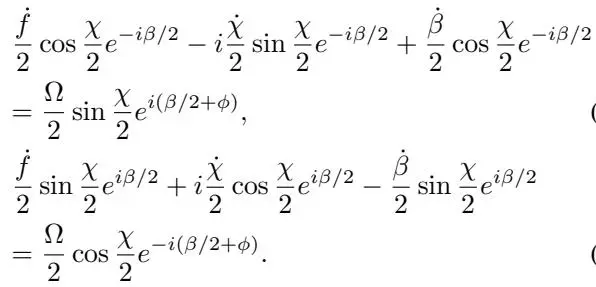
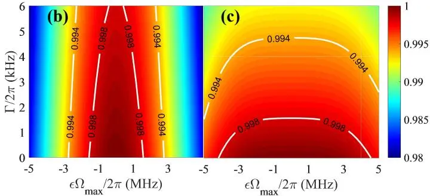

# Nonadiabatic geometric quantum computation with optimal control on superconducting circuits
## 超导电路上最优控制非绝热几何量子计算

**Jing Xu, Sai Li, Tao Chen, Zheng-Yuan Xue**

华南师范大学 · 广东省量子工程与量子材料重点实验室

*Frontiers of Physics* **15**, 41601 (2020) | [理论方案，含主方程数值模拟]

## 摘要

量子门是实现量子计算机的基本构建块，但极其脆弱。实现高保真度的鲁棒量子门是量子操控的终极目标。本文提出了超导电路上的非绝热几何量子计算方案，该方案结合了几何相位的鲁棒优势与最优控制技术。具体而言：transmon 量子比特上的任意几何单量子比特门通过时变振幅和相位的共振微波场驱动实现；非平凡的双量子比特几何门通过两个电容耦合 transmon 的频率调制实现。主方程数值模拟表明，在可达到的退相干参数下，NOT 门保真度达 99.87%，Phase 门达 99.80%。引入最优控制后，门对静态系统误差的鲁棒性进一步提升。

---

## 核心方案

### 反演设计（Inverse Engineering）

与传统方案（先设定脉冲、再计算演化）不同，Xu 2020 的核心创新是**反演设计**：先指定量子态在 Bloch 球上的目标演化路径，再反过来求解所需的微波脉冲形状。

用球坐标参数化演化态 $|\psi(t)\rangle$（极角 $\chi(t)$，方位角 $\beta(t)$），则所需的微波参数可通过以下关系反演：

$$
\begin{aligned}
\Omega(t) &= -\frac{\dot{\chi}(t)}{\sin(\beta(t) + \phi(t))}, \\
\phi(t) &= \arctan\left(\frac{\dot{\chi}(t)}{\dot{\beta}(t)} \cot\chi(t)\right) - \beta(t). \tag{7}
\end{aligned}
$$

### 四段路径消除动力学相位

为实现绕 X 轴的几何旋转 $e^{i\gamma\sigma_x}$，单回路演化路径被分为**四个等长段**：

$$
\begin{aligned}
t \in [0, \tau/4]: &\quad \chi_1(t) = \pi[1 + \sin^2(2\pi t/\tau)]/2, \quad \beta_1(0) = 0, \\
t \in [\tau/4, \tau/2]: &\quad \chi_2(t) = \pi[1 + \sin^2(2\pi t/\tau)]/2, \quad \beta_2(\tau/4) = \beta_1(\tau/4) - \gamma, \\
t \in [\tau/2, 3\tau/4]: &\quad \chi_3(t) = \pi[1 - \sin^2(2\pi t/\tau)]/2, \quad \beta_3(\tau/2) = \beta_2(\tau/2), \\
t \in [3\tau/4, \tau]: &\quad \chi_4(t) = \pi[1 - \sin^2(2\pi t/\tau)]/2, \quad \beta_4(3\tau/4) = \beta_3(3\tau/4) + \gamma.
\end{aligned} \tag{8}
$$

$\beta(t)$ 在 $t=\tau/4$ 和 $t=3\tau/4$ 处的跳跃（saltation）产生纯几何相位 $\gamma_G = \gamma$，而动力学相位在循环终点精确为零：

$$\gamma_D = \frac{1}{2} \sum_{j=1}^{4} \int_{(j-1)\tau/4}^{j\tau/4} \frac{\dot{\beta}_j(t) \sin^2\chi_j(t)}{\cos\chi_j(t)} dt = 0. \tag{9}$$

绕 Z 轴的旋转 $e^{i\gamma\sigma_z}$ 只需**两段**路径即可实现类似效果。

### DRAG 修正与主方程模拟

由于 transmon 的弱非谐性（anharmonicity $\alpha = 2\pi \times 300$ MHz），$\Omega(t)$ 过大会导致向 $|2\rangle$ 态的泄漏。方案引入 **DRAG（Derivative Removal by Adiabatic Gate）修正**来抑制泄漏：

$$H_{\mathrm{leak}}(t) = -\alpha |2\rangle\langle 2| + \left[\sqrt{2}\Omega(t) e^{i\phi(t)} |1\rangle\langle 2| + \mathrm{H.c.}\right]. \tag{12}$$

使用 Lindblad 主方程在以下参数下评估门性能：

| 参数 | 数值 |
|------|------|
| 退相干率 $\Gamma_1 = \Gamma_2 = \Gamma$ | $2\pi \times 2$ kHz |
| 非谐性 $\alpha$ | $2\pi \times 300$ MHz |
| 最大 Rabi 频率 $\Omega_{\max}$ | $2\pi \times 16$ MHz |
| NOT 门循环时间 | 102 ns |
| Phase 门循环时间 | 125 ns |

数值模拟结果：

| 门 | 初态保真度 | 门保真度 $F^G$ |
|-----|-----------|---------------|
| NOT $(e^{i\pi\sigma_x/2})$ | 99.87% | 99.87% |
| Phase $(e^{-i\pi\sigma_z/8})$ | 99.80% | 99.84% |

图 2：NOT 和 Phase 门的脉冲形状 $\Omega(t)$、$\phi(t)$ 及其态布居/保真度演化。主方程模拟在可达实验参数下进行。

### 最优控制（OCT）增强鲁棒性

方案进一步与最优控制理论（OCT）结合。针对静态系统误差 $\Omega(t) \to (1+\epsilon)\Omega(t)$，使用微扰理论计算概率振幅 $P$：

$$P = |\langle \psi(\tau/2) | \psi_\epsilon(\tau/2) \rangle |^2 = 1 + \tilde{O}_1 + \tilde{O}_2 + \dots \tag{13}$$

通过调节无量纲参数 $\eta \in [0,1]$（权衡理想脉冲形状与 OCT 修正脉冲形状），可以在保真度和鲁棒性之间取得平衡。

图 3：无优化（$\eta=0$）与有优化（$\eta=1$）的 Phase 门保真度对比。引入 OCT 后，门对系统误差 $\epsilon\Omega_{\max}$ 的鲁棒性显著增强。

### 双量子比特几何门

两个电容耦合的 transmon（耦合强度 $g$）通过频率调制实现有效共振耦合。当调制频率 $\nu$ 匹配量子比特频率差时，产生几何双量子比特门。该方案可直接生成受控 Z（CZ）门。

---

## 与实验论文的对比

| | Zhao 2021 (实验) | Xu 2020 (本文，理论) |
|---|---|---|
| 路径设计 | 固定 3 段切片形 | **反演设计（任意路径）** |
| 优化自由度 | 无 | **OCT 可调（$\eta \in [0,1]$）** |
| 泄漏抑制 | 仅用 2 能级避免 | **DRAG 主动抑制** |
| 双量子比特门 | 未实现 | **有方案（频率调制耦合）** |
| 保真度 | 99.6-99.7%（实测） | 99.8%（模拟，含退相干） |


反演设计使得**任意**几何门都可以通过同一套框架生成，不再需要为每个门单独设计路径。OCT 的引入提供了额外的鲁棒性调谐维度，这是固定路径方案无法实现的。


---

## 阅读笔记

### 一句话概括

通过反演设计从目标路径求解脉冲形状，结合 DRAG 泄漏抑制和 OCT 鲁棒性优化，在超导 transmon 上实现了高保真度（99.8%+）的几何单/双量子比特门方案。

### 核心论证链

1. 几何门具有内在鲁棒性，但传统方案路径固定 → 需要灵活的设计框架
2. **反演设计**：先定路径 $(\chi(t), \beta(t))$，再求解 $(\Omega(t), \phi(t))$ → Eq. (7)
3. 用**四段路径分裂**（X 旋转）和**两段路径分裂**（Z 旋转）消除动力学相位
4. **DRAG 修正**抑制 transmon 弱非谐性导致的 $|2\rangle$ 态泄漏
5. **OCT 优化**参数 $\eta$ 进一步增强对系统误差的鲁棒性
6. 主方程模拟验证：NOT 99.87%，Phase 99.84%
7. 扩展到双量子比特门：电容耦合 + 频率调制

### 批判性思考

1. **理论 vs 实验差距**：模拟中 $\Gamma = 2\pi \times 2$ kHz 对应 $T_1 \approx 80\ \mu\mathrm{s}$，比 Zhao 2021 实验中实际使用的 Xmon（$T_1 \sim 30-50\ \mu\mathrm{s}$）更乐观。实际实现中保真度大概率低于 99.8%。
2. **OCT 的局限性**：OCT 只针对静态系统误差优化，对 $1/f$ 噪声、高频 TLS 噪声等实际退相干来源的效果未验证。
3. **双量子比特门缺乏详细数值验证**：文中双量子比特部分相对简略，没有给出类似单量子比特门的主方程模拟保真度数据。
4. **与 Zhao 2021 的互补性**：Zhao 2021 实验虽然报告了更高保真度（RB 99.7%），但方案更简单（仅用 2 能级 + 固定路径）；Xu 2020 的方案虽然更灵活，但尚未在实验上验证。

### 关键公式速查

| 公式 | 含义 | 编号 |
|------|------|------|
| $\Omega(t) = -\dot{\chi}/\sin(\beta+\phi)$ | 反演 Rabi 频率 | Eq. (7) |
| $\phi = \arctan(\dot{\chi}/\dot{\beta} \cdot \cot\chi) - \beta$ | 反演微波相位 | Eq. (7) |
| $\sum_{j=1}^4 \int \dot{\beta}_j \sin^2\chi_j / \cos\chi_j\ dt = 0$ | 四段路径动力学相位消除条件 | Eq. (9) |
| $H_{\mathrm{leak}} = -\alpha|2\rangle\langle 2| + \sqrt{2}\Omega e^{i\phi}|1\rangle\langle 2| + \mathrm{H.c.}$ | DRAG 泄漏抑制 | Eq. (12) |
| $P = |\langle\psi(\tau/2)\vert\psi_\epsilon(\tau/2)\rangle|^2$ | OCT 鲁棒性度量 | Eq. (13) |

### 局限性

- 纯理论方案，未在实验上验证
- 双量子比特门部分缺乏详细的保真度模拟数据
- 模拟中使用的退相干参数偏乐观（$\Gamma = 2\pi \times 2$ kHz）
- OCT 优化仅针对静态系统误差，未覆盖所有噪声类型

### 延伸阅读

- **[Zhao et al. 2021, Sci. China](/papers/zhao2021-xmon-geometric-gates/)** — 同一理论框架的实验实现（固定路径版，仅用 2 能级）
- **[Ding et al. 2022, QST](/papers/ding2022-path-optimized/)** — 路径优化版：进一步缩短门时间
- **[Liang & Xue 2024, PRApplied](/papers/liang2024-ondemand-geometric-gates/)** — 按需轨迹版：任意路径生成
- **[Abdumalikov et al. 2013, Nature](/papers/abdumalikov2013-nonabelian-geometric-gates/)** — 非阿贝尔方案的实验先驱

### 术语对照

| 中文 | 英文 | 含义 |
|------|------|------|
| 反演设计 | inverse engineering | 从目标路径反求脉冲形状 |
| 最优控制 | optimal control theory (OCT) | 理论框架，优化脉冲以增强鲁棒性 |
| DRAG | Derivative Removal by Adiabatic Gate | 抑制弱非谐系统中泄漏的修正技术 |
| saltation | saltation | $\beta(t)$ 的跳跃不连续点，产生几何相位 |
