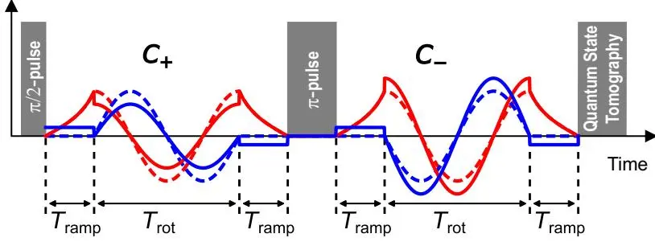
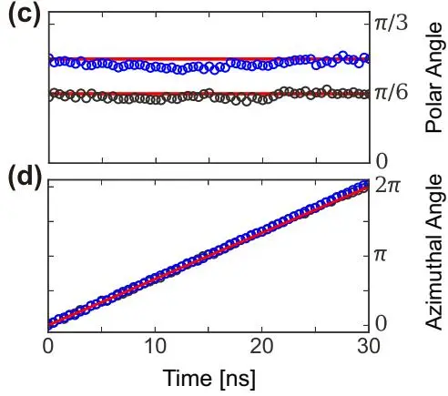
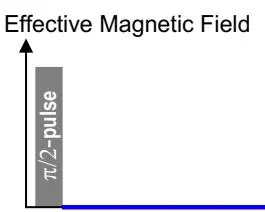
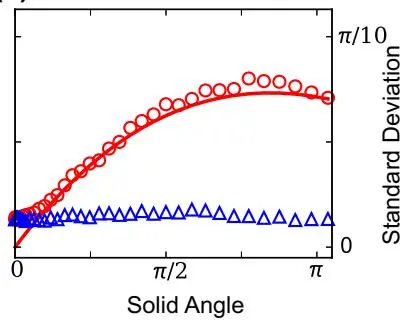
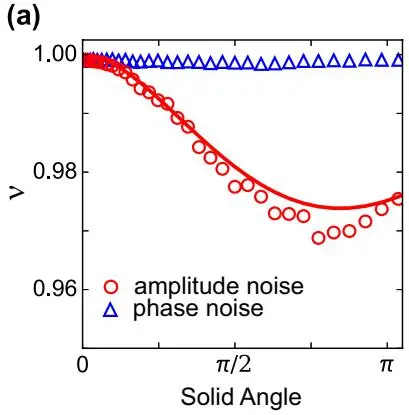

# Measuring the Berry Phase in a Superconducting Phase Qubit by a Shortcut to Adiabaticity
## 通过绝热捷径在超导相位量子比特中测量 Berry 相位

**Zhenxing Zhang, Tenghui Wang, Liang Xiang, Jiadong Yao, Jianlan Wu, Yi Yin**

浙江大学物理系 · 协同创新中心

*Physical Review A* **95**, 042345 (2017)

## 摘要

通过在参考控制场上补充反绝热（counter-diabatic）场，在超导相位量子比特中实现了"绝热捷径"（shortcut to adiabaticity, STA）协议。在短时间尺度上测得的 Berry 相位与绝热回路中的理论结果吻合良好。实验提取了量子比特矢量的轨迹，通过累积立体角（solid angle）的积分验证了 Berry 相位。将经典噪声引入总控制场的振幅或相位后，Berry 相位的均值几乎不受影响，而振幅噪声下的标准差可由解析表达式描述。

---

## 背景与动机

### 为什么需要 STA？

Berry 相位是量子力学中几何结构最优雅的体现。传统上，要测量 Berry 相位必须满足绝热条件——哈密顿量变化极慢，系统始终保持在瞬时本征态上。然而在实际实验中：

1. **退相干限制**：超导量子比特的 $T_1$ 和 $T_2$ 通常为百纳秒级，绝热操作所需的时间（$\gtrsim 1\mu s$）远超退相干时间
2. **量子信息处理需求**：大规模量子器件要求快速门操作来提高效率

**Shortcut to adiabaticity (STA)** 通过添加反绝热哈密顿量 $H_{\mathrm{cd}}(t)$ 来消除快速演化中的非绝热跃迁：

$$
H_{\mathrm{cd}}(t) = i\hbar \sum_n \big[ |\partial_t n(t)\rangle\langle n(t)| - \langle n(t)|\partial_t n(t)\rangle |n(t)\rangle\langle n(t)| \big] \tag{1}
$$

对于每个瞬时本征态 $|n(t)\rangle$，$H_{\mathrm{cd}}(t)$ 抑制了向其他本征态的非绝热跃迁。系统在总哈密顿量 $H_{\mathrm{tot}}(t) = H_0(t) + H_{\mathrm{cd}}(t)$ 驱动下可快速演化，同时保持 Berry 相位不变。

### 与 Leek 2007 和 Filipp 2009 的比较

| | Leek 2007 (Science) | Filipp 2009 (PRL) | 本文 (2017) |
|---|---|---|---|
| 量子比特类型 | Cooper pair box | transmon | **phase qubit** |
| 演化方式 | 绝热 | 绝热 | **非绝热 (STA)** |
| 旋转时间 | $\sim$散点数据 | $\sim$散点数据 | **20-60 ns（系统可调）** |
| 噪声研究 | 无 | 研究了慢噪声的稳定性 | **系统性引入振幅/相位噪声，解析描述** |

本文是**首次将 STA 协议用于超导量子比特的 Berry 相位测量**，也是首次系统研究驱动噪声对几何相位影响的定量实验。

---

## 实验方案

### 器件参数

| 参数 | 数值 |
|------|------|
| 量子比特类型 | 超导 phase qubit |
| 共振频率 $\omega_{10}/2\pi$ | 5.7 GHz |
| 弛豫时间 $T_1$ | 270 ns |
| 自旋回波退相干时间 $T_2^{\mathrm{echo}}$ | 450 ns |
| 失谐 $\Delta_0/2\pi$ | 7 MHz |
| 旋转时间 $T_{\mathrm{rot}}$ | 20–60 ns |
| 基温 | $\sim$10 mK |

Phase qubit 的 $T_1 = 270$ ns 远短于 transmon（$\sim$7 μs），绝热操作几乎不可能。但快速 STA 协议完美解决了这个问题。

### 自旋回波测量方案

实验使用自旋回波（spin-echo）序列来消除动力学相位，只保留几何相位：

1. $\pi/2$ 脉冲制备叠加态
2. **退相位部分**：ramp-up + $\mathcal{C}_+$ 旋转 + ramp-down
3. $\pi$ 重聚焦脉冲（交换 $|\uparrow\rangle$ 和 $|\downarrow\rangle$ 态）
4. **重相位部分**：ramp-up + $\mathcal{C}_-$ 旋转（反向）+ ramp-down



在回波时刻，动力学相位被抵消，Berry 相位加倍：$\gamma = \mp 2S$（$S = 2\pi(1-\cos\theta_0)$ 为立体角）。

反绝热磁场由 $B_{\mathrm{cd}}(t) = B_0(t) \times \dot{B}_0(t) / |B_0(t)|^2$ 给出，垂直于参考磁场。

---

## 主要实验结果

### Berry 相位测量

图 1：(b) 末态量子比特 x 分量随立体角 $S$ 和旋转时间 $T_{\mathrm{rot}}$ 的变化。(d-e) Berry 相位测量：$\gamma = -kS$（$k = 2.04 \pm 0.02$），与理论预测 $\gamma = -2S$ 高度一致。$\mathcal{C}_{+-}$ 和 $\mathcal{C}_{-+}$ 两种过程给出符号相反的线性关系。

**核心结果**：
- 在 $T_{\mathrm{rot}} = 20-60$ ns 时间尺度上（远短于绝热所需的 $\gtrsim 1\mu s$），测得的 Berry 相位斜率 $k = 2.04 \pm 0.02$，与理论 $k=2$ 高度吻合
- Berry 相位几乎不随 $T_{\mathrm{rot}}$ 变化——**这是 STA 协议的特征性质**
- 两种旋转方向（$\mathcal{C}_{+-}$ 和 $\mathcal{C}_{-+}$）给出对称的相反结果

### 量子比特轨迹追踪

图 2：$|s_\uparrow(t)\rangle$ 态在 Bloch 球上的演化轨迹。对 $\theta_0 = \pi/6$ 和 $\pi/4$ 两种情况，（b-d）展示了半径、极角和方位角的时间演化。实验点（黑/蓝色圆圈）与理想演化（实线）高度吻合。

实验通过每 0.5 ns 中断旋转并进行量子态层析（QST），直接追踪了 $|s_\uparrow(t)\rangle$ 的 Bloch 矢量轨迹。积分得到的立体角 $S(\theta_0 = \pi/6) = 0.788$、$S(\theta_0 = \pi/4) = 1.72$，与理论值 $S = 2\pi(1-\cos\theta_0)$ 一致。


首次在超导量子比特中同时实现了 Berry 相位的直接测量（通过 QST）和几何验证（通过 Bloch 轨迹积分），两种方法给出了一致的结果。


### 噪声对 Berry 相位的影响

在控制场的振幅 $\Omega(t)$ 和相位 $\phi(t)$ 中引入 Ornstein-Uhlenbeck 噪声（$\Gamma = 10$ MHz 带宽，$c_\Omega$ 和 $c_\phi$ 为约化噪声强度）：

图 3：(b-c) 振幅噪声和相位噪声下 Berry 相位的分布直方图（$c_\Omega = c_\phi = 0.1$，300 条轨迹）。(d) 均值 $\bar{\gamma}$ 几乎不变。(e) 振幅噪声的标准差 $\sigma_\Omega$ 与解析表达式 Eq. (2) 吻合。

图 3(d-e) 替代视角：噪声下的 Berry 相位均值与标准差。

**噪声鲁棒性的关键发现**：

1. **相位噪声影响极弱**：$\sigma_\phi \sim 0.02\pi$，因为 Berry 相位取决于路径几何而非旋转速度
2. **振幅噪声可被解析描述**：
   $$\sigma_{\Omega} = 2\sqrt{2} c_{\Omega} \pi \sin^2\theta_0 \cos\theta_0 \frac{\sqrt{\Gamma T_{\mathrm{rot}} - 1 + e^{-\Gamma T_{\mathrm{rot}}}}}{\Gamma T_{\mathrm{rot}}} \tag{2}$$
3. **相干性保持**：对于 $c_\Omega < 0.2$，相干参量 $\nu = |\langle e^{i\gamma}\rangle|$ 保持较大；$c_\Omega > 0.5$ 后显著下降

图 4：相干参量 $\nu$ 对固体角（a）和噪声强度（b）的依赖。$\nu_\Omega = \exp(-\sigma_\Omega^2/2)$ 与 Eq. (2) 解析结果吻合。

---

## 结论

本文在超导 phase qubit 上实现了 STA 协议，核心贡献：

1. **快速测量**：在 $20-60$ ns 内完成 Berry 相位测量（绝热需要 $\gtrsim 1\mu s$）
2. **几何验证**：同时通过 QST 和 Bloch 轨迹积分两种独立方法验证
3. **噪声定量研究**：首次系统研究了驱动振幅/相位噪声对 Berry 相位的影响，给出了解析表达式

---

## 阅读笔记

### 一句话概括

用反绝热驱动（STA）在超导 phase qubit 上以 20-60 ns 的时间尺度快速测量了 Berry 相位，并系统研究了经典噪声的影响。

### 核心论证链

1. 绝热操作在 phase qubit 的 $T_1=270$ ns 面前不可行 → 需要 STA
2. STA 通过反绝热场 $H_{\mathrm{cd}}$ 消除非绝热跃迁 → 快速演化 + 保持 Berry 相位
3. 自旋回波方案消除动力学相位 → 只留几何相位
4. 两种独立方法验证：QST 测相位 + Bloch 轨迹积分
5. 系统引入振幅/相位噪声 → 均值不变，振幅噪声标准差有解析表达式

### 批判性思考

1. **phase qubit 选择的理由**：phase qubit 的 $T_1=270$ ns 极短，这正是 STA 最有优势的场景——但这也意味着门保真度天然受限于退相干
2. **与 Leek 2007 的互补性**：Leek 用 transmon + adiabatic，本文用 phase qubit + STA，形成方法论上的完整覆盖
3. **噪声模型的局限性**：只研究了经典 O-U 噪声，量子噪声（如 TLS 引起的高频噪声）未涉及

### 关键公式速查

| 公式 | 含义 |
|------|------|
| $H_{\mathrm{cd}} = i\hbar\sum_n[\vert\partial_t n\rangle\langle n\vert - \langle n\vert\partial_t n\rangle\vert n\rangle\langle n\vert]$ | 反绝热哈密顿量 |
| $\gamma = \mp 2S$（$S = 2\pi(1-\cos\theta_0)$） | 自旋回波中的 Berry 相位 |
| $B_{\mathrm{cd}} = B_0 \times \dot{B}_0 / \vert B_0\vert^2$ | 反绝热磁场的构造公式 |
| $\sigma_\Omega$ (Eq. 2) | 振幅噪声下 Berry 相位标准差的解析表达式 |

### 延伸阅读

- **[Leek et al. 2007, Science](/papers/berry-phase-solid-state-qubit/)** — 本图书馆有笔记：首次固态 Berry 相位观测（adiabatic）
- **[Filipp et al. 2009, PRL](https://doi.org/10.1103/PhysRevLett.102.030404)** — Berry 相位在 transmon 上的稳定性研究
- **[Abdumalikov et al. 2013, Nature](/papers/abdumalikov2013-nonabelian-geometric-gates/)** — 本图书馆有笔记：非阿贝尔几何门
- **Berry 2009, J. Phys. A** — STA 的原始理论框架（transitionless quantum driving）
- **[Berger et al. 2013, PRL](https://doi.org/10.1103/PhysRevLett.111.190501)** — NV center 上的几何门实验
