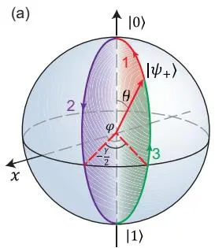
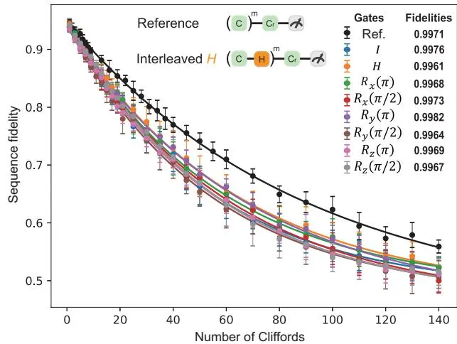
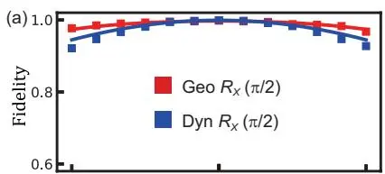

# Experimental realization of nonadiabatic geometric gates with a superconducting Xmon qubit
## 超导 Xmon 量子比特非绝热几何门的实验实现

**PeiZi Zhao, ZhangJingZi Dong, ZhenXing Zhang, GuoPing Guo, DianMin Tong, Yi Yin**

山东大学 · 浙江大学 · 中科大 · 本源量子

*Sci. China-Phys. Mech. Astron.* **64**, 250362 (2021)

## 摘要

几何相位仅依赖于演化路径而独立于演化细节，因此具有内在的噪声鲁棒性。已有的非绝热 holonomic 单量子比特门在 transmon 上使用三个最低能级，但第二激发态较短的相干时间限制了门的保真度。本文在超导 Xmon 量子比特的两个最低能级上实现了基于非绝热 Abelian 几何相位的单量子比特门，避免了辅助能级的限制。通过量子过程层析（QPT）和随机基准测试（RB），测得的平均门保真度分别达到 99.6% 和 99.7%。

---

## 核心方案

### 切片形演化路径（orange-slice-shaped loop）

方案将演化周期分成三段，每段使用不同微波相位参数的哈密顿量：

$$H_1(t) = \Omega_R(t) e^{-i(\varphi - \pi/2)} |0\rangle\langle 1| + \mathrm{H.c.} \tag{3}$$
$$H_2(t) = \Omega_R(t) e^{-i(\varphi - \gamma/2 + \pi/2)} |0\rangle\langle 1| + \mathrm{H.c.} \tag{4}$$

两个正交基 $|\psi_\pm\rangle$ 沿 Bloch 球上的测地线演化，动力学相位为零，只积累纯几何相位 $\mp \gamma/2$。$\gamma$ 正比于切片形回路所围的立体角。

### 与 Abdumalikov 2013 的对比

| | Abdumalikov 2013 | 本文 (2021) |
|---|---|---|
| 几何相位类型 | 非阿贝尔（U(2)） | **阿贝尔（U(1)）** |
| 使用能级 | 3 个（含 $|e\rangle$） | **2 个（仅 $|0\rangle$,$|1\rangle$）** |
| 保真度 | 95-97% | **99.6-99.7%** |
| 量子比特 | transmon | **Xmon** |

**关键优势**：仅用两个最低能级，彻底避免了 transmon 第二激发态短相干时间的限制。

---

## 主要实验结果

图 1：(a) 切片形演化路径，(b) 实验脉冲序列。

图 2：几何门 $R_x(\pi/2)$ 的过程矩阵。实部（左）和虚部（右）均接近理论值。

图 3：随机基准测试（RB）结果。几何门（红）和动力学门（蓝）的 RB 序列保真度对比。

- **QPT 平均保真度**：$F = 99.6\%$（$R_x(\pi/2)$、$R_y(\pi/2)$、Hadamard 等门）
- **RB 平均保真度**：$F = 99.7\%$
- **噪声鲁棒性验证**：在脉冲振幅误差下，几何门性能**优于**对应的动力学门

---

## 阅读笔记

### 一句话概括

仅用 Xmon 两个最低能级实现非绝热 Abelian 几何门，保真度 99.6-99.7%，证明了几何门优于动力学门。

### 核心论证链

1. Abdumalikov 2013 的非阿贝尔方案需要 3 个能级 → 第二激发态 $T_1$ 短限制了保真度
2. 阿贝尔几何相位只需 2 个能级 → 避免了这个问题
3. 切片形路径设计 → 纯几何演化（动力学相位为零）
4. 实验验证：QPT 99.6% + RB 99.7% + 振幅误差下优于动力学门

### 关键公式

| 公式 | 含义 |
|------|------|
| $\gamma = \pm S/2$（$S$ 为立体角） | 阿贝尔几何相位 = 立体角的一半 |
| $U(\tau)|\psi_\pm\rangle = e^{\mp i\gamma/2}|\psi_\pm\rangle$ | 几何门对计算基的作用 |
| $\gamma_{d_\pm} = 0$ | 动力学相位严格为零 |

### 延伸阅读

- **[Abdumalikov et al. 2013, Nature](/papers/abdumalikov2013-nonabelian-geometric-gates/)** — 非阿贝尔方案（3 能级）
- **[Zhang et al. 2017, PRA](/papers/zhang2017-sta-berry-phase/)** — 同组 Yi Yin 的 STA Berry 相位测量
